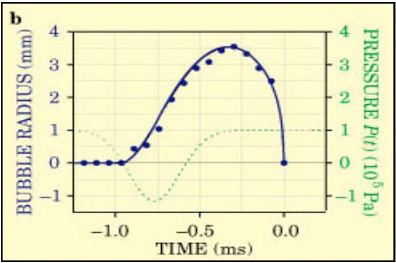
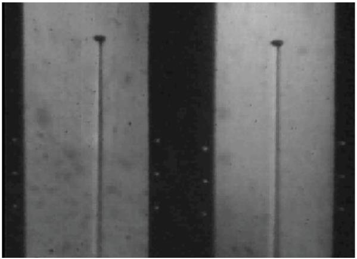
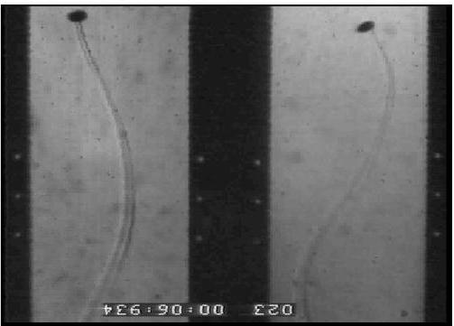

## Solutions:

S1. The condition of the survival and growth for AB appeared in the water volume at height $h < H$ is the competiveness of the pressures acting inside and outside (atmospheric, hydrostatic and surface tension) on the bubble surface:

$$
P _ { a b } = P _ { i n } \geq P _ { o u t } \equiv P _ { 0 } + g \rho _ { w } \cdot ( H - h ) + \frac { 2 \sigma } { R _ { a b } } ,
$$

S2. The Archimedes lifting force is

$$
F _ { A } = g \cdot \left( \rho _ { w } - \rho _ { a b } \right) \frac { 4 \pi R _ { a b } ^ { 3 } } { 3 } \approx g \cdot \rho _ { w } \frac { 4 \pi R _ { a b } ^ { 3 } } { 3 }
$$

where $\rho _ { a b } \ll \rho _ { w }$ - the air density in bubble.
For $r _ { a b } \ll R _ { a b }$ the Laplace surface tension force plays main role in holding down the bubble:

$$
F _ { \text {down } } = \sigma \cdot 2 \pi r _ { a b }
$$

The stability of the AB at the bottom means:

$$
F _ { A } = F _ { \text {down } }
$$

At more heating the lifting force overbalances the holding force:

$$
g \frac { 4 \pi R _ { a b } ^ { 3 } } { 3 } \rho _ { w } > \sigma \cdot 2 \pi r _ { a b }
$$

and AB is detached from the bottom and floats (Fig.3).
S3. The air and vapor pressures inside compensate the outer pressure for a stable bubble.

$$
P _ { \text {vapor } } + P _ { \text {air } } = P _ { 0 } + g \rho _ { w } H + \frac { 2 \sigma } { R _ { b } }
$$

The mass of air inside AB may be found from the Clayperon-Mendeleev equation

$$
m _ { \text {air } } = \frac { \mu _ { \text {air } } P _ { \text {air } } V } { R T }
$$

The vapor mass is

$$
m _ { \text {vapor } } = \rho _ { \text {vapor } } \cdot V
$$

Then the ratio is

$$
\xi \equiv \frac { m _ { \text {air } } } { m _ { \text {vapor } } } = \frac { \mu _ { \text {air } } P _ { \text {air } } } { R T \rho _ { v } } = \frac { \mu _ { \text {air } } } { R T \rho _ { v } } \left( P _ { 0 } + g \rho _ { w } H + \frac { 2 \sigma } { R _ { b } } - P _ { \text {vapor } } \right)
$$

For $T = 20 ^ { \circ } \mathrm { C } = 293 \mathrm {~K}$ and $R _ { b } = 0.5 \mathrm {~mm}$ :

$$
\xi = \frac { 0.029 } { 8.31 \cdot 293 \cdot 0.0173 } \left( 1.016 \cdot 10 ^ { 5 } + 9.81 \cdot 10 ^ { 3 } \cdot 0.1 + \frac { 2 \cdot 0.0727 } { 0.5 \cdot 10 ^ { - 3 } } - 2.3 \cdot 10 ^ { 3 } \right) \approx 69.2
$$

This bubble consists mostly of air.
For $T = 100 ^ { \circ } C = 373 K$ and $R _ { b } = 1 m m$ :

$$
\xi = \frac { 0.029 } { 8.31 \cdot 373 \cdot 0.596 } \left( 1.016 \cdot 10 ^ { 5 } + 9.81 \cdot 10 ^ { 3 } \cdot 0.1 + \frac { 2 \cdot 0.0588 } { 1 \cdot 10 ^ { - 3 } } - 1.016 \cdot 10 ^ { 5 } \right) \approx 0.017
$$

This bubble consists mostly of saturated vapor.
S4. Consider AB detached from the bottom and uprising in distance $R _ { a b }$ (see Fig.3). During the rise, bubbles induce a displacement of the surrounding fluid in their vicinity, which leads to an added-mass force. The added-mass of a bubble is

$$
M _ { i n v o l } \approx \frac { V _ { a b } \rho _ { w } } { 2 }
$$

The acceleration at the detachment moment is

$$
a _ { \mathrm { det } } = \frac { F _ { A } } { M _ { i n v o l } } = \frac { g V _ { a b } \rho _ { w } } { V _ { a b } \rho _ { w } / 2 } = 2 g
$$

The characteristic "detachment time"

$$
t _ { 1 } = \sqrt { \frac { 2 R _ { a b } } { a _ { \mathrm { det } } } }
$$

defines the duration of the impact to the liquid during the detachment. The liquid begins to vibrate with characteristic frequency

$$
v _ { 1 } = \frac { 1 } { t _ { 1 } } = \sqrt { \frac { g } { R _ { a b } } }
$$

Substituting the date from NAE we estimate the characteristic radius of detaching AB

$$
v _ { 1 } \approx 100 [ \mathrm {~Hz} ] \Rightarrow R _ { a b } \approx 1 \cdot 10 ^ { - 3 } [ \mathrm {~m} ]
$$

S5. The balance of the lifting and confining forces reads

$$
g V _ { a b } \rho _ { w } \approx \sigma \cdot 2 \pi r _ { a b }
$$

Find the typical foundation radius:

$$
r _ { a b } \approx \frac { 2 g \rho _ { w } R _ { a b } ^ { 3 } } { 3 \sigma }
$$

For AB with radius ~1mm we calculate

$$
r _ { a b } \approx \frac { 2 \cdot 9.81 \cdot 10 ^ { 3 } \cdot 10 ^ { - 9 } } { 3 \cdot 0.0725 } [ \mathrm {~m} ] \approx 9.02 \cdot 10 ^ { - 5 } [ \mathrm {~m} ]
$$

S6. Consider collapsing VB during time piece $t _ { 2 }$ (Fig.4). Let's estimate the characteristic frequency of the ultrasonic shock waves. The surrounding water flood the collapsed VB with acceleration a and the Newton equation reads

$$
F _ { \text {collap } } \approx a \cdot \frac { 4 \pi R _ { c b } ^ { 3 } } { 3 } \rho _ { w }
$$

where the acceleration of the water front converging in the center of VB is

$$
a = \frac { 2 R _ { c b } } { t _ { 2 } ^ { 2 } } = 2 R _ { c b } v _ { 2 } ^ { 2 }
$$

The radial pressure on the VB surface is given

$$
\Delta P = \frac { F _ { \text {collap } } } { 4 \pi R _ { c b } ^ { 2 } } = \frac { 2 R _ { c b } ^ { 2 } } { 3 } \rho _ { w } v _ { 2 } ^ { 2 }
$$

Particularly, for the obtained data of the NAE experiment we obtain

$$
R _ { c b } = \frac { 1 } { v _ { 2 } } \sqrt { \frac { 3 \Delta P } { 2 \rho _ { w } } }
$$

Particularly,

$$
v _ { 2 } \approx 1 [ k H z ] , \Delta P = 3 [ k P d ] \Rightarrow R _ { c b } \approx 3 [ m m ]
$$

This result is in good agreement with another experiment (see Fig.5) where the radius is found about 3.5mm and the collapsing time is about 1ms (i.e., ~1kHz noise).

Fig.5. A vapor bubble collapsing evolution. [M. P. Brenner, S. Hilgenfeldt, D. Lohse, Rev. Mod. Phys. 74, 425 (2002)]

S7. Obviously, the physical nature of MAB is the same as for VB. Then,

$$
\frac { v _ { 3 } } { v _ { 2 } } = \frac { R _ { c b } } { R _ { m a b } } \Rightarrow R _ { m a b } = R _ { c b } \frac { 1 [ \mathrm { kHz } ] } { 35 \div 60 [ \mathrm { kHz } ] } \approx \frac { 3 [ \mathrm {~mm} ] } { 35 \div 60 } \approx 0.05 \div 0.086 [ \mathrm {~mm} ]
$$

S8. A bubble detached from the bottom is hoisted under the influence of Archimedes force. The water resistant force depends on the nature of the streamline flow (Figs.1,6,7).
Fig. 6 The rectilinear air bubble trajectory ( $\mathrm { R } =$ 0.69mm) rising from the bottom. On the left the XZ view and on the right the YZ view. The black areas are part of the reference system outside the water tank. [Benjamin(1987), A.de Vries (2001)]

But for a bubble with radius about 1mm the emersion laminar velocity becomes too fast

$$
v _ { \text {lam } } \approx 2.2 [ \mathrm {~m} / \mathrm { s } ]
$$

and the bubble passes the 10cm distance to the surface for 0.045 second !!!. It is obviously wrong. Therefore, the Stokes formula is not applicable for AB and VB rising from the bottom.

S9. As a path instability sets in, a bubble can uprise by either zigzag or spiral (Fig.8).

Fig. 7 The trajectory of a spiralling bubble in two perpendicular views, XZ and $\mathrm { YZ } ( \mathrm { R } = 1.1 \mathrm {~mm} )$
[Benjamin(1987), Antoine de Vries (2001)].

Obviously, the lifting force is

$$
F _ { A } = \frac { 4 \pi R _ { v b } ^ { 3 } } { 3 } g \rho _ { w }
$$

During its uprising in distance ' h ' the bubble removes a water portion with mass:

$$
M _ { t u r b } = \rho _ { w } h \cdot \pi R _ { v b } ^ { 2 }
$$

and performs a work (transfers kinetic energy)

$$
W _ { \text {dissip } } = \frac { M _ { \text {turb } } v _ { \text {turb } } ^ { 2 } } { 2 }
$$

Then, we estimate the dissipative force

$$
F _ { \text {dissip } } = \frac { W _ { \text {dissip } } } { h } = \frac { M _ { \text {turb } } v _ { \text {turb } } ^ { 2 } } { 2 h }
$$

Since VB flows steady without any acceleration, the dissipative (braking) force balances the Archimedes force:

$$
F _ { \text {dissip } } = F _ { A }
$$

Then, the average (for spiral motion) turbulent velocity is

$$
v _ { \text {turb } } \approx \sqrt { \frac { 8 g R _ { v b } } { 3 } }
$$

For a typical radius of uprising AB (~1mm) or collapsing VB (~3mm) we calculate the velocity

$$
v _ { \text {turb } } \approx \sqrt { \frac { 8 \cdot 10 \cdot ( 1 \div 3 ) \cdot 10 ^ { - 3 } } { 3 } } [ \mathrm {~m} / \mathrm { s } ] \approx ( 0.16 \div 0.28 ) [ \mathrm { m } / \mathrm { s } ]
$$

The time required to pass a distance $\mathrm { H } \sim 10 \mathbf { c m }$ :

$$
t _ { \text {turb } } > \frac { H } { v _ { \text {turb } } } \approx \frac { 0.1 } { ( 0.16 \div 0.28 ) } [ s ] \approx ( 0.35 \div 0.62 ) [ s ]
$$

This is a quite reasonable result and the bubbles mostly elevate under the turbulence flow law.

[Marking Scheme] Tea Ceremony and Physics of Bubbles

| $Q$ | Item | Answer | Points |
| :--- | :--- | :--- | :--- |
| 1 | condition of growth | $P _ { a b } = P _ { i n } \geq P _ { o u t } \equiv P _ { 0 } + g \rho _ { w } \cdot ( H - h ) + \frac { 2 \sigma } { R _ { a b } }$ | 1.0 |
| 2 | condition of detachment | $g \frac { 4 \pi R _ { a b } ^ { 3 } } { 3 } \left( \rho _ { w } - \rho _ { a b } \right) > \sigma \cdot 2 \pi r _ { a b } + \left( P _ { 0 } + g \rho _ { w } H \right) \cdot \pi r _ { a b } ^ { 2 }$ | 1.5 |
| 3 | the ratio | $\xi \equiv \frac { m _ { \text {air } } } { m _ { \text {vapor } } } = \frac { \mu _ { \text {air } } P _ { \text {air } } } { R T \rho _ { v } } = \frac { \mu _ { \text {air } } } { R T \rho _ { v } } \left( P _ { 0 } + g \rho _ { w } H + \frac { 2 \sigma } { R _ { b } } - P _ { \text {vapor } } \right)$ | 1.1 |
|  | the ratio at $\mathrm { T } = 20 \mathrm { C }$ | $\xi = \frac { 0.029 } { 8.31 \cdot 293 \cdot 0.0173 } \left( 1.016 \cdot 10 ^ { 5 } + 9.81 \cdot 10 ^ { 3 } \cdot 0.1 + \frac { 2 \cdot 0.0727 } { 0.5 \cdot 10 ^ { - 3 } } - 2.3 \cdot 10 ^ { 3 } \right) \approx 69.2$ | 0.2 |
|  | the ratio at $\mathrm { T } = 100 \mathrm { C }$ | $\xi = \frac { 0.029 } { 8.31 \cdot 373 \cdot 0.596 } \left( 1.016 \cdot 10 ^ { 5 } + 9.81 \cdot 10 ^ { 3 } \cdot 0.1 + \frac { 2 \cdot 0.0588 } { 1 \cdot 10 ^ { - 3 } } - 1.016 \cdot 10 ^ { 5 } \right) \approx 0.017$ | 0.2 |
| 4 | characteristic frequency | $v _ { 1 } = \frac { 1 } { t _ { 1 } } = \sqrt { \frac { g } { R _ { a b } } }$ | 0.8 |
|  | radius of detaching | $R _ { a b } \approx 1 \cdot 10 ^ { - 3 } [ m ]$ | 0.2 |
| 5 | foundation radius: | $r _ { a b } \approx \frac { 2 g \rho _ { w } R _ { a b } ^ { 3 } } { 3 \sigma }$ | 1.2 |
|  | For radius 1mm | $r _ { a b } \approx \frac { 2 \cdot 9.81 \cdot 10 ^ { 3 } \cdot 10 ^ { - 9 } } { 3 \cdot 0.0725 } [ \mathrm {~m} ] \approx 9.02 \cdot 10 ^ { - 5 } [ \mathrm {~m} ]$ | 0.3 |
| 6 | Radius of collapsing bubble | $R _ { c b } = \frac { 1 } { \nu _ { 2 } } \sqrt { \frac { 3 \Delta P } { 2 \rho _ { w } } }$ | 1.0 |
|  | Numerical value | $v _ { 2 } \approx 1 [ k H z ] , \Delta P = 3 [ k P d ] \Rightarrow R _ { c b } \approx 3 [ m m ]$ | 0.2 |
| 7 | radius | $R _ { \text {mab } } = R _ { c b } \frac { 1 [ k H z ] } { 35 \div 60 [ k H z ] } \approx \frac { 3 [ m m ] } { 35 \div 60 } \approx 0.05 \div 0.086 [ m m ]$ | 0.5 |
| 8 | laminar velocity | $v _ { \text {lam } } \approx 2.2 [ \mathrm {~m} / \mathrm { s } ]$ | 0.6 |
| 9 | turbulent velocity | $v _ { \text {turb } } \approx \sqrt { \frac { 8 g R _ { v b } } { 3 } }$ | 1.0 |
|  | Numerical speed | $v _ { \text {turb } } \approx \sqrt { \frac { 8 \cdot 10 \cdot ( 1 \div 3 ) \cdot 10 ^ { - 3 } } { 3 } } [ \mathrm {~m} / \mathrm { s } ] \approx ( 0.16 \div 0.28 ) [ \mathrm { m } / \mathrm { s } ]$ | 0.1 |
|  | Ascending time | $t _ { \text {turb } } > \frac { H } { v _ { \text {turb } } } \approx \frac { 0.1 } { ( 0.16 \div 0.28 ) } [ s ] \approx ( 0.35 \div 0.62 ) [ s ]$ | 0.1 |
|  | TOTAL |  | 10.0 |
