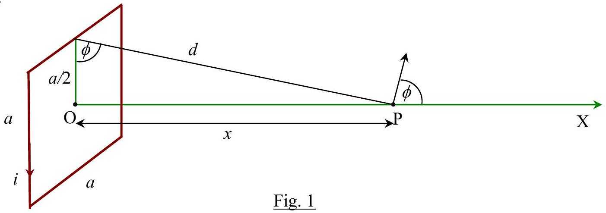
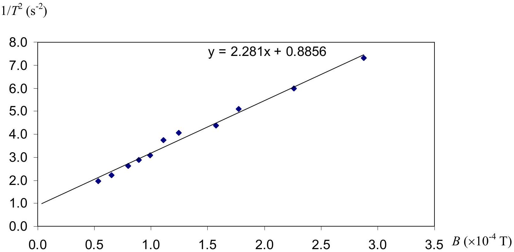

## Problem 1: The Earth's Horizontal Magnetic Field

Section I

At O, the centre of coil, the magnetic field for a single turn is

$$
B _ { \mathrm { O } } = 4 \times \frac { \mu _ { 0 } i } { 2 \pi \left( \frac { a } { 2 } \right) } \frac { ( a / 2 ) } { \sqrt { \left( \frac { a } { 2 } \right) ^ { 2 } + \left( \frac { a } { 2 } \right) ^ { 2 } } } = \frac { 2 \sqrt { 2 } \mu _ { 0 } i } { \pi a } .
$$

At P, the horizontal magnetic field is

$$
\begin{equation*}
B _ { \mathrm { PX } } = 4 \frac { \mu _ { 0 } i } { 2 \pi d } \frac { ( a / 2 ) } { \sqrt { d ^ { 2 } + \left( \frac { a } { 2 } \right) ^ { 2 } } } \cos \phi . \tag{0.3point}
\end{equation*}
$$

From Fig. 1 we have $d = \sqrt { x ^ { 2 } + \left( \frac { a } { 2 } \right) ^ { 2 } }$ and $\cos \phi = \frac { ( a / 2 ) } { \sqrt { x ^ { 2 } + \left( \frac { a } { 2 } \right) ^ { 2 } } }$.
Then, for a square coil of $N$ turns

$$
\begin{equation*}
B _ { p x } = \left( \frac { 2 \mu _ { 0 } i N } { \pi } \right) \cdot \frac { a / 2 } { \sqrt { x ^ { 2 } + 2 \left( \frac { a } { 2 } \right) ^ { 2 } } } \cdot \frac { a / 2 } { \left( x ^ { 2 } + \left( \frac { a } { 2 } \right) ^ { 2 } \right) } \tag{0.2point}
\end{equation*}
$$

or

which becomes $B _ { \mathrm { O } } = \frac { 2 \sqrt { 2 } \mu _ { 0 } i N } { \pi a }$ as $x = 0$.

Section II
Measurements to justify that we can ignore the torsion of the string.

| length of string (cm) | time for 10 oscillations (sec) |
| :--- | :--- |
| 2 | 9.38 |
| 4 | 9.69 |
| 6 | 9.90 |
| 8 | 10.13 |
| 10 | 10.13 |
| 12 | 10.22 |
| 14 | 10.12 |
| 25 | 10.12 |

(Note that this data is from a different magnet used in Section III.)
We can see that the period is constant for length of string $\geq 10 \mathrm {~cm}$.

Section III
The distance between the center of the magnet and the top surface of the platform for Part a), b) and c) is $14.0 \pm 0.5 \mathrm {~cm}$.
a) Coil's magnetic field and Earth's horizontal magnetic field are in the same direction

Since the coil's magnetic field ( $B$ ) and Earth's magnetic field ( $B _ { \mathrm { H } }$ ) are in the same direction, from $T = 2 \pi \sqrt { \frac { I } { m B } }$ we have $\frac { 1 } { T ^ { 2 } } = \beta B + \beta B _ { \mathrm { H } }$ where $\beta = \frac { m } { 4 \pi ^ { 2 } I } \quad$ By plotting linear graph of $\frac { 1 } { T ^ { 2 } }$ and $B$ we can find $B _ { \mathrm { H } }$ from its slope and intercept.

Measurement of 20 oscillations at different distances from coil, we get the result as in table.

| $x ( \mathrm {~cm} )$ |  | time for 20 oscillation (sec) | period $T$ (sec) | $B \left( \times 10 ^ { - 4 } \mathrm {~T} \right)$ | $1 / T ^ { 2 }$ |
| :--- | :--- | :--- | :--- | :--- | :--- |
| 10 | 7.44 | 7.35 | 0.370 | 2.878 | 7.305 |
| 12 | 8.19 | 8.13 | 0.408 | 2.259 | 5.998 |
| 14 | 8.87 | 8.91 | 0.443 | 1.773 | 5.088 |
| 15 | 9.5 | 9.62 | 0.478 | 1.573 | 4.377 |
| 17 | 9.91 | 9.97 | 0.497 | 1.245 | 4.048 |
| 18 | 10.43 | 10.35 | 0.518 | 1.111 | 3.734 |
| 19 | 11.47 | 11.31 | 0.569 | 0.994 | 3.085 |
| 20 | 11.78 | 11.81 | 0.591 | 0.891 | 2.866 |
| 21 | 12.41 | 12.34 | 0.619 | 0.801 | 2.613 |
| 23 | 13.41 | 13.4 | 0.671 | 0.652 | 2.222 |
| 25 | 14.22 | 14.28 | 0.714 | 0.535 | 1.964 |

From graph we have: $\quad$ slope $\beta = ( 2.281 \pm 0.063 ) \times 10 ^ { 4 } \quad \mathrm {~s} ^ { - 2 } / \mathrm { T }$

$$
\text { intercept } \quad \beta B _ { \mathrm { H } } = 0.886 \pm 0.076 \mathrm {~s} ^ { - 2 }
$$

The value of Earth's magnetic field is

$$
B _ { \mathrm { H } } = \frac { 0.8856 } { 2.281 \times 10 ^ { 4 } } = 0.39 \times 10 ^ { - 4 } \mathrm {~T} = 0.39 \pm 0.04 \mathrm { G }
$$

The magnetic moment of magnet is $m = \beta ^ { 2 } 4 \pi ^ { 2 } M \left( \frac { L ^ { 2 } } { 12 } + \frac { r ^ { 2 } } { 4 } \right) = 1.68 \pm 0.09 \mathrm {~A} \mathrm {~m} ^ { 2 }$

b) Earth's magnetic field only

Time for 30 oscillations: 36.28, 36.25, 36.24 s.
Averaged period $T _ { E } = 1.209 \pm 0.001 \mathrm {~s}$

$$
B _ { \mathrm { H } } = \frac { 1 } { T _ { E } ^ { 2 } \beta } = \frac { 1 } { 1.21 ^ { 2 } \times 2.281 \times 10 ^ { - 4 } } = 0.30 \pm 0.01 \mathrm { G }
$$

c) Coil's magnetic field and Earth's horizontal magnetic field are in opposite directions The equilibrium (neutral) position $x _ { 0 } = 31.0 \pm 0.2 \mathrm {~cm}$.

$$
B _ { \mathrm { H } } = \left( \frac { \mu _ { 0 } a ^ { 2 } i N } { 2 \pi } \right) \left[ \frac { 1 } { \left( x _ { 0 } { } ^ { 2 } + \left( \frac { a } { 2 } \right) ^ { 2 } \right) \sqrt { x _ { 0 } { } ^ { 2 } + 2 \left( \frac { a } { 2 } \right) ^ { 2 } } } \right] = 0.31 \pm 0.01 \mathrm { G }
$$
