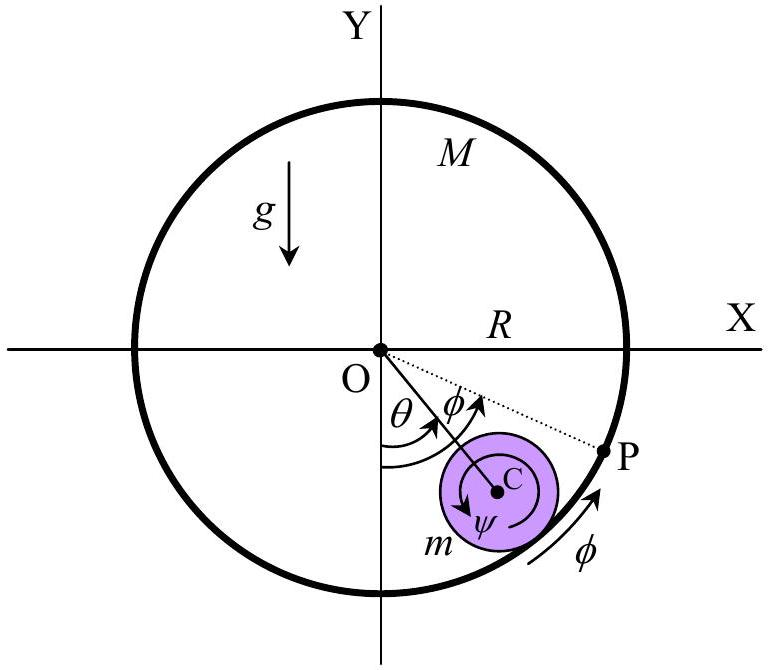
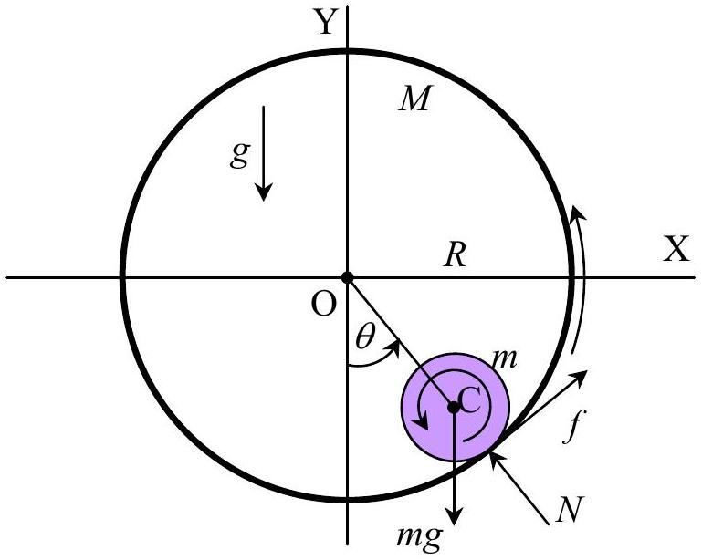
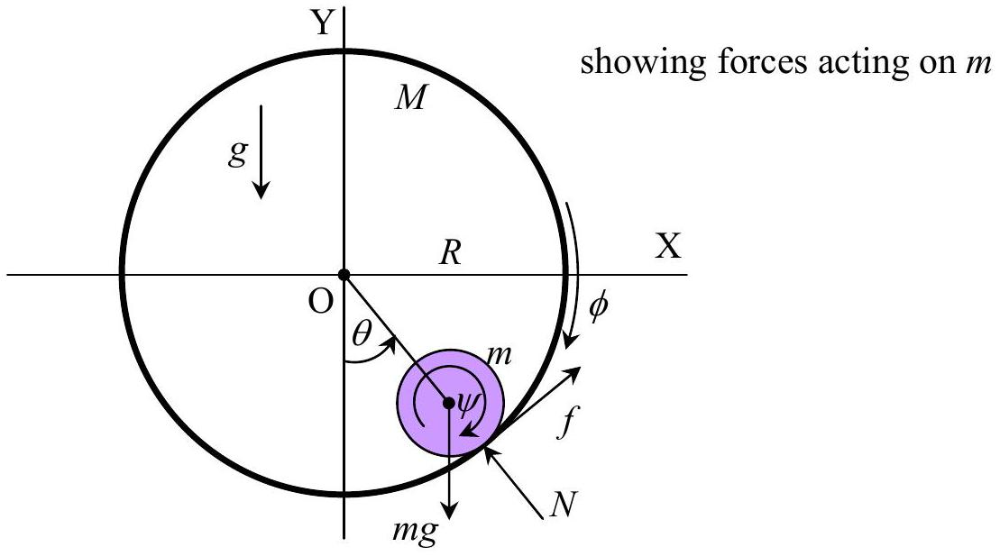
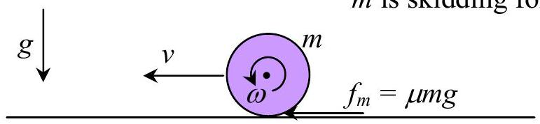

## SOLUTION: Rolling Cylinders

1.1) The point P which is fixed on the surface of $M$ was at the position directly below O at time $t = 0$. Hence $m$ must have rolled through an angle $\frac { \phi R - \theta R } { r }$ radians relative to surface of $M$ in time $t$ during which the line OC has also turned anti-clockwise through an angle $\theta$. Therefore the total angular displacement of $m$ about its centre of mass relative to any fixed reference line in time $t$ is
$$
\begin{equation*}
\psi = \frac { \phi R - \theta R } { r } + \theta = \frac { R } { r } \phi - \left( \frac { R - r } { r } \right) \theta \tag{i}
\end{equation*}
$$
1.2) By differentiating the equation (i) twice with respect to time, we get
$$
\begin{equation*}
\frac { d ^ { 2 } } { d t ^ { 2 } } \psi = \frac { R } { r } \frac { d ^ { 2 } } { d t ^ { 2 } } \phi - \left( \frac { R - r } { r } \right) \frac { d ^ { 2 } } { d t ^ { 2 } } \theta \tag{ii}
\end{equation*}
$$
1.3) 

The equations of motion of centre of mass of $m$ are:

$$
\begin{align*}
& m ( R - r ) \frac { d ^ { 2 } } { d t ^ { 2 } } \theta = f - m g \sin \theta  \tag{iii}\\
& m \left( \frac { d } { d t } \theta \right) ^ { 2 } ( R - r ) = N - m g \cos \theta \tag{iv}
\end{align*}
$$

The equation for the rotation of $m$ about its centre of mass is:

$$
\begin{equation*}
I _ { \mathrm { CM } } \frac { d ^ { 2 } } { d t ^ { 2 } } \psi = I _ { \mathrm { CM } } \left[ \frac { R } { r } \frac { d ^ { 2 } } { d t ^ { 2 } } \phi - \left( \frac { R - r } { r } \right) \frac { d ^ { 2 } } { d t ^ { 2 } } \theta \right] = f r \tag{v}
\end{equation*}
$$

where $I _ { \mathrm { CM } } = \frac { 1 } { 2 } m r ^ { 2 }$.
Equations (iii) and (v) yield:

$$
\begin{equation*}
\left( m + \frac { I _ { \mathrm { CM } } } { r ^ { 2 } } \right) ( R - r ) \frac { d ^ { 2 } } { d t ^ { 2 } } \theta = - m g \sin \theta + \frac { I _ { \mathrm { CM } } R } { r ^ { 2 } } \frac { d ^ { 2 } } { d t ^ { 2 } } \phi \tag{vi}
\end{equation*}
$$

1.4) Here, $\frac { d ^ { 2 } } { d t ^ { 2 } } \phi = 0 , \sin \theta \approx \theta$ and also $I _ { \mathrm { CM } } = \frac { 1 } { 2 } m r ^ { 2 }$, the equation (vi) is reduced to:
$$
\begin{equation*}
\frac { d ^ { 2 } } { d t ^ { 2 } } \theta = - \frac { 2 g } { 3 ( R - r ) } \theta \tag{vii}
\end{equation*}
$$
This gives a period
$$
\begin{equation*}
T = 2 \pi \sqrt { \frac { 3 ( R - r ) } { 2 g } } \tag{viii}
\end{equation*}
$$
1.5) The equilibrium position of $m$ in question 1.4) is $\theta = 0$.
1.6) But the equilibrium position for the case where $M$ is rotating with a constant angular acceleration $\alpha$ is by considering the equation (vi), namely,
$$
\begin{equation*}
\frac { 3 } { 2 } ( R - r ) \frac { d ^ { 2 } } { d t ^ { 2 } } \theta = - g \sin \theta + \frac { R } { 2 } \alpha \tag{ix}
\end{equation*}
$$
Let $\theta _ { \text {eq } }$ be the equilibrium position; this implies that $m$ remains stationary at this position if it does not oscillate. Hence $\frac { d ^ { 2 } } { d t ^ { 2 } } \theta _ { \text {eq } } = 0$, and

$$
\begin{equation*}
\theta _ { \mathrm { eq } } = \arcsin \left( \frac { R \alpha } { 2 g } \right) \tag{x}
\end{equation*}
$$

1.7)

From the equation (i) we get, after changing the directions of $\psi$ and $\phi$,

$$
\begin{equation*}
\frac { d } { d t } \psi = \frac { R } { r } \frac { d } { d t } \phi + \left( \frac { R - r } { r } \right) \frac { d } { d t } \theta \tag{xi}
\end{equation*}
$$

The equations of motion of $m$ and $M$ are:

$$
\begin{align*}
& \frac { 1 } { 2 } m r ^ { 2 } \frac { d ^ { 2 } } { d t ^ { 2 } } \psi = - f r  \tag{xii}\\
& M R ^ { 2 } \frac { d ^ { 2 } } { d t ^ { 2 } } \phi = + f R \tag{xiii}
\end{align*}
$$

Method 1: (Angular Momentum)
The effect of gravity on the system as a whole is to change its angular momentum:

$$
\begin{equation*}
\frac { d } { d t } \left[ M R ^ { 2 } \frac { d } { d t } \phi + \frac { 1 } { 2 } m r ^ { 2 } \frac { d } { d t } \psi - m ( R - r ) ^ { 2 } \frac { d } { d t } \theta \right] = + m g ( R - r ) \sin \theta \tag{xiv.1}
\end{equation*}
$$

Hence

$$
\begin{equation*}
\frac { d ^ { 2 } } { d t ^ { 2 } } \phi = - \frac { m ( R - r ) } { ( 2 M + m ) R } \frac { d ^ { 2 } } { d t ^ { 2 } } \theta \tag{xv.1}
\end{equation*}
$$

and

$$
\begin{equation*}
\left( M R + \frac { 1 } { 2 } m r \right) R \frac { d ^ { 2 } } { d t ^ { 2 } } \phi - m ( R - r ) \left( R - \frac { 3 } { 2 } r \right) \frac { d ^ { 2 } } { d t ^ { 2 } } \theta = m g ( R - r ) \sin \theta \tag{xvi.1}
\end{equation*}
$$

Combining the last two equations:

$$
\begin{equation*}
\frac { d ^ { 2 } } { d t ^ { 2 } } \theta = - \frac { g } { ( R - r ) } \frac { ( 2 M + m ) } { ( 3 M + m ) } \sin \theta \tag{xvii.1}
\end{equation*}
$$

For a small-amplitude oscillation we put $\sin \theta \approx \theta$ and equation (xvii) is reduced to:

$$
\begin{equation*}
\frac { d ^ { 2 } } { d t ^ { 2 } } \theta = - \frac { g } { ( R - r ) } \frac { ( 2 M + m ) } { ( 3 M + m ) } \theta \tag{xviii.1}
\end{equation*}
$$

The period of this oscillation is, therefore,

$$
T = 2 \pi \sqrt { \left( \frac { R - r } { g } \right) \left( \frac { 3 M + m } { 2 M + m } \right) }
$$

Method 2: (Newton's law)
From Newton's law:

$$
\begin{gather*}
m g \sin \theta - f = m a \\
m g \sin \theta - f = - m ( R - r ) \frac { d ^ { 2 } \theta } { d t ^ { 2 } } \tag{xiv.2}
\end{gather*}
$$

From equation (xiii):

$$
f = M R \frac { d ^ { 2 } \phi } { d t ^ { 2 } }
$$

By substituting this into equation (xiv.2) we have

$$
\begin{equation*}
m g \sin \theta = M R \frac { d ^ { 2 } \phi } { d t ^ { 2 } } - m ( R - r ) \frac { d ^ { 2 } \theta } { d t ^ { 2 } } \tag{xv.2}
\end{equation*}
$$

From equations (xi) (xii) and (xiii), we then have

$$
\begin{equation*}
\frac { d ^ { 2 } \phi } { d t ^ { 2 } } = - \frac { m } { 2 M + m } \left( \frac { R - r } { R } \right) \frac { d ^ { 2 } \theta } { d t ^ { 2 } } \tag{xvi.2}
\end{equation*}
$$

Then (xv.2) becomes

$$
\begin{align*}
& m g \sin \theta = - \frac { M m } { 2 M + m } ( R - r ) \frac { d ^ { 2 } \theta } { d t ^ { 2 } } - m ( R - r ) \frac { d ^ { 2 } \theta } { d t ^ { 2 } } \\
& \frac { d ^ { 2 } \theta } { d t ^ { 2 } } = - \frac { g } { ( R - r ) } \frac { 2 M + m } { 3 M + m } \sin \theta \tag{xvii.2}
\end{align*}
$$

For a small-amplitude oscillation we put $\sin \theta \approx \theta$ and equation (xvii) is reduced to:

$$
\begin{equation*}
\frac { d ^ { 2 } } { d t ^ { 2 } } \theta = - \frac { g } { ( R - r ) } \frac { ( 2 M + m ) } { ( 3 M + m ) } \theta \tag{xviii.2}
\end{equation*}
$$

The period of this oscillation is, therefore,

$$
T = 2 \pi \sqrt { \left( \frac { R - r } { g } \right) \left( \frac { 3 M + m } { 2 M + m } \right) }
$$

Method 3: (Conservation of Energy)
The total mechanical energy of the system is given by

$$
\begin{equation*}
E = \frac { 1 } { 2 } M R ^ { 2 } \left( \frac { d \phi } { d t } \right) ^ { 2 } + \frac { 1 } { 2 } \left( \frac { 1 } { 2 } m r ^ { 2 } \right) \left( \frac { d \psi } { d t } \right) ^ { 2 } + \frac { 1 } { 2 } m \left( \frac { d \theta } { d t } \right) ^ { 2 } ( R - r ) ^ { 2 } + m g ( R - r ) ( 1 - \cos \theta ) . \tag{xiv.3}
\end{equation*}
$$

We now use conservation of mechanical energy,

$$
\frac { d E } { d t } = M R ^ { 2 } \left( \frac { d \phi } { d t } \right) \left( \frac { d ^ { 2 } \phi } { d t ^ { 2 } } \right) + \left( \frac { 1 } { 2 } m r ^ { 2 } \right) \left( \frac { d \psi } { d t } \right) \left( \frac { d ^ { 2 } \psi } { d t ^ { 2 } } \right) + m \left( \frac { d \theta } { d t } \right) \left( \frac { d ^ { 2 } \theta } { d t ^ { 2 } } \right) ( R - r ) ^ { 2 } + m g ( R - r ) \left( \frac { d \theta } { d t } \right) \sin \theta = 0
$$

By applying the equations (xi), (xii), and (xiii), we have

$$
\begin{equation*}
\frac { d ^ { 2 } \phi } { d t ^ { 2 } } = - \frac { R - r } { R } \frac { m } { 2 M + m } \frac { d ^ { 2 } \theta } { d t ^ { 2 } } \quad \text { and } \quad \frac { d ^ { 2 } \psi } { d t ^ { 2 } } = \frac { R - r } { r } \frac { 2 M } { 2 M + m } \frac { d ^ { 2 } \theta } { d t ^ { 2 } } . \tag{xvi.3}
\end{equation*}
$$

Without loss of generality, we can integrate both equations and obtain

$$
\begin{equation*}
\frac { d \phi } { d t } = - \frac { R - r } { R } \frac { m } { 2 M + m } \frac { d \theta } { d t } \text { and } \frac { d \psi } { d t } = \frac { R - r } { r } \frac { 2 M } { 2 M + m } \frac { d \theta } { d t } \tag{xvii.3}
\end{equation*}
$$

by imposing the condition that all bodies have zero linear and angular velocities at the same particular instant. And by substituting these relations into the equation above from conservation of energy, we have

$$
\begin{equation*}
\left[ \frac { M m } { ( 2 M + m ) ^ { 2 } } + \frac { 2 M ^ { 2 } } { ( 2 M + m ) ^ { 2 } } + 1 \right] \left( \frac { d \theta } { d t } \right) \left( \frac { d ^ { 2 } \theta } { d t ^ { 2 } } \right) ( R - r ) ^ { 2 } = - g ( R - r ) \left( \frac { d \theta } { d t } \right) \sin \theta . \tag{xviii.3}
\end{equation*}
$$

This equation must hold at all time, so we can divide $\frac { d \theta } { d t }$ on both sides. After some simplifications, we have

$$
\begin{equation*}
\frac { d ^ { 2 } } { d t ^ { 2 } } \theta = - \frac { g } { ( R - r ) } \frac { ( 2 M + m ) } { ( 3 M + m ) } \sin \theta \tag{xix.3}
\end{equation*}
$$

For a small-amplitude oscillation we put $\sin \theta \approx \theta$, and the above expression is reduced to:

$$
\begin{equation*}
\frac { d ^ { 2 } } { d t ^ { 2 } } \theta = - \frac { g } { ( R - r ) } \frac { ( 2 M + m ) } { ( 3 M + m ) } \theta \tag{xx.3}
\end{equation*}
$$

The period of this oscillation is, therefore,

$$
T = 2 \pi \sqrt { \left( \frac { R - r } { g } \right) \left( \frac { 3 M + m } { 2 M + m } \right) }
$$

Note that, although it seems like we have more than one degree of freedom, there exists only one mode of oscillations because the coupling to the potential energy is only through the angle $\theta$.

However, we have a freedom to impose any constant angular velocity $\frac { d \phi } { d t }$ and $\frac { d \psi } { d t }$ (and the condition for rolling without slipping), and this will not alter the period of the oscillations. This corresponds to a freedom in choosing different initial conditions of the motion of the system.
1.8) When $M$ is made to rotate steadily at an angular velocity $\Omega$ the equation (vi) becomes

$$
\begin{equation*}
\frac { 3 } { 2 } ( R - r ) \frac { d ^ { 2 } } { d t ^ { 2 } } \theta = - g \sin \theta \tag{xix}
\end{equation*}
$$

which implies that $m$ remains at $\theta = 0$ if $m$ does not oscillate.
Hence the equation (i) is reduced to

$$
\psi = \frac { R } { r } \phi
$$

and

$$
\begin{equation*}
\frac { d } { d t } \psi = \frac { R } { r } \frac { d \phi } { d t } = \frac { R } { r } \Omega \tag{xx}
\end{equation*}
$$

This means that $m$ is rotating at a constant angular velocity $\frac { R } { r } \Omega$ prior to the instant when $M$ is stopped.

After that instant $m$ will accelerate itself by way of frictional impulse. This acceleration process lasts for only a short time due to the high value of frictional coefficient $( \mu )$. To simplify the calculation we will take to lower surface of $M$ to be flat.

$$
\begin{align*}
m \frac { d } { d t } v & = + f _ { m }  \tag{xxi}\\
I _ { \mathrm { CM } } \frac { d } { d t } \omega & = - f _ { m } r , \quad I _ { \mathrm { CM } } = \frac { 1 } { 2 } m r ^ { 2 } \tag{xxii}
\end{align*}
$$

By solving these last two equations for $v ( t )$ and $\omega ( t )$ with initial conditions $v ( 0 ) = 0$ and $\omega ( 0 ) = \frac { R } { r } \Omega$, and imposing the condition $v ^ { \prime } ( t ) = \omega ^ { \prime } ( t ) r$ for the onset of pure rolling we get

$$
\begin{equation*}
v ^ { \prime } = \frac { 1 } { 3 } R \Omega , \quad \omega ^ { \prime } = \frac { 1 } { 3 } \frac { R } { r } \Omega \tag{xxiii}
\end{equation*}
$$

From now on, the cylinder $m$ will roll up the side of the cylindrical wall. And since frictional force does not do work in pure rolling we can use the principle of conservation of energy.

$$
\begin{equation*}
\frac { 1 } { 2 } m v ^ { 2 } + \frac { 1 } { 2 } I _ { \mathrm { CM } } \omega ^ { 2 } + 2 m g ( R - r ) = \frac { 1 } { 2 } m v ^ { \prime 2 } + \frac { 1 } { 2 } I _ { \mathrm { CM } } \omega ^ { \prime 2 } \tag{xxiv}
\end{equation*}
$$

We have also

$$
\begin{equation*}
N = m \frac { v ^ { 2 } } { R - r } - m g \tag{xxv}
\end{equation*}
$$

∴

$$
\begin{equation*}
N = \left( \frac { m } { R - r } \right) \left( \frac { R \Omega } { 3 } \right) ^ { 2 } - \frac { 11 } { 3 } m g \tag{xxvi}
\end{equation*}
$$

$m$ will reach the top if $N \geq 0$.

Hence

$$
\begin{equation*}
\Omega \geq \sqrt { 33 g \left( \frac { R - r } { R ^ { 2 } } \right) } \tag{xxvii}
\end{equation*}
$$
