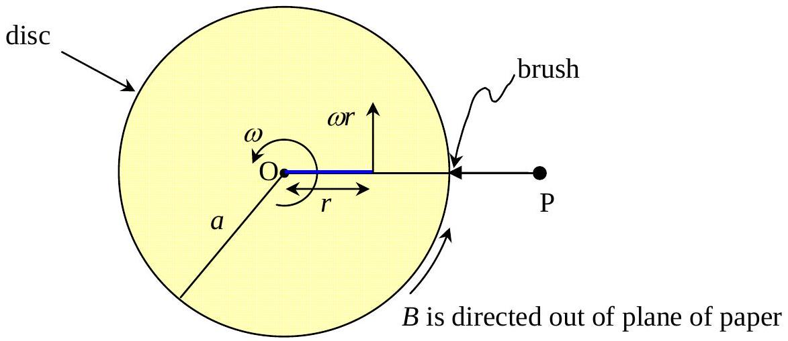
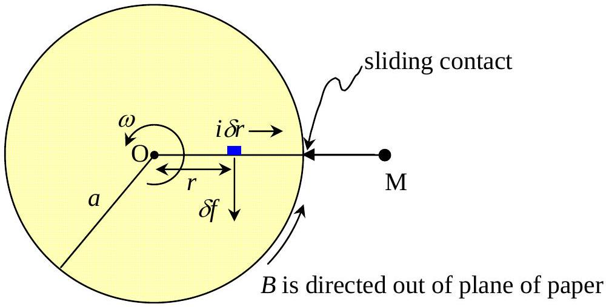

## A Self-excited Magnetic Dynamo

2.1)
$$
\begin{equation*}
L \frac { d } { d t } \dot { i } + R i = \mathcal { E } \tag{i}
\end{equation*}
$$
(1.0 point)
2.2) If the length $\ell$ of solenoid is much greater than its diameter, then the magnetic flux density in the inside mid-section of the solenoid is given by
$$
\begin{equation*}
B = \frac { \mu _ { 0 } N i } { \ell } \tag{ii}
\end{equation*}
$$
(1.5 points)
2.3) 
The electric field intensity ( $E$ ) at distance $r$ from the centre of the axle is
$$
E = B \omega r
$$
pointing towards the rim of the disc. The induced e.m.f. $( \mathcal { E } )$ between terminals P and Q is given by
$$
\begin{equation*}
\mathcal { E } = \int _ { r = 0 } ^ { a } B \omega r d r = \frac { 1 } { 2 } B \omega a ^ { 2 } = \frac { \mu _ { 0 } N i \omega a ^ { 2 } } { 2 \ell } \tag{iii}
\end{equation*}
$$
(2.0 points)
2.4) By combining the results in 2.1) and 2.3) we get
$$
\begin{align*}
& L \frac { d } { d t } i + R i = \left( \frac { \mu _ { 0 } N a ^ { 2 } \omega } { 2 \ell } \right) i \\
& \frac { d } { d t } i = + \frac { 1 } { L } \left( \frac { \mu _ { 0 } N a ^ { 2 } \omega } { 2 \ell } - R \right) i \equiv + \gamma i  \tag{0.5point}\\
\therefore \quad & i ( t ) = i ( 0 ) e ^ { \gamma t } \tag{iv}
\end{align*}
$$
(1.0 point)

where $\quad \gamma \equiv \frac { 1 } { L } \left( \frac { \mu _ { 0 } N a ^ { 2 } \omega } { 2 \ell } - R \right)$

2.5) In order that the current $i ( t )$ will grow, the value of $\gamma$ must be positive otherwise the current will gradually decay.
$$
\begin{gather*}
\frac { \mu _ { 0 } N a ^ { 2 } \omega } { 2 \ell } - R \geq 0  \tag{1.5points}\\
\omega _ { \min } = \frac { 2 \ell R } { \mu _ { 0 } N a ^ { 2 } } \tag{v}
\end{gather*}
$$
(0.5 point)

2.6)

Method 1

At the instant $t$ the current is given in 4) as $i ( t ) = i ( 0 ) e ^ { \gamma t }$.

The magnetic force $\delta f$ on the current element $i \delta r$ is $\delta f = B i \delta r$.
The torque $\delta \tau = r \delta f = \operatorname { Bir } \delta r$ opposes the rotation of the disc.
The total torque $\tau = \int _ { r = 0 } ^ { r = a } \operatorname { Birdr } = \frac { 1 } { 2 }$ Bia $^ { 2 }$

$$
\begin{equation*}
\tau = \frac { \mu _ { 0 } N a ^ { 2 } } { 2 \ell } i ^ { 2 } = \frac { \mu _ { 0 } N a ^ { 2 } } { 2 \ell } i ^ { 2 } ( 0 ) e ^ { + 2 \gamma t } \tag{vi}
\end{equation*}
$$

In order to maintain the angular velocity of the disc at a steady value we must apply a turning torque of equal magnitude and of opposite direction to that of (vi).

Method 2

$$
\begin{align*}
\tau \omega & = i ^ { 2 } R + \frac { d } { d t } \text { (magnetic energy in solenoid) }  \tag{1.0point}\\
& = i ^ { 2 } R + L \frac { d i } { d t } i \\
\tau & = \frac { \mu _ { 0 } N a ^ { 2 } } { 2 \ell } i ^ { 2 } = \frac { \mu _ { 0 } N a ^ { 2 } } { 2 \ell } i ^ { 2 } ( 0 ) e ^ { + 2 \gamma t } \tag{1.0point}
\end{align*}
$$
