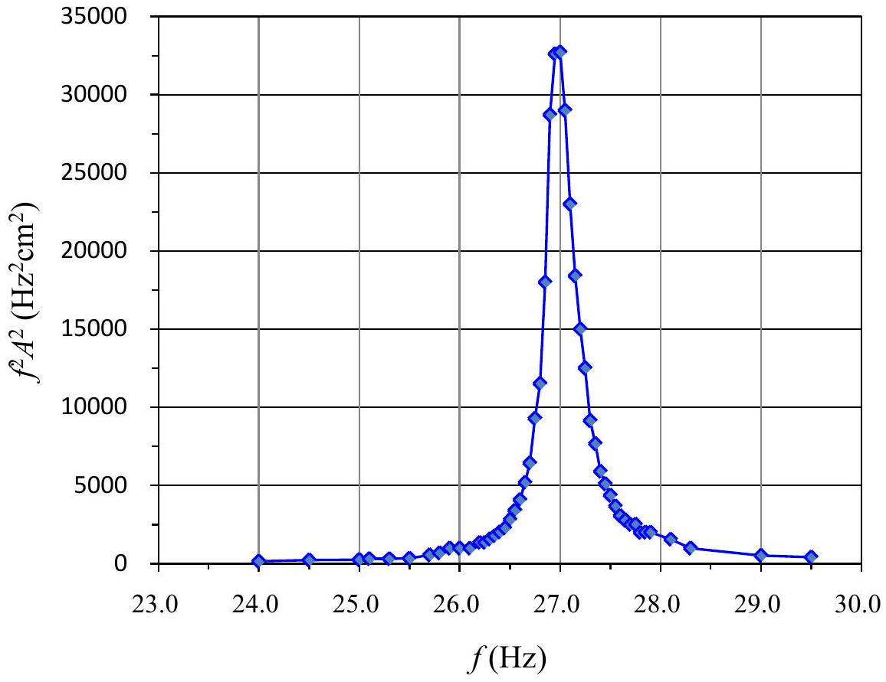
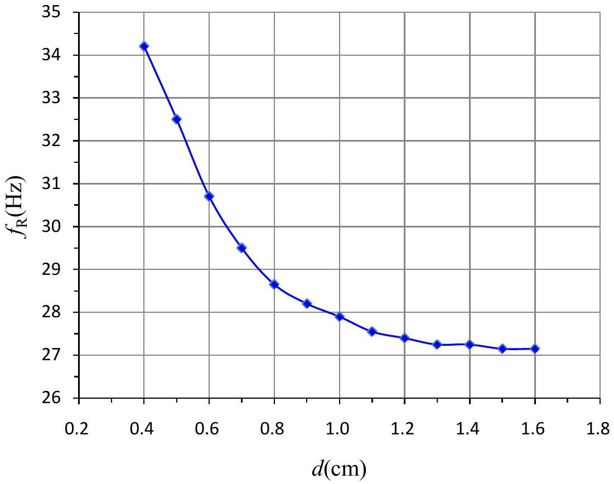
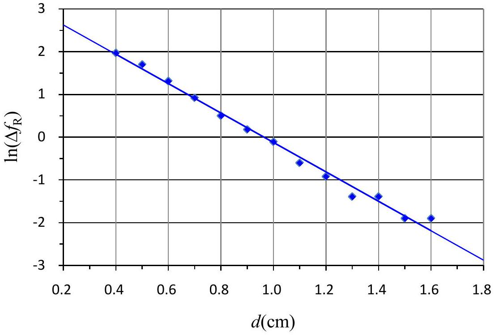
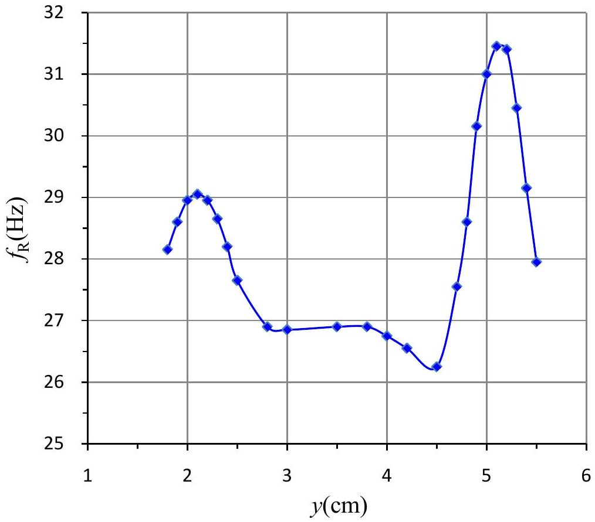
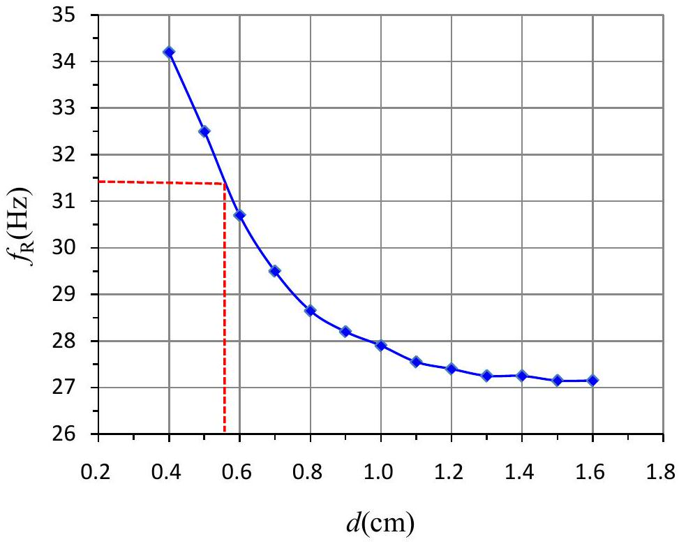
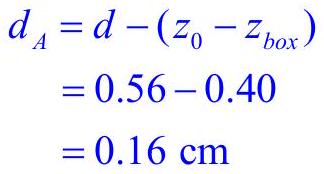
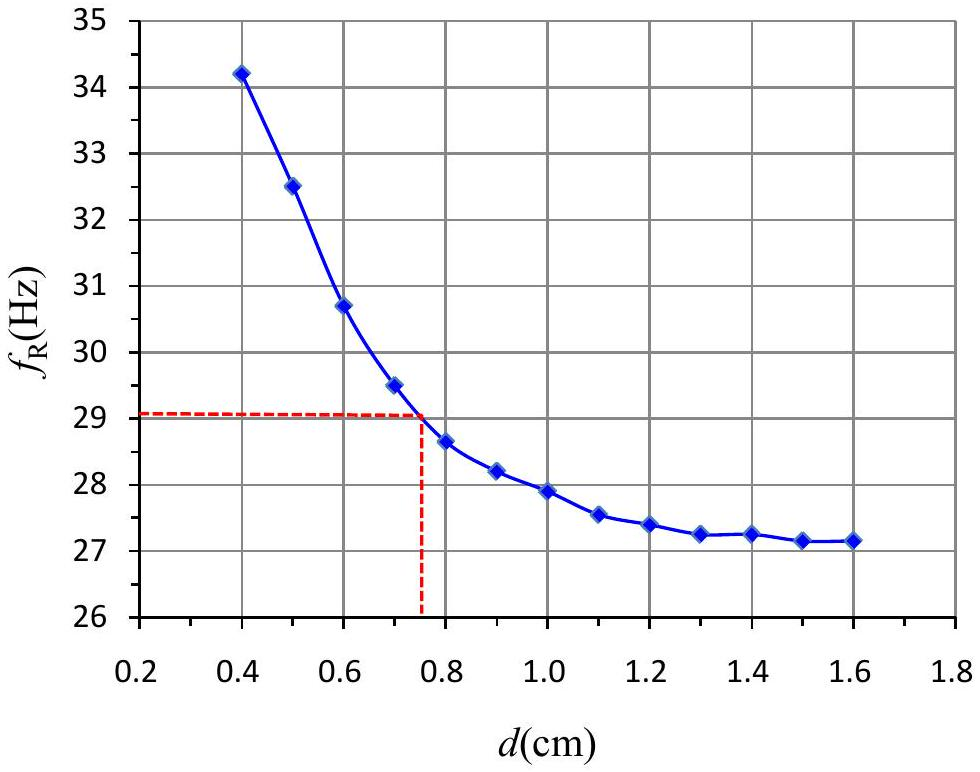
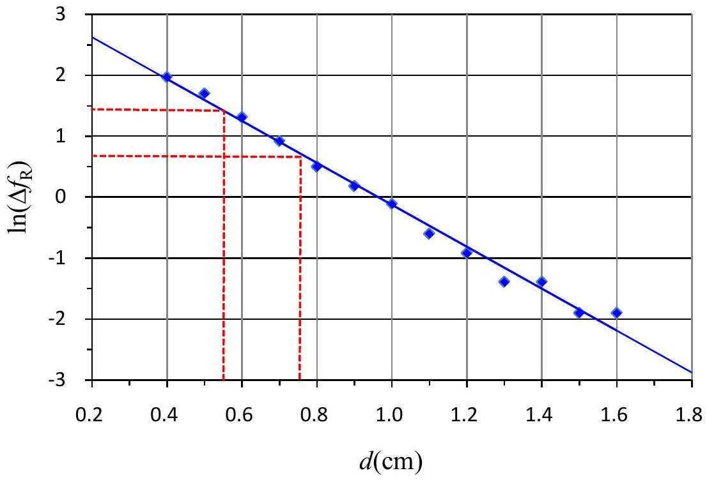

## SOLUTION

Exp. I-A 、Measuring the resonance frequency

(1)Measure the amplitude $A$ of the oscillating laser beam by tuning the frequency $f$ of the sine wave generator. Record the measured data in the data table.

| $f ( \mathrm {~Hz} )$ | $A ( \mathrm {~cm} )$ | $f ^ { 2 } A ^ { 2 } \left( \mathrm {~Hz} ^ { 2 } \mathrm {~cm} ^ { 2 } \right)$ |
| :--- | :--- | :--- |
| 24.00 | 0.50 | $1.4 \times 10 ^ { 2 }$ |
| 24.50 | 0.60 | $2.2 \times 10 ^ { 2 }$ |
| 25.00 | 0.60 | $2.3 \times 10 ^ { 2 }$ |
| 25.10 | 0.70 | $3.1 \times 10 ^ { 2 }$ |
| 25.30 | 0.70 | $3.1 \times 10 ^ { 2 }$ |
| 25.50 | 0.70 | $3.2 \times 10 ^ { 2 }$ |
| 25.70 | 0.90 | $5.4 \times 10 ^ { 2 }$ |
| 25.80 | 1.00 | $6.66 \times 10 ^ { 2 }$ |
| 25.90 | 1.20 | $9.66 \times 10 ^ { 2 }$ |
| 26.00 | 1.20 | $9.73 \times 10 ^ { 2 }$ |
| 26.10 | 1.20 | $9.81 \times 10 ^ { 2 }$ |
| 26.20 | 1.40 | $13.5 \times 10 ^ { 2 }$ |
| 26.25 | 1.40 | $13.5 \times 10 ^ { 2 }$ |
| 26.30 | 1.50 | $15.6 \times 10 ^ { 2 }$ |
| 26.35 | 1.60 | $17.8 \times 10 ^ { 2 }$ |
| 26.40 | 1.70 | $20.1 \times 10 ^ { 2 }$ |
| 26.45 | 1.80 | $22.7 \times 10 ^ { 2 }$ |
| 26.50 | 2.00 | $28.1 \times 10 ^ { 2 }$ |
| 26.55 | 2.20 | $34.1 \times 10 ^ { 2 }$ |
| 26.60 | 2.40 | $40.8 \times 10 ^ { 2 }$ |
| 26.65 | 2.70 | $51.8 \times 10 ^ { 2 }$ |
| 26.70 | 3.00 | $64.2 \times 10 ^ { 2 }$ |
| 26.75 | 3.60 | $92.7 \times 10 ^ { 2 }$ |
| 26.80 | 4.00 | $115 \times 10 ^ { 2 }$ |

| $f ( \mathrm {~Hz} )$ | $A ( \mathrm {~cm} )$ | $f ^ { 2 } A ^ { 2 } \left( \mathrm {~Hz} ^ { 2 } \mathrm {~cm} ^ { 2 } \right)$ |
| :--- | :--- | :--- |
| 26.85 | 5.00 | $180 \times 10 ^ { 2 }$ |
| 26.90 | 6.30 | $287 \times 10 ^ { 2 }$ |
| 26.95 | 6.70 | $326 \times 10 ^ { 2 }$ |
| 27.00 | 6.70 | 327×10 ${ } ^ { 2 }$ |
| 27.05 | 6.30 | $290 \times 10 ^ { 2 }$ |
| 27.10 | 5.60 | $230 \times 10 ^ { 2 }$ |
| 27.15 | 5.00 | $184 \times 10 ^ { 2 }$ |
| 27.20 | 4.50 | $150 \times 10 ^ { 2 }$ |
| 27.25 | 4.10 | $125 \times 10 ^ { 2 }$ |
| 27.30 | 3.50 | $91.3 \times 10 ^ { 2 }$ |
| 27.35 | 3.20 | $76.6 \times 10 ^ { 2 }$ |
| 27.40 | 2.80 | $58.9 \times 10 ^ { 2 }$ |
| 27.45 | 2.60 | $50.9 \times 10 ^ { 2 }$ |
| 27.50 | 2.40 | $43.6 \times 10 ^ { 2 }$ |
| 27.55 | 2.20 | $36.7 \times 10 ^ { 2 }$ |
| 27.60 | 2.00 | $30.5 \times 10 ^ { 2 }$ |
| 27.65 | 1.90 | $27.6 \times 10 ^ { 2 }$ |
| 27.70 | 1.80 | $24.9 \times 10 ^ { 2 }$ |
| 27.75 | 1.80 | $25.0 \times 10 ^ { 2 }$ |
| 27.80 | 1.60 | $19.8 \times 10 ^ { 2 }$ |
| 27.85 | 1.60 | $19.9 \times 10 ^ { 2 }$ |
| 27.90 | 1.60 | $19.9 \times 10 ^ { 2 }$ |
| 28.10 | 1.40 | $15.5 \times 10 ^ { 2 }$ |
| 28.30 | 1.10 | $9.69 \times 10 ^ { 2 }$ |

## SOLUTION

(2) Plot a proper data in the graph paper to determine the resonance frequency $f _ { R O }$ and the quality factor $Q$. Record $f _ { R O }$ and $Q$ in the following blank.

$$
Q = \frac { f _ { R O } } { f _ { 2 } - f _ { 1 } } = \frac { 27.0 } { 27.17 - 26.84 } = 81.8
$$

$$
f _ { R O } = 27.0 \mathrm {~Hz} \quad Q = 81.8
$$

## SOLUTION

Exp. I-B 、Resonance frequency versus the external force.

(1) Measure and record the measured data $z _ { 0 }$ in the data table.
$$
z _ { 0 } = 6.40 \mathrm {~cm}
$$
(2) Determine the position $z$ of the top plane of the N-pole of $\mathrm { M } _ { \mathrm { C } }$. Calculate the nominal distance $d$ by defining $d = z _ { 0 } - z$. Record $z$ and $d$ in the data table.
(3) Determine the resonance frequency $f _ { R }$ for the distance $d$ by tuning the frequency of the sine wave generator until the maximum amplitude is reached. Record the determined resonance frequency $f _ { R }$ in the data table.
(4)Change the vertical position of the magnet $\mathrm { M } _ { \mathrm { C } }$ and repeat the steps (2) and (3) for a number of measurements of different distance $d$ and the corresponding resonance frequency $f _ { R }$.

| $z ( \mathrm {~cm} )$ | $d ( \mathrm {~cm} )$ | $f _ { R } ( \mathrm {~Hz} )$ | $\Delta f _ { R } ( \mathrm {~Hz} )$ | $\ln \left( \Delta f _ { R } \right)$ |
| :--- | :--- | :--- | :--- | :--- |
| 4.80 | 1.60 | 27.15 | 0.15 | -1.90 |
| 4.90 | 1.50 | 27.15 | 0.15 | -1.90 |
| 5.00 | 1.40 | 27.25 | 0.25 | -1.39 |
| 5.10 | 1.30 | 27.25 | 0.25 | -1.39 |
| 5.20 | 1.20 | 27.40 | 0.40 | -0.92 |
| 5.30 | 1.10 | 27.55 | 0.55 | -0.60 |
| 5.40 | 1.00 | 27.90 | 0.90 | -0.11 |
| 5.50 | 0.90 | 28.20 | 1.20 | 0.18 |
| 5.60 | 0.80 | 28.65 | 1.65 | 0.50 |
| 5.70 | 0.70 | 29.50 | 2.50 | 0.92 |
| 5.80 | 0.60 | 30.70 | 3.70 | 1.31 |
| 5.90 | 0.50 | 32.50 | 5.50 | 1.70 |
| 6.00 | 0.40 | 34.20 | 7.20 | 1.97 |
|  |  |  |  |  |

## SOLUTION

(5) Plot a graph of $f _ { R }$ as a function of distance $d$ using a graph paper.

(6) Define $\Delta f _ { R } = f _ { R } - f _ { R O }$, and plot $\ln \left( \Delta f _ { R } \right)$ as a function of $d$ using another graph paper.

## SOLUTION

Exp. I-C 、 Find the positions and depths of magnets in a black box.

(1) Record $z _ { 0 }$ and $z _ { \text {box } }$ on the answer sheet.
$$
z _ { 0 } = 5.37 \mathrm {~cm} \quad z _ { \text {box } } = 4.97 \mathrm {~cm}
$$
(2)Move the black box along the longer line and observe the variation in resonance frequency $f _ { R }$ of the reed to find the position of $\mathrm { M } _ { \mathrm { B } }$. Record the measured distances $y$ and their corresponding resonance frequencies $f _ { R }$ in the data table.

| $y ( \mathrm {~cm} )$ | $f _ { R } ( \mathrm {~Hz} )$ |
| :--- | :--- |
| 5.50 | 27.95 |
| 5.40 | 29.15 |
| 5.30 | 30.45 |
| 5.20 | 31.40 |
| 5.10 | 31.45 |
| 5.00 | 31.00 |
| 4.90 | 30.15 |
| 4.80 | 28.60 |
| 4.70 | 27.55 |
| 4.50 | 26.25 |
| 4.20 | 26.55 |
| 4.00 | 26.75 |
| 3.80 | 26.90 |
| 3.50 | 26.90 |
| 3.00 | 26.85 |

| $y ( \mathrm {~cm} )$ | $f _ { R } ( \mathrm {~Hz} )$ |
| :--- | :--- |
| 2.80 | 26.90 |
| 2.50 | 27.65 |
| 2.40 | 28.20 |
| 2.30 | 28.65 |
| 2.20 | 28.95 |
| 2.10 | 29.05 |
| 2.00 | 28.95 |
| 1.90 | 28.60 |
| 1.80 | 28.15 |
|  |  |
|  |  |
|  |  |
|  |  |
|  |  |
|  |  |

## SOLUTION

(3) Plot $f _ { R }$ as a function of $y$ on a graph paper to determine the position of magnet $\mathrm { M } _ { \mathrm { B } }$. Mark the positions of magnets $\mathrm { M } _ { \mathrm { A } }$ and $\mathrm { M } _ { \mathrm { B } }$ on the $y$-axis of your graph, and write down the value of $\overline { A B }$ on the answer sheet.

The distance between the two maximum points is $5.1 - 2.1 = 3.0 \mathrm {~cm}$.
$$
\overline { A B } = 3.0 \mathrm {~cm}
$$

## SOLUTION

(4) Determine the depths $d _ { A }$ and $d _ { B }$ of the magnets $\mathrm { M } _ { \mathrm { A } }$ and $\mathrm { M } _ { \mathrm { B } }$ from the top surface of the black box using the results in Exp. I-B. Write down the values of $d _ { A }$ and $d _ { B }$ on the answer sheet.

$$
\begin{aligned}
d _ { B } & = d - \left( z _ { 0 } - z _ { b o x } \right) \\
& = 0.75 - 0.40 \\
& = 0.35 \mathrm {~cm}
\end{aligned}
$$
$$
d _ { A } = 0.16 \mathrm {~cm}
$$
$$
d _ { B } = 0.35 \mathrm {~cm}
$$

## SOLUTION

Alternatively,

$\mathrm { M } _ { \mathrm { A } }$ :

$$
\begin{aligned}
& \ln \left( \Delta f _ { R } \right) = \ln ( 31.4 - 27.0 ) = 1.48 \\
\Rightarrow & d = 0.56 \mathrm {~cm} \\
\Rightarrow & d _ { A } = d - \left( z _ { 0 } - z _ { b o x } \right) = 0.56 - 0.40 = 0.16 \mathrm {~cm}
\end{aligned}
$$

$\mathrm { M } _ { \mathrm { B } }$ :

$$
\begin{aligned}
& \ln \left( \Delta f _ { R } \right) = \ln ( 29.1 - 27.0 ) = 0.74 \\
& \Rightarrow d = 0.75 \mathrm {~cm} \\
& \Rightarrow d _ { A } = d - \left( z _ { 0 } - z _ { b o x } \right) = 0.75 - 0.40 = 0.35 \mathrm {~cm}
\end{aligned}
$$
