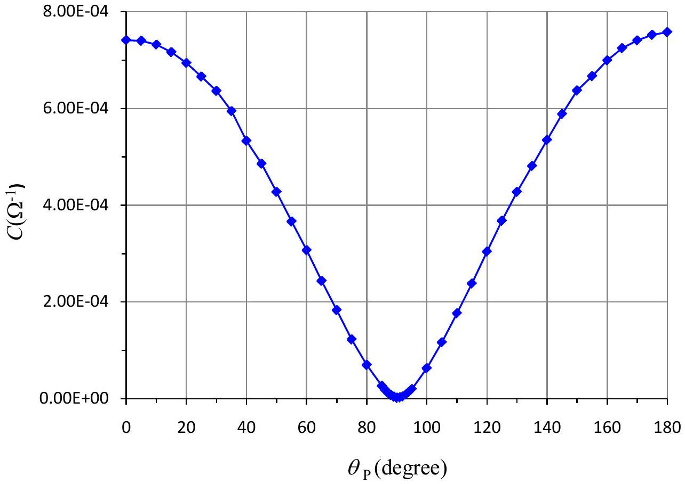
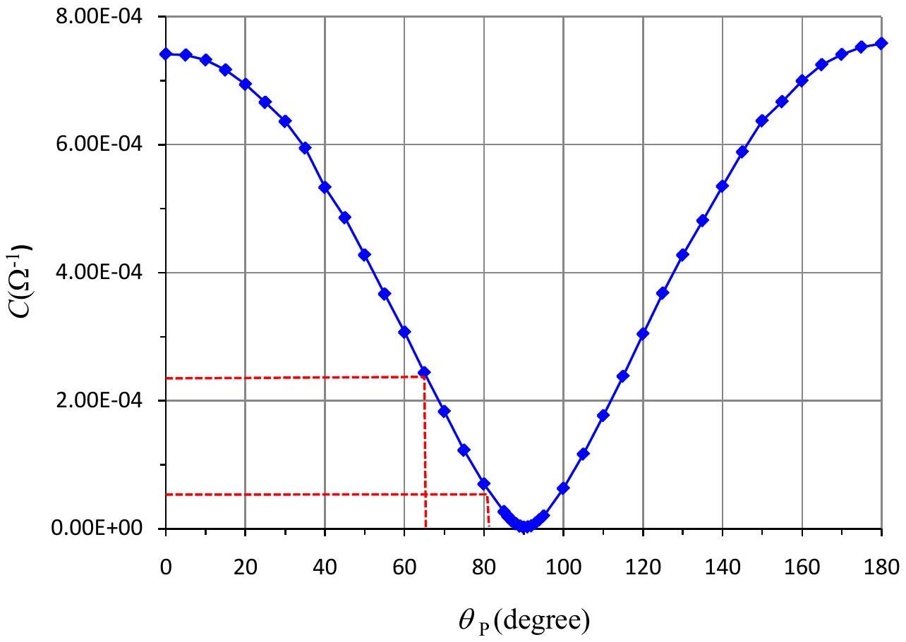
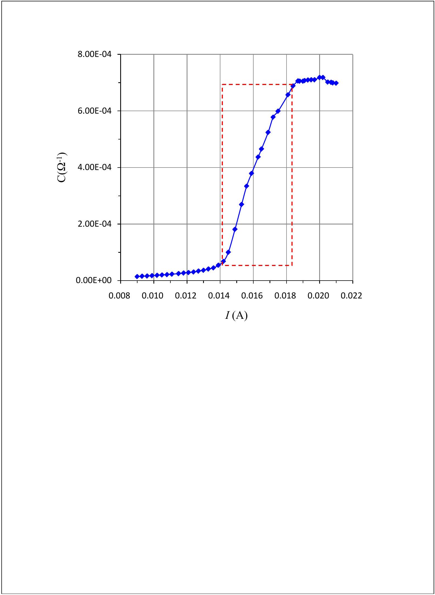
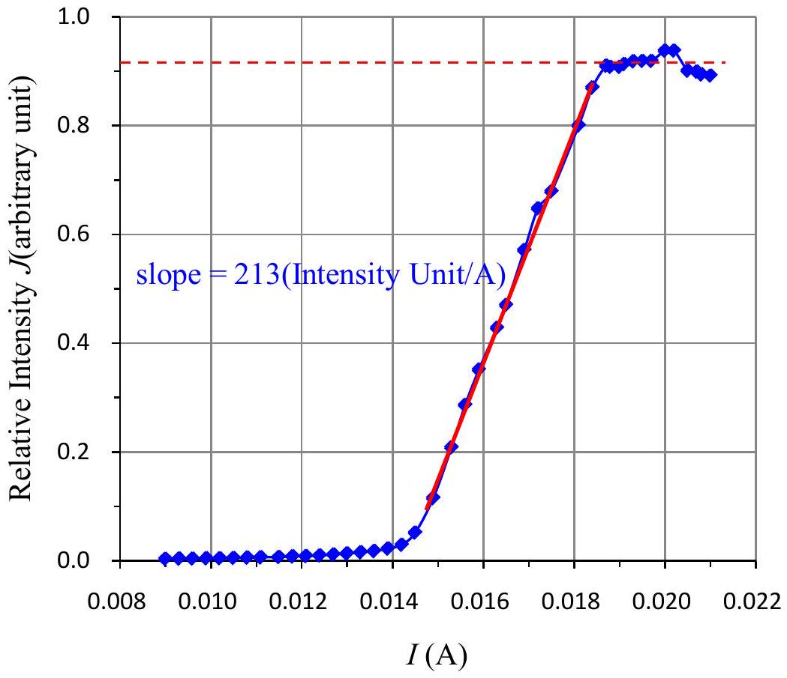

SOLUTION

Exp. II-A : Light Response of the Photoconductor

(1) Record the measured PC resistance (R) and $\theta _ { P }$ in the data table. Transform the measured $R$ values into conductance $( C )$ values and record them in the data table.

| $\theta _ { P }$ (degree) | $R ( \Omega )$ | $C ( 1 / \Omega )$ | $J = \cos ^ { 2 } \theta _ { P }$ |
| :--- | :--- | :--- | :--- |
| 0.0 | 1349 | $7.413 \mathrm { E } - 04$ | 1.00 |
| 5.0 | 1352 | $7.396 \mathrm { E } - 04$ | 0.992 |
| 10.0 | 1366 | $7.321 \mathrm { E } - 04$ | 0.970 |
| 15.0 | 1396 | $7.163 \mathrm { E } - 04$ | 0.933 |
| 20.0 | 1441 | $6.940 \mathrm { E } - 04$ | 0.883 |
| 25.0 | 1502 | $6.658 \mathrm { E } - 04$ | 0.821 |
| 30.0 | 1572 | $6.361 \mathrm { E } - 04$ | 0.750 |
| 35.0 | 1682 | $5.945 \mathrm { E } - 04$ | 0.671 |
| 40.0 | 1876 | $5.330 \mathrm { E } - 04$ | 0.587 |
| 45.0 | 2060 | $4.854 \mathrm { E } - 04$ | 0.500 |
| 50.0 | 2340 | $4.274 \mathrm { E } - 04$ | 0.413 |
| 55.0 | 2730 | $3.663 \mathrm { E } - 04$ | 0.329 |
| 60.0 | 3260 | $3.067 \mathrm { E } - 04$ | 0.250 |
| 65.0 | 4110 | $2.433 \mathrm { E } - 04$ | 0.179 |
| 70.0 | 5470 | $1.828 \mathrm { E } - 04$ | 0.117 |
| 75.0 | 8180 | $1.222 \mathrm { E } - 04$ | 0.0670 |
| 80.0 | 14410 | $6.944 \mathrm { E } - 05$ | 0.0302 |
| 85.0 | 37900 | $2.639 \mathrm { E } - 05$ | 0.00760 |
| 86.0 | 52200 | $1.916 \mathrm { E } - 05$ | 0.00487 |
| 87.0 | 82000 | $1.220 \mathrm { E } - 05$ | 0.00274 |
| 88.0 | 130300 | $7.674 \mathrm { E } - 06$ | 0.00122 |
| 89.0 | 254000 | $3.937 \mathrm { E } - 06$ | $3.05 \mathrm { E } - 04$ |
| 90.0 | 450000 | $2.222 \mathrm { E } - 06$ | 0 |
| 91.0 | 393000 | $2.544 \mathrm { E } - 06$ | $3.05 \mathrm { E } - 04$ |

Experimental Competition
27 April 2010

Page 2 of 12

SOLUTION
| 92.0 | 219000 | $4.566 \mathrm { E } - 06$ | 0.00122 |
| :--- | :--- | :--- | :--- |
| 93.0 | 118900 | $8.410 \mathrm { E } - 06$ | 0.00274 |
| 94.0 | 73700 | $1.357 \mathrm { E } - 05$ | 0.00487 |
| 95.0 | 51300 | $1.949 \mathrm { E } - 05$ | 0.00760 |
| 100.0 | 15960 | $6.266 \mathrm { E } - 05$ | 0.0302 |
| 105.0 | 8580 | $1.166 \mathrm { E } - 04$ | 0.0670 |
| 110.0 | 5660 | $1.767 \mathrm { E } - 04$ | 0.117 |
| 115.0 | 4200 | $2.381 \mathrm { E } - 04$ | 0.179 |
| 120.0 | 3290 | $3.040 \mathrm { E } - 04$ | 0.250 |
| 125.0 | 2720 | $3.676 \mathrm { E } - 04$ | 0.329 |
| 130.0 | 2340 | $4.274 \mathrm { E } - 04$ | 0.413 |
| 135.0 | 2080 | $4.808 \mathrm { E } - 04$ | 0.500 |
| 140.0 | 1870 | $5.348 \mathrm { E } - 04$ | 0.587 |
| 145.0 | 1700 | $5.882 \mathrm { E } - 04$ | 0.671 |
| 150.0 | 1570 | $6.369 \mathrm { E } - 04$ | 0.750 |
| 155.0 | 1500 | $6.667 \mathrm { E } - 04$ | 0.821 |
| 160.0 | 1430 | $6.993 \mathrm { E } - 04$ | 0.883 |
| 165.0 | 1380 | $7.246 \mathrm { E } - 04$ | 0.933 |
| 170.0 | 1350 | $7.407 \mathrm { E } - 04$ | 0.970 |
| 175.0 | 1330 | $7.519 \mathrm { E } - 04$ | 0.992 |
| 180.0 | 1320 | $7.576 \mathrm { E } - 04$ | 1.00 |
|  |  |  |  |

## SOLUTION

(2) Plot the PC conductance values as a function of $\theta _ { P }$ on a graph paper.

SOLUTION

Exp. II-B : The Fraction of Linearly Polarized Laser Light

(1) Find the maximum and minimum values of PC resistance $\left( R _ { \text {max } } \right.$ and $\left. R _ { \text {min } } \right)$ by rotating P1 $360 ^ { \circ }$. Transform $R _ { \text {max } }$ and $R _ { \text {min } }$ into the minimum and maximum values of PC conductance $C _ { \text {min } }$ and $C _ { \text {max } }$. Record the data in the data table.

| $R _ { \text {min } }$ ( $\mathrm { k } \Omega$ ) | $R _ { \text {max } }$ ( $\mathrm { k } \Omega$ ) | $C _ { \text {max } } ( 1 / \mathrm { k } \Omega )$ | $C _ { \text {min } } ( 1 / \mathrm { k } \Omega )$ |  |  |
| :--- | :--- | :--- | :--- | :--- | :--- |
| 4.30 | 19.40 | 0.233 | 0.0515 |  |  |
| 4.28 | 19.42 | 0.234 | 0.0515 |  |  |
| 4.31 | 19.41 | 0.232 | 0.0515 |  |  |
|  | Average | 0.233 | 0.0515 |  |  |

## SOLUTION

(2) Utilizing the conductance versus $\theta _ { P }$ graph in Exp. II-A-(2) to determine the relative intensities $J _ { \text {max } }$ and $J _ { \text {min } }$ corresponding to $C _ { \text {max } }$ and $C _ { \text {min } }$. Write down the result.

$$
\begin{aligned}
& C _ { \min } = 0.0515 \Omega ^ { - 1 } \Rightarrow \theta _ { P } = 81 ^ { \circ } \Rightarrow J _ { \min } = \cos ^ { 2 } 81 ^ { \circ } = 0.025 \\
& C _ { \max } = 0.233 \Omega ^ { - 1 } \Rightarrow \theta _ { P } = 65 ^ { \circ } \Rightarrow J _ { \min } = \cos ^ { 2 } 65 ^ { \circ } = 0.18
\end{aligned}
$$
$$
J _ { \min } = 0.025 \quad J _ { \max } = 0.18
$$

(3) Calculate $\beta$ and write down the result on the answer sheet.
$$
\beta = \frac { J _ { \max } - J _ { \min } } { J _ { \max } + J _ { \min } } = \frac { 0.18 - 0.025 } { 0.18 + 0.025 } = 0.76
$$

$$
\beta = 0.76
$$

SOLUTION

Exp. II-C : The Differential Quantum Efficiency of the Collimated Laser Diode

(1) Control the CLD current (I) and measure the corresponding PC resistance (R) values. Record the data in the data table. Transform your data and plot the PC conductance (C) versus CLD current on a graph paper.

| $I$ (A) | $R ( \Omega )$ | $C ( 1 / \Omega )$ | $J$ |
| :--- | :--- | :--- | :--- |
| 0.0090 | 70600 | $1.42 \mathrm { E } - 05$ | 0.00335 |
| 0.0093 | 66000 | $1.52 \mathrm { E } - 05$ | 0.00365 |
| 0.0096 | 61600 | $1.62 \mathrm { E } - 05$ | 0.00396 |
| 0.0099 | 58200 | $1.72 \mathrm { E } - 05$ | 0.00426 |
| 0.0102 | 54200 | $1.85 \mathrm { E } - 05$ | 0.00466 |
| 0.0105 | 50300 | $1.99 \mathrm { E } - 05$ | 0.00514 |
| 0.0108 | 47400 | $2.11 \mathrm { E } - 05$ | 0.00559 |
| 0.0111 | 44100 | $2.27 \mathrm { E } - 05$ | 0.00620 |
| 0.0115 | 40600 | $2.46 \mathrm { E } - 05$ | 0.00692 |
| 0.0118 | 37500 | $2.67 \mathrm { E } - 05$ | 0.00776 |
| 0.0121 | 35200 | $2.84 \mathrm { E } - 05$ | 0.00865 |
| 0.0124 | 32900 | $3.04 \mathrm { E } - 05$ | 0.00970 |
| 0.0127 | 29900 | $3.34 \mathrm { E } - 05$ | 0.0112 |
| 0.0130 | 27400 | $3.65 \mathrm { E } - 05$ | 0.0129 |
| 0.0133 | 24600 | $4.07 \mathrm { E } - 05$ | 0.0151 |
| 0.0136 | 22200 | $4.50 \mathrm { E } - 05$ | 0.0174 |
| 0.0139 | 18500 | $5.41 \mathrm { E } - 05$ | 0.0221 |
| 0.0142 | 14800 | $6.76 \mathrm { E } - 05$ | 0.0292 |
| 0.0145 | 10000 | $1.00 \mathrm { E } - 04$ | 0.0516 |
| 0.0149 | 5510 | $1.81 \mathrm { E } - 04$ | 0.115 |
| 0.0153 | 3720 | $2.69 \mathrm { E } - 04$ | 0.208 |
| 0.0156 | 2990 | $3.34 \mathrm { E } - 04$ | 0.286 |
| 0.0159 | 2640 | $3.79 \mathrm { E } - 04$ | 0.351 |
| 0.0163 | 2290 | $4.37 \mathrm { E } - 04$ | 0.428 |
| 0.0165 | 2150 | $4.65 \mathrm { E } - 04$ | 0.470 |

Experimental Competition
27 April 2010

## Question Number 2

Page 8 of 12

SOLUTION
| 0.0169 | 1910 | $5.24 \mathrm { E } - 04$ | 0.571 |
| :--- | :--- | :--- | :--- |
| 0.0172 | 1730 | $5.78 \mathrm { E } - 04$ | 0.648 |
| 0.0175 | 1670 | $5.99 \mathrm { E } - 04$ | 0.679 |
| 0.0181 | 1523 | $6.57 \mathrm { E } - 04$ | 0.800 |
| 0.0184 | 1454 | $6.88 \mathrm { E } - 04$ | 0.870 |
| 0.0187 | 1417 | $7.06 \mathrm { E } - 04$ | 0.910 |
| 0.0188 | 1418 | $7.05 \mathrm { E } - 04$ | 0.908 |
| 0.0190 | 1419 | $7.05 \mathrm { E } - 04$ | 0.908 |
| 0.0191 | 1414 | $7.07 \mathrm { E } - 04$ | 0.913 |
| 0.0193 | 1411 | $7.09 \mathrm { E } - 04$ | 0.918 |
| 0.0195 | 1409 | $7.10 \mathrm { E } - 04$ | 0.919 |
| 0.0197 | 1409 | $7.10 \mathrm { E } - 04$ | 0.919 |
| 0.0200 | 1393 | $7.18 \mathrm { E } - 04$ | 0.938 |
| 0.0202 | 1392 | $7.18 \mathrm { E } - 04$ | 0.938 |
| 0.0205 | 1425 | $7.02 \mathrm { E } - 04$ | 0.901 |
| 0.0207 | 1426 | $7.01 \mathrm { E } - 04$ | 0.899 |
| 0.0208 | 1430 | $6.99 \mathrm { E } - 04$ | 0.894 |
| 0.0210 | 1432 | $6.98 \mathrm { E } - 04$ | 0.892 |
|  |  |  |  |
|  |  |  |  |
|  |  |  |  |

SOLUTION

## SOLUTION

(2) Based on the graph of step (1), choose a region $( \Delta \mathrm { I } \sim 3 \mathrm {~mA} )$ centered around the maximum slope. By using the conductance versus $\theta _ { P }$ graph in Part II-A-(2), transform and record the data of this region in the table of step (1) into the relative light intensity $( J )$. Plot the relative light intensity $( J )$ versus CLD current $( I )$ in a graph paper.

## SOLUTION

(3) The maximum radiating power of the CLD is assumed to be exactly $P _ { \text {max } } = 3.0 \mathrm {~mW}$. Extract the maximum slope from the graph in step (3) and transfer it to the value of $\left. G \equiv \frac { \Delta P } { \Delta I } \right| _ { \text {Max } }$, which is the maximum ratio of the increased amount of radiating power and the increase amount of input ampere. Write down your analysis and the calculated value $G$ on the answer sheet. Estimate the error of $G$. Do not include the error of the $P _ { \text {max } }$. Write down your analysis and the calculated value $\Delta G$ on the answer sheet.
$$
G = \left. \frac { \Delta P } { \Delta I } \right| _ { M a : } = 0.69 \mathrm {~W} / \mathrm { A } \quad \Delta G = 0.02 \mathrm {~W} / \mathrm { A }
$$

By linear regression analysis, slope $S = 213$ ( Intensity Unit / A) , uncertainty of slope $\Delta S = 3$ (Intensity Unit /A).

$$
\begin{aligned}
& P _ { \max } = 3.0 \mathrm {~mW} \Rightarrow J _ { \max } = 0.92 \text { (Intensity Unit) } \\
& \because P \propto J \Rightarrow P = k J \\
& \therefore G = \left. \frac { \Delta P } { \Delta I } \right| _ { \max } = \left. \frac { k \Delta J } { \Delta I } \right| _ { \max } = \left. \frac { P _ { \max } } { J _ { \max } } \cdot \frac { \Delta J } { \Delta I } \right| _ { \max } = \frac { 3.0 \times 10 ^ { - 3 } } { 0.92 } \times 213 = 0.69 \mathrm {~W} / \mathrm { A }
\end{aligned}
$$

From the measured data, uncertainty of $J _ { \text {max } } : \Delta J _ { \text {max } } = 0.02$ (Intensity Unit)

Uncertainty Analysis: by using the formula of error propagation

$$
\begin{aligned}
G & = G \left( S , J _ { \max } \right) = \left. \frac { P _ { \max } } { J _ { \max } } \cdot \frac { \Delta J } { \Delta I } \right| _ { \max } = \left( 3.0 \times 10 ^ { - 3 } \right) \frac { S } { J _ { \max } } \\
\Delta G & = \sqrt { \left( \frac { \partial G } { \partial S } \right) ^ { 2 } ( \Delta S ) ^ { 2 } + \left( \frac { \partial G } { \partial J _ { \max } } \right) ^ { 2 } \left( \Delta J _ { \max } \right) ^ { 2 } } = \sqrt { \left( \frac { 3.0 \times 10 ^ { - 3 } } { J _ { \max } } \right) ^ { 2 } ( \Delta S ) ^ { 2 } + \left( - \frac { 3.0 \times 10 ^ { - 3 } S } { J _ { \max } ^ { 2 } } \right) ^ { 2 } \left( \Delta J _ { \max } \right) ^ { 2 } } \\
& = \sqrt { \left( \frac { 3.0 \times 10 ^ { - 3 } } { 0.92 } \right) ^ { 2 } ( 3 ) ^ { 2 } + \left( - \frac { 3.0 \times 10 ^ { - 3 } \times 213 } { 0.92 ^ { 2 } } \right) ^ { 2 } ( 0.02 ) ^ { 2 } } \\
& = 0.02
\end{aligned}
$$

Alternatively,

$$
\frac { \Delta G } { G } = \sqrt { \left( \frac { \Delta S } { S } \right) ^ { 2 } + \left( \frac { \Delta J _ { \max } } { J _ { \max } } \right) ^ { 2 } } \Rightarrow \Delta G = 0.69 \sqrt { \left( \frac { 3 } { 213 } \right) ^ { 2 } + \left( \frac { 0.02 } { 0.92 } \right) ^ { 2 } } = 0.02
$$

## SOLUTION

(4) The Quantum Efficiency equals the probability of one photon being generated per electron injected. From a particular bias current of the laser, a small increment of electrons injected would cause a corresponding increment of photons. The Differential Quantum Efficiency $\boldsymbol { \eta }$ is defined as the ratio of the increased number of photons and the increased number of injected electrons. Determine $\boldsymbol { \eta }$ of your CLD by using the value of $G$ obtained in step (4). Write down your analysis and the calculated value $\boldsymbol { \eta }$ on the answer sheet. Estimate the error of $\boldsymbol { \eta }$. Write down your analysis and the calculated value $\Delta \boldsymbol { \eta }$ on the answer sheet. (Laser wavelength $= 650 \mathrm {~nm}$. Planck's constant $= 6.63 \times 10 ^ { - 34 } \mathrm {~J} \cdot \mathrm {~s}$. Light speed $= 3.0 \times 10 ^ { 8 } \mathrm {~m} / \mathrm { s }$ )
$$
\eta = 0.36 \quad \Delta \eta = 0.01
$$
$$
\begin{aligned}
\eta & = \frac { \Delta N _ { \text {photon } } } { \Delta N _ { \text {electron } } } = \frac { \Delta P / E _ { \text {photon } } } { \Delta I / e } = \frac { \Delta P } { \Delta I } \cdot \frac { e } { E _ { \text {photon } } } = G \cdot \frac { e } { h c / \lambda } = \frac { G e \lambda } { h c } \\
& = \frac { 0.69 \times 1.6 \times 10 ^ { - 19 } \times 650 \times 10 ^ { - 9 } } { 6.63 \times 10 ^ { - 34 } \times 3.0 \times 10 ^ { 8 } } = 0.36
\end{aligned}
$$
$$
\Delta \eta = \Delta G \frac { e \lambda } { h c } \Rightarrow \frac { \Delta \eta } { \eta } = \frac { \Delta G } { G } \Rightarrow \Delta \eta = \eta \left( \frac { \Delta G } { G } \right) = 0.36 \times \left( \frac { 0.02 } { 0.69 } \right) = 0.01
$$
