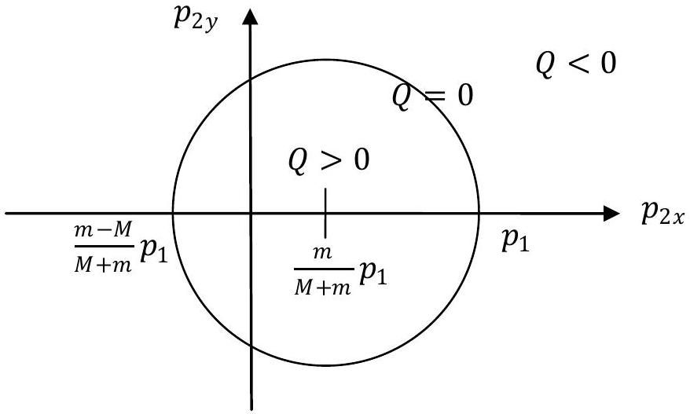
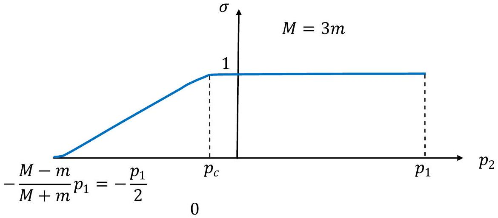
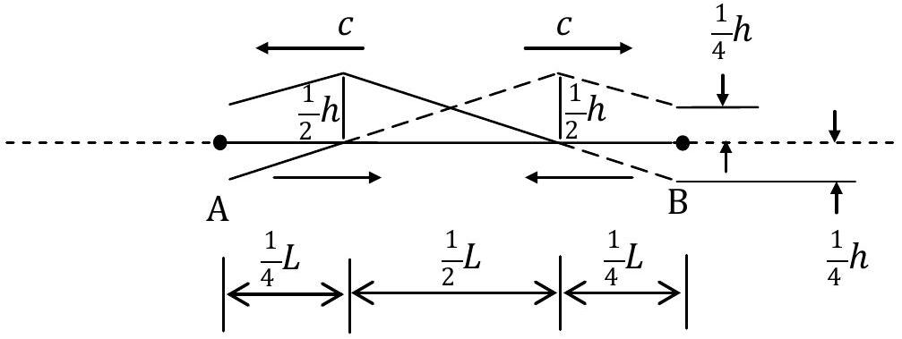
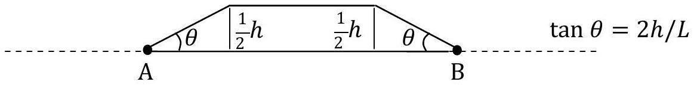
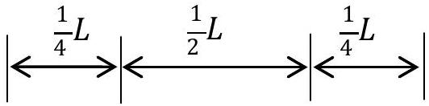
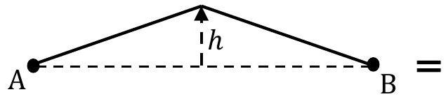
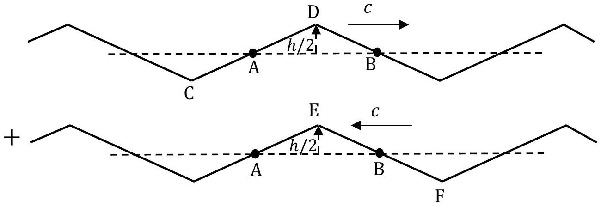
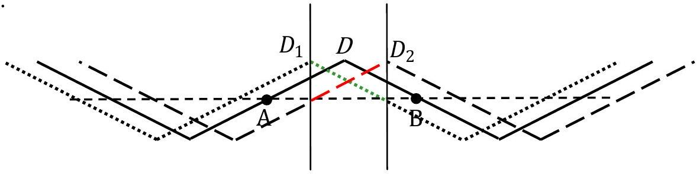
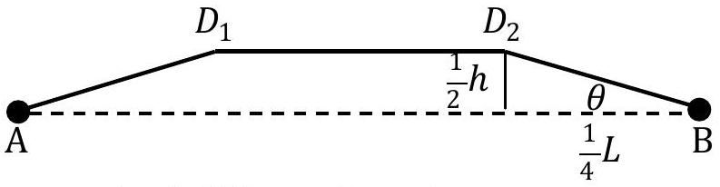

## Theoretical Question 1: Particles and Waves SOLUTION

## Part A. Inelastic scattering and compositeness of particles

(a) Let the momentum of the target particle after scattering be $\vec { P }$. The law of conservation of linear momentum implies $\vec { P } = \vec { p } _ { 1 } - \vec { p } _ { 2 }$. The total translational kinetic energies of the scattering system before and after scattering are, respectively,
$$
\begin{align*}
& K _ { i } = \frac { p _ { 1 } ^ { 2 } } { 2 m } \\
& K _ { \mathrm { f } } = \frac { p _ { 2 } ^ { 2 } } { 2 m } + \frac { \left( \vec { p } _ { 1 } - \vec { p } _ { 2 } \right) ^ { 2 } } { 2 M } = \frac { p _ { 2 } ^ { 2 } } { 2 m } + \frac { 1 } { 2 M } \left( p _ { 1 } ^ { 2 } - 2 p _ { 1 } p _ { 2 x } + p _ { 2 } ^ { 2 } \right) . \tag{a-1}
\end{align*}
$$
(i) By definition, we have $Q = K _ { \mathrm { i } } - K _ { \mathrm { f } }$, or equivalently,
$$
\begin{align*}
Q & = K _ { \mathrm { i } } - K _ { \mathrm { f } } = \frac { p _ { 1 } ^ { 2 } } { 2 m } - \frac { p _ { 2 } ^ { 2 } } { 2 m } - \frac { 1 } { 2 M } \left( p _ { 1 } ^ { 2 } - 2 p _ { 1 } p _ { 2 x } + p _ { 2 } ^ { 2 } \right) \\
& = \frac { 1 } { 2 m M } \left\{ ( M - m ) p _ { 1 } ^ { 2 } - ( M + m ) p _ { 2 } ^ { 2 } + 2 m p _ { 1 } p _ { 2 x } \right\} \\
& = \frac { M + m } { 2 m M } \left\{ \frac { M - m } { M + m } p _ { 1 } ^ { 2 } - p _ { 2 } ^ { 2 } + \frac { 2 m } { M + m } p _ { 1 } p _ { 2 x } \right\} \\
& = \frac { M + m } { 2 m M } \left\{ \frac { M - m } { M + m } p _ { 1 } ^ { 2 } - p _ { 2 x } ^ { 2 } + \frac { 2 m } { M + m } p _ { 1 } p _ { 2 x } - p _ { 2 y } ^ { 2 } \right\} \\
& = \frac { M + m } { 2 m M } \left\{ \left[ \frac { M - m } { M + m } + \left( \frac { m } { M + m } \right) ^ { 2 } \right] p _ { 1 } ^ { 2 } - \left( p _ { 2 x } - \frac { m } { M + m } p _ { 1 } \right) ^ { 2 } - p _ { 2 y } ^ { 2 } \right\} \\
& = \frac { M + m } { 2 m M } \left\{ \left( \frac { M } { M + m } \right) ^ { 2 } p _ { 1 } ^ { 2 } - \left( p _ { 2 x } - \frac { m } { M + m } p _ { 1 } \right) ^ { 2 } - p _ { 2 y } ^ { 2 } \right\} \tag{a-2}
\end{align*}
$$
(ii) If the incident and target particles are both elementary, their internal energies remain the same before and after the scattering. By the law of conservation of energy, we must have $K _ { \mathrm { i } } = K _ { \mathrm { f } }$, or $Q = 0$. Thus, we obtain from Eq. (a-2) the following equality
$$
\left( \frac { M } { M + m } \right) ^ { 2 } p _ { 1 } ^ { 2 } = \left( p _ { 2 x } - \frac { m } { M + m } p _ { 1 } \right) ^ { 2 } + p _ { 2 y } ^ { 2 }
$$
In the $p _ { 2 x } - p _ { 2 y }$ plane, this represents a circle centered at $\left( m p _ { 1 } / ( M + m ) , 0 \right)$ with radius $M p _ { 1 } / ( M + m )$. The case $m < M$ is shown in Fig. A1. The values of $p _ { 2 x }$ at the intercepts of the circle with the $p _ { 2 x }$-axis are
$$
\begin{equation*}
\frac { m } { M + m } p _ { 1 } - \frac { M } { M + m } p _ { 1 } = \frac { m - M } { M + m } p _ { 1 } \quad \text { and } \quad \frac { m } { M + m } p _ { 1 } + \frac { M } { M + m } p _ { 1 } = p _ { 1 } . \tag{a-3}
\end{equation*}
$$

Fig. A1

For a composite target in its ground state before scattering, the law of conservation of energy implies

$$
K _ { \mathrm { i } } = K _ { \mathrm { f } } + \Delta E _ { \mathrm { int } } ,
$$

where $\Delta E _ { \text {int } } \geq 0$ is the change in internal energy (or excitation energy) of the target as a result of scattering and $K _ { \mathrm { i } }$ and $K _ { \mathrm { f } }$ are given by Eq. (a-1). Thus, in this case, the total translational kinetic energy loss is given by $Q = K _ { \mathrm { i } } - K _ { \mathrm { f } } = \Delta E _ { \text {int } } \geq 0$. For points on the circumference of the circle in Fig. A1, we have $Q = 0$, i.e. elastic scattering. For the interior of the circle, we have $Q > 0$, corresponding to inelastic scattering with the target in an excited state after scattering.
The circle and its interior $( Q \geq 0 )$ are thus allowed by a composite target in its ground state before scattering.

(b) Let $L$ be the angular momentum of the target about an axis through its center of mass and normal to the plane of particle motions after scattering. By the law of conservation of angular momentum,
$$
\begin{equation*}
L = \pm \left( \frac { 1 } { 2 } d _ { 0 } \sin \theta \right) \left( p _ { 1 } - p _ { 2 } \right) \tag{a-4}
\end{equation*}
$$
where the + (or -) sign is implied if the target particle on the left (or right) in Fig. 2 is hit by the incident particle.
(i) After scattering, the target may undergo vibrational and rotational motions. When the spring reaches its maximum extension, the length of the spring is $d _ { \mathrm { m } } = ( 1 + x ) d _ { 0 }$ and the moment of inertia of the target rotating about an axis through its center of mass and perpendicular to the spring is $I _ { \mathrm { m } } = \frac { 1 } { 4 } M d _ { \mathrm { m } } { } ^ { 2 } = \frac { 1 } { 4 } M d _ { 0 } { } ^ { 2 } ( 1 + x ) ^ { 2 }$. The law of conservation of energy implies
$$
\begin{equation*}
Q = \frac { 1 } { 2 } k \left( d _ { \mathrm { m } } - d _ { 0 } \right) ^ { 2 } + \frac { L ^ { 2 } } { 2 I _ { \mathrm { m } } } \tag{a-5}
\end{equation*}
$$

where the last term represents the rotational kinetic energy of the target at the maximum extension of the spring. According to Eq. (a-4), we have

$$
\begin{equation*}
\frac { L ^ { 2 } } { 2 I _ { \mathrm { m } } } = \left( \frac { d _ { 0 } } { d _ { \mathrm { m } } } \right) ^ { 2 } \frac { \left( p _ { 1 } - p _ { 2 } \right) ^ { 2 } } { 2 M } \sin ^ { 2 } \theta = \left( \frac { 1 } { 1 + x } \right) ^ { 2 } \frac { \left( p _ { 1 } - p _ { 2 } \right) ^ { 2 } } { 2 M } \sin ^ { 2 } \theta \tag{a-6}
\end{equation*}
$$

and therefore

$$
\begin{equation*}
Q = \frac { 1 } { 2 } k d _ { 0 } ^ { 2 } x ^ { 2 } + \left( \frac { 1 } { 1 + x } \right) ^ { 2 } \frac { \left( p _ { 1 } - p _ { 2 } \right) ^ { 2 } } { 2 M } \sin ^ { 2 } \theta . \tag{a-7}
\end{equation*}
$$

Note that, since $p _ { 2 y } = 0$ and $p _ { 2 x } \equiv p _ { 2 }$, we have from Eq. (a-2)

$$
\begin{align*}
Q = K _ { \mathrm { i } } - K _ { \mathrm { f } } & = \frac { M + m } { 2 m M } \left\{ \left( \frac { M } { M + m } \right) ^ { 2 } p _ { 1 } ^ { 2 } - \left( p _ { 2 } - \frac { m } { M + m } p _ { 1 } \right) ^ { 2 } \right\} \\
& = \frac { \left( p _ { 1 } - p _ { 2 } \right) } { 2 m M } \left\{ ( M - m ) p _ { 1 } + ( M + m ) p _ { 2 } \right\} \tag{a-8}
\end{align*}
$$

A scattering can occur only if $p _ { 1 } \neq p _ { 2 }$ and $Q \geq 0$, so from Eq. (a-8), we obtain

$$
\begin{equation*}
- \frac { M - m } { M + m } p _ { 1 } \leq p _ { 2 } < p _ { 1 } \tag{a-9}
\end{equation*}
$$

where the equalities hold only if $Q = 0$.

[^0]

(ii)The scattering cross section $\sigma$ is given by the numerical range of $\alpha = \sin ^ { 2 } \theta$. For given $p _ { 1 }$ and $p _ { 2 } , Q$ is a constant by Eq. (a-8), and the value of $\alpha$ can be found from Eq. (a-7) to be
$$
\alpha = \sin ^ { 2 } \theta = \frac { 2 M } { \left( p _ { 1 } - p _ { 2 } \right) ^ { 2 } } ( 1 + x ) ^ { 2 } \left( Q - \frac { 1 } { 2 } k d _ { 0 } ^ { 2 } x ^ { 2 } \right) \geq 0 .
$$
In the limit of large $k$, the last inequality can hold only if $x$ is very small. Thus $x$ may be neglected in the factor $( 1 + x )$ and we obtain
$$
\begin{equation*}
\alpha = \sin ^ { 2 } \theta \approx \frac { 2 M } { \left( p _ { 1 } - p _ { 2 } \right) ^ { 2 } } \left( Q - \frac { 1 } { 2 } k d _ { 0 } ^ { 2 } x ^ { 2 } \right) = \beta \left( 1 - \frac { 1 } { 2 Q } k d _ { 0 } ^ { 2 } x ^ { 2 } \right) , \tag{a-10}
\end{equation*}
$$
where
$$
\begin{equation*}
\beta \equiv \frac { 2 M Q } { \left( p _ { 1 } - p _ { 2 } \right) ^ { 2 } } = \frac { 1 } { m \left( p _ { 1 } - p _ { 2 } \right) } \left\{ ( M - m ) p _ { 1 } + ( M + m ) p _ { 2 } \right\} \tag{a-11}
\end{equation*}
$$
is nonnegative and the last equality follows from Eq.(a-8).
From Eq. (a-10), the minimum value $\alpha _ { \min }$ of $\alpha = \sin ^ { 2 } \theta$ is found to be zero for all $Q \geq 0$, and this occurs when
$$
x ^ { 2 } = \frac { 2 Q } { k d _ { 0 } { } ^ { 2 } } \quad \left( \alpha _ { \min } = 0 \right) .
$$

Moreover, the maximum value $\alpha _ { \text {max } }$ of $\alpha = \sin ^ { 2 } \theta$ is seen to be given by

$$
\alpha _ { \max } = \begin{cases} \beta & \text { if } \beta \leq 1 \text { and } x = 0 ,  \tag{a-12}\\ 1 & \text { if } \beta \geq 1 \text { and } \left( 1 - \frac { 1 } { 2 Q } k d _ { 0 } { } ^ { 2 } x ^ { 2 } \right) = \frac { 1 } { \beta } . \end{cases}
$$

Note that, from Eq. (a-11), it follows

$$
\beta = \left\{ \begin{array} { l }
\leq 1 \text { if } p _ { 2 } \leq - \frac { M - 2 m } { M + 2 m } p _ { 1 } , \\
\geq 1 \text { if } p _ { 2 } \geq - \frac { M - 2 m } { M + 2 m } p _ { 1 } .
\end{array} \right.
$$

Since $\alpha _ { \text {min } } = 0$, the cross section is given by $\sigma = \alpha _ { \text {max } } - \alpha _ { \text {min } } = \alpha _ { \text {max } }$ and, from Eq. (a-12), we see that it becomes 1 and is independent of $p _ { 2 }$ when $\beta \geq 1$. Thus the threshold value $p _ { c }$ at which scaling of cross section starts is given by

$$
\begin{equation*}
p _ { c } = - \frac { M - 2 m } { M + 2 m } p _ { 1 } . \tag{a-13}
\end{equation*}
$$

For $p _ { 2 }$ below the threshold value, the cross section is equal to $\beta$ according to Eq. (a-12) and, from Eq. (a-11), we have the following result

$$
\begin{equation*}
\sigma = \beta = \frac { ( M - m ) p _ { 1 } + ( M + m ) p _ { 2 } } { m \left( p _ { 1 } - p _ { 2 } \right) } = \frac { M \left( p _ { 1 } + p _ { 2 } \right) } { m \left( p _ { 1 } - p _ { 2 } \right) } - 1 . \quad \left( p _ { 2 } \leq p _ { c } \right) \tag{a-14}
\end{equation*}
$$

Note that, from Eq. (a-9), we have $\sigma \geq 0$ for $p _ { 2 } \leq p _ { c }$ as expected. The cross section $\sigma$ as a function of $p _ { 2 }$ is shown in Fig. A2 which evidently shows scaling behavior.

Figure A2

## Part B. Waves on a string

(c) The initial disturbance will propagate toward the fixed ends. It can be considered as the superposition of two waves with wave forms $y _ { R } ( x - c t )$ and $y _ { L } ( x + c t )$, travelling toward the right and the left, respectively. They will both be reflected out of phase at the fixed ends. At $t = 0$, the sum of their displacements must be equal to the initial wave form $f ( x )$. Therefore
$$
\begin{equation*}
y _ { R } ( x ) + y _ { L } ( x ) = f ( x ) , \quad 0 \leq x \leq L \tag{b-1}
\end{equation*}
$$
Let $y ^ { \prime } ( x ) = d y / d x$. At $t = 0$, the string is at rest and the sum of velocities $\dot { y } _ { \mathrm { R } } = - c y _ { \mathrm { R } } ^ { \prime }$ and $\dot { \mathrm { y } } _ { \mathrm { L } } = c y ^ { \prime } { } _ { \mathrm { L } }$ of the two waves at $x$ must be zero. Thus we have
$$
\begin{equation*}
y _ { R } ^ { \prime } ( x ) - y _ { L } ^ { \prime } ( x ) = 0 , \quad 0 \leq x \leq L \tag{b-2}
\end{equation*}
$$
Integrating Eq. (b-2) with respect to $x$ and combining with Eq. (b-1), we obtain
$$
\begin{equation*}
y _ { R } ( x ) = \frac { 1 } { 2 } \left( f ( x ) + y _ { 0 } \right) , \quad y _ { L } ( x ) = \frac { 1 } { 2 } \left( f ( x ) - y _ { 0 } \right) , \quad \leq x \leq L , \tag{b-3}
\end{equation*}
$$
where $y _ { 0 }$ is a constant. (Note that this result may also be obtained by graphical construction which takes initial conditions into account by superposing two pulses of identical wave form but travelling in opposite directions.)
Since both waves, after being reflected once at each end and having travelled a distance $2 L$, return to its original position and state, the period is thus
$$
\begin{equation*}
T = \frac { 2 L } { c } . \tag{b-4}
\end{equation*}
$$
[Another way to get the period $T$ ]:
Because the first harmonics (with the longest period) has $\lambda = 2 L$, we have
$$
\begin{equation*}
T = \frac { 1 } { f } = \frac { \lambda } { c } = \frac { 2 L } { c } . \tag{b-4'}
\end{equation*}
$$
At $t = T / 8$, 1/8 of each wave will have been reflected out of phase as shown below, where the result for the wave traveling to the right is shown as dashed lines,

The displacements of all wave components may be added to give the resultant wave form at $t = T / 8$, as shown below.

[Another solution of (c)]:
Since the evolution of the string is periodic, waves that can simulate it must be periodic in space. Furthermore, since the string is released from rest, we can consider the initial configuration of the string as a superposition of two saw-tooth waves travelling in opposite directions as shown below:

Both A and B will be fixed because two saw-tooth waves tend to move A or B in opposite directions. Clearly, the period of motion is the time for the saw-tooth wave to travel the distance $2 L$. Hence we obtain

$$
\begin{equation*}
T = \frac { 2 L } { c } . \tag{b-4''}
\end{equation*}
$$

At any time $t$, the shape of the string is determined by adding up the two waves as shown below:

From the figure above, one sees that between $D _ { 1 }$ and $D _ { 2 }$, two saw-tooth waves (line marked by green and red line) have opposite slopes and hence their sum between $D _ { 1 }$ and $D _ { 2 }$ is constant with the height being given by $h / 2$ (the height of $D _ { 1 }$ or $D _ { 2 }$ ). Between $A$ and $D _ { 1 }$ or $B$ and $D _ { 2 }$, two saw-tooth waves have the same slope but move in opposite direction, hence their sum simply reproduces the original saw-tooth shape. Thus, the shape of string at time $t$ is

with $\overline { D _ { 1 } D _ { 2 } } = 2 c t$. For $t = T / 8 , \overline { D _ { 1 } D _ { 2 } } = L / 2$ and

$$
\begin{equation*}
\tan \theta = \frac { 2 h } { L } . \tag{b-5''}
\end{equation*}
$$

(d) To find the total energy, we note that the normal force $F$ which pulls the string sideways at the midpoint is
$$
\begin{equation*}
F ( y ) = 2 \tau \sin \theta = 2 \tau \frac { 2 y } { L } , \tag{b-6}
\end{equation*}
$$
where $\tau$ is the constant tension $( h \ll L )$ on the string and $y$ is the transverse displacement at the midpoint. The work done by $F$ is the total mechanical energy given to the string or
$$
\begin{equation*}
E = \int _ { 0 } ^ { h } F ( y ) \mathrm { d } y = 2 \tau \frac { h ^ { 2 } } { L } = 2 \mu c ^ { 2 } \frac { h ^ { 2 } } { L } , \tag{b-7}
\end{equation*}
$$
where use has been made of $c = \sqrt { \tau / \mu }$.

[Another solution of (d)]:
Because $\mathrm { c } = \sqrt { \tau / \mu }$ with $\tau$ being the tension on the string, we have $\tau = \mu c ^ { 2 }$. The total mechanical energy $E$ at $t = 0$ is the potential energy

$$
\begin{equation*}
E = U = \frac { 1 } { 2 } \tau \int _ { 0 } ^ { L } \left( \frac { \partial y } { \partial x } \right) ^ { 2 } d x = \frac { 1 } { 2 } \mu c ^ { 2 } \left( \frac { h } { L / 2 } \right) ^ { 2 } L = 2 \mu c ^ { 2 } \frac { h ^ { 2 } } { L } \tag{b-7'}
\end{equation*}
$$

Here $y ( x , t )$ is the displacement of the elastic string.
[Yet another solution of (d)]:
We consider a special moment when $\overline { C D }$ and $\overline { E F }$ move into $\overline { A B }$ region completely. At this moment, the string is flat so that total mechanical energy is equal to the total kinetic energy. Since the velocity for each point on the string is $2 c \tan \alpha$ (downward) with $\tan \alpha = h / L$, we obtain

$$
\begin{equation*}
E = \frac { 1 } { 2 } \mu L ( 2 c \tan \alpha ) ^ { 2 } = 2 \mu c ^ { 2 } \frac { h ^ { 2 } } { L } . \tag{b-7"}
\end{equation*}
$$

## Part C. The expanding universe

(e) The photons were emitted at $t _ { \mathrm { e } }$, and are received now at $t _ { 0 }$, so
$$
\begin{equation*}
\frac { a \left( t _ { 0 } \right) } { a \left( t _ { \mathrm { e } } \right) } = \frac { \lambda \left( t _ { 0 } \right) } { \lambda \left( t _ { \mathrm { e } } \right) } = \frac { 145.8 } { 121.5 } \approx 1.200 \tag{c-1}
\end{equation*}
$$
On the other hand, the Hubble parameter can be derived as
$$
\begin{equation*}
a ( t ) \propto \exp ( b t ) \rightarrow H ( t ) = \frac { \dot { a } ( t ) } { a ( t ) } = b , \tag{c-2}
\end{equation*}
$$
which is independent of time.
Within $d t$ at some moment $t$ in the past, the photons traveled $c d t$, which was
$$
\frac { a \left( t _ { \mathrm { e } } \right) } { a ( t ) } c d t
$$
at time $t _ { \mathrm { e } }$ due to the cosmic expansion. The photons were emitted at $t _ { \mathrm { e } }$ so the distance of the star from us at that time is
$$
\begin{align*}
L \left( t _ { \mathrm { e } } \right) & = \int _ { t _ { \mathrm { e } } } ^ { t _ { 0 } } \frac { a \left( t _ { \mathrm { e } } \right) } { a ( t ) } c d t = c \int _ { t _ { \mathrm { e } } } ^ { t _ { 0 } } \exp \left[ H \left( t _ { \mathrm { e } } - t \right) \right] d t \\
& = \frac { c } { H } \left( 1 - \exp \left[ H \left( t _ { \mathrm { e } } - t _ { 0 } \right) \right] \right) \tag{c-3}
\end{align*}
$$
We already know from Eq. (c-2) that
$$
\begin{equation*}
\frac { \exp \left( H t _ { 0 } \right) } { \exp \left( H t _ { \mathrm { e } } \right) } = \frac { a \left( t _ { 0 } \right) } { a \left( t _ { \mathrm { e } } \right) } \approx 1.200 , \tag{c-4}
\end{equation*}
$$
thus
$$
\begin{equation*}
L \left( t _ { \mathrm { e } } \right) = \frac { c } { H } \left( 1 - \frac { 1 } { 1.200 } \right) \approx 690 \mathrm { Mpc } . \tag{c-5}
\end{equation*}
$$
(f) Due to the cosmic expansion, the above distance is actually longer now:
$$
\begin{equation*}
L \left( t _ { 0 } \right) = \frac { a \left( t _ { 0 } \right) } { a \left( t _ { \mathrm { e } } \right) } L \left( t _ { \mathrm { e } } \right) = \frac { a \left( t _ { 0 } \right) } { a \left( t _ { \mathrm { e } } \right) } \frac { c } { H } \left( 1 - \frac { a \left( t _ { \mathrm { e } } \right) } { a \left( t _ { 0 } \right) } \right) \tag{c-6}
\end{equation*}
$$
Thus according to the Hubble Law, we can compute the receding velocity of the star now:
$$
\begin{equation*}
\mathrm { v } \left( t _ { 0 } \right) = H L \left( t _ { 0 } \right) = H \frac { a \left( t _ { 0 } \right) } { a \left( t _ { \mathrm { e } } \right) } \frac { c } { H } \left( 1 - \frac { a \left( t _ { \mathrm { e } } \right) } { a \left( t _ { 0 } \right) } \right) = \left( \frac { a \left( t _ { 0 } \right) } { a \left( t _ { \mathrm { e } } \right) } - 1 \right) c \approx 0.200 c \tag{c-7}
\end{equation*}
$$

[^0]:    *An equation marked with an asterisk gives key answers to the problem.
