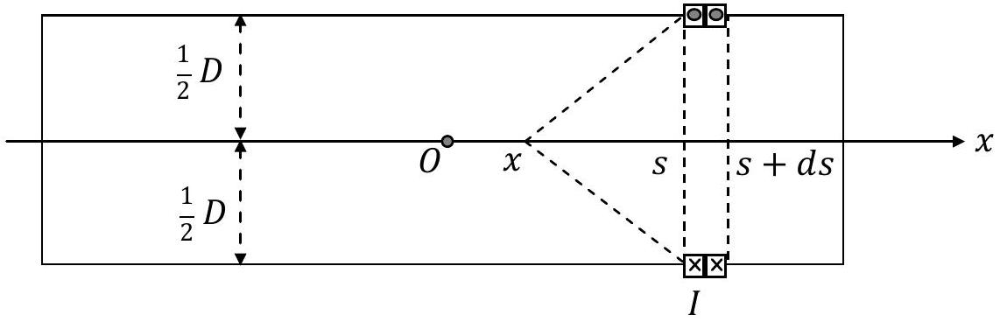
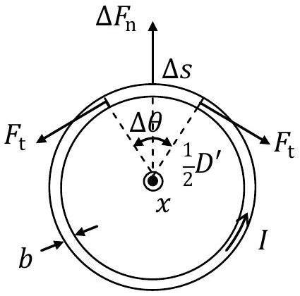

## Theoretical Question 2: Strong Resistive Electromagnets SOLUTION

## Part A. Magnetic Fields on the Axis of the Coil

(a)At the point $x$ on the axis, the magnetic field due to the current $I$ passing through the turns located in the interval $( s , s + d s )$ is (see Fig. A1)

$$
\begin{equation*}
d \vec { B } = \left( \frac { \mu _ { 0 } } { 4 \pi } \right) \frac { I ( \pi D ) } { ( D / 2 ) ^ { 2 } + ( s - x ) ^ { 2 } } \cdot \frac { ( D / 2 ) } { \sqrt { ( D / 2 ) ^ { 2 } + ( s - x ) ^ { 2 } } } \cdot \frac { d s } { a } \hat { x } \tag{a-1}
\end{equation*}
$$

which, when summed over all turns of the coil, leads to the total magnetic field $\vec { B } ( x ) =$ $B ( x ) \widehat { x }$ with

$$
B ( x ) = \frac { \mu _ { 0 } I } { 2 a } \left( \frac { D } { 2 } \right) ^ { 2 } \int _ { - \ell / 2 } ^ { \ell / 2 } \frac { d s } { \left[ ( D / 2 ) ^ { 2 } + ( s - x ) ^ { 2 } \right] ^ { 3 / 2 } }
$$

$$
\begin{align*}
& = \frac { \mu _ { 0 } I } { 2 a } \left( \frac { D } { 2 } \right) ^ { 2 } \int _ { - \ell / 2 - x } ^ { \ell / 2 - x } \frac { d s } { \left[ ( D / 2 ) ^ { 2 } + s ^ { 2 } \right] ^ { 3 / 2 } } \\
& = \frac { \mu _ { 0 } I } { 2 a } \left\{ \frac { ( \ell / 2 ) - x } { \sqrt { ( D / 2 ) ^ { 2 } + [ ( \ell / 2 ) - x ] ^ { 2 } } } + \frac { ( \ell / 2 ) + x } { \sqrt { ( D / 2 ) ^ { 2 } + [ ( \ell / 2 ) + x ] ^ { 2 } } } \right\} \tag{a-2}
\end{align*}
$$

no. of turns in $d s$ is $d s / a$

Figure A1

(b) From Eq. (a-2), the magnetic field at 0 wth $x = 0$ is
$$
\begin{equation*}
B ( 0 ) = \frac { \mu _ { 0 } I } { 2 a } \frac { 2 ( \ell / 2 ) } { \sqrt { ( D / 2 ) ^ { 2 } + ( \ell / 2 ) ^ { 2 } } } = \frac { \mu _ { 0 } I } { a } \frac { 1 } { \sqrt { 1 + ( D / \ell ) ^ { 2 } } } \tag{b-1}
\end{equation*}
$$
If $B ( 0 )$ is 10.0 T , then the current $I$ must be equal to
$$
\begin{equation*}
I _ { 0 } = B ( 0 ) \frac { a } { \mu _ { 0 } } \sqrt { 1 + ( D / \ell ) ^ { 2 } } = 1.7794 \times 10 ^ { 4 } \mathrm {~A} \cong 1.8 \times 10 ^ { 4 } \mathrm {~A} \tag{b-2}
\end{equation*}
$$
[^0]

## Part B. The Upper Limit of Current

(c)For an infinitely long coil with $\ell \rightarrow \infty$ and $b \ll D$, the magnetic field $\vec { B }$ acting on the current is the average of the fields inside and outside of the coil. The field outside is zero and the field inside is the same as that at O , i.e. $B ( 0 )$ in Eq. (b-1) with $\ell \rightarrow \infty$. Thus we have

$$
\begin{equation*}
\vec { B } = \bar { B } \hat { x } = \frac { 1 } { 2 } \left( 0 + \frac { \mu _ { 0 } I } { a } \right) \hat { x } = \frac { \mu _ { 0 } I } { 2 a } \hat { x } , \tag{c-1}
\end{equation*}
$$

and the outward normal force on the wire segment of length $\Delta s$ is

$$
\begin{equation*}
\Delta F _ { \mathrm { n } } = I \bar { B } \Delta s = I \Delta s \left( \frac { \mu _ { 0 } I } { 2 a } \right) \quad \text { or } \quad \frac { \Delta F _ { \mathrm { n } } } { \Delta s } = \frac { \mu _ { 0 } } { 2 a } I ^ { 2 } . \tag{c-2}
\end{equation*}
$$

As can be seen from Fig. A2, the resultant of the pair of tension forces at the ends of the segment $\Delta s$ is given by

$$
\begin{equation*}
- 2 F _ { \mathrm { t } } \sin \left( \frac { \Delta \theta } { 2 } \right) \cong - F _ { \mathrm { t } } \Delta \theta = - F _ { \mathrm { t } } \left( \frac { 2 \Delta s } { D ^ { \prime } } \right) . \tag{c-3}
\end{equation*}
$$

This must be in equilibrium with the normal force $\Delta F _ { \mathrm { n } }$ so that, by using Eq. (c-2), we have

$$
\begin{equation*}
\Delta F _ { \mathrm { n } } = F _ { \mathrm { t } } \left( \frac { 2 \Delta s } { D ^ { \prime } } \right) \text { or } F _ { \mathrm { t } } = \frac { D ^ { \prime } } { 2 } \left( \frac { \Delta F _ { \mathrm { n } } } { \Delta s } \right) = \frac { \mu _ { 0 } } { 4 a } I ^ { 2 } D ^ { \prime } . \tag{c-4}
\end{equation*}
$$

Figure A2

(d) At breaking, the tensile stress of the wire is, from Eq. (c-4),
$$
\begin{equation*}
\frac { F _ { \mathrm { t } } } { a b } = \frac { \mu _ { 0 } } { 4 a ^ { 2 } b } I _ { \mathrm { b } } ^ { 2 } D ^ { \prime } = \sigma _ { \mathrm { b } } = 4.55 \times 10 ^ { 8 } \mathrm {~Pa} , \tag{d-1}
\end{equation*}
$$
and the tensile strain of the wire is
$$
\begin{equation*}
\frac { \pi \left( D ^ { \prime } - D \right) } { \pi D } = \frac { \left( D ^ { \prime } - D \right) } { D } = 60 \% \text { or } D ^ { \prime } = 1.60 D . \tag{d-2}
\end{equation*}
$$
From the last two equations, the current $I _ { \mathrm { b } }$ at which the turn will break is
$$
\begin{equation*}
I _ { \mathrm { b } } = 2 a \sqrt { \frac { b \sigma _ { \mathrm { b } } } { \mu _ { 0 } D ^ { \prime } } } = 2 a \sqrt { \frac { b \sigma _ { \mathrm { b } } } { \mu _ { 0 } ( 1.60 D ) } } = 1.737 \times 10 ^ { 4 } \mathrm {~A} \cong 1.7 \times 10 ^ { 4 } \mathrm {~A} , \tag{d-3}
\end{equation*}
$$
and the magnitude of the magnetic field at the center 0, i.e. Eq. (b-1) with $\ell \rightarrow \infty$, is
$$
\begin{equation*}
B _ { \mathrm { b } } = \frac { \mu _ { 0 } I _ { \mathrm { b } } } { a } = 2 \sqrt { \frac { \mu _ { 0 } b \sigma _ { \mathrm { b } } } { D ^ { \prime } } } = 10.914 \mathrm {~T} = 1.1 \times 10 ^ { 1 } \mathrm {~T} , \tag{d-4}
\end{equation*}
$$

## Part C. Rate of Temperature Rise

(e) When the current $I$ is 10.0 kA , the current density $J$ is given by

$$
\begin{equation*}
J = \frac { I } { a b } = \frac { 1.00 \times 10 ^ { 4 } } { \left( 2.0 \times 10 ^ { - 3 } \right) \left( 5.0 \times 10 ^ { - 3 } \right) } = 1.0 \times 10 ^ { 9 } \mathrm {~A} / \mathrm { m } ^ { 2 } . \tag{e-1}
\end{equation*}
$$

The power density is given by

$$
\begin{equation*}
\rho _ { \mathrm { e } } J ^ { 2 } = \rho _ { \mathrm { e } } \left( \frac { I } { a b } \right) ^ { 2 } = 1.720 \times 10 ^ { 10 } \mathrm {~W} / \mathrm { m } ^ { 3 } \cong 1.7 \times 10 ^ { 10 } \mathrm {~W} / \mathrm { m } ^ { 3 } . \tag{e-2}
\end{equation*}
$$

(ALTERNATIVE)
The volume $\tau$ and resistance $R$ (appearing also in Problem (h)) of the current-carrying wire for a coil of length $\ell$ are given by

$$
\begin{align*}
& \tau = \pi \left\{ \left( \frac { D + b } { 2 } \right) ^ { 2 } - \left( \frac { D - b } { 2 } \right) ^ { 2 } \right\} \ell = \pi b D \ell = N \pi a b D  \tag{e-3}\\
& R = \rho _ { \mathrm { e } } \frac { N \pi D } { a b } = \rho _ { \mathrm { e } } \frac { \pi D \ell } { a ^ { 2 } b } = 1.9453 \times 10 ^ { - 2 } \Omega \cong 1.9 \times 10 ^ { - 2 } \Omega . \tag{e-4}
\end{align*}
$$

The total power $P$ of Joule heat generated in the coil is

$$
\begin{equation*}
P = I ^ { 2 } R = 1.9453 \times 10 ^ { 6 } \mathrm {~W} = 1.9 \times 10 ^ { 6 } \mathrm {~W} . \tag{e-5}
\end{equation*}
$$

Thus the power density is

$$
\begin{equation*}
\frac { P } { \tau } = \frac { P } { N \pi a b D } = \frac { P } { \ell \pi b D } = 1.7 \times 10 ^ { 10 } \mathrm {~W} / \mathrm { m } ^ { 3 } . \tag{e-6}
\end{equation*}
$$

Note that, by Eqs. (e-3) to (e-5), the expression for power density may also be written as

$$
\begin{equation*}
\frac { P } { \tau } = \frac { I ^ { 2 } R } { \tau } = \frac { I ^ { 2 } } { \ell \pi b D } \rho _ { \mathrm { e } } \frac { \pi D \ell } { a ^ { 2 } b } = \rho _ { \mathrm { e } } \left( \frac { I } { a b } \right) ^ { 2 } = \rho _ { \mathrm { e } } J ^ { 2 } . \tag{e-7}
\end{equation*}
$$

This is identical to that obtained in Eq. (e-2).

(f) The time rate of temperature increase of the coil is
$$
\begin{equation*}
\dot { T } = \frac { \rho _ { \mathrm { e } } J ^ { 2 } } { \rho _ { m } c _ { p } } = \frac { \rho _ { \mathrm { e } } } { \rho _ { m } c _ { p } } \left( \frac { I } { a b } \right) ^ { 2 } . \tag{f-1}
\end{equation*}
$$
At $T = 293 \mathrm {~K}$ and $I = 10.0 \mathrm { kA }$, we have
$$
\begin{equation*}
\dot { T } = \frac { \rho _ { \mathrm { e } } } { \rho _ { m } c _ { p } } \left( \frac { I } { a b } \right) ^ { 2 } = \frac { \rho _ { \mathrm { e } } J ^ { 2 } } { \rho _ { m } c _ { p } } = 4.975 \times 10 ^ { 3 } \mathrm {~K} / \mathrm { s } \cong 5.0 \times 10 ^ { 3 } \mathrm {~K} / \mathrm { s } . \tag{f-2}
\end{equation*}
$$
(ALTERNATIVE)
The heat capacity of the coil is
$$
\begin{equation*}
M c _ { p } = \rho _ { m } ( \ell \pi b D ) c _ { p } = 3.9101 \times 10 ^ { 2 } \mathrm {~J} / \mathrm { K } \cong 3.9 \times 10 ^ { 2 } \mathrm {~J} / \mathrm { K } . \tag{f-3}
\end{equation*}
$$
From Eqs. (e-5) and (f-3), the time rate of temperature increase is
$$
\begin{equation*}
\dot { T } = \frac { I ^ { 2 } R } { M c _ { p } } = 4.975 \times 10 ^ { 3 } \mathrm {~K} / \mathrm { s } \cong 5.0 \times 10 ^ { 3 } \mathrm {~K} / \mathrm { s } . \tag{f-4}
\end{equation*}
$$

## Part D. A Pulsed-Field Magnet

(g) The magnetic flux $\phi _ { B }$ through each turn is, in the limit $\ell \rightarrow \infty$, given by
$$
\begin{equation*}
\phi _ { B } = \left\{ \lim _ { \ell \rightarrow \infty } B ( 0 ) \right\} \pi \left( \frac { D } { 2 } \right) ^ { 2 } = \frac { \mu _ { 0 } I } { a } \pi \left( \frac { D } { 2 } \right) ^ { 2 } . \tag{g-1}
\end{equation*}
$$
The inductance $L$ of the coil is
$$
\begin{equation*}
L = \frac { N \phi _ { B } } { I } = \frac { N \mu _ { 0 } } { a } \pi \left( \frac { D } { 2 } \right) ^ { 2 } = \frac { \ell \mu _ { 0 } } { 4 a ^ { 2 } } \pi D ^ { 2 } = 1.0659 \times 10 ^ { - 4 } \mathrm { H } \cong 1.1 \times 10 ^ { - 4 } \mathrm { H } . \tag{g-2}
\end{equation*}
$$
The resistance $R$ of the coil is the same as given in Eq. (e-4). Thus
$$
\begin{equation*}
R = \rho _ { \mathrm { e } } \frac { \pi D N } { a b } = \rho _ { \mathrm { e } } \frac { \pi D \ell } { a ^ { 2 } b } = 1.9453 \times 10 ^ { - 2 } \Omega \cong 1.9 \times 10 ^ { - 2 } \Omega \tag{g-3}
\end{equation*}
$$
(h) According to Kirchhoff's circuit law, the change of electric potential around a closed circuit must be zero and we have
$$
\begin{equation*}
L \frac { d I } { d t } + R I + \frac { Q } { C } = 0 . \tag{h-1}
\end{equation*}
$$
In this question, we are given
$$
\begin{align*}
Q ( t ) = \frac { C V _ { 0 } } { \sin \theta _ { 0 } } e ^ { - \alpha t } \sin \left( \omega t + \theta _ { 0 } \right) & = \left[ e ^ { \alpha \left( \frac { \theta _ { 0 } } { \omega } \right) } \right] \frac { C V _ { 0 } } { \sin \theta _ { 0 } } e ^ { - \alpha \left( t + \frac { \theta _ { 0 } } { \omega } \right) } \sin \omega \left( t + \frac { \theta _ { 0 } } { \omega } \right)  \tag{1}\\
I ( t ) = \frac { d Q } { d t } & = \left[ \left( \frac { - \alpha } { \cos \theta _ { 0 } } \right) \right] \frac { C V _ { 0 } } { \sin \theta _ { 0 } } e ^ { - \alpha t } \sin \omega t ,  \tag{2}\\
\tan \theta _ { 0 } & = \frac { \omega } { \alpha } . \tag{3}
\end{align*}
$$
Comparing the right sides of Eqs. (1) and (2), one sees that the current $I ( t ) = d Q / d t$ is obtained from $Q ( t )$ by changing the latter's time variable $t$ to $\left( t - \theta _ { 0 } / \omega \right)$ or, equivalently, changing $\left( t + \theta _ { 0 } / \omega \right)$ to $t$, and then multiplying its amplitude constant by a factor
$$
\left\{ e ^ { - \alpha \frac { \theta _ { 0 } } { \omega } } \left( \frac { - \alpha } { \cos \theta _ { 0 } } \right) \right\} .
$$
Since $I ( t )$ in Eq. (2) has the same form as $Q ( t )$ in Eq. (1), we may apply the same rule again to obtain its derivative $d I / d t$ as
$$
\begin{align*}
\frac { d I } { d t } & = \left\{ e ^ { - \alpha \frac { \theta _ { 0 } } { \omega } } \left( \frac { - \alpha } { \cos \theta _ { 0 } } \right) \right\} \left[ \left( \frac { - \alpha } { \cos \theta _ { 0 } } \right) \frac { C V _ { 0 } } { \sin \theta _ { 0 } } \right] e ^ { - \alpha \left( t - \frac { \theta _ { 0 } } { \omega } \right) } \sin \omega \left( t - \frac { \theta _ { 0 } } { \omega } \right) \\
& = \left( \frac { \alpha } { \cos \theta _ { 0 } } \right) ^ { 2 } \frac { C V _ { 0 } } { \sin \theta _ { 0 } } e ^ { - \alpha t } \sin \left( \omega t - \theta _ { 0 } \right) \tag{h-2}
\end{align*}
$$
Making use of Formula 2 given in Appendix, we may express the left side of Eq. (h-1) as a linear combination of $\cos \omega t$ and $\sin \omega t$ so that
$$
\begin{equation*}
L \frac { d I } { d t } + R I + \frac { Q } { C } = \left( \frac { C V _ { 0 } } { \sin \theta _ { 0 } } \right) e ^ { - \alpha t } \left( A \cos \theta _ { 0 } \sin \omega t + B \sin \theta _ { 0 } \cos \omega t \right) = 0 , \tag{h-3}
\end{equation*}
$$

which can be satisfied if and only if

$$
\begin{align*}
A & \equiv L \left( \frac { \alpha } { \cos \theta _ { 0 } } \right) ^ { 2 } - R \left( \frac { \alpha } { \cos ^ { 2 } \theta _ { 0 } } \right) + \frac { 1 } { C } = 0 ,  \tag{h-4}\\
B & \equiv - L \left( \frac { \alpha } { \cos \theta _ { 0 } } \right) ^ { 2 } + \frac { 1 } { C } = 0 , \tag{h-5}
\end{align*}
$$

Note that Eqs. (h-4) and (h-5) may be obtained more simply by considering Eq. (h-1) at the moments when $\sin \omega t = 1$ and 0, respectively. Subtracting Eq. (h-5) from Eq. (h-4), we obtain

$$
\begin{equation*}
\alpha = \frac { R } { 2 L } , \tag{h-6}
\end{equation*}
$$

If we use the expressions given in Eqs. (g-2) and (g-3), we obtain

$$
\begin{equation*}
\alpha = \frac { R } { 2 L } = \frac { \rho _ { e } \frac { \pi D \ell } { a ^ { 2 } b } } { \pi D ^ { 2 } \frac { \ell \mu _ { 0 } } { 2 a ^ { 2 } } } = \frac { 2 \rho _ { e } } { \mu _ { 0 } b D } = 9.1249 \times 10 ^ { 1 } \mathrm {~s} ^ { - 1 } \cong 9.1 \times 10 ^ { 1 } \mathrm {~s} ^ { - 1 } \tag{h-7}
\end{equation*}
$$

Adding up Eqs. (h-4) and (h-5), we have, by Eq. (h-6) and Eq. (3),

$$
\begin{equation*}
\frac { 1 } { L C } = \frac { R \alpha } { 2 L \cos ^ { 2 } \theta _ { 0 } } = \frac { \alpha ^ { 2 } } { \cos ^ { 2 } \theta _ { 0 } } = \alpha ^ { 2 } \left( 1 + \tan ^ { 2 } \theta _ { 0 } \right) = \alpha ^ { 2 } + \omega ^ { 2 } . \tag{h-8}
\end{equation*}
$$

This may be rewritten as

$$
\begin{equation*}
\omega ^ { 2 } = \omega _ { 0 } ^ { 2 } - \alpha ^ { 2 } = \frac { 1 } { L C } - \left( \frac { R } { 2 L } \right) ^ { 2 } \quad \text { with } \quad \omega _ { 0 } = \frac { 1 } { \sqrt { L C } } = 9.7 \times 10 ^ { 2 } \mathrm { rad } / \mathrm { s } , \tag{h-9}
\end{equation*}
$$

and we obtain

$$
\begin{equation*}
\omega = \sqrt { \omega _ { 0 } ^ { 2 } - \alpha ^ { 2 } } = 9.6428 \times 10 ^ { 2 } \mathrm { rad } / \mathrm { s } \cong 9.6 \times 10 ^ { 2 } \mathrm { rad } / \mathrm { s } . \tag{h-10}
\end{equation*}
$$

(i) From Eq. (h-2), the maximum value of $| I ( t ) |$ appears at $d I / d t = 0$ when the time is
$$
\begin{equation*}
t _ { \mathrm { m } } = \frac { \theta _ { 0 } } { \omega } . \tag{i-1}
\end{equation*}
$$
From Eq. (2), the maximum value of $| I ( t ) |$ is then given by
$$
\begin{equation*}
I _ { \mathrm { m } } = \left| I \left( t _ { \mathrm { m } } \right) \right| = \left( \frac { \alpha } { \cos \theta _ { 0 } } \right) C V _ { 0 } e ^ { - \frac { \alpha } { \omega } \theta _ { 0 } } . \tag{i-2}
\end{equation*}
$$
From Eqs. (3), (h-7) and (h-10), we have
$$
\begin{equation*}
\tan \theta _ { 0 } = \frac { \omega } { \alpha } = 10.568 , \quad \theta _ { 0 } = 1.4764 \mathrm { rad } , \quad t _ { \mathrm { m } } = \frac { \theta _ { 0 } } { \omega } = 1.531 \times 10 ^ { - 3 } \mathrm {~s} . \tag{i-3}
\end{equation*}
$$
If $I _ { \mathrm { m } }$ does not exceed $I _ { \mathrm { b } }$ found in Problem (d), we must have
$$
\begin{equation*}
I _ { \mathrm { m } } = \left| I \left( t _ { \mathrm { m } } \right) \right| \leq I _ { \mathrm { b } } \text { or } \left( \frac { \alpha } { \cos \theta _ { 0 } } \right) C V _ { 0 } e ^ { - \frac { \alpha } { \omega } \theta _ { 0 } } \leq I _ { \mathrm { b } } , \tag{i-4}
\end{equation*}
$$
which implies that the maximum value $V _ { 0 \mathrm {~b} }$ of $V _ { 0 }$ occurs when the equality holds and is given by
$$
\begin{equation*}
V _ { 0 \mathrm {~b} } = \frac { I _ { \mathrm { b } } } { \alpha C } e ^ { \frac { \alpha } { \omega } \theta _ { 0 } } \cos \theta _ { 0 } = 2.0623 \times 10 ^ { 3 } \mathrm {~V} \cong 2.1 \times 10 ^ { 3 } \mathrm {~V} \tag{i-5}
\end{equation*}
$$

25 April 2010
(Document Released: 14:30, 4/24)

[j] When $| I ( t ) |$ reaches its maximum at $t = t _ { \mathrm { m } } = \theta _ { 0 } / \omega$, the voltage of the capacitor has dropped from the initial voltage $V _ { 0 } = V _ { 0 \mathrm {~b} }$ to
$$
\begin{equation*}
V \left( t _ { \mathrm { m } } \right) = \frac { Q \left( t _ { \mathrm { m } } \right) } { C } = \frac { V _ { 0 \mathrm {~b} } } { \sin \theta _ { 0 } } e ^ { - \frac { \alpha } { \omega } \theta _ { 0 } } \sin \left( 2 \theta _ { 0 } \right) = 2 V _ { 0 \mathrm {~b} } e ^ { - \frac { \alpha } { \omega } \theta _ { 0 } } \cos \theta _ { 0 } . \tag{j-1}
\end{equation*}
$$
From $t = 0$ to $t = t _ { \mathrm { m } }$, the energy supplied by the capacitor bank to the circuit, in the form of Joule heat and magnetic energy in the field of the coil, is
$$
\begin{equation*}
E _ { C } = \frac { 1 } { 2 } C \left\{ V _ { 0 \mathrm {~b} } ^ { 2 } - \left[ V \left( t _ { \mathrm { m } } \right) \right] ^ { 2 } \right\} = \frac { 1 } { 2 } C V _ { 0 \mathrm {~b} } ^ { 2 } \left\{ 1 - 4 e ^ { - \frac { 2 \alpha } { \omega } \theta _ { 0 } } \cos ^ { 2 } \theta _ { 0 } \right\} . \tag{j-2}
\end{equation*}
$$
By the law of conservation of energy, this entire amount of energy is eventually turned into heat in the coil and we have
$$
\begin{equation*}
\Delta E = E _ { C } = \frac { 1 } { 2 } C V _ { 0 \mathrm {~b} } ^ { 2 } \left\{ 1 - 4 e ^ { - \frac { 2 \alpha } { \omega } \theta _ { 0 } } \cos ^ { 2 } \theta _ { 0 } \right\} = 2.0694 \times 10 ^ { 4 } \mathrm {~J} \cong 2.1 \times 10 ^ { 4 } \mathrm {~J} . \tag{j-3}
\end{equation*}
$$
If the heat capacity (as computed in Eq. (f-3) remains about the same as that at $T = 293 \mathrm {~K}$, then the temperature increase $\Delta T$ is
$$
\begin{equation*}
\Delta T = \frac { \Delta E } { M c _ { p } } = \frac { \Delta E } { \rho _ { m } ( \ell \pi b D ) c _ { p } } = 53 \mathrm {~K} . \tag{j-4}
\end{equation*}
$$
With such a temperature increase, the thermal and electrical properties of a metal such as copper do not change substantially.

[^0]:    *An equation marked with an asterisk gives key answers to the problem.
