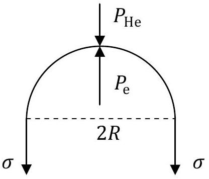

## Theoretical Question 3: Electron and Gas Bubbles in Liquids SOLUTION

## Part A. An Electron Bubble in Liquid Helium

(a)Consider a half of the spherical interface (see Fig. A1 below). The condition for its static equilibrium implies that the total force acting on it must be zero. This implies

$$
\begin{equation*}
\pi R ^ { 2 } \left( P _ { \mathrm { e } } - P _ { \mathrm { He } } \right) = 2 \pi R \sigma \tag{a-1}
\end{equation*}
$$

which leads to

$$
\begin{equation*}
P _ { \mathrm { e } } = P _ { \mathrm { He } } + \frac { 2 \sigma } { R } \tag{a-2}
\end{equation*}
$$

Fig. A1

[^0]
between the non-relativistic kinetic energy $E _ { \mathrm { k } }$ and the pressure $P _ { \mathrm { e } }$ for an electron inside a bubble is similar to that obtained from the kinetic theory of gases. Thus we have

$$
\begin{equation*}
P _ { \mathrm { e } } = \frac { 2 } { 3 } \frac { E _ { \mathrm { k } } } { V } = \frac { 2 } { 4 \pi R ^ { 3 } } E _ { \mathrm { k } } = \frac { 1 } { 2 \pi R ^ { 3 } } E _ { \mathrm { k } } \tag{a-7}
\end{equation*}
$$

(b) Let $\hbar = h / ( 2 \pi )$. From the uncertainty relations, we have

$$
\begin{equation*}
\Delta x \Delta p _ { x } \geq \frac { 1 } { 2 } \hbar , \quad \Delta y \Delta p _ { y } \geq \frac { 1 } { 2 } \hbar , \quad \Delta z \Delta p _ { z } \geq \frac { 1 } { 2 } \hbar . \tag{b-1}
\end{equation*}
$$

From symmetry considerations implied by isotropy, we have

$$
\begin{gather*}
\bar { x } = \bar { y } = \bar { z } = 0 , \quad \overline { p _ { x } } = \overline { p _ { y } } = \overline { p _ { z } } = 0  \tag{b-2}\\
( \Delta x ) ^ { 2 } = \overline { x ^ { 2 } } - \bar { x } ^ { 2 } = \overline { x ^ { 2 } } = ( \Delta y ) ^ { 2 } = ( \Delta z ) ^ { 2 } , \quad \left( \Delta p _ { x } \right) ^ { 2 } = \overline { p _ { x } { } ^ { 2 } } = \left( \Delta p _ { y } \right) ^ { 2 } = \left( \Delta p _ { z } \right) ^ { 2 } . \tag{b-3}
\end{gather*}
$$

where $\bar { f }$ denotes the mean value of the quantity $f$. Therefore, we have

$$
\begin{gather*}
3 ( \Delta \mathrm { x } ) ^ { 2 } = ( \Delta \mathrm { x } ) ^ { 2 } + ( \Delta \mathrm { y } ) ^ { 2 } + ( \Delta \mathrm { z } ) ^ { 2 } = \overline { \mathrm { x } ^ { 2 } } + \overline { \mathrm { y } ^ { 2 } } + \overline { \mathrm { z } ^ { 2 } } = \overline { \mathrm { r } ^ { 2 } } .  \tag{b-4}\\
3 \left( \Delta p _ { x } \right) ^ { 2 } = \left( \Delta p _ { x } \right) ^ { 2 } + \left( \Delta p _ { y } \right) ^ { 2 } + \left( \Delta p _ { z } \right) ^ { 2 } = \overline { p _ { x } ^ { 2 } } + \overline { p _ { y } ^ { 2 } } + \overline { p _ { z } ^ { 2 } } = \overline { p ^ { 2 } } . \tag{b-5}
\end{gather*}
$$

Thus we obtain (cf. $18 { } ^ { \text {th } }$ IPhO)

$$
\begin{equation*}
\overline { r ^ { 2 } } \overline { p ^ { 2 } } = 9 ( \Delta x ) ^ { 2 } \left( \Delta p _ { x } \right) ^ { 2 } \geq \frac { 9 } { 4 } \hbar ^ { 2 } \tag{b-6}
\end{equation*}
$$

and the kinetic energy must satisfy the following inequality:

$$
\begin{equation*}
E _ { \mathrm { k } } = \frac { \overline { p ^ { 2 } } } { 2 m } \geq \frac { 1 } { 2 m } \left( \frac { 9 \hbar ^ { 2 } } { 4 } \right) \frac { 1 } { \overline { r ^ { 2 } } } \tag{b-7}
\end{equation*}
$$

The smallest possible kinetic energy $E _ { 0 }$ of the electron consistent with the uncertainty relations is thus obtained if the mean-squared-radius $\overline { r ^ { 2 } }$ is set equal to its largest possible value of $R ^ { 2 }$. This gives

$$
\begin{equation*}
E _ { \mathrm { k } } \geq E _ { 0 } = \frac { 9 \hbar ^ { 2 } } { 8 m R ^ { 2 } } \tag{b-8}
\end{equation*}
$$

(c) If $E _ { \mathrm { k } } = E _ { 0 }$, it follows from Eqs. (a-2), (a-3), and (b-7) that we have

$$
\begin{equation*}
P _ { \mathrm { e } } = \frac { 1 } { 2 \pi R ^ { 3 } } E _ { 0 } = \frac { 9 \hbar ^ { 2 } } { 16 m \pi R ^ { 5 } } = \frac { 2 \sigma } { R } + P _ { \mathrm { He } } \tag{c-1}
\end{equation*}
$$

For $P _ { \mathrm { He } } = 0$, this gives the following equilibrium radius of the electron bubble:

$$
\begin{align*}
R _ { \mathrm { e } } & = \left( \frac { 9 \hbar ^ { 2 } } { 32 \pi m \sigma } \right) ^ { \frac { 1 } { 4 } } = \left( \frac { 9 \times \left( 1.055 \times 10 ^ { - 34 } \right) ^ { 2 } } { 32 \pi \times 9.11 \times 10 ^ { - 31 } \times 3.75 \times 10 ^ { - 4 } } \right) ^ { \frac { 1 } { 4 } } \\
& = \left( 2.91674 \times 10 ^ { - 36 } \right) ^ { 1 / 4 } \mathrm {~m} \cong 1.31 \mathrm {~nm} \tag{c-2}
\end{align*}
$$

It might be of some interest to note that, from Eq. (c-1), the corresponding minimum kinetic energy is

$$
\begin{equation*}
E _ { 0 } = 4 \pi R _ { 0 } ^ { 2 } \sigma = 3 h \left( \frac { \sigma } { 2 \pi m } \right) ^ { 1 / 2 } = 0.100 \mathrm { eV } \tag{c-3}
\end{equation*}
$$

(d) The condition for stable local equilibrium of the electron bubble at radius $R$ is that when $R$ is increased by a small amount $d R > 0$, the inward force pushing on the interface must be greater than the outward force so as to decrease the radius. Thus, from Eq. (c-1), we obtain
$$
\begin{equation*}
\frac { 2 \sigma } { ( R + d R ) } + P _ { \mathrm { He } } > \frac { 9 \hbar ^ { 2 } } { 16 m \pi ( R + d R ) ^ { 5 } } \tag{d-1}
\end{equation*}
$$
By keeping only terms linear in $d R$ after both sides of the inequality are expanded as a power series and making use of Eq. (c-1) to eliminate $P _ { \mathrm { He } }$, we obtain
$$
\begin{equation*}
( - 1 ) \frac { 2 \sigma } { R ^ { 2 } } > ( - 5 ) \frac { 9 \hbar ^ { 2 } } { 16 m \pi R ^ { 6 } } \tag{d-2}
\end{equation*}
$$
Note that the same inequality is obtained if we consider a small change $d R < 0$. Using Eq. (c-1), we may express Eq. (d-2) in terms of $P _ { \mathrm { He } }$ as
$$
\begin{equation*}
\frac { 2 \sigma } { R } < 5 \left( P _ { \mathrm { He } } + \frac { 2 \sigma } { R } \right) \tag{d-3}
\end{equation*}
$$
or equivalently,
$$
\begin{equation*}
P _ { \mathrm { He } } > - \left( \frac { 8 \sigma } { 5 R } \right) \tag{d-4}
\end{equation*}
$$
(e) From Eqs. (a-2), (a-6), and (b-8), we have
$$
\begin{equation*}
\frac { 2 \sigma } { R } + P _ { \mathrm { He } } = P _ { \mathrm { e } } = \frac { E _ { \mathrm { k } } } { 2 \pi R ^ { 3 } } \geq \frac { E _ { 0 } } { 2 \pi R ^ { 3 } } = \frac { 9 \hbar ^ { 2 } } { 16 m \pi R ^ { 5 } } \tag{e-1}
\end{equation*}
$$
or equivalently,
$$
\begin{equation*}
P _ { \mathrm { He } } \geq \frac { 9 \hbar ^ { 2 } } { 16 m \pi R ^ { 5 } } - \frac { 2 \sigma } { R } \tag{e-2}
\end{equation*}
$$
The minimum of the right-hand side of the inequality occurs when its derivative vanishes, i.e.
$$
\begin{equation*}
\frac { - 45 \hbar ^ { 2 } } { 16 m \pi R ^ { 6 } } + \frac { 2 \sigma } { R ^ { 2 } } = 0 \tag{e-3}
\end{equation*}
$$
or
$$
\begin{equation*}
R = R _ { \mathrm { th } } = \left( \frac { 45 \hbar ^ { 2 } } { 32 m \pi \sigma } \right) ^ { 1 / 4 } \tag{e-4}
\end{equation*}
$$
Substituting the last result back into Eq. (e-2), we obtain
$$
\begin{equation*}
P _ { \mathrm { He } } \geq P _ { \mathrm { th } } \equiv \frac { 9 \hbar ^ { 2 } } { 16 m \pi R _ { \mathrm { th } } ^ { 5 } } - \frac { 2 \sigma } { R _ { \mathrm { th } } } = \left( \frac { 1 } { 5 } - 1 \right) \frac { 2 \sigma } { R _ { \mathrm { th } } } = \frac { - 8 \sigma } { 5 R _ { \mathrm { th } } } = \frac { - 16 \sigma } { 5 } \left( \frac { 2 m \pi \sigma } { 45 \hbar ^ { 2 } } \right) ^ { 1 / 4 } \tag{e-5}
\end{equation*}
$$

For $\mathrm { P } _ { \mathrm { He } } < \mathrm { P } _ { \mathrm { th } }$, no equilibrium is possible for the electron bubble.

## Part B. Single Gas Bubble in Liquid - Collapsing and Radiation

(f) When the bubble's radius $R$ changes by $d R$, the volume of the liquid displaced by the interface is $d V = 4 \pi R ^ { 2 } d R$. But the total volume of the incompressible liquid cannot change, so the change of the volume at the outer surface of the liquid must also be $d V$. Thus the amount of work done on the liquid is
$$
\begin{equation*}
d W = P d V - P _ { 0 } d V = \left( P - P _ { 0 } \right) 4 \pi R ^ { 2 } d R \tag{f-1}
\end{equation*}
$$
From Eq.(2), the change in total kinetic energy of the liquid is, in the limit $r _ { 0 } \rightarrow \infty$,
$$
\begin{equation*}
d E _ { \mathrm { k } } = d \left[ 2 \pi \rho _ { 0 } R ^ { 4 } \dot { R } ^ { 2 } \left( \frac { 1 } { R } - \frac { 1 } { r _ { 0 } } \right) \right] = 2 \pi \rho _ { 0 } d \left( R ^ { 3 } \dot { R } ^ { 2 } \right) . \tag{f-2}
\end{equation*}
$$
Since $d E _ { \mathrm { k } } = d W$, we obtain
$$
\begin{equation*}
\frac { 1 } { 2 } \rho _ { 0 } d \left( R ^ { \mathrm { m } } \dot { R } ^ { 2 } \right) = \left( P - P _ { 0 } \right) R ^ { \mathrm { n } } d R . \tag{f-3}
\end{equation*}
$$
with
$$
\begin{equation*}
\mathrm { m } = 3 , \quad \mathrm { n } = 2 . \tag{f-4}
\end{equation*}
$$
(g) The initial gas temperature is $T _ { 0 }$. According to the ideal gas law, the initial gas pressure $P _ { \mathrm { i } } = P \left( R _ { \mathrm { i } } \right)$ is thus given by
$$
\begin{equation*}
P _ { \mathrm { i } } R _ { \mathrm { i } } ^ { 3 } = P _ { 0 } R _ { 0 } ^ { 3 } . \tag{g-1}
\end{equation*}
$$
Since the process is adiabatic, the radial dependence of the gas pressure $P$ is
$$
\begin{equation*}
P \equiv P ( R ) = \left( \frac { R _ { \mathrm { i } } ^ { 3 } } { R ^ { 3 } } \right) ^ { \gamma } P _ { \mathrm { i } } = \left( \frac { R _ { \mathrm { i } } } { R } \right) ^ { 5 } P _ { \mathrm { i } } = \left( \frac { R _ { \mathrm { i } } } { R } \right) ^ { 5 } P _ { 0 } \left( \frac { R _ { 0 } } { R _ { \mathrm { i } } } \right) ^ { 3 } . \tag{g-2}
\end{equation*}
$$
and the temperature $T$ corresponding to the radius $R$ is given by
$$
\begin{equation*}
T \equiv T ( R ) = \left( \frac { R _ { \mathrm { i } } ^ { 3 } } { R ^ { 3 } } \right) ^ { ( \gamma - 1 ) } T _ { 0 } = \left( \frac { R _ { \mathrm { i } } } { R } \right) ^ { 2 } T _ { 0 } . \tag{g-3}
\end{equation*}
$$
(h) From Eqs. (3) and (g-2), we have
$$
\begin{equation*}
\frac { 1 } { 2 R ^ { 2 } } \frac { d } { d R } \left( R ^ { 3 } \dot { R } ^ { 2 } \right) = \frac { P - P _ { 0 } } { \rho _ { 0 } } = \frac { P _ { 0 } } { \rho _ { 0 } } \left[ \frac { P _ { i } } { P _ { 0 } } \left( \frac { R _ { i } } { R } \right) ^ { 3 \gamma } - 1 \right] \tag{h-1}
\end{equation*}
$$
In terms of $\beta = R / R _ { \mathrm { i } }$ and $\dot { \beta } = \dot { R } / R _ { \mathrm { i } }$, the last equation may be rewritten as
$$
\begin{equation*}
\frac { 1 } { 2 \beta ^ { 2 } } \frac { d } { d \beta } \left( \beta ^ { 3 } \dot { \beta } ^ { 2 } \right) = \frac { P _ { 0 } } { \rho _ { 0 } R _ { \mathrm { i } } ^ { 2 } } \left( \frac { P _ { \mathrm { i } } } { P _ { 0 } } \beta ^ { - 3 \gamma } - 1 \right) . \tag{h-2}
\end{equation*}
$$
This may be integrated to give
$$
\frac { 1 } { 2 } \beta ^ { 3 } \dot { \beta } ^ { 2 } = \frac { P _ { 0 } } { \rho _ { 0 } } \int _ { 1 } ^ { \beta } \left( \frac { P _ { \mathrm { i } } } { P _ { 0 } } y ^ { 2 - 3 \gamma } - y ^ { 2 } \right) d y = \frac { P _ { 0 } } { \rho _ { 0 } } \left[ \left( \frac { P _ { \mathrm { i } } } { P _ { 0 } } \right) \frac { \beta ^ { 3 - 3 \gamma } - 1 } { 3 ( 1 - \gamma ) } - \frac { \beta ^ { 3 } - 1 } { 3 } \right]
$$

$$
\begin{equation*}
= \frac { P _ { 0 } } { 3 \rho _ { 0 } \beta ^ { 2 } } \left[ - \left( \frac { P _ { \mathrm { i } } } { P _ { 0 } } \right) \frac { 1 } { ( \gamma - 1 ) } \left( 1 - \beta ^ { 2 } \right) + \beta ^ { 2 } \left( 1 - \beta ^ { 3 } \right) \right] . \tag{h-3}
\end{equation*}
$$

Since $Q \equiv P _ { \mathrm { i } } / \left[ ( \gamma - 1 ) P _ { 0 } \right]$ and $\gamma = 5 / 3$, the last equation leads to

$$
\begin{align*}
\frac { 1 } { 2 } \rho _ { 0 } \dot { \beta } ^ { 2 } & = - U ( \beta ) \equiv \frac { - P _ { 0 } } { 3 R _ { \mathrm { i } } ^ { 2 } \beta ^ { 5 } } \left[ Q \left( 1 - \beta ^ { 2 } \right) - \beta ^ { 2 } \left( 1 - \beta ^ { 3 } \right) \right] \\
& = \frac { - P _ { 0 } \left( 1 - \beta ^ { 2 } \right) } { 3 R _ { \mathrm { i } } ^ { 2 } \beta ^ { 5 } } \left[ Q - \frac { \beta ^ { 2 } \left( 1 - \beta ^ { 3 } \right) } { \left( 1 - \beta ^ { 2 } \right) } \right] . \tag{h-4}
\end{align*}
$$

Thus we obtain

$$
\begin{equation*}
\mu = \frac { P _ { 0 } } { 3 R _ { \mathrm { i } } ^ { 2 } } . \tag{h-5}
\end{equation*}
$$

(i) The radius of the bubble reaches its minimum value when $\dot { R } = R _ { \mathrm { i } } \dot { \beta } = 0$. Thus, from Eq. (h-4), we obtain

$$
\begin{equation*}
Q = \frac { \beta _ { \mathrm { m } } ^ { 2 } } { 1 - \beta _ { \mathrm { m } } ^ { 2 } } \left( 1 - \beta _ { \mathrm { m } } ^ { 3 } \right) = \beta _ { \mathrm { m } } ^ { 2 } \left( 1 + \frac { \beta _ { \mathrm { m } } ^ { 2 } } { 1 + \beta _ { \mathrm { m } } } \right) . \tag{i-1}
\end{equation*}
$$

The last equality shows that $\beta _ { \mathrm { m } }$ must be very small in order that $Q \ll 1$. Thus

$$
\begin{equation*}
Q \approx \beta _ { \mathrm { m } } ^ { 2 } , \text { or } \beta _ { \mathrm { m } } \approx \sqrt { Q } , \text { i.e. } C _ { \mathrm { m } } = 1 \tag{i-2}
\end{equation*}
$$

For $R _ { \mathrm { i } } = 7 R _ { 0 } = 35.0 \mu \mathrm {~m}$, we have, from Eq. (g-1),

$$
\begin{equation*}
Q = \frac { P _ { \mathrm { i } } } { P _ { 0 } ( \gamma - 1 ) } = \frac { 1 } { ( \gamma - 1 ) } \left( \frac { R _ { 0 } } { R _ { \mathrm { i } } } \right) ^ { 3 } = \frac { 3 } { 2 } \left( \frac { 1 } { 7 } \right) ^ { 3 } = 0.00437 . \tag{i-3}
\end{equation*}
$$

Therefore

$$
\begin{align*}
& \beta _ { \mathrm { m } } = \sqrt { Q } = 0.0661 ,  \tag{i-4}\\
& R _ { \mathrm { m } } = \beta _ { \mathrm { m } } R _ { i } = \sqrt { Q } R _ { i } = 0.0661 \times 35 \mu \mathrm {~m} = 2.31 \mu \mathrm {~m} , \tag{i-5}
\end{align*}
$$

and from Eq. (g-3), the corresponding temperature $T _ { \mathrm { m } }$ is

$$
\begin{equation*}
T _ { \mathrm { m } } = \left( \frac { 1 } { \beta _ { \mathrm { m } } } \right) ^ { 2 } T _ { 0 } = \left( \frac { 1 } { 0.0661 } \right) ^ { 2 } \times 300 \mathrm {~K} = 6.86 \times 10 ^ { 4 } \mathrm {~K} . \tag{i-6}
\end{equation*}
$$

(j) From Eq. (h-4), the maximum value of the radial speed $u \equiv | \dot { \beta } |$ occurs at $\beta = \beta _ { u }$ where $- U ( \beta )$ is also at its maximum, i.e. the derivative of $U ( \beta )$ with respect to $\beta$ must vanish at $\beta = \beta _ { u }$. Since
$$
\begin{equation*}
U ( \beta ) = \frac { P _ { 0 } } { 3 R _ { \mathrm { i } } ^ { 2 } } \left[ Q \left( \frac { 1 } { \beta ^ { 5 } } - \frac { 1 } { \beta ^ { 3 } } \right) - \left( \frac { 1 } { \beta ^ { 3 } } - 1 \right) \right] , \tag{j-1}
\end{equation*}
$$
we have
$$
\begin{equation*}
\left. \frac { d U } { d \beta } \right| _ { \beta = \beta _ { u } } = \frac { - P _ { 0 } } { 3 R _ { \mathrm { i } } ^ { 2 } \beta _ { u } } \left[ Q \left( \frac { 5 } { \beta _ { u } ^ { 5 } } - \frac { 3 } { \beta _ { u } ^ { 3 } } \right) - \frac { 3 } { \beta _ { u } ^ { 3 } } \right] = 0 . \tag{j-2}
\end{equation*}
$$
Thus
$$
\begin{equation*}
Q = \frac { 3 \beta _ { u } ^ { 2 } } { \left( 5 - 3 \beta _ { u } ^ { 2 } \right) } , \text { or } \beta _ { u } ^ { 2 } = \frac { 5 } { 3 } \left( \frac { Q } { 1 + Q } \right) . \tag{j-3}
\end{equation*}
$$

which implies

$$
\begin{equation*}
\beta _ { u } = \sqrt { \frac { 5 } { 3 } \left( \frac { Q } { 1 + Q } \right) } = 0.0852 . \tag{j-4}
\end{equation*}
$$

The radius midway between $\beta _ { u }$ (corresponding to maximum speed) and $\beta _ { \mathrm { m } }$ (corresponding to zero speed) is given by

$$
\begin{equation*}
\bar { \beta } \equiv \frac { 1 } { 2 } \left( \beta _ { \mathrm { m } } + \beta _ { u } \right) \cong \frac { 1 } { 2 } ( 0.0661 + 0.0852 ) = 0.0757 \tag{j-5}
\end{equation*}
$$

From Eq. (h-4), the dimensionless radial speed at radius $\bar { \beta }$ is

$$
\begin{align*}
\bar { u } & = - \dot { \beta } ( \bar { \beta } ) = \sqrt { \frac { - 2 } { \rho _ { 0 } } U ( \bar { \beta } ) } \\
& = \sqrt { \frac { 2 P _ { 0 } \left( 1 - \bar { \beta } ^ { 2 } \right) } { 3 \rho _ { 0 } R _ { \mathrm { i } } ^ { 2 } \bar { \beta } ^ { 3 } } \left[ 1 - \frac { Q } { \bar { \beta } ^ { 2 } } + \frac { \bar { \beta } ^ { 2 } } { ( 1 + \bar { \beta } ) } \right] } = 5.52 \times 10 ^ { 6 } . \tag{j-6}
\end{align*}
$$

Thus an estimate of the duration $\Delta t _ { \mathrm { m } }$ for the radius of the bubble to diminish from $\beta _ { u }$ to the minimum value $\beta _ { \mathrm { m } }$ is

$$
\begin{equation*}
\Delta t _ { \mathrm { m } } = \frac { \left( \beta _ { u } - \beta _ { \mathrm { m } } \right) } { \bar { u } } = \frac { ( 0.0852 - 0.0661 ) } { 5.52 \times 10 ^ { 6 } } = 3.45 \times 10 ^ { - 9 } \mathrm {~s} . \tag{j-7}
\end{equation*}
$$

(k) Suppose the bubble is a surface radiator with emissivity $a$. By making use of Eq. (g-3), the radiant power $W _ { \mathrm { r } }$ of the bubble at temperature $T$ can be written as a function of $\beta$, i.e.
$$
\begin{equation*}
W _ { \mathrm { r } } = a \left( \sigma _ { \mathrm { SB } } T ^ { 4 } \right) 4 \pi R ^ { 2 } = 4 \pi R _ { \mathrm { i } } ^ { 2 } a \sigma _ { \mathrm { SB } } T _ { 0 } ^ { 4 } \frac { 1 } { \beta ^ { 6 } } , \tag{k-1}
\end{equation*}
$$
where $\sigma _ { \mathrm { SB } }$ is the Stefan-Boltzmann constant. The power supplied to the bubble is
$$
\begin{equation*}
\dot { E } = - P \frac { d V } { d t } = - P _ { \mathrm { i } } \left( \frac { V _ { \mathrm { i } } } { V } \right) ^ { \gamma } \frac { d V } { d t } = - 4 \pi R _ { \mathrm { i } } ^ { 3 } P _ { \mathrm { i } } \frac { \dot { \beta } } { \beta ^ { 3 } } \tag{k-2}
\end{equation*}
$$
The assumption of an adiabatic collapsing of the bubble is deemed reasonable when the radiant power is less than 20 \% of the power supplied to the bubble at $\beta = \bar { \beta }$. Thus we have
$$
\begin{equation*}
4 \pi R _ { \mathrm { i } } ^ { 2 } a \sigma _ { \mathrm { SB } } T _ { 0 } ^ { 4 } \frac { 1 } { \bar { \beta } ^ { 6 } } \leq 4 \pi R _ { \mathrm { i } } ^ { 3 } P _ { \mathrm { i } } \frac { \bar { u } } { \bar { \beta } ^ { 3 } } \times 20 \% \tag{k-3}
\end{equation*}
$$
or
$$
\begin{equation*}
a \leq \frac { P _ { \mathrm { i } } R _ { \mathrm { i } } } { 5 \sigma _ { \mathrm { SB } } T _ { 0 } ^ { 4 } } \bar { \beta } ^ { 3 } \bar { u } = \frac { P _ { 0 } R _ { \mathrm { i } } } { 5 \sigma _ { \mathrm { SB } } T _ { 0 } ^ { 4 } } \left( \frac { R _ { 0 } } { R _ { \mathrm { i } } } \right) ^ { 3 } \bar { \beta } ^ { 3 } \bar { u } = 0.0107 \tag{k-4}
\end{equation*}
$$

[^0]:    *An equation marked with an asterisk gives key answers to the problem.
    According to the de Broglie relation $p = h / \lambda \propto 1 / R$, the non-relativistic kinetic energy $E _ { \mathrm { k } }$ is inversely proportional to $R ^ { 2 }$, i.e.

    $$
    \begin{equation*}
    E _ { \mathrm { k } } = \frac { p ^ { 2 } } { 2 m } = \frac { \text { const. } } { R ^ { 2 } } . \tag{a-3}
    \end{equation*}
    $$

    By the work- energy theorem, we have

    $$
    \begin{equation*}
    - P _ { \mathrm { e } } d V = d E _ { \mathrm { k } } = ( - 2 ) \frac { \text { const. } } { R ^ { 3 } } d R = - \frac { 2 } { R } E _ { \mathrm { k } } d R \tag{a-4}
    \end{equation*}
    $$

    Thus,

    $$
    \begin{equation*}
    - P _ { e } \left( 4 \pi R ^ { 2 } d R \right) = - \frac { 2 } { R } E _ { \mathrm { k } } d R \tag{a-5}
    \end{equation*}
    $$

    or

    $$
    \begin{equation*}
    P _ { \mathrm { e } } = \frac { 1 } { 2 \pi R ^ { 3 } } E _ { \mathrm { k } } \tag{a-6}
    \end{equation*}
    $$

    [Alternative]
    The state of an electron confined in the bubble corresponds to standing waves which vanish on the interface. According to Part B of Question 1, these are equivalent to the superposition of two travelling waves moving in opposite directions and continually being reflected at the interface. They give rise to pressure on the interface and the relation
