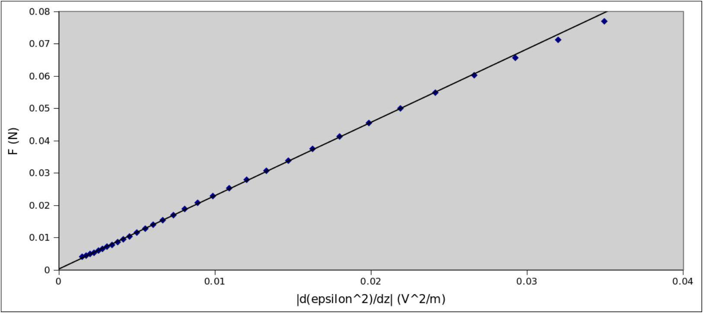
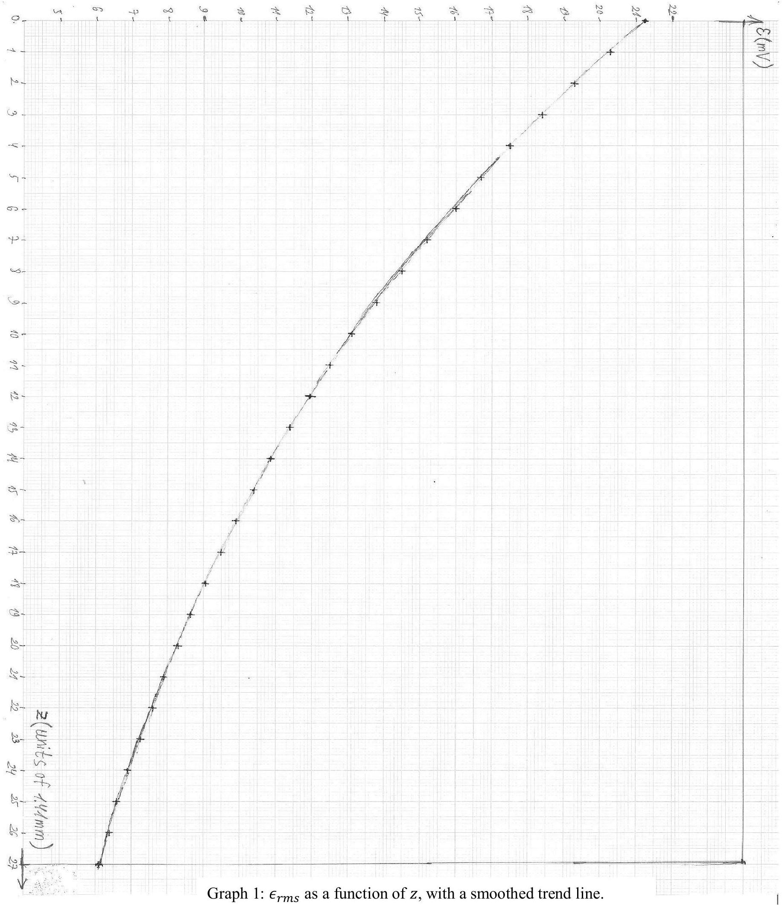

Experimental Question 1: Levitation of Conductors in an Oscillating Magnetic Field
SOLUTION
a. Using Faraday's law:

$$
\epsilon ( t ) = - \frac { d \Phi _ { B } } { d t } = - \sqrt { 2 } \omega \Phi _ { B } ^ { r m s } \cos ( \omega t )
$$

The overall sign will not be graded.
For the current, we use the extensive hints in the question to write:

$$
I ( t ) = - \frac { \sqrt { 2 } \omega \Phi _ { B } ^ { r m s } } { \sqrt { R ^ { 2 } + \omega ^ { 2 } L ^ { 2 } } } \cos ( \omega t - \delta ) = - \frac { \sqrt { 2 } \omega \Phi _ { B } ^ { r m s } } { \sqrt { R ^ { 2 } + \omega ^ { 2 } L ^ { 2 } } } \cos \left( \omega t - \tan ^ { - 1 } \frac { \omega L } { R } \right)
$$

This can be rewritten in a way which will be useful for part (c):

$$
I ( t ) = - \frac { \sqrt { 2 } \omega \Phi _ { B } ^ { r m s } } { \sqrt { R ^ { 2 } + \omega ^ { 2 } L ^ { 2 } } } ( \cos \delta \cos ( \omega t ) + \sin \delta \sin ( \omega t ) ) = - \frac { \sqrt { 2 } \omega \Phi _ { B } ^ { r m s } } { R ^ { 2 } + \omega ^ { 2 } L ^ { 2 } } ( R \cos ( \omega t ) + \omega L \sin ( \omega t ) )
$$

In the last equality, we used $\tan \delta = \omega L / R$ to derive $\sin \delta = \omega L / \sqrt { R ^ { 2 } + \omega ^ { 2 } L ^ { 2 } }$ and $\cos \delta = R / \sqrt { R ^ { 2 } + \omega ^ { 2 } L ^ { 2 } }$.
All the above forms of the answer will be accepted. The overall sign will not be graded.
b. Let us forget about the metal ring, and consider a cylindrical surface at some distance $z$ from the solenoid, with radius $r$ and an infinitesimal height $d z$. The magnetic Gauss law implies that the flux through the cylinder's wall should cancel the net flux through its bases:

$$
2 \pi r d z B _ { r } + \Phi _ { B } ( z + d z ) - \Phi _ { B } ( z ) = 0
$$

Where $\Phi _ { B }$ is the flux of the vertical magnetic field through each circular base. Dividing by $d z$ and doing an infinitesimal amount of algebra, we get:

$$
B _ { r } = - \frac { 1 } { 2 \pi r } \cdot \frac { d \Phi _ { B } } { d z }
$$

c. The field oscillations are very slow with respect to the transit time of light through the system. Therefore, $\Phi _ { B }$ oscillates with the same phase at all heights $z$, and we have:

$$
B _ { r } = - \frac { 1 } { \sqrt { 2 } \pi r } \cdot \frac { d \Phi _ { B } ^ { r m s } } { d z } \sin ( \omega t )
$$

Then the momentary force reads:

$$
F ( t ) = - 2 \pi r I ( t ) B _ { r } ( t ) = - \frac { 2 \omega \Phi _ { B } ^ { r m s } } { R ^ { 2 } + \omega ^ { 2 } L ^ { 2 } } \cdot \frac { d \Phi _ { B } ^ { r m s } } { d z } \sin ( \omega t ) ( R \cos ( \omega t ) + \omega L \sin ( \omega t ) )
$$

The time-average of $\sin ( \omega t ) \cos ( \omega t )$ is zero, while the average of $( \sin ( \omega t ) ) ^ { 2 }$ is 1/2. Therefore, the time-averaged force reads:

$$
\langle F \rangle = - \frac { \omega ^ { 2 } L \Phi _ { B } ^ { r m s } } { R ^ { 2 } + \omega ^ { 2 } L ^ { 2 } } \cdot \frac { d \Phi _ { B } ^ { r m s } } { d z } = - \frac { L \epsilon ^ { r m s } } { R ^ { 2 } + \omega ^ { 2 } L ^ { 2 } } \cdot \frac { d \epsilon ^ { r m s } } { d z } = - \frac { L } { 2 \left( R ^ { 2 } + \omega ^ { 2 } L ^ { 2 } \right) } \cdot \frac { d \left( \epsilon ^ { r m s } \right) ^ { 2 } } { d z }
$$

d. The ring's resistance is much smaller than the resistance of the electric wires and their contacts. If the voltmeter and ammeter are connected to the same two points on the ring, the measured resistance would be on the order of $0.1 \Omega$, which is almost entirely due to the contacts. Using the multimeters on ohm-meter mode is also pointless for such resistances. Therefore, a four-terminal circuit is necessary, as shown in the figure. The contact with the ring is accomplished by snapping the "crocodiles" onto it. Note that the voltmeter's contacts must be to the inside from the current's contacts. Since no resistor is used, the power supply is effectively short-circuited, with the total resistance (and therefore, the current) mostly determined by the wires and contacts. With an optimal use of wires, a current of over 6A can be obtained. This results in a voltage of about 10mV on the ring. The ammeter's accuracy is 0.01A, while the voltmeter's accuracy is 0.1mV. This makes the voltage the primary source of measurement error, whose relative value is 1\%. During the circuit's operation, the current and voltage on the ring steadily increase. Therefore, it is necessary to take the current and voltage readings simultaneously. To minimize and estimate the error in this procedure, 3 sets of measurements should be taken at slightly different values of the current (without changing the circuit). These measurements from a sample experiment are reproduced in Table 1.

| $I ( \mathrm {~A} ) \pm 0.01 \mathrm {~A}$ | $V ( \mathrm { mV } ) \pm 0.1 \mathrm { mV }$ | $R _ { \text {raw } } = V / I ( \mathrm {~m} \Omega ) \pm 1 \%$ |
| :--- | :--- | :--- |
| 6.9 | 11.3 | 1.638 |
| 6.34 | 10.4 | 1.640 |
| 6.6 | 10.8 | 1.636 |

Table 1: Sample measurements of current and voltage on the thin ring.

In this case, we see that the statistical fluctuations are much smaller than the measurement error. In other cases, they come out similar. A reasonable estimate for the error in $R _ { \text {raw } }$ would be between $0.5 \%$ and $1 \%$. Choosing $0.5 \%$ in our case, we write $R _ { \text {raw } } = 1.638 \mathrm {~m} \Omega \pm 0.008 \mathrm {~m} \Omega$ ( $0.5 \%$ ).

The resistance $R _ { \text {raw } }$ is not the resistance of the entire ring, but only of the stretch between the two voltage terminals. To take this into account, we must know the distance $d _ { \text {ter } }$ between the terminals, the gap $d _ { g a p }$ between the ring's ends and the average circumference $\pi D _ { \text {thin } }$ of the ring. The terminal distance in our sample experiment was $d _ { \text {ter } } =$ $2.2 \mathrm {~cm} \pm 0.2 \mathrm {~cm}$, with the error due to the width of the contacts. The gap was $d _ { \text {gap } } = 1.0 \mathrm {~cm} \pm 0.05 \mathrm {~cm}$, with the error due to the ruler's resolution and the width of the ring. For the arc angles associated with $d _ { \text {ter } }$ and $d _ { \text {gap } }$, we may treat arcs as straight lines, with a negligible error of about 0.02cm.

The best way to find the average circumference is to measure the ring's outer and inner diameters with the ruler and take their average. The results are $D _ { \text {thin } } ^ { > } = 9.60 \mathrm {~cm} \pm 0.05 \mathrm {~cm}$ and $D _ { \text {thin } } ^ { < } = 9.00 \mathrm {~cm} \pm 0.05 \mathrm {~cm}$. Therfore, $D _ { \text {thin } } =$ 9.30 cm ± 0.04cm (0.35\%), with the errors due to the ruler's resolution. Equivalently, a measurement with the same

accuracy can be made by placing the ring on a sheet of millimeter paper. The average circumference is now $\pi D _ { \text {thin } } =$ $29.2 \mathrm {~cm} \pm 0.1 \mathrm {~cm} ( 0.35 \% )$.

Other methods, such as measuring the average diameter by taking the maximal distance between an inner point and an outer point of the ring lead to an higher error of $0.5 \%$. Taking the inner or outer diameter instead of the average diameter introduces an error of about 3 mm, i.e. 3\%.

The true resistance of the thin ring now reads:

$$
\begin{equation*}
R _ { \text {thin } } = R _ { \text {raw } } \frac { \pi D _ { \text {thin } } - d _ { \text {gap } } } { \pi D _ { \text {thin } } - d _ { \text {ter } } } = 1.711 \mathrm {~m} \Omega \tag{1}
\end{equation*}
$$

To estimate the error, we write:

$$
R _ { \text {thin } } \approx R _ { \text {raw } } \left( 1 + \frac { d _ { \text {ter } } - d _ { \text {gap } } } { \pi D _ { \text {thin } } } \right)
$$

The error of the quantity in parentheses is mainly due to $\Delta d _ { \text {ter } } / \left( \pi D _ { \text {thin } } \right) = 0.2 \mathrm {~cm} / 30 \mathrm {~cm} = 0.007 = 0.7 \%$. Combining this with the 0.5\% error in $R _ { \text {raw } }$, we get:

$$
\frac { \Delta R _ { \text {thin } } } { R _ { \text {thin } } } = 0.85 \% ; \quad \Delta R _ { \text {thin } } = 0.015 \mathrm {~m} \Omega
$$

The distribution of sample measurement results on several different rings is consistent with this error estimate.
Neglecting to take $d _ { \text {gap } }$ into account introduces an error of $d _ { \text {gap } } / \left( \pi D _ { \text {thin } } \right) = 3 \%$. Neglecting to take $d _ { \text {ter } }$ into account introduces an error of $d _ { \text {ter } } / \left( \pi D _ { \text {thin } } \right) = 6 \%$. Forgetting about both and just using $R _ { \text {raw } }$ introduces an error of $\left( d _ { \text {ter } } - d _ { \text {gap } } \right) / \left( \pi D _ { \text {thin } } \right) = 3 \%$.

A slightly inferior alternative to using a small $d _ { \text {ter } }$ is to connect the voltage terminals at diametrically opposite points of the ring. This decreases the measured voltage by a factor of 2, increasing its relative error by the same factor. The error in $R _ { \text {raw } }$ then becomes about $1 \%$, slightly increasing the final error in $R _ { \text {thin } }$.
e. As can be seen from the rings' cross-sections, the resistance $R$ of the closed ring is smaller than $R _ { \text {thin } }$ by an order of magnitude. This makes a naïve 2-terminal measurement even more hopeless. A 4-terminal measurement as in part (d) is possible, but will result in a large error of about 5\% due to the voltmeter's resolution. Furthermore, for the closed ring the inductive impedance $\omega L$ is no longer negligible, and will introduce a systematic error of about $3 \%$.

The optimal solution is to use the fact that the rings are made of the same material, and deduce $R$ from the rings' geometries and the accurately measured $R _ { \text {thin } }$ :

$$
R = R _ { \text {thin } } \frac { \pi D _ { \text {closed } } } { \pi D _ { \text {thin } } - d _ { \text {gap } } } \cdot \frac { A _ { \text {thin } } } { A _ { \text {closed } } }
$$

where $A$ stands for the cross-section area. The average diameter $D _ { \text {closed } }$ of the closed ring can be found as in part (d), with the results $D _ { \text {closed } } ^ { > } = 10.05 \mathrm {~cm} \pm 0.05 \mathrm {~cm}$ and $D _ { \text {closed } } ^ { < } = 7.60 \mathrm {~cm} \pm 0.05 \mathrm {~cm}$. Therefore, $D _ { \text {closed } } = 8.82 \mathrm {~cm} \pm$

0.03cm. In this case, using the inner or outer diameter instead of the average one introduces a large error of 1.2cm, i.e. over 10\%.

Measuring $A _ { \text {thin } }$ directly also introduces large errors. Measuring the thin ring's thickness and height with the ruler introduces an error of $0.5 \mathrm {~mm} / 3 \mathrm {~mm} = 15 \%$ for each dimension. Multiplying by $\sqrt { 2 }$, this implies an error of 25\% in the area. A student may also try to measure the ring's dimensions using the screw attached to the solenoid. Then the measurement error for each dimension decreases to about $1 / 16$ of a screw step, i.e. $0.09 \mathrm {~mm} / 3 \mathrm {~mm} = 3 \%$, which implies a 4\% error in the area.

The solution is to weigh the rings using the digital scale. We then have:

$$
\begin{gathered}
\frac { A _ { \text {thin } } } { A _ { \text {closed } } } = \frac { m _ { \text {thin } } } { m _ { \text {closed } } } \cdot \frac { \pi D _ { \text {closed } } } { \pi D _ { \text {thin } } - d _ { \text {gap } } } \\
R = R _ { \text {thin } } \left( \frac { \pi D _ { \text {closed } } } { \pi D _ { \text {thin } } - d _ { \text {gap } } } \right) ^ { 2 } \cdot \frac { m _ { \text {thin } } } { m _ { \text {closed } } } = 0.153 \mathrm {~m} \Omega
\end{gathered}
$$

where we used the values $m _ { \text {thin } } = 4.50 \mathrm {~g} \pm 0.02 \mathrm {~g}$ and $m _ { \text {closed } } = 47.70 \mathrm {~g} \pm 0.02 \mathrm {~g}$ from our sample measurement. The measurement error for the masses depends on environmental noise, and we use 0.02g as a representative value. The rings in different experimental sets have slightly different masses, with a deviation of about 1\%, which can be distinguished at the scale's level of sensitivity. Therefore, different students will measure slightly different values.

The dominant error in the mass ratio is $\Delta m _ { \text {thin } } / m _ { \text {thin } } = 0.5 \%$. The error in $\pi D _ { \text {closed } }$ is $0.35 \%$, as in part (d). After taking the square, this doubles to 0.7\%. Examining eq. (1), we see that the relative error in $R _ { \text {thin } } / \left( \pi D _ { \text {thin } } - d _ { \text {gap } } \right) ^ { 2 }$ is the same as in $R _ { \text {thin } }$, since the $\left( \pi D _ { \text {thin } } - d _ { \text {gap } } \right)$ merely moves from the numerator to the denominator. The error in $R _ { \text {thin } } / \left( \pi D _ { \text {thin } } - d _ { \text {gap } } \right) ^ { 2 }$ is therefore $1 \%$. Combining these three error sources, we have:

$$
\frac { \Delta R } { R } = \sqrt { 0.0085 ^ { 2 } + 0.007 ^ { 2 } + 0.005 ^ { 2 } } = 1.2 \% ; \quad \Delta R = 0.002 \mathrm {~m} \Omega
$$

The distribution of sample measurement results on several different rings is consistent with this error estimate; the value $R = 0.153 \mathrm {~m} \Omega$ cited above is near the bottom of the distribution.

A student who neglects $d _ { \text {gap } }$ will get a systematic error of $6 \%$. A student who neglects the difference between $D _ { \text {closed } }$ and $D _ { \text {thin } }$ will get a systematic error of 10\%. A student who neglects both, i.e. just uses $R = R _ { \text {thin } } \left( m _ { \text {thin } } / m _ { \text {closed } } \right)$, will get an error of $4 \%$. These errors are halved if the student makes them for just one of the two factors of $\pi D _ { \text {closed } } /$ $\left( \pi D _ { \text {thin } } - d _ { \text {gap } } \right)$.

In the above, we effectively treated the closed ring as a rectangle with length $D _ { \text {closed } }$. It's easy to see that this introduces no errors in the mass calculation. Indeed, the precise formula for the ring's volume reads:

$$
V = \pi a \left( \left( \frac { D _ { \text {closed } } + w } { 2 } \right) ^ { 2 } - \left( \frac { D _ { \text {closed } } - w } { 2 } \right) ^ { 2 } \right) = \pi D _ { \text {closed } } w a
$$

where $a$ is the ring's height, and $w$ is its width. This is the same formula as in the rectangular approximation. Some students may use this derivation in their solution.

The exact resistance calculation for a broad circular ring is more difficult, and reveals that the relative error from the rectangular approximation is $w ^ { 2 } / \left( 3 D _ { \text {closed } } ^ { 2 } \right) = 0.6 \%$. This analysis is not expected from the students, and the resulting error can be neglected with respect to the overall error of $1.5 \%$. For completeness, we include the derivation of the exact formula:

$$
\frac { 1 } { R } = \frac { 1 } { \rho } \int _ { \left( D _ { \text {closed } } - w \right) / 2 } ^ { \left( D _ { \text {closed } } + w \right) / 2 } \frac { a d r } { 2 \pi r } = \frac { a } { 2 \pi \rho } \ln \frac { D _ { \text {closed } } + w } { D _ { \text {closed } } - w } \approx \frac { w a } { \pi D _ { \text {closed } } \rho } \left( 1 + \frac { 1 } { 3 } \left( \frac { w } { D _ { \text {closed } } } \right) ^ { 2 } \right)
$$

where $\rho$ is the material resistivity.
f. The student can vary $z$ by using the screw to raise and lower the solenoid. The most precise way to measure $z$ is simply to count the number of screw steps. The error is then $\Delta z = h / 16 = 0.09 \mathrm {~mm}$, where $h = 1.41 \mathrm {~mm}$ is the screw step. If $z$ is measured with the ruler, the error becomes $\Delta z = 0.5 \mathrm {~mm}$, due to the ruler's resolution. A convenient point to define as $z = 0$ is when the solenoid touches the ring from above, and the screw's handle is in some fixed orientation. This point should be reproducible, either visually or by counting screw steps, in order to keep a consistent record of distances with the force measurements in the next part.

In anticipation of the force measurements, the student should place the scale under the solenoid, place the polystyrene block on the scale, and place the ring on the polystyrene block. The polystyrene block is important because it is an insulator, while the scale's platform is metallic and may alter the EMF-measuring circuit. It is also important for the quality of the force measurements, as explained below.

It is always best to start measuring from a small distance, because then the ring can be aligned with the solenoid's axis more easily. A reasonable range of $z$ would be from $z = 0$ (near-contact with the solenoid) to $z = 5 \mathrm {~cm}$. A reasonable resolution is one screw step. It can be made coarser towards large $z$, when the EMF variations become smaller.

The EMF can be measured by connecting the ends of the broad open ring to the voltmeter. We wish to measure the magnetic flux through the ring, and not through the rest of the circuit. To make sure that this is the case, the wires from the ring should be twisted into a braid. The EMF decreases with distance from about $\epsilon _ { r m s } = 22 \mathrm { mV }$ to zero, reaching about $\epsilon _ { r m s } = 5 \mathrm { mV }$ at $z = 5 \mathrm {~cm}$. The measurement error is $\Delta \epsilon _ { r m s } = 0.1 \mathrm { mV }$. Sample measurement results are presented in Table 2. A plot of the measurements (with a trend line for part (h)) is presented in Graph 1.
g. The student can vary $z$ as in part (f), this time measuring the force on the closed ring using the digital scale. Care should be taken to use the same zero point for $z$ as in part (f). It is convenient, though not necessary, to measure the force at the exact same points where the EMF was measured previously.

Again, the ring should be placed on the polystyrene block, rather than directly on the scale. There are two reasons for this in the context of force measurements. First, the metallic parts of the scale also react to the solenoid's magnetic field. Therefore, the solenoid must be kept at a distance above the scale, to eliminate a direct effect on the scale's reading. To observe this effect and its successful elimination, the student may turn on the current in the solenoid without a ring resting on the scale, and check whether the scale's reading changes. The second reason to use the polystyrene block is the small area of the scale; if the ring rests on the scale directly, it's difficult to ensure that some of its weight doesn't fall on the scale's lid or other supporting surfaces. Finally, one must make sure that the solenoid isn't in direct contact with the ring or the solenoid block, so that its weight doesn't fall on the scale.

It is convenient to turn on the scale, or to press the Tare button, with the ring and the block resting on the scale with no current in the solenoid. We can then measure the magnetic force directly. Otherwise, the student must manually subtract the scale's reading at zero current from all of his force values.

For values of $z$ from $z = 0$ to $z = 5 \mathrm {~cm}$, the force decreases from about $\langle F \rangle = 8 \mathrm { gf }$ (grams-force) to about $\langle F \rangle =$ 0.25 gf . The measurement error depends on environmental noise. A representative value is $\Delta \langle F \rangle = 0.02 \mathrm { gf }$. Sample measurement results are presented in Table 2.
h. The derivative should be found from discrete differences between pairs of points, situated symmetrically around the point we are interested in. It is better to find the derivative $d \epsilon _ { r m s } / d z$, and then multiply it by $2 \epsilon _ { r m s }$, than to find the derivative $d \epsilon _ { r m s } ^ { 2 } / d z$ directly. This is for two reasons. First, taking the square amplifies the errors in the discrete point differences. Second, if the student chooses a graphical method (see below), it is more convenient to use the graph of $\epsilon _ { r m s } ( z )$ : it was already drawn in part (f), and its points are more evenly distributed than the points on a graph of $\epsilon _ { r m s } ^ { 2 } ( z )$.

We will now discuss two distinct methods for choosing the discrete differences for $d \epsilon _ { r m s } / d z$. When used properly, the two give equally good results.

Numerical method:
One method to find the derivative $d \epsilon _ { r m s } / d z$ is simply to take differences between measured values of $\epsilon _ { r m s }$. The intervals at which the differences are taken must be carefully chosen. A small interval will give a large error in the slope, due to the statistical scatter of the measured points. On the other hand, a large interval may result in too much smearing, so that we're not capturing the local slope. An optimal interval is about 6 screw steps, i.e. about $3 h = 4 \mathrm {~mm}$ to each side from the point of interest.

Graphical method:
Another method is to draw a smooth trend line through the measured points, and then to use differences between points on this trend line rather than the measured values. If the measurements were carried out properly, the trend line will deviate by only 0.5mm - 1mm from the measured points on the graph paper. An example worked out by a hapless theoretician is shown on Graph 1. The thick line is a consequence of the trial-and-error process of sketching the best line. The discrete intervals for the derivative can now be chosen smaller than with the numerical method, since the statistical scatter is smoothed out. In particular, taking one screw step to each side from the point of interest is now good enough. One should not choose much smaller intervals, due to the limited resolution of the graph paper. A potential advantage of the graphical method is that it's not tied to the exact $z$ values where the EMF was measured. This is helpful if the EMF and the force were not measured at the exact same heights.

An inferior graphical method is to draw tangents to the curve $\epsilon _ { r m s } ( z )$, and calculate the slopes of these tangents. In practice, it is very difficult to identify a tangent line visually, and using this method produces large deviations, on the order of 20\%, in the analysis of part (i).

Sample values of $d \epsilon _ { r m s } / d z$ and $d \epsilon _ { r m s } ^ { 2 } / d z$ are provided in Table 2.
i. Following parts (c) and (h), the student should draw a linear graph of $\langle F \rangle$ as a function of $d \epsilon _ { r m s } ^ { 2 } / d z$. The graph should pass through the origin, and its slope equals:

$$
\begin{equation*}
k = \frac { L } { 2 \left( R ^ { 2 } + \omega ^ { 2 } L ^ { 2 } \right) } \tag{2}
\end{equation*}
$$

If very small distances are included in the graph (under about 6 mm between the ring and the solenoid's edge), the corresponding points will deviate from linearity, with a visible decrease in the slope. This can be seen in the computerized plot below:

This effect results from attraction between the ring and the solenoid's iron core.
In the manual graph from our sample experiment (Graph 2), the non-linearity isn't observed, and the slope comes out $k = 2.29 \mathrm { Nm } / \mathrm { V } ^ { 2 } \pm 0.04 \mathrm { Nm } / \mathrm { V } ^ { 2 } ( 2 \% )$. To extract $L$, we must solve the quadratic equation:

$$
2 \omega ^ { 2 } k L ^ { 2 } - L + 2 k R ^ { 2 } = 0
$$

The two roots are:

$$
L = \frac { 1 \pm \sqrt { 1 - 16 \omega ^ { 2 } k ^ { 2 } R ^ { 2 } } } { 4 \omega ^ { 2 } k }
$$

where we must use $\omega = 2 \pi \cdot 50 \mathrm {~Hz} \approx 314 \mathrm {~Hz}$.
The student can find, either analytically or by substitution, that only the smaller root satisfies $\omega L < R$. In our sample experiment, the result reads:

$$
L = \frac { 1 - \sqrt { 1 - 16 \omega ^ { 2 } k ^ { 2 } R ^ { 2 } } } { 4 \omega ^ { 2 } k } = 1.13 \cdot 10 ^ { - 7 } \mathrm { H } = 0.113 \mu \mathrm { H }
$$

If the student hasn't done so before this point, he will need convert the force units from grams-force to Newtons using the provided value of $g$.

We find that the ratio $\omega L / R$ is 0.23 . Therefore, for the error estimation, we can write eq. (2) as:

$$
\begin{equation*}
k = \frac { L } { 2 R ^ { 2 } } \quad \Rightarrow \quad L = 2 k R ^ { 2 } \tag{3}
\end{equation*}
$$

As we can see, the delicate error considerations in $R$ are now even more important, since it appears squared. Collecting the relative errors in $k$ and $R$, we have:

$$
\frac { \Delta L } { L } = \sqrt { 0.02 ^ { 2 } + ( 2 \cdot 0.012 ) ^ { 2 } } = 0.03 = 3 \% ; \quad \Delta L = 0.003 \mu \mathrm { H }
$$

The scatter of results from sample experiments is consistent with this error estimation. A student who neglects $( \omega L / R ) ^ { 2 }$ all along and uses eq. (3) to find the value of $L$ will introduce a systematic error of 5\%.

| $n$ (screw steps) ± 0.1 | $z ( \mathrm {~mm} ) \pm$ 0.15 mm | $\epsilon _ { \text {rms } } ( \mathrm { mV } ) \pm$ 0.1 mV | $\langle F \rangle ( \mathrm { gf } ) \pm$ 0.02 gf | $\langle F \rangle ( \mathrm { N } ) \pm$ 0.0002 N | $\left\| d \epsilon _ { r m s } / d z \right\| ( \mathrm { V } / \mathrm { m } )$ | $\left\| d \epsilon _ { r m s } ^ { 2 } / d z \right\|$ ( $\mathrm { V } ^ { 2 } / \mathrm { m }$ ) |
| :--- | :--- | :--- | :--- | :--- | :--- | :--- |
| 0 | 0 | 21.25 | 7.08 | 0.06938 |  |  |
| 1 | 1.41 | 20.3 | 6.5 | 0.06370 |  |  |
| 2 | 2.82 | 19.3 | 5.93 | 0.05811 |  |  |
| 3 | 4.23 | 18.4 | 5.4 | 0.05292 | 0.6206 | 0.02284 |
| 4 | 5.64 | 17.5 | 4.9 | 0.04802 | 0.6028 | 0.02110 |
| 5 | 7.05 | 16.7 | 4.47 | 0.04381 | 0.5674 | 0.01895 |
| 6 | 8.46 | 16 | 4.07 | 0.03989 | 0.5437 | 0.01731 |
| 7 | 9.87 | 15.2 | 3.65 | 0.03577 | 0.5201 | 0.01581 |
| 8 | 11.28 | 14.5 | 3.3 | 0.03234 | 0.4965 | 0.01440 |
| 9 | 12.69 | 13.8 | 2.97 | 0.02911 | 0.4787 | 0.01321 |
| 10 | 14.1 | 13.1 | 2.71 | 0.02656 | 0.4492 | 0.01177 |
| 11 | 15.51 | 12.5 | 2.44 | 0.02391 | 0.4314 | 0.01079 |
| 12 | 16.92 | 11.95 | 2.2 | 0.02156 | 0.4019 | 0.00961 |
| 13 | 18.33 | 11.4 | 2.045 | 0.02004 | 0.3783 | 0.00862 |
| 14 | 19.74 | 10.85 | 1.83 | 0.01793 | 0.3546 | 0.00770 |
| 15 | 21.15 | 10.4 | 1.64 | 0.01607 | 0.3428 | 0.00713 |
| 16 | 22.56 | 9.9 | 1.45 | 0.01421 | 0.3251 | 0.00644 |
| 17 | 23.97 | 9.5 | 1.35 | 0.01323 | 0.3014 | 0.00573 |
| 18 | 25.38 | 9.05 | 1.2 | 0.01176 | 0.2955 | 0.00535 |
| 19 | 26.79 | 8.65 | 1.07 | 0.01049 | 0.2719 | 0.00470 |
| 20 | 28.2 | 8.3 | 1 | 0.00980 | 0.2660 | 0.00442 |
| 21 | 29.61 | 7.9 | 0.905 | 0.00887 | 0.2541 | 0.00402 |
| 22 | 31.02 | 7.6 | 0.815 | 0.00799 | 0.2423 | 0.00368 |
| 23 | 32.43 | 7.25 | 0.74 | 0.00725 | 0.2246 | 0.00326 |
| 24 | 33.84 | 6.9 | 0.67 | 0.00657 | 0.2128 | 0.00294 |
| 25 | 35.25 | 6.6 | 0.61 | 0.00598 | 0.2009 | 0.00265 |
| 26 | 36.66 | 6.4 | 0.56 | 0.00549 | 0.1950 | 0.00250 |
| 27 | 38.07 | 6.1 | 0.52 | 0.00510 | 0.1773 | 0.00216 |
| 28 | 39.48 | 5.9 | 0.47 | 0.00461 |  |  |
| 29 | 40.89 | 5.6 | 0.42 | 0.00412 |  |  |
| 30 | 42.3 | 5.4 | 0.36 | 0.00353 |  |  |

Table 2: Sample EMF and force measurements and derivative values

| 50   40   5 | $F \left( N - 10 ^ { - 3 } \right)$ |  |  |  |  |  |  |  |  |  |  | (V |  |  |
| :--- | :--- | :--- | :--- | :--- | :--- | :--- | :--- | :--- | :--- | :--- | :--- | :--- | :--- | :--- |
|  |  |  |  |  |  |  |  |  |  |  |  | Slope: $2.288 \frac { N m } { V ^ { 2 } }$ |  |  |  |
|  |  |  |  |  |  |  |  |  |  |  |  |  |  |  |  |
|  |  |  |  |  |  |  |  |  |  |  |  |  |  |  |  |

Graph 2: $\langle F \rangle$ as a function of $\left| d \epsilon _ { r m s } ^ { 2 } / d z \right|$, with linear trend lines.
