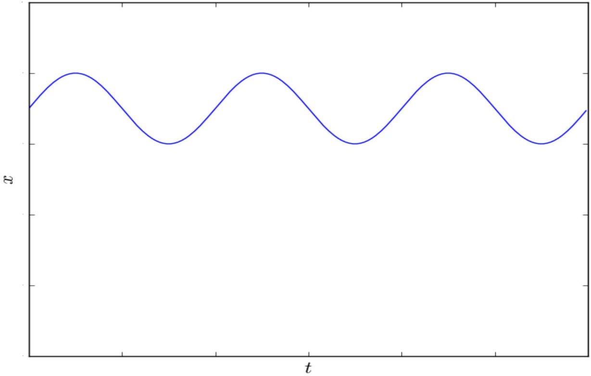
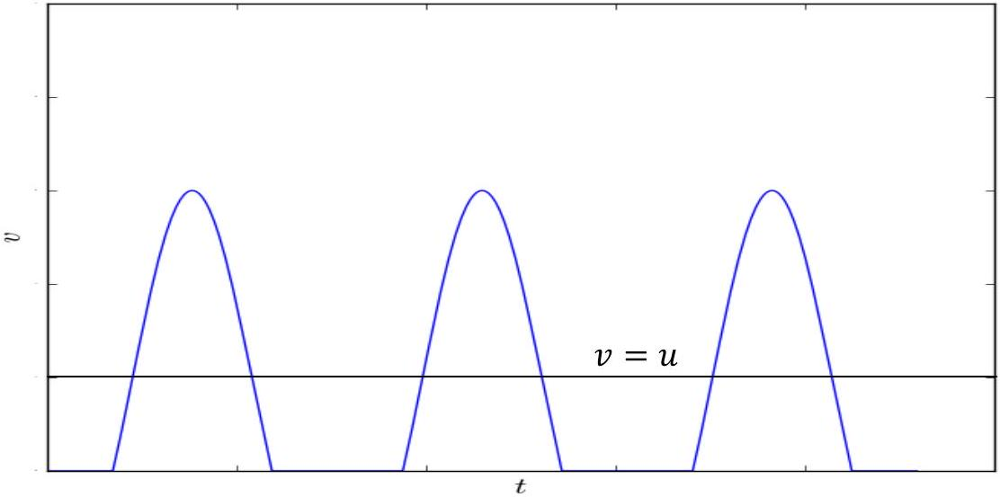
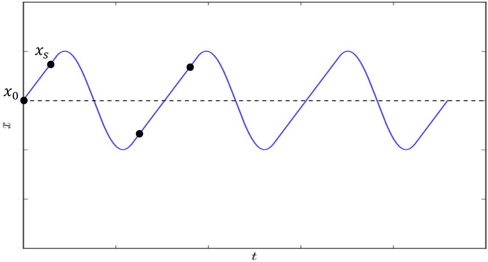

## Theoretical Question 2: Creaking Door SOLUTION

a1. The motion here is pure sliding under a constant kinetic friction. This is harmonic motion with a displaced equilibrium point. The angular frequency is given by:

$$
\omega _ { 0 } = \sqrt { k / m }
$$

From here, the period is:

$$
T _ { 0 } = \frac { 2 \pi } { \omega _ { 0 } } = 2 \pi \sqrt { \frac { m } { k } }
$$

The initial slope is given by:

$$
\left( \frac { d x } { d t } \right) _ { 0 } = u - v _ { 0 }
$$

Therefore, the amplitude of oscillations is:

$$
A = \frac { ( d x / d t ) _ { 0 } } { \omega _ { 0 } } = \left( u - v _ { 0 } \right) \sqrt { \frac { m } { k } }
$$

a2. The graph is sinusoidal, as shown below.

The initial point is given by:

$$
x _ { 0 } = \frac { \mu _ { k } m g } { k }
$$

This is the equilibrium point of the sine function. The students are not required to find this equilibrium point, but they are required to understand that it is positive.
b. This will be a stick-slip graph. The "humps" are sinusoidal, with a non-continuous derivative at their intersections with the horizontal segments. The peaks of the humps are higher than $v = u$, since $u$ must be the average velocity of the box. In fact, they are also higher than $v = 2 u$, but this is not required from the students.

c. Let's pass into the reference frame of the driven end of the spring. The position of the box is then given by minus the elongation $x$. The motion is an oscillation around the equilibrium position $x _ { 0 }$. The slip phase is sinusoidal as in part (a), while the stick phase corresponds to motion with a constant velocity $- u$. The stick phase ends when the elastic force balances the static friction, i.e. at $x _ { s } = \mu _ { s } m g / k$, and starts again at the symmetric point with respect to $x _ { 0 }$.

We see that the average elongation is again the sine's equilibrium point:

$$
\bar { x } = x _ { 0 } = \frac { \mu _ { k } m g } { k }
$$

d. Again, let us pass into the reference frame of the driven end of the spring. During the stick phase, the box traverses a distance of:

$$
2 \left( x _ { s } - x _ { 0 } \right) = 2 \left( \mu _ { s } - \mu _ { k } \right) \mathrm { mg } / \mathrm { k } .
$$

Its velocity during this phase is $u$, so the duration of the stick phase is:

$$
t _ { \text {stick } } = \frac { 2 \left( \mu _ { s } - \mu _ { k } \right) m g } { k u }
$$

The slip phase is a sinusoidal motion around $x _ { 0 }$ with angular frequency $\omega _ { 0 }$. The sinusoidal period is missing a phase of $2 \varphi$, where $\varphi$ is given by the ratio of initial position and initial velocity with respect to the equilibrium point:

$$
\tan \varphi = \frac { \omega _ { 0 } \left( x _ { s } - x _ { 0 } \right) } { u } = \frac { \left( \mu _ { s } - \mu _ { k } \right) g } { u } \sqrt { \frac { m } { k } }
$$

Then the length of the slip phase is:

$$
t _ { \text {slip } } = T _ { 0 } \left( 1 - \frac { \varphi } { \pi } \right) = 2 \sqrt { \frac { m } { k } } \left( \pi - \tan ^ { - 1 } \left( \frac { \left( \mu _ { s } - \mu _ { k } \right) g } { u } \sqrt { \frac { m } { k } } \right) \right)
$$

And the total period is:

$$
T = t _ { \text {stick } } + t _ { \text {slip } } = 2 \sqrt { \frac { m } { k } } \left( \frac { \left( \mu _ { s } - \mu _ { k } \right) g } { u } \sqrt { \frac { m } { k } } + \pi - \tan ^ { - 1 } \left( \frac { \left( \mu _ { s } - \mu _ { k } \right) g } { u } \sqrt { \frac { m } { k } } \right) \right)
$$

e. Consider again stick-slip motion in the reference frame of the driven end of the spring. During the sinusoidal slip phase, the sine's amplitude will decrease due to the dissipation. At the beginning of the slip phase, the velocity is $- u$, while the sine is at the phase $\varphi$, which we found in the solution to the previous part. Thus, the sine's velocity amplitude is $u / \cos \varphi$. For periodic stock-slip to occur, the sine must return to the slope $- u$. Due to the dissipation, this will happen at a phase larger than $2 \pi - \varphi$. In other words, dissipation shortens the stick phase. The critical case is when stick phase shortens to zero. This will happen if the sine reaches the slope $- u$ precisely at the equilibrium point, i.e. at the phase $2 \pi$. If the slope at $2 \pi$ is less steep than $- u$, the box will continue its damped sinusoidal motion without ever reaching a stick phase again.

If it is to be killed by weak dissipation, the stick phase must be short to begin with. This corresponds to a large $u$. The slip phase then takes up almost an entire period of the sine wave. Thus, to a good approximation, the amplitude loss during the slip phase is given by $\eta$. The critical point is when the velocity amplitude drops from $u / \cos \varphi$ to $u$ during one period:

$$
\eta = \left| \frac { \Delta A } { A } \right| = \left| \frac { u / \cos \varphi - u } { u / \cos \varphi } \right| = 1 - \cos \varphi \approx \frac { \varphi ^ { 2 } } { 2 }
$$

where the LHS is the change in the amplitude due to dissipation over one period. Using the results from (d) in the limit of small $\varphi$, we get:

$$
\begin{aligned}
\eta & = \frac { m \left( \mu _ { s } - \mu _ { k } \right) ^ { 2 } g ^ { 2 } } { 2 k u _ { c } ^ { 2 } } \\
u _ { c } & = \left( \mu _ { s } - \mu _ { k } \right) g \sqrt { \frac { m } { 2 k \eta } }
\end{aligned}
$$

Another derivation method based on the same reasoning is to use explicitly the initial amplitude $A$ of the harmonic motion:

$$
u _ { c } = \omega _ { 0 } A ( 1 - \eta ) , \quad A ^ { 2 } = \left( x _ { s } - x _ { 0 } \right) ^ { 2 } + ( m / k ) u _ { c } ^ { 2 }
$$

A third method is to consider energy losses $| \Delta E / E | = 2 \eta$ in the reference frame of the spring's driven end:

$$
2 \eta \cdot \frac { 1 } { 2 } m u _ { c } ^ { 2 } = \frac { 1 } { 2 } k \left( x _ { s } - x _ { 0 } \right) ^ { 2 }
$$

f. For small rotations, the lower edge of the cylinder will remain stuck to the base. When the cylinder is deformed by an angle $\alpha$, a point on its upper edge shifts by a distance $h \alpha$. This corresponds to a rotation angle $\theta = h \alpha / r$ of the door around the cylinder's axis. The shear force on an area element $d A$ of the base is given by:

$$
d F = G \alpha d A = \frac { G r } { h } \theta d A
$$

The corresponding torque is:

$$
d \tau = r d F = \frac { G r ^ { 2 } } { h } \theta d A
$$

Summing over the contact area with the base, the total torque is:

$$
\tau = \frac { G r ^ { 2 } } { h } \theta \cdot 2 \pi r \Delta r = \frac { 2 \pi G r ^ { 3 } \Delta r } { h } \theta
$$

Therefore, the torsion coefficient is:

$$
\kappa = \frac { 2 \pi G r ^ { 3 } \Delta r } { h } \approx 2000 \mathrm { Nm }
$$

The numerical result is not required from the student. Any expression which reduces to the one above in the limit $\Delta r \ll r$ will be accepted.
g. We neglect the duration of the slip phase. Using the results of section (d) with $M$ instead of $m$ and rotation instead of linear motion, we get:

$$
t _ { \text {stick } } = \frac { 2 \left( \mu _ { s } - \mu _ { k } \right) M g r } { \kappa \Omega }
$$

$$
\Omega = \frac { 2 \left( \mu _ { s } - \mu _ { k } \right) M g r } { \kappa t _ { \text {stick } } } = \frac { 2 \left( \mu _ { s } - \mu _ { k } \right) M g r f } { \kappa } = \frac { 2 \left( \mu _ { s } - \mu _ { k } \right) M g h f } { \pi G r ^ { 2 } \Delta r } = 1.12 \cdot 10 ^ { - 2 } \mathrm {~s} ^ { - 1 }
$$

Any expression which reduces to the one above in the limit $\Delta r \ll r$ will be accepted. Numerical results from such different expressions may vary significantly, since $\Delta r / r = 0.2$ is not really negligible. Each numerical result should be checked against its expression.
