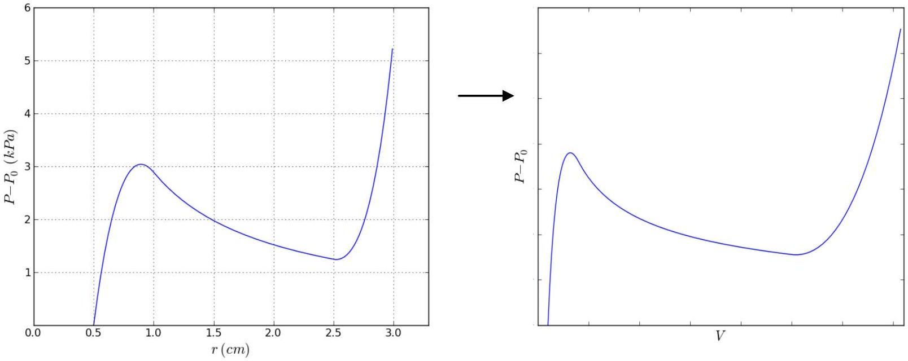
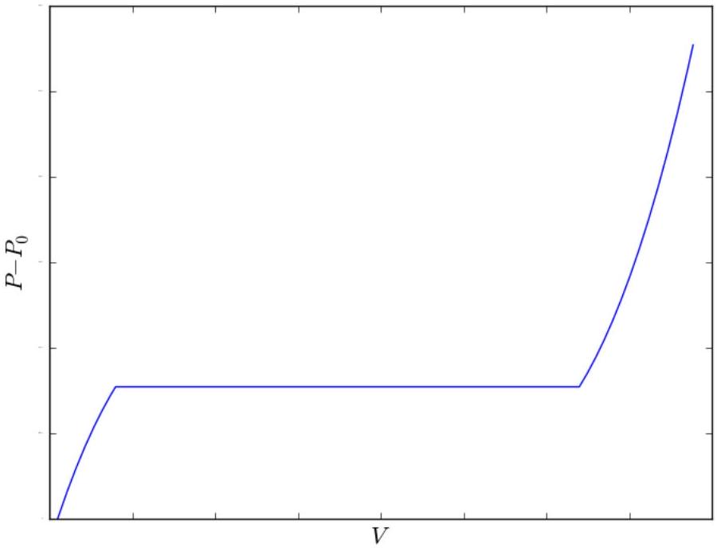
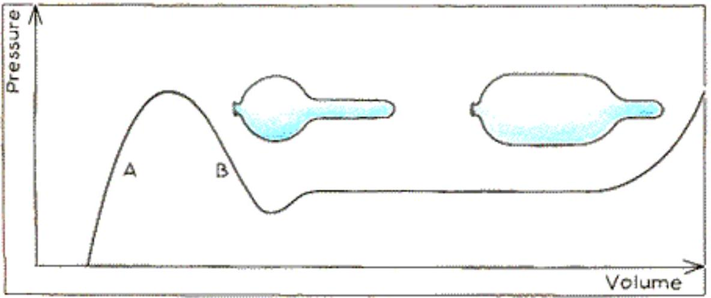

## Theoretical Question 3: Birthday Balloon SOLUTION

a. Solution using forces:

Let the balloon's radius be $r$, and let $P$ be the pressure of the inside air. Consider the balloon's rear half, and write down the equilibrium of forces on it along the cylinder's axis:

$$
\pi r ^ { 2 } \left( P - P _ { 0 } \right) = 2 \pi r \sigma _ { L }
$$

On the other hand, let us cut the balloon in half with a plane that runs along its axis, and consider a half-cylindrical section of length $x$. The equilibrium of forces in perpendicular to the cutting plane reads:

$$
2 r x \left( P - P _ { 0 } \right) = 2 x \sigma _ { t }
$$

from which we derive $\sigma _ { L } / \sigma _ { t } = 1 / 2$.
Solution using energies:
If we stretch the balloon longitudinally by length $d L$, the energy cost is:

$$
E _ { 1 } = 2 \pi r \sigma _ { L } \cdot d L
$$

If we inflate the balloon radially with an increment $d r$, the energy cost is:

$$
E _ { 2 } = L \sigma _ { t } \cdot 2 \pi d r
$$

The two deformations can be combined while keeping the volume fixed, if we take $\pi r ^ { 2 } d L = - L d \left( \pi r ^ { 2 } \right) = - 2 \pi L r d r$, i.e. $r d L = - 2 L d r$. The equilibrium state is the one where the combined energy cost $E _ { 1 } + E _ { 2 }$ of such a deformation is zero. This gives again the result $\sigma _ { L } / \sigma _ { t } = 1 / 2$.
b. From part (a), we are reminded of the relation between surface tension and pressure:

$$
P = P _ { 0 } + \frac { \sigma _ { t } } { r } = P _ { 0 } + \frac { k \left( r - r _ { 0 } \right) } { r _ { 0 } r } = P _ { 0 } + k \left( \frac { 1 } { r _ { 0 } } - \frac { 1 } { r } \right)
$$

The volume is related to the radius by:

$$
V = \pi r ^ { 2 } L _ { 0 }
$$

So we get:

$$
P ( V ) = P _ { 0 } + k \left( \frac { 1 } { r _ { 0 } } - \sqrt { \frac { \pi L _ { 0 } } { V } } \right)
$$

The graph of $P - P _ { 0 }$ is a hyperbola-like function increasing from 0 at $V = \pi r _ { 0 } ^ { 2 } L _ { 0 }$ to an asymptotic value of $k / r _ { 0 }$ at $V \rightarrow \infty$.

The maximal pressure is obtained at $V \rightarrow \infty$ :

$$
P _ { \max } = P _ { 0 } + \frac { k } { r _ { 0 } }
$$

c. The graph of $P - P _ { 0 }$ as a function of $V$ has the same qualitative form as $P - P _ { 0 } = \sigma _ { t } / r$ as a function of $r$, shown below. The graph rises from zero, then decreases, and then increases again. The points $r = 1 \mathrm {~cm}$ and $r = 2.5 \mathrm {~cm}$ lie in the decreasing portion (and not on the local extrema).

The pressures at the two requested points are approximately given by:

$$
P - P _ { 0 } ( r = 1 \mathrm {~cm} ) = \frac { \sigma } { r } = \frac { 30 } { 0.01 } = 3000 \mathrm {~Pa} ; \quad P - P _ { 0 } ( r = 2.5 \mathrm {~cm} ) = \frac { 30 } { 0.025 } = 1200 \mathrm {~Pa}
$$

d. The work done on the pressure-controlling mechanism during continuous inflation from volume $V _ { i }$ to volume $V _ { f }$ is:

$$
W _ { \text {mech } } = - P \left( V _ { f } - V _ { i } \right)
$$

The work done on the atmosphere is:

$$
W _ { \text {surr } } = P _ { 0 } \left( V _ { f } - V _ { i } \right)
$$

The condition for the jump is:

$$
W _ { r u b b e r } + W _ { s u r r } + W _ { m e c h } = 0
$$

This translates into Maxwell's equal-areas condition:

$$
\int _ { V _ { i } } ^ { V _ { f } } \left( P - P _ { 0 } \right) d V = \left( P - P _ { 0 } \right) \left( V _ { f } - V _ { i } \right)
$$

Or, equivalently:

$$
\int _ { V _ { i } } ^ { V _ { f } } P d V = P \left( V _ { f } - V _ { i } \right)
$$

The cubic function $P ( V )$ is symmetric around the point $V = u , P - P _ { 0 } = a c$.
The equal-areas condition is therefore satisfied at:

$$
P _ { c } = P _ { 0 } + a c
$$

The volumes $V _ { 1 }$ and $V _ { 2 }$ are given by the points where:

$$
( V - u ) ^ { 3 } - b ( V - u ) = 0
$$

This gives:

$$
V _ { 1,2 } = u \pm \sqrt { b }
$$

e. The range of volumes where a phase separation will occur is $V _ { 1 } < V < V _ { 2 }$. The pressure is constant throughout this range, and equals the transition pressure $P _ { c }$. The graph of $P - P _ { 0 }$ as a function of $V$ is monotonous, with a rising piece, a horizontal plateau at $V _ { 1 } < V < V _ { 2 } , P = P _ { c }$, followed by another rising piece. At the start and end of the plateau, the slope has a discontinuity, i.e. the graph has a kink.

f. The radii of the two domains correspond to the volumes $V _ { 1 }$ and $V _ { 2 }$. As the total volume increases from $V _ { 1 }$ to $V _ { 2 }$, the volume of the thin domain changes linearly from $V _ { 1 }$ to 0 . We get:

$$
V _ { \text {thin } } = \frac { V _ { 1 } } { V _ { 2 } - V _ { 1 } } \left( V _ { 2 } - V \right)
$$

Converting this into length, we have:

$$
L _ { \text {thin } } = \frac { V _ { \text {thin } } } { \pi r _ { 1 } ^ { 2 } } = \frac { V _ { 1 } \left( V _ { 2 } - V \right) } { \pi r _ { 1 } ^ { 2 } \left( V _ { 2 } - V _ { 1 } \right) }
$$

g. The increase in the balloon's volume as a result of converting a length $L _ { \text {thin } }$ into the thick phase is:

$$
\Delta V = \frac { V _ { 2 } - V _ { 1 } } { V _ { 1 } } \Delta V _ { \text {thin } } = \frac { \pi r _ { 1 } ^ { 2 } \left( V _ { 2 } - V _ { 1 } \right) } { V _ { 1 } } \Delta L _ { \text {thin } }
$$

The corresponding work is:

$$
\Delta W = P _ { c } \Delta V = \frac { \pi r _ { 1 } ^ { 2 } P _ { c } \left( V _ { 2 } - V _ { 1 } \right) } { V _ { 1 } } \Delta L _ { \text {thin } }
$$

Therefore:

$$
\frac { \Delta W } { \Delta L _ { \text {thin } } } = \frac { \pi r _ { 1 } ^ { 2 } P _ { c } \left( V _ { 2 } - V _ { 1 } \right) } { V _ { 1 } }
$$

Additional discussion (doesn't appear as part of the question):
During a realistic inflation, perturbations are not strong enough to keep the system in global equilibrium at all times. The experimental graph increases up to $P _ { c }$, continues to increase some way beyond it, reaches a local maximum, then decreases and settles on the plateau at $P _ { c }$. This over-increase of the pressure is responsible for the fact that inflating a balloon is difficult during the first few puffs. After the plateau, the graph sharply increases as discussed above. The decrease towards the plateau "overshoots" slightly again, reaches a local minimum and rises again to settle on the plateau. This behavior is depicted in the graph below.

The illustration is taken from:
http://www.science-project.com/_members/science-projects/1989/12/1989-12-body.html
