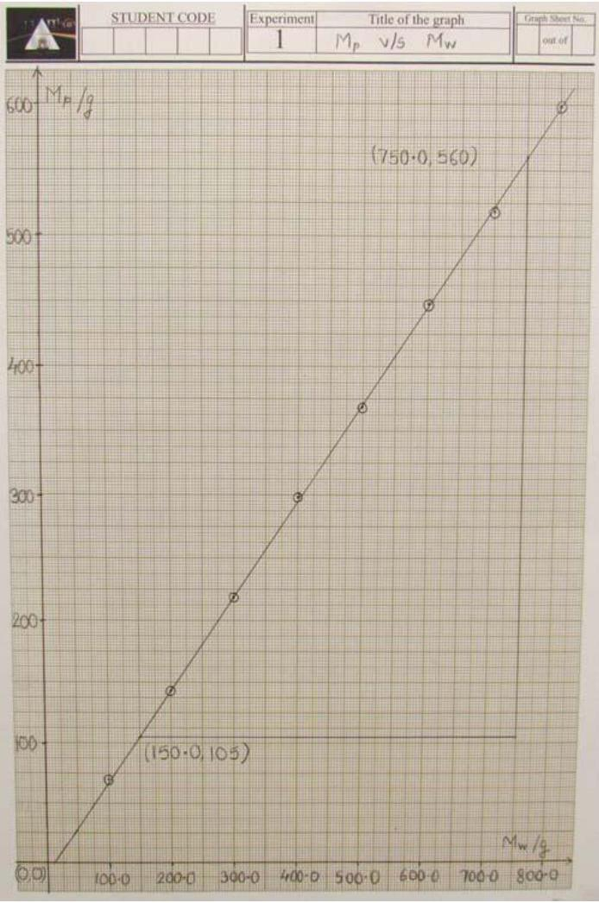
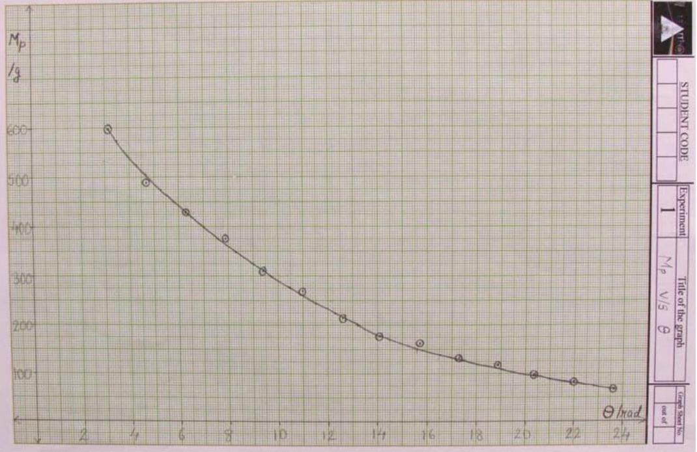
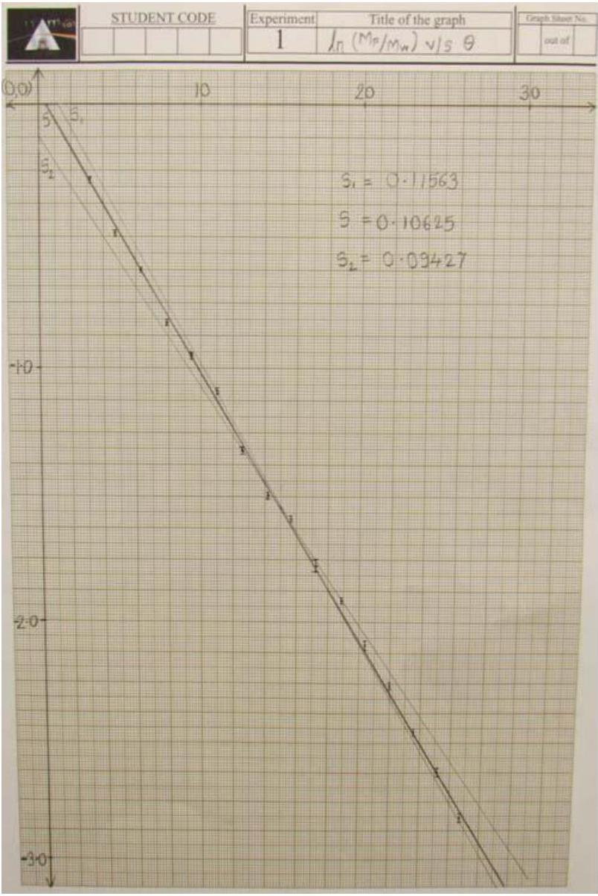

| $13 ^ { \text {th } }$ Asian Physics Olympiad May 01-07, 2012, New Delhi |  | EXPERIMENT NO. - 1 |
| :--- | :--- | :--- |

## Model Solution

We will assume the relationship of the form:

$$
\begin{gathered}
P = f ( W ) h ( \theta ) \\
M _ { \mathrm { p } } = f \left( M _ { \mathrm { w } } \right) h ( \theta )
\end{gathered}
$$

$M _ { \mathrm { w } }$ represents the mass in the hanger (Load)
$M _ { \mathrm { p } }$ represents the mass in the pan + the mass of the pan (i.e. $M _ { p } ^ { \prime } + M _ { p a n }$ ) (Effort)
The relation between these variables can be found in two parts:

- Relation between $M _ { \mathrm { P } }$ and $M _ { \mathrm { W } }$
- Relation between $M _ { \mathrm { P } }$ and $\theta$

Part 1:
Mass of the pan $= 28.6 \mathrm {~g}$
$\theta = \pi$ radians

| Obs. No. | $M _ { \mathrm { w } } / g$ | $M _ { p - } ^ { \prime } / g$ | $M _ { p + } ^ { \prime } / g$ | $M _ { p ( \text { average } ) } ^ { \prime } / g$ | $M _ { p ( \text { average } ) } = M _ { p ( \text { average } ) } ^ { \prime } + M _ { \text {pan } } / g$ | $\Delta M _ { p } = \frac { M _ { p + } ^ { \prime } - M _ { p - } ^ { \prime } } { 2 } / g$ |
| :--- | :--- | :--- | :--- | :--- | :--- | :--- |
| 1 | 800.0 | 566 | 574 | 570 | 598.6 | 4 |
| 2 | 700.0 | 486 | 494 | 490 | 518.6 | 4 |
| 3 | 600.0 | 417 | 423 | 420 | 448.6 | 3 |
| 4 | 500.0 | 337 | 343 | 340 | 368.6 | 3 |
| 5 | 400.0 | 267 | 273 | 270 | 298.6 | 3 |
| 6 | 300.0 | 188 | 192 | 190 | 218.6 | 2 |
| 7 | 200.0 | 113 | 117 | 115 | 143.6 | 2 |
| 8 | 100.0 | 41 | 43 | 42 | 70.6 | 1 |

| $13 { } ^ { \text {th } }$ Asian Physics Olympiad May 01-07, 2012, New Delhi |  | EXPERIMENT NO. - 1 |
| :--- | :--- | :--- |

Graph of $M _ { \mathrm { P } } \mathrm { v } / \mathrm { s } M _ { \mathrm { W } }$ :

Slope of the graph $= 0.7583$
This shows that

$$
\begin{equation*}
P \propto W \tag{1}
\end{equation*}
$$

| $13 ^ { \text {th } }$ Asian Physics Olympiad May 01-07, 2012, New Delhi |  | EXPERIMENT NO. - 1 |
| :--- | :--- | :--- |

Part 1:

$$
\begin{array} { l l }
M _ { \mathrm { w } } & = 800.0 \mathrm {~g} \\
M _ { \mathrm { pan } } & = 28.6 \mathrm {~g}
\end{array}
$$

| Obs. No. | $\theta$ /rad | $M _ { p - } ^ { \prime } / g$ | $M _ { p + } ^ { \prime } / g$ | $M _ { p ( \text { average } ) } ^ { \prime }$ /g | $M _ { p ( \text { average } ) } = M _ { p ( \text { average } ) } ^ { \prime } + M _ { p \text { an } }$ /g | $\Delta M _ { p } = \frac { M _ { p + } ^ { \prime } - M _ { p - } ^ { \prime } } { 2 }$ /g |
| :--- | :--- | :--- | :--- | :--- | :--- | :--- |
| 1 | $\pi$ | 565 | 575 | 570 | 598.6 | 5 |
| 2 | $3 \pi / 2$ | 455 | 465 | 460 | 488.6 | 5 |
| 3 | $2 \pi$ | 396 | 404 | 400 | 428.6 | 4 |
| 4 | $5 \pi / 2$ | 316 | 324 | 320 | 348.6 | 4 |
| 5 | $3 \pi$ | 276 | 284 | 280 | 308.6 | 4 |
| 6 | $7 \pi / 2$ | 236 | 244 | 240 | 268.6 | 4 |
| 7 | $4 \pi$ | 182 | 188 | 185 | 213.6 | 3 |
| 8 | $9 \pi / 2$ | 147 | 153 | 150 | 178.6 | 3 |
| 9 | $5 \pi$ | 133 | 137 | 135 | 163.6 | 2 |
| 10 | $11 \pi / 2$ | 104 | 110 | 107 | 135.6 | 3 |
| 11 | $6 \pi$ | 88 | 92 | 90 | 118.6 | 2 |
| 12 | $13 \pi / 2$ | 68 | 72 | 70 | 98.6 | 2 |
| 13 | $7 \pi$ | 54 | 56 | 55 | 83.6 | 1 |
| 14 | $15 \pi / 2$ | 39 | 41 | 40 | 68.6 | 1 |
| 15 | $8 \pi$ | 29 | 31 | 30 | 58.6 | 1 |
| 16 | $17 \pi / 2$ | 18 | 20 | 19 | 47.6 | 1 |

The graph between $M _ { p }$ and $\theta$ shows a curve.

| $13 ^ { \text {th } }$ Asian Physics Olympiad May 01-07, 2012, New Delhi |  | EXPERIMENT NO. - 1 |
| :--- | :--- | :--- |

There can be possibilities of different functional relationship.
1)

The possible functions can be $\frac { 1 } { \theta } , \frac { 1 } { \theta ^ { 2 } } , e ^ { - k \theta }$
For the first two functions mentioned above, at $\theta = 0 , M _ { \mathrm { p } }$ will reach infinite value which is not possible. For the third function we know that $M _ { \mathrm { p } }$ will have some finite value.
2)

If the function is anticipated as exponential one then it can be verified using half value technique whether at every half value of Mp, and then plotting $\ln M _ { \mathrm { p } }$ or better still $\ln \left( M _ { p } / M _ { w } \right)$ against $\theta$.

If it is a straight line with slope $- k$,

$$
M _ { p } \propto e ^ { - k \theta }
$$

or

$$
\begin{equation*}
P \propto e ^ { - k \theta } \tag{2}
\end{equation*}
$$

From (1) and (2),

$$
\begin{equation*}
P \propto W e ^ { - k \theta } \tag{3}
\end{equation*}
$$

The constant $k$ in the above expression is equated to the coefficient of friction, $\mu$.

$$
\begin{equation*}
P = C W e ^ { - \mu \theta } \tag{4}
\end{equation*}
$$

The constant of proportionality in equation (4) is 1 . This is because at $\theta = 0 \mathrm { rad } , P = W$.

$$
\begin{equation*}
P = W e ^ { - \mu \theta } \tag{5}
\end{equation*}
$$

| $13 { } ^ { \text {th } }$ Asian Physics Olympiad May 01-07, 2012, New Delhi |  | EXPERIMENT NO. - 1 |
| :--- | :--- | :--- |

From the graph,

$$
\ln \left( \frac { M _ { p } } { M _ { w } } \right) = - \mu \theta
$$

where $\mu$ is the slope of the graph.
From the graph, $\mu = 0.106$

$$
\begin{aligned}
& \frac { \Delta S } { S } = \frac { \left( S _ { 1 } \sim S _ { 2 } \right) / 2 } { S } = 0.10049 \\
& \Delta S = 0.01067 = \Delta \mu \\
& u _ { C } ( \mu ) = 0.00616 \\
& U ( \mu ) = 0.0123 \approx 0.02
\end{aligned}
$$

$$
\mu = 0.11 \pm 0.02
$$

| $13 ^ { \text {th } }$ Asian Physics Olympiad May 01-07, 2012, New Delhi |  | EXPERIMENT NO. - 1 |
| :--- | :--- | :--- |

Part 2:
When the pan is moving up:

$$
\begin{equation*}
M _ { p 1 } = M _ { u } e ^ { - \mu \theta } \tag{6}
\end{equation*}
$$

When the pan is moving down:

$$
\begin{equation*}
M _ { p 2 } = M _ { u } e ^ { \mu \theta } \tag{7}
\end{equation*}
$$

| $M _ { p 1 } ^ { \prime }$ |  | $M _ { p 1 ( \text { average } ) } ^ { \prime }$ | $\Delta M _ { p 1 } ^ { \prime }$ | $M _ { p 1 } = M _ { p 1 } ^ { \prime } + M _ { p a n }$ |
| :--- | :--- | :--- | :--- | :--- |
| $M _ { p 1 + } ^ { \prime }$ | $M _ { p 1 - } ^ { \prime }$ |  |  |  |
| 164 | 156 | 160 | 4 | 188.6 |

| $M _ { p 2 } ^ { \prime }$ |  | $M _ { p 2 ( \text { average } ) } ^ { \prime }$ | $\Delta M _ { p 2 } ^ { \prime }$ | $M _ { p 2 } = M _ { p 2 } ^ { \prime } + M _ { p a n }$ |
| :--- | :--- | :--- | :--- | :--- |
| $M _ { p 2 + } ^ { \prime }$ | $M _ { p 2 - } ^ { \prime }$ |  |  |  |
| 49 | 45 | 47 | 2 | 75.6 |

For $M _ { \mathrm { u } }$ :
Multiplying equation (6) and (7),

$$
\begin{gathered}
M _ { u } = \sqrt { M _ { p 1 } \cdot M _ { p 2 } } \\
M _ { u } = \sqrt { 188.6 \times 75.6 } = 119.4075 \mathrm {~g}
\end{gathered}
$$

For $\mu$ :
Dividing equation (6) by (7),

$$
\begin{gathered}
\frac { M _ { p 1 } } { M _ { p 2 } } = e ^ { 2 \mu \theta } \\
\mu = \frac { 1 } { 2 \theta } \ln \left( \frac { M _ { p 1 } } { M _ { p 2 } } \right)
\end{gathered}
$$

For $\theta = \pi$

$$
\mu = \frac { 1 } { 2 \pi } \ln \left( \frac { M _ { p 1 } } { M _ { p 2 } } \right)
$$

| $13 { } ^ { \text {th } }$ Asian Physics Olympiad May 01-07, 2012, New Delhi |  | EXPERIMENT NO. - 1 |
| :--- | :--- | :--- |

$$
\mu = \frac { 1 } { 2 \pi } \ln \left( \frac { 188.6 } { 75.6 } \right) = 0.1456
$$

Uncertainty in $M _ { \mathrm { u } }$ :

$$
\begin{gathered}
\frac { \Delta M _ { u } } { M _ { u } } = \sqrt { \left( \frac { 1 } { 2 } \frac { \Delta M _ { p 1 } } { M _ { p 1 } } \right) ^ { 2 } + \left( \frac { 1 } { 2 } \frac { \Delta M _ { p 2 } } { M _ { p 2 } } \right) ^ { 2 } } = \sqrt { \left( \frac { 1 } { 2 } \frac { 4 } { 188.6 } \right) ^ { 2 } + \left( \frac { 1 } { 2 } \frac { 2 } { 75.6 } \right) ^ { 2 } } = 0.0169 \\
\Delta M _ { u } = 0.0169 \times 119.4075 = 2.018 \\
u _ { C } \left( M _ { u } \right) = \frac { 1 } { \sqrt { 3 } } \times 2.018 = 1.165 \\
U \left( M _ { u } \right) = 2 \times u _ { C } \left( M _ { u } \right) = 2 \times 1.165 = 2.33 \approx 3 \\
M _ { u } = 119 \pm 3 \mathrm {~g}
\end{gathered}
$$

Uncertainty in $\mu _ { \mathrm { u } }$ :

$$
\begin{gathered}
u _ { C } \left( \mu _ { u } \right) = \frac { 1 } { \sqrt { 3 } } \cdot \Delta \mu _ { u } = \frac { 1 } { 2 \pi \sqrt { 3 } } \sqrt { \left( \frac { \Delta M _ { p 1 } } { M _ { p 1 } } \right) ^ { 2 } + \left( \frac { \Delta M _ { p 2 } } { M _ { p 2 } } \right) ^ { 2 } } = \frac { 1 } { 2 \pi \sqrt { 3 } } \sqrt { \left( \frac { 4 } { 188.6 } \right) ^ { 2 } + \left( \frac { 2 } { 75.6 } \right) ^ { 2 } } = 0.003117 \\
U \left( \mu _ { u } \right) = 2 \times u _ { C } \left( \mu _ { u } \right) = 2 \times 0.003117 = 0.00623 \approx 0.007 \\
\mu _ { u } = 0.146 \pm 0.007
\end{gathered}
$$
