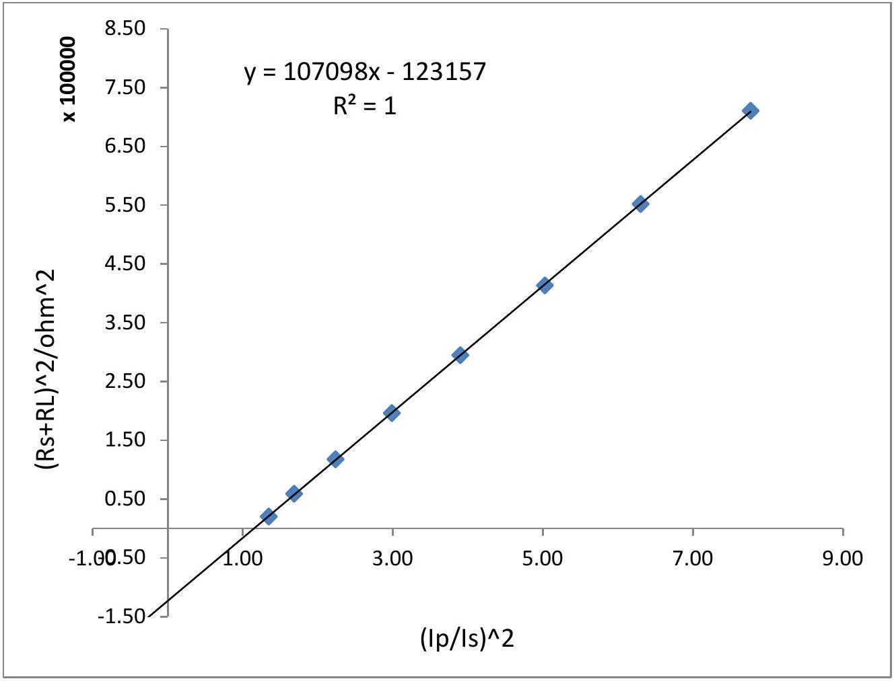
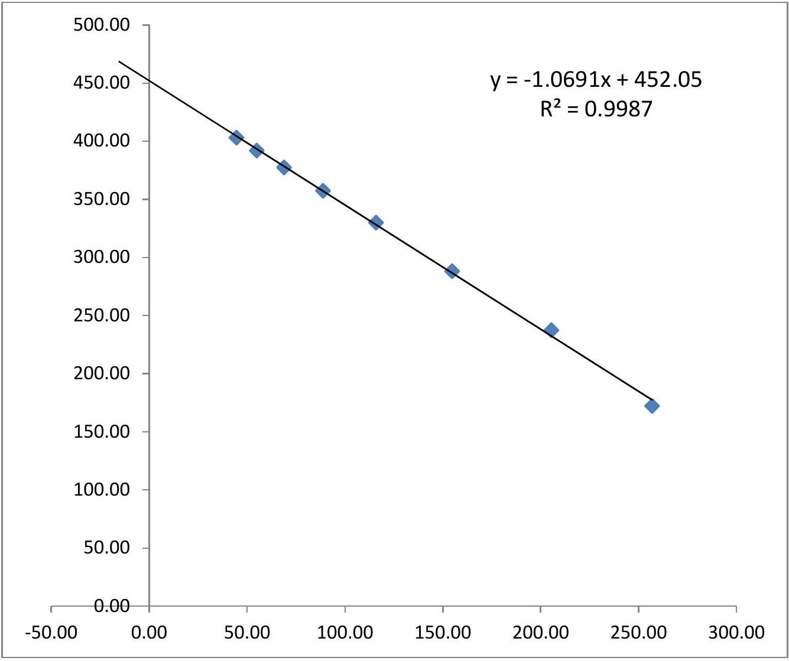
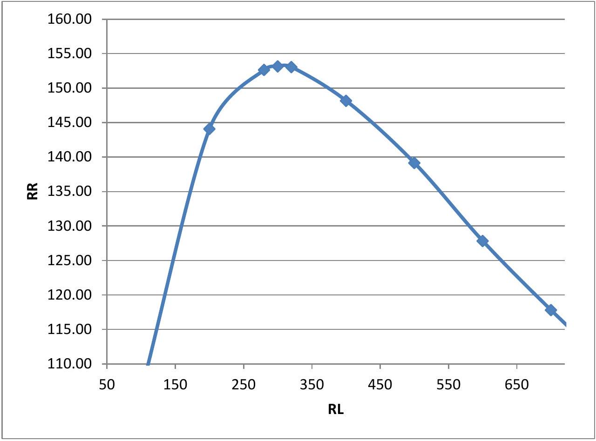

## Model Solution

Part 1(a):

|  |  |  |  | Coil Blue (1-1) |  |  |  | AIR CORE |  | $\mathrm { f } = 1.000 \mathrm { KHz }$ |  |  |
| :--- | :--- | :--- | :--- | :--- | :--- | :--- | :--- | :--- | :--- | :--- | :--- | :--- |
|  | R' | $\mathrm { V } _ { \mathrm { A } }$ | $\mathrm { V } _ { \mathrm { R } ^ { \prime } }$ | V | Vo | $\mathrm { I } _ { 1 }$ | $\mathrm { Z } _ { 1 }$ | $\mathrm { R } _ { 1 }$ | $\mathrm { X } _ { 1 }$ | $\omega \mathrm { M }$ | M (mH) | $\mathrm { L } _ { 1 } ( \mathrm { mH } )$ |
| 450 |  | 10.090 | 6.760 | 6.770 | 4.940 |  |  |  |  |  |  |  |
|  |  | 10.060 | 6.700 | 6.740 | 4.910 |  |  |  |  |  |  |  |
| Avg | 450 | 10.075 | 6.730 | 6.755 | 4.925 | 0.015 | 451.67 | 52.57 | 448.60 | 329.31 | 52.44 | 71.43 |

| $\Delta \mathrm { V } _ { \mathrm { A } }$ | $\Delta \mathrm { VR } { } ^ { \prime }$ | $\Delta \mathrm { V }$ |
| :--- | :--- | :--- |
| 0.14 | 0.11 | 0.11 |

| us(z) | us( R) | ur(Z) | ur( R) | uc( R) | uc(Z) | uc(X) | uc(L) | U( R) | U(X) | U(L) |
| :--- | :--- | :--- | :--- | :--- | :--- | :--- | :--- | :--- | :--- | :--- |
| 0.0057 | 1.1432 | 0.2747 | 0.4235 | 1.2191 | 0.2748 | 0.3114 | 0.000050 | 3.00 | 0.7 | 0.0002 |

Part 1b:

|  |  |  |  | Coil Green (2-2) | AIR CORE |  |  |  |  |  |  |  |
| :--- | :--- | :--- | :--- | :--- | :--- | :--- | :--- | :--- | :--- | :--- | :--- | :--- |
|  | R' | $\mathrm { V } _ { \mathrm { A } }$ | $\mathrm { V } _ { \mathrm { R } ^ { \prime } }$ | V | Vo | $\mathrm { I } _ { 2 }$ | $\mathrm { Z } _ { 2 }$ | $\mathrm { R } _ { 2 }$ | $\mathrm { X } _ { 2 }$ | $\omega \mathrm { M }$ | M (mH) | $\mathrm { L } _ { 2 } ( \mathrm { mH } )$ |
|  | 350 | 9.960 | 6.690 | 6.610 | 6.390 |  |  |  |  |  |  |  |
|  |  | 9.980 | 6.630 | 6.680 | 6.410 |  |  |  |  |  |  |  |
| Avg | 350 | 9.970 | 6.660 | 6.645 | 6.400 | 0.019 | 349.21 | 42.96 | 346.56 | 336.34 | 53.56 | 55.18 |

| $\Delta \mathrm { V } _ { \mathrm { A } }$ | $\Delta \mathrm { VR } { } ^ { \prime }$ | $\Delta \mathrm { V }$ |
| :--- | :--- | :--- |
| 0.14 | 0.11 | 0.11 |

| us(z) | us( R) | ur(Z) | ur( R) | uc( R) | uc(Z) | uc(X) | uc(L) | U( R) | U(X) | U(L) |
| :--- | :--- | :--- | :--- | :--- | :--- | :--- | :--- | :--- | :--- | :--- |
| 0.0027 | 0.9057 | 0.2153 | 0.3335 | 0.9651 | 0.2153 | 0.2478 | 0.000039 | 2.00 | 0.5 | 0.0001 |

Part 1(c)

|  |  |  |  | Coil Blue (1-1) |  |  |  | Al |  | $\mathrm { f } = 1.000 \mathrm { KHz }$ |  |  |
| :--- | :--- | :--- | :--- | :--- | :--- | :--- | :--- | :--- | :--- | :--- | :--- | :--- |
|  | R' | $\mathrm { V } _ { \mathrm { A } }$ | $\mathrm { V } _ { \mathrm { R } ^ { \prime } }$ | V | Vo | I* ${ } _ { 1 }$ | $\mathrm { Z } ^ { * } { } _ { 1 }$ | R* ${ } _ { 1 }$ | $\mathrm { X } ^ { * } { } _ { 1 }$ | $\omega \mathrm { M }$ | M* (mH) | L* ${ } _ { 1 }$ (mH) |
| 290 |  | 9.900 | 5.940 | 6.010 | 4.450 |  |  |  |  |  |  |  |
|  |  | 9.880 | 5.890 | 6.050 | 4.410 |  |  |  |  |  |  |  |
| Avg | 290 | 9.890 | 5.915 | 6.030 | 4.430 | 0.020 | 295.64 | 109.68 | 274.54 | 217.19 | 34.58 | 43.72 |

| $\Delta \mathrm { V } _ { \mathrm { A } }$ | $\Delta \mathrm { VR } { } ^ { \prime }$ | $\Delta \mathrm { V }$ |
| :--- | :--- | :--- |
| 0.14 | 0.10 | 0.10 |

| us(z) | us( R) | ur(Z) | ur( R) | uc( R) | uc(Z) | uc(X) | uc(L) | U( R) | U(X) | U(L) |
| :--- | :--- | :--- | :--- | :--- | :--- | :--- | :--- | :--- | :--- | :--- |
| 0.0220 | 1.2498 | 0.2030 | 0.3740 | 1.3046 | 0.2042 | 0.5657 | 0.000090 | 3.00 | 1.2 | 0.0002 |

Part 1(d):

|  |  |  |  | Coil Green (2-2) | Al CORE |  |  |  |  |  |  |  |
| :--- | :--- | :--- | :--- | :--- | :--- | :--- | :--- | :--- | :--- | :--- | :--- | :--- |
|  | R' | $\mathrm { V } _ { \mathrm { A } }$ | $\mathrm { V } _ { \mathrm { R } ^ { \prime } }$ | V | Vo | I* ${ } _ { 2 }$ | $\mathrm { Z } ^ { * } { } _ { 2 }$ | R* ${ } ^ { 2 }$ | $\mathrm { X } ^ { * } { } _ { 2 }$ | $\omega \mathrm { M }$ | M*(mH) | L* ${ } _ { 2 }$ (mH) |
|  | 280 | 9.860 | 6.280 | 6.170 | 4.840 |  |  |  |  |  |  |  |
|  |  | 9.830 | 6.230 | 6.130 | 4.860 |  |  |  |  |  |  |  |
| Avg | 280 | 9.845 | 6.255 | 6.150 | 4.850 | 0.022 | 275.30 | 71.48 | 265.86 | 217.11 | 34.57 | 42.33 |

| $\Delta \mathrm { V } _ { \mathrm { A } }$ | $\Delta \mathrm { VR } { } ^ { \prime }$ | $\Delta \mathrm { V }$ |
| :--- | :--- | :--- |
| 0.14 | 0.10 | 0.10 |

| us(z) | us( R) | $\operatorname { ur } ( \mathrm { Z } )$ | ur( R) | uc( R) | uc(Z) | uc(X) | uc(L) | U( R) | U(X) | U(L) |
| :--- | :--- | :--- | :--- | :--- | :--- | :--- | :--- | :--- | :--- | :--- |
| 0.0173537 | 0.9509 | 0.1821 | 0.3106 | 1.000 | 0.1829 | 0.329 | 0.000052 | 3.00 | 0.7 | 0.0002 |

Part 2(f):

$$
\omega M = R ^ { \prime } \frac { V _ { O } } { V _ { R ^ { \prime } } }
$$

$$
k = \frac { M } { \sqrt { L _ { 1 } L _ { 2 } } }
$$

| $\mathrm { M } _ { \text {avg } } ( \mathrm { Air } ) =$ | 53.00 mH | $\mathrm { k } =$ | 0.844 |
| :--- | :--- | :--- | :--- |
| $\mathrm { M } _ { \text {avg } } ^ { * } ( \mathrm { Al }$ core $) =$ | 34.58 mH | $\mathrm { k } ^ { * } =$ | 0.804 |

Part 2(g):

|  |  |  |  |  |  | AIR Core |  |  |  | f = 1.000 KHz $\mathrm { R } ^ { \prime } = 300 \Omega$ |  |
| :--- | :--- | :--- | :--- | :--- | :--- | :--- | :--- | :--- | :--- | :--- | :--- |
|  | Sr. | $\mathrm { R } _ { \mathrm { L } }$ | $\mathrm { V } _ { \mathrm { A } }$ | $\mathrm { V } _ { \mathrm { R } ^ { \prime } }$ | V | $\mathrm { V } _ { \mathrm { RL } }$ | Ip | Zp | $\mathrm { R } _ { \mathrm { PE } }$ | $\mathrm { X } _ { \mathrm { PE } }$ | Is |
|  | 1 | 100 | 10.19 | 5.99 | 4.97 | 1.73 |  |  |  |  |  |
|  |  |  | 10.15 | 6.03 | 4.94 | 1.72 |  |  |  |  |  |
| Avg |  | 100 | 10.17 | 6.01 | 4.96 | 1.73 | 0.0200 | 247.34 | 177.56 | 172.19 | 0.017 |
|  | 2 | 200 | 10.12 | 5.39 | 5.67 | 2.77 |  |  |  |  |  |
|  |  |  | 10.09 | 5.44 | 5.70 | 2.79 |  |  |  |  |  |
| Avg |  | 200 | 10.11 | 5.42 | 5.69 | 2.78 | 0.0181 | 314.96 | 207.03 | 237.36 | 0.014 |
|  | 3 | 300 | 10.13 | 5.17 | 6.17 | 3.44 |  |  |  |  |  |
|  |  |  | 10.15 | 5.11 | 6.19 | 3.43 |  |  |  |  |  |

| Avg |  | 300 | 10.14 | 5.14 | 6.18 | 3.44 | 0.0171 | 360.70 | 216.93 | 288.18 | 0.011 |
| :--- | :--- | :--- | :--- | :--- | :--- | :--- | :--- | :--- | :--- | :--- | :--- |
|  | 4 | 400 | 10.11 | 5.00 | 6.51 | 3.88 |  |  |  |  |  |
|  |  |  | 10.14 | 5.05 | 6.53 | 3.87 |  |  |  |  |  |
| Avg |  | 400 | 10.13 | 5.03 | 6.52 | 3.88 | 0.0168 | 389.25 | 206.46 | 329.99 | 0.010 |
|  | 5 | 500 | 10.15 | 4.93 | 6.74 | 4.20 |  |  |  |  |  |
|  |  |  | 10.12 | 4.99 | 6.77 | 4.17 |  |  |  |  |  |
| Avg |  | 500 | 10.14 | 4.96 | 6.76 | 4.19 | 0.0165 | 408.57 | 198.08 | 357.34 | 0.008 |
|  | 6 | 600 | 10.10 | 4.98 | 6.91 | 4.42 |  |  |  |  |  |
|  |  |  | 10.13 | 4.91 | 6.93 | 4.40 |  |  |  |  |  |
| Avg |  | 600 | 10.12 | 4.95 | 6.92 | 4.41 | 0.0165 | 419.82 | 183.87 | 377.41 | 0.007 |
|  | 7 | 700 | 10.14 | 4.97 | 7.05 | 4.58 |  |  |  |  |  |
|  |  |  | 10.11 | 4.91 | 7.07 | 4.60 |  |  |  |  |  |
| Avg |  | 700 | 10.13 | 4.94 | 7.06 | 4.59 | 0.0165 | 428.74 | 173.76 | 391.96 | 0.007 |
|  | 8 | 800 | 10.09 | 4.91 | 7.17 | 4.74 |  |  |  |  |  |
|  |  |  | 10.12 | 4.98 | 7.15 | 4.72 |  |  |  |  |  |
| Avg |  | 800 | 10.11 | 4.95 | 7.16 | 4.73 | 0.0165 | 434.38 | 161.90 | 403.08 | 0.006 |

Part 2(h)

$$
\left( R _ { S } + R _ { L } \right) ^ { 2 } = ( \omega M ) ^ { 2 } \left( \frac { I _ { P } } { I _ { S } } \right) ^ { 2 } - X _ { S } ^ { 2 }
$$

| Slope | M |
| :--- | :--- |
| $1.07 \mathrm { E } + 05$ | 52.08 mH |
| Intercept | $\mathrm { X } _ { 2 }$ |
| $1.23 \mathrm { E } + 05$ | $350.94 \Omega$ |

Part 2(i)

| (Ip/Is) ${ } ^ { 2 }$ | $\left( \mathrm { Rs } + \mathrm { R } _ { \mathrm { L } } \right) ^ { 2 }$ |
| :--- | :--- |
| 1.35 | 20438.25 |
| 1.69 | 59030.73 |
| 2.24 | 117623.21 |
| 2.99 | 196215.69 |
| 3.90 | 294808.17 |
| 5.03 | 413400.65 |
| 6.31 | 551993.13 |
| 7.77 | 710585.61 |

Part 2(j):

Part 3(k) and 3(1):

$$
R _ { R } = \left( \frac { I _ { S } } { I _ { P } } \right) ^ { 2 } \left( R _ { S } + R _ { L } \right)
$$

$$
X _ { P } = \left( \frac { I _ { S } } { I _ { P } } \right) ^ { 2 } X _ { S }
$$

| Sr. | $\mathrm { R } _ { \mathrm { R } }$ | $\mathrm { X } _ { \mathrm { R } }$ |
| :--- | :--- | :--- |
| 1 | 106.00 | 256.95 |
| 2 | 144.08 | 205.52 |
| 3 | 153.17 | 154.78 |
| 4 | 148.17 | 115.92 |
| 5 | 139.16 | 88.82 |
| 6 | 127.84 | 68.91 |
| 7 | 117.81 | 54.95 |
| 8 | 108.46 | 44.59 |

Part 3(m)

Inference:

$$
X _ { P } - X _ { R } = X _ { P E }
$$

Part 3(n):

| Sr. | $\mathrm { R } _ { \mathrm { L } }$ | $\mathrm { V } _ { \mathrm { A } }$ | $\mathrm { V } _ { \mathrm { R } ^ { \prime } }$ | V | Vo | Ip | Is | (Ip/Is) ${ } ^ { 2 }$ | $\mathrm { R } _ { \mathrm { R } }$ |
| :--- | :--- | :--- | :--- | :--- | :--- | :--- | :--- | :--- | :--- |
| 1 | 280 | 10.06 | 5.11 | 6.05 | 3.29 |  |  |  |  |
|  |  | 10.03 | 5.16 | 6.03 | 3.30 |  |  |  |  |
|  | 280 | 10.05 | 5.14 | 6.04 | 3.30 | 0.0171 | 0.01 | 2.12 | 152.65 |
| 2 | 320 | 10.02 | 5.09 | 6.19 | 3.51 |  |  |  |  |
|  |  | 10.05 | 5.03 | 6.21 | 3.50 |  |  |  |  |
|  | 320 | 10.04 | 5.06 | 6.20 | 3.51 | 0.0169 | 0.01 | 2.37 | 153.07 |

| $\mathrm { R } _ { \mathrm { L } }$ | RR |
| :--- | :--- |
| 100 | 106.00 |
| 200 | 144.08 |
| 280 | 152.65 |
| 300 | 153.17 |
| 320 | 153.07 |
| 400 | 148.17 |
| 500 | 139.16 |
| 600 | 127.84 |
| 700 | 117.81 |
| 800 | 108.45771 |

Part 4(o):

$$
\begin{gathered}
R _ { R } = R ^ { * } - R _ { P } \\
X _ { R } = X _ { P } - X ^ { * } \\
\frac { X _ { \text {core } } } { R _ { \text {core } } } = \frac { X _ { R } } { R _ { R } }
\end{gathered}
$$

$$
\frac { L _ { \text {core } } } { R _ { \text {core } } } = \frac { 1 } { 2 \pi f } \frac { \left( X _ { P } - X ^ { * } \right) } { \left( R ^ { * } - R _ { P } \right) }
$$

| Blue Coil | Green Coil |
| :--- | :--- |
| Lc/Rc | Lc/Rc |
| $4.85 \mathrm { E } - 04$ | $4.50 \mathrm { E } - 04$ |

Part 4(p)

$$
\Delta P = I _ { p } ^ { 2 } \left( R _ { P E } - R _ { P } \right) - I _ { S } ^ { 2 } \left( R _ { S } + R _ { L } \right)
$$

|  | $\mathrm { R } _ { \mathrm { L } }$ | $\mathrm { V } _ { \mathrm { A } }$ | $\mathrm { V } _ { \mathrm { R } ^ { \prime } }$ | V | Vo | $\mathrm { I } _ { 1 }$ | $\mathrm { I } _ { 2 }$ | $\mathrm { R } _ { \mathrm { PE } }$ |
| :--- | :--- | :--- | :--- | :--- | :--- | :--- | :--- | :--- |
|  | 1000 | 9.00 | 5.32 | 5.08 | 3.45 |  |  |  |
|  |  | 9.01 | 5.27 | 5.10 | 3.43 |  |  |  |
| Avg | 1000 | 9.01 | 5.30 | 5.09 | 3.44 | 0.0177 | 0.003 | 145.23 |
|  |  | $\Delta \mathrm { P } =$ | $1.65 \mathrm { E } - 02 \mathrm {~W}$ |  |  |  |  |  |
