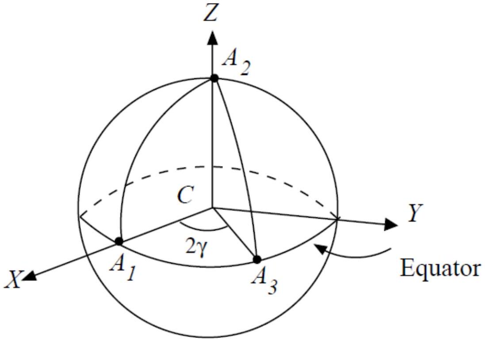

III. 1. [1.0 mark] Let the phase difference between two rays making an angle $\theta$ with $z$ direction be $\delta$. Clearly$$
\begin{equation*}
\delta = \omega \Delta t = \omega d \sin \theta / c \tag{1}
\end{equation*}
$$
Then the intensity is given by
$$
I ( \theta ) = \beta \overline { \left| \mathbf { E } _ { 1 } + \mathbf { E } _ { 2 } \right| ^ { 2 } }
$$
Here
$$
\begin{aligned}
\left| \mathbf { E } _ { 1 } + \mathbf { E } _ { 2 } \right| ^ { 2 } = & \left| E _ { 0 } \cos ( \omega t ) + E _ { 0 } \cos ( \omega t + \delta ) \right| ^ { 2 } \\
= & \left| E _ { 0 } \cos ( \omega t ) ( 1 + \cos \delta ) - E _ { 0 } \sin ( \omega t ) \sin ^ { 2 } \delta \right| ^ { 2 } \\
= & E _ { 0 } ^ { 2 } \left[ \cos { } ^ { 2 } ( \omega t ) \left( 1 + 2 \cos \delta + \cos ^ { 2 } \delta \right) + \sin ^ { 2 } ( \omega t ) \sin ^ { 2 } \delta \right. \\
& - 2 \cos ( \omega t ) ( 1 + \cos \delta ) \sin ( \omega t ) \sin \delta ]
\end{aligned}
$$
Since $\overline { \cos ^ { 2 } \omega t } = \overline { \sin ^ { 2 } \omega t } = 1 / 2$ and $\overline { \sin ( \omega t ) \cos ( \omega t ) } = 0$, we get the intesity to be
$$
I ( \theta ) = \beta E _ { 0 } ^ { 2 } ( 1 + \cos \delta )
$$
where $\delta$ is given by Eq. (1).
    (a) Alternate:
$$
\begin{aligned}
\left| \mathbf { E } _ { 1 } + \mathbf { E } _ { 2 } \right| ^ { 2 } & = \left| E _ { 0 } \cos ( \omega t ) + E _ { 0 } \cos ( \omega t + \delta ) \right| ^ { 2 } \\
& = \left| E _ { 0 } \cos ( \omega t ) ( 1 + \cos \delta ) + E _ { 0 } \sin ( \omega t ) \sin \delta \right| ^ { 2 } \\
& = \left| E _ { 0 } A \cos ( \omega t - \phi ) \right| ^ { 2 }
\end{aligned}
$$
where
$$
\begin{aligned}
A ^ { 2 } & = ( 1 + \cos \delta ) ^ { 2 } + \sin ^ { 2 } \delta \\
& = 2 ( 1 + \cos \delta )
\end{aligned}
$$
Since $\overline { \cos ^ { 2 } ( \omega t - \phi ) } = 1 / 2$, we have
$$
I ( \theta ) = \frac { \beta } { 2 } E _ { 0 } ^ { 2 } A ^ { 2 } = \beta E _ { 0 } ^ { 2 } ( 1 + \cos \delta )
$$
where $\delta$ is given by Eq. (1).
III. 2. [1.0 marks] The beam 1 has travelled extra optical path $= ( \mu - 1 ) w$. Thus the net phase difference between two beams when they emerge at the angle $\theta$ is
$$
\delta = \frac { \omega } { c } ( d \sin \theta - ( \mu - 1 ) w )
$$
and $I ( \theta ) = \beta E _ { 0 } ^ { 2 } ( 1 + \cos \delta )$.

III.3. [2.0 marks] The two beams have travelled exactly same paths upto the slits. Thus when they emerge at an angle $\theta$, they have a net phase difference of $\delta = \omega d \sin \theta / c$. Then, notice

$$
\begin{aligned}
\left| \mathbf { E } _ { 1 } + \mathbf { E } _ { 2 } \right| ^ { 2 } = & \left| \mathbf { i } \left[ \frac { E _ { 0 } } { \sqrt { 2 } } \cos ( \omega t ) + E _ { 0 } \cos ( \omega t + \delta ) \right] + \mathbf { j } \left[ \frac { E _ { 0 } } { \sqrt { 2 } } \sin ( \omega t ) \right] \right| ^ { 2 } \\
= & \left| E _ { 0 } \cos ( \omega t ) \left( \frac { 1 } { \sqrt { 2 } } + \cos \delta \right) + E _ { 0 } \sin ( \omega t ) \sin \delta \right| ^ { 2 } + \frac { E _ { 0 } ^ { 2 } } { 2 } \sin ^ { 2 } ( \omega t ) \\
= & E _ { 0 } ^ { 2 } \left[ \cos ^ { 2 } ( \omega t ) \left( \frac { 1 } { 2 } + \sqrt { 2 } \cos \delta + \cos ^ { 2 } \delta \right) + \sin ^ { 2 } ( \omega t ) \sin ^ { 2 } \delta \right. \\
& \left. + 2 \cos ( \omega t ) \left( \frac { 1 } { \sqrt { 2 } } + \cos \delta \right) \sin ( \omega t ) \sin \delta \right] + \frac { E _ { 0 } ^ { 2 } } { 2 } \sin ^ { 2 } ( \omega t )
\end{aligned}
$$

Thus, after taking time averages, the intesity will be

$$
\begin{aligned}
I ( \theta ) & = \beta E _ { 0 } ^ { 2 } \left[ \frac { 1 } { 2 } \left( \frac { 1 } { 2 } + \sqrt { 2 } \cos \delta + \cos ^ { 2 } \delta \right) + \frac { 1 } { 2 } \sin ^ { 2 } \delta \right] + \beta \frac { E _ { 0 } ^ { 2 } } { 4 } \\
& = \beta E _ { 0 } ^ { 2 } \left[ 1 + \frac { 1 } { \sqrt { 2 } } \cos \delta \right] \\
& = \beta E _ { 0 } ^ { 2 } \left[ 1 + \frac { 1 } { \sqrt { 2 } } \cos \left( \frac { \omega d \sin \theta } { c } \right) \right]
\end{aligned}
$$

The maximum value of the intensity is $\beta E _ { 0 } ^ { 2 } \left[ 1 + \frac { 1 } { \sqrt { 2 } } \right]$.
The minimum value of the intensity is $\beta E _ { 0 } ^ { 2 } \left[ 1 - \frac { 1 } { \sqrt { 2 } } \right]$.
III.4. [2.0 marks] The electric field at $z = b$ is given by

$$
\begin{aligned}
\mathbf { E } _ { 1 } ( z = b ) & = \left( \frac { E _ { 0 } } { \sqrt { 2 } } \left( \cos ( \omega t - k b ) \mathbf { i } \cdot \mathbf { i } ^ { \prime } + \sin ( \omega t - k b ) \mathbf { j } \cdot \mathbf { i } ^ { \prime } \right) \right) \mathbf { i } ^ { \prime } \\
& = \frac { 1 } { \sqrt { 2 } } \left[ E _ { 0 } \cos \gamma \cos ( \omega t - k b ) + E _ { 0 } \sin \gamma \sin ( \omega t - k b ) \right] \mathbf { i } ^ { \prime } \\
& = \frac { 1 } { \sqrt { 2 } } \left[ E _ { 0 } \cos ( \omega t - k b - \gamma ) \right] \mathbf { i } ^ { \prime }
\end{aligned}
$$

and at $z = c$

$$
\begin{aligned}
\mathbf { E } _ { 1 } ( z = c ) & = \frac { E _ { 0 } } { \sqrt { 2 } } \left( \cos ( \omega t - k c - \gamma ) \mathbf { i } ^ { \prime } \cdot \mathbf { i } \right) \mathbf { i } \\
& = \frac { 1 } { \sqrt { 2 } } \cos \gamma E _ { 0 } \cos ( \omega t - k c - \gamma ) \mathbf { i }
\end{aligned}
$$

Where as

$$
\mathbf { E } _ { 2 } ( z = c ) = E _ { 0 } \cos ( \omega t - k c ) \mathbf { i }
$$

So, the net phase difference between beam 1 and beam 2 is now

$$
\text { Phase difference } \alpha = \gamma \text {. }
$$

(a) At equator $e = 0$. Then
$$
\mathbf { E } = \mathbf { E } _ { \mathrm { Eq } } = \mathbf { i } ^ { \prime } E _ { 0 } \cos ( \omega t ) .
$$
(b) Clearly the beam is linearly polarised along i'.

III.6. [0.5 marks]

(a) At north pole $e = \pi / 4$ and $\gamma$ can be taken to be 0 . Then $\mathbf { i } ^ { \prime } = \mathbf { i }$ and $\mathbf { j } ^ { \prime } = \mathbf { j }$. The electric field
$$
\mathbf { E } _ { \mathrm { NP } } = \mathbf { i } \frac { E _ { 0 } } { \sqrt { 2 } } \cos ( \omega t ) + \mathbf { j } \frac { E _ { 0 } } { \sqrt { 2 } } \sin ( \omega t ) ,
$$
(b) Which represents circular polarisation.

III.7. [1.5 marks]

III. 8. [1.5 mark] From figure it is clear that the area of the spherical triangle $A _ { 1 } A _ { 2 } A _ { 3 }$ is $2 \pi \times \left( \frac { 2 \gamma } { 2 \pi } \right) = 2 \gamma$ and the phase difference was $\gamma$. Thus the phase difference is half the area of the spherical triangle $A _ { 1 } A _ { 2 } A _ { 3 }$ on Poincare sphere.
Thus $S = 2 \alpha$.
Here, the beam 1 passes through various states of polarization and returns to its original state. Though there has been no additional path difference, the beam has picked up a phase $\gamma$ with respect to the beam 2. This is called as Pancharatnam phase.
