## WIND POWER AND ITS METROLOGIES (20 points)

## A. Theoretical Background (1.0 points)

| A. 1 (0.4 pts) | $\begin{aligned} & P _ { w } = \frac { 1 } { 2 } v _ { 0 } ^ { 2 } \frac { d m } { d t } \\ & P _ { w } = \frac { 1 } { 2 } \rho A _ { 0 } v _ { 0 } ^ { 3 } \\ & n = 3 \end{aligned}$ |
| :--- | :--- |
| A. 2 (0.4 pts) | $\begin{aligned} & P _ { R } = \frac { 1 } { 2 } \rho A \frac { v _ { 0 } ^ { 3 } } { 2 } ( 1 + \lambda ) \left( 1 - \lambda ^ { 2 } \right) = \frac { \rho A v _ { 0 } ^ { 3 } } { 4 } \left( 1 + \lambda - \lambda ^ { 2 } - \lambda ^ { 3 } \right) \\ & \frac { d P _ { R } } { d \lambda } = 0 \rightarrow 1 - 2 \lambda - 3 \lambda ^ { 2 } = 0 \\ & \lambda = \frac { 1 } { 3 } \end{aligned}$ |
| A. 3 (0.2 pts) | Betz efficiency: $C _ { P } = \left. \frac { P _ { R } } { P _ { W } } \right\| _ { \lambda } = \frac { 16 } { 27 } \sim 59.26 \%$ |

## B. The Wind Tunnel (3.2 points)

| B. 1 (0.8 pts) | We move the motor generator blade manually, and the voltage at the opto-sensor signal will increase every time the sensor hits the reflective sticker in the blade. This signal provides frequency signal to the meter.   V(V) |
| :--- | :--- |
| B. 2 (2.4 pts) | $\eta _ { M } = \frac { P _ { W } } { P _ { M } } = \frac { \rho _ { A } A _ { 0 } v _ { 0 } ^ { n } } { 2 P _ { M } } \rightarrow P _ { M } = \frac { \rho _ { A } A _ { 0 } v _ { 0 } ^ { n } } { 2 \eta _ { M } }$   Wind tunnel diameter: $D _ { T } = 13.5 \mathrm {~cm}$. $\begin{aligned} & A _ { 0 } = \pi R _ { T } ^ { 2 } = 0.0143 \mathrm {~m} ^ { 2 } . \\ & \ln P _ { M } = \ln \frac { \rho _ { A } A _ { 0 } } { 2 \eta _ { M } } + n \ln v \rightarrow y = a + b x \end{aligned}$   From the plot and linear regression below we obtain the power factor: $n = 3.0$, in good agreement with the theory thus showing that the wind |

|  | power $P _ { W } \sim v ^ { 3 }$. $\eta _ { M } = \frac { \rho _ { A } A _ { 0 } } { 2 e ^ { a } } = 2.8 \%$   Results for full score / grading scheme (sampling from several setups): $\eta _ { M } = ( 3 \pm 2 ) \%$, to anticipate wide variability in motor quality. |
| :--- | :--- |

Connection diagram:
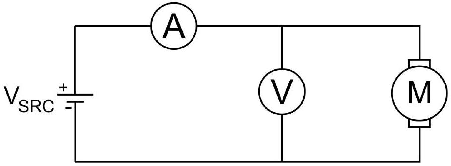
Note that for best results the voltmeter has to be placed right across the motor to avoid extra voltage drop across the amperemeter.

| $f$ (Hz) | v (m/s) | V (V) | I (A) | $P _ { M }$ (W) | $\ln v$ | $\ln P _ { M }$ |
| :--- | :--- | :--- | :--- | :--- | :--- | :--- |
| 27.2 | 2.38 | 15.920 | 0.350 | 5.57 | 0.87 | 1.72 |
| 26.0 | 2.27 | 14.910 | 0.330 | 4.92 | 0.82 | 1.59 |
| 25.0 | 2.18 | 13.410 | 0.300 | 4.02 | 0.78 | 1.39 |
| 23.8 | 2.08 | 11.830 | 0.260 | 3.08 | 0.73 | 1.12 |
| 21.9 | 1.91 | 9.880 | 0.220 | 2.17 | 0.65 | 0.78 |
| 19.6 | 1.71 | 8.100 | 0.190 | 1.54 | 0.54 | 0.43 |
| 17.3 | 1.51 | 6.540 | 0.150 | 0.98 | 0.41 | -0.02 |
| 19.1 | 1.66 | 7.370 | 0.196 | 1.44 | 0.51 | 0.37 |
| 17.8 | 1.55 | 6.490 | 0.172 | 1.12 | 0.44 | 0.11 |
| 15.6 | 1.36 | 5.240 | 0.142 | 0.74 | 0.31 | -0.30 |
| 13.5 | 1.18 | 4.210 | 0.116 | 0.49 | 0.16 | -0.72 |
| 11.2 | 0.98 | 3.240 | 0.089 | 0.29 | -0.02 | -1.25 |
| 9.5 | 0.82 | 2.630 | 0.068 | 0.18 | -0.19 | -1.72 |
| 6.8 | 0.59 | 2.390 | 0.044 | 0.10 | -0.52 | -2.26 |

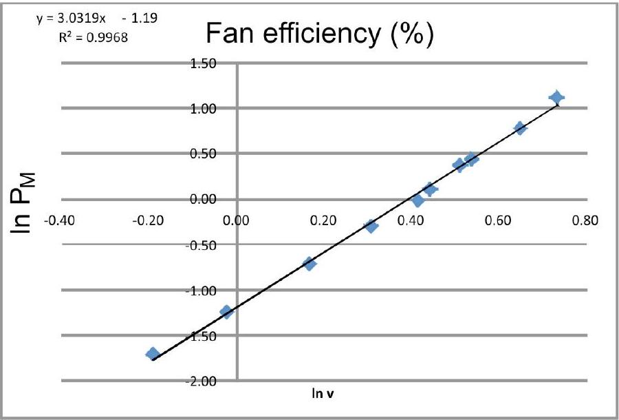

## C. Ping Pong Ball Anemometer (3.5 points)

| C. 1 (0.7 pts) | Force diagram at static equilibrium: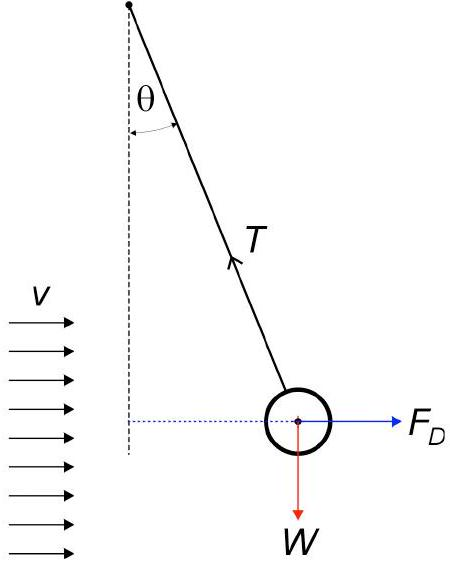 $\begin{aligned} & \tan \theta = \frac { F _ { D } } { W _ { B } } = \frac { C _ { D } \rho } { 2 } \\ & v = \sqrt [ m ] { \frac { 2 m _ { B } g } { C _ { D } \rho _ { A } A } \tan \theta } \end{aligned}$ |
| :--- | :--- |
| C. 2 (2.8 pts) | $\ln \tan \theta = \ln \frac { C _ { D } \rho _ { A } A _ { B } } { 2 m _ { B } g } + m \ln v \rightarrow y = a + b x$ The deflection can be calculated from: $\tan \theta = \Delta x / h$, where $\Delta x$ is the displacement and $h$ is the height from the ruler. The cross section of the ball is: $A _ { B } = \pi d _ { B } { } ^ { 2 } / 4$ where $d _ { B } = 0.0395 \mathrm {~m}$. In the tunnel the wind velocity is given as (Eq. 4) in the tunnel $v = c _ { 1 } f _ { M }$ where $c _ { 1 } = 0.0873 \mathrm {~m}$.   In this example we have: $m = b = 2.2$ |

|  | $C _ { D } = \frac { 2 m _ { B } g } { \rho _ { A } A _ { B } } e ^ { a } = 0.40$   Results for full score / grading scheme (sampling from several setups): $\begin{aligned} & m = 2.0 \pm 0.3 \\ & C _ { D } = 0.42 \pm 0.05 \end{aligned}$ |
| :--- | :--- |

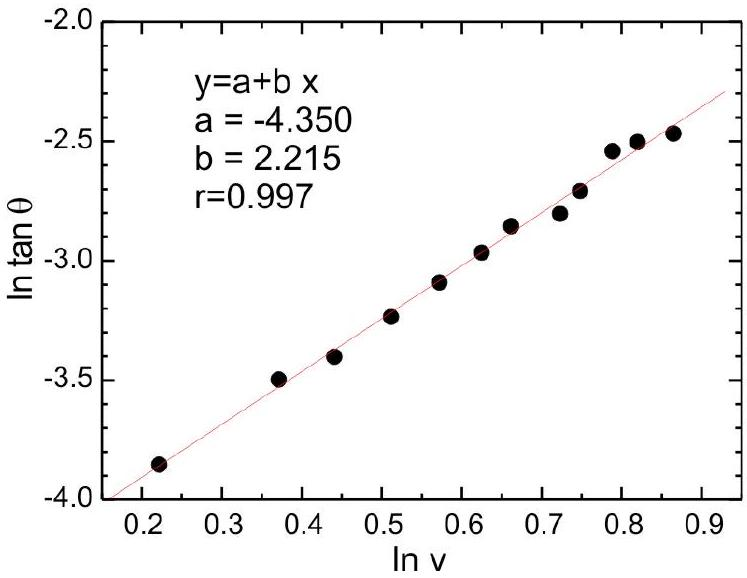

| $f$ (Hz) | $\tan \theta$ | V (m/s) | ln v | $\ln \tan \theta$ |
| :--- | :--- | :--- | :--- | :--- |
| 27.2 | 0.0848 | 2.3746 | 0.8648 | -2.47 |
| 26.0 | 0.0818 | 2.2698 | 0.8197 | -2.50 |
| 25.2 | 0.0788 | 2.2 | 0.7884 | -2.54 |
| 24.2 | 0.0667 | 2.1127 | 0.7479 | -2.71 |
| 23.6 | 0.0606 | 2.0603 | 0.7228 | -2.80 |
| 22.2 | 0.0576 | 1.9381 | 0.6617 | -2.85 |
| 21.4 | 0.0515 | 1.8682 | 0.625 | -2.97 |
| 20.3 | 0.0455 | 1.7722 | 0.5722 | -3.09 |
| 19.1 | 0.0394 | 1.6674 | 0.5113 | -3.23 |
| 17.8 | 0.0333 | 1.5539 | 0.4408 | -3.40 |
| 16.6 | 0.0303 | 1.4492 | 0.371 | -3.50 |
| 14.3 | 0.0212 | 1.2484 | 0.2219 | -3.85 |

## NOTE:

These values are in very good agreement with the theoretical and established value of $n = 2$, i.e. the drag force is proportional to the square of the velocity.

The drag coefficient $C _ { D }$ is in close to the ideal known value: $C _ { D } = 0.47$ for smooth ball with particle Reynold number $\mathrm { Re } \sim 10 ^ { 3 } - 10 ^ { 5 }$ as shown below. In this experiment the maximum Reynold number is:

$$
\begin{equation*}
\operatorname { Re } _ { B } = \frac { \rho _ { \mathrm { A } } v D _ { B } } { \mu _ { \mathrm { A } } } = \frac { 1.2 \times 2.5 \times 0.038 } { 18.3 \times 10 ^ { - 6 } } = 6240 \tag{1}
\end{equation*}
$$

Discrepancy in our $C _ { D }$ values could be due to finite boundary of our wind tunnel.

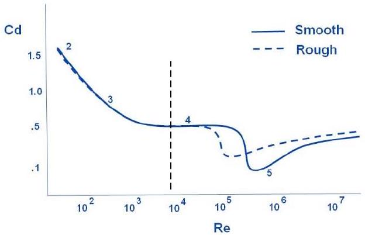
Figure 1. Drag coefficient as a function of the particle Reynold number

## D. Hotwire Anemometer (HWA) (6.7 points)

## [D.1] Constant Temperature (3.2 points)

| D.1.1 (0.4 pts) | In the Wheatstone bridge we have: $\begin{aligned} & V _ { W } = V _ { I N P } \frac { R _ { W } } { R _ { W } + R _ { B } } = c _ { 1 } V _ { I N P } \\ & \frac { V _ { W } ^ { 2 } } { R _ { W } } = \left( a + b v ^ { c } \right) A _ { w } \left( T _ { w } - T _ { 0 } \right) \rightarrow V _ { I N P } ^ { 2 } = \frac { R _ { W } } { c _ { 1 } ^ { 2 } } A _ { W } \left( T _ { W } - T _ { 0 } \right) \left( a + b v ^ { c } \right) \\ & V _ { I N P } ^ { 2 } = \frac { \left( R _ { W } + R _ { B } \right) ^ { 2 } } { R _ { W } } A _ { W } \left( T _ { W } - T _ { 0 } \right) \left( a + b v ^ { c } \right) = c _ { 2 } \left( a + b v ^ { c } \right) \\ & \text { Where } c _ { 2 } = \frac { \left( R _ { W } + R _ { B } \right) ^ { 2 } } { R _ { W } } A _ { W } \left( T _ { W } - T _ { 0 } \right) \text { is a constant. } \\ & A = c _ { 2 } a \\ & B = c _ { 2 } b \end{aligned}$ |
| :--- | :--- |
| D.1.2 (0.3 pts) | $y = \left( \frac { V _ { I N P } } { V _ { 0 } } \right) ^ { 2 } - 1$ with $V _ { 0 } = \sqrt { A }$ is the input potential when there is no wind. |
| D.1.3 (2.5 pts) | $c = 0.7 \pm 0.2$ |

## SOLUTION

Experimental
Question
page 6 of 11

|  | $\frac { b } { a } = 1.5 \pm 0.6$ |
| :--- | :--- |

| $f _ { M }$ (Hz) | $V _ { \text {INPUT } }$ (V) | v (m/s) | $\ln v$ | $\ln \left( \left( V / V _ { 0 } \right) ^ { 2 } - 1 \right)$ |
| :--- | :--- | :--- | :--- | :--- |
| 25.70 | 1.785 | 2.244 | 0.808 | 0.546 |
| 22.40 | 1.740 | 1.956 | 0.671 | 0.464 |
| 20.80 | 1.737 | 1.816 | 0.597 | 0.459 |
| 19.70 | 1.710 | 1.720 | 0.542 | 0.407 |
| 15.83 | 1.615 | 1.382 | 0.324 | 0.209 |
| 13.30 | 1.560 | 1.161 | 0.149 | 0.079 |
| 9.76 | 1.464 | 0.852 | -0.160 | -0.181 |
| 7.65 | 1.390 | 0.668 | -0.404 | -0.426 |

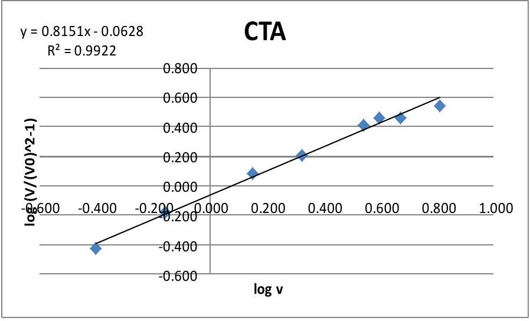

## [D.2] Constant Current (3.5 points)

First we need to determine $k$ and $R _ { 0 }$.

| D.2.1   (0.2 pts) | $k = \frac { a A _ { w } } { \alpha }$ |
| :--- | :--- |
| D.2.2   (1.2 pts) | $R _ { 0 } = ( 7.0 \pm 1.5 ) \Omega$ |

| $V _ { W }$ (V) | $I _ { W }$ (mA) | $P _ { W }$ (W) | $R _ { W } ( \Omega )$ |
| :--- | :--- | :--- | :--- |
| 0.109 | 14.7 | 0.0016 | 7.4150 |
| 0.153 | 20.8 | 0.0032 | 7.3558 |
| 0.225 | 30.1 | 0.0068 | 7.4751 |
| 0.308 | 40.3 | 0.0124 | 7.6427 |

## SOLUTION

Experimental
Question
page 7 of 11

| 0.395 | 50.4 | 0.0199 | 7.8373 |
| :--- | :--- | :--- | :--- |
| 0.509 | 61.2 | 0.0312 | 8.3170 |
| 0.615 | 71.4 | 0.0439 | 8.6134 |
| 0.730 | 81.0 | 0.0591 | 9.0123 |
| 0.870 | 90.5 | 0.0787 | 9.6133 |
| 1.048 | 100.7 | 0.1055 | 10.4071 |
| 1.220 | 110.0 | 0.1342 | 11.0909 |
| 1.470 | 120.1 | 0.1765 | 12.2398 |

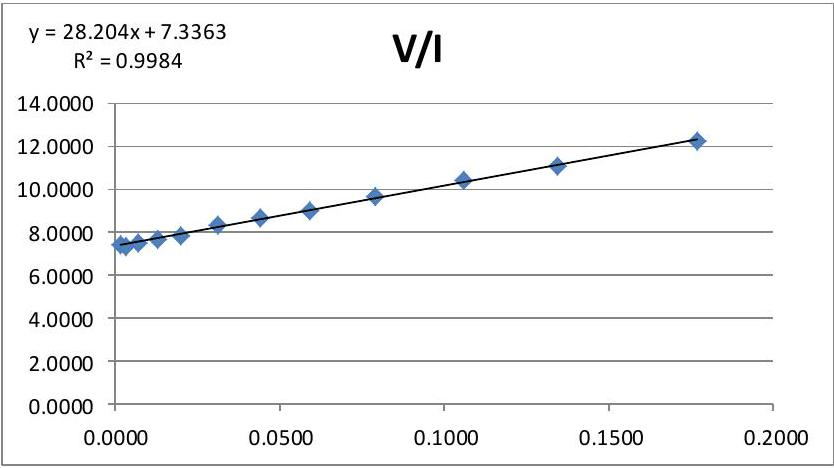

| D.2.3 (0.2 pts) | $y = \frac { V _ { W } I _ { W } R _ { 0 } } { k \left( \frac { V _ { W } } { I _ { W } } - R _ { 0 } \right) } - 1$ |
| :--- | :--- |
| D.2.4 (1.9 pts) | $\begin{aligned} & \frac { b } { a } = 1.5 \pm 0.4 \\ & c = 0.77 \pm 0.07 \end{aligned}$ |

| $V _ { W }$ | $f$ | $v$ | $y$ | $\ln ( v )$ | $\ln ( y )$ |
| :--- | :--- | :--- | :--- | :--- | :--- |
| (V) | (Hz) | (m/s) |  |  |  |
| 1.41 |  | 0.498 | 0.711 | -0.698 | -0.342 |
| 1.33 |  | 0.821 | 0.991 | -0.198 | -0.009 |
| 1.30 |  | 0.945 | 1.134 | -0.056 | 0.125 |
| 1.29 |  | 1.048 | 1.187 | 0.047 | 0.172 |
| 1.27 |  | 1.206 | 1.306 | 0.188 | 0.267 |
| 1.25 |  | 1.344 | 1.443 | 0.295 | 0.367 |
| 1.23 |  | 1.542 | 1.586 | 0.433 | 0.461 |
| 1.22 |  | 1.746 | 1.684 | 0.557 | 0.521 |
| 1.20 |  | 1.873 | 1.855 | 0.627 | 0.618 |
| 1.20 |  | 2.032 | 1.899 | 0.709 | 0.642 |
| 1.19 |  | 2.211 | 2.056 | 0.794 | 0.721 |

| 1.18 | 2.406 | 2.148 | 0.878 | 0.765 |
| :--- | :--- | :--- | :--- | :--- |
| 1.18 | 2.492 | 2.162 | 0.913 | 0.771 |

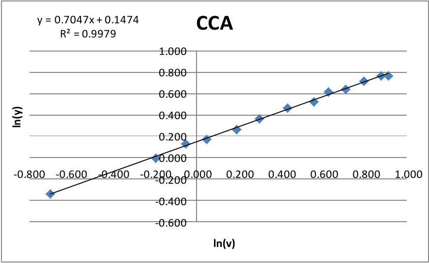

## E. Wind Turbine (5.6 points)

| E. 1 (0.4 pts) | We use DMM in ohmmeter mode, we first measure the lead resistance of the ohmmeter cables by shorting them to get the lead resistance. $R _ { D M M , 0 } \sim 0.2 \Omega$ Then we measure the resistance of the motor directly with DMM several times, looking for its minimum values and subtract it with the lead resistance $R _ { D M M , 0 }$.   We get : $R _ { M } = ( 0.8 \pm 0.2 ) \Omega$ |
| :--- | :--- |
| E. 2 (1.2 pts) | To eliminate the contact or lead resistance we can perform: (1) Two point resistance measurement at several lengths. (2) Four point resistance measurement with current source (using CCA box) ampmeter and voltmeter as shown below. This yields: $\lambda _ { R } = ( 0.21 \pm 0.02 ) \Omega / \mathrm { cm }$ |

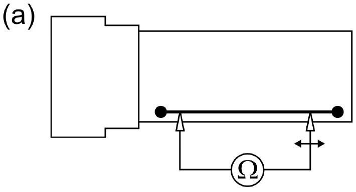
(a) Two-wire method

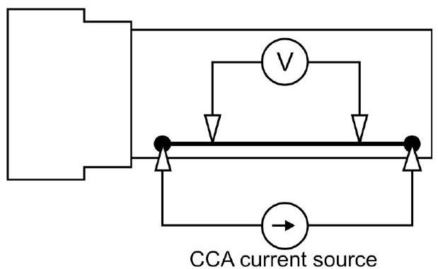
(b) Four-wire method

Method \#1: Using two-wire measurement
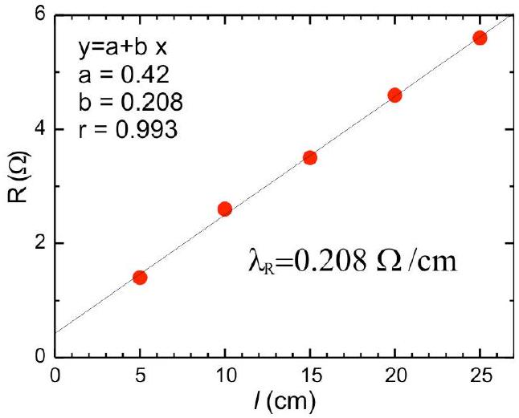

Method \#2: Using four-wire method at $l = 250 \mathrm {~mm}$.

| $V ( \mathrm { mV } )$ | $I ( \mathrm {~mA} )$ |
| :--- | :--- |
| 198.5 | 37.5 |
| 169.2 | 31.9 |
| 131.2 | 24.7 |
| 103.5 | 19.4 |
| 78.3 | 14.6 |
| 69.4 | 13 |

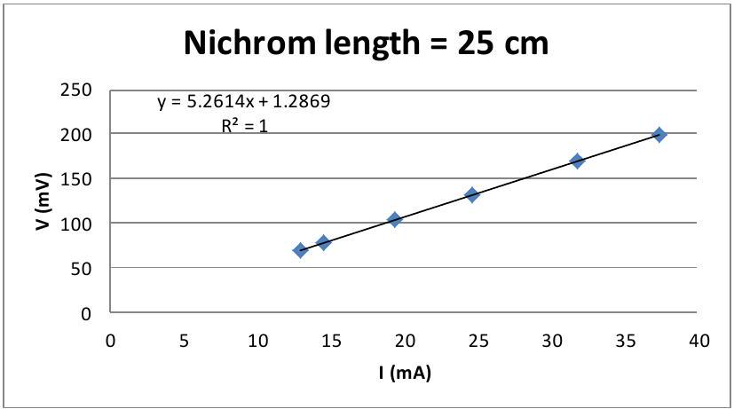

| E. 3 (2.4 pts) | We vary the nichrom wire length and calculate the power output, we obtain peak at: $R _ { L } = 1.0 \Omega$ |
| :--- | :--- |

## SOLUTION

|  | Results for full score / grading scheme (sampling from several setups): $\begin{aligned} & R _ { L } = ( 1.0 \pm 0.4 ) \Omega \\ & R _ { L , \text { theor } } = R _ { M } \end{aligned}$ |
| :--- | :--- |

| $V ( \mathrm { mV } )$ | $l ( \mathrm {~cm} )$ | $R$ (ohm) | $P ( \mathrm {~mW} )$ |
| :--- | :--- | :--- | :--- |
| 14.8 | 2 | 0.42 | 0.522 |
| 23.0 | 3 | 0.63 | 0.840 |
| 29.5 | 4 | 0.84 | 1.036 |
| 34.5 | 5 | 1.05 | 1.134 |
| 36.9 | 6 | 1.26 | 1.081 |
| 39.0 | 7 | 1.47 | 1.035 |
| 40.1 | 8 | 1.68 | 0.957 |
| 42.1 | 9 | 1.89 | 0.938 |
| 45.9 | 10 | 2.10 | 1.003 |
| 46.5 | 11 | 2.31 | 0.936 |
| 48.2 | 12 | 2.52 | 0.922 |
| 49.9 | 13 | 2.73 | 0.912 |
| 46.0 | 14 | 2.94 | 0.720 |
| 57.0 | 20 | 4.20 | 0.774 |

| $\boldsymbol { \lambda } \mathbf { R } \boldsymbol { = } \mathbf { 0 . 2 1 } \boldsymbol { \Omega } \boldsymbol { / } \mathbf { c m }$ |  |  |  |  |  |  |  |
| :--- | :--- | :--- | :--- | :--- | :--- | :--- | :--- |
| - Ea | 1.200 |  |  |  |  |  |  |
|  |  |  |  |  |  |  |  |
|  |  |  |  |  |  |  |  |
|  |  |  |  |  |  |  |  |
|  |  |  |  |  |  |  |  |
|  |  |  |  |  |  |  |  |

| E. 4 (1.6 pts) | We use the optimum load by setting $R _ { L } = 1.05 \Omega$ or setting the length of nichrom wire at $l = 5 \mathrm {~cm}$.   The wind turbine efficiency : $\eta _ { W T } = \frac { P _ { T } } { P _ { W } } = \frac { V _ { T } ^ { 2 } / R _ { L } } { \frac { 1 } { 2 } \rho _ { \mathrm { A } } A _ { W T } v ^ { 3 } }$ where $A _ { W T } = \pi R ^ { 2 }$ is the wind turbine cross section area with $R = 55$ mm, and $v = c _ { 1 } f _ { M }$ (Eq. 4) with $c _ { 1 } = 0.0873 \mathrm {~m}$ and $f _ { M }$ is the frequency of motor generator. $T S R = \frac { 2 \pi f _ { T } R } { c _ { 1 } f _ { M } }$ |
| :--- | :--- |

## SOLUTION

Experimental
Question
page 11 of 11

| $f _ { M }$ (Hz) | $f _ { T }$ (Hz) | $V _ { T }$ (mV) | TSR | $P _ { T }$ (mW) | $P _ { W }$ (mW) | $\eta _ { W T }$ (\%) |
| :--- | :--- | :--- | :--- | :--- | :--- | :--- |
| 27.8 | 9.8 | 44.0 | 1.40 | 1.84 | 81.48 | 2.26 |
| 27.9 | 9.7 | 44.0 | 1.38 | 1.84 | 82.36 | 2.24 |
| 27.2 | 9.7 | 43.0 | 1.41 | 1.76 | 76.32 | 2.31 |
| 26.3 | 8.8 | 40.0 | 1.32 | 1.52 | 68.99 | 2.21 |
| 25.5 | 8.2 | 38.5 | 1.27 | 1.41 | 62.88 | 2.24 |
| 24.6 | 7.7 | 34.5 | 1.24 | 1.13 | 56.46 | 2.01 |
| 23.6 | 6.7 | 30.5 | 1.12 | 0.89 | 49.85 | 1.78 |
| 22.3 | 6.0 | 27.0 | 1.07 | 0.69 | 42.06 | 1.65 |
| 21.2 | 5.0 | 23.0 | 0.93 | 0.50 | 36.13 | 1.39 |
| 21.3 | 5.1 | 22.9 | 0.95 | 0.50 | 36.65 | 1.36 |
| 19.8 | 4.0 | 19.3 | 0.80 | 0.35 | 29.44 | 1.20 |
| 18.4 | 3.1 | 14.5 | 0.67 | 0.20 | 23.62 | 0.85 |
| 16.8 | 2.1 | 9.0 | 0.49 | 0.08 | 17.98 | 0.43 |

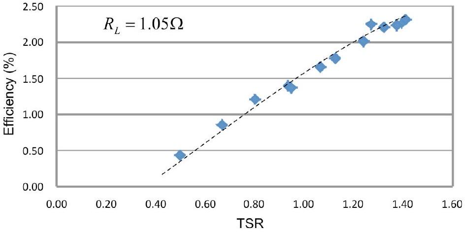

Our turbine has range of efficiency <2.5\% and tends to increase with higher TSR as the turbine spin faster. Note that at some point this efficiency will drop, unfortunately this is beyond the capability of our wind generator fan.
