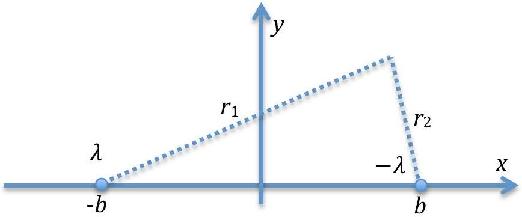
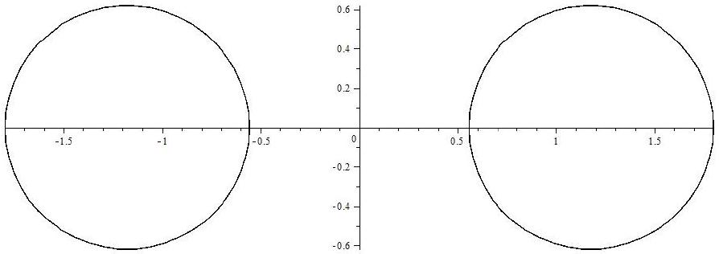
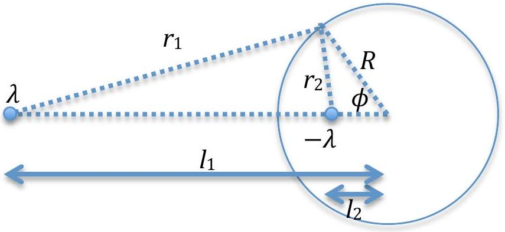
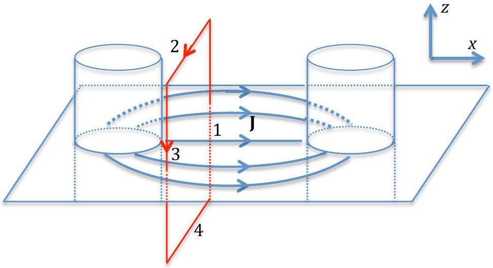

## Theoretical 1: Solution Conductors in Conducting Liquid

1. Using Gauss law
$$
\begin{equation*}
\oint \mathbf { E } \cdot \mathbf { d } \mathbf { A } = \frac { q } { \epsilon _ { 0 } } . \tag{1}
\end{equation*}
$$
From symetry we know that the electric field only has radial component. Choose a cylinder (with a line charge as the axis) as the Gaussian surface, we obtain
$$
E .2 \pi r l = \frac { \lambda l } { \epsilon _ { 0 } } .
$$
Simplify to obtain
$$
\begin{equation*}
\mathbf { E } = \hat { r } \frac { \lambda } { 2 \pi \epsilon _ { 0 } r } . \tag{2}
\end{equation*}
$$
2. The potential is given by
$$
\begin{align*}
V & = - \int _ { \text {ref } } ^ { r } \mathbf { E } \cdot \mathbf { d } \mathbf { l } \\
& = - \int _ { \text {ref } } ^ { r } E \cdot d r \\
V & = - \frac { \lambda } { 2 \pi \epsilon _ { 0 } } \ln r + K , \tag{3}
\end{align*}
$$
so $f ( r ) = - \frac { \lambda } { 2 \pi \epsilon _ { 0 } } \ln r$. where $K$ is a constant.
3. The potential from both line charges is a superposition of both potential

Figure 1: System with two line charges

$$
\begin{align*}
V & = - \frac { \lambda } { 2 \pi \epsilon _ { 0 } } \ln r _ { 1 } + \frac { \lambda } { 2 \pi \epsilon _ { 0 } } \ln r _ { 2 }  \tag{4}\\
& = \frac { \lambda } { 2 \pi \epsilon _ { 0 } } \ln \frac { \sqrt { ( b - x ) ^ { 2 } + y ^ { 2 } } } { \sqrt { ( b + x ) ^ { 2 } + y ^ { 2 } } } \\
V & = \frac { \lambda } { 4 \pi \epsilon _ { 0 } } \ln \frac { ( b - x ) ^ { 2 } + y ^ { 2 } } { ( b + x ) ^ { 2 } + y ^ { 2 } } \tag{5}
\end{align*}
$$

## Theoretical 1: Solution Conductors in Conducting Liquid

We can rearrange eq.(5) in to:

$$
\begin{equation*}
\left( x - \left( \frac { 1 + \beta } { 1 - \beta } \right) \right) ^ { 2 } + y ^ { 2 } = b ^ { 2 } \left( \left( \frac { 1 + \beta } { 1 - \beta } \right) ^ { 2 } - 1 \right) \tag{6}
\end{equation*}
$$

where $\beta = \exp \left( \frac { 4 \pi \epsilon _ { 0 } V } { \lambda } \right)$. For an arbitrary potential $V$, Eq. (6) is an equation of circle.

Figure 2: The equipotential surfaces with $b = 1$, for $\beta = 12.35$ (left) and $\beta = \frac { 1 } { 12.35 }$ (right)

4. From eq.(5) and eq.(6), we see that for any arbitrary potential $V$, the equipotential surfaces of these two equal but opposite lines charge, are cylindrical surfaces. From this observation, we can choose the specific position for each line charge in both cylinders so that the surface of each cylinder is an equipotential surface.
Consider the following figure

Figure 3: Two line charges with its equipotential surfaces

We would like to find a cylindrical equipotential surface enclose one line charge, let say the $- \lambda$ (if we could find the surface, by symmetry, we surely can find the identical one that enclose the line $\lambda$ ). The potential is given by

$$
\begin{align*}
V & = - \frac { \lambda } { 2 \pi \epsilon _ { 0 } } \ln r _ { 1 } + \frac { \lambda } { 2 \pi \epsilon _ { 0 } } \ln r _ { 2 } \\
& = - \frac { \lambda } { 4 \pi \epsilon _ { 0 } } \ln \left( l _ { 1 } ^ { 2 } + R ^ { 2 } - 2 l _ { 1 } R \cos \phi \right) + \frac { \lambda } { 4 \pi \epsilon _ { 0 } } \ln \left( l _ { 2 } ^ { 2 } + R ^ { 2 } - 2 l _ { 2 } R \cos \phi \right) . \tag{7}
\end{align*}
$$

## Theoretical 1: Solution   Conductors in Conducting Liquid

Since the surface of the cylinder has to be the equipotential surface, so the potential should not depend on $\phi$, i.e. $\frac { \partial V } { \partial \phi } = 0$.

$$
\begin{align*}
- \frac { \lambda } { 4 \pi \epsilon _ { 0 } } \frac { 2 l _ { 1 } R \sin \phi } { l _ { 1 } ^ { 2 } + R ^ { 2 } - 2 l _ { 1 } R \cos \phi } & + \frac { \lambda } { 4 \pi \epsilon _ { 0 } } \frac { 2 l _ { 2 } R \sin \phi } { l _ { 2 } ^ { 2 } + R ^ { 2 } - 2 l _ { 2 } R \cos \phi } = 0  \tag{8}\\
\frac { l _ { 1 } } { l _ { 1 } ^ { 2 } + R ^ { 2 } - 2 l _ { 1 } R \cos \phi } & = \frac { l _ { 2 } } { l _ { 2 } ^ { 2 } + R ^ { 2 } - 2 l _ { 2 } R \cos \phi } \\
l _ { 1 } ^ { 2 } l _ { 2 } + R ^ { 2 } l _ { 2 } - 2 l _ { 1 } l _ { 2 } R \cos \phi & = l _ { 1 } l _ { 2 } ^ { 2 } + R ^ { 2 } l _ { 1 } - 2 l _ { 1 } l _ { 2 } R \cos \phi \\
l _ { 1 } l _ { 2 } \left( l _ { 1 } - l _ { 2 } \right) & = R ^ { 2 } \left( l _ { 1 } - l _ { 2 } \right) \\
l _ { 1 } l _ { 2 } & = R ^ { 2 } . \tag{9}
\end{align*}
$$

From the data in the problem, we have

$$
\begin{align*}
l _ { 1 } + l _ { 2 } & = 10 a  \tag{10}\\
l _ { 1 } l _ { 2 } & = 9 a ^ { 2 } \tag{11}
\end{align*}
$$

Solve this quadratic equation to get

$$
\begin{equation*}
l _ { 1 } = 5 a \pm 4 a . \tag{12}
\end{equation*}
$$

However, since $l _ { 1 } > l _ { 2 }$, we have

$$
\begin{align*}
& l _ { 1 } = 9 a ,  \tag{13}\\
& l _ { 2 } = a . \tag{14}
\end{align*}
$$

Using this results on eq.(5), we have

$$
\begin{equation*}
V = \frac { \lambda } { 4 \pi \epsilon _ { 0 } } \ln \frac { ( 4 a - x ) ^ { 2 } + y ^ { 2 } } { ( 4 a + x ) ^ { 2 } + y ^ { 2 } } . \tag{15}
\end{equation*}
$$

This is the potential in all region except inside both cylinders. For cylinders at $x = - 5 a$, the potential is constant and equal to

$$
\begin{equation*}
V ( x = - 2 a , y = 0 ) = \frac { \lambda } { 4 \pi \epsilon _ { 0 } } \ln \frac { ( 4 a + 2 a ) ^ { 2 } + 0 ^ { 2 } } { ( 4 a - 2 a ) ^ { 2 } + 0 ^ { 2 } } = \frac { \lambda } { 2 \pi \epsilon _ { 0 } } \ln 3 . \tag{16}
\end{equation*}
$$

For cylinders at $x = 5 a$, the potential is constant and equal to

$$
\begin{equation*}
V ( x = 2 a , y = 0 ) = \frac { \lambda } { 4 \pi \epsilon _ { 0 } } \ln \frac { ( 4 a - 2 a ) ^ { 2 } + 0 ^ { 2 } } { ( 4 a + 2 a ) ^ { 2 } + 0 ^ { 2 } } = - \frac { \lambda } { 2 \pi \epsilon _ { 0 } } \ln 3 . \tag{17}
\end{equation*}
$$

The potential difference between both cylinders are

$$
\begin{equation*}
\Delta V = \frac { \lambda } { \pi \epsilon _ { 0 } } \ln 3 \equiv V _ { 0 } . \tag{18}
\end{equation*}
$$

## Theoretical 1: Solution   Conductors in Conducting Liquid

Substituting this results in the potential equation, the potential outside the two cylinders are:

$$
\begin{equation*}
V = \frac { V _ { 0 } } { 4 \ln 3 } \ln \frac { ( 4 a - x ) ^ { 2 } + y ^ { 2 } } { ( 4 a + x ) ^ { 2 } + y ^ { 2 } } . \tag{19}
\end{equation*}
$$

And the potential inside the cylinders are:
The potential inside the cylinder centered at $( x = 5 a , y = 0 )$ is $V = - V _ { 0 } / 2$.
The potential inside the cylinder centered at $( x = - 5 a , y = 0 )$ is $V = V _ { 0 } / 2$.

5. From eq.(18), we have
$$
\begin{equation*}
V _ { 0 } = \frac { q } { l \pi \epsilon _ { 0 } } \ln 3 , \tag{20}
\end{equation*}
$$
so we get
$$
\begin{equation*}
C = \frac { q } { V _ { 0 } } = \frac { l \pi \epsilon _ { 0 } } { \ln 3 } \tag{21}
\end{equation*}
$$
6. The electric field produces by both cylinders are
$$
\begin{align*}
& E _ { x } = \frac { V _ { 0 } } { 2 \ln 3 } \left( \frac { 4 a + x } { ( 4 a + x ) ^ { 2 } + y ^ { 2 } } + \frac { 4 a - x } { ( 4 a - x ) ^ { 2 } + y ^ { 2 } } \right) .  \tag{22}\\
& E _ { y } = \frac { V _ { 0 } } { 2 \ln 3 } \left( \frac { y } { ( 4 a + x ) ^ { 2 } + y ^ { 2 } } - \frac { y } { ( 4 a - x ) ^ { 2 } + y ^ { 2 } } \right) . \tag{23}
\end{align*}
$$
The volume current density is given by
$$
\begin{equation*}
\mathbf { J } = \sigma \mathbf { E } \tag{24}
\end{equation*}
$$
To calculate the total current, we may choose to calculate the current that flow through the $x = 0$ plane. On this plane, there is no current in the $y$ direction. The total current is given by
$$
\begin{align*}
I & = \int \mathbf { J } \cdot \mathbf { d } \mathbf { A }  \tag{25}\\
& = \int \sigma E _ { x } l d y \\
& = \sigma l \frac { 8 a V _ { 0 } } { 2 \ln 3 } \int _ { \infty } ^ { \infty } \frac { d y } { ( 4 a ) ^ { 2 } + y ^ { 2 } } \\
I & = \frac { V _ { 0 } \pi \sigma l } { \ln 3 } \tag{26}
\end{align*}
$$
7. The resistance is given by
$$
\begin{equation*}
R = \frac { V _ { 0 } } { I } = \frac { \ln 3 } { \pi \sigma l } \tag{27}
\end{equation*}
$$
and therefore
$$
\begin{equation*}
R C = \frac { \epsilon _ { 0 } } { \sigma } \tag{28}
\end{equation*}
$$

## Theoretical 1: Solution Conductors in Conducting Liquid

8. Since the system has a high symmetry, we may use Ampere's law. The magnetic field should not have any $z$ dependence, since the current has no $z$ dependence.
Figure 4 shows the current density J flow from one cylinder to the other cylinder. Choose an Ampere loop on a constant $x$ plane in a symmetrical way, so that the first path is pointing in the positive $z$ direction with constant $y$ coordinate, the second path is pointing to the negative $y$ direction with constant $z$ coordinate. The third path is pointing to the negative $z$ direction, but with constant $- y$ coordinate. The fourth path is pointing in the positive $y$ direction with constant $- z$ coordinate.
Having this path, we need to calculate the current that flow through the loop

$$
\begin{aligned}
I & = \int \mathbf { J } \cdot \mathbf { d } \mathbf { A } \\
& = \int J _ { x } l d y \\
& = \frac { V _ { 0 } \sigma l } { 2 \ln 3 } \int _ { - y } ^ { y } \left( \frac { 4 a + x } { ( 4 a + x ) ^ { 2 } + y ^ { 2 } } + \frac { 4 a - x } { ( 4 a - x ) ^ { 2 } + y ^ { 2 } } \right) d y
\end{aligned}
$$

Figure 4: The Ampere loop

$$
\begin{equation*}
I = \frac { V _ { 0 } \sigma l } { \ln 3 } \left( \arctan \frac { y } { 4 a + x } + \arctan \frac { y } { 4 a - x } \right) \tag{29}
\end{equation*}
$$

Using the Ampere's law

$$
\begin{align*}
\oint \mathbf { B } \cdot \mathbf { d } \mathbf { l } & = \mu _ { 0 } I  \tag{30}\\
2 B _ { z } l & = \frac { \mu _ { 0 } V _ { 0 } \sigma l } { \ln 3 } \left( \arctan \frac { y } { 4 a + x } + \arctan \frac { y } { 4 a - x } \right) \\
B _ { z } & = \mu _ { 0 } \frac { V _ { 0 } \sigma } { 2 \ln 3 } \left( \arctan \frac { y } { 4 a + x } + \arctan \frac { y } { 4 a - x } \right) \tag{31}
\end{align*}
$$

## Theoretical 1: Solution Conductors in Conducting Liquid

therefore

$$
\begin{equation*}
\mathbf { B } = \hat { z } \frac { \mu _ { 0 } V _ { 0 } \sigma } { 2 \ln 3 } \left( \arctan \frac { y } { 4 a + x } + \arctan \frac { y } { 4 a - x } \right) \tag{32}
\end{equation*}
$$
