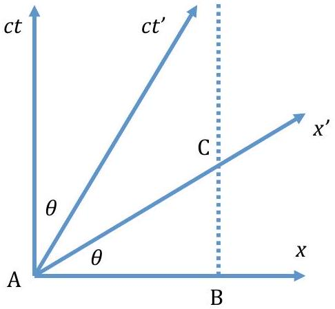
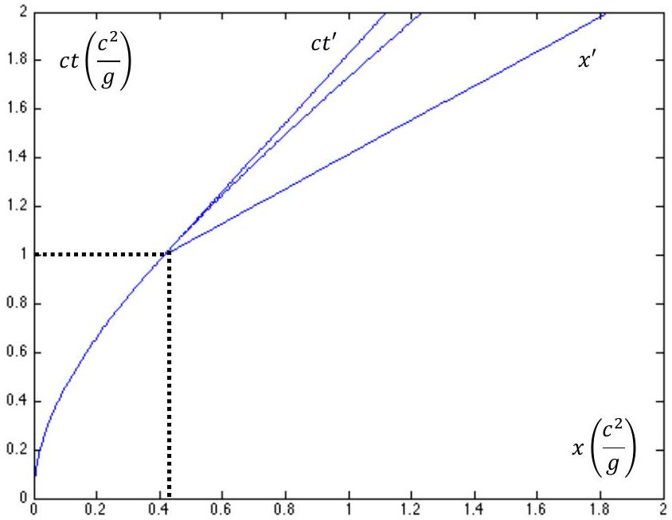
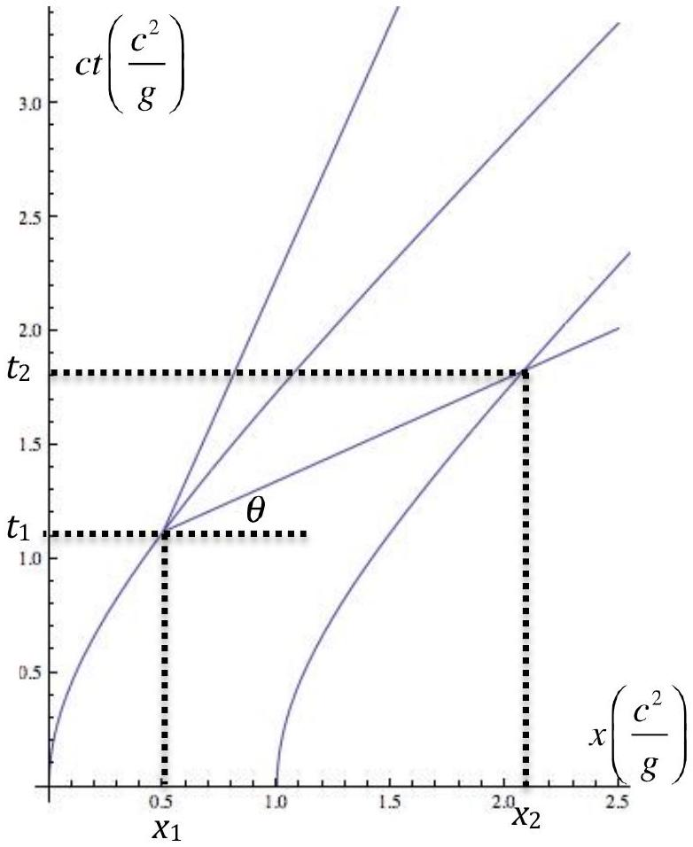
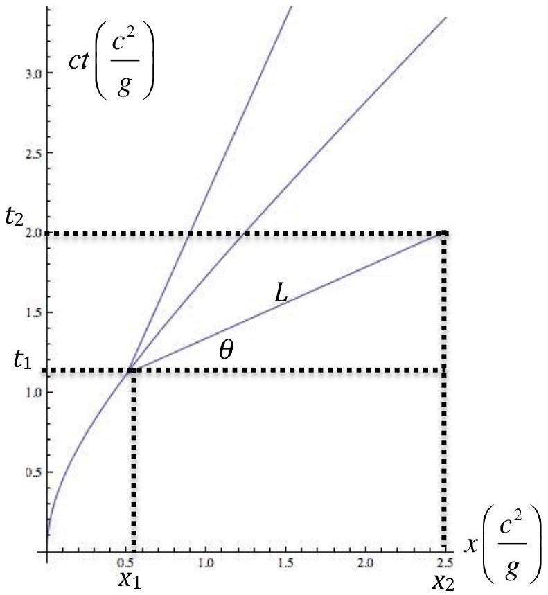

## Theoretical 2: Solution   Relativistic Correction on GPS Satelitte

Part A. Single accelerated particle

1. The equation of motion is given by
$$
\begin{align*}
F & = \frac { d } { d t } ( \gamma m v )  \tag{1}\\
& = \frac { m c \dot { \beta } } { \left( 1 - \beta ^ { 2 } \right) ^ { \frac { 3 } { 2 } } } \\
F & = \gamma ^ { 3 } m a \tag{2}
\end{align*}
$$
where $\gamma = \frac { 1 } { \sqrt { 1 - \beta ^ { 2 } } }$ and $\beta = \frac { v } { c }$. So the acceleration is given by
$$
\begin{equation*}
a = \frac { F } { \gamma ^ { 3 } m } . \tag{3}
\end{equation*}
$$
2. Eq.(3) can be rewritten as
$$
\begin{align*}
c \frac { d \beta } { d t } & = \frac { F } { \gamma ^ { 3 } m } \\
\int _ { 0 } ^ { \beta } \frac { d \beta } { \left( 1 - \beta ^ { 2 } \right) ^ { \frac { 3 } { 2 } } } & = \frac { F } { m c } \int _ { 0 } ^ { t } d t \\
\frac { \beta } { \sqrt { 1 - \beta ^ { 2 } } } & = \frac { F t } { m c } \tag{4}
\end{align*}
$$
$$
\begin{equation*}
\beta = \frac { \frac { F t } { m c } } { \sqrt { 1 + \left( \frac { F t } { m c } \right) ^ { 2 } } } . \tag{5}
\end{equation*}
$$
3. Using Eq.(5), we get
$$
\begin{align*}
\int _ { 0 } ^ { x } d x & = \int _ { 0 } ^ { t } \frac { F t d t } { m \sqrt { 1 + \left( \frac { F t } { m c } \right) ^ { 2 } } } \\
x & = \frac { m c ^ { 2 } } { F } \left( \sqrt { 1 + \left( \frac { F t } { m c } \right) ^ { 2 } } - 1 \right) \tag{6}
\end{align*}
$$
4. Consider the following systems, a frame S' is moving with respect to another frame S, with velocity $u$ in the $x$ direction. If a particle is moving in the $\mathrm { S } ^ { \prime }$ frame with velocity $v ^ { \prime }$ also in $x$ direction, then the particle velocity in the S frame is given by
$$
\begin{equation*}
v = \frac { u + v ^ { \prime } } { 1 + \frac { u v ^ { \prime } } { c ^ { 2 } } } . \tag{7}
\end{equation*}
$$

## Theoretical 2: Solution   Relativistic Correction on GPS Satelitte

If the particles velocity changes with respect to the S' frame, then the velocity in the S frame is also change according to

$$
\begin{align*}
& d v = \frac { d v ^ { \prime } } { 1 + \frac { u v ^ { \prime } } { c ^ { 2 } } } - \frac { u + v ^ { \prime } } { \left( 1 + \frac { u v ^ { \prime } } { c ^ { 2 } } \right) ^ { 2 } } \frac { u d v ^ { \prime } } { c ^ { 2 } } \\
& d v = \frac { 1 } { \gamma ^ { 2 } } \frac { d v ^ { \prime } } { \left( 1 + \frac { u v ^ { \prime } } { c ^ { 2 } } \right) ^ { 2 } } \tag{8}
\end{align*}
$$

The time in the $\mathrm { S } ^ { \prime }$ frame is $t ^ { \prime }$, so the time in the S frame is given by

$$
\begin{equation*}
t = \gamma \left( t ^ { \prime } + \frac { u x ^ { \prime } } { c ^ { 2 } } \right) , \tag{9}
\end{equation*}
$$

so the time change in the S' frame will give a time change in the S frame as follow

$$
\begin{equation*}
d t = \gamma d t ^ { \prime } \left( 1 + \frac { u v ^ { \prime } } { c ^ { 2 } } \right) . \tag{10}
\end{equation*}
$$

The acceleration in the S frame is given by

$$
\begin{equation*}
a = \frac { d v } { d t } = \frac { a ^ { \prime } } { \gamma ^ { 3 } } \frac { 1 } { \left( 1 + \frac { u v ^ { \prime } } { c ^ { 2 } } \right) ^ { 3 } } . \tag{11}
\end{equation*}
$$

If the S' frame is the proper frame, then by definition the velocity $v ^ { \prime } = 0$. Substitute this to the last equation, we get

$$
\begin{equation*}
a = \frac { a ^ { \prime } } { \gamma ^ { 3 } } . \tag{12}
\end{equation*}
$$

Combining Eq.(3) and Eq.(12), we get

$$
\begin{equation*}
a ^ { \prime } = \frac { F } { m } \equiv g . \tag{13}
\end{equation*}
$$

5. Eq.(3) can also be rewritten as

$$
\begin{align*}
c \frac { d \beta } { \gamma d \tau } & = \frac { g } { \gamma ^ { 3 } }  \tag{14}\\
\int _ { 0 } ^ { \beta } \frac { d \beta } { 1 - \beta ^ { 2 } } & = \frac { g } { c } \int _ { 0 } ^ { \tau } d \tau \\
\ln \left( \frac { 1 } { \sqrt { 1 - \beta ^ { 2 } } } + \frac { \beta } { \sqrt { 1 - \beta ^ { 2 } } } \right) & = \frac { g \tau } { c }  \tag{15}\\
\sqrt { \frac { 1 + \beta } { 1 - \beta } } & = e ^ { \frac { g \tau } { c } } \\
\beta \left( e ^ { \frac { g \tau } { c } } + e ^ { - \frac { g \tau } { c } } \right) & = e ^ { \frac { g \tau } { c } } - e ^ { - \frac { g \tau } { c } } \\
\beta & = \tanh \frac { g \tau } { c } . \tag{16}
\end{align*}
$$

## Theoretical 2: Solution Relativistic Correction on GPS Satelitte

6. The time dilation relation is
$$
\begin{equation*}
d t = \gamma d \tau . \tag{17}
\end{equation*}
$$
From eq.(16), we have
$$
\begin{equation*}
\gamma = \frac { 1 } { \sqrt { 1 - \beta ^ { 2 } } } = \cosh \frac { g \tau } { c } . \tag{18}
\end{equation*}
$$
Combining this equations, we get
$$
\begin{align*}
\int _ { 0 } ^ { t } d t & = \int _ { 0 } ^ { \tau } d \tau \cosh \frac { g \tau } { c } \\
t & = \frac { c } { g } \sinh \frac { g \tau } { c } \tag{19}
\end{align*}
$$

Part B. Flight Time

1. When the clock in the origin time is equal to $t _ { 0 }$, it emits a signal that contain the information of its time. This signal will arrive at the particle at time $t$, while the particle position is at $x ( t )$. We have
$$
\begin{align*}
c \left( t - t _ { 0 } \right) & = x ( t )  \tag{20}\\
t - t _ { 0 } & = \frac { c } { g } \left( \sqrt { 1 + \left( \frac { g t } { c } \right) ^ { 2 } } - 1 \right) \\
t & = \frac { t _ { 0 } } { 2 } \frac { 2 - \frac { g t _ { 0 } } { c } } { 1 - \frac { g t _ { 0 } } { c } } \tag{21}
\end{align*}
$$
When the information arrive at the particle, the particle's clock has a reading according to eq.(19). So we get
$$
\begin{align*}
\frac { c } { g } \sinh \frac { g \tau } { c } & = \frac { t _ { 0 } } { 2 } \frac { 2 - \frac { g t _ { 0 } } { c } } { 1 - \frac { g t _ { 0 } } { c } } \\
0 & = \frac { 1 } { 2 } \left( \frac { g t _ { 0 } } { c } \right) ^ { 2 } - \frac { g t _ { 0 } } { c } \left( 1 + \sinh \frac { g \tau } { c } \right) + \sinh \frac { g \tau } { c } \\
\frac { g t _ { 0 } } { c } & = 1 + \sinh \frac { g \tau } { c } \pm \cosh \frac { g \tau } { c } . \tag{22}
\end{align*}
$$
Using initial condition $t = 0$ when $\tau = 0$, we choose the negative sign
$$
\begin{align*}
\frac { g t _ { 0 } } { c } & = 1 + \sinh \frac { g \tau } { c } - \cosh \frac { g \tau } { c } \\
t _ { 0 } & = \frac { c } { g } \left( 1 - e ^ { - \frac { g \tau } { c } } \right) . \tag{23}
\end{align*}
$$
As $\tau \rightarrow \infty , t _ { 0 } = \frac { c } { g }$. So the clock reading will freeze at this value.

## Theoretical 2: Solution Relativistic Correction on GPS Satelitte

2. When the particles clock has a reading $\tau _ { 0 }$, its position is given by eq.(6), and the time $t _ { 0 }$ is given by eq.(19). Combining this two equation, we get

$$
\begin{equation*}
x = \frac { c ^ { 2 } } { g } \left( \sqrt { 1 + \sinh ^ { 2 } \frac { g \tau _ { 0 } } { c } } - 1 \right) . \tag{24}
\end{equation*}
$$

The particle's clock reading is then sent to the observer at the origin. The total time needed for the information to arrive is given by

$$
\begin{align*}
t & = \frac { c } { g } \sinh \frac { g \tau _ { 0 } } { c } + \frac { x } { c }  \tag{25}\\
& = \frac { c } { g } \left( \sinh \frac { g \tau _ { 0 } } { c } + \cosh \frac { g \tau _ { 0 } } { c } - 1 \right) \\
t & = \frac { c } { g } \left( e ^ { \frac { g \tau _ { 0 } } { c } } - 1 \right)  \tag{26}\\
\tau _ { 0 } & = \frac { c } { g } \ln \left( \frac { g t } { c } + 1 \right) . \tag{27}
\end{align*}
$$

The time will not freeze.

## Part C. Minkowski Diagram

1. The figure below show the setting of the problem.
The line AB represents the stick with proper length equal $L$ in the S frame.
The length AB is equal to $\sqrt { \frac { 1 - \beta ^ { 2 } } { 1 + \beta ^ { 2 } } } L$ in the S' frame.
The stick length in the S' frame is represented by the line AC

Figure 1: Minkowski Diagram

$$
\begin{equation*}
\mathrm { AC } = \frac { \mathrm { AB } } { \cos \theta } = \sqrt { 1 - \beta ^ { 2 } } L . \tag{28}
\end{equation*}
$$
2. The position of the particle is given by eq.(6).

## Theoretical 2: Solution   Relativistic Correction on GPS Satelitte

Figure 2: Minkowski Diagram

Part D. Two Accelerated Particles

1. $\tau _ { B } = \tau _ { A }$.
2. From the diagram, we have

$$
\begin{equation*}
\tan \theta = \beta = \frac { c t _ { 2 } - c t _ { 1 } } { x _ { 2 } - x _ { 1 } } . \tag{29}
\end{equation*}
$$

Using eq.(6), and eq.(19) along with the initial condition, we get

$$
\begin{align*}
& x _ { 1 } = \frac { c ^ { 2 } } { g } \left( \cosh \frac { g \tau _ { 1 } } { c } - 1 \right)  \tag{30}\\
& x _ { 2 } = \frac { c ^ { 2 } } { g } \left( \cosh \frac { g \tau _ { 2 } } { c } - 1 \right) + L . \tag{31}
\end{align*}
$$

Using eq.(16), eq.(19), eq.(30) and eq.(31), we obtain

$$
\begin{align*}
\tanh \frac { g \tau _ { 1 } } { c } & = \frac { c \left( \frac { c } { g } \sinh \frac { g \tau _ { 2 } } { c } - \frac { c } { g } \sinh \frac { g \tau _ { 1 } } { c } \right) } { L + \frac { c ^ { 2 } } { g } \left( \cosh \frac { g \tau _ { 2 } } { c } - 1 \right) - \frac { c ^ { 2 } } { g } \left( \cosh \frac { g \tau _ { 1 } } { c } - 1 \right) } \\
& = \frac { \sinh \frac { g \tau _ { 2 } } { c } - \sinh \frac { g \tau _ { 1 } } { c } } { \frac { g L } { c ^ { 2 } } + \cosh \frac { g \tau _ { 2 } } { c } - \cosh \frac { g \tau _ { 1 } } { c } } \\
\frac { g L } { c ^ { 2 } } \sinh \frac { g \tau _ { 1 } } { c } & = \sinh \frac { g \tau _ { 2 } } { c } \cosh \frac { g \tau _ { 1 } } { c } - \cosh \frac { g \tau _ { 2 } } { c } \sinh \frac { g \tau _ { 1 } } { c } \\
\frac { g L } { c ^ { 2 } } \sinh \frac { g \tau _ { 1 } } { c } & = \sinh \frac { g } { c } \left( \tau _ { 2 } - \tau _ { 1 } \right) . \tag{32}
\end{align*}
$$

So $C _ { 1 } = \frac { g L } { c ^ { 2 } }$.

## Theoretical 2: Solution   Relativistic Correction on GPS Satelitte

Figure 3: Minkowski Diagram for two particles

3. From the length contraction, we have
$$
\begin{align*}
L ^ { \prime } & = \frac { x _ { 2 } - x _ { 1 } } { \gamma _ { 1 } }  \tag{33}\\
\frac { d L ^ { \prime } } { d \tau _ { 1 } } & = \left( \frac { d x _ { 2 } } { d \tau _ { 2 } } \frac { d \tau _ { 2 } } { d \tau _ { 1 } } - \frac { d x _ { 1 } } { d \tau _ { 1 } } \right) \frac { 1 } { \gamma _ { 1 } } - \frac { x _ { 2 } - x _ { 1 } } { \gamma _ { 1 } ^ { 2 } } \frac { d \gamma _ { 1 } } { d \tau _ { 1 } } . \tag{34}
\end{align*}
$$
Take derivative of eq.(30), eq.(31) and eq.(32), we get
$$
\begin{align*}
\frac { d x _ { 1 } } { d \tau _ { 1 } } = & c \sinh \frac { g \tau _ { 1 } } { c } ,  \tag{35}\\
\frac { d x _ { 2 } } { d \tau _ { 2 } } = & c \sinh \frac { g \tau _ { 2 } } { c } ,  \tag{36}\\
\frac { g L } { c ^ { 2 } } \cosh \frac { g \tau _ { 1 } } { c } = & \cosh \frac { g } { c } \left( \tau _ { 2 } - \tau _ { 1 } \right) \left( \frac { d \tau _ { 2 } } { d \tau _ { 1 } } - 1 \right) . \tag{37}
\end{align*}
$$
The last equation can be rearrange to get
$$
\begin{equation*}
\frac { d \tau _ { 2 } } { d \tau _ { 1 } } = \frac { \frac { g L } { c ^ { 2 } } \cosh \frac { g \tau _ { 1 } } { c } } { \cosh \frac { g } { c } \left( \tau _ { 2 } - \tau _ { 1 } \right) } + 1 . \tag{38}
\end{equation*}
$$

## Theoretical 2: Solution   Relativistic Correction on GPS Satelitte

From eq.(29), we have

$$
\begin{equation*}
x _ { 2 } - x _ { 1 } = \frac { c \left( t _ { 2 } - t _ { 1 } \right) } { \beta _ { 1 } } = \frac { c } { \tanh \frac { g \tau _ { 1 } } { c } } \left( \frac { c } { g } \sinh \frac { g \tau _ { 2 } } { c } - \frac { c } { g } \sinh \frac { g \tau _ { 1 } } { c } \right) . \tag{39}
\end{equation*}
$$

Combining all these equations, we get

$$
\begin{align*}
\frac { d L _ { 1 } } { d \tau _ { 1 } } = & \left( c \sinh \frac { g \tau _ { 2 } } { c } \frac { \frac { g L } { c ^ { 2 } } \cosh \frac { g \tau _ { 1 } } { c } } { \cosh \frac { g } { c } \left( \tau _ { 2 } - \tau _ { 1 } \right) } + c \sinh \frac { g \tau _ { 2 } } { c } - c \sinh \frac { g \tau _ { 1 } } { c } \right) \frac { 1 } { \cosh \frac { g \tau _ { 1 } } { c } } \\
& - \frac { c ^ { 2 } } { g } \left( \sinh \frac { g \tau _ { 2 } } { c } - \sinh \frac { g \tau _ { 1 } } { c } \right) \frac { 1 } { \tanh \frac { g \tau _ { 1 } } { c } } \frac { 1 } { \cosh ^ { 2 } \frac { g \tau _ { 1 } } { c } } \frac { g } { c } \sinh \frac { g \tau _ { 1 } } { c } \\
\frac { d L _ { 1 } } { d \tau _ { 1 } } = & \frac { g L } { c } \frac { \sinh \frac { g \tau _ { 2 } } { c } } { \cosh \frac { g } { c } \left( \tau _ { 2 } - \tau _ { 1 } \right) } . \tag{40}
\end{align*}
$$

So $C _ { 2 } = \frac { g L } { c }$.
Part E. Uniformly Accelerated Frame

1. Distance from a certain point $x _ { p }$ according to the particle's frame is
$$
\begin{align*}
L ^ { \prime } & = \frac { x - x _ { p } } { \gamma }  \tag{41}\\
L ^ { \prime } & = \frac { \frac { c ^ { 2 } } { g _ { 1 } } \left( \cosh \frac { g _ { 1 } \tau } { c } - 1 \right) - x _ { p } } { \cosh \frac { g _ { 1 } \tau } { c } } \\
L ^ { \prime } & = \frac { c ^ { 2 } } { g _ { 1 } } - \frac { \frac { c ^ { 2 } } { g _ { 1 } } + x _ { p } } { \cosh \frac { g _ { 1 } \tau } { c } } . \tag{42}
\end{align*}
$$
For $L ^ { \prime }$ equal constant, we need $x _ { p } = - \frac { c ^ { 2 } } { g _ { 1 } }$.
2. First method: If the distance in the $\mathrm { S } ^ { \prime }$ frame is constant $= L$, then in the S frame the length is
$$
\begin{equation*}
L _ { s } = L \sqrt { \frac { 1 + \beta ^ { 2 } } { 1 - \beta ^ { 2 } } } . \tag{43}
\end{equation*}
$$
So the position of the second particle is
$$
\begin{align*}
x _ { 2 } & = x _ { 1 } + L _ { s } \cos \theta  \tag{44}\\
& = \frac { c ^ { 2 } } { g _ { 1 } } \left( \sqrt { 1 + \left( \frac { g _ { 1 } t _ { 1 } } { c } \right) ^ { 2 } } - 1 \right) + L \sqrt { 1 + \left( \frac { g _ { 1 } t _ { 1 } } { c } \right) } \\
x _ { 2 } & = \left( \frac { c ^ { 2 } } { g _ { 1 } } + L \right) \sqrt { 1 + \left( \frac { g _ { 1 } t _ { 1 } } { c } \right) ^ { 2 } } - \frac { c ^ { 2 } } { g _ { 1 } } . \tag{45}
\end{align*}
$$

## Theoretical 2: Solution   Relativistic Correction on GPS Satelitte

Figure 4: Minkowski Diagram for two particles

The time of the second particle is

$$
\begin{align*}
c t _ { 2 } & = c t _ { 1 } + L _ { s } \sin \theta  \tag{46}\\
& = c t _ { 1 } + L \sqrt { \frac { 1 + \beta ^ { 2 } } { 1 - \beta ^ { 2 } } } \frac { \beta } { \sqrt { 1 + \beta ^ { 2 } } } \\
c t _ { 2 } & = t _ { 1 } \left( c + \frac { g _ { 1 } L } { c } \right) \tag{47}
\end{align*}
$$

Substitute eq.(47) to eq.(45) to get

$$
\begin{align*}
& x _ { 2 } = \left( \frac { c ^ { 2 } } { g _ { 1 } } + L \right) \sqrt { 1 + \left( \frac { g _ { 1 } } { c } \frac { t _ { 2 } } { 1 + \frac { g _ { 1 } L } { c ^ { 2 } } } \right) ^ { 2 } } - \frac { c ^ { 2 } } { g _ { 1 } } \\
& x _ { 2 } = \left( \frac { c ^ { 2 } } { g _ { 1 } } + L \right) \sqrt { 1 + \left( \frac { g _ { 1 } } { 1 + \frac { g _ { 1 } L } { c ^ { 2 } } } \frac { t _ { 2 } } { c } \right) ^ { 2 } } - \frac { c ^ { 2 } } { g _ { 1 } } . \tag{48}
\end{align*}
$$

From the last equation, we can identify

$$
\begin{equation*}
g _ { 2 } \equiv \frac { g _ { 1 } } { 1 + \frac { g _ { 1 } L } { c ^ { 2 } } } . \tag{49}
\end{equation*}
$$

## Theoretical 2: Solution   Relativistic Correction on GPS Satelitte

As for confirmation, we can subsitute this relation to the second particle position to get

$$
\begin{equation*}
x _ { 2 } = \frac { c ^ { 2 } } { g _ { 2 } } \sqrt { 1 + \left( \frac { g _ { 2 } t _ { 2 } } { c } \right) ^ { 2 } } - \frac { c ^ { 2 } } { g _ { 1 } } . \tag{50}
\end{equation*}
$$

Second method: In this method, we will choose $g _ { 2 }$ such that the special point like the one descirbe in the question 1 is exactly the same as the similar point for the proper acceleration $g _ { 1 }$.
For first particle, we have $x _ { p 1 } g _ { 1 } = c ^ { 2 }$
For second particle, we have $\left( L + x _ { p 1 } \right) g _ { 2 } = c ^ { 2 }$
Combining this two equations, we get

$$
\begin{align*}
g _ { 2 } & = \frac { c ^ { 2 } } { L + \frac { c ^ { 2 } } { g _ { 1 } } } \\
g _ { 2 } & = \frac { g _ { 1 } } { 1 + \frac { g _ { 1 } L } { c ^ { 2 } } } . \tag{51}
\end{align*}
$$

3. The relation between the time in the two particles is given by eq.(47)

$$
\begin{align*}
t _ { 2 } & = t _ { 1 } \left( 1 + \frac { g _ { 1 } L } { c ^ { 2 } } \right) \\
\frac { c ^ { 2 } } { g _ { 2 } } \sinh \frac { g _ { 2 } \tau _ { 2 } } { c } & = \frac { c ^ { 2 } } { g _ { 1 } } \sinh \frac { g _ { 1 } \tau _ { 1 } } { c } \left( 1 + \frac { g _ { 1 } L } { c ^ { 2 } } \right) \\
\sinh \frac { g _ { 2 } \tau _ { 2 } } { c } & = \sinh \frac { g _ { 1 } \tau _ { 1 } } { c } \\
g _ { 2 } \tau _ { 2 } & = g _ { 1 } \tau _ { 1 }  \tag{52}\\
\frac { d \tau _ { 2 } } { d \tau _ { 1 } } & = \frac { g _ { 1 } } { g _ { 2 } } = 1 + \frac { g _ { 1 } L } { c ^ { 2 } } . \tag{53}
\end{align*}
$$

Part F. Correction for GPS

1. From Newtons Law

$$
\begin{align*}
\frac { G M m } { r ^ { 2 } } & = m \omega ^ { 2 } r  \tag{54}\\
r & = \left( \frac { g R ^ { 2 } T ^ { 2 } } { 4 \pi ^ { 2 } } \right) ^ { \frac { 1 } { 3 } }  \tag{55}\\
r & = 2.66 \times 10 ^ { 7 } \mathrm {~m} .
\end{align*}
$$

The velocity is given by

$$
\begin{align*}
v & = \omega r = \left( \frac { 2 \pi g R ^ { 2 } } { T } \right) ^ { \frac { 1 } { 3 } }  \tag{56}\\
& = 3.87 \times 10 ^ { 3 } \mathrm {~m} / \mathrm { s }
\end{align*}
$$

## Theoretical 2: Solution   Relativistic Correction on GPS Satelitte

2. The general relativity effect is
$$
\begin{align*}
\frac { d \tau _ { g } } { d t } & = 1 + \frac { \Delta U } { m c ^ { 2 } }  \tag{57}\\
\frac { d \tau _ { g } } { d t } & = 1 + \frac { g R ^ { 2 } } { c ^ { 2 } } \frac { R - r } { R r } . \tag{58}
\end{align*}
$$
After one day, the difference is
$$
\begin{align*}
\Delta \tau _ { g } & = \frac { g R ^ { 2 } } { c ^ { 2 } } \frac { R - r } { R r } \Delta T  \tag{59}\\
& = 4.55 \times 10 ^ { - 5 } \mathrm {~s} .
\end{align*}
$$
The special relativity effect is
$$
\begin{align*}
\frac { d \tau _ { s } } { d t } & = \sqrt { 1 - \frac { v ^ { 2 } } { c ^ { 2 } } }  \tag{60}\\
& = \sqrt { 1 - \left( \left( \frac { 2 \pi g R ^ { 2 } } { T } \right) ^ { \frac { 2 } { 3 } } \right) \frac { 1 } { c ^ { 2 } } } \\
& \approx 1 - \frac { 1 } { 2 } \left( \left( \frac { 2 \pi g R ^ { 2 } } { T } \right) ^ { \frac { 2 } { 3 } } \right) \frac { 1 } { c ^ { 2 } } \tag{61}
\end{align*}
$$
After one day, the difference is
$$
\begin{align*}
\Delta \tau _ { s } & = - \frac { 1 } { 2 } \left( \left( \frac { 2 \pi g R ^ { 2 } } { T } \right) ^ { \frac { 2 } { 3 } } \right) \frac { 1 } { c ^ { 2 } } \Delta T  \tag{62}\\
& = - 7.18 \times 10 ^ { - 6 } \mathrm {~s} .
\end{align*}
$$
The satelite's clock is faster with total $\Delta \tau = \Delta \tau _ { g } + \Delta \tau _ { s } = 3.83 \times 10 ^ { - 5 } \mathrm {~s}$.
3. $\Delta L = c \Delta \tau = 1.15 \times 10 ^ { 4 } \mathrm {~m} = 11.5 \mathrm {~km}$.
