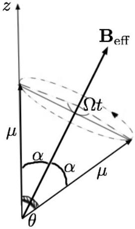
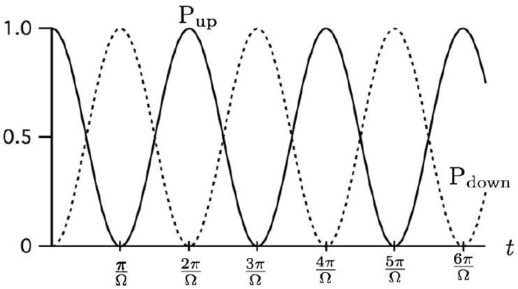

## Theoretical 3: Solution   Physics of Spin

Part A. Larmor Precession

1. From the two equations given in the text, we obtain the relation

$$
\begin{equation*}
\frac { d \boldsymbol { \mu } } { d t } = - \gamma \boldsymbol { \mu } \times \mathbf { B } . \tag{1}
\end{equation*}
$$

Taking the dot product of eq (1). with $\boldsymbol { \mu }$, we can prove that

$$
\begin{align*}
\boldsymbol { \mu } \cdot \frac { d \boldsymbol { \mu } } { d t } & = - \gamma \boldsymbol { \mu } \cdot ( \boldsymbol { \mu } \times \mathbf { B } ) , \\
\frac { d | \boldsymbol { \mu } | ^ { 2 } } { d t } & = 0 , \\
\mu = | \boldsymbol { \mu } | & = \text { const. } \tag{2}
\end{align*}
$$

Taking the dot product of eq. (1) with B, we also prove that

$$
\begin{align*}
\mathbf { B } \cdot \frac { d \boldsymbol { \mu } } { d t } & = - \gamma \mathbf { B } \cdot ( \boldsymbol { \mu } \times \mathbf { B } ) , \\
\mathbf { B } \cdot \frac { d \boldsymbol { \mu } } { d t } & = 0 , \\
\mathbf { B } \cdot \boldsymbol { \mu } & = \text { const. } \tag{3}
\end{align*}
$$

An acute reader will notice that our master equation in (1) is identical to the equation of motion for a charged particle in a magnetic field

$$
\begin{equation*}
\frac { d \mathbf { v } } { d t } = \frac { q } { m } \mathbf { v } \times \mathbf { B } . \tag{4}
\end{equation*}
$$

Hence, the same argument for a charged particle in magnetic field can be applied in this case.

2. For a magnetic moment making an angle of $\phi$ with B,
$$
\begin{align*}
\frac { d \boldsymbol { \mu } } { d t } & = - \gamma \boldsymbol { \mu } \times \mathbf { B } , \\
| \boldsymbol { \mu } | \sin \phi \frac { d \theta } { d t } & = \gamma | \boldsymbol { \mu } | B _ { 0 } \sin \phi , \\
\omega _ { 0 } = \frac { d \theta } { d t } & = \gamma B _ { 0 } . \tag{5}
\end{align*}
$$

Part B. Rotating frame

1. Using the relation given in the text, it is easily shown that
$$
\begin{align*}
\left( \frac { d \boldsymbol { \mu } } { d t } \right) _ { \mathrm { rot } } & = \left( \frac { d \boldsymbol { \mu } } { d t } \right) _ { \mathrm { lab } } - \boldsymbol { \omega } \times \boldsymbol { \mu } \\
& = - \gamma \boldsymbol { \mu } \times \mathbf { B } - \omega \mathbf { k } ^ { \prime } \times \boldsymbol { \mu } \\
& = - \gamma \boldsymbol { \mu } \times \left( \mathbf { B } - \frac { \omega } { \gamma } \mathbf { k } ^ { \prime } \right) \\
& = - \gamma \boldsymbol { \mu } \times \mathbf { B } _ { \mathrm { eff } } . \tag{6}
\end{align*}
$$
Note that $\mathbf { k }$ is equal to $\mathbf { k } ^ { \prime }$ as observed in the rotating frame.

## Theoretical 3: Solution Physics of Spin

2. The new precession frequency as viewed on the rotating frame $S ^ { \prime }$ is
$$
\begin{align*}
\vec { \Delta } & = \left( \omega _ { 0 } - \omega \right) \mathbf { k } ^ { \prime } , \\
\Delta & = \gamma B _ { 0 } - \omega . \tag{7}
\end{align*}
$$
3. Since the magnetic field as viewed in the rotating frame is $\mathbf { B } = B _ { 0 } \mathbf { k } ^ { \prime } + b \mathbf { i } ^ { \prime }$,
$$
\mathbf { B } _ { \mathrm { eff } } = \mathbf { B } - \omega / \gamma \mathbf { k } ^ { \prime } = \left( B _ { 0 } - \frac { \omega } { \gamma } \right) \mathbf { k } ^ { \prime } + b \mathbf { i } ^ { \prime } ,
$$
and
$$
\begin{align*}
\Omega & = \gamma \left| \mathbf { B } _ { \mathrm { eff } } \right| \\
& = \gamma \sqrt { \left( B _ { 0 } - \frac { \omega } { \gamma } \right) ^ { 2 } + b ^ { 2 } } . \tag{8}
\end{align*}
$$
4. In this case, the effective magnetic field becomes
$$
\begin{align*}
\mathbf { B } _ { \text {eff } } & = \mathbf { B } - \omega / \gamma \mathbf { k } ^ { \prime } \\
& = \left( B _ { 0 } - \frac { \omega } { \gamma } \right) \mathbf { k } ^ { \prime } + b \left( \cos 2 \omega t \mathbf { i } ^ { \prime } - \sin 2 \omega t \mathbf { j } ^ { \prime } \right) \tag{9}
\end{align*}
$$
which has a time average of $\overline { \mathbf { B } _ { \text {eff } } } = \left( B _ { 0 } - \frac { \omega } { \gamma } \right) \mathbf { k } ^ { \prime }$.

## Part C. Rabi oscillation

1. The oscillating field can be considered as a superposition of two oppositely rotating field:
$$
2 b \cos \omega _ { 0 } t \mathbf { i } = b \left( \cos \omega _ { 0 } t \mathbf { i } + \sin \omega _ { 0 } t \mathbf { j } \right) + b \left( \cos \omega _ { 0 } t \mathbf { i } - \sin \omega _ { 0 } t \mathbf { j } \right) ,
$$
which gives an effective field of (with $\omega = \omega _ { 0 } = \gamma B _ { 0 }$ ):
$$
\mathbf { B } _ { \mathrm { eff } } = \left( B _ { 0 } - \frac { \omega } { \gamma } \right) \mathbf { k } ^ { \prime } + b \mathbf { i } ^ { \prime } + b \left( \cos 2 \omega _ { 0 } t \mathbf { i } ^ { \prime } - \sin 2 \omega _ { 0 } t \mathbf { j } ^ { \prime } \right) .
$$
Since $\omega _ { 0 } \gg \gamma b$, the rotation of the term $b \left( \cos 2 \omega _ { 0 } t \mathbf { i } ^ { \prime } - \sin 2 \omega _ { 0 } t \mathbf { j } ^ { \prime } \right)$ is so fast compared to the frequency $\gamma b$. This means that we can take the approximation
$$
\begin{equation*}
\mathbf { B } _ { \mathrm { eff } } \approx \left( B _ { 0 } - \frac { \omega } { \gamma } \right) \mathbf { k } ^ { \prime } + b \mathbf { i } ^ { \prime } = b \mathbf { i } ^ { \prime } , \tag{10}
\end{equation*}
$$
where the magnetic moment precesses with frequency $\Omega = \gamma b$.
As $\Omega = \gamma b \ll \omega _ { 0 }$, the magnetic moment does not "feel" the rotating term $b \left( \cos 2 \omega _ { 0 } t \mathbf { i } ^ { \prime } - \sin 2 \omega _ { 0 } t \mathbf { j } ^ { \prime } \right)$ which averaged to zero.

## Theoretical 3: Solution Physics of Spin

2. Since the angle $\alpha$ that $\boldsymbol { \mu }$ makes with $\mathbf { B } _ { \text {eff } }$ stays constant and $\boldsymbol { \mu }$ is initially oriented along the $z$ axis, $\alpha$ is also the angle between $\mathbf { B } _ { \text {eff } }$ and the $z$ axis which is
$$
\begin{equation*}
\tan \alpha = \frac { b } { B _ { 0 } - \frac { \omega } { \gamma } } . \tag{11}
\end{equation*}
$$

From the geometry of the system, we can show that $\left( \cos \theta = \mu _ { z } / \mu \right)$ :
$$
\begin{aligned}
2 \mu \sin \frac { \theta } { 2 } & = 2 \mu \sin \alpha \sin \frac { \Omega t } { 2 } \\
\sin ^ { 2 } \frac { \theta } { 2 } & = \sin ^ { 2 } \alpha \sin ^ { 2 } \frac { \Omega t } { 2 } \\
\frac { 1 - \cos \theta } { 2 } & = \sin ^ { 2 } \alpha \frac { 1 - \cos \Omega t } { 2 } \\
\cos \theta & = 1 - \sin ^ { 2 } \alpha + \sin ^ { 2 } \alpha \cos \Omega t \\
\cos \theta & = \cos ^ { 2 } \alpha + \sin ^ { 2 } \alpha \cos \Omega t
\end{aligned}
$$
So, the projected magnetic moment along the $z$ axis is $\mu _ { z } ( t ) = \mu \cos \theta$ and the magnetization is
$$
\begin{equation*}
M = N \mu _ { z } = N \mu \left( \cos ^ { 2 } \alpha + \sin ^ { 2 } \alpha \cos \Omega t \right) . \tag{12}
\end{equation*}
$$
Note that the magnetization does not depend on the reference frame $S$ or $S ^ { \prime }$ ( $\mu _ { z }$ has the same value viewed in both frames).
Taking $\omega = \omega _ { 0 } = \gamma B _ { 0 }$, the angle $\alpha$ is $90 ^ { 0 }$ and $M = N \mu \cos \Omega t$.
3. From the relations
$$
\begin{aligned}
& P _ { \uparrow } - P _ { \downarrow } = \frac { \mu _ { z } } { \mu } = \cos \theta , \\
& P _ { \uparrow } + P _ { \downarrow } = 1 ,
\end{aligned}
$$

## Theoretical 3: Solution Physics of Spin

we obtain the results ( $\omega = \omega _ { 0 }$ )

$$
\begin{align*}
P _ { \downarrow } & = \frac { 1 - \cos \theta } { 2 } \\
& = \frac { 1 - \cos ^ { 2 } \alpha - \sin ^ { 2 } \alpha \cos \Omega t } { 2 } \\
& = \sin ^ { 2 } \alpha \frac { 1 - \cos \Omega t } { 2 } \\
& = \frac { b ^ { 2 } } { \left( B _ { 0 } - \frac { \omega } { \gamma } \right) ^ { 2 } + b ^ { 2 } } \sin ^ { 2 } \frac { \Omega t } { 2 } \\
& = \sin ^ { 2 } \frac { \Omega t } { 2 } , \tag{13}
\end{align*}
$$

and

$$
\begin{equation*}
P _ { \uparrow } = \frac { b ^ { 2 } } { \left( B _ { 0 } - \frac { \omega } { \gamma } \right) ^ { 2 } + b ^ { 2 } } \cos ^ { 2 } \frac { \Omega t } { 2 } = \cos ^ { 2 } \frac { \Omega t } { 2 } . \tag{14}
\end{equation*}
$$

## Part D. Measurement incompatibility

1. In the $x$ direction, the uncertainty in position due to the screen opening is $\Delta x$. According to the uncertainty principle, the atom momentum uncertainty $\Delta p _ { x }$ is given by
$$
\Delta p _ { x } \approx \frac { \hbar } { \Delta x } ,
$$
which translates into an uncertainty in the $x$ velocity of the atom,
$$
v _ { x } \approx \frac { \hbar } { m \Delta x } .
$$
Consequently, during the time of flight $t$ of the atoms through the device, the uncertainty in the width of the beam will grow by an amount $\delta x$ given by
$$
\delta x = \Delta v _ { x } t \approx \frac { \hbar } { m \Delta x } t .
$$

## Theoretical 3: Solution Physics of Spin

So, the width of the beams is growing linearly in time. Meanwhile, the two beams are separating at a rate determined by the force $F _ { x }$ and the separation between the beams after a time $t$ becomes

$$
d _ { x } = 2 \times \frac { 1 } { 2 } \frac { F _ { x } } { m } t ^ { 2 } = \frac { 1 } { m } \left| \mu _ { x } \right| C t ^ { 2 } .
$$

In order to be able to distinguish which beam a particle belongs to, the separation of the two beams must be greater than the widths of the beams; otherwise the two beams will overlap and it will be impossible to know what the $x$ component of the atom spin is. Thus, the condition must be satisfied is

$$
\begin{align*}
d _ { x } & \gg \delta x , \\
\frac { 1 } { m } \left| \mu _ { x } \right| C t ^ { 2 } & \gg \frac { \hbar } { m \Delta x } t , \\
\frac { 1 } { \hbar } \left| \mu _ { x } \right| \Delta x C t & \gg 1 . \tag{15}
\end{align*}
$$

2. As the atoms pass through the screen, the variation of magnetic field strength across the beam width experienced by the atoms is
$$
\Delta B = \Delta x \frac { d B } { d x } = C \Delta x .
$$
This means the atoms will precess at rates covering a range of values $\Delta \omega$ given by
$$
\Delta \omega = \gamma \Delta B = \frac { \mu _ { z } } { \hbar } \Delta B = \frac { \left| \mu _ { x } \right| } { \hbar } C \Delta x ,
$$
and, if previous condition in measuring $\mu _ { x }$ is satisfied,
$$
\begin{equation*}
\Delta \omega t \gg 1 . \tag{16}
\end{equation*}
$$
In other words, the spread in the angle $\Delta \omega t$ through which the magnetic moments precess is so large that the $z$ component of the spin is completely randomized or the measurement uncertainty is very large.
