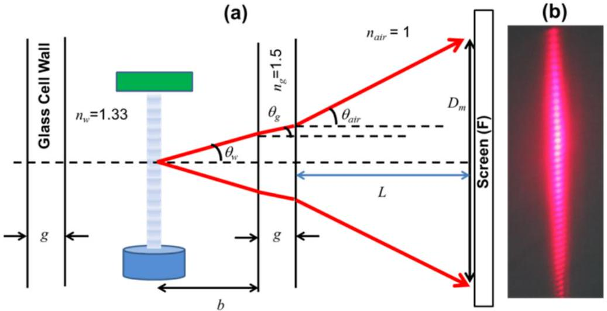
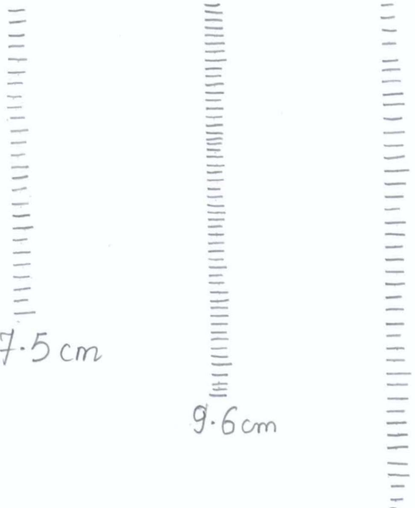
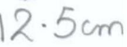
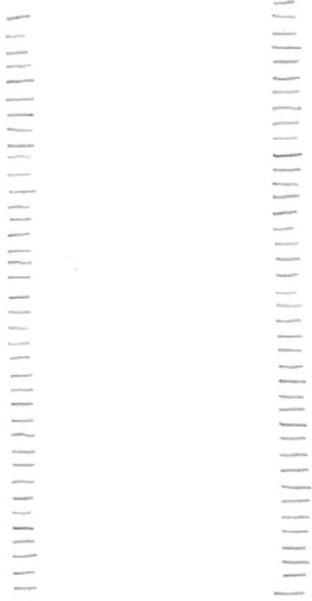
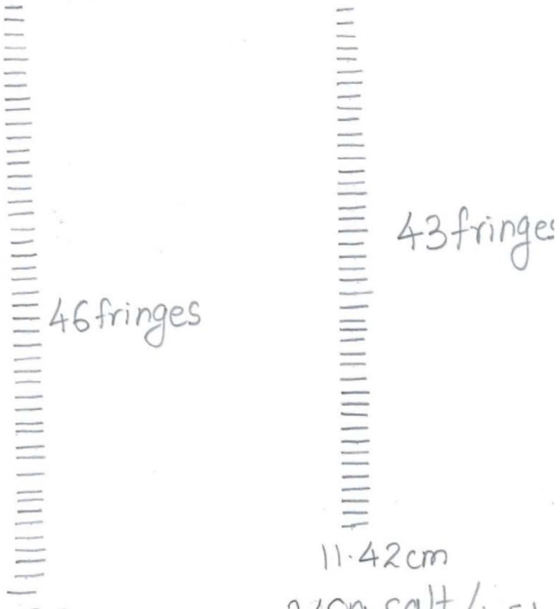
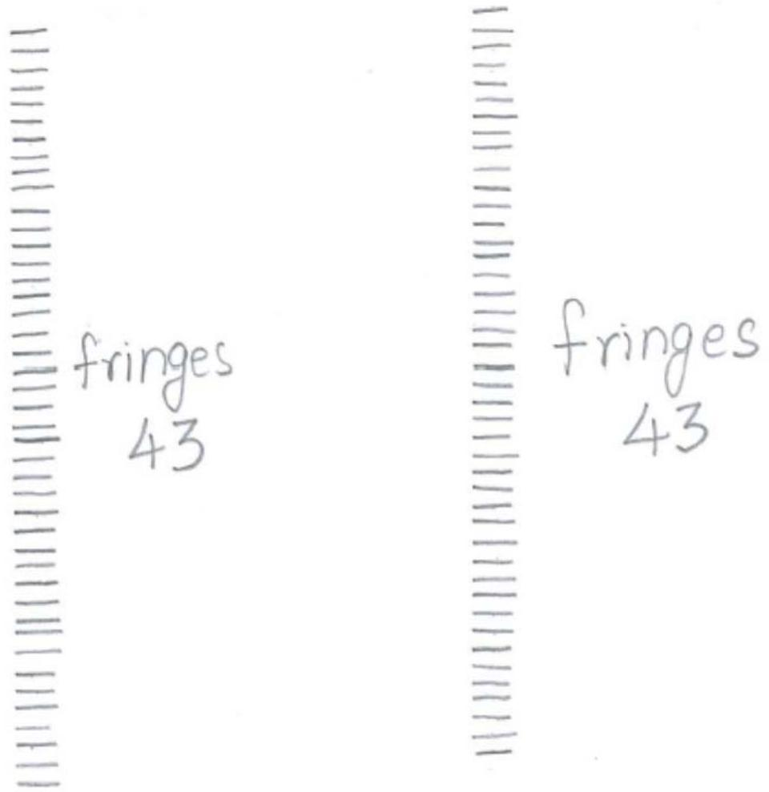
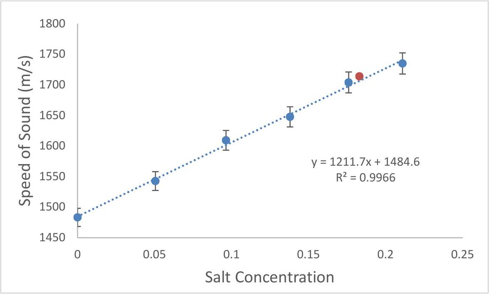
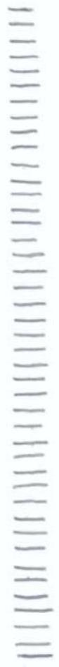
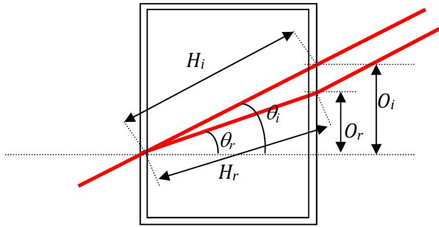
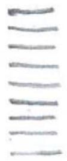

$15 { } ^ { \text {TH } }$ ASIAN PHYSICS OLYMPIAD
11-18 MAY 2014, SINGAPORE

Experimental Competition
May 15, 2014
0830-1330 hrs

Marking Rubric

| Country: | Sample Solution | Student Code: | Sample Solution |
| :--- | :--- | :--- | :--- |

Experiment A:

| A1. | In the space below, derive an equation for $\lambda _ { s }$ in terms of ( $b , g$, $m , n _ { w } , n _ { g } , L , \lambda _ { \text {air } }$, and $D _ { m }$ ) under small angle approximation condition.   Given, $\begin{equation*} d \sin \theta _ { w } = i \lambda _ { w } \tag{1} \end{equation*}$   Also we know, $\begin{equation*} n _ { w } \lambda _ { w } = n _ { \text {air } } \lambda _ { \text {air } } \tag{2} \end{equation*}$   Raman and Nath condition: $\begin{equation*} d = \lambda _ { s } \tag{3} \end{equation*}$   Snell's Law: water to glass $\begin{equation*} \frac { n _ { g } } { n _ { w } } = \frac { \sin \theta _ { w } } { \sin \theta _ { g } } = \frac { \lambda _ { w } } { \lambda _ { g } } \tag{4} \end{equation*}$   Snell's Law: glass to air $\begin{equation*} \frac { n _ { g } } { n _ { \text {air } } } = \frac { \sin \theta _ { \text {air } } } { \sin \theta _ { g } } = \frac { \lambda _ { \text {air } } } { \lambda _ { g } } \tag{5} \end{equation*}$   From above Figure $\begin{equation*} D _ { m } = 2 \left( b \tan \theta _ { w } + g \tan \theta _ { g } + \right. \tag{6} \end{equation*}$   $L \tan \theta _ { \text {air } }$ )   Using small angle approximation: $\begin{equation*} \tan \theta _ { w } = \sin \theta _ { w } ; \tan \theta _ { g } = \sin \theta _ { g } ; \tan \theta _ { \text {air } } = \sin \theta _ { \text {air } } \tag{7} \end{equation*}$   Fron Eqns (6) and (7) $D _ { m } = 2 \left( b \sin \theta _ { w } + g \sin \theta _ { g } + L \sin \theta _ { \text {air } } \right)$   Writing $\sin \theta _ { g }$ and $\sin \theta _ { \text {air } }$ in terms of $\sin \theta _ { w }$ from equations (4) and (5) $D _ { m } = 2 \left( b + g \frac { n _ { w } } { n _ { g } } + L \frac { n _ { w } } { n _ { \text {air } } } \right) \sin \theta _ { w }$   Substituting $\sin \theta _ { w }$ from equations (1), (2) and (3) and counting the total number of fringes $m$ in distance $D _ { m }$ on the screen $\begin{equation*} D _ { m } = \left( b + g \frac { n _ { w } } { n _ { g } } + L \frac { n _ { w } } { n _ { \text {air } } } \right) ( m - 1 ) \frac { n _ { \text {air } } } { n _ { w } } \frac { \lambda _ { \text {air } } } { \lambda _ { s } } \tag{9} \end{equation*}$   Note that $m = 2 i + 1$   Rearranging the terms to get $\lambda _ { s }$ $\begin{gather*} \lambda _ { s } = \left( \frac { b } { n _ { w } } + \frac { g } { n _ { g } } + \frac { L } { n _ { \text {air } } } \right) ( m - 1 ) \frac { n _ { \text {air } } \lambda _ { \text {air } } } { D _ { m } }  \tag{10}\\ A = \left( \frac { b } { n _ { w } } + \frac { g } { n _ { g } } + \frac { L } { n _ { \text {air } } } \right) \tag{11} \end{gather*}$ | Total = 1.5   If final answer is the same, then get full mark   0.1 for Eqn (2)   0.1 for Eqn (4)   0.1 for Eqn (5)   0.4 for Writing the correction Eqn (6)   0.1 for Small angle approximation   0.2 for expressing all angles to $\theta _ { w }$   0.1 for relating $i$ to $m$.   0.3 for $\lambda _ { s }$ expression   0.1 for A   Some examples of   Some examples of |
| :--- | :--- | :--- |

| Country: | Sample Solution | Student Code: | Sample Solution |
| :--- | :--- | :--- | :--- |

|  | Note If they ignore glass, merge glass and water (-0.3 mark, $\max \operatorname { mark } = 1.2$ ) $\begin{equation*} A = \left( \frac { b + g } { n _ { w } } + \frac { L } { n _ { \text {air } } } \right) \tag{11a} \end{equation*}$ |  |
| :--- | :--- | :--- |
|  | Note If they ignore glass and water and everything considered as air ( -1.0 mark, max mark $= \mathbf { 0 . 5 }$ ) $\begin{equation*} \lambda _ { s } = ( b + g + L ) \tag{11b} \end{equation*}$ |  |

| Country: | Sample Solution | Student Code: | Sample Solution |
| :--- | :--- | :--- | :--- |

| A2. | Attach this Answer Sheet to the Screen (F) and mark the fringes in the space below. | Total : 2.5   1.6 for Patterns   1.6 for $\geq 3$ patterns   1.4 for 2 patterns   1.2 for 1 pattern   Note -   The maximum marks will be reduced to 50\% of the marks mentioned above if the number of fringes marked is less than 10 on average; and 25\% for less than 5 marked fringes.   0.9 for complete table   -0.1 each uncertainty missing   -0.1 each unit missing   -0.1 $T$ missing   -0.2 $m$ missing   $- \mathbf { 0 . 2 } D _ { m }$ missing   Note: the marks allocated for the table will be given if the values are implicitly observed in the results |
| :--- | :--- | :--- |
|  |  |  |

| Country: | Sample Solution | Student Code: | Sample Solution |
| :--- | :--- | :--- | :--- |

| A3. | Measure and record all relevant parameters in the space below and calculate the wavelength of sound, $\lambda _ { s }$, in mineral water.   $n _ { w } =$ refractive index of water $= 1.333 \pm 0.007 n _ { \text {air } } =$ refractive index of air $= 1.000 \pm 0.0003 n _ { g } =$ refractive index of glass $= 1.50 \pm 0.005 \lambda _ { \text {air } } =$ the wavelength of laser light in air $= 660 \pm 3 n m$   Thickness of the wall of glass cell: $g = 5.05 \pm 0.05 m m$ $b ( c m )$ ± 0.2cm $L ( c m )$ ±0.5cm $D ( c m )$ ± 0.05cm $m$ $\lambda _ { s } ( m ) \times 10 ^ { - 4 }$   Pattern 1 5 368.5 7.5 26 8.20   Pattern 2 5.5 235 9.6 51 8.23   Pattern 3 7.1 384.6 12.5 41 8.24         $\begin{gathered} \lambda _ { s } = \frac { ( 8.20 + 8.23 + 8.24 ) \times 10 ^ { - 4 } } { 3 } \mathrm {~m} = 8.22 \times 10 ^ { - 4 } \mathrm {~m} \\ \hline \lambda _ { s } = 8.22 \times 10 ^ { - 4 } \mathrm {~m} \end{gathered}$ | Total : 1.0   0.1 Right value of g (between 4.9 to 5.1mm)   0.4 Tabulation of b, L   0.5 for value of $\lambda _ { s }$   Note - $\lambda _ { s }$ is Temperature dependent   (0.5: within 5\% of value of $\lambda _ { s }$ at temperature noted by Organizing Committee in Exam Hall)   (0.3: for outside 5\% but within 10\% of value of $\lambda _ { s }$ at noted temperature)   (0.1: for outside 10\% but within 20\% of value of $\lambda _ { s }$ at noted temperature)   0 otherwise   Note: If $\lambda _ { s }$ is wrong due to totally wrong $A$, then team leader check for value from correct formula and award from above guidelines for $\lambda _ { s }$, but with a further deduction of 0.1 mark.   -0.1 each uncertainty missing -0.1 each unit missing   -0.1 $b$ missing -0.1 $L$ missing -0.2 for $L < 0.5 \mathrm {~m}$ |
| :--- | :--- | :--- |

| Country: | Sample Solution | Student Code: | Sample Solution |
| :--- | :--- | :--- | :--- |

| A4. | Calculate and record the frequency of ultrasonic waves, $f _ { s }$, in mineral water.   From the graph, Speed of ultrasound in water at 22 °C is 1484± $4 \mathrm {~m} \mathrm {~s} ^ { - 1 }$   Frequency of ultrasound: $f _ { s } = \frac { v _ { s } } { \lambda _ { s } } = \frac { 1484 } { 8.22 \times 10 ^ { - 4 } } = 1.80 \mathrm { MHz }$ $f _ { s } = 1.80 \mathrm { MHz }$   If $\lambda _ { \mathrm { s } }$ is wrong due to totally wrong A then subtract additional 0.1 from above guidelines for $\lambda _ { \mathrm { s } }$.   NOTE: Temp in Exam Hall was 27 °C for water in Glass Cell under experimental conditions with precaution taken. | Total: 0.5   0.2 Right value of speed of sound (@ the reported T)   0.1 for $f _ { s } = \frac { v _ { s } } { \lambda _ { s } }$   0.1 for unit   0.1 for correct answer (full   0.1 for value within 5\% of 1.786MHz; 0 otherwise)   Note: Measured value of frequency of the piezoelectric transducers is 1.786 MHz. |
| :--- | :--- | :--- |

| Country: | Sample Solution | Student Code: | Sample Solution |
| :--- | :--- | :--- | :--- |

| A5. | Carry out an error analysis to estimate the uncertainty, $\Delta f _ { s }$, in the frequency of ultrasonic wave.   Check that small angle is appropriate $\theta \sim \frac { D _ { m } } { L } \sim \frac { 9.6 } { 235 }$. So the percentage difference between $\tan \theta$ and $\sin \theta$ is ~0.02\%.   From equation (10), relative error in $\lambda _ { s }$ can be written as $\frac { \Delta \lambda _ { s } } { \lambda _ { s } } \approx \sqrt { \frac { \left( \frac { \Delta b } { n _ { w } } \right) ^ { 2 } + \left( \frac { \Delta g } { n _ { g } } \right) ^ { 2 } + ( \Delta L ) ^ { 2 } } { \left( \frac { b } { n _ { w } } + \frac { g } { n _ { g } } + \frac { L } { n _ { \text {air } } } \right) ^ { 2 } } + \left( \frac { \Delta D _ { m } } { D _ { m } } \right) ^ { 2 } }$ $\frac { \Delta \lambda _ { s } } { \lambda _ { s } } \approx \sqrt { \frac { \left( \frac { 0.1 } { 1.333 } \right) ^ { 2 } + \left( \frac { 0.005 } { 1.5 } \right) ^ { 2 } + ( 0.5 ) ^ { 2 } } { \left( \frac { b } { n _ { w } } + \frac { g } { n _ { g } } + \frac { L } { n _ { \text {air } } } \right) ^ { 2 } } + \left( \frac { 0.05 } { D _ { m } } \right) ^ { 2 } }$ $\begin{array} { \| l \| l \| l \| l \| l \| l \| l \| }  \hline & \begin{array} { l }  b ( \mathrm {~cm} ) \\ \pm 0.1 \mathrm {~cm} \end{array} & \begin{array} { l }  L ( \mathrm {~cm} ) \\ \pm 0.5 \mathrm {~cm} \end{array} & \begin{array} { l }  D _ { m } ( \mathrm {~cm} ) \\ \pm 0.05 \mathrm {~cm} \end{array} & m & \begin{array} { l }  \lambda _ { s } ( \mathrm {~m} ) \\ \times 10 ^ { - 4 } \end{array} & \frac { \Delta \lambda _ { s } } { \lambda _ { s } } \\ \hline \begin{array} { l }  \text { Pattern } \\ 1 \end{array} & 5.0 & 368.5 & 7.5 & 26 & 8.20 & 0.0068 \\ \hline \begin{array} { l }  \text { Pattern } \\ 2 \end{array} & 5.5 & 235 & 9.6 & 51 & 8.23 & 0.0056 \\ \hline \begin{array} { l }  \text { Pattern } \\ 3 \end{array} & 7.1 & 384.6 & 12.5 & 41 & 8.24 & 0.0042 \\ \hline \end{array}$ $\left( \frac { \Delta \lambda _ { s } } { \lambda _ { s } } \right) _ { \text {mean } } = 0.0055$ $\frac { \Delta f _ { s } } { f _ { s } } = \sqrt { \left( \frac { \Delta \lambda _ { s } } { \lambda _ { s } } \right) ^ { 2 } + \left( \frac { \Delta v _ { s } } { v _ { s } } \right) ^ { 2 } } = \sqrt { 0.0055 ^ { 2 } + \left( \frac { 2 } { 1484 } \right) ^ { 2 } } = 0.006$ $\begin{array} { \| l \| l \| }  \hline \Delta f _ { s } = & 0.011 \mathrm { MHz } \\ \hline \end{array}$   Alternative   If students get three or more patterns and calculate the standard error using $\text { standard error } = \frac { \sigma } { \sqrt { N - 1 } }$ | Total: 1.0   0.8 Expression for $\frac { \Delta f _ { s } } { f _ { s } }$ everything combined   (0.6 for $\frac { \Delta \lambda _ { s } } { \lambda _ { s } }$   0.2 for $\frac { \Delta f _ { s } } { f _ { s } }$ by combining   $\frac { \Delta \lambda _ { s } } { \lambda _ { s } }$ and $\frac { \Delta v _ { s } } { v _ { s } }$ )   0.2 for the right numerical value.   (0.2 : 0.01 MHz-0.09   MHz)   (0.1 : (0.005 to <0.01)   MHz and (>0.09 to 0.18)   MHz   0 otherwise   Note: if students just take one pattern but do this detail error analysis, get full 1.0 mark for error analysis if the analysis is done correctly.   Alternative (Max 1.0)   0.4 for the correct expression for the standard error.   0.4 If they do at least 6 times and then go for standard error   (0.2 If they do at least three times and then go for standard error)   0.2 marks for numerical value. (Further penalty as per rules/range specified above) |
| :--- | :--- | :--- |

| Country: | Sample Solution | Student Code: | Sample Solution |
| :--- | :--- | :--- | :--- |

Experiment B

| B1. | Write down the equation for $\lambda _ { s }$. $\begin{equation*} \lambda _ { s } = \frac { 2 p } { m _ { B } - 1 } \tag{12} \end{equation*}$ $m _ { B }$ represents the number of fringes counted corresponding to $D _ { \boldsymbol { B } }$. $\begin{equation*} M = \frac { D _ { B } } { p } = \frac { \left[ \frac { \left( S _ { 1 } - f _ { L } \right) } { n _ { \text {air } } } + \frac { 2 g } { n _ { g } } + \frac { ( a + b ) } { n _ { w } } + \frac { S _ { 2 } } { n _ { \text {air } } } \right] } { \left[ \frac { \left( S _ { 1 } - f _ { L } \right) } { n _ { \text {air } } } + \frac { g } { n _ { g } } + \frac { a } { n _ { w } } \right] } \tag{3} \end{equation*}$ $\therefore p = D _ { B } \frac { \left[ \frac { \left( S _ { 1 } - f _ { L } \right) } { n _ { \text {air } } } + \frac { g } { n _ { g } } + \frac { a } { n _ { w } } \right] } { \left[ \frac { \left( S _ { 1 } - f _ { L } \right) } { n _ { \text {air } } } + \frac { 2 g } { n _ { g } } + \frac { ( a + b ) } { n _ { w } } + \frac { S _ { 2 } } { n _ { \text {air } } } \right] }$ $\therefore \lambda _ { s } = \frac { 2 D _ { B } } { \left( m _ { B } - 1 \right) } \frac { \left[ \frac { \left( S _ { 1 } - f _ { L } \right) } { n _ { \text {air } } } + \frac { g } { n _ { g } } + \frac { a } { n _ { w } } \right] } { \left[ \frac { \left( S _ { 1 } - f _ { L } \right) } { n _ { \text {air } } } + \frac { 2 g } { n _ { g } } + \frac { ( a + b ) } { n _ { w } } + \frac { S _ { 2 } } { n _ { \text {air } } } \right] }$ | Total: 1.0   0.2 for using $M$ for getting $p$   0.8 for equation (12)   -0.8 for missing the factor 2 i.e. for not realizing that for standing wave the spacing between bright/dark spaces is $\lambda _ { s } / 2$   -0.2 for using $m _ { B }$ instead of $m _ { B } - 1$ (no deduction if the results show that $m _ { B } =$ number of intervals) |
| :--- | :--- | :--- |

| Country： | Sample Solution | Student Code： | Sample Solution |
| :--- | :--- | :--- | :--- |

| B2． | Attach this Answer Sheet to the Screen（F）and mark the projected standing wave pattern in the space below．－ ニ －   －  一   －  二   －  －   －  －   － 4．12cm －   －  －   －  －   －  －   －  －   －  －   9．61cm  －     11．8cm | Total ： 2.0   1.4 for Patterns   $\geq 3$ patterns get 1.4   2 patterns get 1.2   1 pattern gets 1.0   Full marks for more than   2 dark／bright region marked．   0.6 for the complete table   －0．1 each uncertainty missing   －0．1 each unit missing   －0．1 $T$ missing   －0．1 $m _ { B }$ missing   $- \mathbf { 0 . 1 } D _ { B }$ missing   Note－the marks allocated for the table will be given if the values are implicitly observed in the results |
| :--- | :--- | :--- |
|  |  |  |

| B3． | Measure and record all relevant parameters in the space below | Total： 1.5 |
| :--- | :--- | :--- |

| Country: | Sample Solution | Student Code: | Sample Solution |
| :--- | :--- | :--- | :--- |

|  | and calculate the wavelength of sound, $\lambda _ { s }$, in mineral water. Pattern 1 Pattern 2 Pattern 3    $a$ (cm) 5.2 5.5 3.5 $\Delta a = 0.1 c m$   $a + b ( c m )$ 11.16 11.16 12.00 $\Delta ( a + b ) = 0.05 c m$   $g$ (cm) 0.5 0.5 0.5 $\Delta g = 0.05 c m$   $S _ { 1 } ( c m )$ 12.7 12.7 20.5 $\Delta S _ { 1 } = 0.1 c m$   $S _ { 2 } ( c m )$ 257.4 92.2 208.5 $\Delta S _ { 2 } = 0.1$ to 0.5cm depending on experiment   $m _ { B }$ 11 12 22    $D _ { B } ( c m )$ 9.61 4.12 11.80 $\Delta D _ { B } = \pm 0.05$   M 22.96 8.95 12.66    $p$ (cm) 0.419 0.46 0.932    $\lambda _ { s } \left( \times 10 ^ { - 4 } \mathrm {~m} \right)$ 8.37 8.37 8.88    $f _ { L } = 5.0 \mathrm {~cm}$$\lambda _ { s , \text { mean } } =$ $8.54 \times 10 ^ { - 4 } \mathrm {~m}$ | 0.1 Right value of $g$ (between 4.9 to 5.1mm)   0.9 Tabulation of $a , a + b$ or b, $S _ { 1 } , S _ { 2 }$   0.5 for value of $\lambda _ { s }$   Note - $\lambda _ { s }$ is Temperature dependent   (0.5: within 5\% of value of $\lambda _ { s }$ at temperature noted by Organizing Committee in Exam Hall)   (0.3: for outside 5\% but within 10\% of value of $\lambda _ { s }$ at noted temperature)   (0.1: for outside 10\% but within 20\% of value of $\lambda _ { s }$ at noted temperature)   0 otherwise   Note: If $\lambda _ { s }$ is wrong due to totally wrong $A$, then team leader check for value from correct formula and award from above guidelines for $\lambda _ { s }$, but with a further deduction of 0.1 mark.   -0.1 each uncertainty missing -0.1 each unit missing ) up to maximum penalty of 0.5 marks   -0.1 $a$ or $b$ missing -0.1 $S _ { 1 }$ or $S _ { 2 }$ missing -0.1 for $S _ { 2 } < 0.3 \mathrm {~m}$ |
| :--- | :--- | :--- |

| Country: | Sample Solution | Student Code: | Sample Solution |
| :--- | :--- | :--- | :--- |

| B4. | Calculate and record the frequency of ultrasonic waves, $f _ { s }$, in mineral water.   Frequency of ultrasound: $f _ { s } = \frac { v _ { s } } { \lambda _ { s } } = \frac { 1484 } { 8.54 \times 10 ^ { - 4 } } = 1.74 \mathrm { MHz }$ $\begin{array} { \| c \| l \| }  \hline f _ { s } = & 1.74 \mathrm { MHz } \\ \hline \end{array}$ | Total 0.5   0.1 for $f _ { s } = \frac { v _ { s } } { \lambda _ { s } }$   0.1 for unit   0.3 for correct answer (full 0.3 for value within 5\% of 1.786MHz; 0.2 for value outside 5\% but within 10\% of 1.786MHz; 0 otherwise)   Note: Measured value of frequency of the piezoelectric transducers is 1.786 MHz. |
| :--- | :--- | :--- |

| Country: | Sample Solution | Student Code: | Sample Solution |
| :--- | :--- | :--- | :--- |

| B5. | Carry out an error analysis to estimate the uncertainty, $\Delta f _ { s }$, in frequency of ultrasonic wave. $\frac { \Delta \lambda _ { s } } { \lambda _ { s } } \approx \sqrt { \left( \frac { \left( \frac { \Delta D _ { B } } { D _ { B } } \right) ^ { 2 } + \left( \frac { \left( \Delta S _ { 1 } \right) ^ { 2 } + \left( \frac { \Delta g } { n _ { g } } \right) ^ { 2 } + \left( \frac { \Delta a } { n _ { w } } \right) ^ { 2 } } { \left( S _ { 1 } - f _ { L } + \frac { g } { n _ { g } } + \frac { a } { n _ { w } } \right) ^ { 2 } } \right) + } { \left( \frac { \left( \Delta S _ { 1 } \right) ^ { 2 } + \left( \frac { 2 \Delta g } { n _ { g } } \right) ^ { 2 } + \left( \frac { \Delta ( \mathrm { a } + \mathrm { b } ) } { n _ { w } } \right) ^ { 2 } + \left( \Delta S _ { 2 } \right) ^ { 2 } } { \left( S _ { 1 } - f _ { L } + S _ { 2 } + \frac { 2 g } { n _ { g } } + \frac { a + b } { n _ { w } } \right) ^ { 2 } } \right. } \right) }$ Pattern 1 Pattern 2 Pattern 3    $a$ (cm) 5.2 5.5 3.5 $\Delta a = 0.1 c m$   $a + b ( c m )$ 11.16 11.16 12.00 $\begin{aligned} & \Delta ( a + b ) = 0.05 \\ & c m \end{aligned}$   g(cm) 0.5 0.5 0.5 $\Delta g = 0.05 c m$   $S _ { l } ( c m )$ 12.7 12.7 20.5 $\Delta S _ { 1 } = 0.1 c m$   $S _ { 2 } ( c m )$ 257.4 92.2 208.5 $\Delta S _ { 2 } = 0.5 c m$   $m _ { B }$ 11 12 22    $D _ { B } ( c m )$ 9.61 4.12 11.80 $\Delta D _ { B } = \pm 0.05$   $M$ 22.96 8.95 12.66    $p$ (cm) 0.419 0.46 0.932    $\lambda _ { s } \left( \times 10 ^ { - 4 } \mathrm {~m} \right)$ 8.37 8.37 8.88    $\Delta \lambda _ { s } / \lambda _ { s }$ 0.012 0.016 0.008    $f _ { L } = 5.0 \mathrm {~cm}$ $\left( \frac { \Delta \lambda _ { s } } { \lambda _ { s } } \right) _ { \text {mean } } = 0.012$ $\frac { \Delta f _ { s } } { f _ { s } } = \sqrt { \left( \frac { \Delta \lambda _ { s } } { \lambda _ { s } } \right) ^ { 2 } + \left( \frac { \Delta v _ { s } } { v _ { s } } \right) ^ { 2 } } = \sqrt { 0.012 ^ { 2 } + \left( \frac { 4 } { 1484 } \right) ^ { 2 } } = 0.012$ $\Delta f _ { s } = 0.022 \mathrm { MHz }$ | Total: 1.0   0.8 Expression for $\frac { \Delta f _ { s } } { f _ { s } }$ everything combined (0.6 for $\frac { \Delta \lambda _ { s } } { \lambda _ { s } }$ 0.2 for $\frac { \Delta f _ { s } } { f _ { s } }$ by combining $\frac { \Delta \lambda _ { s } } { \lambda _ { s } }$ and $\frac { \Delta v _ { s } } { v _ { s } }$ )   0.2 for the right numerical value.   ( $0.2 ~ : ~ 0.01 \mathrm { MHz } - 0.09 \mathrm { MHz }$ )   (0.1 : (0.005 to <0.01) MHz and (>0.09 to 0.18) MHz   0 otherwise   Note: if students just take one pattern but do this detail error analysis, get full 1.0 mark for error analysis if the analysis is done correctly.   Alternative (Max 1.0)   0.4 for the correct expression for the standard error.   0.4 If they do at least 6 times and then go for standard error   (0.2 If they do at least three times and then go for standard error)   0.2 marks for numerical value. (Further penalty as per rules/range specified above) |
| :--- | :--- | :--- |

| Country: | Sample Solution | Student Code: | Sample Solution |
| :--- | :--- | :--- | :--- |

Experiment C

| C1. | Attach this Answer Sheet to the Screen (F) and mark the observed patterns in the space below.   Label each recorded pattern with the corresponding salt concentration. Do not forget to note down the relevant experimental parameters, in Answer Sheet C2 on page 10, needed for calculations.   11.63cm   12.5 cm 40 fringes | Total: 1.0   $\geq 5$ different Salt Conc. get 1.0 4 Conc. gets 0.8 3 Conc. gets 0.6 2 Conc. get 0.4 1 Conc. gets 0.2   Note Above numbers exclude 0 concentration pattern which may be obtained from given graph   Note - Not penalized for number of fringes |
| :--- | :--- | :--- |
|  |  |  |

| Country: | Sample Solution | Student Code: | Sample Solution |
| :--- | :--- | :--- | :--- |

| C1. | Attach this Answer Sheet to the Screen (F) and mark the observed patterns in the space below.   Label each recorded pattern with the corresponding salt concentration. Do not forget to note down the relevant experimental parameters, in Answer Sheet C2 on page 10, needed for calculations.   12.86cm   160 g salt/ 1.   1.5L   water | cont |
| :--- | :--- | :--- |

| Country: | Sample Solution | Student Code: | Sample Solution |
| :--- | :--- | :--- | :--- |

| C1. | Attach this Answer Sheet to the Screen (F) and mark the observed patterns in the space below.   Label each recorded pattern with the corresponding salt concentration. Do not forget to note down the relevant experimental parameters, in Answer Sheet C2 on page 10, needed for calculations.   11.1 cm   11 cm   320 g salt/   400 g salt/   1.5Lwater   1.5L water |  |
| :--- | :--- | :--- |

| Country: | Sample Solution | Student Code: | Sample Solution |
| :--- | :--- | :--- | :--- |

| C2. | Measure and record all relevant parameters in the table below and calculate the speed of sound, $v _ { s }$, in each of the known salt concentration.Salt $( g )$ in $1.5 L$ of water $\pm 0.1 g$ 0.0 80.0 160.0 240.0 320.0 400.0   $C _ { s }$ Salt Conc. ±1\% 0 0.0506 0.0964 0.138 0.176 0.211   Temper ature $\pm 0.5 ^ { \circ } \mathrm { C }$ 22 22 22 22 22 22   $b ( c m ) \pm 0.1 c m$ 7.1 6.8 8.4 7.6 7 8.9   $L ( \mathrm {~cm} )$ 375.6 381.8 380.5 371.1 373.5 375.5   $D _ { m } ( c m ) \pm 0.05 c m$ 12.52 11.63 12.86 11.42 11.1 11   $m$ 42 40 46 43 43 43   $\lambda _ { s } ( m ) \times 10 ^ { - 4 }$ 8.24 8.57 8.94 9.15 9.47 9.64   Speed of Sound in salt solution (m/s) 1483 1543 1609 1647 1704 1735 | Total : 2.0   1.0 for Salt Conc. Variation   Full 1.0 marks - if the salt conc. Ranges from 0 to 0.2 and above is covered.   Full 0.7 marks - if salt conc. from 0 to (0.1-<0.2) is covered.   Only 0.4 marks - if salt conc. from 0 to <0.1 is covered.   Note - Data points should spread well with at least three well separated points with difference of at least 50 g per 1.5 liters. If data does not follow above mentioned rule deduct 0.3 marks.   1.0 for value of $\boldsymbol { v } _ { \boldsymbol { s } }$ The values of speed of sound is expected to follow the equation $v _ { s } = 1187 * C _ { s } + v _ { s T }$ Where Cs is Salt Conc and $v _ { S T }$ is the speed of sound in mineral water (without salt) at temperature T.   At 22 °C $v _ { S T } = 1484 \mathrm {~m} / \mathrm { s }$   (0.2 for each value of $v _ { s }$ within 5\% of |
| :--- | :--- | :--- |

| Country: | Sample Solution | Student Code: | Sample Solution |
| :--- | :--- | :--- | :--- |

|  |  | expected value at the temperature noted by Organizing Committee)   (0.1 for each value of $v _ { s }$ outside 5\% but within 10\% of expected value)   0 otherwise   Maximum of 1.0 marks for $v _ { s }$ |
| :--- | :--- | :--- |

| Country: | Sample Solution | Student Code: | Sample Solution |
| :--- | :--- | :--- | :--- |

| C3 | Plot the speed of sound in solution against the salt concentration of the solution. | Total: 1.0   0.2 for Axes Labels   0.1 for Axes Units   0.5 for plotting data points correctly   0.2 for plotting error bars |
| :--- | :--- | :--- |

| Country: | Sample Solution | Student Code: | Sample Solution |
| :--- | :--- | :--- | :--- |

| C4 | Attach this Answer Sheet to the Screen (F) and mark the observed patterns in the space below for unknown salt concentration solution.   Note down the temperature of the solution and all other relevant experimental parameters needed for calculation of the speed of sound in this solution.   11.1 cm$b ( c m ) \pm 0.1 c m$ $L ( c m ) \pm 0.1 c m$ $D _ { m } ( c m )$ ± 0.05cm $m$ $\lambda _ { s } ( m ) \times 10 ^ { - 4 }$ Speed of Sound in salt solution (m/s)   8.5 374.7 11.1 43 9.61 1714   $\mathrm { T } = ( 22 \pm 0.5 ) ^ { \circ } \mathrm { C }$$v _ { s }$ in unknown solution = 1714 m/s | Total: 0.8   0.2 for Pattern   0.4 for the complete table   -0.1 each uncertainty missing -0.1 each unit missing -0.1 $T$ missing   0.2 for correct value of $v _ { s }$   (0.2 for each value of $v _ { s }$ within 5\% of expected value)   (0.1 for each value of $v _ { s }$ outside 5\% but within 10\% of expected value)   (0 otherwise)   Note the marks allocated for the table will be given if the values are implicitly observed in the results |
| :--- | :--- | :--- |

| Country: | Sample Solution | Student Code: | Sample Solution |
| :--- | :--- | :--- | :--- |

| C5. | Determine the salt concentration in the unknown solution.Concentration of Salt in Unknown Solution = 0.19 ± 0.01   NOTE: The unknown solution has 225 g of salt dissolved per one liter of mineral water i.e. $C _ { s } = 0.184$ | Total :0.2   0.2 for correct value of concentration   (0.2 for value within 5\% of expected value)   (0.1 for value outside 5\% but within 10\% of expected value)   (0 otherwise)   -0.1 uncertainty missing |
| :--- | :--- | :--- |

| Country: | Sample Solution | Student Code: | Sample Solution |
| :--- | :--- | :--- | :--- |

Experiment D:

| D1. | Draw a labeled sketch of the experiment you have designed for calculation of the refractive index of the corn-syrup. Use the space below relevant parameters needed and calculate the refractive index of the corn-syrup. $\frac { n _ { \text {corn-syrup } } } { n _ { \text {air } } } = \frac { \sin \theta _ { i } } { \sin \theta _ { r } } = \frac { O _ { i } } { O _ { r } } \frac { H _ { r } } { H _ { i } }$ $\frac { n _ { \text {corn-syrup } } } { n _ { \text {air } } } = \frac { \sin 22.04 } { \sin 15.25 } = 1.42$   Assuming glass can be ignored. $\begin{array} { \| c \| c \| }  \hline n _ { \text {corn-syrup } } = & 1.42 \\ \hline \end{array}$ | Total: 1.5   0.5 for appropriate and properly labeled diagram   0.5 for correct expressions related to the setup used   0.5 for calculation   (full 0.5 for value between 1.38-1.48)   (0.3 for value between 1.34-1.38 or between 1.48-1.55)   0 for outside above mentioned range |
| :--- | :--- | :--- |

| Country: | Sample Solution | Student Code: | Sample Solution |
| :--- | :--- | :--- | :--- |

| D2. | Attach this Answer Sheet to the Screen (F) and mark diffraction patterns in the space below for corn-syrup.   Note down the temperature of the corn-syrup and all other relevant experimental parameters needed to calculate the speed of sound in this solution.   9 fringes   1.85cm   Corn Syrup$b ( c m ) \pm 0.1 c m$ $L ( c m ) \pm 0.1 \mathrm {~cm}$ $D ( \mathrm {~cm} )$ ± 0.05cm $m$ $\lambda _ { s } ( m ) \times 10 ^ { - 4 }$ Speed of Sound (m/s)   8.9 360 1.85 9 10.47 1885$v _ { s }$ in corn-syrup = 1885 (m/s) | Total: 1.0   0.4 for pattern   0.4 for tabulation of relevant parameters.   0.2 calculation of $v _ { s }$ in corn syrup   (0.2 for each value of $v _ { s }$ within 5\% of expected value)   (0.1 for each value of $v _ { s }$ outside 5\% but within 10\% of expected value)   (0 otherwise) |
| :--- | :--- | :--- |
