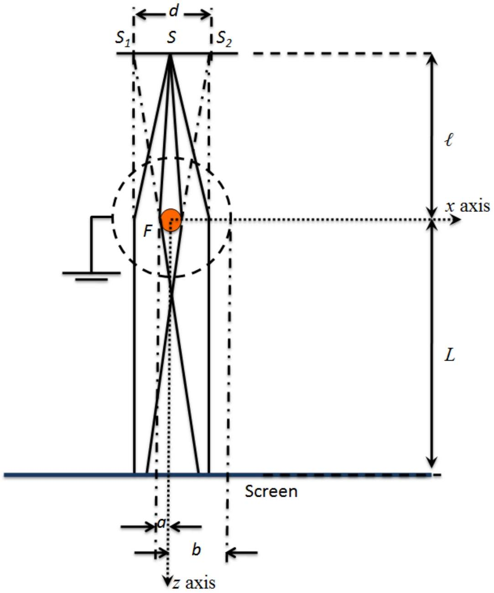

Question 2

The two-slit electron interference experiment was first performed by Möllenstedt et al, MerliMissiroli and Pozzi in 1974 and Tonomura et al in 1989. In the two-slit electron interference experiment, a monochromatic electron point source emits particles at $S$ that first passes through an electron "biprism" before impinging on an observational plane; $S _ { 1 }$ and $S _ { 2 }$ are virtual sources at distance $d$. In the diagram, the filament is pointing into the page. Note that it is a very thin filament (not drawn to scale in the diagram).

The electron "biprism" consists of a grounded cylindrical wire mesh with a fine filament $F$ at the center. The distance between the source and the "biprism" is $\ell$, and the distance between the distance between the "biprism" and the screen is $L$.

(a) (2 points) Taking the center of the circular cross section of the filament as the origin $O$, find the electric potential at any point $( x , z )$ very near the filament in terms of $V _ { a } , a$ and $b$ where $V _ { a }$ is the electric potential of the surface of the filament, $a$ is the radius of the filament and $b$ is the distance between the center of the filament and the cylindrical wire mesh. (Ignore mirror charges.)
$$
\begin{aligned}
\text { Writing out } | \mathrm { E } | = \frac { \lambda } { 2 \pi \epsilon _ { 0 } r } & = - \frac { \partial } { \partial r } V ( r ) \\
& = - \frac { \partial } { \partial r } \frac { \lambda } { 2 \pi \epsilon _ { 0 } } \ln \frac { b } { r } \text { (1 point) }
\end{aligned}
$$
Note that
$$
V ( r ) = \frac { \lambda } { 2 \pi \epsilon _ { 0 } } \ln \frac { b } { r } ( = 0 \text { at the mesh } )
$$
Also at the edge of the filament, $V _ { a } = V ( r = a )$, so
$$
V _ { a } = \frac { \lambda } { 2 \pi \epsilon _ { 0 } } \ln \frac { b } { a }
$$
Giving together
$$
V ( r ) = V _ { a } \frac { \ln ( b / r ) } { \ln ( b / a ) } \text { where } r = \sqrt { x ^ { 2 } + z ^ { 2 } }
$$
(1 point for final expression)

(b) ( $\mathbf { 4 }$ points) An incoming electron plane wave with wave vector $k _ { z }$ is deflected by the "biprism" due to the $x$-component of the force exerted on the electron. Determine $k _ { x }$ the $x$-component of the wave vector due to the "biprism" in terms of the electron charge, $e , v _ { z } , V _ { a } , k _ { z } , a$ and $b$, where $e$ and $v _ { z }$ are the charge and the $z$-component of the velocity of the electrons $\left( k _ { x } \ll k _ { z } \right)$. Note that $\vec { k } = \frac { 2 \pi \vec { p } } { h }$ where $h$ is the Planck constant.

There are several ways to work out the solution:
A charge in an electric field will experience a force and hence a change in momentum. Note that potential energy of the electron $\left( \right.$ charge $\left. = - e _ { 0 } \right)$ is $- e _ { 0 } V ( r )$. Using impulse acting on the electron due to the electric field, (2 points)

$$
\begin{aligned}
\text { Impulse } & = \left. \frac { 1 } { v _ { z } } \int _ { - \infty } ^ { \infty } \left( - e _ { 0 } \right) \left( - \frac { \partial V \left( x , z ^ { \prime } \right) } { \partial x } \right) d z ^ { \prime } \right| _ { x = a } \\
& = - \left. \frac { 1 } { v _ { z } } \int _ { - \infty } ^ { \infty } \frac { - e _ { 0 } V _ { a } x } { \left( x ^ { 2 } + z ^ { \prime 2 } \right) \ln \frac { b } { a } } d z ^ { \prime } \right| _ { x = a } \\
& = \frac { e _ { 0 } V _ { a } \pi } { v _ { z } \ln \frac { b } { a } } \\
\Rightarrow \quad k _ { x } & = \frac { e _ { 0 } V _ { a } \pi } { \hbar v _ { z } \ln \frac { b } { a } }
\end{aligned}
$$

(2 points for final expression)

The alternative solution is to write down the equations of motion for the electrons (2 points) and determine the deflection of the electron as it passes through the "biprism":

$$
\frac { \Delta x } { \Delta z } = \frac { \lambda e } { 2 \epsilon _ { 0 } m v _ { z } ^ { 2 } }
$$

Since $V _ { a } = \frac { \lambda } { 2 \pi \epsilon _ { 0 } } \ln \frac { b } { a }$,

$$
\frac { \Delta x } { \Delta z } = \frac { \pi e V _ { a } } { m v _ { z } ^ { 2 } \ln \frac { a } { b } }
$$

(2 points for final expression)

(c) Before the point $S$, the electrons are emitted from a field emission tip and accelerated through a potential $V _ { 0 }$. Determine the wavelength of the electron in terms of the (rest) mass $m$, charge - $e _ { 0 }$ and $V _ { 0 }$,
    (i) (2 points) assuming relativistic effects can be ignored.

Equating the kinetic energy to $e V _ { O } ( \mathbf { 1 }$ point $)$

$$
\begin{aligned}
\frac { h } { \lambda } & = \sqrt { 2 m \left| - e _ { 0 } \right| V _ { 0 } } \\
\lambda & = \frac { h } { \sqrt { 2 m e _ { 0 } V _ { 0 } } }
\end{aligned}
$$

(1 point for final expression)

(ii) (3 points) taking relativistic effects into consideration.

Consider

$$
\begin{aligned}
E ^ { 2 } & = ( p c ) ^ { 2 } + \left( m c ^ { 2 } \right) ^ { 2 } \\
& = \left( \frac { h } { \lambda } c \right) ^ { 2 } + \left( m c ^ { 2 } \right) ^ { 2 } \\
\frac { h ^ { 2 } c ^ { 2 } } { \lambda ^ { 2 } } & = \left( m c ^ { 2 } + \left| - e _ { 0 } \right| V _ { 0 } \right) ^ { 2 } - \left( m c ^ { 2 } \right) ^ { 2 } \\
& = 2 m c ^ { 2 } e _ { 0 } V _ { 0 } \left( 1 + \frac { e _ { 0 } V _ { 0 } } { 2 m _ { 0 } c ^ { 2 } } \right) \\
\lambda & = \frac { h } { \sqrt { 2 m e _ { 0 } V _ { 0 } \left( 1 + \frac { e _ { 0 } V _ { 0 } } { 2 m _ { 0 } c ^ { 2 } } \right) } }
\end{aligned}
$$

$\left( \begin{array} { l } \mathbf { 1 } \text { point for knowing relativitic } \mathrm { E } - \mathrm { p } \text { relation } \\ \mathbf { 1 } \text { point for manipulating the equations } \\ \mathbf { 1 } \text { point for final expression } \end{array} \right)$

(d) In Tonomura et al experiment,
$$
\begin{aligned}
& v _ { z } = c / 2 , \\
& V _ { a } = 10 \mathrm {~V} , \\
& V _ { 0 } = 50 \mathrm { kV } , \\
& a = 0.5 \mu \mathrm {~m} , \\
& b = 5 \mathrm {~mm} , \\
& \ell = 25 \mathrm {~cm} , \\
& L = 1.5 \mathrm {~m} , \\
& h = 6.6 \times 10 ^ { - 34 } \mathrm { Js } , \\
& \text { electron charge, } - e = - 1.6 \times 10 ^ { - 19 } \mathrm { C } , \\
& \text { mass of electron, } m = 9.1 \times 10 ^ { - 31 } \mathrm {~kg} , \\
& \text { and the speed of light in vacuo, } c = 3 \times 10 ^ { 8 } \mathrm {~ms} ^ { - 1 }
\end{aligned}
$$
    (i) (2 points) calculate the value of $k _ { x }$,

Previous equation:

$$
k _ { x } = \frac { e _ { 0 } V _ { a } \pi } { \hbar v _ { z } \ln \frac { b } { a } }
$$

Plugging the relevant numbers into the equation gives:
(1 point for plugging the correct values)

$$
k _ { x } = \frac { \pi } { 907 } \AA ^ { - 1 } \text { or } 3.46 \times 10 ^ { 7 } m ^ { - 1 }
$$

(1 point for final expression)

(ii) (2 points) determine the fringe separation of the interference pattern on the screen,

Fringe separation is given by $\frac { 1 } { 2 } \frac { 2 \pi } { k _ { x } } = 907 \AA$
$\binom { \mathbf { 1 } \text { point for formula, note the factor } \frac { 1 } { 2 } } { \mathbf { 1 } \text { point for final expression with units } }$

(iii) (1 point) If the electron wave is a spherical wave instead of a plane wave, is the fringe spacing larger, the same or smaller than the fringe spacing calculated in (ii)?

Larger. (1 point for the correct answer)

(iv) (2 points) In part (c), determine the percentage error in the wavelength of the electron using non-relativistic approximation.

Non-relativistic:

$$
\begin{aligned}
\frac { h } { \lambda } & = \sqrt { 2 m e _ { 0 } V _ { 0 } } \\
\lambda _ { \text {nonrel } } & = \frac { h } { \sqrt { 2 m e _ { 0 } V _ { 0 } } } \\
& = 5.4697 \times 10 ^ { - 12 } \mathrm {~m}
\end{aligned}
$$

Relativistic:

$$
\begin{aligned}
\lambda _ { \text {rel } } & = \frac { h } { \sqrt { 2 m e V _ { 0 } \left( 1 + \frac { e V _ { 0 } } { 2 m _ { 0 } c ^ { 2 } } \right) } } \\
& = 5.3408 \times 10 ^ { - 12 } \mathrm {~m}
\end{aligned}
$$

Percentage error:

$$
\begin{aligned}
\text { Error } = & \frac { \lambda _ { \text {nonrel } } - \lambda _ { \text {rel } } } { \lambda _ { \text {rel } } } \\
= & 0.024 \\
& \text { or } 2.4 \text { percent. }
\end{aligned}
$$

$\left( \begin{array} { l } \mathbf { 1 } \text { point for working out non } \\ \mathbf { 1 } \text { point for final expression } \end{array} - \right.$ relativistic and relativistic wavelength $)$
(v) (2 points) Calculate the distance $d$ between the apparent double slits.

The double slit formula is given by

$$
y = \frac { m \lambda ( \ell + L ) } { d }
$$

where $m$ is the order and $y$ is the distance for maximum intensity from the central fringe.

In this case, since the fringe spacing is $907 \AA$,

$$
d = 1.03 \times 10 ^ { - 4 } \mathrm {~m}
$$

$\binom { 1 \text { point for formula } } { 1 \text { point for final numerical answer } }$
