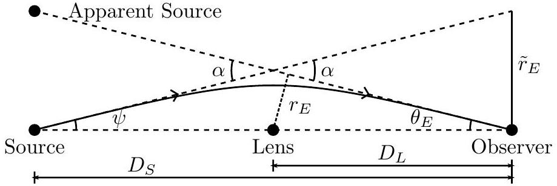
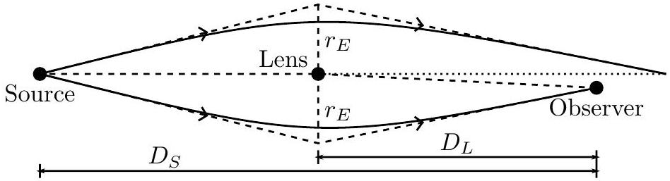
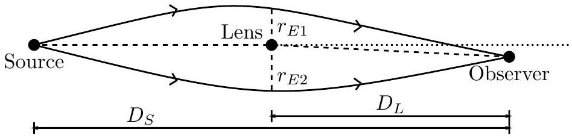

## 15 TH ASIAN PHYSICS OLYMPIAD

11-18 MAY 2014, SINGAPORE
Question 3

(a) (4 points) Draw a diagram to describe the physical layout of an ideal (observer, lens and point source in a straight line) lensing system. Draw the light path and mark the quantities $\alpha$ and $r _ { E }$. Also mark the angular Einstein radius $\theta _ { E }$ (the angular deflection of the source image as seen from earth), and the other quantities that an observer on earth can measure.

Solution:

Other relevant quantities include the distances to the lens and source $D _ { L }$ and $D _ { S }$. ( $D _ { L }$ and $D _ { S }$ need not be equal.)

- 1 point for correct layout
    - Correct answers should show that light is bent
    - Apparent source is not required
    - Accept answers that show the system as a thin lens approximation (sharp deflection angles)
- 1 point for light direction correctly marked
    - Arrows on the light path
- 1 point for $\theta _ { E } , \alpha$ and $r _ { E }$ correctly identified
    - 1 correct: 0.4 points
    - 2 correct: 0.7 points
    - 3 correct: 1.0 points
- 1 point for $D _ { L }$ and $D _ { S }$ (observables; may have different notation)
    - 0.5 points each

Notes:

- $\psi$ and $\tilde { r } _ { E }$ need not be identified, but may be useful in a later part.

- $r _ { E }$ should be perpendicular to the projected light path, but in our astronomical system, it makes no difference if it is perpendicular to the sourceobserver line since $\theta _ { E }$ is small. Accept answers that have $r _ { E }$ perpendicular to the source-observer line.

(b) (2 points) Sketch the image of the source (such as a star), as seen by an observer on earth, in the case where the source, lensing object and observer are on a straight line.

Solution: The image of the source should be a symmetrical (1 point) and circular (1 point) ring around the lensing object.
Notes:

- Do not accept solutions that indicate a magnified image of the source. This includes answers which state that the image is a filled in circle.
- 1 point for answers that have 2 source images symmetrically on either side of the lens because the system should be considered in 3 dimensions instead of 2 .
- Text answers (without any sketch or diagram) are not accepted. Correct answers must have a sketch (as specified in the question).

(c) (3 points) Sketch the image of the source (such as a star), as seen by an observer on earth, in the non-ideal case where the source, lensing object and observer are not in a straight line. Sketch the source-lens system to explain why this is so.

Solution:
WHAT: (1.5 points) The observer will see light from one side of the lens but not the other side. This means that the Einstein ring should be an arc instead of a complete circle. The ring may be distorted or broken depending on how much deviation from an ideal case. Correct answers should not be a perfect circle or straight line.
Note:

- Solutions that give 2 source images on either side of the lens (with asymmetry) are awarded 1 point instead of 1.5 point because the system should be considered in 3 dimensions instead of 2.
- Text answers (without any sketch or diagram) are not accepted. Correct answers must have a sketch (as specified in the question).

WHY: (1.5 points)
One possible answer:

For slight deviations from the ideal case, accept also the following diagram if $r _ { E 1 }$

is smaller than $r _ { E 2 }$.

In general, accept answers which show that the asymmetry in the system will cause the observer to see something asymmetrical.
Notes:
The key concept in this question is asymmetry. Correct answers for either part must demonstrate that departures from the ideal case will result in asymmetry in the observed system, and that the asymmetry about the source-observer line is the cause of the asymmetry in the observation.

(d) (3 points) The Schwarzschild radius of a black hole defines the point of no return. A correct expression for the Schwarzschild radius can be obtained by taking it to be the radius where the escape speed is equal to the speed of light. This means that something inside the Schwarzschild radius cannot escape the black hole.
Using Newtonian mechanics, derive the formula for the escape speed at a distance $r$ away from a point object of mass $M$. Hence, derive the Schwarzschild radius for a point object of mass $M$ in terms of the gravitational constant $G$ and the speed of light c. Show your steps and reasoning clearly. (This happens to give the correct expression for the Schwarzschild radius that comes from general relativity.)
Solution: By definition, the gravitational potential energy of a test mass $m$ at a distance $r$ from the mass is (0.5 point)
$$
\phi = - \frac { G M m } { r } .
$$
To escape the gravitational potential, the total energy of the test mass needs to be at least 0 so it should have a kinetic energy of ( $\mathbf { 0 . 5 }$ point)
$$
K = \frac { G M m } { r } = \frac { 1 } { 2 } m v _ { e } ^ { 2 } .
$$
Rearranging the above, the escape speed at distance from mass $r$ is (1 point)
$$
v _ { e } = \sqrt { \frac { 2 G M } { r } } .
$$
Substitute $v _ { e } = c$ and rearrange to get (1 point)
$$
r _ { S } = \frac { 2 G M } { c ^ { 2 } } .
$$
2 points for deriving escape speed (Any reasonable and physically sound method based on Newtonian mechanics)
1 point for deriving the Schwarzschild radius from the escape speed.

(e) (1 point) Using the formula for light deflection, write down an expression for the Schwarzschild radius of a lensing object in the case where the source, lens and observer is in a straight line.

Solution: The Schwarzschild radius is

$$
r _ { S } = \frac { 2 G M } { c ^ { 2 } } \text { so } r _ { S } = \frac { 1 } { 2 } \alpha r _ { E }
$$

Notes: Full marks for correct working.

(f) (2 points) Consider the case where we have a lensing object of the order of a few solar masses ( $M \sim \mathrm { a }$ few $\times 10 ^ { 30 } \mathrm {~kg}$ ) in the nearby regions of the galaxy (distance $D _ { L } \sim$ a few $\times 10 ^ { 18 } \mathrm {~m}$ away) and a source object somewhat further out ( $D _ { S } \sim$ a few $\times D _ { L }$ ). What can we say about $\alpha$ and $\theta _ { E }$ in this case? (Choose your answer on your answer sheet. Points will be deducted for wrong answers.)
    - $\alpha$ is large and $\tan \alpha , \sin \alpha , \cos \alpha$ must be calculated exactly.
    - $\theta _ { E }$ is large and $\tan \theta _ { E } , \sin \theta _ { E }$, $\cos \theta _ { E }$ must be calculated exactly.
    - $\alpha$ is small and the small angle approximations to $\tan \alpha , \sin \alpha , \cos \alpha$ are permissable.
    - $\theta _ { E }$ is small and the small angle approximations to $\tan \theta _ { E } , \sin \theta _ { E }$, $\cos \theta _ { E }$ are permissable.
    - $\alpha$ is irrelevant and need not be calculated
    - $\theta _ { E }$ is irrelevant and need not be calculated

Solution:

- $\alpha$ is small
- $\theta _ { E }$ is small

Notes:

- Choices pertaining to $\alpha$ and $\theta _ { E }$ are to be marked independently (1 point each).
- The conditions are mutually exclusive so accept only one condition for each quantity $\left( \alpha , \theta _ { E } \right)$. Answers that select more than one condition for a quantity ( $\alpha , \theta _ { E }$ ) are wrong (no point to be awarded).

Reasoning: Working out the numbers, we can find that the Schwarzschild radius is on the order of $10 ^ { 4 } \mathrm {~m}$. Because $\alpha$ has a maximum of $2 \pi$ (largest possible angle), this means the physical Einstein radius $r _ { E } \sim 10 ^ { 4 } \mathrm {~m}$ is very small compared to the distance to the lens $D _ { L } \sim 10 ^ { 20 } \mathrm {~m}$. The geometry of the system therefore means that $\alpha$ is actually a very small angle.

Another approximation comes from the geometry of the system which sets bounds on $\alpha$ and $\theta _ { E }$ so that (see figure in part (a))

$$
\tan \theta _ { E } = \frac { r _ { E } } { D _ { L } } = \frac { 2 r _ { S } / \alpha } { D _ { L } } \approx \frac { 10 ^ { - 16 } } { \alpha }
$$

which suggests that $\alpha$ or $\theta _ { E }$ or both should be small.
Based on the geometry of the setup and what we have already established ( $\alpha$ small), we then have the following cases:

- $\theta _ { E }$ large means that $D _ { L }$ is small which is not the case here.
- $\alpha$ small, $\theta _ { E }$ small is the only valid outcome here

The result and constraints in the question suggests that $\alpha$ and $\theta _ { E }$ are both small Because $\theta _ { E }$ is small, the Einstein radius $r _ { E } \sim 10 ^ { 4 } \mathrm {~m}$ is very small compared to the distance to the lensing object $D _ { L } \sim 10 ^ { 20 } \mathrm {~m}$ or source $D _ { S }$. We can therefore take the small angle approximation where $\alpha$ and $\theta _ { E }$ is involved.

(g) (3 points) Using the conditions in part (f), rewrite your expression in part (e) in terms of measurable quantities (which are $\theta _ { E } , D _ { S }$ and $D _ { L }$ ) for a lensing object of the order of a few solar masses ( $M \sim$ a few $\times 10 ^ { 30 } \mathrm {~kg}$ ) and in the nearby regions of the galaxy (distance $D _ { L } \sim$ a few $\times 10 ^ { 18 } \mathrm {~m}$ away) with a source object somewhat further out ( $D _ { S } \sim$ a few × $D _ { L }$ ). Show your working.
Solution: Adding up exterior angles, we see that $\alpha = \theta _ { E } + \psi$ so $\theta _ { E } = \alpha - \psi$ where is small ( $\psi$ and $\tilde { r } _ { E }$ defined on the following diagram). Also note that $r _ { E }$ is approximately perpendicular to the source-observer system because $\theta _ { E }$ is small.

Using the small angle approximation for $\alpha$ and $\theta _ { E }$, we can write
$$
\frac { r _ { E } } { D _ { L } } = \tan \theta _ { E } \approx \theta _ { E } \quad \text { and } \quad \frac { \tilde { r } _ { E } } { D _ { S } } = \frac { r _ { E } } { D _ { S } - D _ { L } } = \tan \psi \approx \psi
$$
This gives (1 point)
$$
\alpha = \frac { r _ { E } } { D _ { L } } + \frac { r _ { E } } { D _ { S } - D _ { L } }
$$
So that (1 point)
$$
r _ { S } = \frac { 1 } { 2 } r _ { E } \alpha = \frac { 1 } { 2 } r _ { E } ^ { 2 } \left( \frac { D _ { S } } { D _ { L } \left( D _ { S } - D _ { L } \right) } \right)
$$
To write this in terms of $\theta _ { E } , D _ { L }$ and $D _ { S }$, we use $r _ { E } = \theta _ { E } D _ { L }$ to get (1 point)
$$
r _ { S } = \frac { 1 } { 2 } \theta _ { E } ^ { 2 } \left( \frac { D _ { S } D _ { L } } { D _ { S } - D _ { L } } \right)
$$

Notes:

- 1 point for $\alpha$
- 1 point for $r _ { S }$
- 1 point for final equation

(h) (2 points) Suppose we have an event where a lensing object of $6.0 \times 10 ^ { 30 } \mathrm {~kg}$ ( 3.0 solar masses), $2.6 \times 10 ^ { 18 } \mathrm {~m}$ away from earth passes in front of a star $9.2 \times 10 ^ { 18 } \mathrm {~m}$ away from earth. This happens such that the ideal configuration occurs during the event. What is the angular Einstein radius $\theta _ { E }$ (as seen from earth) during this event when the source, lens and observer line up?

Solution: The Schwarzschild radius of the lens is

$$
r _ { S } = \frac { 2 \times \left( 6.673 \times 10 ^ { - 11 } \right) \times 6.0 \times 10 ^ { 30 } } { \left( 3.0 \times 10 ^ { 8 } \right) ^ { 2 } } = 8.9 \times 10 ^ { 3 } \mathrm {~m}
$$

From the previous part, the angular Einstein radius is given by

$$
\begin{aligned}
\theta _ { E } ^ { 2 } & = 2 r _ { S } \times \left( \frac { D _ { S } - D _ { L } } { D _ { S } D _ { L } } \right) \\
& = 2 \times 8.9 \times 10 ^ { 3 } \times \left( \frac { ( 9.2 - 2.6 ) \times 10 ^ { 18 } } { \left( 9.2 \times 10 ^ { 18 } \right) \times \left( 2.6 \times 10 ^ { 18 } \right) } \right) \\
& = 4.9 \times 10 ^ { - 15 }
\end{aligned}
$$

Thus the angular Einstein radius is

$$
\theta _ { E } = \sqrt { 4.9 \times 10 ^ { - 15 } } = 7.0 \times 10 ^ { - 8 } \text { radians } = 0.014 \text { arcseconds }
$$

(1 point for correct answer, 1 point for correct working)
Notes:

- Students are expected to use the formula derived in part (g) to answer this question.
- For the final answer:
    - 0.5 point off for missing units. While angles are mathematically dimensionless, a good student should be cognisant of the fact that there are different physical units for angular measurement, and that units for angles should be specified.
    - 0.5 point off for final answers given to 1 significant figure or less.
    - 1 point off if the final number is incorrect.
