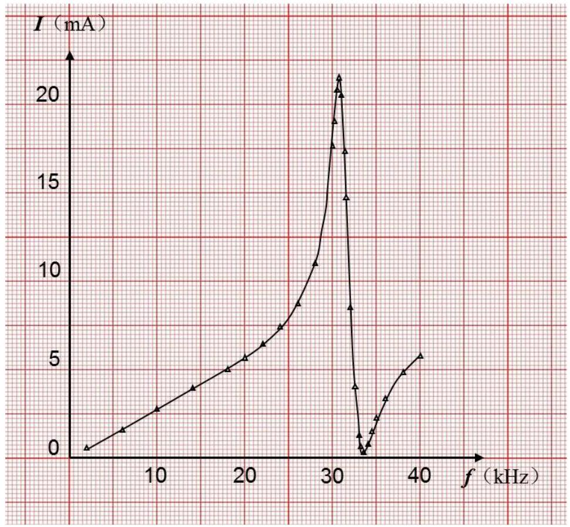
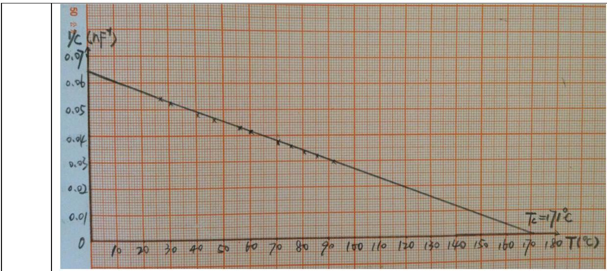
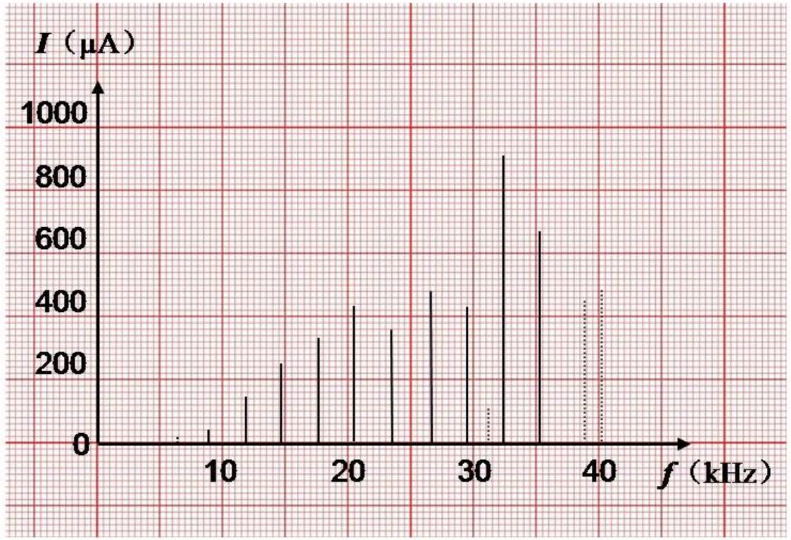
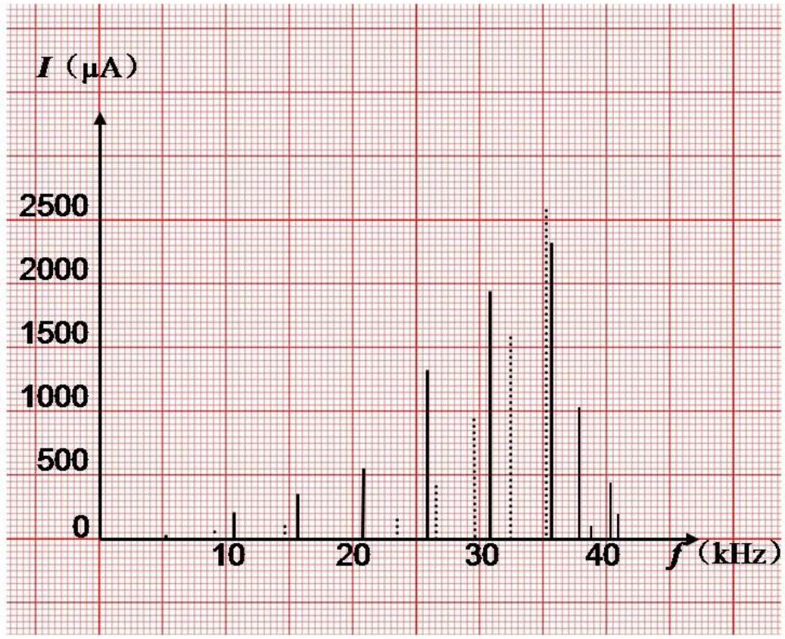
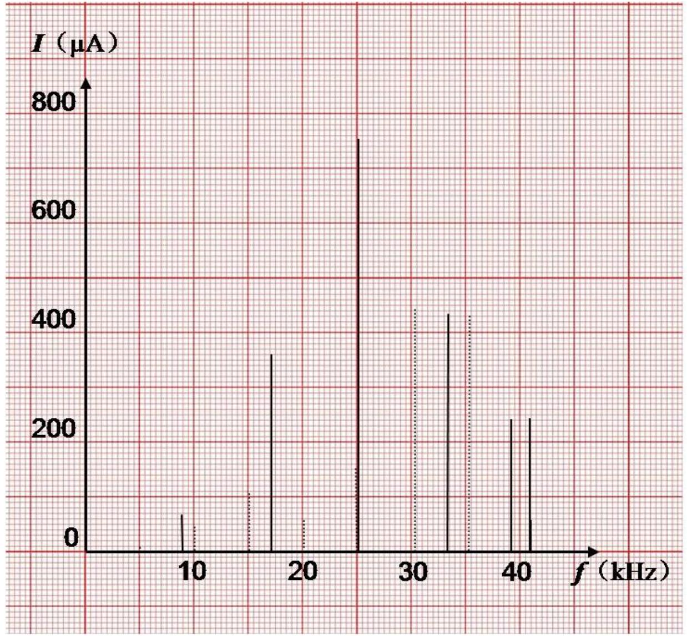

# Experimental Competition

May 7, 2015
08:30-13:30 hours

Marking Scheme

## Experiment A

| A. 1 | Choose a PZT plate and use the Vernier caliper to measure its length $l$, width $w$, and thickness $t$. Use the electronic weighing scale to measure its mass $m$. Use the DMM and the Kelvin clip to measure its capacitance $C$ (at ambient temperature).   Considering the slight non-uniformity in the dimensions of the PZT plate and the uncertainties of instrumental readings, repeat each measurement several times and then calculate the mean and the standard error. $l ( \mathrm {~mm} )$ $w ( \mathrm {~mm} )$ $t ( \mathrm {~mm} )$ $m ( \mathrm {~g} )$ $C ( \mathrm { nF } )$   1 45.00 6.98 1.00 2.24 18.19   2 45.02 7.00 1.00 2.23 18.13   3 45.00 7.02 0.98 2.26 18.17   4 45.02 7.04 0.98 2.25 18.19   5 45.02 7.04 1.00 2.25 18.20   6 45.00 7.04 1.00 2.25 18.21   Avg. 45.01±0.02 7.02±0.02 0.99±0.02 2.25±0.01 $18.18 \pm 0.02$   Alternative: $l ( \mathrm {~mm} )$ $w ( \mathrm {~mm} )$ $t ( \mathrm {~mm} )$ $m ( \mathrm {~g} )$ $C ( \mathrm { nF } )$   1 45.00 7.02 1.00 2.25 18.19   2     18.13   3     18.17   4     18.19   5     18.20   6     18.21   Avg. $45.00 \pm 0.02$ 7.02±0.02 1.00±0.02 2.25±0.01 18.18±0.02   If repeated measurement of dimension and mass gives the same result. | Total:1.6   0.2 data table.   0.2 units.   -0.1 each unit missing.   0.3 standard error.   -0.1 each error missing.   0.3 correct number of significant figures.   -0.1 each wrong significant figure.   0.3 correct reading of Vernier caliper.   0.2 right value of $C$   (0.2:17.30~19.10nF)   (0.1:16.40~17.30nF, 19.10~20.00nF)   0 otherwise.   0.2 repeated measurement of capacitance   (0.2: repeat $\geq$ 6times)   (0.1: repeat $\geq 3$ times)   0 otherwise. |
| :--- | :--- | :--- |

| A. 2 | Now calculate the density $\rho$ and the relative permittivity $\varepsilon _ { r }$ of the PZT plate. Based on standard errors obtained from A.1, carry out the error analysis to estimate the uncertainties of $\rho$ and $\varepsilon _ { r }$ (vacuum permittivity $\varepsilon _ { 0 } = 8.85 \times 10 ^ { - 12 } \mathrm {~F} / \mathrm { m }$ ). $\rho = \frac { m } { l w t } = 7.20 \times 10 ^ { 3 } \mathrm {~kg} / \mathrm { m } ^ { 3 }$ $\begin{gathered} \frac { \Delta \rho } { \rho } = \sqrt { \left( \frac { \Delta m } { m } \right) ^ { 2 } + \left( \frac { \Delta l } { l } \right) ^ { 2 } + \left( \frac { \Delta w } { w } \right) ^ { 2 } + \left( \frac { \Delta t } { t } \right) ^ { 2 } } = 0.021 \\ \therefore \Delta \rho = 0.15 \times 10 ^ { 3 } \mathrm {~kg} / \mathrm { m } ^ { 3 } \\ \rho = ( 7.20 \pm 0.15 ) \times 10 ^ { 3 } \mathrm {~kg} / \mathrm { m } ^ { 3 } \\ \varepsilon _ { r } = \frac { C t } { \varepsilon _ { 0 } l w } = 6.44 \times 10 ^ { 3 } \\ \frac { \Delta \varepsilon _ { r } } { \varepsilon _ { r } } = \sqrt { \left( \frac { \Delta C } { C } \right) ^ { 2 } + \left( \frac { \Delta l } { l } \right) ^ { 2 } + \left( \frac { \Delta w } { w } \right) ^ { 2 } + \left( \frac { \Delta t } { t } \right) ^ { 2 } } = 0.021 \\ \Delta \varepsilon _ { r } = 0.14 \times 10 ^ { 3 } \\ \varepsilon _ { r } = ( 6.44 \pm 0.14 ) \times 10 ^ { 3 } \end{gathered}$   Alternative: calculate $\rho$ each time:7.13,7.08,7.30,7.24,7.10,7.10, $\begin{aligned} \sigma _ { \bar { \rho } } & = \sqrt { \frac { \sum _ { i = 1 } ^ { n } \left( \rho _ { i } - \bar { \rho } \right) ^ { 2 } } { n ( n - 1 ) } } = 0.04 \times 10 ^ { 3 } \mathrm {~kg} / \mathrm { m } ^ { 3 } \\ \rho & = ( 7.16 \pm 0.04 ) \times 10 ^ { 3 } \mathrm {~kg} / \mathrm { m } ^ { 3 } \end{aligned}$   Or $\begin{aligned} \sigma _ { \bar { \rho } } & = \sqrt { \frac { \sum _ { i = 1 } ^ { n } \left( \rho _ { i } - \bar { \rho } \right) ^ { 2 } } { ( n - 1 ) } } = 0.10 \times 10 ^ { 3 } \mathrm {~kg} / \mathrm { m } ^ { 3 } \\ \rho & = ( 7.16 \pm 0.10 ) \times 10 ^ { 3 } \mathrm {~kg} / \mathrm { m } ^ { 3 } \end{aligned}$ | Total:1.4   0.1 unit of $\rho$.   0.2 right value of $\rho$.   (0.2:6.85~7.55)   (0.1:6.50~6.85,7.55~ 7.90)   0 otherwise.   $0.2 \frac { \Delta \rho } { \rho }$ expression.   0.2 right value of $\Delta \rho$.   (0.2:0.05~0.30)   (0.1:0.01~0.05,   0.30~0.50)   0 otherwise.   The same criteria for $\varepsilon _ { r }$.   02 .right value of $\varepsilon _ { r }$   (0.2:6.10~6.80)   (0.1:5.75~6.10,   6.80~7.15)   0 otherwise   0.2 right value of $\Delta \varepsilon _ { r }$.   (0.2:0.05~0.30)   (0.1:0.01~0.05,   0.30~0.50)   0 otherwise.   ----------------   Alternative:   $0.2 \rho$.   0.1 unit of $\rho$.   $0.1 \Delta \rho$ expression.   0.1 right value of $\Delta \rho$.   (0.1:0.01~0.40)   0 otherwise.   0.2 data points. |
| :--- | :--- | :--- |

$16 ^ { \text {th } }$ ASIAN PHYSICS OLYMPIAD 2015
$3 ^ { \text {rd } } - 11 ^ { \text {th } }$ MAY, HANGZHOU, CHINA

|  |  | (0.2 measure $\geq$ 6times) (0.1:3~5times) 0 otherwise. The same criteria for $\varepsilon _ { r }$. |
| :--- | :--- | :--- |

## Experiment B

| B. 1 | Derive the expressions for the resonant frequency $f _ { r }$ and the antiresonant frequency $f _ { a }$ of the equivalent circuit.   The impedance of the capacitance $C _ { 0 } , C _ { 1 }$ and inductance $L _ { 1 }$ are $\begin{align*} & Z _ { 0 } = \frac { 1 } { i \omega C _ { 0 } } , \\ & Z _ { 1 } = \frac { 1 } { i \omega C _ { 1 } } ,  \tag{1}\\ & Z _ { 2 } = i \omega L _ { 1 } \end{align*}$   Respectively. Assume the total impedance of the equivalent circuit is Z, then we have $\frac { 1 } { Z } = \frac { 1 } { Z _ { 0 } } + \frac { 1 } { Z _ { 1 } + Z _ { 2 } } = i \omega C _ { 0 } + \frac { 1 } { \frac { 1 } { i \omega C _ { 1 } } + i \omega L _ { 1 } } = i \omega \frac { C _ { 0 } - \omega ^ { 2 } L _ { 1 } C _ { 0 } C _ { 1 } + C _ { 1 } } { 1 - \omega ^ { 2 } L _ { 1 } C _ { 1 } }$   (2)   Resonance condition: $\begin{equation*} 1 - \omega ^ { 2 } L _ { 1 } C _ { 1 } = 0 \Rightarrow f _ { r } = \frac { 1 } { 2 \pi \sqrt { L _ { 1 } C _ { 1 } } } \tag{3} \end{equation*}$   Antiresonance condition: $\begin{equation*} C _ { 0 } - \omega ^ { 2 } L _ { 1 } C _ { 0 } C _ { 1 } + C _ { 1 } = 0 \Rightarrow f _ { a } = \frac { 1 } { 2 \pi } \sqrt { \frac { 1 } { L _ { 1 } C _ { 1 } } + \frac { 1 } { L _ { 1 } C _ { 0 } } } \tag{4} \end{equation*}$ | Total:1.0   0.1 $C _ { 0 }$ impedance.   0.1 $C _ { 1 }$ impedance.   0.1 $L _ { 1 }$ impedance.   0.3 total impedance.   0.2 resonant frequency.   0.2 antiresonant frequency. |
| :--- | :--- | :--- |

B. 2 Measure the AC current $I$ through the PZT plate as a function of the signal frequency $f$. Draw the $I - f$ curve and find the resonant frequency $f _ { r }$ and the antiresonant frequency $f _ { a }$. Calculate the piezoelectric coefficient $d$ accordingly.

| Freq (kHz) | I(mA) | Freq (kHz) | I(mA) | Freq (kHz) | I(mA) | Freq (kHz) | I(mA) |
| :--- | :--- | :--- | :--- | :--- | :--- | :--- | :--- |
| 2 | 0.58 | 30.5 | 20.86 | 32.4 | 4.82 | 34.3 | 1.18 |
| 4 | 1.13 | 30.6 | 21.28 | 32.5 | 4.06 | 34.0 | 1.37 |
| 6 | 1.68 | 30.7 | 21.50 | 32.6 | 3.37 | 34.5 | 1.52 |
| 8 | 2.21 | 30.8 | 21.47 | 32.7 | 2.76 | 34.6 | 1.67 |
| 10 | 2.75 | 30.9 | 21.13 | 32.8 | 2.20 | 34.7 | 1.82 |
| 12 | 3.29 | 31.0 | 20.51 | 32.9 | 1.73 | 34.8 | 1.96 |
| 14 | 3.85 | 31.1 | 19.64 | 33.0 | 1.29 | 34.9 | 2.10 |
| 16 | 4.42 | 31.2 | 18.55 | 33.1 | 0.94 | 35 | 2.23 |
| 18 | 5.03 | 31.3 | 17.35 | 33.2 | 0.66 | 36 | 3.35 |
| 20 | 5.69 | 31.4 | 16.06 | 33.3 | 0.47 | 37 | 4.18 |
| 22 | 6.46 | 31.5 | 14.73 | 33.4 | 0.36 | 38 | 4.82 |
| 24 | 7.39 | 31.6 | 13.40 | 33.5 | 0.31 | 39 | 5.34 |
| 26 | 8.72 | 31.7 | 12.10 | 33.6 | 0.33 | 40 | 5.78 |
| 28 | 11.05 | 31.8 | 10.85 | 33.7 | 0.38 |  |  |
| 30 | 17.69 | 31.9 | 9.65 | 33.8 | 0.48 |  |  |
| 30.1 | 18.34 | 32.0 | 8.55 | 33.9 | 0.60 |  |  |
| 30.2 | 18.99 | 32.1 | 7.50 | 34.0 | 0.74 |  |  |
| 30.3 | 19.66 | 32.2 | 6.52 | 34.1 | 0.89 |  |  |
| 30.4 | 20.29 | 32.3 | 5.63 | 34.2 | 1.04 |  |  |

Total:3.5
0.2 data table.
0.2 units.
0.3 significant figures.
$\mathbf { 0 . 3 } \geq 10$ data points.
0.3 fr.
$0.3 f a$.
0.3 0.1kHz freq. resolution near $f r$ and fa.
0.5 figure
(0.1: data points,
0.1: units,
0.1: axis label,
0.1: axis ticks label,
0.1: smooth curve).
0.1: unit of $d$.
1.0 right value of $d$ (1.0:4.20~4.70)
(0.5:3.95~4.20,
4.70~4.95)
0 otherwise.

$16 ^ { \text {th } }$ ASIAN PHYSICS OLYMPIAD 2015
$3 ^ { \text {rd } } - 11 ^ { \text {th } }$ MAY, HANGZHOU, CHINA

$$
d = \sqrt { \frac { f _ { r } = 30.7 \mathrm { kHz } , f _ { a } = 33.5 \mathrm { kHz } } { \sqrt { 128 f _ { r } ^ { 4 } l ^ { 2 } \rho \left[ \frac { 1 } { \left( 2 \pi f _ { a } \right) ^ { 2 } - \left( 2 \pi f _ { r } \right) ^ { 2 } } + \frac { 1 } { 32 f _ { r } ^ { 2 } } \right] } } } = 4.44 \times 10 ^ { - 10 } \mathrm {~m} / \mathrm { V } ( \text { or } \mathrm { C } / \mathrm { N } )
$$

Experiment C
| C. 1 | Now measure the capacitance of the PZT plate at various temperatures and record the data.$T \left( { } ^ { \circ } \mathrm { C } \right)$ 17.0 30.0 40.0 50.0 60.0 70.0 80.0   $C ( \mathrm { nF } )$ 16.80 18.25 19.77 21.08 23.07 25.60 27.80   $1 / \mathrm { C } \left( \mathrm { nF } ^ { - 1 } \right)$ 0.0595 0.0548 0.0506 0.0474 0.0433 0.0391 0.0360 | Total:1.5 0.2 data table. 0.2 units. 0.2 significant figures. 0.4 data points (0.4: $\geq 6$ data points) (0.2: 4~5 data points) 0 otherwise.   0.5 temperature range (0.5: from room temperature to $\geq 80 ^ { \circ } \mathrm { C }$ ) (0.3: temperature range 35~50°C) (0.1: temperature range 20~35°C) 0 otherwise. |
| :--- | :--- | :--- |

| C. 2 | Analyze the data, draw a proper plot and calculate the Curie temperature accordingly.   From the straight line choose two points $\mathrm { P } _ { 1 } ( 30.0,0.05275 ) ,$ $\mathrm { P } _ { 2 } ( 90.0,0.03075 )$ to calculate the slope $k = \frac { \Delta y } { \Delta x } = - 0.000367$   We can get the linear function $y = - 0.000367 x + 0.0638$   Let $\mathrm { y } = 0$, then we can get the Curie temperature $T _ { c } = 174 ^ { \circ } \mathrm { C }$   Alternative method: extent the straight line to intercept with the x axis to get the Curie temperature. | Total:2.5   0.1 axis label   0.1 axis unit.   0.1 axis tick label.   0.3 Choice of Scale (to cover 70\% or more space on graph sheet).   0.2 data marker.   0.2 straight line.   0.2 proper choice of $\mathrm { P } _ { 1 } , \mathrm { P } _ { 2 }$.   0.2 slope.   0.2 significant figures.   0.2 linear function.   0.1 unit of $T _ { c }$.   0.6 right value of $T _ { c }$ (0.6:160~180)   (0.3:150~160,180~190) 0 otherwise.   Note: other reasonable method that yields correct result is acceptable.   Alternative: |
| :--- | :--- | :--- |

$16 ^ { \text {th } }$ ASIAN PHYSICS OLYMPIAD 2015
$3 ^ { \text {rd } } - 11 ^ { \text {th } }$ MAY, HANGZHOU, CHINA

1.0 at most.
0.3 extent straight line. to intercept with x axis.
0.1 unit of $T _ { c }$.
0.6 right value of $T _ { c }$.

## Experiment D

| D. 1 | Assume that the length of the aluminum rod is $L$ and the wave velocity is $u$. Under the free boundary condition, derive the equation for the frequencies $f _ { n }$ of the standing (resonant) waves along the long rod. Then derive the equation for the wave velocity $u$ from $f _ { n }$.   Consider the aluminum rod as a one dimensional long string with free Boundary condition, then the standing wave condition is $\begin{equation*} L = n \frac { \lambda } { 2 } , n = 1,2,3 , \ldots \tag{1} \end{equation*}$ According to $\begin{equation*} \lambda f = u \tag{2} \end{equation*}$ The standing wave frequencies are $\begin{equation*} f _ { n } = n \frac { u } { 2 L } , n = 1,2,3 , \ldots \tag{3} \end{equation*}$ Continually changing the vibration frequency, we can find out a series of standing wave frequencies $f _ { n }$ and calculate the average distance between two peaks $\overline { \Delta f }$, we have $\begin{equation*} u = 2 L \overline { \Delta f } \tag{4} \end{equation*}$ | Total:0.6   0.2 eqn.(1).   0.1 eqn.(2).   0.1 eqn.(3).   0.2 eqn.(4).   Note: express $u$ in terms of $f _ { n }$ instead of $\Delta f$ is also acceptable. |
| :--- | :--- | :--- |

D. 2 Use the steel tape measure to read the length $L$ of the aluminum rod. Please repeat the measurement several times and calculate the mean and the standard error.

While changing the frequency of the sound waves produced by the transducer, record the peak values monitored by the sensor. Draw a spectrum containing all measured resonant peaks, similar to that shown in Figure 12.

|  | 1 | 2 | 3 | 4 | 5 | 6 | Avg |
| :--- | :--- | :--- | :--- | :--- | :--- | :--- | :--- |
| $L ( \mathrm {~cm} )$ | 49.93 | 49.98 | 50.00 | 50.02 | 50.05 | 50.03 | 50.00±0.05 |

| $f ( \mathrm { kHz } )$ | 6.37 | 8.81 | 11.81 | 14.70 | 17.54 | 20.45 | 23.44 |
| :--- | :--- | :--- | :--- | :--- | :--- | :--- | :--- |
| $I ( \mu \mathrm {~A} )$ | 16.5 | 42.6 | 144.0 | 249.5 | 336.9 | 247.7 | 358.4 |
| $f ( \mathrm { kHz } )$ | 26.40 | 29.47 | 31.14 | 32.35 | 35.22 | 38.76 | 40.13 |
| $I ( \mu \mathrm {~A} )$ | 296.2 | 429.9 | 109.2 | 907 | 671 | 446.8 | 479 |

Total:1.6

0.1 multi measurement.
0.1 value of $L$.
0.1 error of $L$.

0.1 units.

0.1 significant figures.
$0.1 \geq 10$ data points.
0.4 standing wave peaks resulting from the transverse waves
(0.4: $\geq 6$ peaks) (0.2:3~5peaks) 0 otherwise.
0.3 frequency resolution 0.01 kHz .
0.1 at least one miscellaneous peak.
0.2 spectrum containing all measured peaks.

| D. 3 | Identify the resonant peaks likely resulting from the transverse waves. Calculate the transverse wave velocity accordingly and carry out the error analysis.   Attention: there might be irrelevant peaks caused by imperfection of the experimental setup, e.g., imperfect free boundary condition. You need to make a judgement and ignore the irrelevant peaks during your analysis.$i$ $f _ { i } ( \mathrm { kHz } )$ $F _ { i } = f _ { i + 5 ^ { - } } f _ { i } ( \mathrm { kHz } )$  $\Delta F _ { \mathrm { i } }$ kHz)   1 8.81 $F _ { l ^ { \prime } } = f _ { 6 ^ { - } } f _ { l }$ $F _ { 2 } = f _ { 7 ^ { - } } f _ { 2 }$ $F _ { 3 } = f _ { 8 ^ { - } } f _ { 3 }$ 14.63 $\Delta F _ { 1 }$ 0.08   2 11.81   $\Delta F _ { 2 }$ 0.12   3 14.70       4 17.54   $\Delta F _ { 3 }$ 0.06   5 20.45  14.81   14.81   14.77   14.77   14.71 $\Delta F _ { 4 }$ 0.10   6 23.44   $\Delta F _ { 5 }$   $\sigma _ { \overline { \Delta F } }$ 0.06   7 26.40       8 29.47       9 32.35       10 35.22     $\begin{aligned} \overline { \Delta f } & = \frac { \bar { F } } { 5 } = 2.94 \mathrm { kHz } \\ \sigma _ { \overline { \Delta f } } & = \frac { \sigma _ { \overline { \Delta F } } } { 5 } = \frac { 1 } { 5 } \sqrt { \frac { \sum \left( \Delta F _ { i } \right) ^ { 2 } } { n ( n - 1 ) } } = 0.01 \mathrm { kHz } \end{aligned}$ $\begin{gathered} \frac { \Delta u } { u } = \sqrt { \left( \frac { \Delta L } { L } \right) ^ { 2 } + \left( \frac { \Delta f } { f } \right) ^ { 2 } } = 0.0035 \\ \Delta u = 0.01 \mathrm {~km} / \mathrm { s } \\ u = ( 2.94 \pm 0.01 ) \mathrm { km } / \mathrm { s } \end{gathered}$ | Total:1.4   0.3 successive difference method.   Note: other reasonable method that yields correct result is acceptable.   0.1 data table.   0.1 significant figures.   0.1 unit.   0.6 right value of transverse wave velocity(0.6 2.80~3.10   km/s)    (0.2 2.65~2.80   km/s, 3.10~3.25   km/s)    0 otherwise.    0.2 right value of $\Delta \mathrm { u }$ (0.2:0.01~0.15 km/s) (0.1:0.15~0.30 km/s) 0 otherwise. |
| :--- | :--- | :--- |

D. 4 While changing the frequency of the sound waves produced by the transducer, record the peak values monitored by the sensor. Draw a spectrum containing all measured resonant peaks, similar to that shown in Figure 12.

| $f ( \mathrm { kHz } )$ | 5.18 | 8.90 | 10.50 | 14.53 | 15.53 | 20.63 | 23.39 | 24.68 | 25.67 |
| :--- | :--- | :--- | :--- | :--- | :--- | :--- | :--- | :--- | :--- |
| $I ( \mu \mathrm {~A} )$ | 15.5 | 52.7 | 216.2 | 103.6 | 353.3 | 555 | 156.4 | 45.8 | 1328 |
| $f ( \mathrm { kHz } )$ | 26.44 | 29.40 | 30.64 | 32.33 | 35.20 | 35.55 | 37.81 | 38.74 | 40.26 |
| $I ( \mu \mathrm {~A} )$ | 414.5 | 848 | 1940 | 1593 | 2589 | 2331 | 1043 | 118.8 | 450 |
| $f ( \mathrm { kHz } )$ | 40.79 | 41.53 |  |  |  |  |  |  |  |
| $I ( \mu \mathrm {~A} )$ | 194.5 | 32.7 |  |  |  |  |  |  |  |

Total:1.5
0.1 unit.
0.1 significant figures.
0.1 >10 data points.
0.4 standing wave peaks resulting from the longitudinal waves
(0.4: $\geq 6$ peaks)
(0.2:3~5peaks)
0 otherwise.
0.2 standing wave peaks resulting from the transverse waves
(0.2: $\geq 4$ peaks)
(0.1:2~3peaks) 0 otherwise.
0.3 frequency resolution 0.01kHz.
0.1 at least one miscellaneous peak.
0.2 spectrum containing all measured peaks.

| D. 5 | Compare with the result in D.2, identify the resonant peaks caused by the transverse waves. Select the resonant peaks resulting from the longitudinal waves and calculate the longitudinal wave velocity accordingly. Carry out the error analysis.$f _ { i } ( \mathrm { kHz } )$ $F _ { \mathrm { i } } = f _ { \mathrm { i } + 3 } - f _ { \mathrm { i } } ( \mathrm { kHz } )$  $\Delta F _ { \mathrm { i } } ( \mathrm { kHz } )$    1050 $F _ { 1 } = f _ { 4 ^ { - } } f _ { 1 }$   $F _ { 2 } = f _ { 5 ^ { - } } f _ { 2 }$ 15.17 $\Delta F _ { 1 }$ 0.10   15.53       20.63  15.11 $\Delta F _ { 2 }$ 0.04   30.64 $\bar { F }$  $\sigma _ { \overline { \Delta F } }$ 0.08   35.55  15.07   $\begin{aligned} & \overline { \Delta f } = \frac { \bar { F } } { 3 } = 5.02 \mathrm { kHz } \\ & \sigma _ { \overline { \Delta f } } = \frac { \sigma _ { \overline { \Delta F } } } { 3 } = \frac { 1 } { 3 } \sqrt { \frac { \sum \left( \Delta F _ { i } \right) ^ { 2 } } { n ( n - 1 ) } } = 0.03 \mathrm { kHz } \\ & \quad u = 2 L \overline { \Delta f } = 5.02 \mathrm {~km} / \mathrm { s } \\ & \frac { \Delta u } { u } = \sqrt { \left( \frac { \Delta L } { L } \right) ^ { 2 } + \left( \frac { \Delta f } { f } \right) ^ { 2 } } = 0.006 \\ & \Delta u = 0.03 \mathrm {~km} / \mathrm { s } \end{aligned}$   Thus the longitudinal wave velocity is given by $u = 5.02 \pm 0.03 \mathrm {~km} / \mathrm { s }$ | Total:1.4   0.3 successive difference method.   Note: other reasonable method that yields correct result is acceptable.   0.1 data table.   0.1 significant figures.   0.1 units.   0.6 right value of longitudinal wave velocity (0.6:4.70~5.20 km/s) (0.3:4.50~4.70 km/s,5.20~5.40 km/s) 0 otherwise.   0.2 right value of $\Delta \mathrm { u }$ (0.2:0.01~0.20 km/s) (0.1:0.20~0.40 km/s) 0 otherwise. |
| :--- | :--- | :--- |

## Experiment E

| E. 1 | While changing the frequency of the sound waves produced by the transducer, record the peak values monitored by the sensor. Draw a spectrum containing all measured resonant peaks, similar to that shown in Figure 12.$f ( \mathrm { kHz } )$ 5.06 8.01 8.85 10.09 15.05 15.14 17.15 20.11   $I ( \mu \mathrm {~A} )$ 9.1 6.1 66.0 43.8 34.9 105.2 358.9 57.2   $f ( \mathrm { kHz } )$ 24.95 25.17 30.27 33.37 35.27 39.23 40.82 41.05   $I ( \mu \mathrm {~A} )$ 150.9 751 441 432.7 430.1 241.9 242.4 57.7 | Total:1.2   0.1 unit.   0.1 significant figures.   0.1 >10 data points.   0.2 resonant peaks of the longitudinal waves corresponding to the cut (0.2: $\geq 4$ peaks) (0.1:2~3peaks) 0 otherwise.   0.1 at least 2 resonant peaks of the transverse waves.   0.3 frequency resolution 0.01 kHz .   0.1 at least one miscellaneous peak.   0.2 spectrum containing all measured peaks. |
| :--- | :--- | :--- |

E. 2 In the measured spectrum, identify the resonant peaks corresponding to the existence of the deep cut. Estimate the distance from the spot of the cut to the end of the rod that is in contact with the PZT plates.

| $f ( \mathrm { kHz } )$ | 8.85 | 17.15 | 25.17 | 33.37 | 40.82 |
| :--- | :--- | :--- | :--- | :--- | :--- |
| $I ( \mu \mathrm {~A} )$ | 66.0 | 358.9 | 751 | 432.7 | 242.4 |
| $f _ { i + 2 ^ { - } } f _ { i } ( \mathrm { kHz } )$ | 16.32 |  | 16.22 |  | 15.65 |
| $\Delta f ( \mathrm { kHz } )$ | 8.03 |  |  |  |  |

$$
\begin{aligned}
& \overline { \Delta f } = \frac { 1 } { 2 } \bar { F } = 8.11 \mathrm { kHz } \\
& L _ { \text {flaw } } = \frac { u } { 2 \overline { \Delta f } } = 0.307 \mathrm {~m}
\end{aligned}
$$

Total:0.8
0.1 significant figures.
0.1 units.
0.6 right value of distance
(0.6
0.28~0.32m)
(0.3
0.26~0.28m,
0.32~0.34m)
0 otherwise.
