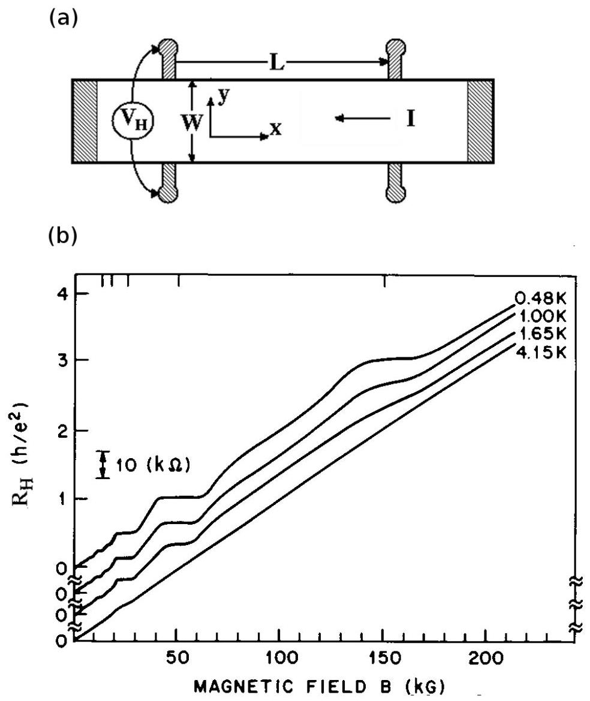

Question 1
The fractional quantum Hall effect (FQHE) was discovered by D. C. Tsui and H. Stormer at Bell Labs in 1981. In the experiment electrons were confined in two dimensions on the GaAs side by the interface potential of a GaAs/AlGaAs heterojunction fabricated by A. C. Gossard (here we neglect the thickness of the two-dimensional electron layer). A strong uniform magnetic field $B$ was applied perpendicular to the two-dimensional electron system. As illustrated in Figure 1, when a current $I$ was passing through the sample, the voltage $V _ { H }$ across the current path exhibited an unexpected quantized plateau (corresponding to a Hall resistance $R _ { H } = 3 h / e ^ { 2 }$ ) at sufficiently low temperatures. The appearance of the plateau would imply the presence of fractionally charged quasiparticles in the system, which we analyze below. For simplicity, we neglect the scattering of the electrons by random potential, as well as the electron spin.

(a) In a classical model, two-dimensional electrons behave like charged billiard balls on a table. In the GaAs/AlGaAs sample, however, the mass of the electrons is reduced to an effective $m ^ { * }$ due to their interaction with ions.
    (i) (2 point) Write down the equation of motion of an electron in perpendicular electric field $\vec { E } = - E _ { y } \hat { y }$ and magnetic field $\vec { B } = B \hat { z }$.

Solution: An electron with charge $- e ( e > 0 )$ experiences the Lorentz force due to the perpendicular magnetic field and the electric force

$$
m ^ { * } \frac { d \vec { v } } { d t } = - e ( \vec { v } \times \vec { B } + \vec { E } )
$$

where $\vec { v }$ is the velocity of the electron.
Grading: 1 point for writing down the electric force and the magnetic force correct, and 1 point for writing down the effective mass and the acceleration correct.

(ii) (1 point) Determine the velocity $v _ { s }$ of the electrons in the stationary

case.

Solution: In the stationary regime, the acceleration vanishes. Hence

$$
\vec { v } _ { s } \times \vec { B } + \vec { E } = 0
$$

The velocity can be expressed as

$$
\vec { v } _ { s } = \frac { \vec { E } \times \vec { B } } { B ^ { 2 } }
$$

whose magnitude is simply $v _ { s } = E / B$.
Grading: Either writing down the correct magnitude of the velocity or its vector form is sufficient for the 1 point.

(iii) (1 point) Which direction is the velocity pointing at?

Solution: The velocity $\vec { v } _ { s }$ should be perpendicular to both the magnetic field and the electric field. If $\vec { B }$ is in the $z$ direction and $\vec { E }$ in the $- y$ direction, as given by the problem, $\vec { v } _ { s }$ is in the $- x$ direction, generating a charge current in the $x$ direction.

Grading: 1 point for the correct direction.

(b) ( $\mathbf { 2 }$ points) The Hall resistance is defined as $R _ { H } = V _ { H } / I$. In the classical model, find $R _ { H }$ as a function of the number of the electrons $N$ and the magnetic flux $\phi = B A = B W L$, where $A$ is the area of the sample, and $W$

and $L$ the effective width and length of the sample, respectively.

Solution: The Hall voltage $V _ { H } = E _ { y } W$. The current in the $- x$ direction is

$$
I = \frac { \Delta Q } { \Delta t } = \frac { N e } { L / v _ { s } } = \frac { N e } { L } \frac { E _ { y } } { B } = e \frac { N } { \phi } V _ { H }
$$

Therefore,

$$
R _ { H } = \frac { V _ { H } } { I } = \frac { 1 } { e } \frac { \phi } { N }
$$

Grading: 1 point for the final expression and 1 point for writing down the expression for relating $I$ with the number of electrons and their stationary velocity (hence the electric field and the magnetic field).

(c) (2 points) We know that electrons move in circular orbitss in the magnetic field. In the quantum mechanical picture, the impinging magnetic field $B$ could be viewed as creating tiny whirlpools, so-called vortices, in the sea of electrons-one whirlpool for each flux quantum $h / e$ of the magnetic field, where $h$ is the Planck's constant and $e$ the elementary charge of an electron. For the case of $R _ { H } = 3 h / e ^ { 2 }$, which was discovered by Tsui and Stormer, derive the ratio of the number of the electrons $N$ to the number of the flux quanta $N _ { \phi }$, known as the filling factor $\nu$.

Solution: The Hall resistance can be rewritten as

$$
R _ { H } = \frac { 1 } { e } \frac { \phi } { N } = \frac { h } { e ^ { 2 } } \frac { \phi / ( h / e ) } { N } = \frac { h } { e ^ { 2 } } \frac { N _ { \phi } } { N }
$$

At the plateau, $\nu = N / N _ { \phi } = 1 / 3$.
Grading: 1 point for the final expression.

(d) ( $\mathbf { 2 }$ points) It turns out that binding an integer number of vortices $( n > 1 )$ with each electron generates a bigger surrounding whirlpool, hence pushes away all other electrons. Therefore, the system can considerably reduce

its electrostatic Coulomb energy at the corresponding filling factor. Determine the scaling exponent $\alpha$ of the amount of energy gain for each electron $\Delta U ( B ) \propto B ^ { \alpha }$.

Solution: The average distance between electrons can be written as $f l _ { 0 }$, where

$$
l _ { 0 } = \sqrt { \frac { L W } { N } } = \sqrt { \frac { \phi } { N B } } = \sqrt { \frac { h } { \nu e B } }
$$

and $f$ is a dimensionless constant that is determined by the electron distribution (or, quantum mechanically, wave function). Binding multiple vortices with an electron effectively reduces the probability of other electrons getting close. Therefore, the electrons optimize their distribution in such a way that their average distance increases from $f _ { 1 } l _ { 0 }$ to $f _ { 2 } l _ { 0 } \left( f _ { 1 } < f _ { 2 } \right)$. One expect the Coulomb energy gain per electron is proportional to

$$
\frac { e ^ { 2 } } { 4 \pi \varepsilon _ { 0 } \varepsilon _ { r } \left( f _ { 1 } l _ { 0 } \right) } - \frac { e ^ { 2 } } { 4 \pi \varepsilon _ { 0 } \varepsilon _ { r } \left( f _ { 2 } l _ { 0 } \right) } = \left( \frac { 1 } { f _ { 1 } } - \frac { 1 } { f _ { 2 } } \right) \frac { e ^ { 2 } } { 4 \pi \varepsilon _ { 0 } \varepsilon _ { r } l _ { 0 } }
$$

Therefore, $\Delta ( B ) \propto 1 / l _ { 0 } \propto \sqrt { B }$, or $\alpha = 1 / 2$.
Grading: The key point here is to realize that the energy scale is determined by the Coulomb interaction, which scales inversely with a length scale (e.g., the magnetic length) that characterizes the mean electron distance (and its change). 1 point for the final expression and 1 point for writing down the correct relation between the length scale and the magnetic field.

(e) ( 2 points) As the magnetic field deviates from the exact filling $\nu = 1 / m$ to a higher field, more vortices (whirlpools in the electron sea) are being created. They are not bound to electrons and behave like particles carrying effectively positive charges, hence known as quasiholes, compared to the negatively charged electrons. The amount of charge deficit in any of these quasiholes amounts to exactly $1 / m$ of an electronic charge. An analogous argument can be made for magnetic fields slightly below $\nu$ and the creation of quasielectrons of negative charge $e ^ { * } = - e / m$. Assume the sample has an area $A$. At the quantized Hall plateau of $R _ { H } = 3 h / e ^ { 2 }$, calculate the amount of change in $B$ that corresponds to the introduction of exactly one fractionally charged quasihole. (When their density is low, the quasiparticles are confined by the random potential generated by impurities and

imperfections, hence the Hall resistance remains quantized for a finite range of $B$.)

Solution: The flux change due to the change of the magnetic field is

$$
\Delta \phi = \Delta B ( W L ) = \frac { h } { e }
$$

Therefore, $\Delta B = h / ( e W L )$.
Grading: 2 points for the final expression.

(f) In Tsui et al. experiment,
    - the magnetic field corresponding to the center of the quantized Hall plateau $R _ { H } = 3 h / e ^ { 2 } , B _ { 1 / 3 } = 15$ Tesla,
    - the effective mass of an electron in GaAs, $m ^ { * } = 0.067 m _ { e }$,
    - the electron mass, $m _ { e } = 9.1 \times 10 ^ { - 31 } \mathrm {~kg}$,
    - Coulomb's constant, $k = 9.0 \times 10 ^ { 9 } \mathrm {~N} \cdot \mathrm {~m} ^ { 2 } / \mathrm { C } ^ { 2 }$,
    - the vacuum permittivity, $\varepsilon _ { 0 } = 1 / ( 4 \pi k ) = 8.854 \times 10 ^ { - 12 } \mathrm {~F} / \mathrm { m }$,
    - the relative permittivity (the ratio of the permittivity of a substance to the vacuum permittivity) of GaAs, $\varepsilon _ { r } = 13$,
    - the elementary charge, $e = 1.6 \times 10 ^ { - 19 } \mathrm { C }$,
    - Planck's constant, $h = 6.626 \times 10 ^ { - 34 } \mathrm {~J} \cdot \mathrm {~s}$, and
    - Boltzmann's constant, $k _ { B } = 1.38 \times 10 ^ { - 23 } \mathrm {~J} / \mathrm { K }$.

In our analysis, we have neglected several factors, whose corresponding energy scales, compared to $\Delta ( B )$ discussed in (d), are either too large to excite or too small to be relevant.

(i) ( $\mathbf { 1 }$ point) Calculate the thermal energy $E _ { t h }$ at temperature $T = 1.0 \mathrm {~K}$.

Solution: The thermal energy

$$
E _ { t h } = k _ { B } T = 1.38 \times 10 ^ { - 23 } \times 1.0 = 1.38 \times 10 ^ { - 23 } \mathrm {~J}
$$

Grading: 1 point for the numerical result.

(ii) (2 point) The electrons spatially confined in the whirlpools (or vortices) have a large kinetic energy. Using the uncertainty relation, estimate the order of magnitude of the kinetic energy. (This amount would also be the additional energy penalty if we put two electrons in the same whirlpool, instead of in two separate whirlpools, due to Pauli exclusion principle.)

Solution: The size of a vortex is of order

$$
l _ { 0 } = \sqrt { \frac { h } { e B } } = \sqrt { \frac { 6.626 \times 10 ^ { - 34 } } { 1.6 \times 10 ^ { - 19 } \times 15 } } = 1.66 \times 10 ^ { - 8 } \mathrm {~m}
$$

According to the uncertainty relation, $p \sim \Delta p \sim h / l _ { 0 }$. Therefore, the kinetic energy is

$$
\begin{aligned}
\frac { p ^ { 2 } } { 2 m ^ { * } } & = \frac { h ^ { 2 } } { 2 m ^ { * } } \frac { e B } { h } = \frac { h } { 2 } \frac { e B } { m ^ { * } } \\
& = \frac { 6.626 \times 10 ^ { - 34 } \times 1.6 \times 10 ^ { - 19 } \times 15 } { 2 \times 0.067 \times 9.1 \times 10 ^ { - 31 } } \\
& = 1.3 \times 10 ^ { - 20 } \mathrm {~J}
\end{aligned}
$$

Grading: 1 point for the final numerical result and 1 point for relating the characteristic length to the momentum through the uncertainty relation, and hence the kinetic energy. Note this is an estimate problem, hence any final numerical result within a factor of $2 \pi$ can be regarded as correct.

(g) There are also a series of plateau at $R _ { H } = h / i e ^ { 2 }$, where $i = 1,2,3 , \ldots$ in Tsui et al. experiment, as shown in Figure 1(b). These plateaus, known as the integer quantum Hall effect (IQHE), were reported previously by K. von Klitzing in 1980. Repeating (c)-(f) for the integer plateaus, one realizes that the novelty of the FQHE lies critically in the existence of fractionally charged quasiparticles. R. de-Picciotto et al. and L. Saminadayar et al. independently reported the observation of fractional charges at the $\nu = 1 / 3$ filling in 1997. In the experiments, they measured the noise in the charge current across a narrow constriction, the so-called quantum point contact (QPC). In a simple statistical model, carriers with discrete charge $e ^ { * }$ tunnel across the QPC and generate charge current $I _ { B }$ (on top of a trivial background). The number of the carriers $n _ { \tau }$ arriving at the electrode during a sufficiently small time interval $\tau$ obeys Poisson probability distribution

with parameter $\lambda$

$$
\begin{equation*}
P \left( n _ { \tau } = k \right) = \frac { \lambda ^ { k } e ^ { - \lambda } } { k ! } , \tag{1}
\end{equation*}
$$

where $k !$ is the factorial of $k$. You may need the following summation

$$
\begin{equation*}
e ^ { \lambda } = \sum _ { k = 0 } ^ { \infty } \frac { \lambda ^ { k } } { k ! } , \tag{2}
\end{equation*}
$$

(i) (2 point) Determine the charge current $I _ { B }$, which measures total charge per unit of time, in terms of $\lambda$ and $\tau$.

Solution: The current can be calculated by the ratio of the total charge carried by the averaged $n _ { \tau }$ quasiparticles to the time interval $\tau$.

$$
\begin{aligned}
\left\langle n _ { \tau } \right\rangle = \sum _ { k = 1 } ^ { \infty } k P ( k ) & = \sum _ { k = 1 } ^ { \infty } \frac { \lambda ^ { k } e ^ { - \lambda } } { ( k - 1 ) ! } \\
& = \lambda \sum _ { k = 0 } ^ { \infty } P ( k ) \\
& = \lambda
\end{aligned}
$$

where we have used $\sum _ { k } P ( k ) = 1$. Therefore,

$$
I _ { B } = \frac { \left\langle n _ { \tau } \right\rangle e ^ { * } } { \tau } = \frac { \nu e \lambda } { \tau }
$$

Grading: 1 point for correctly calculating the average charge under the Poisson distribution and 1 point for the final expression for the charge current.

(ii) (2 points) Current noise is defined as the charge fluctuations per unit of time. One can analyze the noise by measuring the mean square deviation of the number of current-carrying charges. Determine the current noise $S _ { I }$ due to the discreteness of the current-carrying charges

in terms of $\lambda$ and $\tau$.

Solution: Similarly, the noise can be related to the averaged charge fluctuations during the time interval $\tau$.

$$
\begin{aligned}
\left\langle \left( n _ { \tau } - \left\langle n _ { \tau } \right) ^ { 2 } \right\rangle \right. & = \left\langle n _ { \tau } ^ { 2 } \right\rangle - \left\langle n _ { \tau } \right\rangle ^ { 2 } \\
& = \sum _ { k = 1 } ^ { \infty } k ^ { 2 } P ( k ) - \lambda ^ { 2 } \\
& = \left[ \lambda ^ { 2 } \sum _ { k = 0 } ^ { \infty } P ( k ) + \sum _ { k = 1 } ^ { \infty } k P ( k ) \right] - \lambda ^ { 2 } \\
& = \lambda
\end{aligned}
$$

Therefore,

$$
S _ { I } = \frac { \left\langle \left( n _ { \tau } - \left\langle n _ { \tau } \right) ^ { 2 } \right\rangle \left( e ^ { * } \right) ^ { 2 } \right. } { \tau } = \frac { ( \nu e ) ^ { 2 } \lambda } { \tau }
$$

Grading: 1 point for correctly calculating the charge fluctuations under the Poisson distribution and 1 point for the final expression that relates the current noise to the charge fluctuations.

(iii) (1 point) Calculate the noise-to-current ratio $S _ { I } / I _ { B }$, which was verified by R. de-Picciotto et al. and L. Saminadayar et al. in 1997. (One year later, Tsui and Stormer shared the Nobel Prize in Physics with R. B. Laughlin, who proposed an elegant ansatz for the ground state wave function at $\nu = 1 / 3$.)

Solution: The noise-to-current ratio $S _ { I } / I _ { B } = e ^ { * } = \nu e$.
Grading: 1 point for the final expression.

Figure 1: (a) Sketch of the experimental setup for the observation of the FQHE. As indicated, a current $I$ is passing through a two-dimensional system in the longitudinal direction with an effective length $L$. The Hall voltage $V _ { H }$ is measured in the transverse direction with an effective width $W$. In addition, a uniform magnetic field $B$ is applied perpendicular to the plane. The direction of the current is given for illustrative purpose only, which may not be correct. (b) Hall resistance $R _ { H }$ versus $B$ at four different temperatures (curves shifted for clarity), adapted from the original publication on the FQHE. The features at $R _ { H } = 3 h / e ^ { 2 }$ are due to the FQHE.
