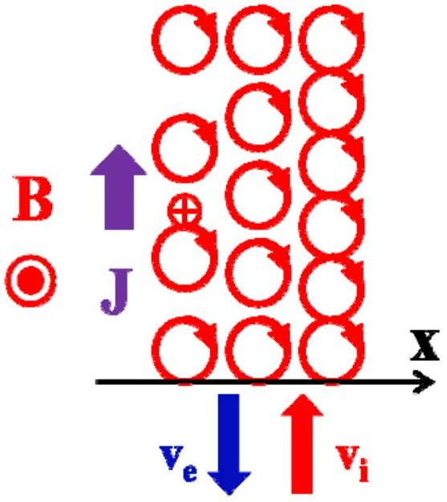
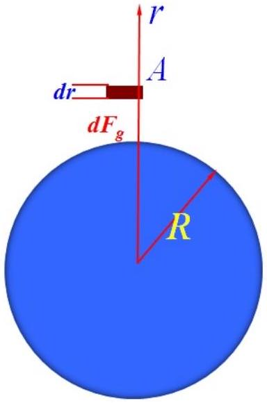

Suggested Solutions for Question 2

Solution for (a):
(i) The electron motion equation

$$
\begin{equation*}
m \frac { \mathrm {~d} \vec { v } } { \mathrm {~d} t } = - e \vec { v } \times \vec { B } . \tag{1}
\end{equation*}
$$

Let $\vec { \omega } _ { c } = - e \vec { B } / m$, we have

$$
\begin{equation*}
\frac { \mathrm { d } \vec { v } } { \mathrm {~d} t } = - \vec { \omega } _ { c } \times \vec { v } . \tag{2}
\end{equation*}
$$

Since $\vec { B } = B \hat { z }$, thus Equation (2) can be written to be

$$
\left\{ \begin{array} { c }
\frac { \mathrm { d } v _ { x } } { \mathrm {~d} t } = \omega _ { c } v _ { y }  \tag{3}\\
\frac { \mathrm {~d} v _ { y } } { \mathrm {~d} t } = - \omega _ { c } v _ { x } \\
\frac { \mathrm {~d} v _ { z } } { \mathrm {~d} t } = 0
\end{array} \right.
$$

The general solutions of Equation (3) are

$$
\left\{ \begin{array} { c }
v _ { x } = v _ { \perp } \cos \left( \omega _ { c } t + \varphi _ { y } \right)  \tag{4}\\
v _ { y } = v _ { \perp } \cos \left( \omega _ { c } t + \varphi _ { y } \right) , \\
v _ { z } = v _ { z } ( t = 0 )
\end{array} \right.
$$

where $\varphi _ { x , y }$ are the initial phases. Due to $v _ { z } ( t = 0 ) = 0$, it is indicated that the motion of an electron remains to be perpendicular to the magnetic field. By further solving Equation (4), we obtain the motion trajectory of the electron,

$$
\left\{ \begin{array} { c }
x = r _ { c } \sin \omega _ { c } t  \tag{5}\\
y = r _ { c } \cos \omega _ { c } t \\
z = 0
\end{array} , \right.
$$

or

$$
\left\{ \begin{array} { l }
x ^ { 2 } + y ^ { 2 } = r _ { c } ^ { 2 }  \tag{0.4point}\\
z = 0
\end{array} , \right.
$$

where $\left| r _ { c } \right| = \frac { v _ { \perp } } { \left| \omega _ { c } \right| } = \frac { m v _ { \perp } } { e B }$ is the gyro radius.

(ii) The electric current generated by the circular motion of an electron are

$$
\begin{equation*}
I = \frac { e } { T } = \frac { e \omega _ { c } } { 2 \pi } = \frac { e ^ { 2 } B } { 2 \pi m } . \tag{0.5point}
\end{equation*}
$$

Based on the definition of the magnetic moment, we have

$$
\begin{equation*}
\vec { \mu } = I \vec { A } = - \frac { e ^ { 2 } \vec { B } } { 2 \pi m } \times \pi r _ { c } ^ { 2 } = - \frac { e ^ { 2 } \vec { B } } { 2 \pi m } \times \frac { \pi m ^ { 2 } v _ { \perp } ^ { 2 } } { e ^ { 2 } B ^ { 2 } } = - \frac { m v _ { \perp } ^ { 2 } } { 2 B ^ { 2 } } \vec { B } . \tag{0.5point}
\end{equation*}
$$

(iii) In the case, we have $v _ { z } = v \cos \theta , v _ { \perp } = v \sin \theta$. Since the velocity of the electron in z is not zero, the solution (5) in (i) becomes

$$
\left\{ \begin{array} { l }
{ x = r _ { c } \operatorname { s i n } \omega _ { c } t }  \tag{6}\\
{ y = r _ { c } \operatorname { c o s } \omega _ { c } t } \\
{ z = v t \operatorname { c o s } \theta }
\end{array} , \text { or } \left\{ \begin{array} { l }
x ^ { 2 } + y ^ { 2 } = r _ { c } ^ { 2 } \\
z = v t \cos \theta
\end{array} . \right. \right.
$$

The orbit equation (6) indicates that the electron has a spiral trajectory. The screw pitch is

$$
\begin{equation*}
h = v _ { z } T = v \cos \theta \frac { 2 \pi } { \omega _ { c } } = 2 \pi \frac { m v } { e B } \cos \theta \tag{0.6point}
\end{equation*}
$$

Solution for (b):
(i) Since the magnetic field and the plasma are uniform $z$, the orbits of ions and electrons can project into in the x-y plane. From the results of (a), we know that an ion has a left-hand circular motion and an electron has a right-hand circular motion. Due to the linear increase of the plasma density in $x$, the number of ions with upward motion is less than that with downward motion at a given $x$ position, which leads a net upward ion flow. Similarly, electrons have a net downward flow. Combining the ion and election flows, we have a net upward electric current as illustrated below in schematic drawing.

(ii) Based on $\vec { \mu } = - \frac { m v _ { \perp } ^ { 2 } } { 2 B ^ { 2 } } \vec { B }$ from Problem (a), the total magnetic moments per unit volume (i.e., the magnetization) for ions and electrons are

$$
\begin{align*}
& M _ { i , e } = \iiint f _ { i , e } ( x , v ) \mu _ { i , e } \mathrm {~d} ^ { 3 } \vec { v } \\
& = - \int _ { 0 } ^ { \infty } \int _ { - \infty } ^ { \infty } n ( x ) \left( \frac { m _ { i , e } } { 2 \pi k T } \right) ^ { 3 / 2 } e ^ { - m _ { i , e } \left( v _ { \perp } ^ { 2 } + v _ { \sqcup } ^ { 2 } \right) / 2 k T } \frac { m _ { i , e } v _ { \perp } ^ { 2 } } { 2 B } 2 \pi v _ { \perp } \mathrm { d } v _ { \perp } \mathrm { d } v _ { \square } \\
& = - n ( x ) \int _ { 0 } ^ { \infty } \frac { m _ { i , e } } { 2 \pi k T } e ^ { - m _ { i , e } v _ { \perp } ^ { 2 } / 2 k T } \frac { m _ { i , e } v _ { \perp } ^ { 2 } } { 2 B } 2 \pi v _ { \perp } \mathrm { d } v _ { \perp } \mathrm { d } v _ { \square } ^ { \infty } \int _ { - \infty } ^ { \infty } \left( \frac { m _ { i , e } } { 2 \pi k T } \right) ^ { 1 / 2 } e ^ { - m _ { i , e } v ^ { 2 } / 2 k T } \mathrm {~d} v _ { \square } \\
& = - \frac { k T } { B } n ( x ) \tag{1.5point}
\end{align*}
$$

The total magnetization for a plasma:

$$
M = M _ { i } + M _ { e } = - \frac { 2 k T } { B } n ( x ) = - \frac { p ( x ) } { B }
$$

Therefore, we have

$$
\begin{equation*}
\beta = - 2 . \tag{0.5point}
\end{equation*}
$$

Solution for (c)
Using the equation for the magnetization field $B _ { m x } = \mu _ { o } M$ and the x component of the Earth's dipole magnetic field at $\left( x = 10 R _ { E } , y = 0 , z = 1 R _ { E } \right)$, we have

$$
\begin{equation*}
\left| B _ { m x } / B _ { d } \right| = \left. \mu _ { 0 } \frac { p ( z ) } { B _ { d } ^ { 2 } \left( 10 R _ { E } , 0 , z \right) } \right| _ { z = R _ { E } } = \frac { \mu _ { 0 } e ^ { - 0.25 } P _ { 0 } } { 28.5 \times 10 ^ { - 8 } B _ { 0 } ^ { 2 } } \approx 1.0 . \tag{1.0point}
\end{equation*}
$$

Solution for (d)
(i) Under the cylindrical coordinate system, the motion of an electron can project into the $r$ and $\theta$ plane, the Lorentz force is $F _ { z } = e v _ { \theta } B _ { r }$.

By taking a gyro average, the averaged Lorentz force becomes

$$
\begin{equation*}
\left\langle F _ { z } \right\rangle = \frac { 1 } { 2 } e v _ { \perp } r _ { c } \frac { d B } { d z } = - \mu \frac { d B } { d s } . \tag{1.0point}
\end{equation*}
$$

Since $\frac { d B } { d z } = \frac { d B } { d s }$, we have

$$
\left\langle F _ { \| } \right\rangle = \left\langle F _ { z } \right\rangle = - \mu \frac { d B } { d s } .
$$

The acceleration of the guiding center of the electron can be obtained by the Newton's law, i.e.,

$$
\begin{equation*}
m \frac { \mathrm {~d} v _ { \| } } { \mathrm { d } t } = - \mu \frac { d B } { d s } , \tag{7}
\end{equation*}
$$

where $v _ { \| } = \mathrm { d } s / \mathrm { d } t$. Equation (7) can be written to be

$$
\begin{equation*}
\frac { \mathrm { d } } { \mathrm {~d} t } \left( \frac { 1 } { 2 } m v _ { \| } ^ { 2 } \right) = - \mu \frac { \mathrm { d } B } { \mathrm {~d} t } . \tag{8}
\end{equation*}
$$

Since the total kinetic energy is conserved, i.e., $\frac { \mathrm { d } } { \mathrm { d } t } \left( \frac { 1 } { 2 } m v _ { / / } ^ { 2 } + \frac { 1 } { 2 } m v _ { \perp } ^ { 2 } \right) = 0$,
we can obtain

$$
\begin{equation*}
\mu \frac { \mathrm { d } B } { \mathrm {~d} t } = - \frac { \mathrm { d } } { \mathrm {~d} t } \left( \frac { 1 } { 2 } m v _ { / / } ^ { 2 } \right) = \frac { \mathrm { d } } { \mathrm {~d} t } \left( \frac { 1 } { 2 } m v _ { \perp } ^ { 2 } \right) = \frac { \mathrm { d } } { \mathrm {~d} t } ( \mu B ) = \mu \frac { \mathrm { d } B } { \mathrm {~d} t } + B \frac { \mathrm {~d} \mu } { \mathrm {~d} t } , \tag{9}
\end{equation*}
$$

Combining Equations (8) and (9), we get

$$
\begin{equation*}
\frac { \mathrm { d } \mu } { \mathrm {~d} t } = 0 . \tag{10}
\end{equation*}
$$

(ii) From the motion constant of the magnetic moment of an electron, the perpendicular velocity increases with increase of the magnetic field, which means the parallel velocity decreases due to the conservation of the total kinetic energy. When the electron arrives at the point " $\mathrm { P } _ { 3 }$ ", its parallel velocity decreases to zero, then the electron will not escape from the magnetic mirror field. Thus, the initial velocityshould be

$$
\begin{equation*}
\frac { v _ { \perp 0 } ^ { 2 } } { B _ { 0 } } \geq \frac { v ^ { 2 } } { B _ { m } } . \tag{0.5point}
\end{equation*}
$$

Since $v _ { \perp 0 } = v \sin \theta$, we obtain

$$
\begin{equation*}
\theta _ { c r } \geq \arcsin \left( \sqrt { \frac { B _ { 0 } } { B _ { m } } } \right) , \tag{0.5point}
\end{equation*}
$$

i.e., this is the condition for the electron confined in the magnetic mirror field.

## Solution for (e)

Since the guiding center of the electron motion is always confined in the $\mathrm { y } = 0$ plane, the Earth's dipole magnetic field $\vec { B } = \frac { B _ { 0 } R _ { E } ^ { 3 } } { r ^ { 5 } } \left( - 3 x z \hat { x } + \left( x ^ { 2 } - 2 z ^ { 2 } \right) \hat { z } \right)$. At the initial position $\left( 6 R _ { E } , 0,0 \right)$ of an electron, the magnetic field strength

$$
\begin{equation*}
B _ { i } = \frac { B _ { 0 } R _ { E } ^ { 3 } } { r ^ { 5 } } \left( x ^ { 2 } \right) = \frac { B _ { 0 } } { 216 } . \tag{0.2point}
\end{equation*}
$$

At the altitude $\mathrm { H } = 200 \mathrm {~km}$ and the latitude $\theta _ { L } = 60 ^ { \circ }$, thus

$$
\begin{equation*}
B _ { L } = \left( B _ { x } ^ { 2 } + B _ { z } ^ { 2 } \right) ^ { 1 / 2 } = \frac { \sqrt { 13 } } { 2 } B _ { 0 } . \tag{0.2point}
\end{equation*}
$$

With the same argument in (d) (ii), the condition for the electron to arrive in below the altitude $\mathrm { H } = 200 \mathrm {~km}$ with the latitude $\theta _ { L } = 60 ^ { \circ }$ is

$$
\begin{equation*}
\theta < 0.05 = 2.8 ^ { \circ } . \tag{0.6point}
\end{equation*}
$$

Solution for (f)
(i)

Based on the balance between the gravitational force and the force from the difference of the atmospheric pressure, we obtain

$$
A [ p ( r + d r ) - p ( r ) ] = A d p = - \frac { G M ( \rho A d r ) } { r ^ { 2 } }
$$

or

$$
\begin{equation*}
d p = - \frac { G M ( \rho d r ) } { r ^ { 2 } } . \tag{11}
\end{equation*}
$$

For the ideal gas, we have

$$
\begin{equation*}
p = \frac { N k T } { V } = \frac { N m k T } { V m } = \frac { \rho k T } { m } . \tag{12}
\end{equation*}
$$

Since the atmospheric temperature is constant, Equation (12) can written to be

$$
\begin{equation*}
p = \frac { p _ { 0 } } { \rho _ { 0 } } \rho . \tag{13}
\end{equation*}
$$

Inserting Equation (13) into (11), we have

$$
\begin{equation*}
\frac { d \rho } { \rho } = - \frac { \rho _ { 0 } G M d r } { p _ { 0 } } . \tag{14}
\end{equation*}
$$

By integrating Equation (14), we obtain

$$
\begin{equation*}
\rho = \rho _ { 0 } e ^ { \frac { \rho _ { 0 } G M } { P _ { 0 } } \left( \frac { 1 } { r } - \frac { 1 } { R _ { E } } \right) } = \rho _ { 0 } e ^ { - \frac { \rho _ { 0 } g R _ { E } } { P _ { 0 } } \left( 1 - \frac { R _ { E } } { r } \right) } \approx \rho _ { 0 } e ^ { - \frac { \rho _ { 0 } g H } { P _ { 0 } } } . \tag{15}
\end{equation*}
$$

Thus, the ration of the atmospheric density at the altitudes $\mathrm { H } = 160 \mathrm {~km}$ and $\mathrm { H } = 220 \mathrm {~km}$ is

$$
\begin{equation*}
\frac { \rho \left( H _ { 1 } = 160 \mathrm {~km} \right) } { \rho \left( H _ { 2 } = 220 \mathrm {~km} \right) } \approx e ^ { \frac { \rho _ { 0 } g \left( H _ { 2 } - H _ { 1 } \right) } { P _ { 0 } } } \approx 2.44 \times 10 ^ { 3 } . \tag{16}
\end{equation*}
$$

(ii) At the altitude $H = 160 \mathrm {~km}$, the collision frequency of atmosphericmolecules is

$$
\begin{equation*}
v = \frac { v _ { 0 } \rho } { \rho _ { 0 } } = v _ { 0 } e ^ { - \frac { \rho _ { 0 } g H } { P _ { 0 } } } \approx 0.93 / s . \tag{17}
\end{equation*}
$$

Since the lifetime of the oxygen atom in the first excited state lasts about 110s, the oxygen atom will collide with other molecules over one hundred times. Thus, the high-frequent collision between particles can de-excite oxygen atoms before they have a chance to radiate. But, the oxygen atoms in the second excited state will emit photons since their lifetime is so short. Thus, aurora at $\mathrm { H } = 160 \mathrm {~km}$ is resulted from emission of the oxygen atoms in the second excited state. The wavelength is

$$
\begin{equation*}
\lambda = \frac { h c } { e \Delta V } = \frac { \left( 6.626 \times 10 ^ { - 34 } \mathrm {~J} \cdot \mathrm {~s} \right) \left( 2.998 \times 10 ^ { 8 } \mathrm {~m} / \mathrm { s } \right) } { \left( 1.6 \times 10 ^ { - 19 } \mathrm {~J} / \mathrm { eV } \right) ( 2.21 \mathrm { eV } ) } = 562 \mathrm {~nm} . \tag{0.8point}
\end{equation*}
$$

The color for this wavelength is green.
At the altitude $H = 220 \mathrm {~km}$, the collision frequency of atmosphericmolecules is

$$
\begin{equation*}
v = \frac { v _ { 0 } \rho } { \rho _ { 0 } } = v _ { 0 } e ^ { - \frac { \rho _ { 0 } g H } { P _ { 0 } } } \approx 3.8 \times 10 ^ { - 4 } / s . \tag{18}
\end{equation*}
$$

All oxygen atoms in the first and second excited states have a chance to radiate since the collision frequency is so low. Because the number of the oxygen atoms in the first excited state is much larger than in the second excited state, we observe the aurora color is from the emission of the oxygen atoms in the first excited state. The wavelength is

$$
\begin{equation*}
\lambda = \frac { h c } { e \Delta V } = \frac { \left( 6.626 \times 10 ^ { - 34 } J \cdot s \right) \left( 2.998 \times 10 ^ { 8 } m / s \right) } { \left( 1.6 \times 10 ^ { - 19 } J / e V \right) ( 1.96 e V ) } = 633 \mathrm {~nm} . \tag{0.8point}
\end{equation*}
$$

The color for this wavelength is red.
(0.2point)

Solution for (g)
At the geosynchronous orbit, we have

$$
G \frac { m M } { \left( h + R _ { E } \right) ^ { 2 } } = m \frac { v ^ { 2 } } { h + R _ { E } } = m \left( h + R _ { E } \right) \omega ^ { 2 } .
$$

or

$$
\left( h + R _ { E } \right) ^ { 3 } = \frac { G M } { \omega ^ { 2 } } = \frac { g R _ { E } ^ { 2 } } { \omega ^ { 2 } } = \frac { g } { \omega ^ { 2 } R _ { E } } R _ { E } ^ { 3 } .
$$

Using $\omega = 2 \pi / ( 24 \times 3600 s )$, we have

$$
\begin{equation*}
h = 5.6 R _ { E } . \tag{0.5point}
\end{equation*}
$$

Using $\Delta w = F \Delta x = \Delta E _ { k }$, we have

$$
\left( f _ { m } - f _ { s } \right) \Delta s \Delta x = \frac { 1 } { 2 } \Delta m v _ { s } ^ { 2 } .
$$

or

$$
\begin{equation*}
\frac { 1 } { 2 } \rho v _ { s } ^ { 2 } + \frac { B _ { s } ^ { 2 } } { 2 \mu _ { 0 } } = \frac { B _ { m } ^ { 2 } } { 2 \mu _ { 0 } } . \tag{19}
\end{equation*}
$$

where $\rho$ is the mass density. At the position $x = R _ { E } + h = 6.6 R _ { E } , y = z = 0$, the Earth's dipole magnetic field strength is

$$
B _ { d } = \frac { B _ { 0 } } { 290 } \sim 100 n T
$$

From Equation (19), we obtain

$$
\begin{equation*}
v = 330 \mathrm {~km} / \mathrm { s } . \tag{0.5point}
\end{equation*}
$$

With this speed of the solar wind, the position of the dayside magetopause is $6.6 \mathrm { R } _ { \mathrm { E } }$ at the geosynchronous orbit. Thus, a geosynchronous satellite could be damaged by the solar wind.
