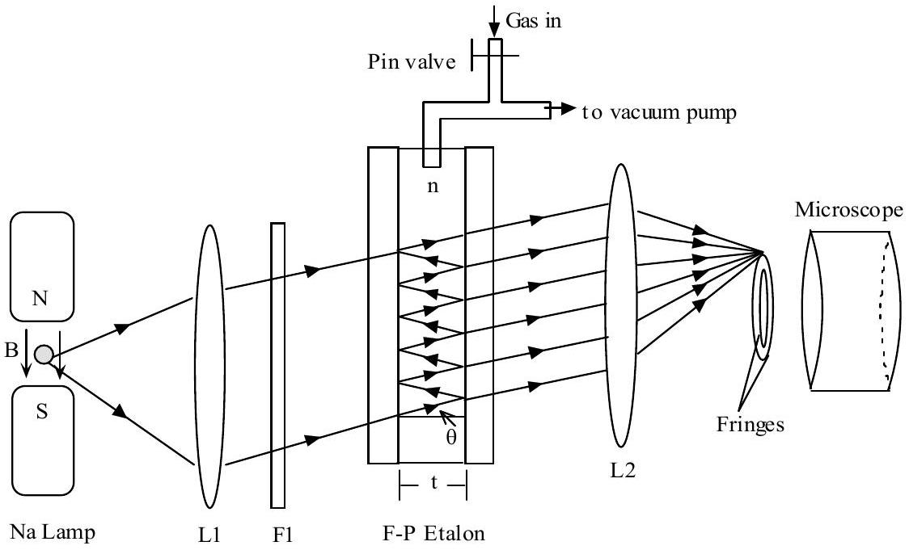
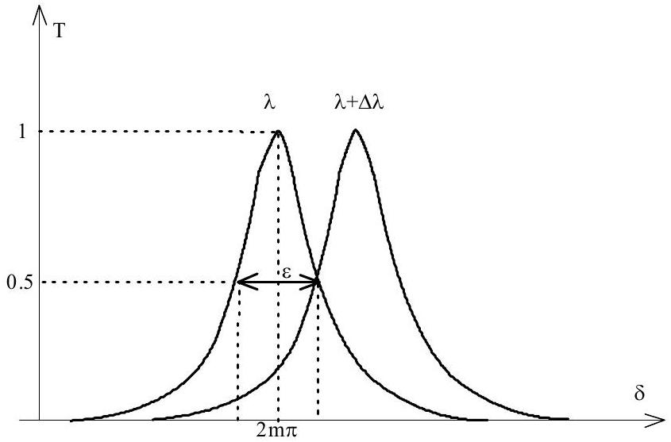
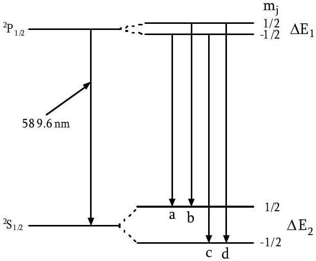
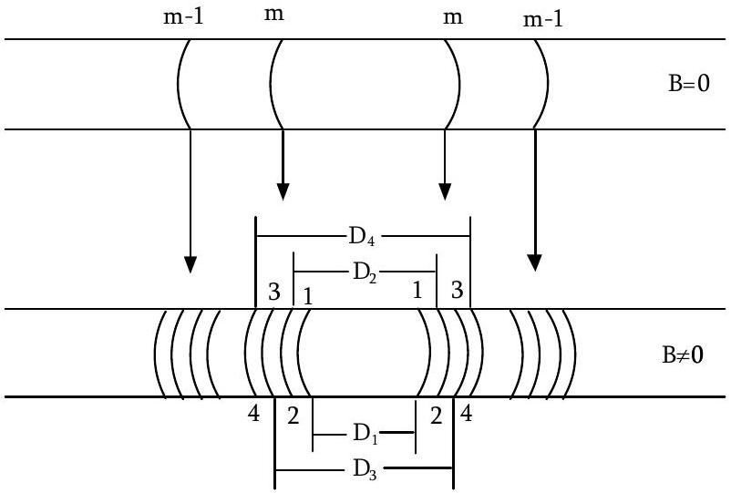

Solution for Question 3

Figure 1 shows a Fabry-Perot (F-P) etalon, in which air pressure is tunable. The F-P etalon consists of two glass plates with high-reflectivity inner surfaces. The two plates form a cavity in which light can be reflected back and forth. The outer surfaces of the plates are generally not parallel to the inner ones and do not affect the back-and-forth reflection. The air density in the etalon can be controlled. Light from a Sodium lamp is collimated by the lens L1 and then passes through the F-P etalon. The transmitivity of the etalon is given by $T = \frac { 1 } { 1 + F \sin ^ { 2 } ( \delta / 2 ) }$, where $F = \frac { 4 R } { ( 1 - R ) ^ { 2 } }$, R is the reflectivity of the inner surfaces, $\delta = \frac { 4 \pi n t \cos \theta } { \lambda }$ is the phase shift of two neighboring rays, n is the refractive index of the gas, t is the spacing of inner surfaces, $\theta$ is the incident angle, and $\lambda$ is the light wavelength.

Figure 1

The Sodium lamp emits D1 $( \lambda = 589.6 n m )$ and D2 $( 589 n m )$ spectral lines and is located in a tunable uniform magnetic field. For simplicity, an optical filter F1 is assumed to only allow the D1 line to pass through. The D1 line is then collimated to the F-P etalon by the lens L1. Circular interference fringes will be present on the focal plane of the lens L2 with a focal length $\mathrm { f } = 30 \mathrm {~cm}$. Different fringes have the different incident angle $\theta$. A microscope is used to observe the fringes. We take the reflectivity $\mathrm { R } = 90 \%$ and the inner-surface spacing $\mathrm { t } = 1 \mathrm {~cm}$.

Some useful constants : $h = 6.626 \times 10 ^ { - 34 } \mathrm {~J} \cdot \mathrm {~s} , e = 1.6 \times 10 ^ { - 19 } \mathrm { C } , m _ { e } = 9.1 \times 10 ^ { - 31 } \mathrm {~kg} , c = 3.0 \times 10 ^ { 8 } \mathrm {~ms} ^ { - 1 }$.

Solution for Question 3
(a) (3points) The D1 line $( \lambda = 589.6 n m )$ is collimated to the F-P etalon. For the vacuum case ( $\mathrm { n } = 1.0$ ), please calculate (i) interference orders $m _ { i }$, (ii) incidence angle $\theta _ { i }$ and (iii) diameter $D _ { i }$ for the first three $( \mathrm { i } = 1,2,3 )$ fringes from the center of the ring patterns on the focal plane.

Solution:
The transmittivity of the F-P etalon is given by:

$$
T = \frac { 1 } { 1 + F \sin ^ { 2 } \frac { \delta } { 2 } }
$$

For bright fringes, we have

$$
\begin{aligned}
& T = 1 \text { i.e. } \sin ^ { 2 } \frac { \delta } { 2 } = 0 \\
& \frac { \delta } { 2 } = m \pi \\
& 2 n t \cos \theta = m \lambda
\end{aligned}
$$

For $\mathrm { n } = 1.0 , \mathrm { t } = 1 \mathrm {~cm} , \lambda = 589.6 n m$, thus:

$$
\begin{equation*}
\cos \theta _ { i } = \frac { m _ { i } } { 2 n t / \lambda } = \frac { m _ { i } } { 33921.3 } \tag{a1}
\end{equation*}
$$

Because of $\cos \theta \leq 1$, so the orders of the first three fringes are:

$$
\begin{equation*}
m _ { 1 } = 33921 , m _ { 2 } = 33920 , m _ { 3 } = 33919 \tag{a2}
\end{equation*}
$$

The incident angles of the first three fringes are:

$$
\begin{equation*}
\theta _ { 1 } = 0.241 ^ { 0 } , \theta _ { 2 } = 0.502 ^ { 0 } , \theta _ { 3 } = 0.667 ^ { 0 } \tag{a3}
\end{equation*}
$$

The fringe diameter is given by:

$$
\begin{equation*}
D _ { i } = 2 f \tan \theta _ { i } \approx 2 f \theta _ { i } \tag{a4}
\end{equation*}
$$

For the focal length $\mathrm { f } = 30 \mathrm {~cm}$, thus:

$$
D _ { 1 } = 2.52 \mathrm {~mm} , D _ { 2 } = 5.26 \mathrm {~mm} , D _ { 3 } = 6.99 \mathrm {~mm} \text { (a5) (1 point) }
$$

Solution for Question 3

(b) (3 points) As shown in Fig. 2, the width $\varepsilon$ of the spectral line is defined as the full width of half maximum (FWHM) of light transmitivity T regarding the phase shift $\delta$. The resolution of the F-P etalon is defined as follows: for two wavelengths $\lambda$ and $\lambda + \Delta \lambda$, when the central phase difference $\Delta \delta$ of both spectral lines is larger than $\varepsilon$, they are thought to be resolvable; then the etalon resolution is $\lambda / \Delta \lambda$ when $\Delta \delta = \varepsilon$. For the vacuum case, the D1 line $( \lambda = 589.6 n m )$, and because of the incident angle $\theta \approx 0$, take $\cos \theta \approx 1.0$, please calculate:
(i) the width $\varepsilon$ of the spectral line.
(ii) the resolution $\lambda / \Delta \lambda$ of the etalon.

Figure 2

Solution:
The half maximum occurs at:

$$
\delta = 2 m \pi \pm \frac { \varepsilon } { 2 } \quad ( \mathrm {~b} 1 ) \quad ( 0.2 \text { point if Eq.(b3) is wrong.) }
$$

Given that $T = 0.5$, thus:

$$
F \sin ^ { 2 } \frac { \delta } { 2 } = 1 \text { (b2) ( } 0.2 \text { point if Eq.(b3) is wrong.) }
$$

$\varepsilon = \frac { 4 } { \sqrt { F } } = \frac { 2 ( 1 - R ) } { \sqrt { R } } = \frac { 2 ( 1 - 0.9 ) } { \sqrt { 0.9 } } = 0.21 \operatorname { rad } ($ or 12.03 degree $) \quad ($ b $3 ) \quad ( 1$ point $)$
The phase shift $\delta$ is given by:

$$
\delta = \frac { 4 \pi n t \cos \theta } { \lambda }
$$

For a small $\Delta \lambda$, thus:

$$
\Delta \delta = - \frac { 4 \pi n t \cos \theta } { \lambda ^ { 2 } } \Delta \lambda \quad ( \mathbf { b } 4 ) \quad \text { (1 point if Eq. (b5) is wrong.) }
$$

For $\Delta \delta = \varepsilon$ and $\lambda = 589.6 n m$, we get:

$$
\frac { \lambda } { \Delta \lambda } = \frac { \pi n t \sqrt { F } \cos \theta } { \lambda } = \frac { 3.14 \times 1.0 \times 1.0 \times 10 ^ { - 2 } \times \sqrt { 360 } \times 1.0 } { 589.6 \times 10 ^ { - 9 } } = 1.01 \times 10 ^ { 6 } ( \mathrm {~b} 5 ) ( \text { 2 points } )
$$

( $\mathbf { 1 . 5 }$ point if the final value of Eq. (b5) is wrong.)

Solution for Question 3
(c) (1 point) As shown in Fig. 1, the initial air pressure is zero. By slowly tuning the pin valve, air is gradually injected into the F-P etalon and finally the air pressure reaches the standard atmospheric pressure. On the same time, ten new fringes are observed to produce from the center of the ring patterns on the focal plane. Based on this phenomenon, calculate the refractive index of air $n _ { \text {air } }$ at the standard atmospheric pressure.

Solution:
From Question (a), we know that the order of the 1st fringe near the center of ring patterns is $\mathrm { m } = 33921$ at the vacuum case $( \mathrm { n } = 1.0 )$. When the air pressure reaches the standard atmospheric pressure, the order of the 1st fringe becomes $\mathrm { m } + 10$, so we have:

$$
n _ { \text {air } } = \frac { m + 10 } { 2 t / \lambda } = \frac { 33931 } { 33921 } = 1.00029 \text {.(c1) (1 point) }
$$

( 0.2 point for appearing the term of ( $m + 10$ ) when the final value of Eq.(c1) is wrong.
Or
0.8 point for the correct final expression (including other correct forms) without the correct value.)

Solution for Question 3
(d) (2 points) Energy levels splitting of Sodium atoms occurs when they are placed in a magnetic field. This is called as the Zeeman effect. The energy shift given by $\Delta E = m _ { j } g _ { k } \mu _ { B } B$, where the quantum number $\mathrm { m } _ { \mathrm { j } }$ can be $\mathrm { J } , \mathrm { J } - 1 , \ldots , - \mathrm { J } + 1 , - \mathrm { J } , \mathrm { J }$ is the total angular quantum number, $\mathrm { g } _ { \mathrm { k } }$ is the Landé factor, $\mu _ { B } = \frac { h e } { 4 \pi m _ { e } }$ is Bohr magneton, h is the Plank constant, e is the electron charge, $m _ { e }$ is the electron mass, B is the magnetic field. As shown in Fig. 3, the D1 spectral line is emitted when Sodium atoms jump from the energy level ${ } ^ { 2 } \mathrm { P } _ { 1 / 2 }$ down to ${ } ^ { 2 } \mathrm {~S} _ { 1 / 2 }$. We have $J = \frac { 1 } { 2 }$ for both ${ } ^ { 2 } \mathrm { P } _ { 1 / 2 }$ and ${ } ^ { 2 } \mathrm {~S} _ { 1 / 2 }$. Therefore, in the magnetic field, each energy level will be split into two levels. We define the energy gap of two splitting levels as $\Delta \mathrm { E } _ { 1 }$ for ${ } ^ { 2 } \mathrm { P } _ { 1 / 2 }$ and $\Delta \mathrm { E } _ { 2 }$ for ${ } ^ { 2 } \mathrm {~S} _ { 1 / 2 }$ respectively ( $\Delta \mathrm { E } _ { 1 }$ $< \Delta \mathrm { E } _ { 2 }$ ). As a result, the D1 line is split into 4 spectral lines (a, b, c, and d), as showed in Fig. 3. Please write down the expression of the frequency $( v )$ of four lines $\mathrm { a } , \mathrm { b } , \mathrm { c }$, and d .

Figure 3

Solution:
The frequency of D1 line $\left( { } ^ { 2 } \mathrm { P } _ { 1 / 2 } \right.$ to $\left. { } ^ { 2 } \mathrm {~S} _ { 1 / 2 } \right)$ is given by: $v _ { 0 } = c / \lambda ( \lambda = 589.6 \mathrm {~nm} )$
When magnetic field B is applied, the frequency of the line a,b,c,d are expressed as:

1) ${ } ^ { 2 } \mathrm { P } _ { 1 / 2 } ( \mathrm { mj } = - 1 / 2 ) \rightarrow { } ^ { 2 } \mathrm {~S} _ { 1 / 2 } ( \mathrm { mj } = 1 / 2 )$ : frequency of (a) ): $v _ { a } = v _ { 0 } - \frac { 1 } { 2 h } \left( \Delta E _ { 1 } + \Delta E _ { 2 } \right)$; (0.5 point)
2) ${ } ^ { 2 } \mathrm { P } _ { 1 / 2 } ( \mathrm { mj } = 1 / 2 ) \rightarrow { } ^ { 2 } \mathrm {~S} _ { 1 / 2 } ( \mathrm { mj } = 1 / 2 )$ : frequency of (b): $v _ { b } = v _ { 0 } - \frac { 1 } { 2 h } \left( \Delta E _ { 2 } - \Delta E _ { 1 } \right)$; (0.5 point)
3) ${ } ^ { 2 } \mathrm { P } _ { 1 / 2 } ( \mathrm { mj } = - 1 / 2 ) \rightarrow { } ^ { 2 } \mathrm {~S} _ { 1 / 2 } ( \mathrm { mj } = - 1 / 2 )$ : frequency of (c): $v _ { c } = v _ { 0 } + \frac { 1 } { 2 h } \left( \Delta E _ { 2 } - \Delta E _ { 1 } \right)$; (0.5 point)
4) ${ } ^ { 2 } \mathrm { P } _ { 1 / 2 } ( \mathrm { mj } = 1 / 2 ) \rightarrow { } ^ { 2 } \mathrm {~S} _ { 1 / 2 } ( \mathrm { mj } = - 1 / 2 )$ : frequency of (d): $v _ { d } = v _ { 0 } + \frac { 1 } { 2 h } \left( \Delta E _ { 1 } + \Delta E _ { 2 } \right)$; (0.5 point)
(The results maybe have other correct forms.
But, 0.4 point for each result without the coefficient of 1/2.)

Solution for Question 3
(e) (3 points) As shown in Fig. 4, when the magnetic field is turned on, each fringe of the D1 line will split into four sub-fringes (1, 2, 3, and 4). The diameter of the four sub-fringes near the center is measured as $D _ { 1 } , D _ { 2 } , D _ { 3 }$, and $D _ { 4 }$. Please give the expression of the splitting energy gap $\Delta \mathrm { E } _ { 1 }$ of ${ } ^ { 2 } \mathrm { P } _ { 1 / 2 }$ and $\Delta \mathrm { E } _ { 2 }$ of ${ } ^ { 2 } \mathrm {~S} _ { 1 / 2 }$.

Figure 4

Solution: $\quad \theta _ { m } \ll 1 , \cos \theta _ { m } = 1 - \frac { \theta _ { m } ^ { 2 } } { 2 }$, (e1) (0.2point if Eq. (e4) is wrong.)

$$
\begin{align*}
& \quad 2 n t \cos \theta _ { m } = m \lambda , \quad 1 - \frac { \theta _ { m } ^ { 2 } } { 2 } = \frac { m \lambda } { 2 n t } , \quad \text { (e2) (0.2point if Eq. (e4) is wrong.) }  \tag{e2}\\
& \lambda \rightarrow \lambda + \Delta \lambda , \theta _ { m } \rightarrow \theta _ { m } ^ { \prime } \\
& 1 - \frac { \theta _ { m } ^ { \prime 2 } } { 2 } = \frac { m ( \lambda + \Delta \lambda ) } { 2 n t } \\
& \frac { \theta _ { m } ^ { 2 } - \theta _ { m } ^ { \prime 2 } } { 2 } = \frac { m \Delta \lambda } { 2 n t } \quad ( \mathrm { e } 3 ) ( \mathbf { 0 . 2 p o i n t } \text { if Eq. (e4) is wrong.) }  \tag{e3}\\
& 2 f \theta _ { m } = D _ { m } , \quad \frac { D _ { m } ^ { 2 } - D _ { m } ^ { \prime 2 } } { 8 f ^ { 2 } } = \frac { m \Delta \lambda } { 2 n t } = \frac { \Delta \lambda } { \lambda } \\
& \Delta \lambda = \lambda \frac { D _ { m } ^ { 2 } - D _ { m } ^ { \prime 2 } } { 8 f ^ { 2 } } \tag{e4}
\end{align*}
$$

The lines a, b, c, and d correspond to sub-fringe 1, 2, 3, and 4. From Question (d), we have. The wavelength difference of the spectral line a and b is given by:

$$
\Delta \lambda _ { 1 } = \lambda \frac { D _ { 2 } ^ { 2 } - D _ { 1 } ^ { 2 } } { 8 f ^ { 2 } }
$$

Solution for Question 3

$$
\begin{align*}
& \Delta E _ { 1 } = h \left( v _ { b } - v _ { a } \right) , \Delta E _ { 2 } = h \left( v _ { d } - v _ { b } \right) \\
& \text { or } \Delta E _ { 1 } = h \left( v _ { d } - v _ { c } \right) , \Delta E _ { 2 } = h \left( v _ { c } - v _ { a } \right) \tag{e5}
\end{align*}
$$

(0.5 point for each subequation in Eq (e5) if Eqs. (e6) and (e7) are totally wrong.)

The wavelength difference of the spectral line a and b is given by:

$$
\Delta \lambda _ { 1 } = \lambda \frac { D _ { 2 } ^ { 2 } - D _ { 1 } ^ { 2 } } { 8 f ^ { 2 } }
$$

Then we obtain

$$
\begin{align*}
& \Delta E _ { 1 } = h \Delta v _ { 1 } = \left| - \frac { h c } { \lambda } \bullet \frac { D _ { 2 } ^ { 2 } - D _ { 1 } ^ { 2 } } { 8 f ^ { 2 } } \right| = \frac { h c } { \lambda } \bullet \frac { D _ { 2 } ^ { 2 } - D _ { 1 } ^ { 2 } } { 8 f ^ { 2 } } \\
& \left( \text { or } \Delta E _ { 1 } = h \Delta v _ { 1 } = \left| - \frac { h c } { \lambda } \bullet \frac { D _ { 4 } ^ { 2 } - D _ { 3 } ^ { 2 } } { 8 f ^ { 2 } } \right| = \frac { h c } { \lambda } \bullet \frac { D _ { 4 } ^ { 2 } - D _ { 3 } ^ { 2 } } { 8 f ^ { 2 } } \right) \tag{e6}
\end{align*}
$$

Similarly, for $\Delta \mathrm { E } _ { 2 }$, we get

$$
\begin{align*}
& \Delta \lambda _ { 2 } = \lambda \frac { D _ { 4 } ^ { 2 } - D _ { 2 } ^ { 2 } } { 8 f ^ { 2 } } \\
& \Delta E _ { 2 } = h \Delta v _ { 2 } = \left| - \frac { h c } { \lambda } \bullet \frac { D _ { 4 } ^ { 2 } - D _ { 2 } ^ { 2 } } { 8 f ^ { 2 } } \right| = \frac { h c } { \lambda } \bullet \frac { D _ { 4 } ^ { 2 } - D _ { 2 } ^ { 2 } } { 8 f ^ { 2 } } \\
& \left( \text { or } \Delta E _ { 1 } = h \Delta v _ { 1 } = \left| - \frac { h c } { \lambda } \bullet \frac { D _ { 3 } ^ { 2 } - D _ { 1 } ^ { 2 } } { 8 f ^ { 2 } } \right| = \frac { h c } { \lambda } \bullet \frac { D _ { 3 } ^ { 2 } - D _ { 1 } ^ { 2 } } { 8 f ^ { 2 } } \right) \tag{e7}
\end{align*}
$$

(Eqs (e6 and e7) have other correct forms which should be in terms of $D _ { 1 } , D _ { 2 } , D _ { 3 }$, and $D _ { 4 }$ ) (2.5 points for the final expressions only with the incorrect coefficients. )

Solution for Question 3

(f) (3 points) For the magnetic field $\mathrm { B } = 0.1 \mathrm {~T}$, the diameter of four sub-fringes is measured as: $D _ { 1 } = 3.88 \mathrm {~mm} , D _ { 2 } = 4.05 \mathrm {~mm} , D _ { 3 } = 4.35 \mathrm {~mm}$, and $D _ { 4 } = 4.51 \mathrm {~mm}$. Please calculate the Landé factor $\mathrm { g } _ { \mathrm { k } 1 }$ of ${ } ^ { 2 } \mathrm { P } _ { 1 / 2 }$ and $\mathrm { g } _ { \mathrm { k } 2 }$ of ${ } ^ { 2 } \mathrm {~S} _ { 1 / 2 }$.

Solution:
Given that $\mathrm { B } = 0.1 \mathrm {~T}$, so we have:

$$
\mu _ { B } B = \frac { h e B } { 4 \pi m _ { e } } = \frac { 6.626 \times 10 ^ { - 34 } \times 0.1 } { 4 \times 3.14 \times 9.1 \times 10 ^ { - 31 } } = 5.79 \times 10 ^ { - 6 } e V \quad ( \mathrm { f } 1 ) ( \mathbf { 0 . 2 p o i n t } \text { if Eq. (f4) is wrong.) }
$$

$$
\begin{equation*}
\Delta E _ { 1 } = g _ { k 1 } \mu _ { b } B = \frac { h c } { \lambda } \bullet \frac { D _ { 2 } ^ { 2 } - D _ { 1 } ^ { 2 } } { 8 f ^ { 2 } } ; \tag{f2}
\end{equation*}
$$

(or, $\Delta E _ { 1 } = g _ { k 1 } \mu _ { b } B = \frac { h c } { \lambda } \bullet \frac { D _ { 4 } ^ { 2 } - D _ { 3 } ^ { 2 } } { 8 f ^ { 2 } }$ ) (0.5point if Eq. (f4) is wrong.)
For the D1 spectral line, $\lambda = 589.6 n m$, so we can get:

$$
\frac { h c } { \lambda } = \frac { 6.626 \times 10 ^ { - 34 } \times 3 \times 10 ^ { 8 } } { 5.896 \times 10 ^ { - 7 } \times 1.6 \times 10 ^ { - 19 } } = 2.11 \mathrm { eV } , \quad ( \mathrm { f } 3 ) \quad ( \mathbf { 0 . 2 p o i n t } \text { if } \mathbf { E q . } ( \mathbf { f 4 } ) \text { is wrong.) }
$$

thus:

$$
\begin{equation*}
g _ { k 1 } = \frac { 2.11 } { 5.79 \times 10 ^ { - 6 } } \bullet \frac { D _ { 2 } ^ { 2 } - D _ { 1 } ^ { 2 } } { 8 f ^ { 2 } } = \frac { 2.11 } { 5.79 \times 10 ^ { - 6 } } \bullet \frac { \left( 4.05 \times 10 ^ { - 3 } \right) ^ { 2 } - \left( 3.88 \times 10 ^ { - 3 } \right) ^ { 2 } } { 8 \times 0.3 \times 0.3 } = 0.68 ; \tag{1.5points}
\end{equation*}
$$

$\left( \right.$ or $\left. g _ { k 1 } = \frac { 2.11 } { 5.79 \times 10 ^ { - 6 } } \bullet \frac { D _ { 4 } ^ { 2 } - D _ { 3 } ^ { 2 } } { 8 f ^ { 2 } } = \frac { 2.11 } { 5.79 \times 10 ^ { - 6 } } \bullet \frac { \left( 4.51 \times 10 ^ { - 3 } \right) ^ { 2 } - \left( 4.35 \times 10 ^ { - 3 } \right) ^ { 2 } } { 8 \times 0.3 \times 0.3 } = 0.72 \right)$
Similarly, we get:

$$
g _ { k 2 } = \frac { 2.11 } { 5.79 \times 10 ^ { - 6 } } \bullet \frac { D _ { 4 } ^ { 2 } - D _ { 2 } ^ { 2 } } { 8 f ^ { 2 } } = \frac { 2.11 } { 5.79 \times 10 ^ { - 6 } } \bullet \frac { \left( 4.51 \times 10 ^ { - 3 } \right) ^ { 2 } - \left( 4.05 \times 10 ^ { - 3 } \right) ^ { 2 } } { 8 \times 0.3 \times 0.3 } = 1.99 \text { (1.5 points) }
$$

(or $g _ { k 2 } = \frac { 2.11 } { 5.79 \times 10 ^ { - 6 } } \bullet \frac { D _ { 3 } ^ { 2 } - D _ { 1 } ^ { 2 } } { 8 f ^ { 2 } } = \frac { 2.11 } { 5.79 \times 10 ^ { - 6 } } \bullet \frac { \left( 4.35 \times 10 ^ { - 3 } \right) ^ { 2 } - \left( 3.88 \times 10 ^ { - 3 } \right) ^ { 2 } } { 8 \times 0.3 \times 0.3 } = 1.95$ )
(2 points for the correct final expressions if the final values are wrong.)
(*Comment: the theory value of $\boldsymbol { g } _ { k 1 }$ and $\boldsymbol { g } _ { k 2 }$ is $\mathbf { 2 } / \mathbf { 3 }$ and $\mathbf { 2 }$ )

Solution for Question 3
(g) (2 points) The magnetic field on the sun can be determined by measuring the Zeeman effect of the Sodium D1 line on some special regions of the sun. One observes that, in the four split lines, the wavelength difference between the shortest and longest wavelength is 0.012nm by a solar spectrograph. What is the magnetic field B in this region of the sun?

Solution:
We have $\Delta E _ { 1 } = g _ { k 1 } \mu _ { B } B$ and $\Delta E _ { 2 } = g _ { k 2 } \mu _ { B } B$;

The line a has the longest wavelength and the line d has the shortest wavelength line. The energy difference of the line a and d is

$$
\begin{array} { l l }
\Delta E = \Delta E _ { 1 } + \Delta E _ { 2 } = \left( g _ { k 1 } + g _ { k 2 } \right) \mu _ { B } B . ( \mathrm { g } 1 ) & ( 0.5 \text { point if Eq. } ( \mathrm { g } 3 ) \text { is wrong. } ) ) \\
\Delta v = \left| - \frac { c \Delta \lambda } { \lambda ^ { 2 } } \right| = \frac { c \Delta \lambda } { \lambda ^ { 2 } } & ( \mathrm {~g} 2 ) ( 0.5 \text { point } ) \\
\Delta v = \frac { \left( g _ { k 1 } + g _ { k 2 } \right) \mu _ { B } B } { h } & ( \mathrm {~g} 3 ) ( 0.5 \text { point } )  \tag{g3}\\
\mu _ { B } = \frac { h e } { 4 \pi m _ { e } } &
\end{array}
$$

So the magnetic field B is given by:

$$
\begin{aligned}
& B = \frac { 4 \pi m _ { e } \Delta \lambda c } { \lambda ^ { 2 } \left( g _ { k 1 } + g _ { k 2 } \right) e } \\
& = \frac { 4 \times 3.14 \times 9.1 \times 10 ^ { - 31 } \times 0.012 \times 10 ^ { - 9 } \times 3 \times 10 ^ { 8 } } { \left( 589.6 \times 10 ^ { - 9 } \right) ^ { 2 } \times 2.67 \times 1.6 \times 10 ^ { - 19 } } T
\end{aligned}
$$

(g4) (1 point)

$$
\begin{aligned}
& = 0.2772 T \\
& = 2772.1 \text { Gauss }
\end{aligned}
$$

( 0.5 point if the first line in Eq (g4) is correct.)

Solution for Question 3
(h) (3 points) A Light- Emitting Diode (LED) source with a central wavelength $\lambda = 650 n m$ and spectral width $\Delta \lambda = 20 n m$ is normally incident $( \theta = 0 )$ into the F-P etalon shown in Fig. 1. For the vacuum case, find (i) the number of lines in transmitted spectrum and (ii) the frequency width $\Delta v$ of each line?

Solution:
The wavelength of transmitted spectral lines is given by:

$$
\begin{align*}
& 2 n t = m \lambda _ { m } \quad ( \mathrm {~h} 1 ) ( \mathbf { 0 . 5 } \text { point if Eq. (h2) is wrong.) } \\
& v _ { m } = \frac { c } { \lambda _ { m } } \\
& v _ { m } = \frac { m c } { 2 n t } \\
& \Delta v _ { m } = \frac { c } { 2 n t } = 1.5 \times 10 ^ { 10 } \mathrm {~Hz} \quad ( \mathrm {~h} 2 ) ( \mathbf { 1 } \text { point } ) \tag{h2}
\end{align*}
$$

The frequency width of the input LED is:

$$
\begin{align*}
& \Delta v _ { s } = \left| - \frac { c \Delta \lambda } { \lambda ^ { 2 } } \right|  \tag{h3}\\
& = \frac { 3 \times 10 ^ { 8 } \times 20 \times 10 ^ { - 9 } } { \left( 650 \times 10 ^ { - 9 } \right) ^ { 2 } } = 1.42 \times 10 ^ { 13 } \mathrm {~Hz}
\end{align*}
$$

(0.5point if the first line in Eq. (h3) is correct.)
So we have the number of transmitted spectral line:

$$
\begin{align*}
& N = \frac { \Delta v _ { s } } { \Delta v _ { m } }  \tag{h4}\\
& = \frac { 1.42 \times 10 ^ { 13 } } { 1.5 \times 10 ^ { 10 } } = 946
\end{align*}
$$

( 0.5 point if the first line in Eq. (h4) is correct.)
The spectral width of transmitted spectral line is $\Delta \lambda = \frac { \lambda ^ { 2 } } { \pi n t \sqrt { F } }$, then we have

$$
\begin{align*}
& \Delta v = \frac { c } { \pi n t \sqrt { F } }  \tag{h5}\\
& = \frac { 3 \times 10 ^ { 8 } } { 3.14 \times 1.0 \times 10 \times 10 ^ { - 3 } \times \sqrt { 360 } } = 5.0 \times 10 ^ { 8 } \mathrm {~Hz}
\end{align*}
$$

(0.5point if the first line in Eq. (h5) is correct.)
