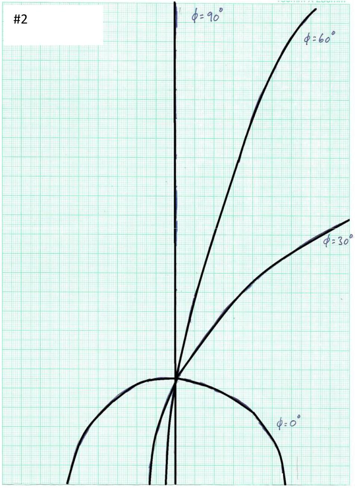
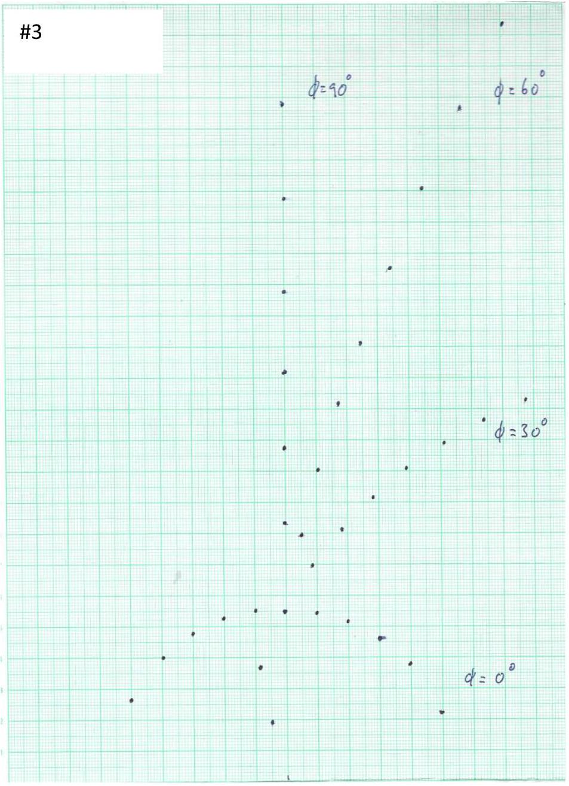
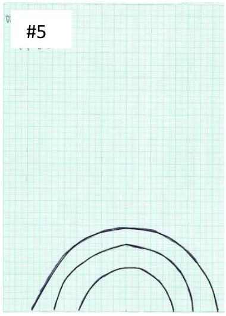
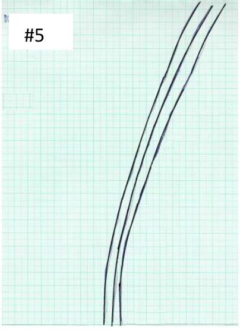

(Full Mark = 12 points)
Part A: Alignment of the setup

| Tasks |  | Mark |
| :--- | :--- | :--- |
| A1 | Measure the height of the "zero-order spot" $h$, from the origin of the $\boldsymbol { x }$-axis.   Determine the incident angle $\boldsymbol { \theta }$ of the laser beam from $\boldsymbol { D }$ and $\boldsymbol { h }$. Write down the values of $\boldsymbol { h }$ in $\mathbf { c m }$ and $\boldsymbol { \theta }$ in degrees to three significant figures in the corresponding table in the answer sheet.   Solution:   The height of the "zero-order spot" is measured to be $h = 5.50$ cm. Using trigonometry, $\begin{gathered} h = D \tan \theta \\ \theta = \tan ^ { - 1 } \left( \frac { h } { D } \right) \end{gathered}$   As $h = 5.5 \mathrm {~cm}$ and $D = 15 \mathrm {~cm}$, one can then fill in the table as follows:$h$ 5.50 cm   $\boldsymbol { \theta }$ 20.1° | TOTAL = 0.6 points   A1.1   0.2 points for measuring the correct height (between 5.40 cm to 5.60 cm )   A1.2   0.2 points for using the correct equation for determining $\theta$   A1.3   0.2 points for the correct value of $\theta$ (0.2 points: $\theta$ is between $19.7 ^ { \circ }$ to $20.5 ^ { \circ }$ ) (Otherwise, 0 point) |

Part B: Diffraction patterns from Sample 2
| Tasks |  | Mark |
| :--- | :--- | :--- |
| B1 | Record the diffraction patterns onto the graph paper for $\boldsymbol { \phi } = 0 ^ { \circ } , 30 ^ { \circ } , 60 ^ { \circ }$ and $90 ^ { \circ }$ of the rotary disk and write down their corresponding angle of rotation $\boldsymbol { \phi }$ next to each pattern. Write down "\# 2" at the top of this graph paper.   Solution: | TOTAL = 0.8 points   B1.1   0.2 points for the correct sketch of the diffraction pattern for $\phi = 0 ^ { \circ }$   B1.2   0.2 points for the correct sketch of the diffraction pattern for $\phi = 30 ^ { \circ }$   B1.3   0.2 points for the correct sketch of the diffraction pattern for $\phi = 60 ^ { \circ }$   B1.4   0.2 points for the correct sketch of the diffraction pattern for $\phi = 90 ^ { \circ }$ |

Part C: Diffraction patterns from Sample 3
| Tasks |  | Mark |
| :--- | :--- | :--- |
| C1 | Mark the centers of the diffraction spots from Sample 3 for $\boldsymbol { \phi } = \mathbf { 0 } ^ { \circ } , \mathbf { 3 0 } ^ { \circ } , \mathbf { 6 0 } ^ { \circ }$ and 90° onto the graph paper and write down their corresponding angle of rotation $\boldsymbol { \phi }$ next to each pattern. Write down "\# 3" at the top of this graph paper.   Solution: | TOTAL = 0.8 points   C1.1   0.2 points for the correct sketch of the diffraction pattern for $\phi = 0 ^ { \circ }$   C1.2   0.2 points for the correct sketch of the diffraction pattern for $\phi = 30 ^ { \circ }$   C1.3   0.2 points for the correct sketch of the diffraction pattern for $\phi = 60 ^ { \circ }$   C1.4   0.2 points for the correct sketch of the diffraction pattern for $\phi = 90 ^ { \circ }$ |

Part D: Theory behind the reflected diffraction patterns from Sample 3
| Tasks |  | Mark |
| :--- | :--- | :--- |
| D1 | Equation (3) can be rearranged to obtain a quadratic equation for the grating constant $\boldsymbol { a }$ of Sample 3, as $\begin{equation*} A a ^ { 2 } + B a + C = 0 \tag{4} \end{equation*}$   Derive the expressions for $\boldsymbol { A } , \boldsymbol { B }$ and $\boldsymbol { C }$. Enter your results in the corresponding table in the answer sheet.   Solution:   The solution of D1 can be rearranged into the following form $\begin{gathered} { \left[ y ^ { 2 } \cos ^ { 2 } \theta + D ^ { 2 } \cos ^ { 2 } \theta - D ^ { 2 } \right] a ^ { 2 } + \left[ - 2 m \lambda \cos \theta \left( y ^ { 2 } + D ^ { 2 } \right) \right] a } \\ + \left[ m ^ { 2 } \lambda ^ { 2 } \left( y ^ { 2 } + D ^ { 2 } \right) \right] = 0 \end{gathered}$   Thus, we have$\boldsymbol { A }$ $y ^ { 2 } \cos ^ { 2 } \theta + D ^ { 2 } \cos ^ { 2 } \theta - D ^ { 2 }$   $\boldsymbol { B }$ $- 2 m \lambda \cos \theta \left( y ^ { 2 } + D ^ { 2 } \right)$   C $m ^ { 2 } \lambda ^ { 2 } \left( y ^ { 2 } + D ^ { 2 } \right)$   Other equivalent forms are also acceptable, such as:$\boldsymbol { A }$ $\cos ^ { 2 } \theta - \frac { D ^ { 2 } } { y ^ { 2 } + D ^ { 2 } }$   $\boldsymbol { B }$ $- 2 m \lambda \cos \theta$   C $m ^ { 2 } \lambda ^ { 2 }$ $\boldsymbol { A }$ $\frac { D ^ { 2 } } { y ^ { 2 } + D ^ { 2 } } - \cos ^ { 2 } \theta$   $\boldsymbol { B }$ $2 m \lambda \cos \theta$   C $- m ^ { 2 } \lambda ^ { 2 }$ | TOTAL = 0.9 points   D1.1   0.3 points for getting the solution of Task   (D1) by correct rearrangement   D1.2   0.2 points for the correct form of A   D1.3   0.2 points for the correct form of B   D1.4   0.2 points for the correct form of C   If $A , B$ and $C$ are all correct, then 0.9 points are still given. |

| D2 | By solving this quadratic equation and using the measured $\boldsymbol { y }$ values of the diffraction spots for Sample 3 at $\boldsymbol { \phi } = \mathbf { 9 0 } ^ { \boldsymbol { 0 } }$ (See Task C1), together with the known values of $\boldsymbol { D } , \boldsymbol { \theta }$ and $\boldsymbol { \lambda }$, determine the grating constant $\boldsymbol { a }$ of Sample $\mathbf { 3 }$ in meters to three significant figures for each diffraction order from the 1st order $( m = 1 )$ up to the 6th order $( m = 6 )$ [Hints: These orders correspond to the six spots above the zero-order spot]. Enter your results in the corresponding table in the answer sheet.   Solution:   For each order $m$, we can construct the following table for the coefficients of $A , B$ and $C$ by using the measured value of $y$, the known values of $D , \cos \theta$ and $\lambda$ (i.e. $D = 15 \mathrm {~cm} , \cos \theta = \cos 20.1 ^ { \circ } = 0.939$ and $\lambda = 650 \mathrm {~nm}$ ):Order $\boldsymbol { m }$ Measured value of $\boldsymbol { y }$ (meters) $\boldsymbol { A }$ B $\boldsymbol { C }$   1 0.0835 $3.481 \times 10 ^ { - 3 }$ $- 3.567 \times 10 ^ { - 8 }$ $1.245 \times 10 ^ { - 14 }$   2 0.1075 $7.522 \times 10 ^ { - 3 }$ $- 8.314 \times 10 ^ { - 8 }$ $5.756 \times 10 ^ { - 14 }$   3 0.1315 $1.258 \times 10 ^ { - 2 }$ $- 1.457 \times 10 ^ { - 7 }$ $1.513 \times 10 ^ { - 13 }$   4 0.1580 $1.934 \times 10 ^ { - 2 }$ $- 2.317 \times 10 ^ { - 7 }$ $3.209 \times 10 ^ { - 13 }$   5 0.1875 $2.833 \times 10 ^ { - 2 }$ $- 3.519 \times 10 ^ { - 7 }$ $6.090 \times 10 ^ { - 13 }$   6 0.2180 $3.923 \times 10 ^ { - 2 }$ $- 5.128 \times 10 ^ { - 7 }$ $1.065 \times 10 ^ { - 12 }$   The standard solution for the quadratic equation of $a$ is $a = \frac { - B \pm \sqrt { B ^ { 2 } - 4 A C } } { 2 A }$   which leads to two possible solutions, which are $\begin{aligned} & a _ { 1 } = \frac { - B + \sqrt { B ^ { 2 } - 4 A C } } { 2 A } \\ & a _ { 2 } = \frac { - B - \sqrt { B ^ { 2 } - 4 A C } } { 2 A } \end{aligned}$   Using the values of $A , B$ and $C$ from the table above, the values | TOTAL = 1.8 points   D2.1   0.4 points for calculating the values of $A$, $B$ and $C$ for all six orders   D2.2   0.4 points for presenting the correct solution of the quadratic equation   D2.3   0.4 points for providing $a _ { 1 }$ and $a _ { 2 }$ for all six orders   D2.4   0.4 points for pointing out that only $a _ { 1 }$ is the correct solution with explanation   D2.5   0.2 points for the correct values of $a$ for all six orders   (0.2 points: $a$ is within the uncertainty of ±10\%)   (0.1 points: $a$ is within the uncertainty of ±20\%)   (Otherwise, 0 point) |
| :--- | :--- | :--- |

|  | of $a _ { 1 }$ and $a _ { 2 }$ can be calculated for each order $m$ as shown in the following table:Order $\boldsymbol { m }$ $\boldsymbol { a } _ { \mathbf { 1 } }$ (meters) $\boldsymbol { a } _ { \mathbf { 2 } }$ (meters)   1 $9.945 \times 10 ^ { - 6 }$ $3.578 \times 10 ^ { - 7 }$   2 $1.029 \times 10 ^ { - 5 }$ $7.415 \times 10 ^ { - 7 }$   3 $1.042 \times 10 ^ { - 5 }$ $1.154 \times 10 ^ { - 6 }$   4 $1.038 \times 10 ^ { - 5 }$ $1.565 \times 10 ^ { - 6 }$   5 $1.033 \times 10 ^ { - 5 }$ $2.072 \times 10 ^ { - 6 }$   6 $1.048 \times 10 ^ { - 5 }$ $2.587 \times 10 ^ { - 6 }$   As shown above, all the values of $a _ { 1 }$ are similar to each other. However, this is not the case for the values of $a _ { 2 }$. Thus $a _ { 2 }$ is not a valid solution for the grating constant and should be discarded.Order $\boldsymbol { m }$ Grating constant $\boldsymbol { a }$ (meters)   1 $9.95 \times 10 ^ { - 6 }$   2 $1.03 \times 10 ^ { - 5 }$   3 $1.04 \times 10 ^ { - 5 }$   4 $1.04 \times 10 ^ { - 5 }$   5 $1.03 \times 10 ^ { - 5 }$   6 $1.05 \times 10 ^ { - 5 }$   Alternatively, one can also rearrange Equation (3) to the following form: $a = \frac { m \lambda } { \left( \cos \theta - \sqrt { \frac { D ^ { 2 } } { y ^ { 2 } + D ^ { 2 } } } \right) }$   and then solve for the grating constant $a$ accordingly. |  |
| :--- | :--- | :--- |

| D3 | Calculate the mean for the grating constant $\boldsymbol { a }$ in meters to three significant figures and the standard error of the mean. Enter your results in the corresponding table in the answer sheet.   Solution:   As we have six values of $a _ { 1 }$ (i.e. $n = 6$ ), the mean of the grating constant $\bar { a }$ can be calculated by $\bar { a } = \frac { \sum a _ { 1 } } { n }$   For the standard error of the mean for the grating constant, we can use $\sigma _ { \bar { a } } = \sqrt { \frac { \sum _ { m } \left( a _ { 1 , m } - \bar { a } \right) ^ { 2 } } { n - 1 } } / \sqrt { n }$Mean of grating constant $\overline { \boldsymbol { a } }$ $1.03 \times 10 ^ { - 5 } \mathrm {~m}$   Standard error of the mean $\sigma _ { \bar { a } }$ $8 \times 10 ^ { - 8 } \mathrm {~m}$ | TOTAL = 0.8 points   D3.1   0.2 points for the correct formula in determining the mean   D3.2   0.2 points for the correct formula in determining the standard error of the mean   D3.3   0.2 points for the correct value of the mean   (0.2 points: $\overline { \boldsymbol { a } }$ is within the uncertainty of ±10\%,   0.1 points: $\overline { \boldsymbol { a } }$ is within the uncertainty of ±20\%, otherwise, 0 point)   D3.4   0.2 points for the correct value of the standard error of the mean   (0.2 points: $\boldsymbol { \sigma } _ { \overline { \boldsymbol { a } } }$ is within the uncertainty of ±10\%,   0.1 points: $\boldsymbol { \sigma } _ { \overline { \boldsymbol { a } } }$ is within the uncertainty of ±20\%, otherwise, 0 point) |
| :--- | :--- | :--- |

Part E: Determination of the unknown angle $\boldsymbol { \phi } ^ { * }$ for Sample 4
| Tasks |  | Mark |
| :--- | :--- | :--- |
| E1 | Along the continuous diffracted curve of Sample 4 projected on the graph paper, measure the $\boldsymbol { y }$-coordinates in cm for ten points starting from $\boldsymbol { x } = - \mathbf { 1 . 0 ~ c m }$ to $\mathbf { 3 . 5 ~ c m }$ with a step of $\mathbf { 0 . 5 }$ cm. Enter your results in the corresponding table in the answer sheet. | TOTAL = 0.6 points   E1 0.6 points for filling in the correct values of $y$-coordinate in the table. |

## Marking Scheme of E1

|  | Detailed marking allocation of Task E1 is as follows:$x / \mathrm { cm }$ $y / \mathrm { cm }$   $y / \mathrm { cm }$   $y / \mathrm { cm }$      $\pm 0.4 \mathrm {~cm}$  0.6 $\pm 0.8 \mathrm {~cm}$  0.4   0.2   pts      pts   pts      -1.0 3.1 to 3.9 2.7 to 4.3 2.3 to 4.7   -0.5 4.1 to 4.9 3.7 to 5.3 3.3 to 5.7   0.0 4.8 to 5.6 4.4 to 6.0 4.0 to 6.4   0.5 5.6 to 6.4 5.2 to 6.8 4.8 to 7.2   1.0 6.1 to 6.9 5.7 to 7.3 5.3 to 7.7   1.5 6.6 to 7.4 6.2 to 7.8 5.8 to 8.2   2.0 6.9 to 7.7 6.5 to 8.1 6.1 to 8.5   2.5 7.3 to 8.1 6.9 to 8.5 6.5 to 8.9   3.0 7.6 to 8.4 7.2 to 8.8 6.8 to 9.2   3.5 7.9 to 8.7 7.5 to 9.1 7.1 to 9.5 |  |
| :--- | :--- | :--- |
|  | Solution:$\boldsymbol { x }$ co-ordinate (cm) $\boldsymbol { y }$ co-ordinate (cm)   -1.0 3.5   -0.5 4.5   0.0 5.2   0.5 6.0   1.0 6.5   1.5 7.0   2.0 7.3   2.5 7.7   3.0 8.0   3.5 8.3 |  |

| E2 | Based on Eq. (1) given in Task (D), construct a linear equation in the form of $\begin{equation*} M ( y , x , D , \theta ) = I ( D ) + S \left( \phi ^ { * } \right) x . \tag{4} \end{equation*}$   Determine the functional forms for $\boldsymbol { M } ( \boldsymbol { y } , \boldsymbol { x } , \boldsymbol { D } , \boldsymbol { \theta } ) , \boldsymbol { I } ( \boldsymbol { D } )$ and $\boldsymbol { S } \left( \boldsymbol { \phi } ^ { * } \right)$. Plot $\boldsymbol { M }$ against $\boldsymbol { x }$, using the data recorded in the table of Task (E1). Determine the unknown angle $\boldsymbol { \phi } ^ { * }$ in degrees from this graph. Write down all the functional forms and the value of $\boldsymbol { \phi } ^ { * }$ in the corresponding table in the answer sheet.   Solution:   Eq. (1) can be rearranged to get $\frac { \left( D \cos \phi ^ { * } + x \sin \phi ^ { * } \right) ^ { 2 } } { \left( \cos \theta \cos \phi ^ { * } \right) ^ { 2 } } = y ^ { 2 } + x ^ { 2 } + D ^ { 2 }$   Take the square root for both sides and then multiply the right hand side by $\cos \theta$ to get $\cos \theta \sqrt { y ^ { 2 } + x ^ { 2 } + D ^ { 2 } } = D + \left( \tan \phi ^ { * } \right) x$   Thus, the above equation can be rewritten as $M ( y , x , D , \theta ) = I ( D ) + S \left( \phi ^ { * } \right) x$ $\boldsymbol { M } \boldsymbol { ( } \boldsymbol { y } \boldsymbol { , } \boldsymbol { x } \boldsymbol { , } \boldsymbol { D } \boldsymbol { , } \boldsymbol { \theta } \boldsymbol { ) }$ $\cos \theta \sqrt { y ^ { 2 } + x ^ { 2 } + D ^ { 2 } }$   I D   $\boldsymbol { S }$ $\tan \phi ^ { * }$   If one plots $\cos \theta \sqrt { y ^ { 2 } + x ^ { 2 } + D ^ { 2 } }$ versus $x$, the slope of the resulting straight line will be $\tan \phi ^ { * }$. From the slope, one can find the unknown angle $\phi ^ { * }$. Using the data from the table below,$\boldsymbol { x }$ (cm) $\boldsymbol { y }$ (cm) D (cm) $\boldsymbol { \operatorname { c o s } } \boldsymbol { \theta }$ $\boldsymbol { M } = \boldsymbol { \operatorname { c o s } } \boldsymbol { \theta } \sqrt { \boldsymbol { y } ^ { \mathbf { 2 } } + \boldsymbol { x } ^ { \mathbf { 2 } } + \boldsymbol { D } ^ { \mathbf { 2 } } }$   -1.0 3.5 15 0.939 14.494   -0.5 4.5 15 0.939 14.713   0.0 5.2 15 0.939 14.907   0.5 6.0 15 0.939 15.177   1.0 6.5 15 0.939 15.379   1.5 7.0 15 0.939 15.607   2.0 7.3 15 0.939 15.777   2.5 7.7 15 0.939 16.005   3.0 8.0 15 0.939 16.210   3.5 8.3 15 0.939 16.430 | TOTAL = 1.6 points   E2.1   0.3 points for the correct form of $M ( y , x , D , \theta )$   E2.2   0.3 points for the correct form of $I$   E2.3   0.3 points for the correct form of $S$   E2.4   0.4 points for plotting the linear relationship between $M$ and $x$   E2.5   0.3 points for the correct value of $\phi ^ { * }$ (0.3 points within the uncertainty of ±5°, 0.2 points within the uncertainty of ±8°, otherwise, 0 point) |
| :--- | :--- | :--- |

|  | We can then make a plot of $M$ vs $x$ as shown below:   From the plot, we can estimate the slope to get $\phi ^ { * } = 23.2 ^ { \circ }$. (Remark: one can also find out the y-intercept to be $D = 14.9 \mathrm {~cm}$, which is in good agreement with the value assigned in this experiment.)   Therefore,$\boldsymbol { \phi } ^ { * }$ 23.2° |  |
| :--- | :--- | :--- |

Part F: Diffraction patterns from Sample 5
| Tasks |  | Mark |
| :--- | :--- | :--- |
| F1 | Record the diffraction patterns you observed for $\boldsymbol { \phi } = \mathbf { 0 } ^ { \boldsymbol { \circ } }$, 30°, 60° and 90° on separate graph papers for each value of $\boldsymbol { \phi }$. At the top of each graph paper, put down '\#5' and the corresponding $\boldsymbol { \phi }$ value. It is expected that you could observe more than 10 diffraction orders. However, you are required to record only three relatively brighter orders on each graph paper. | TOTAL = 0.8 points   F1.1   0.2 points for the correct sketch of the diffraction pattern for $\phi = 0 ^ { \circ }$   F1.2   0.2 points for the correct sketch of the diffraction pattern $\phi = 30 ^ { \circ }$   F1.3   0.2 points for the correct sketch of $\phi = 60 ^ { \circ }$   F1.4   0.2 points for the correct sketch of $\phi = 90 ^ { \circ }$ |

| Solution: |  |
| :--- | :--- |
|  $\phi = 0 ^ { \circ }$ |  |
|  $\phi = 60 ^ { \circ }$ |  |

F2 With this understanding, estimate the spacing $\boldsymbol { b }$ in meters of the uniformly spaced pre-made grooves of Sample 5 using the recorded diffraction pattern for $\boldsymbol { \phi } = \mathbf { 0 } ^ { \boldsymbol { \circ } }$ from Task (F1).
Enter the value of $\boldsymbol { b }$ in the answer sheet.
[Note that in estimating the value of b, you are only required to take the measured data of the first diffraction order and the estimated $\boldsymbol { b }$ should be rounded up to three significant figures.]

Solution:

The formation of the observed diffraction pattern from Sample 5 at $\phi = 0 ^ { \circ }$ can be considered in the following way: the periodic pre-made grooves (perpendicular to the $z$-direction) form a set of discrete diffraction spots lying along the $y$-axis. However, each of these spots is extended to form an arc due to the background straight scratched grooves with non-uniform spacing and thus forming a multi-arc pattern as observed. With this understanding, one can take the peak of the brightest arc as the zero-order (which should be located at $D \tan 20.1 ^ { \circ } = 5.5 \mathrm {~cm}$ ), and then measure the $y _ { 1 }$ value of the peak of the $1 ^ { \text {st } }$ order diffraction pattern. This should satisfy Equation (3) as below:

$$
y _ { 1 } = D \sqrt { \frac { b ^ { 2 } } { ( b \cos \theta - \lambda ) ^ { 2 } } - 1 }
$$

where $b$ is the spacing of the pre-made grooves. From the recorded diffraction at $\phi = 0 ^ { \circ }$ for Sample 5, the value of $y _ { 1 }$ is measured to be 0.0695 m. Similar to what has been done in Task (D1), one can rearrange the equation for $y _ { 1 }$ to form a quadratic equation as

$$
A b ^ { 2 } + B b + C = 0
$$

Where

| $\boldsymbol { A }$ | $y _ { 1 } { } ^ { 2 } \cos ^ { 2 } \theta + D ^ { 2 } \cos ^ { 2 } \theta - D ^ { 2 } = 1.481 \times 10 ^ { - 3 }$ |
| :--- | :--- |
| B | $- 2 \lambda \cos \theta \left( y _ { 1 } { } ^ { 2 } + D ^ { 2 } \right) = - 3.320 \times 10 ^ { - 8 }$ |
| C | $\lambda ^ { 2 } \left( y _ { 1 } { } ^ { 2 } + D ^ { 2 } \right) = 1.149 \times 10 ^ { - 14 }$ |

Again, we take the only valid solution of $b$ (See the solution of Task (D3) for detailed explanations) as

TOTAL = 1.6 points
F2.1
0.3 points for providing the correct value of $y _ { 1 }$
(0.3 points: $y _ { 1 }$ is within the uncertainty of ±10\%,
(0.2 points: $y _ { 1 }$ is within the uncertainty of ±20\%
Otherwise: 0 marks)
F2.2
0.3 points for quoting Equation (3)

F2.3
0.2 points for quoting the expressions of $A$ derived in Task (D2)

F2.4
0.2 points for quoting the expressions of $B$ derived in Task (D2)

F2.5
0.2 points for quoting the expressions of $C$ derived in Task (D2)

F2.6
0.4 points for providing the correct value of $b$
(0.4 points: $b$ is within the uncertainty of ±10\%,
0.2 points: $b$ is within the uncertainty of ±20\%,
otherwise, 0 point)

|  | $\begin{aligned} & b = \frac { - B + \sqrt { B ^ { 2 } - 4 A C } } { 2 A } \\ & \therefore b \approx 2.21 \times 10 ^ { - 5 } \mathrm {~m} \end{aligned}$ $\boldsymbol { b }$ $2.21 \times 10 ^ { - 5 } \mathrm {~m}$   Alternatively, one can also rearrange Equation (3) to the following form: $b = \frac { m \lambda } { \left( \cos \theta - \sqrt { \frac { D ^ { 2 } } { y ^ { 2 } + D ^ { 2 } } } \right) }$   and then solve for the spacing $b$ accordingly. |  |
| :--- | :--- | :--- |

Part G: Determination of the plane spacing for ZnSe
| Tasks |  | Mark |
| :--- | :--- | :--- |
| G1 | For the ZnSe sample, based on Figure 16 and the experimental conditions given above, determine the lattice-plane spacing $\boldsymbol { a } ^ { * }$ of the periodic atomic lattice planes that are perpendicular to the nano-grooves with non-uniform spacing, in meters. Enter your result in the corresponding table in the answer sheet.   Solution:   Recalling Eq. (2) given in Task (D), $x = \frac { D m \lambda \cos \phi } { a ^ { * } \cos \theta - m \lambda \sin \phi }$   For the periodic atomic lattice planes, one has $\theta \approx 0 ^ { \circ }$ and $\phi = 0 ^ { \circ }$ and so Eq. (2) becomes $x = \frac { D m \lambda } { a ^ { * } }$ | TOTAL = 1.7 points   G1.1   0.4 points for quoting Eq. (2) in Task (D)   G1.2   0.5 points for providing the expression for $a ^ { * }$ (from $\Delta x = \frac { D \lambda } { a ^ { * } }$ )   G1.3   0.2 points for measuring the correct value of $\Delta x$ (i.e. 0.7 cm) from the diffraction streaks as shown in Figure 10.   G1.4   0.3 points for the correct value of $\lambda$ (i.e. $0.1067 \times 10 ^ { - 10 } \mathrm {~m}$ )   G1.5 |

|  | where $a ^ { * }$ is the lattice plane spacing of the periodic atomic lattice planes that are perpendicular to nano-grooves with non-uniform spacing. Thus the average spacing of the RHEED streaks can be written as $\Delta x = \frac { D \lambda } { a ^ { * } }$ which can be measured from the given RHEED pattern to be 0.7 cm. Given that $D = 0.26 \mathrm {~m}$ and $\lambda$ can be calculated to be $0.1067 \times 10 ^ { - 10 } \mathrm {~m}$ using Equation (6). Thus, the required lattice plane spacing of ZnSe can be calculated as $a ^ { * } = \frac { 0.26 \mathrm {~m} \times \left( 0.1067 \times 10 ^ { - 10 } \mathrm {~m} \right) } { 0.007 \mathrm {~m} }$ $\therefore a ^ { * } = 3.96 \times 10 ^ { - 10 } \mathrm {~m}$ $a ^ { * }$ $3.96 \times 10 ^ { - 10 } \mathrm {~m}$ Remark: For ZnSe, the actual plane spacing for the corresponding lattice plane is $a ^ { * } = 4 \times 10 ^ { - 10 } m$.   Alternatively, you can also consider the corresponding lattice planes of ZnSe as a regular grating, and then using the standard formula for diffraction gratings to obtain the same value of $a ^ { * }$. | 0.3 points for the correct value of $a ^ { * }$   (0.3 points: $a ^ { * }$ is within the uncertainty of $\pm 0.31 \times 10 ^ { - 10 } \mathrm {~m}$, otherwise, 0 point)   Note: The main source of error in determining $a ^ { * }$ is the uncertainty in measuring the spacing of the streaks using a ruler (i.e. ±0.005m). |
| :--- | :--- | :--- |

END
