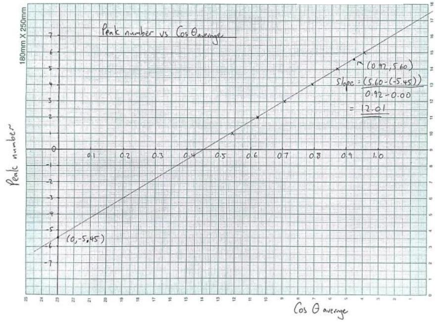
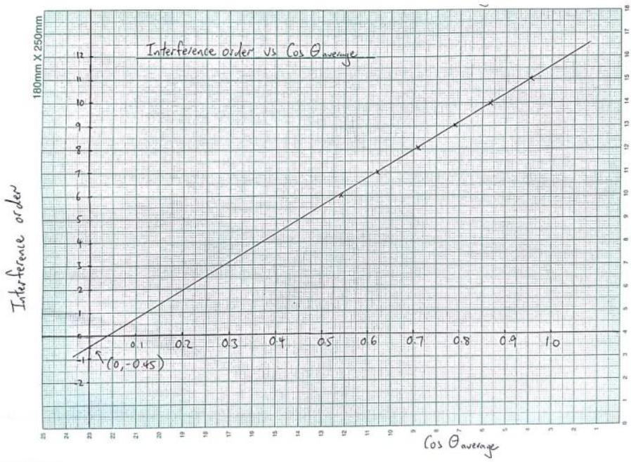
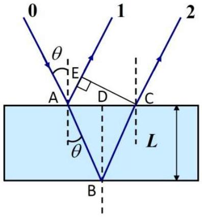

(Full Mark = 8)

| Tasks | Marks |
| :--- | :--- |
| 1 | TOTAL = 1.0 points |
|  |  |
|  | 0.6 points for two columns filled with values of $\boldsymbol { \theta }$ and the voltage 0.2 points for including units   0.2 points for displaying the measurements with the correct number of significant figures   [-0.1 points for each unit missing   -0.1 points for displaying the incorrect number of significant figures for two or more variables   -0.1 points for angular step $\boldsymbol { \delta } \boldsymbol { \theta } > \mathbf { 2 } ^ { \mathbf { 0 } }$ ] |

## Marking scheme for E2

Page 2 of 11

| 33.0 | 417 | 0.839 |
| :--- | :--- | :--- |
| 32.5 | 417 | 0.843 |
| 32.0 | 419 | 0.848 |
| 31.5 | 421 | 0.853 |
| 31.0 | 424 | 0.857 |
| 30.5 | 427 | 0.862 |
| 30.0 | 429 | 0.866 |
| 29.5 | 430 | 0.870 |
| 29.0 | 431 | 0.875 |
| 28.5 | 432 | 0.879 |
| 28.0 | 431 | 0.883 |
| 27.5 | 431 | 0.887 |
| 27.0 | 430 | 0.891 |
| 26.5 | 429 | 0.895 |
| 26.0 | 427 | 0.899 |
| 25.5 | 425 | 0.903 |
| 25.0 | 421 | 0.906 |
| 24.5 | 419 | 0.910 |
| 24.0 | 416 | 0.914 |
| 23.5 | 414 | 0.917 |
| 23.0 | 414 | 0.921 |
| 22.5 | 414 | 0.924 |
| 22.0 | 415 | 0.927 |
| 21.5 | 416 | 0.930 |
| 21.0 | 419 | 0.934 |
| 20.5 | 421 | 0.937 |
| 20.0 | 423 | 0.940 |
| 19.5 | 424 | 0.943 |
| 19.0 | 426 | 0.946 |
| 18.5 | 427 | 0.948 |
| 18.0 | 427 | 0.951 |
| 17.5 | 428 | 0.954 |
| 17.0 | 428 | 0.956 |
| 16.5 | 429 | 0.959 |
| 16.0 | 428 | 0.961 |
| 15.5 | 428 | 0.964 |
| 15.0 | 428 | 0.966 |
| 14.5 | 427 | 0.968 |
| 14.0 | 427 | 0.970 |
| 13.5 | 426 | 0.972 |
| 13.0 | 425 | 0.974 |
| 12.5 | 423 | 0.976 |
| 12.0 | 423 | 0.978 |
| 11.5 | 422 | 0.980 |
| 11.0 | 420 | 0.982 |
| 10.5 | 419 | 0.983 |
| 10.0 | 418 | 0.985 |
| 9.5 | 417 | 0.986 |
| 9.0 | 416 | 0.988 |
| 8.5 | 416 | 0.989 |
| 8.0 | 414 | 0.990 |
| 7.5 | 413 | 0.991 |
| 7.0 | 413 | 0.993 |
| 6.5 | 413 | 0.994 |
| 6.0 | 412 | 0.995 |
| 5.5 | 411 | 0.995 |
| 5.0 | 410 | 0.996 |
| 4.5 | - | - |
| 4.0 | - | - |

Reflection intensity against incident angle taken from $\theta \sim 4 ^ { \circ }$ to $60 ^ { \circ }$ in 0.5° intervals on one (LHS) side of the angular scale. The independent variable $\cos \theta$ should be added to Table E2_1. (The Ti-coated etalon used is \#15.)

| 2 | Table E2_2 |  |  | TOTAL = 1.0 points |
| :--- | :--- | :--- | :--- | :--- |
|  | $\boldsymbol { \theta }$ (Deg)   -60.0   -59.5   -59.0   -58.5   -58.0   -57.5   -57.0   -56.5   -56.0   -55.5   -55.0   -54.5   -54.0   -53.5   -53.0   -52.5   -52.0   -51.5   -51.0   -50.5   -50.0   -49.5   -49.0   -48.5   -48.0   -47.5   -47.0   -46.5   -46.0   -45.5   -45.0   -44.5   -44.0   -43.5   -43.0   -42.5   -42.0   -41.5   -41.0   -40.5   -40.0   -39.5   -39.0   -38.5   -38.0   -37.5   -37.0   -36.5   -36.0   -35.5   -35.0   -34.5   -34.0   -33.5   -33.0   -32.5   -32.0 | Voltage   (mV) | $\boldsymbol { \operatorname { c o s } } \boldsymbol { \theta }$ | 0.6 points for two columns filled with values of $\boldsymbol { \theta }$ and the voltage 0.2 points for including units |
|  |  | 426 | 0.500 |  |
|  |  | 432 | 0.508 |  |
|  |  | 437 | 0.515 |  |
|  |  | 439 | 0.522 |  |
|  |  | 441 | 0.530 |  |
|  |  | 441 | 0.537 |  |
|  |  | 440 | 0.545 |  |
|  |  | 438 | 0.552 |  |
|  |  | 434 | 0.559 |  |
|  |  | 426 | 0.566 |  |
|  |  | 421 | 0.574 |  |
|  |  | 421 | 0.581 |  |
|  |  | 427 | 0.588 |  |
|  |  | 432 | 0.595 |  |
|  |  | 435 | 0.602 |  |
|  |  | 438 | 0.609 |  |
|  |  | 439 | 0.616 |  |
|  |  | 439 | 0.623 |  |
|  |  | 437 | 0.629 |  |
|  |  | 434 | 0.636 |  |
|  |  | 429 | 0.643 |  |
|  |  | 422 | 0.649 |  |
|  |  | 418 | 0.656 |  |
|  |  | 420 | 0.663 |  |
|  |  | 425 | 0.669 |  |
|  |  | 431 | 0.676 |  |
|  |  | 434 | 0.682 |  |
|  |  | 436 | 0.688 |  |
|  |  | 436 | 0.695 |  |
|  |  | 436 | 0.701 |  |
|  |  | 436 | 0.707 |  |
|  |  | 433 | 0.713 |  |
|  |  | 431 | 0.719 |  |
|  |  | 426 | 0.725 |  |
|  |  | 421 | 0.731 |  |
|  |  | 413 | 0.737 |  |
|  |  | 417 | 0.743 |  |
|  |  | 420 | 0.749 |  |
|  |  | 423 | 0.755 |  |
|  |  | 428 | 0.760 |  |
|  |  | 431 | 0.766 |  |
|  |  | 431 | 0.772 |  |
|  |  | 433 | 0.777 |  |
|  |  | 432 | 0.783 |  |
|  |  | 433 | 0.788 |  |
|  |  | 431 | 0.793 |  |
|  |  | 422 | 0.799 |  |
|  |  | 425 | 0.804 |  |
|  |  | 417 | 0.809 |  |
|  |  | 416 | 0.814 |  |
|  |  | 414 | 0.819 |  |
|  |  | 414 | 0.824 |  |
|  |  | 419 | 0.829 |  |
|  |  | 421 | 0.834 |  |
|  |  | 425 | 0.839 |  |
|  |  | 427 | 0.843 |  |
|  |  | 428 | 0.848 |  |

## Marking scheme for E2

Page 4 of 11

| -31.5 | 430 | 0.853 |
| :--- | :--- | :--- |
| -31.0 | 431 | 0.857 |
| -30.5 | 432 | 0.862 |
| -30.0 | 431 | 0.866 |
| -29.5 | 430 | 0.870 |
| -29.0 | 428 | 0.875 |
| -28.5 | 427 | 0.879 |
| -28.0 | 424 | 0.883 |
| -27.5 | 421 | 0.887 |
| -27.0 | 418 | 0.891 |
| -26.5 | 415 | 0.895 |
| -26.0 | 413 | 0.899 |
| -25.5 | 413 | 0.903 |
| -25.0 | 413 | 0.906 |
| -24.5 | 416 | 0.910 |
| -24.0 | 418 | 0.914 |
| -23.5 | 420 | 0.917 |
| -23.0 | 422 | 0.921 |
| -22.5 | 424 | 0.924 |
| -22.0 | 426 | 0.927 |
| -21.5 | 427 | 0.930 |
| -21.0 | 428 | 0.934 |
| -20.5 | 428 | 0.937 |
| -20.0 | 429 | 0.940 |
| -19.5 | 429 | 0.943 |
| -19.0 | 428 | 0.946 |
| -18.5 | 429 | 0.948 |
| -18.0 | 428 | 0.951 |
| -17.5 | 427 | 0.954 |
| -17.0 | 426 | 0.956 |
| -16.5 | 425 | 0.959 |
| -16.0 | 423 | 0.961 |
| -15.5 | 422 | 0.964 |
| -15.0 | 419 | 0.966 |
| -14.5 | 418 | 0.968 |
| -14.0 | 416 | 0.970 |
| -13.5 | 414 | 0.972 |
| -13.0 | 414 | 0.974 |
| -12.5 | 413 | 0.976 |
| -12.0 | 412 | 0.978 |
| -11.5 | 411 | 0.980 |
| -11.0 | 411 | 0.982 |
| -10.5 | 411 | 0.983 |
| -10.0 | 411 | 0.985 |
| -9.5 | 412 | 0.986 |
| -9.0 | 412 | 0.988 |
| -8.5 | 413 | 0.989 |
| -8.0 | 414 | 0.990 |
| -7.5 | 414 | 0.991 |
| -7.0 | 415 | 0.993 |
| -6.5 | 416 | 0.994 |
| -6.0 | 416 | 0.995 |
| -5.5 | 417 | 0.995 |
| -5.0 | 418 | 0.996 |
| -4.5 | 426 | 0.997 |
| -4.0 | 425 | 0.998 |

Reflection intensity against incident angle taken from $\theta \sim - 4 ^ { 0 }$ to $- 60 ^ { 0 }$ in $0.5 ^ { \circ }$ intervals on the (RHS) other side of the angular scale. The independent variable $\cos \theta$ should be added to Table E2_2. (The Ticoated etalon used is \#15.)

| 3 | Graph E2_1   Graph E2_2   Graphs E2_1 and E2_2 show the relationship between the intensity and $\| \theta \|$ for the positive (LHS) and negative (RHS) incident angles respectively. The peak numbers are also labeled for all graphs. | TOTAL = 0.9 points   0.4 points for displaying the data points (for both graphs)   0.1 points for displaying the units (for both graphs)   0.1 points for displaying the axis label (for both graphs)   0.1 points for displaying the axis ticks label (for both graphs)   0.2 points for smooth curve (for both graphs)   [deduct half of the points if the above items are not shown in both graphs] |
| :--- | :--- | :--- |

| 4 | Refer to Graphs E2_1 and E2_2. | TOTAL = 0.2 points   0.2 points for labeling the peaks with appropriate peak numbers (for both graphs)   [-0.1 points for wrong peak number order] |
| :--- | :--- | :--- |
| 5 | From Equation (1), the peaks correspond to constructive interference where the total phase difference of the two beams is equal to multiples of $2 \pi$, i.e. $\begin{equation*} 2 k L \cos \theta _ { m } + \phi _ { \mathrm { s } } = 2 m \pi , \tag{2} \end{equation*}$ where $m = 1,2$, etc... is the interference order and $\theta _ { m }$ is the corresponding incident angle for peak reflection intensity.   Thus a plot of the interference order $m$ vs. $\cos \theta _ { \mathrm { m } }$ will give a straight line with a slope related to the air-gap spacing $L$ and an intercept related to the reflection phase $\phi _ { \mathrm { s } }$. Since the interference order changes sequentially with the peak number, a plot of the peak number vs. $\cos \theta$ will also give a straight line with the same slope as the plot for the interference order vs. $\cos \theta$. However, the y -intercept is now shifted along the $y$-axis with respect to the plot for the interference order vs. $\cos \theta$.   Thus $X ( \theta ) = \cos ( \theta )$ should be chosen as the independent variable such that the intensity peaks will be evenly spaced in a plot of reflection intensity vs. $\cos ( \theta )$. Furthermore, a plot of peak number vs. $\cos ( \theta )$ will give a straight line that can be used to obtain the air-gap spacing $L$ of the Ti-coated etalon and also the reflection phase $\phi _ { s }$ of the Ti. | TOTAL = 0.3 points   0.2 points for deriving the correct equation (i.e. Eq.(2))   0.1 points for $\boldsymbol { m }$ equals to integer number |
| 6 | Independent variable $X ( \theta ) = \cos ( \theta )$   Refer to Tables E2_1 and E2_2 | TOTAL = 0.4 points   0.2 points for correct independent $X ( \theta )$   0.2 points for working out the numbers of $X ( \theta )$ in Tables E2_1 and E2_2 |

| 7 | Ideally, the locations of the peaks for (RHS) negative incident angles should be the same as for (LHS) positive incident angles for perfect opitcal alignment. Since there could be an offset in the locations of the peaks due to mis-alignment in the optics, the peak locations are better determined by averaging the negative and positive incident angles. After pairing, one would get the following table: Table E2_3Peak number (LHS) $\boldsymbol { \theta } _ { \text {LHS } }$ (Deg) Peak number (RHS) $\boldsymbol { \theta } _ { \text {RHS } }$ (Deg) $\| \boldsymbol { \theta } \| _ { \text {average } }$ (Deg) $\boldsymbol { \operatorname { c o s } } \boldsymbol { \| } \boldsymbol { \theta } \boldsymbol { l } _ { \text {average } }$ $\boldsymbol { m }$   6 16.50 6 -19.25 17.875 0.952 11   5 28.50 5 -30.75 29.625 0.869 10   4 36.50 4 -38.50 37.500 0.793 9   3 44.00 3 -45.75 44.875 0.709 8   2 51.25 2 -51.75 51.500 0.623 7   1 56.50 1 -57.75 57.125 0.543 6   $\theta _ { \text {LHS } }$ refers to the peak location obtained from Table E2_1.   $\theta _ { \text {RHS } }$ refers to the peak location obtained from Table E2_2.   $\| \theta \| _ { \text {average } }$ is the average of $\| \theta \| _ { \text {LHS } }$ and $\| \theta \| _ { \text {RHS } }$. | TOTAL = 0.6 points   0.2 points for identifying the peaks and the corresponding LHS/RHS incident angles   0.2 points for matching of peaks   0.2 points for calculating the average of the independent variable   [-0.1 points for each unit missing   -0.1 points for displaying the incorrect number of significant figures except for peak and interference numbers   -0.1 points for mis-matching peak number] |
| :--- | :--- | :--- |
| 8 | Peak number vs. $\boldsymbol { \operatorname { c o s } } \boldsymbol { \theta } _ { \text {average } }$   The slope is 12.0 | TOTAL = 0.6 points   0.3 points for displaying the data points   0.1 points for displaying the units   0.1 points for displaying the axis label   0.1 points for displaying the axis ticks label   [-0.2 points for plotting $\boldsymbol { \operatorname { c o s } } \boldsymbol { \theta }$ vs. peak number or interference order (i.e. $x - y$ axis are reserved)] |

The $y$-intercept is -5.45
Interference order vs. $\boldsymbol { \operatorname { c o s } } \boldsymbol { \theta } _ { \text {average } }$
The slope is 12.0
The $y$-intercept is -0.45
By plotting peak number against cos $| \theta | _ { \text {average } }$ and drawing a line through the data points, one could get the slope and the $y$-intercept, as shown in Graph E2_3. The same principle applies to plotting the interference order $m$ against $\cos | \theta | _ { \text {average } }$.
(Graphical solutions for the slope and intercept will be accepted.)
Note: Plotting these two graphs separately will also be acceptable as shown in Graph E2_3a and Graph E2_3b i.e.

Graph E2_3a

Graph E2_3b

| 9 | Refer to Graph E2_3   Peak number vs. $\boldsymbol { \operatorname { c o s } } \boldsymbol { \theta } _ { \text {average } }$   The slope is 12.0   The $y$-intercept is -5.45 | TOTAL = 0.4 points   0.2 points for fitting a straight line   0.1 points for deriving the value of the slope   0.1 points for deriving the value of the $\boldsymbol { y }$-intercept |
| :--- | :--- | :--- |
| 10 | Equation (2) in Tasks 5+6 can be rewritten in a simpler form for each constructive interference order $m$ at incident angle $\theta _ { m }$ as below: $\begin{equation*} m = \frac { 2 L \cos \theta _ { m } } { \lambda } + \frac { \phi _ { \mathrm { s } } } { 2 \pi } . \tag{3a} \end{equation*}$   In Equation (3a), one can take the integer part of $\frac { 2 L \cos \theta _ { m } } { \lambda }$ as the interference order, i.e. $\begin{equation*} m = \operatorname { Trunc } \left( \frac { 2 L \cos \theta _ { m } } { \lambda } \right) . \tag{3b} \end{equation*}$   Then the decimal part of $\frac { 2 L \cos \theta _ { m } } { \lambda }$ is related to the reflection phase by $\begin{equation*} \phi _ { \mathrm { s } , \mathrm { n } } \equiv \frac { \phi _ { \mathrm { s } } } { 2 \pi } = \operatorname { Trunc } \left( \frac { 2 L \cos \theta _ { m } } { \lambda } \right) - \frac { 2 L \cos \theta _ { m } } { \lambda } . \tag{3c} \end{equation*}$   A simpler method to find the interference order $m$ is to add to the peak number directly the absolute value of the integer part of the $y$-intercept obtained from the plot of peak number vs. $\cos \theta$ as shown in Graph E2_3, i.e. $m =$ peak number + \|integer part of $y$-intercept in Graph E2_3.   Then, the $y$-intercept of a plot of $m$ vs. $\cos \theta$ will give the normalized reflection phase $\phi _ { \mathrm { s } , \mathrm { n } } = \phi _ { \mathrm { s } } / 2 \pi$ directly.   $\phi _ { \mathrm { s } , \mathrm { n } }$ is now defined within ( $- 1,0$ ), corresponding to $\phi _ { \mathrm { s } }$ chosen with ( $2 \pi , 0 )$.   Refer to Table E2_3 for $m$. | TOTAL = 1.2 points   0.3 points for deriving the correct equation (i.e. Eq. (3a))   0.3 points for getting the expression for $m$ (i.e. Eq. (3b))   0.2 points for getting the expression for normalized reflection phase (i.e. Eq. (3c))   0.2 points for defining the range for the reflection phase   0.2 points for interference order added to Table E2_3. |

| 11 | Refer to Graph E2_3:   From Graph E2_3, the slope for $m$ vs, $\cos \theta$ is 12.01.   Since slope of the line is equal to $2 L / \lambda$, one can then obtain the value of $L$ as $L = \lambda \times \text { slope } / 2 = 0.650 \times \frac { 12.01 } { 2 } = 3.903 \mu \mathrm {~m} .$   The $y$-intercept is the normalized reflection phase $\phi _ { \mathrm { s } , \mathrm { n } } = - 0.450 \text { or } \phi _ { \mathrm { s } } = - 2.828 \mathrm { rad } .$ | Total = 1.4 points   0.4 points for displaying the data points   0.3 points for fitting a straight line   0.4 points for deriving the value of the air-gap spacing   0.3 points for deriving the value of the $\boldsymbol { y }$-intercept   [-0.1 points for $\phi _ { \mathrm { s } , \mathrm { n } }$ outside (0.9, -0.1)] |
| :--- | :--- | :--- |
|  | Appendix:   Path difference calculation for an ideal air-gap etalon:   Path difference for beams 1 and 2 is equal to: $\begin{equation*} \mathrm { AB } + \mathrm { BC } - \mathrm { AE } = \frac { 2 L } { \cos \theta } - 2 L \sin \theta \tan \theta = 2 L \cos \theta \tag{4a} \end{equation*}$   This is the path difference used in Equation (1).   It is also acceptable to calculate the path difference directly using   Equation (1), but will only be given half of the points as writing down   Eq. (4a).   A mis-alignment of angle $\alpha$ between the laser beam and the angular scale | N/A |

|  | corresponds to a correction of $\alpha$ for the incident angle $\theta$ taken directly from the angular scale. Thus the incident angle is now $\theta + \alpha$. Hence the corrected path difference between beams 1 and 2 with a mis-alignment of angle $\alpha$ is: $\begin{equation*} \mathrm { AB } + \mathrm { BC } - \mathrm { AE } = 2 L \cos ( \theta + a ) . \tag{4b} \end{equation*}$ Thus the correction of the path difference for a mis-alignment of angle $\alpha$ as compared to the ideal case of perfect alignment is: $\begin{equation*} \Delta = 2 L \cos ( \theta ) - 2 L \cos ( \theta + a ) \sim 2 L \sin \theta \sin \alpha . \tag{4c} \end{equation*}$ Hence, the error for the reflection phase due to mis-alignment is $2 \pi \Delta / \lambda$, or $\Delta / \lambda$ when normalized by $2 \pi$.   Now one can use $L = 5 \mu \mathrm {~m} , \theta = 30 ^ { \circ }$, and $\lambda = 0.650 \mu \mathrm {~m}$ to get the error for the reflection phase due to a $\alpha = 1 ^ { \circ }$ mis-alignment by using Equation (4c):   The value of $\Delta$ by using Equation (4c) is: $\begin{aligned} \Delta & = 2 \times \left( 5.00 \times 10 ^ { - 6 } \right) \times \sin 30 ^ { \circ } \times \sin 1 ^ { \circ } \\ & = 0.0873 \times 10 ^ { - 6 } \mathrm {~m} \end{aligned}$ Now, the phase error is is $2 \pi \Delta \lambda$, or $\Delta / \lambda$ $\begin{aligned} \sigma _ { \phi _ { S } } & = 2 \pi \times \left( 0.0873 \times 10 ^ { - 6 } \right) / \left( 0.650 \times 10 ^ { - 6 } \right) = 0.843 \mathrm { rad } , \\ \sigma _ { \bar { \phi } _ { S } } & = 0.134 ( \text { normalized by } 2 \pi ) . \end{aligned}$ |  |
| :--- | :--- | :--- |
