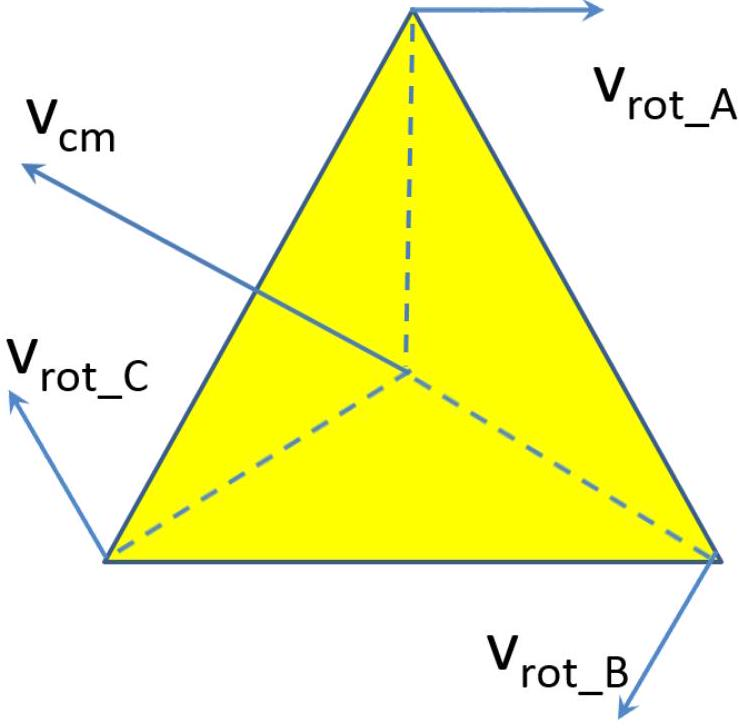
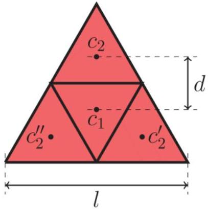

(Full Mark = 20)

| Part | Model Answer | Marks |
| :--- | :--- | :--- |
| A1 | The potential energy for $N = 2$ is: $E _ { \mathrm { p } } ( \alpha ) = M g \cdot y _ { \mathrm { c } \cdot \mathrm {~m} \cdot ( 0,0 ) } \times 4 + M g \cdot \Delta y \times 2 \text { (0.5 points) - Eq. (1) }$ where $y _ { c \cdot m \cdot ( 0,0 ) } = - \frac { \sqrt { 3 } l } { 3 } \sin \left( \frac { \pi } { 6 } + \alpha \right) ( \mathbf { 0 . 5 } \text { points) } \quad - \text { Eq. } ( 2 )$ is the $y$ coordinate of center of mass of triangle (0,0), and $\begin{aligned} \Delta y & = y _ { A ( 0,1 ) } - y _ { A ( 0,0 ) } \\ & = - l \left[ \sin \left( \frac { \pi } { 3 } + \alpha \right) + \sin \left( \frac { \pi } { 3 } - \alpha \right) \right] \\ & = - \sqrt { 3 } l \cos \alpha \end{aligned}$ is the translational difference of two neighbouring triangles in $y$-direction. Solving Eqs. (1), (2) and (3), we obtain $E _ { \mathrm { p } } ( \alpha ) = - \frac { 2 } { 3 } \operatorname { Mgl } ( 4 \sqrt { 3 } \cos \alpha + 3 \sin \alpha ) \text { (0.5 points) - Eq. (4) }$ | 2 |
| A2 | At equilibrium, the potential energy reaches a minimum, which gives: $\begin{equation*} \left. \frac { d E _ { \mathrm { p } } ( \alpha ) } { d \alpha } \right\| _ { \alpha = \alpha _ { \mathrm { E } } } = 0 \text { ( } 0.5 \text { points) } \tag{5} \end{equation*}$ $\begin{equation*} \sqrt { 3 } \sin \alpha _ { \mathrm { E } } + 3 \cos \alpha _ { \mathrm { E } } = 0 \tag{6} \end{equation*}$ | 1 |

|  | or $\alpha _ { \mathrm { E } } = \tan ^ { - 1 } \frac { \sqrt { 3 } } { 4 } \text { ( } 0.5 \text { point) }$   - Eq. (7) |  |
| :--- | :--- | :--- |
| A3 | If the total energy of the oscillation has the following form $E ( \Delta \alpha , \Delta \dot { \alpha } ) = E _ { \mathrm { p } } + E _ { \mathrm { k } } = \frac { 1 } { 2 } K ( \Delta \alpha ) ^ { 2 } + \frac { 1 } { 2 } I ( \Delta \dot { \alpha } ) ^ { 2 } , ( \mathbf { 0 . 5 } \text { points } ) \quad \text { - Eq. (8) }$   where $E _ { \mathrm { p } }$ and $E _ { \mathrm { k } }$ are the potential and kinetic energies of the system respectively, then the motion is a simple harmonic oscillation with angular frequency $\omega = \sqrt { K / I }$. Here $\Delta \alpha = \alpha - \alpha _ { \mathrm { E } }$. Under a small perturbation, the potential energy change is: $\begin{align*} \Delta E _ { \mathrm { p } } & \left. \approx \frac { 1 } { 2 } \frac { d ^ { 2 } E _ { \mathrm { p } } } { \mathrm {~d} \alpha ^ { 2 } } \right\| _ { \alpha = \alpha _ { \mathrm { E } } } ( \Delta \alpha ) ^ { 2 } \\ & = \left( \frac { 1 } { 2 } \right) \left( \frac { 2 } { 3 } M g l \right) \left( 4 \sqrt { 3 } \cos \alpha _ { \mathrm { E } } + 3 \sin \alpha _ { \mathrm { E } } \right) ( \Delta \alpha ) ^ { 2 } \\ & = \frac { \sqrt { 57 } } { 3 } M g l ( \Delta \alpha ) ^ { 2 } ( 1 \text { point } ) \tag{9} \end{align*}$   The total kinetic energy of the system includes the translational kinetic energy of every plate and the rotational kinetic energy of every plate relative to its center of mass $\begin{equation*} E _ { \mathrm { k } } = \sum E _ { \mathrm { k } } ^ { \text {trans } } + \sum E _ { \mathrm { k } } ^ { \text {rot } } \tag{10} \end{equation*}$   The rotational kinetic energy is $\begin{equation*} \sum E _ { \mathrm { k } } ^ { \mathrm { rot } } = 4 \times \frac { 1 } { 2 } \frac { M l ^ { 2 } } { 12 } ( \Delta \dot { \alpha } ) ^ { 2 } = \frac { 1 } { 6 } M l ^ { 2 } ( \Delta \dot { \alpha } ) ^ { 2 } \tag{11} \end{equation*}$   $E _ { \mathrm { k } } ^ { \text {trans } }$ can be obtained by considering the motion of the center of mass of each triangle and setting $N = 2$. $\begin{aligned} & x _ { \text {c.m. } ( m , n ) } = m ( 2 l \cos \alpha ) + n ( 2 l \cos \alpha ) \cos \frac { \pi } { 3 } + \frac { l } { \sqrt { 3 } } \cos \left( \alpha + \frac { \pi } { 6 } \right) \\ & y _ { \text {c.m. } ( m , n ) } = - n ( 2 l \cos \alpha ) \sin \frac { \pi } { 3 } - \frac { l } { \sqrt { 3 } } \sin \left( \alpha + \frac { \pi } { 6 } \right) . \end{aligned}$   Differentiating and substituting $\sin \alpha = \frac { \sqrt { 3 } } { \sqrt { 19 } } , \cos \alpha = \frac { 4 } { \sqrt { 19 } } , \sin \left( \alpha + \frac { \pi } { 6 } \right) = \frac { 7 } { 2 \sqrt { 19 } } , \cos \left( \alpha + \frac { \pi } { 6 } \right) = \frac { 3 \sqrt { 3 } } { 2 \sqrt { 19 } } ,$ | 5 |

| $\dot { x } _ { \text {c.m. } ( m , n ) } = - \left( 2 m + n + \frac { 7 } { 6 } \right) \frac { 3 } { \sqrt { 57 } } l \Delta \dot { \alpha } , \quad \dot { y } _ { \text {c.m. } ( m , n ) } = \frac { 3 ( 2 n - 1 ) } { 2 \sqrt { 19 } } l \Delta \dot { \alpha }$. |
| :--- |
| $v _ { \text {c.m. } ( m , n ) } ^ { 2 } = \dot { x } _ { \text {c.m. } ( m , n ) } ^ { 2 } + \dot { y } _ { \text {c.m. } ( m , n ) } ^ { 2 } = \frac { ( 12 m + 6 n + 7 ) ^ { 2 } + 27 } { 228 } l ^ { 2 } ( \Delta \dot { \alpha } ) ^ { 2 }$, |
| $\begin{array} { r }  E _ { \mathrm { c } . \mathrm { m } . \mathrm { k } } ^ { \mathrm { trans } } = \frac { M } { 2 } \left[ v _ { \mathrm { c } . \mathrm { m } . ( 0,0 ) } ^ { 2 } + v _ { \mathrm { c } . \mathrm { m } . ( 0,1 ) } ^ { 2 } + v _ { \mathrm { c } . \mathrm { m } . ( 1,0 ) } ^ { 2 } + v _ { \mathrm { c } . \mathrm { m } . } ^ { 2 } \right. \\ E _ { \mathrm { k } } ^ { \mathrm { trans } } = E _ { \mathrm { c } . \mathrm { m } . , \mathrm { k } } ^ { \mathrm { trans } } + E _ { \mathrm { k } } ^ { \mathrm { rot } } = \frac { 347 } { 114 } M l ^ { 2 } ( \Delta \dot { \alpha } ) ^ { 2 } . \end{array}$ |

Alternatively, another way to get $E _ { k } ^ { \text {trans } }$ is based on the center of mass of the whole system:

$$
\begin{equation*}
E _ { \mathrm { k } } = \sum E _ { \text {c.m., } \mathrm { k } } ^ { \text {trans } } + \sum E _ { \text {r.c., } \mathrm { k } } ^ { \text {rot } } \tag{0.5points}
\end{equation*}
$$

where

$$
\begin{equation*}
E _ { \text {r.c., } \mathrm { k } } ^ { \text {trans } } = \frac { M } { 2 } \left[ v _ { \text {r.c. } ( 0,0 ) } ^ { 2 } + v _ { \text {r.c. } ( 1,0 ) } ^ { 2 } + v _ { \text {r.c. } ( 0,1 ) } ^ { 2 } + v _ { \text {r.c. } ( 1,1 ) } ^ { 2 } \right] \tag{13}
\end{equation*}
$$

is the translational kinetic energy relative to the center of mass of the system and

$$
\begin{equation*}
E _ { \mathrm { c } . \mathrm { m } . , \mathrm { k } } ^ { \mathrm { trans } } = \frac { 4 M } { 2 } v _ { \mathrm { c } . \mathrm { m } . } ^ { 2 } \tag{14}
\end{equation*}
$$

is the translational kinetic energy of the center of mass of the system.
The center of mass of each of the $2 \times 2 = 4$ triangles always form diamond shape with lateral length $2 l \cos \alpha$. The center of mass of the whole system is at the center of the diamond shape. Hence

$$
\begin{align*}
& v _ { \text {r.c. } ( 0,0 ) } = v _ { \text {r.c. } ( 1,1 ) } = \left. \frac { d ( \sqrt { 3 } l \cos \alpha ) } { d \alpha } \right| _ { \alpha = \alpha _ { \mathrm { E } } } \Delta \dot { \alpha } \\
& v _ { \text {r.c. } ( 1,0 ) } = v _ { \text {r.c. } ( 0,1 ) } = \left. \frac { d ( l \cos \alpha ) } { d \alpha } \right| _ { \alpha = \alpha _ { \mathrm { E } } } \Delta \dot { \alpha } \tag{15}
\end{align*}
$$

Substituting Eqs. (14) and (15) into Eq. (13), we obtain

$$
\begin{equation*}
E _ { \text {r.c.,k } } ^ { \text {trans } } = 4 \sin \alpha _ { \mathrm { E } } ^ { 2 } M l ^ { 2 } ( \Delta \dot { \alpha } ) ^ { 2 } \tag{16}
\end{equation*}
$$

For $E _ { \text {c.m., } \mathrm { k } } ^ { \text {trans } }$,

|  | $\begin{equation*} v _ { \text {c.m. } } = \left. \sqrt { \left( \frac { \mathrm { d } x _ { \text {c.m. } } } { \mathrm { d } \alpha } \right) ^ { 2 } + \left( \frac { \mathrm { d } y _ { \text {c.m. } } } { \mathrm { d } \alpha } \right) ^ { 2 } } \right\| _ { \alpha = \alpha _ { \mathrm { E } } } \Delta \dot { \alpha } \tag{17} \end{equation*}$ is the velocity of the center-of-mass of the four triangular plates, with $\begin{align*} x _ { \text {c.m. } } & = x _ { \text {c.m. } ( 0,0 ) } + \frac { 1 } { 2 } \left( x _ { \mathrm { B } ( 0,0 ) } + x _ { \mathrm { A } ( 1,0 ) } \right) \\ & = \frac { \sqrt { 3 } l } { 3 } \cos \left( \frac { \pi } { 6 } + \alpha \right) + \frac { 3 } { 2 } l \cos \alpha \tag{18} \end{align*}$ $\begin{align*} y _ { \text {c.m. } } & = y _ { \text {c.m. } ( 0,0 ) } + \frac { 1 } { 2 } \Delta y \\ & = - \frac { \sqrt { 3 } l } { 3 } \sin \left( \frac { \pi } { 6 } + \alpha \right) - \frac { \sqrt { 3 } } { 2 } l \cos \alpha \tag{19} \end{align*}$ Substituting Eqs. (17), (18) and (19) and into Eq. (14), we obtain $\begin{equation*} E _ { \text {c.m., } \mathrm { k } } ^ { \text {trans } } = \left( \frac { 2 } { 3 } + 10 \sin ^ { 2 } \alpha _ { E } \right) M l ^ { 2 } ( \Delta \dot { \alpha } ) ^ { 2 } \text { (0.5 points) } \tag{20} \end{equation*}$ Combining Eqs. (12), (16) and (20), we obtain $\begin{align*} E _ { \mathrm { k } } & = E _ { \mathrm { k } } ^ { \text {rot } } + E _ { \text {r.c.,k } } ^ { \text {trans } } + E _ { \text {c.m.,k } } ^ { \text {trans } } \\ & = \left( \frac { 5 } { 6 } + 14 \sin ^ { 2 } \alpha _ { E } \right) M l ^ { 2 } ( \Delta \dot { \alpha } ) ^ { 2 } \\ & = \frac { 347 } { 114 } M l ^ { 2 } ( \Delta \dot { \alpha } ) ^ { 2 } \tag{1.5points} \end{align*}$ According to Eqs. (8), (9) and (21), $\begin{equation*} f = \frac { 1 } { 2 \pi } \sqrt { \frac { \frac { \sqrt { 57 } } { 3 } M g l } { \frac { 347 } { 144 } M l ^ { 2 } } } = \frac { 1 } { 2 \pi } \sqrt { \frac { 38 \sqrt { 57 } } { 347 } \frac { g } { l } } \tag{0.5points} \end{equation*}$ [Note 1: 0.5 point should be deducted if there are numerical mistakes, but all steps are correct.   Note 2: A rough estimate of $f \sim \sqrt { \frac { g } { l } }$ can get 0.5 points out of 5 points.] |  |
| :--- | :--- | :--- |

| B1 | For arbitrary $N$, the total potential energy $\begin{equation*} E _ { \mathrm { p } } = \sum _ { m , n = 0 } ^ { N - 1 } E _ { \mathrm { p } } ( m , n ) \tag{23} \end{equation*}$   where $\begin{equation*} E _ { \mathrm { p } } ( m , n ) = \frac { 1 } { 3 } M g \left[ y _ { \mathrm { A } ( m , n ) } + y _ { \mathrm { B } ( m , n ) } + y _ { \mathrm { C } ( m , n ) } \right] \tag{24} \end{equation*}$   (0.5 points for Eqs. (23) and (24))   and $\begin{align*} y _ { \mathrm { A } ( m , n ) } & = - n l \sin \left( \frac { \pi } { 3 } - \alpha \right) - n l \sin \left( \frac { \pi } { 3 } + \alpha \right) = - \sqrt { 3 } n l \cos \alpha \\ y _ { \mathrm { B } ( m , n ) } & = y _ { \mathrm { A } ( m , n ) } - l \sin \alpha = - \sqrt { 3 } n l \cos \alpha - l \sin \alpha \\ y _ { \mathrm { C } ( m , n ) } & = y _ { \mathrm { A } ( m , n ) } - l \sin \left( \frac { \pi } { 3 } + \alpha \right) = - \sqrt { 3 } n l \cos \alpha - l \sin \left( \frac { \pi } { 3 } + \alpha \right) \tag{25} \end{align*}$   (0.5 points for all three correct coordinates)   Thus, $\begin{equation*} E _ { \mathrm { p } } ( m , n ) = - \frac { 1 } { 3 } M g l \left[ 3 \sqrt { 3 } n \cos \alpha + \sin \alpha + \sin \left( \frac { \pi } { 3 } + \alpha \right) \right] \tag{26} \end{equation*}$   and $\begin{align*} E _ { \mathrm { p } } & = \sum _ { m , n = 0 } ^ { N - 1 } E _ { \mathrm { p } } ( m , n ) \\ & = - \frac { 1 } { 3 } M g l \sum _ { m , n = 0 } ^ { N - 1 } \left[ 3 \sqrt { 3 } n \cos \alpha + \sin \alpha + \sin \left( \frac { \pi } { 3 } + \alpha \right) \right] \tag{0.5points} \end{align*}$   Using the mathematical relations $\sum _ { m = 0 } ^ { N - 1 } 1 = \sum _ { n = 0 } ^ { N - 1 } 1 = N$   and $\begin{equation*} \sum _ { m = 0 } ^ { N - 1 } m = \sum _ { n = 0 } ^ { N - 1 } n = \frac { N ( N - 1 ) } { 2 } \tag{28} \end{equation*}$   Eq. (27) becomes | 3 |
| :--- | :--- | :--- |

|  | $\begin{aligned} E _ { \mathrm { p } } & = - \frac { 1 } { 3 } N ^ { 2 } M g l \left[ \frac { 3 \sqrt { 3 } ( N - 1 ) \cos \alpha } { 2 } + \mathrm { si } \right. \\ \text { or } \quad & = - \frac { 1 } { 3 } N ^ { 2 } M g l \left[ \frac { \sqrt { 3 } ( 3 N - 2 ) \cos \alpha } { 2 } + \frac { 3 } { 2 } \sin \alpha \right] \end{aligned}$   (1 points)   - Eq. (29)   At equilibrium, $\frac { \mathrm { d } E _ { \mathrm { p } } } { \mathrm { d } \alpha } = 0$, therefore $\begin{array} { r }  - \frac { 3 \sqrt { 3 } ( N - 1 ) \sin \alpha _ { \mathrm { E } } ^ { \prime } } { 2 } + \cos \alpha _ { \mathrm { E } } ^ { \prime } + c \\ \alpha _ { \mathrm { E } } ^ { \prime } = \tan ^ { - 1 } \left( \frac { \sqrt { 3 } } { 3 N - 2 } \right) \end{array}$   - Eq. (30)   (0.5 points)   - Eq. (31)   [Remark: Increasing $\boldsymbol { \alpha }$ lowers each triangle relative to its vertex A, but globally raises the system, i.e. the bottom tube is raised higher. When $N \rightarrow \infty$, the global displacement dominates, consequently $\boldsymbol { \alpha } \rightarrow \mathbf { 0 }$.] |  |
| :--- | :--- | :--- |
| B2 | Under a small perturbation, the potential energy change, according to Eq. (29) is $\left. \Delta E _ { \mathrm { p } } \approx \frac { 1 } { 2 } \frac { d ^ { 2 } E _ { \mathrm { p } } } { \mathrm {~d} \alpha ^ { 2 } } \right\| _ { \alpha = \alpha _ { \mathrm { E } } ^ { \prime } } ( \Delta \alpha ) ^ { 2 } \sim N ^ { 3 } \text { or } \gamma _ { 1 } = 3$   (0.5 points)   - Eq. (32)   [Remark: There are $\boldsymbol { N } ^ { \mathbf { 2 } }$ triangles and the $\boldsymbol { y }$ coordinate of the total center of mass is proportional to $N$, hence $E _ { \mathrm { p } } \sim N ^ { 3 }$ and $\gamma _ { 1 } = 3$. Using this argument to derive the correct $\boldsymbol { \gamma } _ { \mathbf { 1 } }$ can also get $\mathbf { 0 . 5 }$ points.]   The kinetic energy of a triangle includes the translational energy of its center of mass and the rotational energy about its center of mass. Hence the total kinetic energy of the $N ^ { 2 }$ triangles is $E _ { \mathrm { k } } = \sum _ { m , n } E _ { \text {c.m. } ( m , n ) } + \sum _ { m , n } E _ { \text {r.c. } ( m , n ) }$   - Eq. (33)   where $E _ { \text {r.c. } ( m , n ) } = \frac { 1 } { 2 } \frac { M l ^ { 2 } } { 12 } ( \Delta \dot { \alpha } ) ^ { 2 } = \frac { 1 } { 24 } M l ^ { 2 } ( \Delta \dot { \alpha } ) ^ { 2 } \sim 1$   - Eq. (34)   and $\begin{aligned} E _ { \text {c.m. } ( m , n ) } & = \frac { M } { 2 } v _ { \text {c.m. } ( m , n ) } ^ { 2 } \\ & = \frac { M ( \Delta \dot { \alpha } ) ^ { 2 } } { 2 } \left[ \left( \frac { \mathrm {~d} x _ { \text {c.m. } ( m , n ) } } { \mathrm { d } \alpha } \right) ^ { 2 } + \left( \frac { \mathrm { d } y _ { \text {c.m. } ( m , n ) } } { \mathrm { d } \alpha } \right) ^ { 2 } \right] _ { \alpha = \alpha _ { \mathrm { E } } ^ { \prime } } \end{aligned}$   (0.5 points)   - Eq. (35) | 3 |

Since

$$
\begin{aligned}
x _ { \text {c.m. } ( m , n ) } & = x _ { \mathrm { A } ( m , n ) } + \frac { \sqrt { 3 } l } { 3 } \cos \left( \frac { \pi } { 6 } + \alpha \right) \\
& = ( 2 m + n ) l \cos \alpha + \frac { l } { 2 } \cos \alpha - \frac { \sqrt { 3 } l } { 6 } \sin \alpha
\end{aligned}
$$

and

$$
\begin{align*}
y _ { \mathrm { c } . \mathrm { m } . ( m , n ) } & = y _ { \mathrm { A } ( m , n ) } + \frac { \sqrt { 3 } l } { 3 } \sin \left( \frac { \pi } { 6 } + \alpha \right) \\
& = \sqrt { 3 } n l \cos \alpha + \frac { \sqrt { 3 } l } { 6 } \cos \alpha + \frac { l } { 2 } \sin \alpha \tag{36}
\end{align*}
$$

(0.5 points for correct $\boldsymbol { x }$ and $\boldsymbol { y }$ )

$$
\begin{aligned}
& \frac { \mathrm { d } x _ { \mathrm { c.m. } ( m , n ) } } { \mathrm { d } \alpha } = \left[ - ( 2 m + n ) \sin \alpha - \frac { 1 } { 2 } \sin \alpha - \frac { \sqrt { 3 } } { 6 } \cos \alpha \right] l \\
& \frac { \mathrm {~d} y _ { \mathrm { c.m. } ( m , n ) } } { \mathrm { d } \alpha } = \left[ - \sqrt { 3 } n \sin \alpha - \frac { \sqrt { 3 } } { 6 } \sin \alpha + \frac { 1 } { 2 } \cos \alpha \right] l
\end{aligned}
$$

we have

$$
E _ { \text {c.m. } ( m , n ) } = \frac { 1 } { 2 } M l ^ { 2 } ( \Delta \dot { \alpha } ) ^ { 2 } \left[ \begin{array} { c }
\left( 4 m ^ { 2 } + 4 n ^ { 2 } + 4 m n + 2 m + 2 n \right) \sin ^ { 2 } \alpha _ { \mathrm { E } } ^ { \prime }  \tag{37}\\
+ \frac { 2 \sqrt { 3 } } { 3 } ( m - n ) \sin \alpha _ { \mathrm { E } } ^ { \prime } \cos \alpha _ { E } ^ { \prime } + \frac { 1 } { 3 }
\end{array} \right]
$$

Since $\alpha _ { \mathrm { E } } ^ { \prime } \sim \frac { 1 } { N }$ in Eq. (31), we have

$$
\begin{equation*}
E _ { \mathrm { c } . \mathrm { m } . ( m , n ) } = A \cdot N ^ { 2 } \cdot \frac { 1 } { N ^ { 2 } } + B \cdot N \cdot \frac { 1 } { N } + C \sim 1 \tag{0.5points}
\end{equation*}
$$

According to Eqs. (33), (34) and (38), we have

$$
\begin{gather*}
E _ { \mathrm { k } } = \sum _ { m , n } E _ { \text {c.m. } ( m , n ) } + \sum _ { m , n } E _ { \text {r.c. } ( m , n ) } \sim N \times N \times 1 \sim N ^ { 2 } \\
\text { or } \gamma _ { 2 } = 2 ( \mathbf { 0 . 5 } \text { points } ) \tag{39}
\end{gather*}
$$

|  | [Remarks: $\boldsymbol { E } _ { \mathbf { k } } \sim \boldsymbol { N } ^ { \mathbf { 2 } }$ because there are $\boldsymbol { N } ^ { \mathbf { 2 } }$ triangles, each contribute $\boldsymbol { E } _ { \text {r.c. } } ( \boldsymbol { m } , \boldsymbol { n } ) \sim \mathbf { 1 }$ (relative-to-center-of-mass kinetic energy) and $\boldsymbol { E } _ { \text {c.m. } } ( \boldsymbol { m } , \boldsymbol { n } ) \sim \mathbf { 1 }$ (center-of-mass kinetic energy).]   Note that $E _ { \text {r.c. } } ( m , n ) \sim 1$ is true for arbitrary $\alpha$ while $E _ { \text {c.m. } } ( m , n ) \sim 1$ is only true for the special case of $\alpha _ { \mathrm { E } } ^ { \prime } \rightarrow 0$ or $N \rightarrow \infty$.   Therefore $f _ { \mathrm { E } } ^ { \prime } \sim \sqrt { \frac { E _ { \mathrm { p } } } { E _ { \mathrm { k } } } } \sim \sqrt { N }$   or $\gamma _ { 3 } = 0.5$ ( $\mathbf { 0 . 5 }$ points)   - Eq. (40) |  |
| :--- | :--- | :--- |
| C1 | The minimum force should act on the farthest triangle $( N - 1 , N - 1 )$, whose motion can be decomposed into the motion of the center of mass and the rotation around the center of mass: $\vec { v } = \vec { v } _ { \text {c.m. } } + \vec { v } _ { \text {rot } }$. As shown in the figure, $\vec { v } _ { \text {rot } }$ of vertex C makes the smallest angle relative to the direction of $\vec { v } _ { \text {c.m. } }$ near $\alpha _ { \mathrm { m } } \equiv \pi / 3$. Hence its displacement is the largest and its corresponding force is minimum, i.e. the minimum force should act on vertex $\mathrm { C } ( N - 1$, $N - 1$ ). (1 point)   [Remarks: A rigorous calculation is given in Appendix 3.] | 1 |

| C2 | At $\alpha = \alpha _ { \mathrm { m } } \equiv \pi / 3$, a small change in $\alpha$ will change the potential energy by: $\begin{align*} \Delta E _ { \mathrm { p } } \left( \alpha _ { \mathrm { m } } \right) & = \left. \frac { d E _ { \mathrm { p } } } { d \alpha } \right\| _ { \alpha = \alpha _ { \mathrm { m } } } \Delta \alpha \\ & = \frac { 1 } { 3 } N ^ { 2 } M g l \left[ \left( \frac { 3 \sqrt { 3 } N } { 2 } - \sqrt { 3 } \right) \sin \alpha _ { \mathrm { m } } - \frac { 3 } { 2 } \cos \alpha _ { \mathrm { m } } \right] \Delta \alpha \\ & = \frac { 3 } { 4 } ( N - 1 ) N ^ { 2 } M g l \Delta \alpha ( 1 \text { point } ) \tag{41} \end{align*}$   The displacement of $C ( m , n )$ point is $\begin{aligned} \Delta x _ { C ( m , n ) } & = - \left[ ( 2 m + n ) \sin \alpha _ { \mathrm { m } } - \sin \left( \frac { \pi } { 3 } + \alpha _ { \mathrm { m } } \right) \right] l \Delta \alpha \\ & = \frac { ( 2 m + n + 1 ) \sqrt { 3 } } { 2 } l \Delta \alpha \text { (0.5 points) } \\ \Delta y _ { C ( m , n ) } & = - \left[ \sqrt { 3 } n \sin \alpha _ { \mathrm { m } } - \cos \left( \frac { \pi } { 3 } + \alpha _ { \mathrm { m } } \right) \right] l \Delta \alpha \\ & = \frac { ( 3 n + 1 ) } { 2 } l \Delta \alpha ( \mathbf { 0 . 5 } \text { points) } \end{aligned}$   For $\mathrm { C } ( N - 1 , N - 1 ) , \Delta r = \sqrt { ( \Delta x ) ^ { 2 } + ( \Delta y ) ^ { 2 } } = ( 3 N - 2 ) ( l \Delta \alpha )$. (1 point)   Hence $\begin{equation*} F _ { \min } = \frac { \Delta E _ { \mathrm { p } } \left( \alpha _ { \mathrm { m } } \right) } { \Delta r _ { \max } } = \frac { 3 ( N - 1 ) N ^ { 2 } } { 4 ( 3 N - 2 ) } M g ( 1 \text { point } ) \tag{42} \end{equation*}$   and $\begin{align*} \theta _ { F _ { \min } } & = \tan ^ { - 1 } \left[ \frac { \Delta y _ { C ( N - 1 , N - 1 ) } } { \Delta x _ { C ( N - 1 , N - 1 ) } } \right] + \pi \\ & = - \tan ^ { - 1 } \frac { \sqrt { 3 } } { 3 } + \pi = \frac { 5 \pi } { 6 } \tag{43} \end{align*}$   [Remarks: This $\boldsymbol { \theta } _ { \boldsymbol { F } _ { \text {min } } }$ is not perpendicular to the $\boldsymbol { C } ( \boldsymbol { N } - \mathbf { 1 } , \boldsymbol { N } - \mathbf { 1 } ) - \mathbf { A } ( \mathbf { 0 } , \mathbf { 0 } )$ direction because of the constraints of the tunes, e.g. $A ( 1,0 ) , A ( 2,0 ) , A ( 3,0 ) , \cdots$, are also the holding points.] | 5 |
| :--- | :--- | :--- |

Appendix 1:
(a) Calculation of the exact $E _ { \mathrm { p } } , E _ { \mathrm { k } }$ and $f _ { \mathrm { E } } ^ { \prime }$ in Parts (C), (D) and $€$ for arbitrary $N$ Under a small perturbation, the potential energy change is

$$
\begin{align*}
\Delta E _ { \mathrm { p } } & \left. \approx \frac { 1 } { 2 } \frac { d ^ { 2 } E _ { \mathrm { p } } } { d \alpha ^ { 2 } } \right| _ { \alpha = \alpha _ { E } ^ { \prime } } ( \Delta \alpha ) ^ { 2 } \\
& = \frac { 1 } { 3 } N ^ { 2 } M g l \left( \frac { 3 \sqrt { 3 } N - 2 \sqrt { 3 } } { 2 } \cos \alpha _ { \mathrm { E } } ^ { \prime } + \frac { 3 } { 2 } \sin \alpha _ { \mathrm { E } } ^ { \prime } \right) \frac { ( \Delta \alpha ) ^ { 2 } } { 2 } \\
& = \frac { \sqrt { 3 ( 3 N - 2 ) ^ { 2 } + 9 } } { 12 } N ^ { 2 } M g l ( \Delta \alpha ) ^ { 2 } \tag{44}
\end{align*}
$$

The kinetic energy of a triangle includes the translational energy of its center of mass and the rotational energy around its center of mass. Hence the total kinetic energy of the $N ^ { 2 }$ triangles is

$$
\begin{equation*}
E _ { \mathrm { k } } = \sum _ { m , n } E _ { \text {c.m. } ( m , n ) } + \sum _ { m , n } E _ { \text {r.c. } ( m , n ) } \tag{45}
\end{equation*}
$$

where

$$
\begin{equation*}
E _ { \text {r.c. } ( m , n ) } = \frac { 1 } { 2 } \frac { M l ^ { 2 } } { 12 } ( \Delta \dot { \alpha } ) ^ { 2 } = \frac { 1 } { 24 } M l ^ { 2 } ( \Delta \dot { \alpha } ) ^ { 2 } \tag{46}
\end{equation*}
$$

and

$$
\begin{align*}
E _ { \text {c.m. } ( m , n ) } & = \frac { M } { 2 } v _ { \text {c.m. } ( m , n ) } ^ { 2 } \\
& = \frac { M ( \Delta \dot { \alpha } ) ^ { 2 } } { 2 } \left[ \left( \frac { \mathrm {~d} x _ { \text {c.m. } ( m , n ) } } { \mathrm { d } \alpha } \right) ^ { 2 } + \left( \frac { \mathrm { d } y _ { \text {c.m. } ( m , n ) } } { \mathrm { d } \alpha } \right) ^ { 2 } \right] _ { \alpha = \alpha _ { \mathrm { E } } ^ { \prime } } \tag{47}
\end{align*}
$$

Since

$$
\begin{aligned}
x _ { \mathrm { c.m } . ( m , n ) } & = x _ { \mathrm { A } ( m , n ) } + \frac { \sqrt { 3 } l } { 3 } \cos \left( \frac { \pi } { 6 } + \alpha \right) \\
& = ( 2 m + n ) l \cos \alpha + \frac { l } { 2 } \cos \alpha - \frac { \sqrt { 3 } l } { 6 } \sin \alpha
\end{aligned}
$$

and

$$
y _ { \text {c.m. } ( m , n ) } = y _ { A ( m , n ) } - \frac { \sqrt { 3 } l } { 3 } \sin \left( \frac { \pi } { 6 } + \alpha \right)
$$

|  | $= - \sqrt { 3 } n l \cos \alpha - \frac { \sqrt { 3 } l } { 6 } \cos \alpha - \frac { l } { 2 } \sin \alpha$ |  |
| :--- | :--- | :--- |
|  | Hence, $\begin{aligned} & \frac { \mathrm { d } x _ { \text {c.m. } ( m , n ) } } { \mathrm { d } \alpha } = \left[ - ( 2 m + n ) \sin \alpha - \frac { 1 } { 2 } \sin \alpha - \frac { \sqrt { 3 } } { 6 } \cos \alpha \right] l \\ & \frac { \mathrm {~d} y _ { \text {c.m. } ( m , n ) } } { \mathrm { d } \alpha } = \left[ - \sqrt { 3 } n \sin \alpha + \frac { \sqrt { 3 } } { 6 } \sin \alpha - \frac { 1 } { 2 } \cos \alpha \right] l \end{aligned}$ |  |
|  | We have |  |
|  | and |  |
|  | With Eqs. (44) and (50), we have |  |
|  | (b) Center of mass movement of the whole system According to Eq. (48), we have $x _ { \text {c.m. } ( \text { sys. } ) } ( \alpha ) = \frac { \sum _ { m , n } x _ { \text {c.m. } ( m , n ) } } { N ^ { 2 } }$ |  |

|  | $\begin{aligned} & = \frac { \sum _ { m , n } \left[ ( 2 m + n ) l \cos \alpha + \frac { l } { 2 } \cos \alpha - \frac { \sqrt { 3 } l } { 6 } \sin \alpha \right] } { N ^ { 2 } } \\ & = \left( \frac { 3 N - 2 } { 2 } \right) l \cos \alpha - \frac { \sqrt { 3 } l } { 6 } \sin \alpha \end{aligned}$   and $\begin{align*} y _ { \mathrm { cm } . ( m , n ) } ( \alpha ) & = \frac { \sum _ { m , n } y _ { \mathrm { c.m } . ( m , n ) } } { N ^ { 2 } } \\ & = - \frac { \sum _ { m , n } \left[ \sqrt { 3 } n l \cos \alpha + \frac { \sqrt { 3 } l } { 6 } \cos \alpha + \frac { l } { 2 } \sin \alpha \right] } { N ^ { 2 } } \\ & = - \left( \frac { 3 N - 2 } { 6 } \right) \sqrt { 3 } l \cos \alpha - \frac { l \sin \alpha } { 2 } \tag{52} \end{align*}$   Eq. (52) is the trajectory of the center of mass for the whole system, which is not a straight line. |  |
| :--- | :--- | :--- |
|  | Appendix 2: Calculation of the moment of inertia of a triangular plate   An equilateral triangle with lateral length $l$ can be divided into four small equilateral triangles with lateral length $l / 2$. For the central small triangle centered at $c _ { 1 }$, its moment of inertia is $\begin{equation*} I _ { 1 } = \beta \frac { M } { 4 } \left( \frac { l } { 2 } \right) ^ { 2 } \tag{53} \end{equation*}$   For the non-central small triangle centered at $c _ { 2 } , c _ { 2 } ^ { \prime }$ and $c _ { 2 } ^ { \prime \prime }$, $\begin{equation*} I _ { 2 } = I _ { 1 } + \frac { M } { 4 } d ^ { 2 } \tag{54} \end{equation*}$   where $d = \sqrt { 3 } l / 6$ is the distance between the centers of triangles 1 and 2. The second term is from the parallel-axis theorem. The moment of inertia of the whole triangle is the sum of the moment of inertia of the four sub-triangles: | N/A |

## Marking Scheme - T1

Page 13 of 15

|  | $\beta M l ^ { 2 } = 4 \times \beta \frac { M } { 4 } \left( \frac { l } { 2 } \right) ^ { 2 } + 3 \times \frac { M } { 4 } d ^ { 2 }$ | - Eq.(55) |  |
| :--- | :--- | :--- | :--- |
| Thus | $\beta = \frac { 1 } { 12 }$ | - Eq. (56) |  |

|  | Appendix 3: The minimum force corresponds to the maximum displacement of the exerting point of this force.   Consider the position of vertices A, B, C of a triangle $( m , n )$ : $\begin{align*} & x _ { \mathrm { A } ( m , n ) } = ( 2 m + n ) \cos \alpha _ { \mathrm { m } } l \\ & y _ { \mathrm { A } ( m , n ) } = - \sqrt { 3 } n \cos \alpha _ { \mathrm { m } } l \\ & x _ { \mathrm { B } ( m , n ) } = ( 2 m + n + 1 ) \cos \alpha _ { \mathrm { m } } l \\ & y _ { \mathrm { B } ( m , n ) } = - \left( \sqrt { 3 } n \cos \alpha _ { \mathrm { m } } + \sin \alpha _ { \mathrm { m } } \right) l \\ & x _ { \mathrm { C } ( m , n ) } = \left[ ( 2 m + n ) \cos \alpha _ { \mathrm { m } } + \cos \left( \frac { \pi } { 3 } + \alpha _ { \mathrm { m } } \right) \right] l \\ & y _ { \mathrm { C } ( m , n ) } = - \left[ \sqrt { 3 } n \cos \alpha _ { \mathrm { m } } + \sin \left( \frac { \pi } { 3 } + \alpha _ { \mathrm { m } } \right) \right] l \tag{57} \end{align*}$   Taking derivatives on $\alpha$ on the above coordinates we get $\begin{align*} \Delta x _ { \mathrm { A } ( m , n ) } & = - ( 2 m + n ) \sin \alpha _ { \mathrm { m } } l \Delta \alpha = - \frac { ( 2 m + n ) \sqrt { 3 } } { 2 } l \Delta \alpha \\ \Delta y _ { \mathrm { A } ( m , n ) } & = \sqrt { 3 } n \sin \alpha _ { \mathrm { m } } ( l \Delta \alpha ) = \frac { 3 n } { 2 } l \Delta \alpha \\ \Delta x _ { \mathrm { B } ( m , n ) } & = - ( 2 m + n + 1 ) \sin \alpha _ { \mathrm { m } } l \Delta \alpha = - \frac { ( 2 m + n + 1 ) \sqrt { 3 } } { 2 } l \Delta \alpha \\ \Delta y _ { \mathrm { B } ( m , n ) } & = - \left( - \sqrt { 3 } n \sin \alpha _ { \mathrm { m } } + \cos \alpha _ { \mathrm { m } } \right) l \Delta \alpha = \frac { 3 n - 1 } { 2 } l \Delta \alpha \\ \Delta x _ { \mathrm { C } ( m , n ) } & = \left[ - ( 2 m + n ) \sin \alpha _ { \mathrm { m } } - \sin \left( \frac { \pi } { 3 } + \alpha _ { \mathrm { m } } \right) \right] l \Delta = - \frac { ( 2 m + n + 1 ) \sqrt { 3 } } { 2 } l \Delta \alpha \\ \Delta y _ { \mathrm { C } ( m , n ) } & = - \left[ - \sqrt { 3 } n \sin \alpha _ { \mathrm { m } } + \cos \left( \frac { \pi } { 3 } + \alpha _ { \mathrm { m } } \right) \right] l \Delta \alpha = \frac { ( 3 n + 1 ) } { 2 } l \Delta \alpha \tag{58} \end{align*}$   For $\Delta r = \sqrt { ( \Delta x ) ^ { 2 } + ( \Delta y ) ^ { 2 } }$, we have $\begin{align*} \Delta r _ { \mathrm { A } ( m , n ) } & = \sqrt { 3 m ^ { 2 } + 3 n ^ { 2 } + 3 m n } ( l \Delta \alpha ) \\ \Delta r _ { \mathrm { B } ( m , n ) } & = \sqrt { 3 m ^ { 2 } + 3 n ^ { 2 } + 3 m n + 3 m + 1 } ( l \Delta \alpha ) \\ \Delta r _ { \mathrm { C } ( m , n ) } & = \sqrt { 3 m ^ { 2 } + 3 n ^ { 2 } + 3 m n + 3 m + 3 n + 1 } ( l \Delta \alpha ) \tag{59} \end{align*}$ | N/A |
| :--- | :--- | :--- |

|  | Thus we find $\begin{equation*} \Delta r _ { \mathrm { C } ( m , n ) } > \Delta r _ { \mathrm { B } ( m , n ) } > \Delta r _ { \mathrm { A } ( m , n ) } \tag{60} \end{equation*}$   Therefore, we should choose point C of the triangle $( N - 1 , N - 1 )$ to obtain $\begin{equation*} \Delta r _ { \max } = ( 3 N - 2 ) l \Delta \alpha \tag{61} \end{equation*}$   so that the force is minimal. |  |
| :--- | :--- | :--- |
