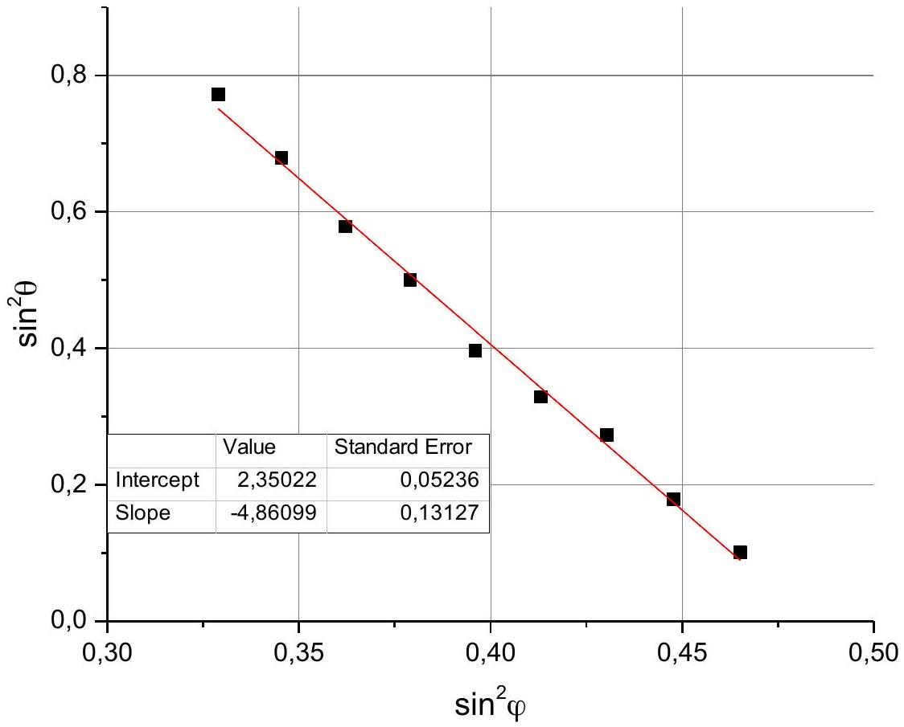
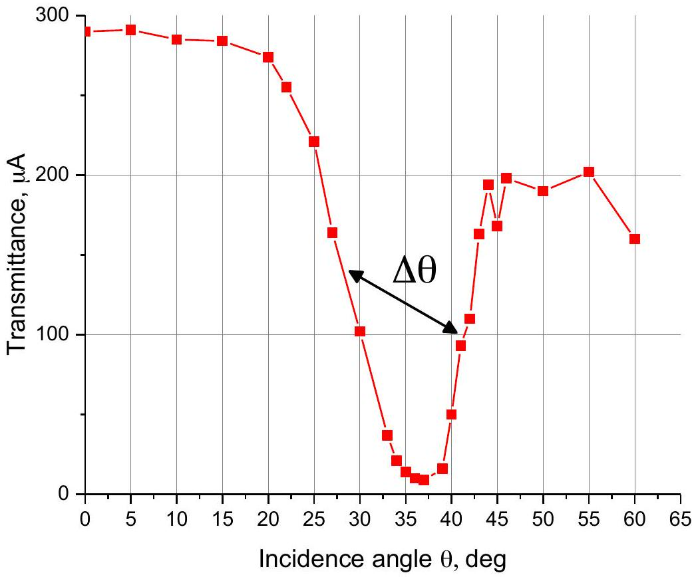
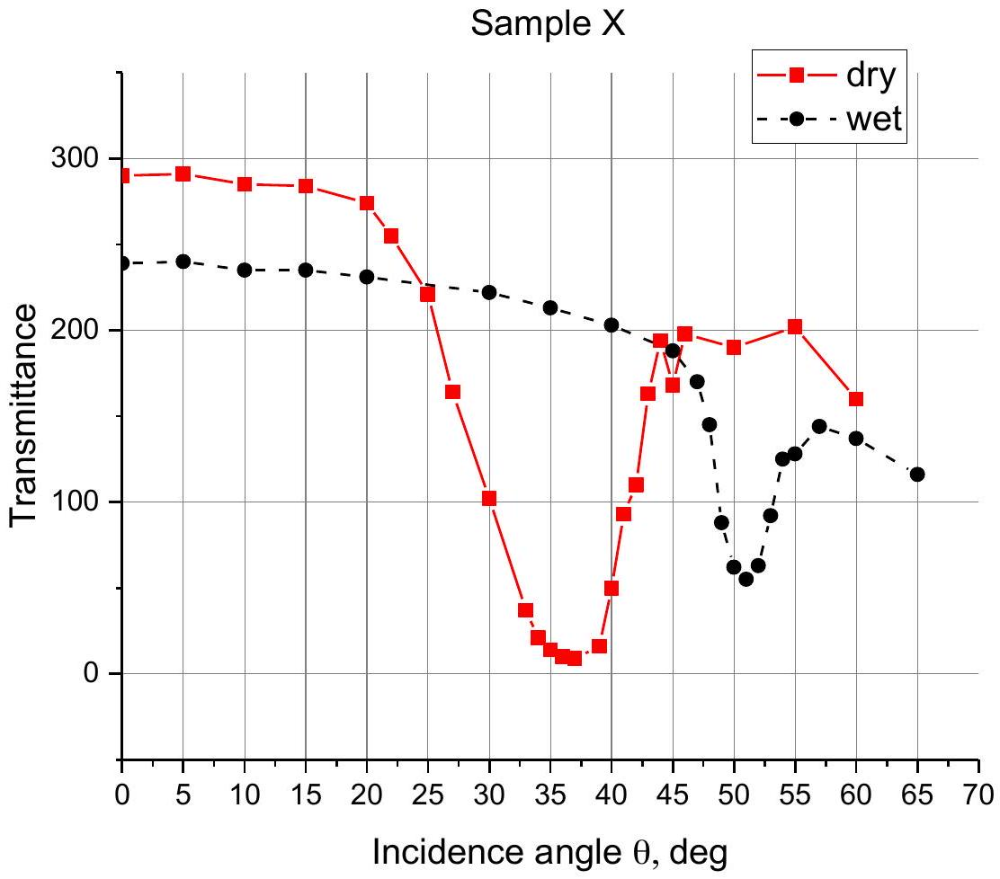
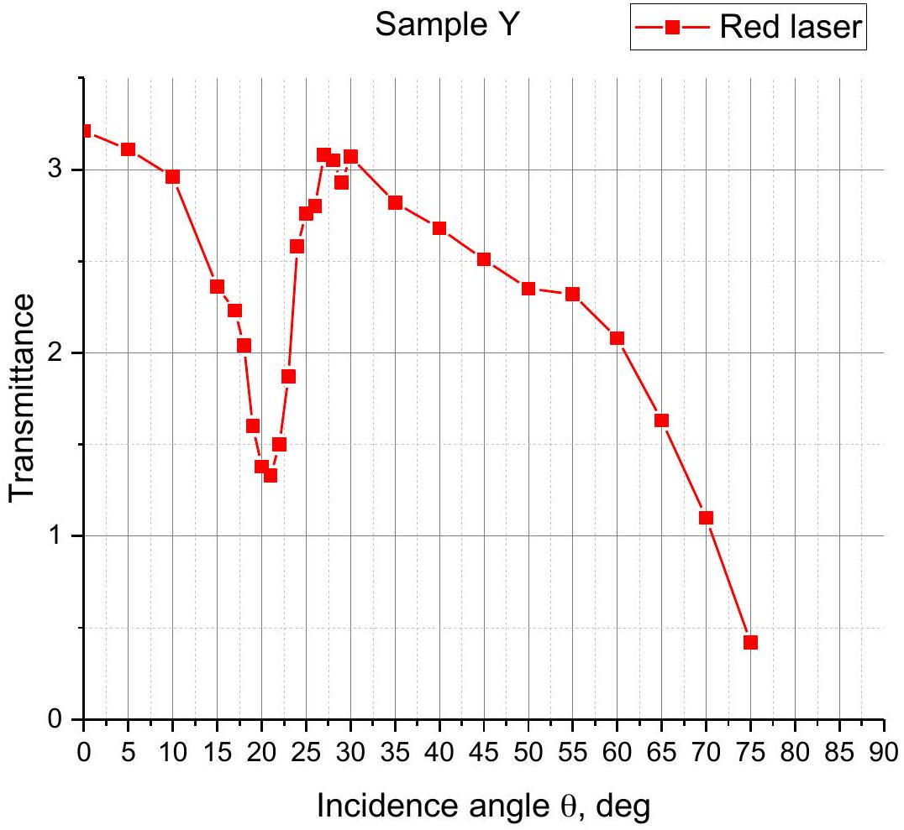
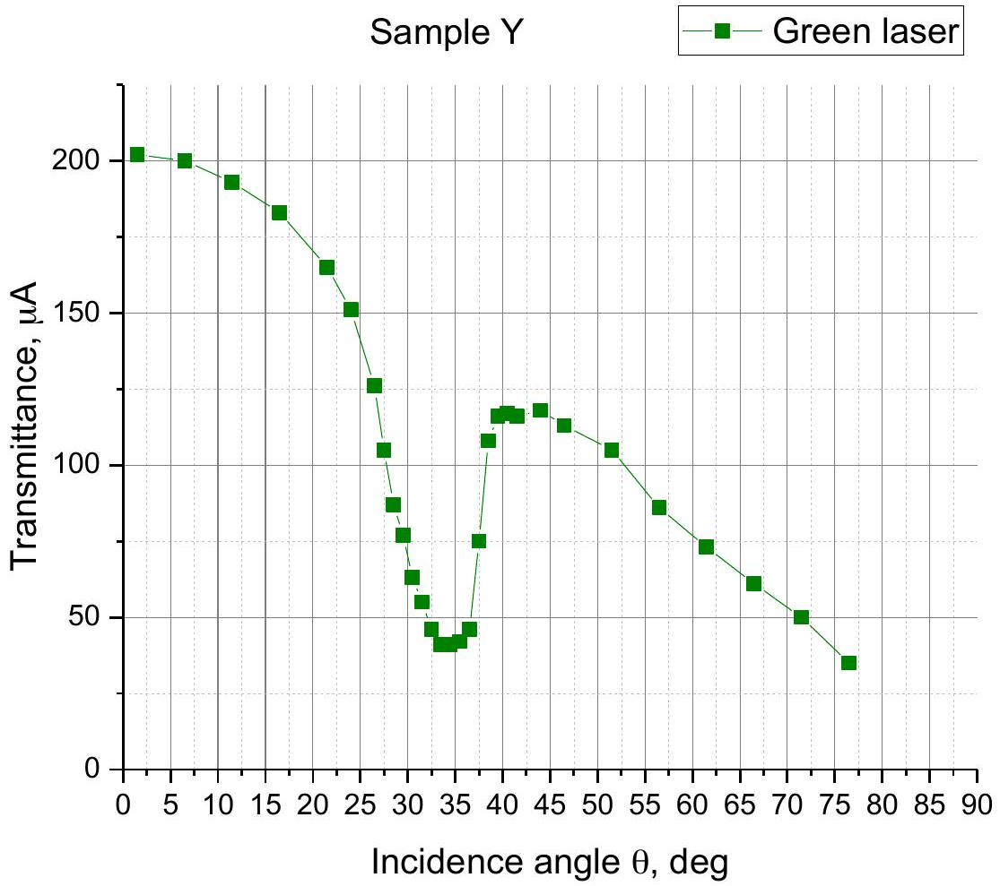
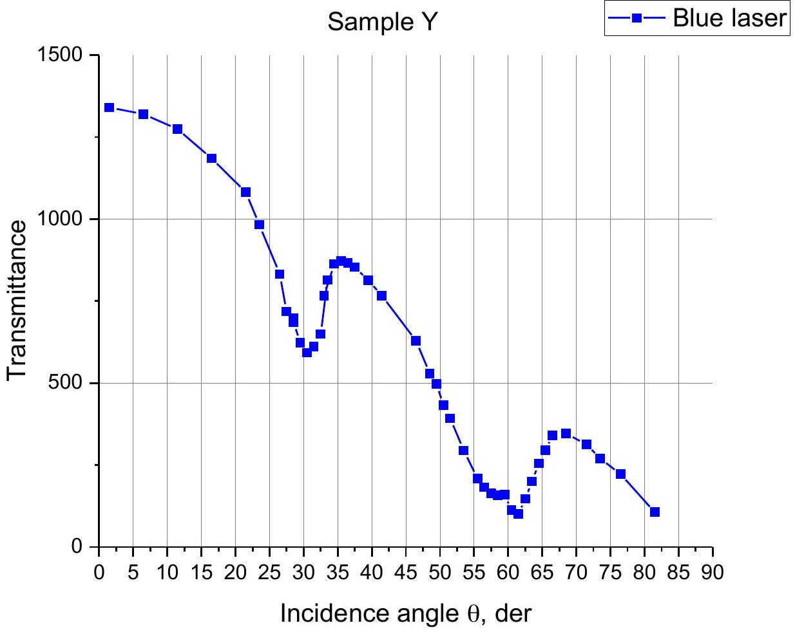
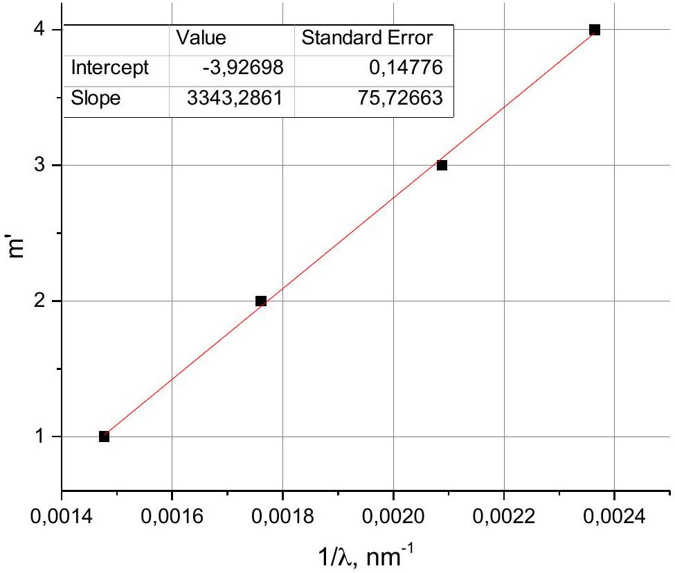
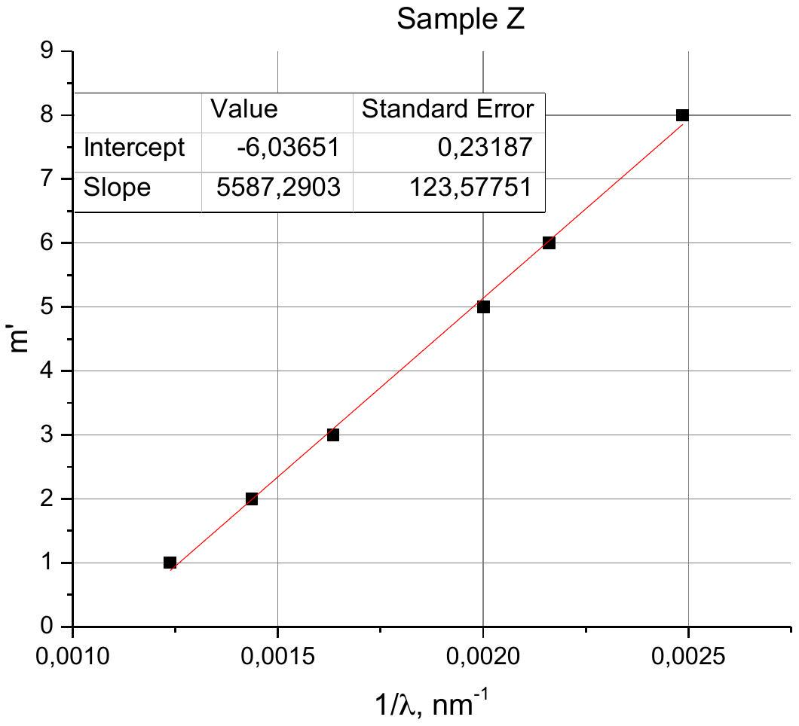

Part A

A1. According to diffraction grating formula
$h \sin \varphi = m \lambda$, where $m = 1$, thus

$$
\begin{equation*}
h \sin \varphi = \lambda \tag{1s}
\end{equation*}
$$

A2.

| $\varphi , { } ^ { \mathrm { o } }$ | $\theta , ^ { \mathrm { o } }$ |
| :--- | :--- |
| 35 | 61,5 |
| 36 | 55,5 |
| 37 | 49,5 |
| 38 | 45 |
| 39 | 39 |
| 40 | 35 |
| 41 | 31,5 |
| 42 | 25 |
| 43 | 18,5 |

A3. Using Bragg-Snell law (2) from the task:

$$
\begin{equation*}
2 D \sqrt { n ^ { 2 } - \sin ^ { 2 } \theta } = m \lambda \tag{2s}
\end{equation*}
$$

and (1s) we get

$$
\begin{gather*}
2 D \sqrt { n ^ { 2 } - \sin ^ { 2 } \theta } = h \sin \varphi \\
n ^ { 2 } - \sin ^ { 2 } \theta = \left( \frac { h } { 2 D } \right) ^ { 2 } \sin ^ { 2 } \varphi \\
\sin ^ { 2 } \theta = n ^ { 2 } - \left( \frac { h } { 2 D } \right) ^ { 2 } \sin ^ { 2 } \varphi  \tag{3s}\\
n = \sqrt { \text { Intercept } } \tag{4s}
\end{gather*}
$$

where intercept is taken from Fig. 1

$$
\begin{equation*}
D = \frac { h } { 2 \sqrt { \mid \text { Slope } \mid } } , \tag{5s}
\end{equation*}
$$

where slope is taken from Fig. 1

Fig. 1

A4. Taking slope and interception point from the Fig. 1 from (4s), (5s) we get:

$$
\begin{gathered}
n _ { X } = 1.53 \\
D _ { X } = 227 \mathrm {~nm}
\end{gathered}
$$

## Part B

B1. Minimum can be observed only in the red zone, so we use red laser with wavelength $\lambda = 650 n m$

B2-B3.

Fig. 2

B4. From the Fig. 2 we find minimum at $\theta _ { 1 } = 37 ^ { \mathrm { o } }$ with width of $\Delta \theta _ { 1 } = 14 ^ { \mathrm { o } }$
B5. Using (2s) we get

$$
2 D \sqrt { n ^ { 2 } - \sin ^ { 2 } \theta _ { 1 } } = m \lambda ;
$$

For the normal wavelength we can write

$$
\begin{gather*}
2 D n = m \lambda _ { X } ; \\
\lambda _ { X } = \frac { \lambda n } { \sqrt { n ^ { 2 } - \sin ^ { 2 } \theta _ { 1 } } } = 707 \mathrm {~nm} . \tag{6s}
\end{gather*}
$$

B6. Using (6s) we determine

$$
\begin{aligned}
& \theta _ { \min } = 27 ^ { \circ } \Rightarrow \lambda _ { \min } = 683 \mathrm {~nm} \\
& \theta _ { \max } = 41 ^ { \circ } \Rightarrow \lambda _ { \max } = 719 \mathrm {~nm} \\
& \Delta \lambda = \lambda _ { \max } - \lambda _ { \min } = 36 \mathrm {~nm}
\end{aligned}
$$

$$
\Delta n = \frac { \pi } { 2 } n \frac { \Delta \lambda } { \lambda } = 0.12
$$

B7. Minimum for the wet sample is at $\theta _ { 2 } = 51 ^ { \circ }$.

Fig. 3

B8. Using (2s) for $n _ { \text {wet } }$ and $n _ { d r y }$ one can obtain

$$
\begin{aligned}
& 2 D \sqrt { n _ { d r y } ^ { 2 } - \sin ^ { 2 } \theta _ { 1 } } = \lambda \\
& 2 D \sqrt { n _ { w e t } ^ { 2 } - \sin ^ { 2 } \theta _ { 2 } } = \lambda
\end{aligned}
$$

Using (4) and (5) from the task we determine

$$
\begin{gathered}
\frac { 7 } { 9 } p = n _ { w e t } ^ { 2 } - n _ { d r y } ^ { 2 } = \sin ^ { 2 } \theta _ { 2 } - \sin ^ { 2 } \theta _ { 1 } \\
p = 0.31 \\
n _ { A A O } = \sqrt { \frac { n ^ { 2 } - p } { 1 - p } } = 1.72
\end{gathered}
$$

B9.Taking $\Delta n = 0.12$ and $p = 0.31$ we get

$$
n _ { 1 } = n + \frac { \Delta n } { 2 } = 1.59
$$

$$
n _ { 2 } = n - \frac { \Delta n } { 2 } = 1.47
$$

Equation (4) yields

$$
\begin{aligned}
& p _ { 1 } = \frac { n _ { A A O } ^ { 2 } - n _ { 1 } ^ { 2 } } { n _ { A A O } ^ { 2 } - 1 } = 0.22 \\
& p _ { 2 } = \frac { n _ { A A O } ^ { 2 } - n _ { 2 } ^ { 2 } } { n _ { A A O } ^ { 2 } - 1 } = 0.41
\end{aligned}
$$

## Part C

C1. For the normal incidence $( \theta = 0 )$ we can observe three minima at angles $\varphi _ { 1 } = 43 ^ { \circ } , \varphi _ { 1 } = 35 ^ { \circ } , \varphi _ { 1 } =$ 29°, therefore $\lambda _ { 1 } ^ { s p } = 682 n m , \lambda _ { 2 } ^ { s p } = 574 n m , \lambda _ { 3 } ^ { s p } = 485 n m$.

C2.

Fig. 4

C3.

Fig. 5

C4.

Fig. 6

C5. Using (6s), we calculate normal wavelengths for an arbitrary order $m ^ { \prime } = m +$ const

$$
\lambda _ { Y } = \frac { \lambda n } { \sqrt { n ^ { 2 } - \sin ^ { 2 } \theta _ { 1 } } }
$$

| $\lambda , n m$ | $\theta$, deg | $\lambda _ { Y } , n m$ | m' |
| :--- | :--- | :--- | :--- |
| 659 | 21 | 678 | 1 |
| 530 | 34 | 569 | 2 |
| 400 | 57 | 478 | 3 |
| 400 | 30 | 423 | 4 |

C6. According to (2s) dependence $m ^ { \prime } \left( \frac { 1 } { \lambda } \right)$ should be linear:

$$
\begin{aligned}
2 D n & = \left( m ^ { \prime } - \text { const } \right) \lambda \\
m ^ { \prime } & = \frac { 2 D n } { \lambda } + \text { const }
\end{aligned}
$$

Sample Y

Fig. 7
$$
m = m ^ { \prime } - \text { Intercept } ,
$$
where intercept is taken from Fig. 7

$$
\text { Intercept } \simeq - 4
$$

| $\lambda , n m$ | m |
| :--- | :--- |

| 677 | 5 |
| :--- | :--- |
| 568 | 6 |
| 479 | 7 |
| 423 | 8 |

C7.

$$
D _ { Y } = \frac { \text { Slope } } { 2 n }
$$

where slope is taken from Fig. 7

$$
D _ { Y } = 1080 \mathrm {~nm}
$$

C8. Let $I _ { 1 }$ be the half-sum of intensities to the left and to the right from the minimum, and $I _ { 2 }$ be intensity in the minimum. Transmittance $t = \frac { I _ { 2 } } { I _ { 1 } }$.

| $\lambda , n m$ | t |
| :--- | :--- |
| 677 | 0.42 |
| 568 | 0.29 |
| 479 | 0.22 |
| 423 | 0.63 |

## Part D

D1. One can find up to 6 maximums:

| $\lambda _ { Z } , n m$ |
| :--- |
| 808 |
| 696 |
| 611 |
| 499 |
| 462 |
| 402 |

D2. According to (2s) dependence $m ^ { \prime } \left( \frac { 1 } { \lambda } \right)$ should be linear:

$$
\begin{aligned}
2 D n & = \left( m ^ { \prime } - \text { const } \right) \lambda \\
m ^ { \prime } & = \frac { 2 D n } { \lambda } + \text { const }
\end{aligned}
$$

Dependence $m ^ { \prime } \left( \frac { 1 } { \lambda } \right)$ will be linear if we take $m ^ { \prime } = 1,2,3,5,6,8$ for visible minimums (see fig.8).

Fig. 8

$$
m = m ^ { \prime } - \text { Intercept }
$$

From fig. 8 Intercept $= - 6$.

$$
m = m ^ { \prime } + 6
$$

| $\lambda _ { Z } , n m$ | $m ^ { \prime }$ | $m$ |
| :--- | :--- | :--- |
| 808 | 1 | 7 |
| 696 | 2 | 8 |
| 611 | 3 | 9 |
| 499 | 5 | 11 |
| 462 | 6 | 12 |
| 402 | 8 | 14 |

D3. $$
D _ { Z } = \frac { \text { Slope } } { 2 n } ,
$$
where slope is taken from Fig. 8
$$
D _ { Z } = 1802 \mathrm {~nm}
$$
D4. $$
m = \frac { \text { Slope } } { \lambda } \Rightarrow \lambda = \frac { \text { Slope } } { m }
$$

Missed minimums correspond to order $\mathrm { m } = 10$ and 13:

| $m$ | $\lambda _ { Z } n m$ |
| :--- | :--- |
| 10 | 559 |
| 13 | 430 |

## Part E

E1. We recognize the sample Y by such feature, that 2 central transmittance minimums are deeper than 2 side transmittance minimums. So, it is n-6.

E2. For the sample $\mathrm { Z } m = 10$ and $m = 13$ are missing, $m = 8,9,11,12$ are not. So, it is hi5-5.
