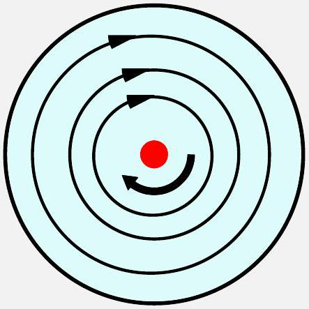
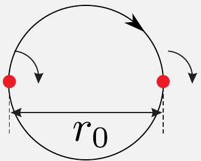
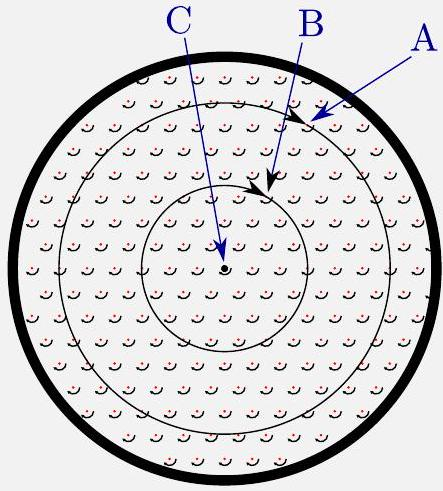
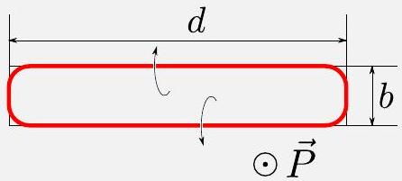
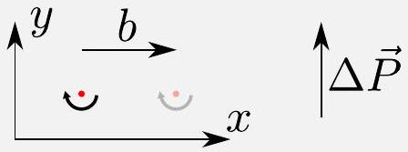
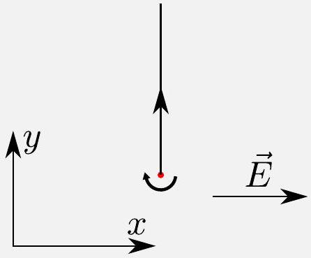
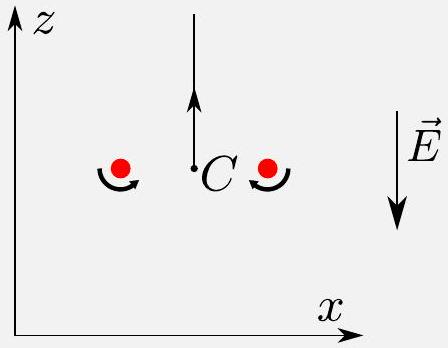
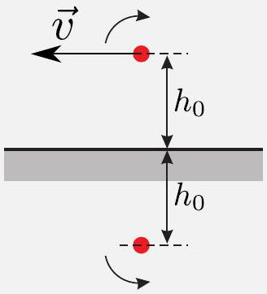
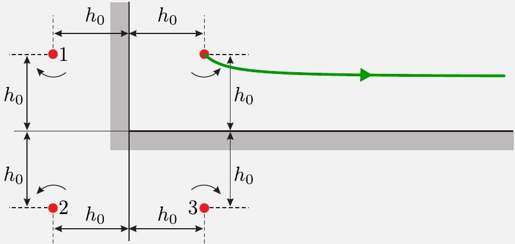

## Vortices in Superfluid MODD-Problems

May 5, 2017

## A. Steady filament (0.75)

Consider a cylindrical beaker (radius $R _ { 0 } \gg a$ ) of superfluid helium and a straight vertical vortex filament in its center Fig. 2.

A1 (0.25)
Plot the streamlines. Find out the velocity $v$ at a point $\vec { r }$.

The streamlines are circular. From the circulation identity (1) it is obvious that $v = \kappa / r$.

- Streamlines are plotted correctly (one at least) . . . . . . . . . . . . . . 0.1
- $v = \frac { k } { r } \ldots . . \ldots . \ldots . \ldots . \ldots . \ldots . . \ldots . . \ldots \ldots . . \ldots . . \ldots . . \ldots . .0 .15$

A2 (0.5)
Work out the free surface shape (height as a function of coordinate $z ( \vec { r } )$ ) around the vortex. Free fall acceleration is $g$. Surface tension can be neglected.

Consider a thin circular layer of the radius $r$. Equilibrium condition for its surface is given by the requirement

$$
\begin{equation*}
g \frac { d z } { d r } = \frac { v ^ { 2 } } { r } = \frac { \kappa ^ { 2 } } { r ^ { 3 } } . \tag{1}
\end{equation*}
$$

This equation is satisfied by the surface profile

$$
\begin{equation*}
z ( r ) = \left[ z _ { 0 } \right] - \frac { \kappa ^ { 2 } } { 2 g r ^ { 2 } } . \tag{2}
\end{equation*}
$$

- $\tan \alpha = \frac { k ^ { 2 } } { g r ^ { 3 } }$ or equivalent
- $z = \left[ z _ { 0 } \right] - \frac { k ^ { 2 } } { 2 g r ^ { 2 } }$

## B. Vortex motion (1.4)

B1 (0.25)
Consider two identical straight vortices initially placed at distance $r _ { 0 }$ from each other as shown in Fig. 4. Find initial velocities of the vortices and draw their trajectories.

Being advected by each other's flow field, filaments will rotate around a point halfway between them. The velocity is given by $v _ { 0 } = \kappa / r _ { 0 }$.

- Trajectories are plotted correctly
- Correct expression for velocity

B2 (0.15)
Draw the trajectories of vortices $\mathrm { A } , \mathrm { B }$, and C (located in the center).

- Trajectories are plotted correctly ............................... 0.15

## B3 (0.4)

Find velocity $v ( \vec { r } )$ of a vortex positioned at $\vec { r }$.
Consider a circular path of radius $r \gg u$ around the beaker center. The circulation along this path is given by the number of vortices within it (vortex density per unit area is $\left. \left( u ^ { 2 } \sqrt { 3 } / 2 \right) ^ { - 1 } \right)$ :

$$
\begin{equation*}
2 \pi r v = 2 \pi \kappa \frac { \pi r ^ { 2 } } { u ^ { 2 } \sqrt { 3 } / 2 } . \tag{3}
\end{equation*}
$$

The velocity field

$$
\begin{equation*}
v = \frac { 2 \pi \kappa r } { u ^ { 2 } \sqrt { 3 } } . \tag{4}
\end{equation*}
$$

- Expression for vortex density
- Correct expression for $v ( r )$

## B4 (0.35)

Find the distance $\mathrm { AB } ( t )$ between the vortices A and B at time $t$. Treat $\mathrm { AB } ( 0 )$ as given.

This velocity pattern corresponds to the rotation of the lattice as a whole around the beaker center with angular velocity

$$
\begin{equation*}
\omega = \frac { 2 \pi \kappa } { u ^ { 2 } \sqrt { 3 } } . \tag{5}
\end{equation*}
$$

$\mathrm { AB } ( t ) = \mathrm { AB } ( 0 )$

- Correct answer . . . . . . . . . . . . . . . . . . . . . . . . . . . . . . . . . . . . . . 0.35

B5 (0.25)
Work out the "smoothed out" (omitting the lattice structure) free helium surface shape $z ( \vec { r } )$.

The surface shape is

$$
\begin{equation*}
z ( r ) = \left[ z _ { 0 } \right] + \frac { \omega ^ { 2 } r ^ { 2 } } { 2 g } = \left[ z _ { 0 } \right] + \frac { 2 \pi ^ { 2 } \kappa ^ { 2 } r ^ { 2 } } { 3 g u ^ { 4 } } . \tag{6}
\end{equation*}
$$

- Correct answer

## C. Momentum and Energy (1.75)

C1 (0.3)
Consider a nearly rectangular vortex loop $b \times d , b \ll d$, Fig. 7. Indicate the direction of its momentum $\vec { P }$. Find out the momentum magnitude.

Momentum of a flat loop (see Introduction) is perpendicular to its plane and proportional to its area. For a rectangular loop the magnitude is $P = 2 \pi \kappa \rho b d$.

- Correct direction of momentum

- Correct expression for momentum magnitude

## C2 (0.7)

Calculate its energy $U$.
To produce equal magnetic and kinetic energy densities $B ^ { 2 } / \left( 2 \mu _ { 0 } \right) =$ $\rho v ^ { 2 } / 2$, the magnetic field has to be $B = v \sqrt { \mu _ { 0 } \rho } = \kappa \sqrt { \mu _ { 0 } \rho } / r$. This field is generated by a current $I = 2 \pi \kappa \sqrt { \rho / \mu _ { 0 } }$. Energy of the wire loop can be found from the inductance $U = L I ^ { 2 } / 2$. Inductance of a nearly rectangular wire loop:

$$
\begin{equation*}
L = \frac { \Phi } { I } = 2 d I ^ { - 1 } \int _ { a } ^ { b } \frac { \mu _ { 0 } I } { 2 \pi r } d r = \frac { \mu _ { 0 } d } { \pi } \log \frac { b } { a } . \tag{7}
\end{equation*}
$$

This gives for the energy

$$
\begin{equation*}
U = 2 \pi \kappa ^ { 2 } \rho d \log \frac { b } { a } \tag{8}
\end{equation*}
$$

- Integration limits are $\sim a$ and $b$
- Analogy with a magnitude field is used $\left( U = \frac { L I ^ { 2 } } { 2 } , L = \frac { \Phi } { I } \right)$ or energy is calculated as $W = \int F d r$, where $F = \frac { d P } { d t }$
- Correct expression for energy

## C3 (0.75)

Suppose we shift a long straight vortex filament by a distance $b$ in $x$ direction, see Fig. 8. How much does the fluid momentum change? Indicate the momentum change direction. The filament length (constrained by the vessel walls) is $d$.

The momentum change is equal to the momentum of a long rectangular loop $P = 2 \pi \kappa \rho b d$.

- The result of C1 used
- Momentum change is parallel to Y axis
- Correct direction of momentum change
- Correct expression for momentum change magnitude

Interestingly, this provides an alternative approach to find the energy of such a loop. Namely, if we slowly move one straight vortex in the velocity field of another, then we apply a force

$$
\begin{equation*}
F = 2 \pi \kappa \rho d v = 2 \pi \kappa \rho d \frac { \kappa } { r } = \frac { 2 \pi \kappa ^ { 2 } \rho d } { r } . \tag{9}
\end{equation*}
$$

The work

$$
\begin{equation*}
W = \int _ { a } ^ { b } \frac { 2 \pi \kappa ^ { 2 } \rho d } { r } d r = 2 \pi \kappa ^ { 2 } \rho d \log \frac { b } { a } \tag{10}
\end{equation*}
$$

has to be performed to move it from distance $a$ to $b$.

## D. Trapped charges (2.85)

## D1 (0.5)

Consider a straight vortex charged with uniform linear density $\lambda < 0$ in a uniform electric field $\vec { E }$. Draw the vortex trajectory. Find its velocity as a function of time.

Electric force $F = E \lambda d$ moves the vortex with velocity

$$
\begin{equation*}
v = \frac { F } { 2 \pi \kappa \rho d } = \frac { E \lambda } { 2 \pi \kappa \rho } \tag{11}
\end{equation*}
$$

perpendicular to $\vec { E }$.

- Trajectory is straight line parallel to Y axis
- Correct direction of velocity
- Correct expression for velocity magnitude

## D234

A circular vortex loop of radius $R _ { 0 }$ initially charged with uniform linear density $\lambda < 0$ is placed in a uniform electric field $\vec { E }$ perpendicular to its plane, opposite to its momentum $\vec { P } _ { 0 }$.

## D2 (0.6)

Draw the trajectory of the loop center $C$. Find the radius of the loop as a function of time.

Electric force upon the loop $F = - 2 \pi E R _ { 0 } | \lambda |$ is constant and fluid momentum linearly depends on time

$$
\begin{equation*}
P = P _ { 0 } + 2 \pi E R _ { 0 } | \lambda | t = 2 \pi ^ { 2 } \rho R ^ { 2 } \kappa . \tag{12}
\end{equation*}
$$

The loop is growing and its radius is increasing with time $t$

$$
\begin{equation*}
R = \sqrt { R _ { 0 } ^ { 2 } + \frac { E R _ { 0 } | \lambda | t } { \pi \rho \kappa } } . \tag{13}
\end{equation*}
$$

- Trajectory is straight line along $y$
- Correct velocity direction
- $P ( t )$
- $2 \pi ^ { 2 } \rho R ^ { 2 } \kappa$
- Correct expression for $R ( t )$

## D3 (1.5)

Find its velocity $v ( t )$ as a function of time.
The loop velocity $v$ can be easily found from a relationship between the energy change rate and the momentum change rate

$$
\begin{equation*}
\frac { d U } { d t } = F v = \frac { d P } { d t } v . \tag{14}
\end{equation*}
$$

This gives for the velocity

$$
v = \frac { d U } { d P } \approx \frac { \kappa } { 2 R } \log \frac { R } { a } = \frac { \kappa \log \left( \sqrt { R _ { 0 } ^ { 2 } + E R _ { 0 } | \lambda | t / ( \pi \rho \kappa ) } / a \right) } { 2 \sqrt { R _ { 0 } ^ { 2 } + E R _ { 0 } | \lambda | t / ( \pi \rho \kappa ) } } \approx ,
$$

This means that the vortex is moving in the direction of the force but its velocity is decreasing.

- Expression for $v \propto \frac { 1 } { R } \log ( R ) \ldots \ldots . . \ldots . . \ldots . . \ldots . . \ldots . . \ldots . . .1 .0$
- Correct expression for $v ( t )$..................................... 0.5

## D4 (0.25)

The field is switched off at a time $t ^ { * }$ when the velocity reaches the value $v ^ { * } =$ $v \left( t ^ { * } \right)$. Find the loop velocity $v ( t )$ at a later time $t > t ^ { * }$.

When $E = 0 \Rightarrow P =$ const $\Rightarrow R =$ const $\Rightarrow v =$ const $\Rightarrow v ( t ) = v ^ { * }$.

- Correct expression for $v ( t ) \ldots \ldots . . \ldots \ldots . . \ldots . . \ldots . . \ldots . . \ldots . .0 .25$

## E. Influence of the boundaries (3.25)

Draw the trajectory of a straight vortex, initially placed at a distance $h _ { 0 }$ from a flat wall. Find its velocity as a function of time.

## E1 (0.5)

Well known technique of image charges (currents) in electrostatics (magnetostatics) can be directly used to solve this problem. Namely, the wall can be "substituted" with a reflected fictitious vortex on the other side of the wall. The velocity distribution of two vortices together in the upper semi-space is identical to the one produce by a single vortex above the wall. Indeed, the symmetry of the problem ensures that there is no flow through the plane of symmetry. Thus, a straight vortex line situated a distance $h _ { 0 }$ above a flat wall with its image behave as a pair of vortices of opposite circulation a distance $2 h _ { 0 }$ apart. This means that the vortex moves along the wall with velocity

$$
\begin{equation*}
v = \frac { \kappa } { 2 h _ { 0 } } . \tag{16}
\end{equation*}
$$

Illustration of the image method for the straight vortex filament near a flat wall

- Trajectory is plotted correctly ............................... 0.15
- Correct direction of velocity . . . . . . . . . . . . . . . . . . . . . . . . . . . . . . 0.1
- Correct expression for velocity magnitude .................... 0.25

## E234

Consider a straight vortex placed in a corner at a distance $h _ { 0 }$ from both walls.

## E2 (0.75)

What is the initial velocity $v _ { 0 }$ of the vortex?
The velocity of the filament is given by superposition of the velocities $\vec { v } _ { 1 } , \vec { v } _ { 2 }$ and $\vec { v } _ { 3 }$ induced by the image vortices 1, 2 and 3, respectively (see Fig. in E3 solution). One readily obtains

$$
v _ { 1 } = \frac { \kappa } { 2 h _ { 0 } } , \quad v _ { 2 } = \frac { \kappa } { 2 \sqrt { 2 } h _ { 0 } } , \quad v _ { 3 } = \frac { \kappa } { 2 h _ { 0 } } .
$$

The modulus of the filament velocity at the initial moment is

$$
v _ { 0 } = \left| \vec { v } _ { 1 } + \vec { v } _ { 2 } + \vec { v } _ { 3 } \right| = \sqrt { 2 } v _ { 1 } - v _ { 2 } = \frac { \kappa } { 2 \sqrt { 2 } h _ { 0 } }
$$

- Ideas of using superposition principal and technique of image charges 0.25
- Correct expression for initial velocity magnitude

## E3 (0.5)

Draw the trajectory of the vortex.

Image vortices in the corner.

- The trajectory has correct form

- Correct direction of initial velocity

## E4 (1.5)

What is the velocity of the vortex $v _ { \infty }$ after very long time?
Energy for the system of vortices is proportional to

$$
\begin{equation*}
U _ { \text {tot } } \propto \log \frac { \sqrt { x ^ { 2 } + y ^ { 2 } } } { a } - \log \frac { x } { a } - \log \frac { y } { a } . \tag{17}
\end{equation*}
$$

The energy conservation implies that

$$
\begin{equation*}
C = \frac { x ^ { 2 } + y ^ { 2 } } { x ^ { 2 } y ^ { 2 } } = \frac { 2 } { h _ { 0 } ^ { 2 } } \tag{18}
\end{equation*}
$$

is constant along the trajectory. After very long time $y \rightarrow h _ { 0 } / \sqrt { 2 }$ and the vortex velocity is

$$
\begin{equation*}
v _ { \infty } = \frac { \kappa } { h _ { 0 } \sqrt { 2 } } . \tag{19}
\end{equation*}
$$

- $E =$ const $\ldots \ldots \ldots \ldots \ldots . \ldots \ldots \ldots . . \ldots \ldots . . \ldots \ldots . . \ldots . . \ldots . . .0 .5$
- Correct expression for velocity after very long time ............ 1.5
