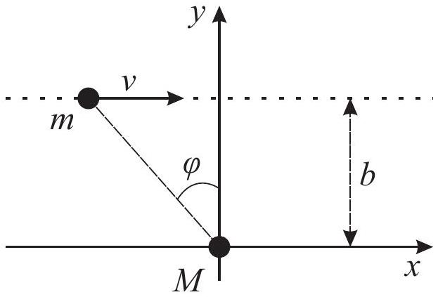
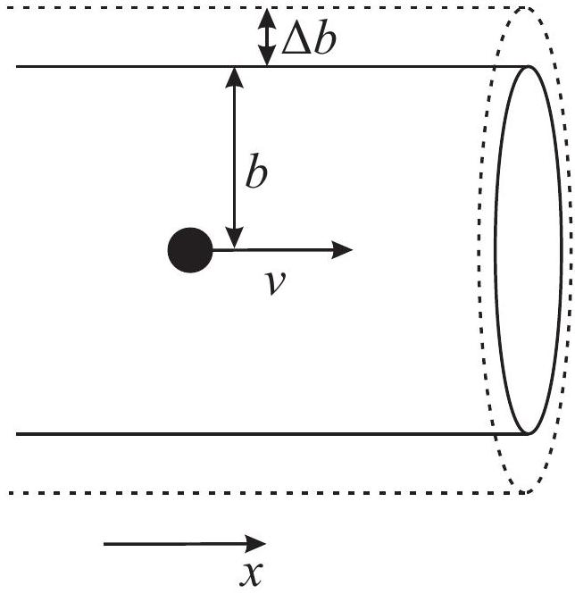

# Evolution of Supermassive Black Holes Binary Solution

A. Dynamical Friction

A1. The deflection angle is defined from: $\tan \alpha \approx \alpha = \frac { p _ { y } } { p _ { x } }$, assuming that $\alpha \ll 1$. One can find $p _ { y } = \int F _ { y } d t$, and according to Newton's gravity law

$$
F _ { y } = \frac { G M m } { b ^ { 2 } } \cos ^ { 3 } \varphi
$$

The geometry: $x = b \tan \varphi$, so we change the variable $d t = \frac { d x } { v } = \frac { b } { v } \frac { d \varphi } { \cos ^ { 2 } \varphi }$ and we have

$$
p _ { y } = \frac { G M m } { b v } \int _ { - \pi / 2 } ^ { \pi / 2 } \cos \varphi d \varphi = \frac { 2 G M m } { b v } .
$$

Here we assume that the body moves along the stright line, due to $\alpha \ll 1$, see Fig 1. So $\alpha = \frac { p _ { y } } { p }$ and

$$
\alpha = \frac { 2 G M } { b v ^ { 2 } } = \frac { 2 b _ { 1 } } { b } , \quad k = 2
$$

A2. During the transit of a massive body, star's energy remains constant: $p _ { x } ^ { 2 } + p _ { y } ^ { 2 } = \operatorname { const }$. Hence

$$
\left( p + \Delta p _ { x } \right) ^ { 2 } + p _ { y } ^ { 2 } = p ^ { 2 } .
$$

We know that $p _ { y } \ll p$, so the SBH momentum change along the x-axis $\Delta p _ { x } = - \frac { p _ { y } ^ { 2 } } { 2 p } = - \frac { \alpha ^ { 2 } } { 2 } p$, so

$$
\Delta p _ { x } = - \frac { 2 G ^ { 2 } M ^ { 2 } m } { b ^ { 2 } v ^ { 3 } } .
$$

A3. To calculate net force we might integrate over stars with different impact parameters. The number of stars' transits during the time $\Delta t$ equals $\Delta N = 2 \pi b v n d b \Delta t$, so force, decelerating the object along the x-axis,

$$
\begin{equation*}
F _ { D F } = \frac { 1 } { \Delta t } \int \Delta p _ { x } d N = - 4 \pi G ^ { 2 } M ^ { 2 } \frac { n m } { v ^ { 2 } } \int _ { b _ { \min } } ^ { b _ { \max } } \frac { d b } { b } = - 4 \pi G ^ { 2 } M ^ { 2 } \frac { \rho } { v ^ { 2 } } \log \Lambda \tag{1}
\end{equation*}
$$

The above formulas are true only for $b > b _ { 1 }$, so the lower integration limit is $b _ { \text {min } } = b _ { 1 }$, and the upper limit is determined by the galaxy size $b _ { \text {max } } = R$. So we have

$$
\begin{equation*}
F _ { D F } = - 4 \pi G ^ { 2 } M ^ { 2 } \frac { \rho } { v ^ { 2 } } \log \Lambda \tag{2}
\end{equation*}
$$

where $\Lambda = R / b _ { 1 }$.
A4. We calculate: $b _ { 1 } = \frac { G M } { v ^ { 2 } } = 10.7 \mathrm { pc } , \log \Lambda = 7.5$.

## B. Gravitational slingshot

B1. From the second Newton's law

$$
\frac { M v ^ { 2 } } { a } = \frac { G M ^ { 2 } } { 4 a ^ { 2 } } ,
$$

and we have for the orbital velocity $v _ { b i n } = \sqrt { \frac { G M } { 4 a } }$. The system energy is

$$
E = E _ { \mathrm { kin } } + U = 2 \cdot \frac { M v ^ { 2 } } { 2 } - \frac { G M ^ { 2 } } { 2 a } .
$$

The answer is

$$
\begin{equation*}
E = - \frac { G M ^ { 2 } } { 4 a } \tag{3}
\end{equation*}
$$

B2. From angular momentum conservation law

$$
b \sigma = r _ { m } v _ { 0 } ,
$$

express $v _ { 0 }$. Write down the energy conservation law

$$
\frac { \sigma ^ { 2 } } { 2 } = \frac { v _ { 0 } ^ { 2 } } { 2 } - \frac { G M _ { 2 } } { r _ { m } }
$$

and derive

$$
b = r _ { m } \sqrt { 1 + \frac { 2 G M _ { 2 } } { \sigma ^ { 2 } r _ { m } } } .
$$

B3. To estimate the time between collisions let us use an analogy with the gas. As known from the molecular kinetic theory, given that molecules have radii $r$, thermal velocities $v$, and the molecular concentration $n$, the time $\Delta t$ between collisions of one molecule with the others can be estimated from the relation $\pi r ^ { 2 } v n \Delta t = 1$. In our problem $b _ { \text {max } }$ stands in place of the molecule radius, therefore for estimation it can be written

$$
( \Delta t ) ^ { - 1 } = \pi \sigma b _ { \max } ^ { 2 } n .
$$

Estimate the maximal impact parameter $b _ { \text {max } }$, corresponding to the star collision with the binary system. The star should reach the distance of $a$ to the binary system to collide. The star at large distances from the SBH binary interacts with it as with a point object of mass $M _ { 2 } = 2 M$. From the results of B.2, assuming $r _ { m } = a$, we obtain $b _ { \text {max } } = a \sqrt { 1 + \frac { 4 G M } { \sigma ^ { 2 } a } }$. Taking into account that $\sigma ^ { 2 } \ll \frac { G M } { a }$, simplify:

$$
b _ { \max } = \frac { 2 } { \sigma } \sqrt { G M a } ,
$$

so we have

$$
\Delta t = \frac { m \sigma } { 4 \pi G M \rho a }
$$

B4. During the one act of gravitational slingshot, star energy increases at average by

$$
\Delta E _ { s t a r } = \frac { m v _ { b i n } ^ { 2 } } { 2 } - \frac { m \sigma ^ { 2 } } { 2 } .
$$

So the binary energy decreases by the same magnitude $\Delta E _ { \text {bin } } = - \Delta E _ { \text {star } }$. Taking into account that $\sigma \ll v _ { \text {bin } }$, we derive

$$
\Delta E _ { b i n } = - \frac { m } { 2 } v _ { b i n } ^ { 2 } = \frac { G m M } { 8 a } .
$$

Average binary system energy loss rate equals

$$
\begin{equation*}
\frac { d E } { d t } = \frac { \Delta E } { \Delta t } = - \frac { \pi G ^ { 2 } M ^ { 2 } \rho } { 2 \sigma } \tag{4}
\end{equation*}
$$

Taking the time derivative of (3), we have

$$
\begin{equation*}
\frac { d E } { d t } = \frac { d } { d t } \left( - \frac { G M ^ { 2 } } { 4 a } \right) = \frac { G M ^ { 2 } } { 4 a ^ { 2 } } \frac { d a } { d t } , \tag{5}
\end{equation*}
$$

From (4) and (5) the orbit radius variation rate can be estimated as

$$
\begin{equation*}
\frac { d a } { d t } = - \frac { 2 \pi G \rho a ^ { 2 } } { \sigma } \tag{6}
\end{equation*}
$$

B5. Equation (6) can be easily integrated

$$
\begin{equation*}
\frac { d a } { a ^ { 2 } } = - \frac { 2 \pi G \rho } { \sigma } d t \tag{7}
\end{equation*}
$$

To reduce the radius twice it takes time

$$
T _ { S S } = \frac { \sigma } { 2 \pi G \rho a _ { 1 } } = 7.3 \times 10 ^ { - 4 } \mathrm {~Gy}
$$

## C. Emission of gravitational waves

C1. Using that $\omega = \frac { v _ { \text {bin } } } { a } = \sqrt { \frac { G M } { 4 a ^ { 3 } } }$ and formulas from the problem text one can obtain:

$$
\begin{equation*}
\frac { d E } { d t } = - \frac { 1024 \times 4 } { 5 } \times \frac { G M ^ { 2 } v _ { b i n } ^ { 6 } } { c ^ { 5 } a ^ { 2 } } = \frac { 64 } { 5 } \cdot \frac { G ^ { 4 } M ^ { 5 } } { c ^ { 5 } a ^ { 5 } } . \tag{8}
\end{equation*}
$$

Combining (5) and (8) we get the desirable result:

$$
\begin{equation*}
\frac { d a } { d t } = - \frac { 256 } { 5 } \cdot \frac { G ^ { 3 } M ^ { 3 } } { c ^ { 5 } a ^ { 3 } } \tag{9}
\end{equation*}
$$

C2. Integrating the equation (9) one can obtain:

$$
\begin{equation*}
a ^ { 3 } d a = - \frac { 256 } { 5 } \cdot \frac { G ^ { 3 } M ^ { 3 } } { c ^ { 5 } } d t \quad \Longrightarrow \quad \frac { a _ { 2 } ^ { 4 } - r _ { g } ^ { 4 } } { 4 } = \frac { 256 } { 5 } \cdot \frac { G ^ { 3 } M ^ { 3 } } { c ^ { 5 } } \cdot T _ { G W } ; \tag{10}
\end{equation*}
$$

And taking into account $a _ { 2 } \gg r _ { g }$ we derive the final result for $T _ { G W }$ :

$$
\begin{equation*}
T _ { G W } = \frac { 5 } { 1024 } \cdot \frac { a _ { 2 } ^ { 4 } c ^ { 5 } } { G ^ { 3 } M ^ { 3 } } \tag{11}
\end{equation*}
$$

C3. From the previous equation and $T _ { G W } = t _ { H }$ :

$$
\begin{equation*}
a _ { H } = \sqrt [ 4 ] { \frac { 1024 } { 5 } \cdot \frac { G ^ { 3 } M ^ { 3 } t _ { H } } { c ^ { 5 } } } = 0.098 \mathrm { pc } \tag{12}
\end{equation*}
$$

## D. Full evolution

D1. The galaxy is spherically symmetric, so mass enclosed within a sphere of radius $r$ equals

$$
\begin{equation*}
m ( r ) = \int _ { 0 } ^ { r } 4 \pi x ^ { 2 } \rho ( x ) d x = \frac { \sigma ^ { 2 } r } { G } . \tag{13}
\end{equation*}
$$

Thus the free fall acceleration of the body equals in the gravitational field of stars is

$$
\begin{equation*}
g ( r ) = \frac { G m ( r ) } { r ^ { 2 } } = \frac { \sigma ^ { 2 } } { r } . \tag{14}
\end{equation*}
$$

Therefore the body velocity is determined by relation

$$
\frac { v ^ { 2 } } { r } = g = \frac { \sigma ^ { 2 } } { r } ,
$$

which means

$$
\begin{equation*}
v = \sigma \tag{15}
\end{equation*}
$$

So the velocity is constant.
D2. The energy of SBH in this gravitational field is

$$
E = \frac { M \sigma ^ { 2 } } { 2 } + U
$$

So the kinetic energy is constant and

$$
\frac { d E } { d t } = \frac { d U } { d t } = \frac { d U } { d a } \frac { d a } { d t }
$$

From the definition of potential energy we have

$$
\frac { d U } { d a } = g ( a ) M = \frac { M \sigma ^ { 2 } } { a }
$$

Using the result of A3 we have

$$
\frac { d E } { d t } = - F _ { D f } v = - 4 \pi G ^ { 2 } M ^ { 2 } \frac { \rho ( a ) } { \sigma } \log \Lambda = - \frac { G M ^ { 2 } \sigma \log \Lambda } { a ^ { 2 } } .
$$

Combining this equations we get the answer

$$
\begin{equation*}
\frac { d a } { d t } = - \frac { G M \log \Lambda } { a \sigma } \tag{16}
\end{equation*}
$$

D3. To estimate one can assume that SBHs form a binary when the mass of stars inside the sphere of radius $a$ equals to $M$ :

$$
m ( a ) = \frac { \sigma ^ { 2 } a } { G } = M ,
$$

so

$$
a _ { 1 } = \frac { G M } { \sigma ^ { 2 } } = 10.8 \mathrm { pc }
$$

Alternative variant: the force from another SBH is equal to force from all stars:

$$
\frac { G m ( a ) } { a ^ { 2 } } = \frac { G M } { 4 a ^ { 2 } }
$$

so the answer is

$$
a _ { 1 } = \frac { G M } { 4 \sigma ^ { 2 } } = 2.7 \mathrm { pc }
$$

D4. Integrating the equation (16) we have

$$
\frac { a _ { 0 } ^ { 2 } - a _ { 1 } ^ { 2 } } { 2 } = \frac { G M \log \Lambda } { \sigma } T _ { 1 }
$$

and using that $a _ { 1 } \ll a _ { 0 }$ we have

$$
T _ { 1 } = \frac { a _ { 0 } ^ { 2 } \sigma } { 2 G M \log \Lambda } = 0.121 \mathrm {~Gy} .
$$

D5. Total energy losses are caused by gravitational slingshot and gravitational waves emission, so combining equations (4) and (8):

$$
\begin{equation*}
\frac { d E } { d t } = - \frac { \pi G ^ { 2 } M ^ { 2 } \rho _ { 1 } } { 2 \sigma } - \frac { 64 } { 5 } \cdot \frac { G ^ { 4 } M ^ { 5 } } { c ^ { 5 } a ^ { 5 } } \tag{17}
\end{equation*}
$$

where

$$
\rho _ { 1 } = \rho \left( a _ { 1 } \right) = \rho ( 10.8 \mathrm { pc } ) = 6.3 \times 10 ^ { 3 } M _ { s } / p c ^ { 3 } , \quad \text { alternative: } \rho _ { 1 } = \rho ( 2.7 \mathrm { pc } ) = 1.0 \times 10 ^ { 5 } M _ { s } / \mathrm { pc } ^ { 3 }
$$

Energy losses due to GW dominates when $\frac { \pi G ^ { 2 } M ^ { 2 } \rho _ { 1 } } { 2 \sigma } < \frac { 64 G ^ { 4 } M ^ { 5 } } { 5 c ^ { 5 } a ^ { 5 } }$ i.e. $a < a _ { 2 }$ where

$$
a _ { 2 } ^ { 5 } = \frac { 128 } { 5 \pi } \cdot \frac { G ^ { 2 } M ^ { 3 } \sigma } { c ^ { 5 } \rho _ { 1 } } = \frac { 512 } { 5 } \cdot \frac { G ^ { 3 } M ^ { 3 } a _ { 1 } ^ { 2 } } { c ^ { 5 } \sigma }
$$

Numerical answer is $a _ { 2 } = 0.018 \mathrm { pc }$ (alternative: $a _ { 2 } = 0.010 \mathrm { pc }$ ).
D6. For rough approximation it can be considered that at the slingshot stage ( $a > a _ { 2 }$ ) energy losses are caused only by slingshot, so $T _ { 2 }$ is calculated analogiously to $\mathrm { B } 5 : \frac { d a } { a ^ { 2 } } = - \frac { 2 \pi G \rho } { \sigma } d t$ and

$$
T _ { 2 } \approx \frac { \sigma } { 2 \pi G \rho _ { 1 } a _ { 2 } } = 0.063 \mathrm {~Gy} \quad \left( T _ { 2 } \approx 0.0068 \mathrm {~Gy} \right)
$$

And at the GW emission stage $\left( a < a _ { 2 } \right)$ energy losses are caused only by GW emission, so $T _ { 3 }$ is calculated directly from C2:

$$
T _ { 3 } \approx \frac { 5 } { 1024 } \cdot \frac { a _ { 2 } ^ { 4 } c ^ { 5 } } { G ^ { 3 } M ^ { 3 } } = \frac { 1 } { 8 \pi } \cdot \frac { \sigma } { G \rho _ { 1 } a _ { 2 } } = 0.016 \mathrm {~Gy} \quad \left( T _ { 3 } \approx 0.0017 \mathrm {~Gy} \right)
$$

D7. Total time of SBH binary evolution from the moment of galaxies merging to SBH merging equals

$$
T _ { e v } = T _ { 1 } + T _ { 2 } + T _ { G W } = 0.12 + 0.06 + 0.02 \mathrm {~Gy} = 0.20 \mathrm {~Gy} \quad \left( T _ { e v } = 0.13 \mathrm {~Gy} \right)
$$
