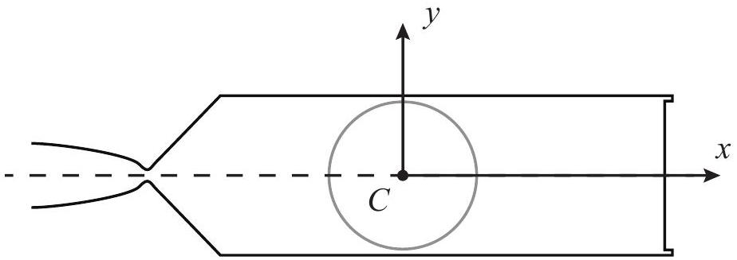
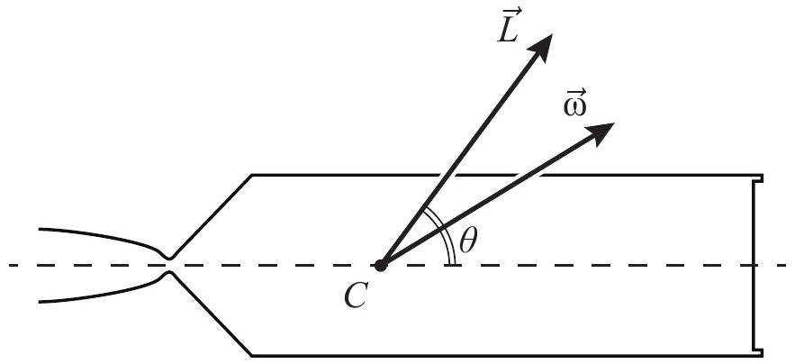
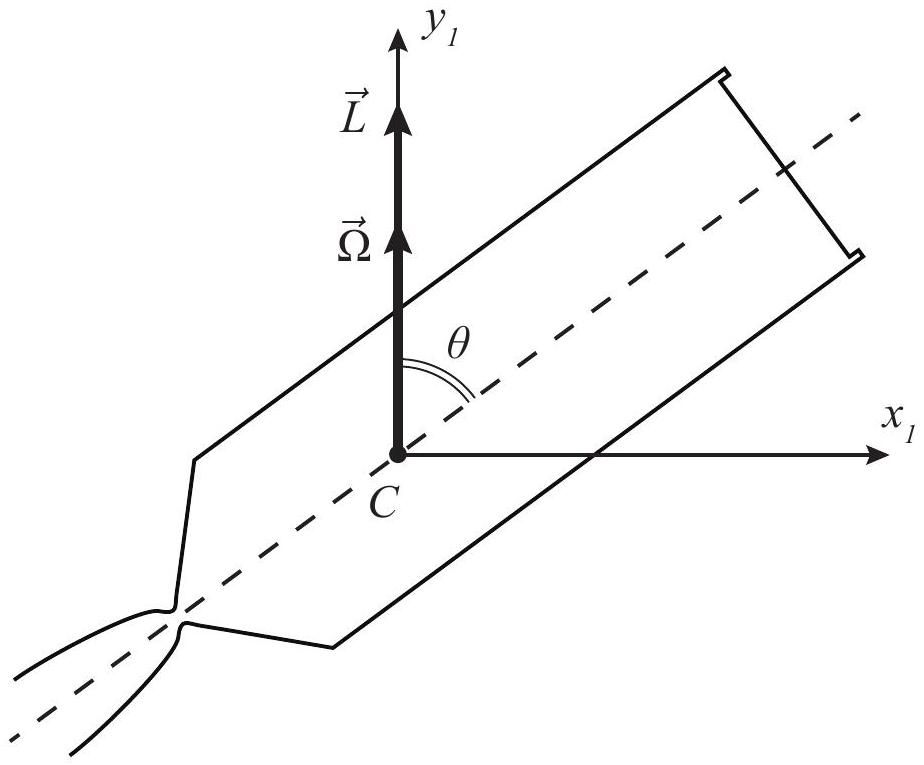
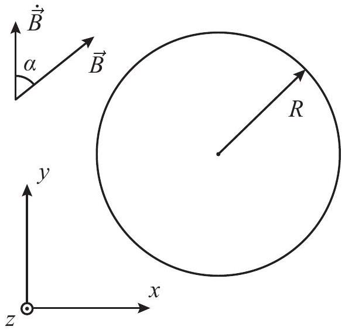
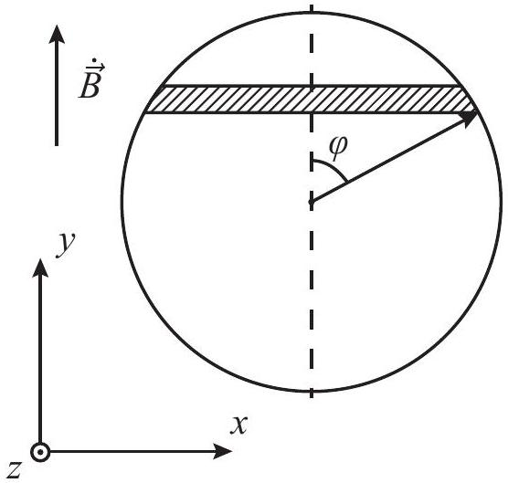
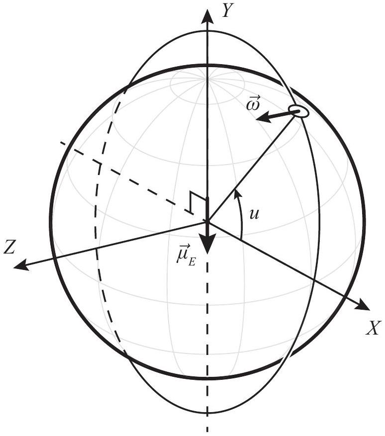

## Space Debris

APhO 2017

## Introduction

In more than half a century of space operations quite a large number of man-made objects have been amassed near Earth. The objects that do not serve any particular purpose are called space debris. The most attention is usually paid to the larger debris objects, i.e. defunct satellites and spent rocket upper stages, which stay in orbit after delivering their payload. Collisions of such objects with each other may result in thousands of fragments endangering all current space missions.

There is a well-known hypothetical scenario, according to which certain collisions may cause a cascade where each subsequent collision generates more space debris that increase the likelihood of new collisions. Such a chain reaction, resulting in the loss of all near-Earth satellites and making impossible further space programs, is called the Kessler syndrome.

To prevent such undesirable outcome special missions are planned to remove large debris object from their present orbits either by tugging them to the Earth's atmosphere or to graveyard orbits. To this end a specially designed spacecraft - a space tug - must capture a debris object. However, before capturing an uncontrolled object it is important to understand its rotational dynamics.

We suggest you to take part in planning of such a mission and find out how the rotational dynamics of a debris object changes in time under the influence of different factors.

## Rocket Stage Schematic

The debris object to be considered is a "Kerbodyne 42" rocket upper stage, whose schematic is shown in Fig. 1. The circle line in Fig. 1 marks the outline of a spherical fuel tank.

Figure 1: "Kerbodyne 42" upper stage

We introduce a body-fixed reference frame $C x y$ with the origin in the center of mass $C , x$ being the symmetry axis of the stage, and $y$ perpendicular to $x$. The inertia moments with respect to $x$ and $y$ axes are $J _ { x }$ and $J _ { y } \left( J _ { x } < J _ { y } \right)$.

## A. Rotation

Consider an arbitrary initial rotation of the stage with angular momentum $L$ (Fig. 2), where $\theta$ is the angle between the symmetry axis and the direction of angular momentum. Fuel tank

at this point is assumed to be empty. No forces or torques act upon the stage.

Figure 2: Rocket stage rotation

1.(0.2 pts) Find the projections $\omega _ { x }$ and $\omega _ { y }$ of angular velocity $\vec { \omega }$ on $x$ and $y$, given that $\vec { L } = J _ { x } \omega _ { x } \overrightarrow { e _ { x } } + J _ { y } \omega _ { y } \overrightarrow { e _ { y } }$ for material symmetry axes $x$ and $y$ with unit vectors $\overrightarrow { e _ { x } }$ and $\overrightarrow { e _ { y } }$. Provide the answer in terms of $L = | \vec { L } |$, angle $\theta$, and inertia moments $J _ { x } , J _ { y }$.

$$
\begin{equation*}
\omega _ { x } = \frac { L \cos \theta } { J _ { x } } , \tag{A1}
\end{equation*}
$$

0.1 point

$$
\begin{equation*}
\omega _ { y } = \frac { L \sin \theta } { J _ { y } } . \tag{A2}
\end{equation*}
$$

0.1 point
2.(0.4 pts) Find the rotational energy $E _ { x }$ associated with rotation $\omega _ { x }$ and $E _ { y }$ associated with rotation $\omega _ { y }$. Find total rotational kinetic energy $E = E _ { x } + E _ { y }$ of the stage as a function of the angular momentum $L$ and $\cos \theta$.

$$
\begin{equation*}
E _ { x } = \frac { J _ { x } \omega _ { x } ^ { 2 } } { 2 } , \tag{A3}
\end{equation*}
$$

0.1 points

$$
\begin{equation*}
E _ { y } = \frac { J _ { y } \omega _ { y } ^ { 2 } } { 2 } , \tag{A4}
\end{equation*}
$$

0.1 points

$$
\begin{equation*}
E ( \theta ) = E _ { x } + E _ { y } = \frac { J _ { x } \omega _ { x } ^ { 2 } } { 2 } + \frac { J _ { y } \omega _ { y } ^ { 2 } } { 2 } = \frac { L _ { x } ^ { 2 } } { 2 J _ { x } } + \frac { L _ { y } ^ { 2 } } { 2 J _ { y } } = \frac { L ^ { 2 } } { 2 J _ { y } } + \frac { L ^ { 2 } } { 2 } \left( \frac { 1 } { J _ { x } } - \frac { 1 } { J _ { y } } \right) \cos ^ { 2 } \theta . \tag{A5}
\end{equation*}
$$

0.2 points

In the following questions of Section A consider the stage's free rotation with the initial angular momentum $L$ and $\theta ( 0 ) = \theta _ { 0 }$.
3. (1.2 pts) Let us denote by $x _ { 0 }$ the initial orientation of the stage's symmetry axis $C x$ with respect to the inertial reference frame. Using conservation laws find the maximum angle $\psi$, which the stages symmetry axis $C x$ makes with $x _ { 0 }$ during the stage's free rotation.

Note: Since there are no external torques acting upon the stage, the angular momentum vector remains constant.

Both kinetic energy and angular momentum are conserved, and $\cos ^ { 2 } \theta$ can be obtained from equation A5.
Consequently, the set of values that $\theta$ can take is discrete (one value in each quadrant for every value of $\cos ^ { 2 } \theta$ ), and in the process of continuous motion $\theta$ cannot change its initial value. Therefore the stage's axis of symmetry moves around $\vec { L }$ making a conic surface with aperture $2 \theta _ { 0 }$. Consequently

$$
\begin{equation*}
\psi = 2 \theta _ { 0 } . \tag{A6}
\end{equation*}
$$

1.2 points for the correct answer for $\psi$.

If the correct answer is not provided 1.0 point is given for the proof that $\theta ( t ) = \theta _ { 0 }$ and does not change in time.
If this is not done:

- 0.2 points for the formula expressing the angular momentum conservation,
- 0.2 points for the formula expressing the energy conservation,
- 0.2 points for the formula expressing $\theta$ through any given constant parameters of the problem

Figure 3:

Let us now introduce the reference frame $C x _ { 1 } y _ { 1 } z _ { 1 }$ with $y _ { 1 }$ along the constant angular momentum vector $\vec { L }$ (Fig. 3). This reference frame rotates about $y _ { 1 }$ in such a way, that the stage's symmetry axis always belongs to the $C x _ { 1 } y _ { 1 }$ plane.
4. ( 2.0 pts) Given $L , \theta ( 0 ) = \theta _ { 0 }$ and inertia moments $J _ { x } , J _ { y }$, find the angular velocity $\Omega ( t )$ of the reference frame $C x _ { 1 } y _ { 1 }$ about $y _ { 1 }$ and direction (i.e. angle $\gamma _ { s } ( t )$ that $\vec { \omega } _ { s } ( t )$ makes with the symmetry axis $C x$ ) and absolute value of angular velocity of the stage $\vec { \omega } _ { s } ( t )$ relative to the reference frame $C x _ { 1 } y _ { 1 }$ as functions of time.

Note: angular velocity vectors are additive $\vec { \omega } = \vec { \omega } _ { x } + \vec { \omega } _ { y } = \vec { \Omega } + \vec { \omega } _ { s }$.
The symmetry axis is at rest with respect to the rotating reference frame, because $\theta ( t ) =$ $\theta _ { 0 }$ and the symmetry axis always belongs to the $C x _ { 1 } y _ { 1 }$ plane. Hence, $\vec { \omega } _ { s }$ must be collinear to the symmetry axis at all times. Thus

$$
\gamma _ { s } ( t ) = 0 .
$$

0.5 points

Projecting the sum $\vec { \Omega } + \vec { \omega } _ { s }$ onto $C x$ and $C y$ yields for any $t$ :

$$
\begin{array} { r }
\omega _ { s } + \Omega \cos \theta = \omega _ { x } = \frac { L \cos \theta } { J _ { x } } \\
\Omega \sin \theta = \omega _ { y } = \frac { L \sin \theta } { J _ { y } } \tag{A8}
\end{array}
$$

0.25 points for each of the equations A7 and A8

Whence

$$
\begin{equation*}
\Omega = \frac { L } { J _ { y } } . \tag{A9}
\end{equation*}
$$

Thus $\Omega$ does not depend on time.
1.0 points

Taking into account that $\theta ( t ) = \theta _ { 0 }$ :

$$
\begin{equation*}
\omega _ { s } = \left( \frac { 1 } { J _ { x } } - \frac { 1 } { J _ { y } } \right) L \cos \theta _ { 0 } . \tag{A10}
\end{equation*}
$$

And $\omega _ { s }$ also does not depend on time.
0.5 points

NB:
1.0 points is given for the correct answer for $\Omega$.
For $\omega _ { s } 0.5$ points is given for the direction of $\overrightarrow { \omega _ { s } }$ (along $C x$ )
0.5 points is given for A10

Alternatively:
0.25 points is given for any of the A7, A8 equations

## B. Transient Process

Most of the propellant is used during the ascent, however, after the payload has been separated from the stage, there still remains some fuel in its tank. Mass $m$ of residual fuel is negligible in comparison to the stage's mass $M$. Sloshing of the liquid fuel and viscous friction forces in the fuel tank result in energy losses, and after a transient process of irregular dynamics the energy reaches its minimum.
1.(0.6 pts) Find the value $\theta _ { 2 }$ of angle $\theta$ after the transient process, for arbitrary initial values of $L$ and $\theta ( 0 ) = \theta _ { 1 } \in ( 0 , \pi / 2 )$.

Interaction of the residual fuel with the fuel tank walls can be considered an internal force. Hence, as before, no external forces or torques act upon the system, and the angular momentum is conserved.
For the given initial value of $\theta$ and knowing that $J _ { x } < J _ { y }$, it is easily shown from A5 that $E ( \cos \theta )$ reaches its minimum for $\theta = \pi / 2$.
Thus

$$
\begin{equation*}
\theta _ { 2 } = \frac { \pi } { 2 } . \tag{B1}
\end{equation*}
$$

0.6 points

2.(0.6 pts) Calculate the value $\omega _ { 2 }$ of angular velocity $\omega$ after the transient process, given that initial angular velocity $\omega ( 0 ) = \omega _ { 1 } = 1 \mathrm { rad } / \mathrm { s }$ makes an angle of $\gamma ( 0 ) = \gamma _ { 1 } = 30 ^ { \circ }$ with the stage's symmetry axis. The moments of inertia are $J _ { x } = 4200 \mathrm {~kg} \cdot \mathrm {~m} ^ { 2 }$ and $J _ { y } = 15000 \mathrm {~kg} \cdot \mathrm {~m} ^ { 2 }$.

B1 implies that after the transient process the stage rotates about the axis perpendicular to its symmetry axis.
0.2 points

Final angular velocity value $\omega _ { 2 }$ can be obtained from the angular momentum conservation law:

$$
\begin{equation*}
\omega _ { 2 } = \frac { L } { J _ { y } } = \frac { \sqrt { J _ { x } ^ { 2 } \cos ^ { 2 } \gamma _ { 1 } + J _ { y } ^ { 2 } \sin ^ { 2 } \gamma _ { 1 } } } { J _ { y } } \omega _ { 1 } \tag{B2}
\end{equation*}
$$

0.2 points

$$
\begin{equation*}
\omega _ { 2 } \approx 0.56 \mathrm { rad } / \mathrm { s } . \tag{B3}
\end{equation*}
$$

0.2 points

## C. Magnetic Field

Another important factor in rotational dynamics of a debris rocket stage, which is orbiting the Earth, is its interaction with the Earth's magnetic field. Let us first consider an auxiliary problem.

## Torque due to Eddy Currents

Let us place a thin-walled nonmagnetic spherical shell with wall thickness $D$ and radius $R$ in a uniform magnetic field $\vec { B }$, which slowly changes so that its derivative $\overrightarrow { \dot { B } }$ is a constant vector making angle $\alpha$ with the direction of $\vec { B }$ (Fig. 4). Electrical resistivity of the shell's material is $\rho$.

Figure 4: Spherical shell in magnetic field

1. (1.0 pts) Find the induced magnetic moment $\vec { \mu }$ of the shell, neglecting its self-inductance. Provide the answer for $\vec { \mu }$ in the form of projections on $x y z$ (see Fig. 4).

Let us cut the sphere into ring slices so that $\dot { \vec { B } }$ is perpendicular to their planes and introduce angle $\varphi$ as shown in Fig. 5.

Figure 5:

According to Faraday's law the absolute value of eddy current EMF, induced in such a slice by the varying magnetic field is

$$
\begin{equation*}
\mathcal { E } = \dot { \Phi } = S \dot { B } = \pi R ^ { 2 } \sin ^ { 2 } \varphi \dot { B } \tag{C1}
\end{equation*}
$$

0.2 points

The ring slice resistance is

$$
\begin{equation*}
d r = \frac { 2 \pi \rho R \sin \varphi } { D R d \varphi } . \tag{C2}
\end{equation*}
$$

0.2 points

Current in the ring slice

$$
\begin{equation*}
d I = \mathcal { E } / d r = \frac { 1 } { 2 \rho } D R ^ { 2 } \dot { B } \sin \varphi d \varphi \tag{C3}
\end{equation*}
$$

0.1 points

And, finally, magnetic moment:

$$
\begin{equation*}
d \mu = S d I = \frac { \pi } { 2 \rho } D R ^ { 4 } \dot { B } \sin ^ { 3 } \varphi d \varphi = \frac { 1 } { 4 \rho } \dot { B } d J , \tag{C4}
\end{equation*}
$$

where $d J$ is the moment of inertia for a slice ring of unit density with respect to the central axis, which is parallel to $y$.
0.2 points

Thus

$$
\begin{equation*}
\mu = \frac { 1 } { 4 \rho } J \dot { B } = \frac { 2 \pi } { 3 \rho } D R ^ { 4 } \dot { B } , \tag{C5}
\end{equation*}
$$

where $J$ is the moment of inertia of the sphere with respect to the axis, passing through its center. Taking into account the direction:

$$
\begin{gather*}
\mu _ { x } = 0  \tag{C6}\\
\mu _ { y } = - \frac { 2 \pi } { 3 \rho } D R ^ { 4 } \dot { B } ,  \tag{C7}\\
\mu _ { z } = 0 . \tag{C8}
\end{gather*}
$$

0.1 points for each $\vec { \mu }$ component
2. (0.3 pts) Find the torque $\vec { M }$ acting on the spherical shell. Provide the answer for $\vec { M }$ in the form of projections on $x y z$ (see Fig. 4).

The torque is given by $\vec { M } = [ \vec { \mu } , \vec { B } ]$. It is directed along the $z$ axis and equals

$$
\begin{equation*}
M _ { z } = \mu B \sin \alpha = \frac { 2 \pi } { 3 \rho } D R ^ { 4 } B \dot { B } \sin \alpha . \tag{C9}
\end{equation*}
$$

0.1 points for each $\vec { M }$ component

NB: Alternatively, if the task of the previous assignment (find $\vec { \mu }$ ) is not completed, but the answer for $\vec { M }$ is, nevertheless, provided, the points for intermediate steps from the previous assignment (except 0.3 points for $\vec { \mu }$ components) are redistributed for the actions to find $\vec { M }$.

## Attitude Motion Evolution in the Earth's Magnetic Field

Let us find out how the rotation changes for a rocket stage, which moves in a circular polar orbit with orbital period $T = 100 \mathrm {~min}$ (Fig. 6). It transpires that the characteristic times of dynamics due to interaction with the geomagnetic field are much greater than the duration of the transient process. We will now study what happens to the rocket stage after the transient process has completed. To start our analysis consider the stage rotating with angular velocity $\omega _ { 2 }$ about the axis perpendicular to the orbital plane.

Figure 6: The orbit

1.(0.4 pts) The Earth's magnetic field $\vec { B } _ { E }$ can be modeled as the magnetic field of a point dipole in the Earth's center. Its dipole moment $\vec { \mu } _ { E }$ is directed opposite to $Y$ axis. The absolute value of the Earth's magnetic field $B$ at the point where the orbit crosses the equatorial plane

$X Z$ is $B _ { 0 } = 20 \mu T$. Find $\vec { B } _ { E } ( u )$ at a current position of the stage in the orbit defined by the angle $u$ as shown in Fig. 6. The positive direction of $u$ is along with the orbital motion. Provide the answer in the form of the projections of $\vec { B } _ { E } ( u )$ on $X Y Z$ axes.

Note: Magnetic field of a dipole at point $\vec { r }$ is given by

$$
\vec { B } = \frac { \mu _ { 0 } } { 4 \pi } \left( \frac { 3 ( \vec { \mu } \cdot \vec { r } ) \vec { r } } { r ^ { 5 } } - \frac { \vec { \mu } } { r ^ { 3 } } \right) .
$$

Note: It may facilitate subsequent calculations if projections of $\vec { B } _ { E } ( u )$ are given as functions of $2 u$ instead of $u$.

Let $R _ { O }$ be the orbit radius. The dipole field formula at point $\vec { r } = \left( R _ { O } \cos u , R _ { O } \sin u , 0 \right)$ and $\vec { \mu } = \left( 0 , - \vec { \mu } _ { E } , 0 \right)$ yield

$$
\begin{gather*}
B _ { X } = - \frac { 3 } { 2 } \frac { \mu _ { 0 } \mu _ { E } } { 4 \pi R _ { O } ^ { 3 } } \sin 2 u ,  \tag{C10}\\
B _ { Y } = \left( 1 - 3 \sin ^ { 2 } u \right) \frac { \mu _ { 0 } \mu _ { E } } { 4 \pi R _ { O } ^ { 3 } } ,  \tag{C11}\\
B _ { Z } = 0 . \tag{C12}
\end{gather*}
$$

0.05 for each $\vec { B }$ component, if no final answer (see below) is obtained.

At point, where the orbit passes through the equatorial plane $( u = 0 )$ the magnetic field is

$$
\begin{gather*}
B _ { X } = 0  \tag{C13}\\
B _ { Y } = \frac { \mu _ { 0 } \mu _ { E } } { 4 \pi R _ { O } ^ { 3 } } ,  \tag{C14}\\
B _ { Z } = 0 . \tag{C15}
\end{gather*}
$$

Thus $B _ { 0 } = \frac { \mu _ { 0 } \mu _ { E } } { 4 \pi R _ { O } ^ { 3 } }$.
0.1 points for $B _ { 0 }$

Finally, the Earth's magnetic field is:

$$
\begin{gather*}
B _ { X } ( u ) = - \frac { 3 } { 2 } B _ { 0 } \sin 2 u ,  \tag{C16}\\
B _ { Y } ( u ) = \frac { 1 } { 2 } ( 3 \cos ( 2 u ) - 1 ) B _ { 0 } ,  \tag{C17}\\
B _ { Z } ( u ) = 0 . \tag{C18}
\end{gather*}
$$

0.1 points for each component of $\vec { B }$

The "Kerbodyne 42" rocket upper stage is mostly made of wood, and the only conductive

material is used for its cryogenic fuel tank. We, therefore, consider the stage's interaction with the geomagnetic field as that of the spherical shell with wall thickness $D = 2 m m$, radius $R = 4 m$ and resistivity $\rho = 2.7 \cdot 10 ^ { - 8 } \Omega \cdot m$.
2.(1.3 pts) Find the torque $\vec { M } ( u )$ acting on the stage, as it rotates with angular velocity $\omega$ collinear to $Z$. Provide the answer for $\vec { M } ( u )$ in the form of projections on $X Y Z$.

Using C9 requires us to find the magnetic field derivative in the body frame.
Consider a body frame $x y z$, whose axis $z$ is collinear to $Z$ and plane $x y$ is rotated by angle $\beta$ with respect to $X Y$. Magnetic field in this reference frame is

$$
\begin{gather*}
B _ { x } = B _ { X } \cos \beta + B _ { Y } \sin \beta  \tag{C19}\\
B _ { y } = - B _ { X } \sin \beta + B _ { Y } \cos \beta  \tag{C20}\\
B _ { z } = B _ { Z } = 0 \tag{C21}
\end{gather*}
$$

0.1 point for any idea that provides understanding that there are two processes in which $B$ changes with respect to body-frames - orbital motion and rotational dynamics. The same 0.1 point is given for any approach overcoming this issue.

The derivative of magnetic field is therefore

$$
\begin{aligned}
\dot { B } _ { x } & = \dot { B } _ { X } \cos \beta + \dot { B } _ { Y } \sin \beta + \left( - B _ { X } \sin \beta + B _ { Y } \cos \beta \right) \dot { \beta } = \\
& = \left( B _ { X } ^ { \prime } ( u ) \cos \beta + B _ { Y } ^ { \prime } ( u ) \sin \beta \right) \dot { u } + \left( - B h _ { X } \sin \beta + B _ { Y } \cos \beta \right) \dot { \beta } , \\
\dot { B } _ { y } & = - \dot { B } _ { X } \sin \beta + \dot { B } _ { Y } \cos \beta + \left( - B _ { X } \cos \beta - B _ { Y } \sin \beta \right) \dot { \beta } = \\
& = \left( - B _ { X } ^ { \prime } ( u ) \sin \beta + B _ { Y } ^ { \prime } ( u ) \cos \beta \right) \dot { u } + \left( - B _ { X } \cos \beta - B _ { Y } \sin \beta \right) \dot { \beta } , \\
\dot { B } _ { z } & = 0 .
\end{aligned}
$$

0.1 points for each component of $\dot { \vec { B } }$ related to the orbital motion
0.1 points for each component of $\vec { B }$ related to the rotational dynamics Full points are also given if $\dot { \vec { B } }$ is found in the vector form

Substituting $\dot { u } = 2 \pi / T$ and $\dot { \beta } = \omega$ and using the expressions C9, C16, and C17, we obtain that the torque is directed along $z$ and equals

$$
\begin{equation*}
M _ { z } = \frac { 2 \pi } { 3 \rho } D B _ { 0 } ^ { 2 } R ^ { 4 } \left( \frac { 3 \pi } { T } ( 3 - \cos 2 u ) - \frac { \omega } { 2 } ( 5 - 3 \cos 2 u ) \right) = M _ { Z } . \tag{C22}
\end{equation*}
$$

0.1 points for $M _ { x }$ and $M _ { y }$,
0.5 points for $M _ { z }$ (for complicated calculations)
3. (1.0)Find the absolute value of angular velocity $\omega ( t )$ as a function of time, given that the change in the stage's angular velocity over one orbital period is negligibly small.

We will average $M _ { Z }$ over $u$ and use the obtained expression instead of $M _ { Z }$. This helps getting rid of the members, containing $\cos 2 u$ :

$$
\begin{equation*}
\left\langle M _ { Z } \right\rangle = \frac { 2 \pi } { 3 \rho } D B _ { 0 } ^ { 2 } R ^ { 4 } \left( \frac { 9 \pi } { T } - \frac { 5 \omega } { 2 } \right) . \tag{C23}
\end{equation*}
$$

0.25 points for the explicit idea to average $M _ { Z }$ over $u$
0.25 for the correct expression for $\left\langle M _ { Z } \right\rangle$

As the torque is directed along with the rotation axis, it does not change the axis' direction, which means that the obtained formula always holds for the rocket stage rotational dynamics. As we consider the transient process to have completed. It follows from B1 that the rocket stage rotates about the axis, which is perpendicular to its symmetry axis. Thus the angular momentum of the stage is

$$
\begin{equation*}
L _ { Z } = J _ { y } \omega . \tag{C24}
\end{equation*}
$$

0.25 for the correct equation with the correct inertia moment

As $\dot { L } _ { Z } = M _ { Z }$ is the governing equation for the angular velocity:

$$
\begin{equation*}
\dot { \omega } = \frac { 2 \pi } { 3 J _ { y } \rho } D B _ { 0 } ^ { 2 } R ^ { 4 } \left( \frac { 9 \pi } { T } - \frac { 5 \omega } { 2 } \right) . \tag{C25}
\end{equation*}
$$

Its solution is:

$$
\begin{equation*}
\omega ( t ) = \frac { 18 \pi } { 5 T } + \left( \omega _ { 2 } - \frac { 18 \pi } { 5 T } \right) e ^ { - \delta t } , \tag{C26}
\end{equation*}
$$

where $\delta = \frac { 5 \pi } { 3 J _ { y \rho } \rho } D B _ { 0 } ^ { 2 } R ^ { 4 }$.
0.25 points for the correct solution of the differential equation for $\omega$ Alternatively 0.15 for the exponential dependence of $\omega$ from $t$.
4. (1.0) Find the ratio of the orbital period $T$ and the rocket stage's rotation period $T _ { s }$ in the steady-state regime, which sets in after a long time.

From C26 it follows that the angular velocity asymptotically tends to $18 \pi / 2 T$. Thus the ratio of the two periods

$$
\begin{equation*}
\frac { T } { T _ { s } ( \infty ) } = \frac { T \omega ( \infty ) } { 2 \pi } = 9 / 5 = 1.8 . \tag{C27}
\end{equation*}
$$

1.0 for the correct result.
