## SOLUTION

A. Understanding of magnetic fields (1.0 point)

1. Understanding of magnetic field created by a circular coil

| A. 1 | $k = 6.28 \times 10 ^ { - 3 } \mathrm { mT } / \mathrm { mA }$ | 0.5 pt |
| :--- | :--- | :--- |

2. Understanding of the Earth's magnetic field

| A. 2 | $B _ { \beta } = B _ { \mathrm { h } } \boldsymbol { \operatorname { c o s } } \beta$ | 0.5 pt |
| :--- | :--- | :--- |

B. Investigation of the GMR effect using a GMR magnetic sensor (7 points)
2. Determination of resistance of GMR elements

a. Resistance of the elements at $B = 0$.

| B. 1 | Diagrams of the experiment and the expressions for calculating the resistance of each element $a , b , c$ and $d$. a. Short circuit pins 8 and 4. $\begin{align*} & R _ { 5,84 } = m ; R _ { 1,84 } = n \\ & \frac { 1 } { m } = \frac { 1 } { a } + \frac { 1 } { b }  \tag{1}\\ & \frac { 1 } { n } = \frac { 1 } { c } + \frac { 1 } { d } \tag{2} \end{align*}$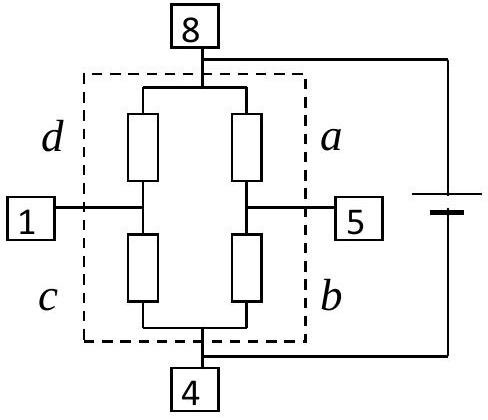   Solve the system of equations (1), (2), (3) and (4). Obtain: $a = m ( p + 1 ) ; b = m \left( 1 + \frac { 1 } { p } \right)$ | 1.25 pt |
| :--- | :--- | :--- |

|  | $c = n \left( 1 + \frac { 1 } { q } \right) ; d = n ( q + 1 )$ |  |
| :--- | :--- | :--- |
| B. 2 | For $B = 0$ : $a = 4960 \Omega ; b = 4870 \Omega ; c = 4950 \Omega ; d = 4970 \Omega$ | 1.25 pt |

b. Resistance of the elements at maximum external magnetic field

| B. 3 | $a = 4320 \Omega ; b = 4870 \Omega ; c = 4310 \Omega ; d = 4970 \Omega$ | 0.5 pt |
| :--- | :--- | :--- |

c. Properties of the elements

| B. 4 | Elements sensitive to the magnetic field are: $a , c$ | 0.25 pt |
| :--- | :--- | :--- |

## 2. Characteristics of a GMR element

| B. 5 | The name of the chosen element: $a$ Diagrams of the experiment and the expressions for calculating $\delta ( B )$. 1. Method 1: The same as used in B. 1 with different values of the current $I$ in the circular coil. 2. Method 2:   Connect the sensor to the battery according to the diagram, forming a bridge. The GMR element under consideration is $a$.   If at $I = 0$ the bridge is balanced, then $\Delta U = 0$.   Set the current $I$ in the coil, the resistance of a becomes $R + \Delta R$, then $\quad \Delta U \neq 0 . \quad$ Because $\quad \Delta U = \frac { E \cdot R } { R + R + \Delta R } - \frac { E } { 2 } , \quad$ then $\delta ( B ) = \frac { \Delta R } { R } \approx - \frac { \Delta U } { E / 4 }$. If at $I = 0$, the bridge is unbalanced and the initial voltage is $\Delta U _ { 0 }$, then $\frac { \Delta R } { R } = - \frac { \Delta U - \Delta U _ { 0 } } { E / 4 }$ and $\delta ( B ) = \frac { \Delta R } { R } \approx - \frac { \Delta U - \Delta U _ { 0 } } { E / 4 }$ The voltages are measured relatively to the middle point of the battery. | 0.75 pt |
| :--- | :--- | :--- |

|  | The maximum value of $\Delta R / R$ is about 10\%. The error in determining it by using above approximations is less than 1\% and can be accepted. |  |
| :--- | :--- | :--- |

| B. 6 | Table of $\delta ( B )$ corresponding to the values $I$ and $B$. $E = 6300 \mathrm { mV }$ |  |  | 1.25 pt |
| :--- | :--- | :--- | :--- | :--- |
| $I ( \mathrm {~mA} )$ | $B ( \mathrm { mT } )$ | $\Delta U ( \mathrm { mV } )$ | $\Delta U - \Delta U _ { 0 }$ | $\delta ( B )$ |
| 0 | 0 | -25.8 | 0 | 0 |
| 10 | 0.0628 | -21 | 4.8 | -0.00305 |
| 20 | 0.126 | -15.7 | 10.1 | -0.00641 |
| 45 | 0.283 | -2.1 | 23.7 | -0.01504 |
| 67 | 0.421 | 11.1 | 36.9 | -0.02343 |
| 87 | 0.546 | 24.5 | 50.3 | -0.03193 |
| 107 | 0.672 | 38.1 | 63.9 | -0.04057 |
| 129 | 0.810 | 54 | 79.8 | -0.05067 |
| 156 | 0.980 | 74 | 99.8 | -0.06336 |
| 186 | 1.168 | 96 | 121.8 | -0.07733 |
| 215 | 1.350 | 117.3 | 143.1 | -0.09085 |
| 240 | 1.507 | 134.5 | 160.3 | -0.10177 |
| 268 | 1.683 | 152.6 | 178.4 | -0.11326 |
| 303 | 1.903 | 170.6 | 196.4 | -0.12469 |
| 330 | 2.072 | 179.6 | 205.4 | -0.13041 |
| 354 | 2.223 | 184.1 | 209.9 | -0.13326 |
| 384 | 2.411 | 186.2 | 212 | -0.13460 |
| 405 | 2.543 | 186.7 | 212.5 | -0.13492 |
| 436 | 2.738 | 187.1 | 212.9 | -0.13517 |
| 469 | 2.945 | 187.2 | 213 | -0.13523 |

| B. 7 | Graph 1- Graph of the relative change of resistance | 0.5 pt |
| :--- | :--- | :--- |

Graph 1
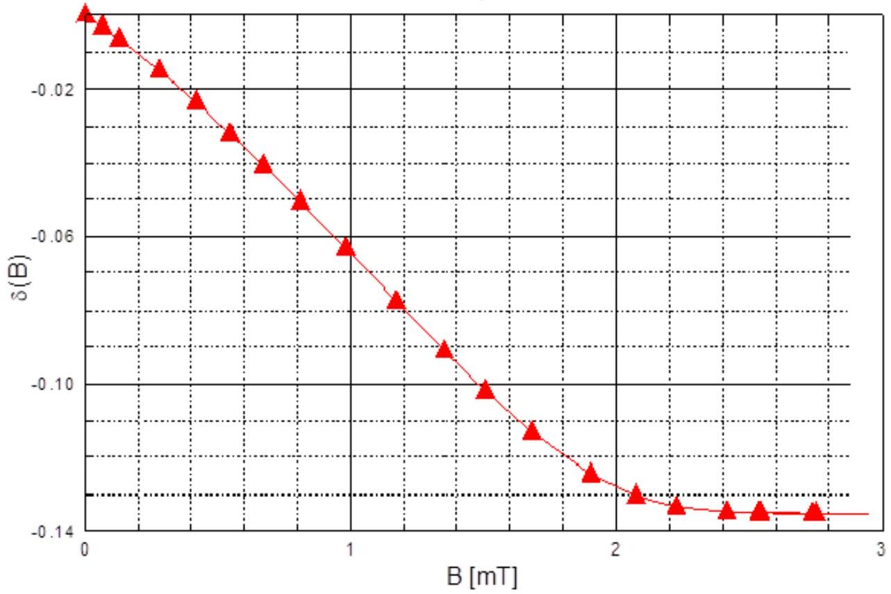

| B. 8 | The average slope $\alpha = \frac { \Delta \delta ( B ) } { \Delta B }$ of the curve $\delta ( B )$ $\alpha = - 0.067 \mathrm { mT } ^ { - 1 }$ | 0.25 pts |
| :--- | :--- | :--- |
| B. 9 | The GMR coefficient $\delta = \frac { \Delta R _ { \max } } { R ( 0 ) } = 13.5 \%$ | 0.25 pts |
| B. 10 | The value of the resistances $r$ and $R$ of the GMR element: $r = R _ { 0 } - \sqrt { R _ { 0 } \left( R _ { 0 } - R _ { \mathrm { B } } \right) } ; R = R _ { 0 } + \sqrt { R _ { 0 } \left( R _ { 0 } - R _ { \mathrm { B } } \right) }$   Choose element $a$ in B. 2 and B.3, then: $r = 3180 \Omega ; R = 6740 \Omega ; \gamma = \frac { r } { R } = 0.47$ | 0.75 pts |

C. Study of GMR magnetic sensor (6 points)

1. Characteristics of sensor output signal

| C. 1 | Table with the values of the output signal $S$ corresponding to the values of the current $I$ and the magnetic field $B$. |  |  |  |  | 1.0 pts |
| :--- | :--- | :--- | :--- | :--- | :--- | :--- |
| I | B |  | $S$ | I | $\boldsymbol { B }$ | $S$ |
|  |  |  |  |  |  |  |

| C. 2 | Graph 2 - Graph $S ( B )$ of the output signal $S$ as a function of the applied magnetic field $B$. | 1.0 pts |
| :--- | :--- | :--- |

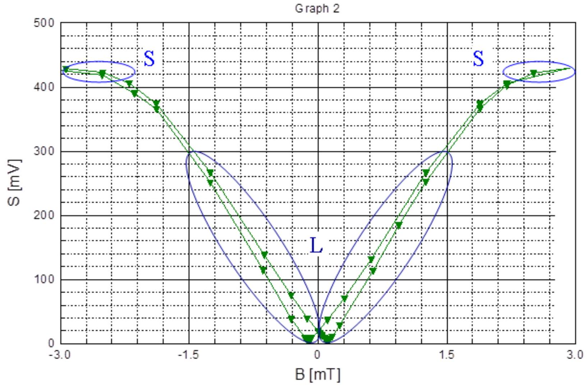

| C. 3 | 1. Region of saturation in the curve $S ( B )$ : S   2. Region of linearity in the curve $S ( B ) : \mathrm { L }$ $m = 2.0 \times 10 ^ { 2 } \mathrm { mV } / \mathrm { mT }$ | 0.5 pts |
| :--- | :--- | :--- |
| C. 4 | The coercive field is $B _ { \mathrm { c } } = 0.10 \mathrm { mT }$ | 0.5 pts |

## 2. Dependence of output signal on the voltage

| C. 5 | Table with the values of $S$ corresponding to the values of $E$. | 0.25 pts |
| :--- | :--- | :--- |

| $E ( \mathrm {~V} )$ | $S ( \mathrm { mV } )$ |
| :--- | :--- |
| 0 | 0 |

| 1.51 | 91.5 |
| :--- | :--- |
| 3.1 | 183 |
| 4.6 | 274 |
| 6.25 | 365 |

| C. 6 | Graph 3 - $S$ as a function of $E$. | 0.25 pts |
| :--- | :--- | :--- |

Graph 3
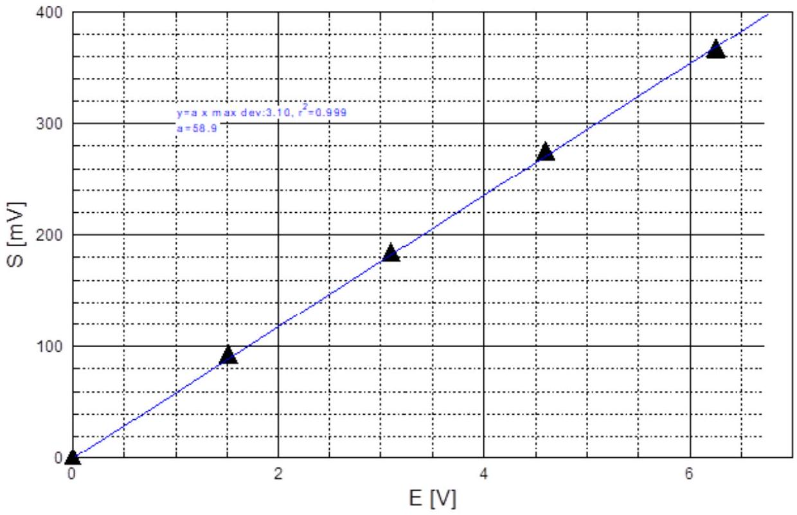

| C. 7 | $\| S \| = \frac { E } { 2 } \cdot \| \alpha \| \cdot B$ | 0.5 pt |
| :--- | :--- | :--- |

3. Study of effects of a flux concentrator

| C. 8 | 1. The magnetic field used in this experiment. Put a cross in the appropriate boxa. The field of the circular coil carrying an electric current    b. The field of the flat coil carrying an electric current    c. The field of the plate of permanent magnet    d. The magnetic field of the Earth X   2. Diagrams of the experiment and expressions to determine the value of $n$. 1. The sensor on the round plate in the horizontal plane. 2. With no flux concentrator 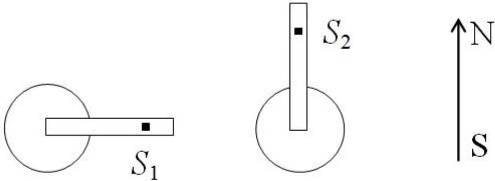 a. Orient the sensor perpendicular to the South-North direction. Note the value $S _ { 1 }$. b. Rotate the sensor along the South-North direction. Note the value $S _ { 2 }$. c. $\Delta S _ { 0 } = S _ { 2 } - S _ { 1 } ; B _ { 0 } = \left\| \Delta S _ { 0 } \right\| / m$.    3.With flux concentrator   For each value of $L _ { 1 }$, do the same, to obtain $B = \| \Delta S \| / m$. | 0.25 pt   0.75 pt |
| :--- | :--- | :--- |

| C. 9 | Table to find $B / B _ { 0 }$ for different values of $L _ { 1 } . B / B _ { 0 } = \Delta S / \Delta S _ { 0 } S _ { 1 } = 17 \mathrm { mV } ; \Delta S _ { 0 } = 21.2 - 17 = 4.2 \mathrm { mV }$. | 0.5 pt |
| :--- | :--- | :--- |

| $L _ { 1 } ( \mathrm {~mm} )$ | $S _ { 2 } ( \mathrm { mV } )$ | $1 / L _ { 1 } \left( \mathrm {~mm} ^ { - 1 } \right)$ | $\Delta S = S _ { 2 } - S _ { 1 }$ | $B / B _ { 0 }$ |
| :--- | :--- | :--- | :--- | :--- |
| 5 | 33.2 | 0.200 | 16.2 | 3.86 |
| 6 | 31.2 | 0.167 | 14.2 | 3.38 |
| 7 | 30.2 | 0.143 | 13.2 | 3.14 |

| 8 | 28.6 | 0.125 | 11.6 | 2.76 |
| :--- | :--- | :--- | :--- | :--- |
| 9 | 27.7 | 0.111 | 10.7 | 2.55 |
| 10 | 26.8 | 0.100 | 9.8 | 2.33 |
| 11 | 26.4 | 0.0909 | 9.4 | 2.24 |
| 13 | 25.4 | 0.0769 | 8.4 | 2.00 |
| 15 | 24.6 | 0.0667 | 7.6 | 1.81 |
| $\infty$ | 21.2 | 0.0000 | 4.2 | 1.00 |

| C. 10 | Graph 4 - Graph of $B / B _ { 0 }$ as a function of $1 / L _ { 1 }$. Use the function $\frac { B } { B _ { 0 } } = n L _ { 2 } \cdot \frac { 1 } { L _ { 1 } } + 1$. Find $a = n L _ { 2 } = 14.1$. Obtain $n = \frac { a } { L _ { 2 } } = \frac { 14.1 } { 25 } = 0.56$. | 0.5 pt |
| :--- | :--- | :--- |

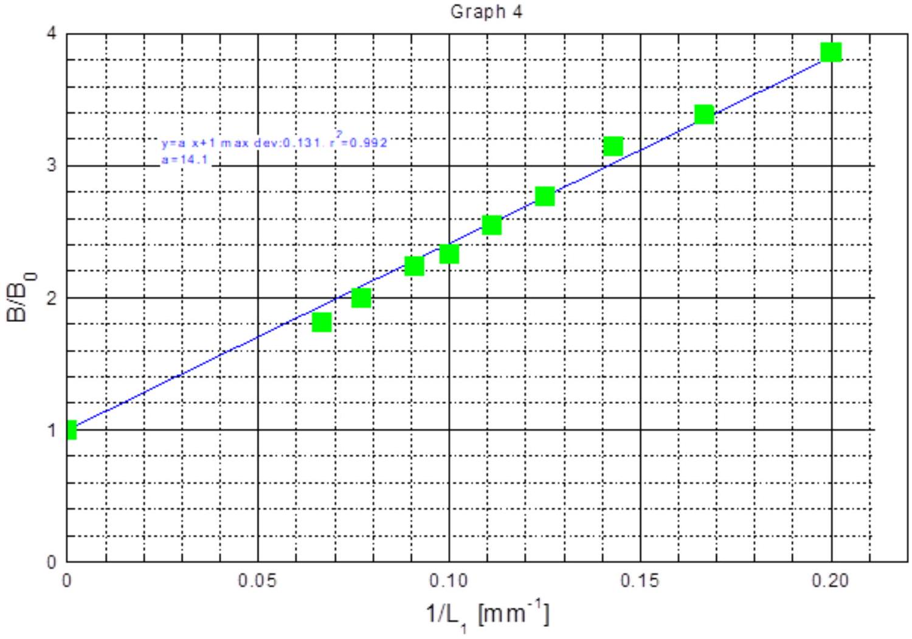
D. Applications of GMR magnetic sensors (6 points)

1. Measurements of the Earth's magnetic field

a. Magnitude of the horizontal component of the Earth's magnetic field

| D. 1 | Diagrams of the experiment and expressions for calculating $B _ { \mathrm { h } }$. 1. The sensor on the round plate in the horizontal plane. Carry out the biasing. 2. Method 1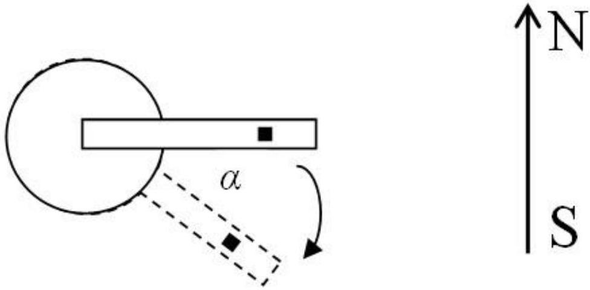 a. Set $\alpha = 0$ - the sensor perpendicular to the direction SouthNorth. b. Rotate the sensor holder, measure $S = f ( \alpha )$ c. Fit the curve $S$ to a sine function $S = a \boldsymbol { \operatorname { s i n } } \alpha$. d. $B _ { \mathrm { h } } = a / m$  | 0.5 pt |
| :--- | :--- | :--- |

|  | 3. Method 2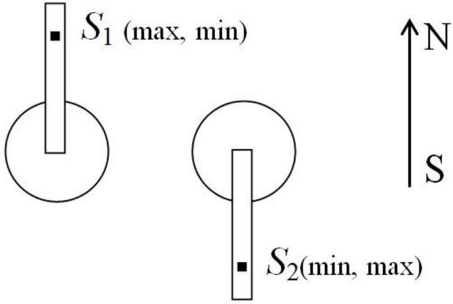   a. Orient the sensor along the Earth's magnetic field. Find the direction with the maximum (or minimum) value of $S$. Note this value $S _ { 1 }$   b. Rotate the sensor holder by about 180°. Find the direction with the minimum (or maximum) value of $S$. Note this value $S _ { 2 }$ $B _ { \mathrm { h } } = \frac { \left\| S _ { 1 } - S _ { 2 } \right\| } { 2 m }$ |  |
| :--- | :--- | :--- |

| D. 2 | $B _ { \mathrm { h } } = 0.035 \mathrm { mT }$. | 0.25 pts |
| :--- | :--- | :--- |

b. Magnitude of the Earth's magnetic field and magnetic inclination
| D. 3 | Diagrams of the experiment and expressions for calculating $B _ { \text {Earth } }$ and $\theta$. 1. The sensor on the round plate in the vertical plane containing the South-North direction. Carry out the biasing. 2. Method 1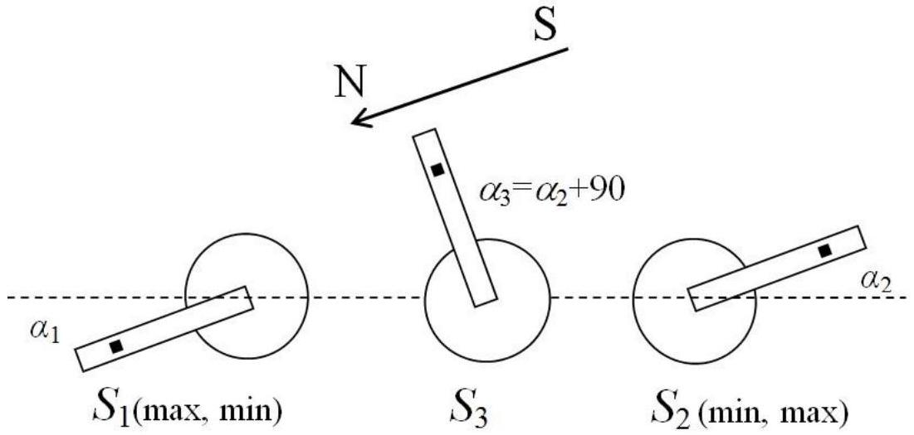 | 0.75 pts |
| :--- | :--- | :--- |

|  | a. Orient the sensor along the Earth's magnetic field. Find the direction with the maximum (or minimum) value of $S$. Note this value $S _ { 1 }$ and the angle $\alpha _ { 1 }$ between the sensor direction and the horizontal. b. Rotate the sensor holder by about 180°. Find the direction with the minimum (or maximum) value of $S$. Note this value $S _ { 2 }$ and the angle $\alpha _ { 2 }$ between the sensor direction and the horizontal. c. Orient the sensor in the direction midway between $\alpha _ { 1 }$ and $\alpha _ { 2 }$ with the angle $\alpha _ { 3 } = \alpha _ { 2 } + 90 ^ { \circ }$. Note the value $S _ { 3 }$. d. Starting from $\alpha _ { 3 }$, rotate the sensor holder, take the values of $S$ corresponding to values of $\alpha$. Measure $S = f ( \alpha )$. e. $S - S _ { 3 } = a \boldsymbol { \operatorname { s i n } } \alpha$. Obtain $a$ from fitting. f. $B _ { \text {Earth } } = a / m$ g. $\theta = \operatorname { Arccos } \frac { B _ { \mathrm { h } } } { B _ { \text {Earth } } }$ 3. Method 2 Orient the sensor along the Earth's magnetic field. Find the direction with the maximum (or minimum) value of $S$. The angle $\theta$ between the sensor direction and the horizontal is the magnetic inclination.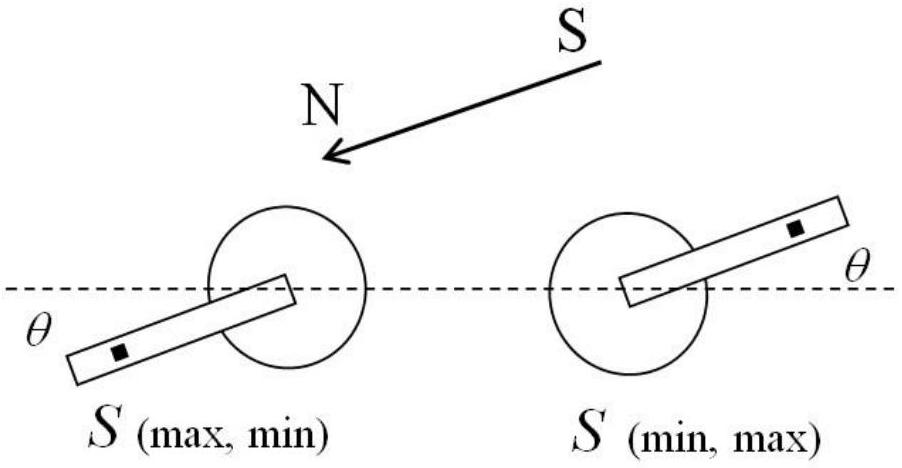   From the obtained $\theta , B _ { \text {Earth } } = B _ { \mathrm { h } } / \cos \theta$. This method may have systematic errors due to the relative misalignment of the sensor to the sensor holder. To eliminate this error, rotate the round plate together with the sensor holder by 180° about a horizontal axis along the South-North direction. Repeat the measurement. The magnetic inclination is the mean value of the |  |
| :--- | :--- | :--- |

|  | two obtained angles. |  |
| :--- | :--- | :--- |
| D4 | $\begin{aligned} & B _ { \text {Earth } } = 0.041 \mathrm { mT } \\ & \theta = 31 ^ { \circ } \end{aligned}$ | 0.5 pts |

## 2. DC wattmeter

| D. 5 | Diagram of the wattmeter circuit together with the load and the multimeters.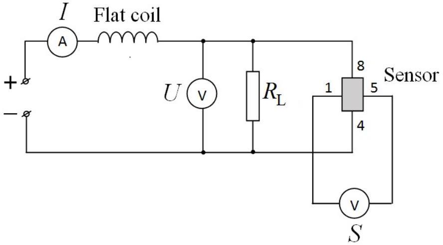 | 0.5 pt |
| :--- | :--- | :--- |

| D. 6 | Table with the values of the sensor output signal $S$ corresponding to the values of $I$ and $U$, and of $P = I \cdot U$. | 0.75 |
| :--- | :--- | :--- |

| $I$ (A) | $U ( \mathrm {~V} )$ | $P ( \mathrm {~W} )$ | $S ( \mathrm { mV } )$ |
| :--- | :--- | :--- | :--- |
| 0.30 | 2.64 | 0.792 | 18.3 |
| 0.35 | 3.9 | 1.365 | 42 |
| 0.40 | 5.37 | 2.15 | 74.3 |
| 0.45 | 6.94 | 3.12 | 112.4 |
| 0.50 | 8.67 | 4.34 | 162.4 |
| 0.543 | 10.29 | 5.59 | 215.4 |
| 0.20 | 0.89 | 0.178 | 4.9 |
| 0.25 | 1.53 | 0.382 | 11.5 |
| 0.50 | 1.3 | 0.65 | 25.8 |
| 0.60 | 2.13 | 1.28 | 50.7 |
| 0.70 | 3.1 | 2.17 | 88.1 |
| 0.80 | 4.1 | 3.28 | 137 |
| 0.97 | 6.11 | 5.92 | 253 |
| 0.30 | 3.13 | 0.939 | 31.4 |
| 0.442 | 7.74 | 3.42 | 128 |

| D. 7 | Graph 5 - Calibration curve of the wattmeter $P = f ( S )$. | 0.5 pt |
| :--- | :--- | :--- |

Graph 5
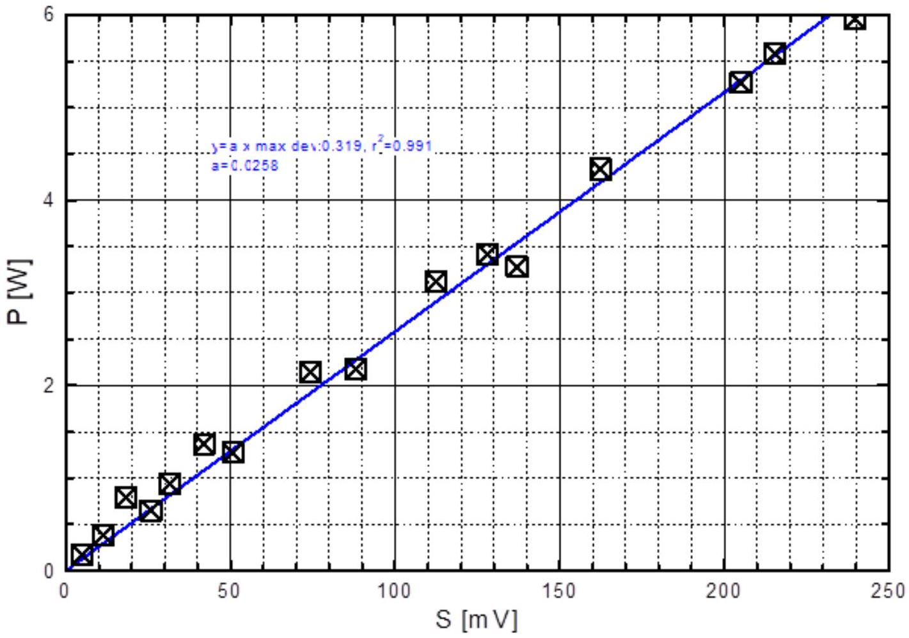

| D. 8 | The function: $P = \kappa S$ The coeficient: $\kappa = 0.026 \mathrm {~W} / \mathrm { mV }$ | 0.25 pt |
| :--- | :--- | :--- |

b. Detection of buried electrical circuits
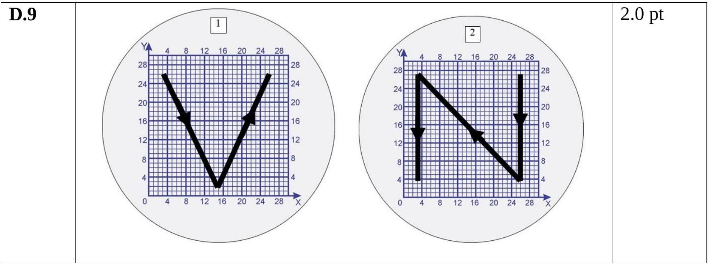
