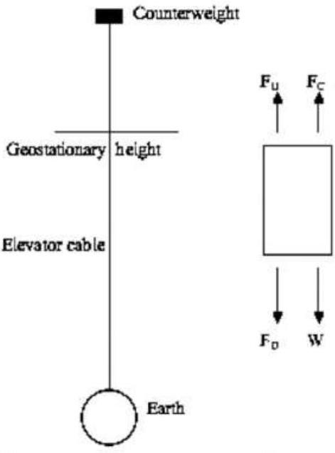
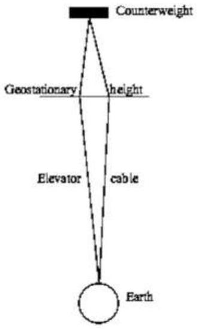
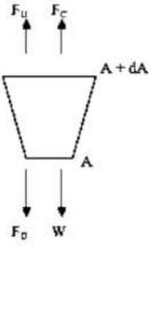

## Theory Q2   Space elevator (8 points)   Solution and Marking Scheme

1 Cylindrical Space Elevator with Uniform Cross Section

| 1.1 0.5pt | Consider a small element of the cylinder of thickness $d r$ at position $r$, there are four forces acting on that element: gravitational $\vec { W } ( r )$, centrifugal $\vec { F } _ { C } ( r )$, cable tension $\vec { F } _ { D } = \vec { T } ( r )$ at position $r$, tension $\vec { F } _ { U } = \vec { T } ( r + d r )$ at position $r + d r$. Positive direction is chosen from the Earth center outward. The net force must be zero, therefore: $\begin{aligned} & - W + F _ { C } + T ( r + d r ) - T ( r ) = 0 \\ & \Leftrightarrow - W + F _ { C } + A \cdot \sigma ( r + d r ) - A \cdot \sigma ( r ) = 0 \end{aligned}$ Hence $\begin{aligned} & A d \sigma = \frac { G M ( A d r \rho ) } { r ^ { 2 } } - ( A d r \rho ) \omega ^ { 2 } r \\ & \Rightarrow \frac { d \sigma } { d r } = G M \rho \left( \frac { 1 } { r ^ { 2 } } - \frac { r } { R _ { G } ^ { 3 } } \right) \end{aligned}$ (a) (b)   Similarly, integrating from $\mathrm { R } _ { \mathrm { G } }$ to H (the distance from the Earth center to the upper end of the cylinder), one obtains the same stress at $\mathrm { R } _ { \mathrm { G } }$ $\sigma \left( R _ { G } \right) = G M \rho \left[ \frac { 1 } { H } - \frac { 3 } { 2 R _ { G } } + \frac { H ^ { 2 } } { 2 R _ { G } ^ { 3 } } \right]$ Equating the two above expressions, one arrives to the equation: $R H ^ { 2 } + R ^ { 2 } H - 2 R _ { g } ^ { 3 } = 0 ,$ from where $H$ is determined: $H = \frac { R } { 2 } \left[ \sqrt { 1 + 8 \left( \frac { R _ { G } } { R } \right) ^ { 3 } } - 1 \right] = 1.51 \times 10 ^ { 5 } \mathrm {~km}$. The height of the cylinder $L = H - R = \frac { R } { 2 } \left[ \sqrt { 1 + 8 \left( \frac { R _ { G } } { R } \right) ^ { 3 } } - 3 \right] = 1.45 \times 10 ^ { 5 } \mathrm {~km}$. Note: Students can just equalize the net gravitational force and the net centrifugal force acting on the cylinder to obtain $H$ correctly: full mark. | 0.1 |
| :--- | :--- | :--- |
| 1.2 0.5pt | The maximal stress is determined from the requirement |  |

|  | $\frac { d \sigma } { d r } = G M \rho \left( \frac { 1 } { r ^ { 2 } } - \frac { r } { R _ { G } ^ { 3 } } \right) = 0$   which yields $r = R _ { G }$ | 0.25   0.25 |
| :--- | :--- | :--- |
| 1.3 0.5pt | Maximal stress is expressed by $\begin{align*} & \sigma \left( R _ { G } \right) = G M \rho \left[ \frac { 1 } { R } - \frac { 3 } { 2 R _ { G } } + \frac { R ^ { 2 } } { 2 R _ { G } ^ { 3 } } \right]  \tag{1}\\ & \sigma \left( R _ { G } \right) = \rho g \left[ R - \frac { 3 R ^ { 2 } } { 2 R _ { G } } + \frac { R ^ { 4 } } { 2 R _ { G } ^ { 3 } } \right] \tag{2} \end{align*}$   Numerical calculation with $\rho = 7900 k g / m ^ { 3 }$ one obtains the ratio: $\frac { \sigma \left( R _ { G } \right) } { 5.0 G A } = \frac { 383 G P a } { 5.0 G P a } = 76.5 ,$   This ratio is much larger than 1 , therefore steel is not suitable to build this kind of elevator.   If eq. (2) is not obtained and other correct equation like eq. (1) is derived - 0.1pt from full mark (get only 0.15pt for maximal stress). | 0.25   0.25 |

2 Carbon Nanotubes

| 2.1 0.25pt | Expand exponential function in series, and limit to the lowest power of $x$, one has $V = V _ { 0 } \left( - 1 + \frac { 4 x ^ { 2 } } { a ^ { 2 } } \right)$ and gets $P = - V _ { 0 }$ and $Q = \frac { 4 V _ { 0 } } { a ^ { 2 } } .$ | 0.1   0.15 |
| :--- | :--- | :--- |
| 2.2   0.25pt | $\begin{aligned} & F = - \frac { d V } { d x } = - \frac { 8 V _ { 0 } } { a ^ { 2 } } x \\ & \text { then } k = \frac { 8 V _ { 0 } } { a ^ { 2 } } = 313 \mathrm { Nm } ^ { - 1 } . \end{aligned}$ | 0.1   0.15 |
| 2.3 0.5pt | Young's modulus of the carbon nanotube. Denote $d$ the diameter of the carbon nanotube, one has $d = 27 b / \pi$. $\begin{aligned} & E _ { 1 } = \frac { \text { stress } \sigma } { \text { strain } \varepsilon } = \frac { F / A } { x / a } = \frac { k x / A } { x / a } = \frac { k a } { A } = \frac { 32 V _ { 0 } } { a \pi d ^ { 2 } } \\ & E = N E _ { 1 } = 342 \mathrm { GPa } \end{aligned}$ | 0.25   0.25 |

| 2.4 0.5pt | $\begin{aligned} & V _ { 0 } = \frac { 1 } { 2 } k x _ { \max } ^ { 2 } \Rightarrow x _ { \max } = \sqrt { \frac { 2 V _ { 0 } } { k } } = \frac { 1 } { 2 } a \\ & = 0.071 \mathrm {~nm} \end{aligned}$ | 0.25   0.25 |
| :--- | :--- | :--- |
| 2.5 0.5pt | Tensile strength of the carbon nanotube, $\sigma _ { 0 } = E \frac { x _ { \text {max } } } { a } = E / 2 = 171 \mathrm { GPa }$. | 0.5 |

| 2.6 0.5pt | Volume $\frac { \pi d ^ { 2 } } { 4 } \times \frac { 3 a } { 2 }$ contains 18 carbon atoms, therefore the density of the carbon nanotube, $\rho = \frac { 2 \times 27 \times 12 \times 10 ^ { - 3 } } { N _ { A } \times \frac { \pi d ^ { 2 } } { 4 } \times \frac { 3 a } { 2 } } = 1440 \mathrm {~kg} / \mathrm { m } ^ { 3 }$. | 0.25   0.25 |
| :--- | :--- | :--- |

3 Tapered Space Elevator with Uniform Stress
| 3.1 0.5pt | The solution to this section is analogous to that given in the previous section, however, now one has to take into account the fact that the stress $\sigma$ is constant, but the cross section area $A$ varies along the tower. $\begin{aligned} & \sigma d A = \frac { G M ( A d r \rho ) } { r ^ { 2 } } - ( A d r \rho ) \omega ^ { 2 } r \\ & \Rightarrow \frac { d A } { A } = \frac { \rho g R ^ { 2 } } { \sigma } \left( \frac { 1 } { r ^ { 2 } } - \frac { r } { R _ { G } ^ { 3 } } \right) d r \end{aligned}$ where $g = G M / R ^ { 2 }$ is gravitational acceleration at the Earth surface. By (a) | 0.25 |
| :--- | :--- | :--- |
| 3.2 0.5pt | Using the condition $\mathrm { A } ( \mathrm { H } ) = \mathrm { A } ( \mathrm { R } ) = \mathrm { A } _ { \mathrm { S } }$ one arrives to the equation $R H ^ { 2 } + R ^ { 2 } H - 2 R _ { G } ^ { 3 } = 0$, which allows to determine $H = \frac { R } { 2 } \left[ \sqrt { 1 + 8 \left( \frac { R _ { G } } { R } \right) ^ { 3 } } - 1 \right] = 151000 \mathrm {~km} .$ | 0.25   0.25 |
| 3.3 0.5pt | The ratio $\frac { A _ { G } } { A _ { S } } = \exp \left[ \frac { R } { 2 L _ { C } } \left\{ \left( \frac { R } { R _ { G } } \right) ^ { 3 } - 3 \left( \frac { R } { R _ { G } } \right) + 2 \right\} \right] = 1.623$ where $L _ { C } = \frac { \sigma } { \rho g }$ | 0.5 |
| 3.4 1.0pt | Net force exerted on the counterweight must be zero $\frac { G M m _ { C } } { \left[ R _ { G } + h _ { C } \right] ^ { 2 } } + A \left( R _ { G } + h _ { C } \right) \cdot \sigma = m _ { C } \omega ^ { 2 } \left[ R _ { G } + h _ { C } \right] , \quad \text { replacing } \quad A \left( R _ { G } + h \right) \quad \text { from the }$ equation for cross section area, one can determine the counterweight mass. | 0.5 |

|  | $m _ { C } = \frac { \rho A _ { S } L _ { C } \exp \left[ \frac { R ^ { 2 } } { 2 L _ { C } R _ { G } ^ { 3 } } \left( \frac { 2 R _ { G } ^ { 3 } + R ^ { 3 } } { R } - \frac { 2 R _ { G } ^ { 3 } + \left( R _ { G } + h _ { C } \right) ^ { 3 } } { R _ { G } + h _ { C } } \right) \right] } { \frac { R ^ { 2 } \left( R _ { G } + h _ { C } \right) } { R _ { G } ^ { 3 } } \left[ 1 - \left( \frac { R _ { G } } { R _ { G } + h _ { C } } \right) ^ { 3 } \right] } .$ | 0.50 |
| :--- | :--- | :--- |

4 Applications

| 4.1 0.5pt | An object can leave the Earth if its energy at the distance $r$ satisfies $E = \frac { m ( \omega r ) ^ { 2 } } { 2 } - \frac { G M m } { r } \geq 0$ from which $r _ { C } = \left( 2 G M / \omega ^ { 2 } \right) ^ { \frac { 1 } { 3 } } = 53200 k m$ | 0.25 |
| :--- | :--- | :--- |
|  | In order to launch an object, the upper end of the tower must locate above the distance $\mathrm { r } _ { \mathrm { C } }$. | 0.25 |

| 4.2 1.0pt | We denote the Earth orbital velocity as $v _ { E }$, the spacecraft velocity when it's released from the tower top as $v _ { 1 } = \omega h _ { 0 }$. The spacecraft can reach the furthest distance from the Sun if $\vec { v } _ { 1 }$ is parallel to $\vec { v } _ { E }$. The spacecaft velocity relative to the Sun is $v _ { E } + v _ { 1 }$. The Earth orbital radius $\mathrm { R } _ { \mathrm { E } }$ also is the smallest distance from the sun (if one neglects the tower length compared to the radius of the Earth's orbit). $\mathrm { r } _ { 2 }$ is the apogee distance of the spacecraft from the Sun, $\mathrm { v } _ { 2 }$ is its velocity at apogee. Angular momentum and energy convervation laws read $m \left( v _ { E } + v _ { 1 } \right) R _ { E } = m v _ { 2 } r _ { 2 }$ |  |
| :--- | :--- | :--- |
|  | $\frac { 1 } { 2 } m \left( v _ { E } + v _ { 1 } \right) ^ { 2 } - \frac { G M _ { S } m } { R _ { E } } = \frac { 1 } { 2 } m v _ { 2 } ^ { 2 } - \frac { G M _ { S } m } { r _ { 2 } }$ | 0.1 |
|  | $\left[ \left( v _ { E } + \omega h _ { 0 } \right) ^ { 2 } - \frac { 2 G M _ { S } } { R _ { E } } \right] r _ { 2 } ^ { 2 } + 2 G M _ { S } r _ { 2 } - \left( v _ { E } + \omega h _ { 0 } \right) ^ { 2 } R _ { E } ^ { 2 } = 0$ | 0.1 |
|  | from which $r _ { \text {Max } } = r _ { 2 } = \frac { \left( v _ { E } + \omega h _ { 0 } \right) ^ { 2 } R _ { E } ^ { 2 } } { 2 G M _ { S } - \left( v _ { E } + \omega h _ { 0 } \right) ^ { 2 } R _ { E } }$. | 0.1 |
|  | Numerical calculation gives $\mathrm { r } _ { 2 } = 5.3 \mathrm { AU }$, that covers Jupiter's orbit. Similarly, for the spacecraft to approach as close as possible to the Sun, the released velocity $\vec { v } _ { 1 }$ must be antiparallel to $\vec { v } _ { E }$. The spacecaft velocity relative to the Sun is $v _ { E } - v _ { 1 } , \mathrm { r } _ { 2 }$ is the perigee distance of the spacecraft from the Sun, $\mathrm { v } _ { 2 }$ is its velocity at perigee. | 0.1 |
|  | The previous angular momentum and energy convervation laws still hold, $m \left( v _ { E } - v _ { 1 } \right) R _ { E } = m v _ { 2 } r _ { 2 }$ | 0.1 |

|  | $\frac { 1 } { 2 } m \left( v _ { E } - v _ { 1 } \right) ^ { 2 } - \frac { G M _ { S } m } { R _ { E } } = \frac { 1 } { 2 } m v _ { 2 } ^ { 2 } - \frac { G M _ { S } m } { r _ { 2 } }$ Here the energy term $- \frac { G M m } { h _ { 0 } }$ due the earth's gravity is neglected. Eliminating $\mathrm { v } _ { 2 }$ one has | 0.1 |
| :--- | :--- | :--- |
|  | $\left[ \left( v _ { E } - \omega h _ { 0 } \right) ^ { 2 } - \frac { 2 G M _ { S } } { R _ { E } } \right] r _ { 2 } ^ { 2 } + 2 G M _ { S } r _ { 2 } - \left( v _ { E } - \omega h _ { 0 } \right) ^ { 2 } R _ { E } ^ { 2 } = 0$ | 0.1 |
|  | from which $r _ { \text {min } } = r _ { 2 } = \frac { \left( v _ { E } - \omega h _ { 0 } \right) ^ { 2 } R _ { E } ^ { 2 } } { 2 G M _ { S } - \left( v _ { E } - \omega h _ { 0 } \right) ^ { 2 } R _ { E } }$. | 0.1 |
|  | Numerical calculation gives $r _ { \text {min } } = 0.43 \mathrm { AU }$, meaning the Mercury's orbit is within our reach. | 0.1 |

## References

[1] Artsutanov, Y. Kosmos na elektrovoze. Komsomolskaya Pravda July 31 (1960); contents described in Lvov Science 158, 946-947 (1967).
[2] Pearson, J. The Orbital Tower: a Spacecraft Launcher Using the Earth's Rotational Energy. Acta Astronautica 2, 785 (1975)
[3] Aravind, P. K. The physics of the space elevator. American Journal of Physics 75, 125 (2007).
[4] Bochníček, Z. A Carbon Nanotube Cable for a Space Elevator. The Physics Teacher 51, 462 (2013).
