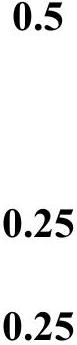

## Theory Q3   Thermoelectric effects and theirapplication in thermoelectric generator and refrigerator(10 points)

Solution and Marking scheme
A. Heat transfer and thermoelectric generator

A1. Heat transfer in a homogeneous conducting bar
| A1.1 0.75 pt | Consider heat transfer in the segment $d x$ of the bar in the steady state. Equation for the balance of the energy exchange through the cross-sectional area is written as $- k S \frac { d T ( x ) } { d x } + \rho \frac { d x } { S } I ^ { 2 } = - k S \frac { d T ( x + d x ) } { d x } = - k S \frac { d T ( x ) } { d x } - k S \frac { d ^ { 2 } T ( x ) } { d x ^ { 2 } } \cdot d x$ Hence $\begin{equation*} - k S \frac { d ^ { 2 } T ( x ) } { d x ^ { 2 } } = \frac { \rho I ^ { 2 } } { S } \tag{A1} \end{equation*}$ Integration of (A1) gives $\begin{equation*} \frac { d T ( x ) } { d x } = - \frac { \rho I ^ { 2 } } { k S ^ { 2 } } x + C _ { 1 } , \tag{A2} \end{equation*}$ $\begin{equation*} T ( x ) = - \frac { \rho I ^ { 2 } } { 2 k S ^ { 2 } } x ^ { 2 } + C _ { 1 } x + C _ { 2 } . \tag{A3} \end{equation*}$ Constants $C _ { 1 } , C _ { 2 }$ are derived from the boundary conditions $\begin{align*} & x = 0 \Rightarrow T = T _ { 1 } \Rightarrow C _ { 2 } = T _ { 1 } ,  \tag{A4}\\ & x = L \Rightarrow T = T _ { 2 } \Rightarrow C _ { 1 } = \frac { T _ { 2 } - T _ { 1 } } { L } + \frac { 1 } { 2 } \frac { \rho L } { S ^ { 2 } k } I ^ { 2 } . \tag{A5} \end{align*}$ |  |
| :--- | :--- | :--- |
|  | Equation for the temperature distribution in the bar is   Equation for the temperature distribution in the bar is $\begin{equation*} T ( x ) = T _ { 1 } + \left( \frac { \rho L I ^ { 2 } } { 2 k S ^ { 2 } } - \frac { T _ { 1 } - T _ { 2 } } { L } \right) x - \frac { \rho I ^ { 2 } } { 2 k S ^ { 2 } } x ^ { 2 } . \tag{A6} \end{equation*}$ | 0.25 |

| A1.2 1.0 pt | Using (A2) -(A5) we obtain the equation for the heat current at $x$ $\begin{equation*} q ( x ) = - k S \frac { d T ( x ) } { d x } = \frac { k S } { L } \left( T _ { 1 } - T _ { 2 } \right) + \frac { \rho I ^ { 2 } } { S } \left( x - \frac { L } { 2 } \right) , \tag{A7} \end{equation*}$ at $x = 0$, and $x = L$ $\begin{equation*} q ( x = 0 ) = \frac { k S } { L } \left( T _ { 1 } - T _ { 2 } \right) - \frac { \rho L I ^ { 2 } } { 2 S } = K \left( T _ { 1 } - T _ { 2 } \right) - \frac { R I ^ { 2 } } { 2 } , \tag{A8} \end{equation*}$ $q ( x = L ) = \frac { k S } { L } \left( T _ { 1 } - T _ { 2 } \right) + \frac { \rho L I ^ { 2 } } { 2 S } = K \left( T _ { 1 } - T _ { 2 } \right) + \frac { R I ^ { 2 } } { 2 }$. Here $K = \frac { k S } { L } , R = \frac { \rho L } { S }$. |  |
| :--- | :--- | :--- |

A2. Relation between Peltier and Seebeck Coefficients
Thermocouple consists of two subsystems: a) the conducting electron gas that performs an ideal themodynamic cycle; b) Nuclei and bounded electrons of the bar crystal that oscillate around

equillibrium positions at finite temperature and participate in heat conduction process. If the resistance of the thermocouple is neglected, these two subsystems may be considered as noninteracting, the electron gas exchanges heat only with the heat source at $T _ { 1 }$ and the heat sink at $T _ { 2 }$, performing the ideal Carnot cycle.

| A2.1   0.25 pt | Electron gas receives heat from heat source due to the Peltier effect $q _ { 1 } = \pi _ { 1 } I$ | 0.25   (A10)   (A10) |
| :--- | :--- | :--- |
| A2.2.   0.25 pt | The heat amount transferred to the heat sink due to the Peltier effect $q _ { 2 } = \pi _ { 2 } I$ | 0.25   (A11)   (A11) |
| A2.3.   0.5 pt | Power delivered by the electron gas due to the Seebeck emf is $P = \varepsilon I = \alpha \left( T _ { 1 } - T _ { 2 } \right) I$ | 0.5   (A12)   (A12) |
| A2.4   0.5 pt | The efficiency of the ideal Carnot cycle applied to the thermocouple can be written as $\begin{equation*} \eta = \frac { P } { q _ { 1 } } , \eta = \frac { T _ { 1 } - T _ { 2 } } { T _ { 1 } } . \tag{A13} \end{equation*}$   Thus $\begin{equation*} \frac { T _ { 1 } - T _ { 2 } } { T _ { 1 } } = \frac { \alpha \left( T _ { 1 } - T _ { 2 } \right) } { \pi _ { 1 } } \tag{A14} \end{equation*}$   Comparing these equations, one has $\pi _ { 1 } = \alpha T _ { 1 }$.   This is the Peltier coefficient at the first junction contacting with the heat source. Generally, one has $\pi = \alpha T$. | 0.25   0.25 |

A3. Thermoelectric generator
| A.3.1. 0.5 pt | Power received by the thermocouple from the heat source (see also (A8)) is $\begin{equation*} q _ { 1 } = K \left( T _ { 1 } - T _ { 2 } \right) + \alpha T _ { 1 } I - \frac { 1 } { 2 } I ^ { 2 } R . \tag{A15} \end{equation*}$   Here $\alpha$ is the Seebeck coefficient of the thermocouple and $\begin{align*} & K = K _ { A } + K _ { B } = \frac { k _ { A } S _ { A } } { L } + \frac { k _ { B } S _ { B } } { L } ,  \tag{A16}\\ & R = R _ { A } + R _ { B } = \frac { \rho _ { A } L } { S _ { A } } + \frac { \rho _ { B } L } { S _ { B } } , \tag{A17} \end{align*}$   are its thermal conductance and internal resistance.   The heat sink receives a power (see also (A9)) $\begin{equation*} q _ { 2 } = K \left( T _ { 1 } - T _ { 2 } \right) + \alpha T _ { 2 } I + \frac { 1 } { 2 } I ^ { 2 } R . \tag{A.18} \end{equation*}$ | 0.25 |
| :--- | :--- | :--- |
| A3.2. 0.75 pt | The efficiency of the thermoelectric generator is $\begin{equation*} \eta = \frac { P _ { L } } { q _ { 1 } } = \frac { I ^ { 2 } R _ { L } } { K \left( T _ { 1 } - T _ { 2 } \right) + \alpha T _ { 1 } I - I ^ { 2 } R / 2 } = \frac { m } { \frac { K \left( T _ { 1 } - T _ { 2 } \right) } { I ^ { 2 } R } + \frac { \alpha T _ { 1 } } { I R } - \frac { 1 } { 2 } } . \tag{A19} \end{equation*}$ | 0.25 |

|  | $\begin{equation*} I = \frac { \alpha \left( T _ { 1 } - T _ { 2 } \right) } { R _ { L } + R } = \frac { \alpha \left( T _ { 1 } - T _ { 2 } \right) } { ( 1 + m ) R } . \tag{A20} \end{equation*}$   Substituting (A20) into (A19) we obtain the expession for the efficiency $\begin{equation*} \eta = \frac { m \left( T _ { 1 } - T _ { 2 } \right) } { \frac { K R ( 1 + m ) ^ { 2 } } { \alpha ^ { 2 } } + T _ { 1 } ( 1 + m ) - \frac { T _ { 1 } - T _ { 2 } } { 2 } } . \tag{A21} \end{equation*}$ | 0.25   0.25 |
| :--- | :--- | :--- |
| A3.3. 0.25 | Replacing the figure of merit $\begin{equation*} Z = \frac { \alpha ^ { 2 } } { K R } \tag{A22} \end{equation*}$   and $\eta _ { c } = \frac { T _ { 1 } - T _ { 2 } } { T _ { 1 } }$ the efficiency of the ideal Carnot cycle in (A21), one has $\begin{equation*} \eta = \eta _ { c } \frac { m } { \frac { ( 1 + m ) ^ { 2 } } { Z T _ { 1 } } + ( 1 + m ) - \frac { 1 } { 2 } \eta _ { c } } . \tag{A23} \end{equation*}$ | 0.25 |

A4. The maximum efficiency
| A4.1 0.25 pt | When $R _ { L } = R$ or $m = 1$, the power consumed on the load is maximum. The efficiency in that case is $\begin{equation*} \eta _ { P } = \frac { T _ { 1 } - T _ { 1 } } { \left[ \frac { 4 } { Z } + \frac { 3 T _ { 1 } + T _ { 2 } } { 2 } \right] } . \tag{A24} \end{equation*}$ | 0.25 |
| :--- | :--- | :--- |
| A4.2. 0.75 pt | Equation (A23) may be rewritten as $\begin{equation*} \eta = \frac { m } { a ( 1 + m ) ^ { 2 } + b ( 1 + m ) - 1 / 2 } , \tag{A25} \end{equation*}$ where $a = \frac { 1 } { Z \left( T _ { 1 } - T _ { 2 } \right) } , b = \frac { T _ { 1 } } { T _ { 1 } - T _ { 2 } }$. Equation $\frac { d \eta } { d m } = 0$ has the solution $M = \sqrt { 1 + \frac { 2 b - 1 } { 2 a } }$ or | 0.25   0.25   0.25 |
| A4.3. 0.25 pt | Using (A25), (A26) we obtain the maximum efficiency of the thermoelectric generator $\begin{equation*} \eta _ { \max } = \frac { T _ { 1 } - T _ { 2 } } { T _ { 1 } } \frac { ( M - 1 ) } { \left( M + \frac { T _ { 2 } } { T _ { 1 } } \right) } \tag{A27} \end{equation*}$ (Correct expression containing either M, Z or both is also accepted) | 0.25 |

A5. The maximum figure of merit
| A5.1 0.5 | According to (A22) $Z$ takes the maximum value $Z = Z _ { m }$ when $K R = y$ is smallest. Denoting $\left( k _ { A } S _ { A } + k _ { B } S _ { B } \right) \left( \frac { \rho _ { A } } { S _ { A } } + \frac { \rho _ { B } } { S _ { B } } \right) = y , x = \frac { S _ { A } } { S _ { B } }$ one has the equation $\left( k _ { A } x + k _ { B } \right) \left( \frac { \rho _ { A } } { x } + \rho _ { B } \right) = y$. It is easily to show the function $y$ has the minimum at $x = x _ { m }$, where $\begin{equation*} x _ { m } = \sqrt { \frac { \rho _ { A } k _ { B } } { \rho _ { B } k _ { A } } } \text { or } \frac { S _ { A } } { S _ { B } } = \left( \frac { \rho _ { A } k _ { B } } { \rho _ { B } k _ { A } } \right) ^ { 1 / 2 } . \tag{A28} \end{equation*}$ | 0.25   0.25 |
| :--- | :--- | :--- |
| A5.2 0.25 pt | If the ratio of cross-sectional areas satisfies (A28) then $y _ { m } = \left[ \left( \rho _ { A } k _ { A } \right) ^ { 1 / 2 } + \left( \rho _ { B } k _ { B } \right) ^ { 1 / 2 } \right] ^ { 2 }$ and the maximum figure of merit of the thermocouple is $\begin{equation*} Z _ { m } = \frac { \alpha ^ { 2 } } { \left[ \left( \rho _ { A } k _ { A } \right) ^ { 1 / 2 } + \left( \rho _ { B } k _ { B } \right) ^ { 1 / 2 } \right] ^ { 2 } } . \tag{A.29} \end{equation*}$ | 0.25 |

A6. The optimal efficiency
| A6.1. 0.5 pt | The thermocouple with two bars made from material A and B has the following the figure of merit $\begin{equation*} Z _ { m } = \frac { \alpha ^ { 2 } } { \left[ \left( \rho _ { A } k _ { A } \right) ^ { 1 / 2 } + \left( \rho _ { B } k _ { B } \right) ^ { 1 / 2 } \right] ^ { 2 } } = \frac { \alpha ^ { 2 } } { 4 \rho _ { A } k _ { A } } = 3.15 \times 10 ^ { - 3 } \mathrm {~K} ^ { - 1 } . \tag{A.30} \end{equation*}$ The optimal efficiency of the thermocouple AB when $T _ { 1 } = 423 \mathrm {~K} , T _ { 2 } = 303 \mathrm {~K}$ has the following value $\begin{equation*} \eta _ { o p t } = \frac { T _ { 1 } - T _ { 2 } } { 4 Z _ { m } ^ { - 1 } + \frac { 3 T _ { 1 } + T _ { 2 } } { 2 } } = \frac { 120 } { 4 \frac { 1 } { 3.2 \times 10 ^ { - 3 } } + \frac { 3 \times 423 + 303 } { 2 } } = 5.84 \% . \tag{A.31} \end{equation*}$ The corresponding ideal Carnot efficiency for that case is $\begin{align*} & \eta _ { C } = \frac { T _ { 1 } - T _ { 2 } } { T _ { 1 } } = \frac { 120 } { 423 } = 28.4 \%  \tag{A32}\\ & \eta _ { o p t } / \eta _ { C } = 0.21 \end{align*}$ | 0.1 |
| :--- | :--- | :--- |
| A6.2 0.25 pt | The maximum efficiency of the thermoelectric generator designed from AB materials is $\begin{align*} M & = \sqrt { 1 + Z _ { m } \frac { \left( T _ { 1 } + T _ { 2 } \right) } { 2 } } = \sqrt { 1 + 3.2 \times 10 ^ { - 3 } \times 363 } = 1.46 \\ \eta _ { \max } & = \eta _ { C } \frac { ( M - 1 ) } { \left( M + \frac { T _ { 2 } } { T _ { 1 } } \right) } = 6.0 \% \tag{A.33} \end{align*}$ | 0.25 |

## B. Thermoelectric refrigerator

B1. The cooling power and the maximum temperature difference
| B1.1 0.25pt | For cooling purpose we choose the current direction so that heat is absorbed at upper junction (temperature $T _ { 1 }$ ) due to Peltier effect and transferred to the A \& B bars. Using (A.9) one gets cooling power taken out from heat source at $T _ { 1 }$ $\begin{equation*} q _ { C } = \alpha T _ { 1 } I + K \left( T _ { 1 } - T _ { 2 } \right) - \frac { R I ^ { 2 } } { 2 } \tag{B.1} \end{equation*}$ where $K , R$ are thermal conductance and internal resistance of thermocouple. | 0.25 |
| :--- | :--- | :--- |
| B1.2. 0.5 | Condition for the maximum cooling power $q _ { C M }$ is founded from $\frac { d q _ { C } } { d I } = 0$, one has $\begin{align*} & I _ { q } = \frac { \alpha T _ { 1 } } { R } ,  \tag{B2}\\ & q _ { C M } = \frac { \alpha ^ { 2 } T _ { 1 } } { 2 R } - K \left( T _ { 2 } - T _ { 1 } \right) . \tag{B3} \end{align*}$ The maximum temperature depression is derived from the condition $q _ { C M } = 0$, which gives $\begin{equation*} \Delta T _ { \max } = T _ { 2 } - T _ { 1 \min } = \frac { \alpha ^ { 2 } T _ { 1 \min } ^ { 2 } } { 2 K R } = \frac { Z T _ { 1 \min } ^ { 2 } } { 2 } . \tag{B4} \end{equation*}$ Here $Z = \frac { \alpha ^ { 2 } } { K R }$ is the figure of merit of the thermocouple. | 0.25 |

B2. The working current
| B2.1 0.25pt | Thermocouple AB with $Z _ { m } = 3.15 \times 10 ^ { - 3 } \mathrm {~K} ^ { - 1 }$ is used for a refrigerator. The lowest cooling temperature $T _ { \text {lmin } }$ is found from the same equation (B4) $\begin{align*} & 0 = T _ { 1 \min } ^ { 2 } + \frac { 2 } { Z _ { m } } T _ { 1 \min } - \frac { 2 } { Z _ { m } } T _ { 2 }  \tag{B5}\\ & T _ { 1 \min } = \frac { 1 } { Z _ { m } } \left( \sqrt { 1 + 2 Z _ { m } T _ { 2 } } - 1 \right) . \end{align*}$   Putting $T _ { 2 } = 300 \mathrm {~K}$ and $Z _ { m } = 3.15 \times 10 ^ { - 3 } \mathrm {~K} ^ { - 1 }$ in (B.5) we obtain $\begin{equation*} T _ { 1 \min } = 2.22 \times 10 ^ { 2 } \mathrm {~K} . \tag{B.6} \end{equation*}$ | 0.1   0.15 |
| :--- | :--- | :--- |
| B2.2. 0.5 | Putting the value of the internal resistance $R = \frac { \rho _ { A } L } { S _ { A } } + \frac { \rho _ { B } L } { S _ { B } } = \frac { 2 \rho _ { B } L } { S _ { B } } = 4.0 \times 10 ^ { - 3 } \Omega$ in (B2), one gets the working current $\begin{equation*} I _ { \mathrm { W } } = \frac { \alpha T _ { 1 \min } } { R } = \frac { 4.2 \times 10 ^ { - 4 } \times 221.5 } { 4 \times 10 ^ { - 3 } } \mathrm {~A} = 23.3 \mathrm {~A} \tag{B7} \end{equation*}$ | 0.25   0.25 |

B3. The coefficient of performance
| B3.1 0.5pt | According to the energy conservation law, the power supplied by the electrical source $P$ equals to the Joule heat plus Peltier's heat taken away in thermocouple per unit of time: $\begin{equation*} P = \alpha \left( T _ { 2 } - T _ { 1 } \right) I + R I ^ { 2 } . \tag{B.8} \end{equation*}$   The equation for Coefficient of Performance (COP) is $\begin{equation*} \beta = \frac { q _ { C } } { P } = \frac { \alpha T _ { 1 } I - K \left( T _ { 2 } - T _ { 1 } \right) - \frac { R I ^ { 2 } } { 2 } } { \alpha \left( T _ { 2 } - T _ { 1 } \right) I + R I ^ { 2 } } \tag{B9} \end{equation*}$ | 0.25   0.25 |
| :--- | :--- | :--- |
| B3.2. 0.25 | Electrical current $I _ { \beta }$ corresponds to the maximum of the COP is found from the equation $\frac { d \beta } { d I } = 0$. (B9) may be rewritten in convenience form $\begin{equation*} \beta = - \frac { 1 } { 2 } + \frac { \alpha \left( T _ { 1 } + T _ { 2 } \right) I - 2 K \left( T _ { 2 } - T _ { 1 } \right) } { 2 \left[ \alpha \left( T _ { 2 } - T _ { 1 } \right) + R I \right] I } . \tag{B10} \end{equation*}$   The equation $\frac { d \beta } { d I } = 0$ leads to $\begin{align*} & - \alpha R \left( T _ { 1 } + T _ { 2 } \right) I ^ { 2 } + 4 K \left( T _ { 2 } - T _ { 1 } \right) R I + 2 K \alpha \left( T _ { 2 } - T _ { 1 } \right) ^ { 2 } = 0 , \\ & I ^ { 2 } - \frac { 2 K \left( T _ { 2 } - T _ { 1 } \right) I } { \alpha T _ { M } } - \frac { K } { R T _ { M } } \left( T _ { 2 } - T _ { 1 } \right) ^ { 2 } = 0 , \tag{B.11} \end{align*}$   with $\mathrm { T } _ { M } = \frac { \left( T _ { 2 } + T _ { 1 } \right) } { 2 }$.   Solution of (B.11) is $\begin{equation*} I _ { \beta } = \frac { K \left( T _ { 2 } - T _ { 1 } \right) } { \alpha T _ { M } } \left\{ \sqrt { 1 + Z \mathrm {~T} _ { M } } + 1 \right\} . \tag{B.13} \end{equation*}$   (Taking into account that $Z = \frac { \alpha ^ { 2 } } { K R }$, (B.13) can be written in other form $\begin{equation*} \left. I _ { \beta } = \frac { \alpha \left( T _ { 2 } - T _ { 1 } \right) } { R \left\{ \sqrt { 1 + Z \mathrm {~T} _ { M } } - 1 \right\} } \right) \tag{B.14} \end{equation*}$ | 0.25 |
| B3.3. 0.25 | Substituting (B.14) into (B.9) one has $\begin{equation*} \beta _ { \max } = \frac { T _ { 1 } \left[ \sqrt { 1 + Z T _ { M } } - T _ { 2 } / T _ { 1 } \right] } { \left( T _ { 2 } - T _ { 1 } \right) \left[ \sqrt { 1 + Z T _ { M } } + 1 \right] } . \tag{B.15} \end{equation*}$ | 0.25 |
