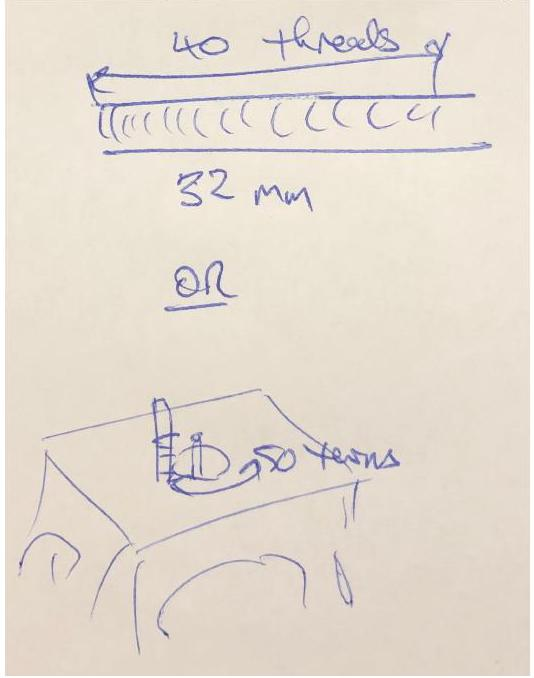
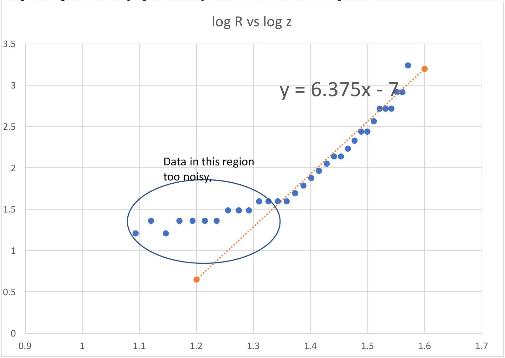
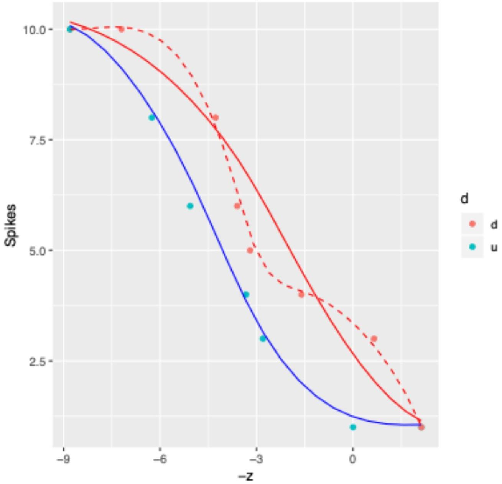
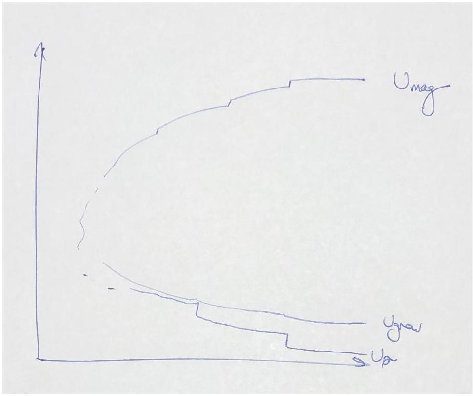

## Experiment 1: Static response of a magnetically active fluid Sample Solutions

General Note: these solutions look brief for many parts. Students do, however, have to manipulate the equipment and try to take good data, which will require taking some time. The solutions try to indicate some of the tricks.
Note that quantitative values will depend on the amount of fluid used and the containers - these should be tested and recalibrated when the experiment is used.

A1: Measurement taken on sample bottle: $\Delta z = 0.061 \pm 0.004 \mathrm {~m}$, when well balanced. ( 0.5 for good z, 0.3 for reasonable uncertainty) Expect to see multiple attempts for full credit

A2: Density difference gives the nett buoyant force, so balancing gravitational and magnetic forces: $\Delta \rho g = 3 \chi B _ { r } ^ { 2 } a ^ { 4 } l ^ { 2 } / 8 \mu _ { 0 } z ^ { 7 }$ (0.3)

Need to divide by $g$ to rho, then substituting in the values for the large magnet yields

$$
\begin{equation*}
\Delta \rho = 15 \mathrm {~kg} \mathrm {~m} ^ { - 3 } \tag{0.3}
\end{equation*}
$$

Uncertainty sources: primarily $z$ - hard to measure but can be controlled, and $\chi$ - not actually constant for a superparamagnet.
Any reasonable uncertainty method is fine. Using the data above, an estimate of $6 \mathrm {~kg} \mathrm {~m} ^ { - 3 }$ (0.2) could be made. Students should have some indication of where their labels come from.

Fresh bottles will be measured.

B1: $z _ { \text {crit } } = 22 \pm 1 \mathrm {~mm}$ (from uncertainty in when spikes appear) $( 0.2 + 0.1 )$
$\lambda = 6 \pm 1 \mathrm {~mm}$ (from angle through the glass causing uncertainty about measurements of the incipient wavelength) (0.2 + 0.1)

Expect multiple attempts for full credit
Points will be given to good values. Doing this part is easiest if the bottle is on its side, although it can be done with the bottle upright.

Note for future use: Values should be retaken using the actual experimental setup. They are sensitive to the bottles and magnets used.

B2: It may look as though there are a lot of points for nothing much here, but the credit is for the experimental skill that goes into taking high quality data. It is possible to be quite precise if one is careful and this will be rewarded here as well as the calculation details..

Surface tension may be calculated using the relationship above. It also requires the density difference from the earlier part, meaning that a large uncertainty in both parts will compound to the point where the uncertainty in this part is unreasonable.

For the values in these sample solutions $\sigma = 1.3 \times 10 ^ { - 2 } , \mathrm {~N} \mathrm {~m} ^ { - 1 }$ ( 0.3 if correct within an order of magnitude). Uncertainty estimate: in these data, $\Delta \sigma = 6 \times 10 ^ { - 3 } \mathrm {~N} \mathrm {~m} ^ { - 1 }$. (0.2 if correctly calculated from a reasonable method, 0.1 additional if less than 50\%).

C1: There are many solution approaches.. All need to count threads and measure distance. For a diagram of a useful setup, 0.2. For example:

0.2 for measurements and calculations.

Students should find that

$$
\Delta z = 0.80 \pm 0.02 \mathrm {~mm} \text { (0.2) }
$$

If a visual counting technique is used, at least three measurements are expected. If a turn-by-turn method, then distance measurements should be taken for at least three numbers of turns.

C2: Table of measurements:
| turns | length of ligh z (has offset) M |  |  | R | z (corrected) | $\log \mathrm { z }$ | $\log \mathrm { R }$ |
| :--- | :--- | :--- | :--- | :--- | :--- | :--- | :--- |
| 32.50 | 20.00 | 26.00 | 1.00 | \#DIV/0! | 38.00 | 1.58 | \#DIV/0! |
| 31.50 | 19.00 | 25.20 | 0.95 | 1748.00 | 37.20 | 1.57 | 3.24 |
| 30.50 | 18.00 | 24.40 | 0.90 | 828.00 | 36.40 | 1.56 | 2.92 |
| 29.50 | 18.00 | 23.60 | 0.90 | 828.00 | 35.60 | 1.55 | 2.92 |
| 28.50 | 17.00 | 22.80 | 0.85 | 521.33 | 34.80 | 1.54 | 2.72 |
| 27.50 | 17.00 | 22.00 | 0.85 | 521.33 | 34.00 | 1.53 | 2.72 |
| 26.50 | 17.00 | 21.20 | 0.85 | 521.33 | 33.20 | 1.52 | 2.72 |
| 25.50 | 16.00 | 20.40 | 0.80 | 368.00 | 32.40 | 1.51 | 2.57 |
| 24.50 | 15.00 | 19.60 | 0.75 | 276.00 | 31.60 | 1.50 | 2.44 |
| 23.50 | 15.00 | 18.80 | 0.75 | 276.00 | 30.80 | 1.49 | 2.44 |
| 22.50 | 14.00 | 18.00 | 0.70 | 214.67 | 30.00 | 1.48 | 2.33 |
| 21.50 | 13.00 | 17.20 | 0.65 | 170.86 | 29.20 | 1.47 | 2.23 |
| 20.50 | 12.00 | 16.40 | 0.60 | 138.00 | 28.40 | 1.45 | 2.14 |
| 19.50 | 12.00 | 15.60 | 0.60 | 138.00 | 27.60 | 1.44 | 2.14 |
| 18.50 | 11.00 | 14.80 | 0.55 | 112.44 | 26.80 | 1.43 | 2.05 |
| 17.50 | 10.00 | 14.00 | 0.50 | 92.00 | 26.00 | 1.41 | 1.96 |
| 16.50 | 9.00 | 13.20 | 0.45 | 75.27 | 25.20 | 1.40 | 1.88 |
| 15.50 | 8.00 | 12.40 | 0.40 | 61.33 | 24.40 | 1.39 | 1.79 |
| 14.50 | 7.00 | 11.60 | 0.35 | 49.54 | 23.60 | 1.37 | 1.69 |
| 13.50 | 6.00 | 10.80 | 0.30 | 39.43 | 22.80 | 1.36 | 1.60 |
| 12.50 | 6.00 | 10.00 | 0.30 | 39.43 | 22.00 | 1.34 | 1.60 |
| 11.50 | 6.00 | 9.20 | 0.30 | 39.43 | 21.20 | 1.33 | 1.60 |
| 10.50 | 6.00 | 8.40 | 0.30 | 39.43 | 20.40 | 1.31 | 1.60 |
| 9.50 | 5.00 | 7.60 | 0.25 | 30.67 | 19.60 | 1.29 | 1.49 |
| 8.50 | 5.00 | 6.80 | 0.25 | 30.67 | 18.80 | 1.27 | 1.49 |
| 7.50 | 5.00 | 6.00 | 0.25 | 30.67 | 18.00 | 1.26 | 1.49 |
| 6.50 | 4.00 | 5.20 | 0.20 | 23.00 | 17.20 | 1.24 | 1.36 |
| 5.50 | 4.00 | 4.40 | 0.20 | 23.00 | 16.40 | 1.21 | 1.36 |
| 4.50 | 4.00 | 3.60 | 0.20 | 23.00 | 15.60 | 1.19 | 1.36 |
| 3.50 | 4.00 | 2.80 | 0.20 | 23.00 | 14.80 | 1.17 | 1.36 |
| 2.50 | 3.00 | 2.00 | 0.15 | 16.24 | 14.00 | 1.15 | 1.21 |
| 1.50 | 4.00 | 1.20 | 0.20 | 23.00 | 13.20 | 1.12 | 1.36 |
| 0.50 | 3.00 | 0.40 | 0.15 | 16.24 | 12.40 | 1.09 | 1.21 |

1.0 points for the raw measurements of number of turns and M.
0.5 points for correct conversion to R.

Graph: 1.0 points for a graph allowing the calculation of the exponent.

0.5 for fit to correct region
0.5 for answer n within range 6 to 7 with reasonably estimated uncertainty.

Note: if students do not account for the distance between the surface of the stand and the surface of the fluid, the log-log graph will not have a proper linear region as it does not follow a reasonable power law. In this case there will be no credit for the conversion, the fit or the answer.

D1: Surface tension $\sigma \cong 2.3 \times 10 ^ { - 2 } \mathrm {~N} \mathrm {~m} ^ { - 1 } . \mathbf { 0 . 5 }$ if within 10\%, 0.3 within 20\%, else 0.
D2: Table of sample measurements:

| Spikes | Turns | z |
| :--- | :--- | :--- |
| 1 | 0 | 0 |
| 3 | 3.5 | 2.8 |
| 4 | 4.16 | 3.328 |
| 6 | 6.33 | 5.064 |
| 8 | 7.82 | 6.256 |
| 10 | 11 | 8.8 |
| 10 | 2 | 7.2 |
| 8 | 5.66 | 4.272 |
| 6 | 6.5 | 3.6 |
| 5 | 7 | 3.2 |
| 4 | 9 | 1.6 |
| 3 | 11.82 | -0.656 |
| 1 | 13.66 | -2.128 |

In this data table, z has been measured to increase closer to the fluid; the question defines z to be the distance from the fluid. Students should either show explicitly how their variables are defined or transform to z as in the question. Either way, the graph in D3 must be in the appropriate direction and hence z transformed as necessary to match the question. In these solutions simply inverting z is used as the offset has no bearing on the hysteresis.

1.0 for at least 6 measurements each way, with conversion to z and a reasonable uncertainty estimate.

Note: this requires time and care to get the points of appearance and disappearance correctly. Missing values, or inaccurate jumps in spike number are indicative of sloppy work. Failing to use the calibrated screw thread (and instead using a ruler) renders the results significantly less accurate.

D3:

0.3 for a correctly plotted graph. 0.2 for each smooth curve fitting points. 0.3 if clear hysteresis shown: at least 1.5 mm separation in z between the up and down measurements.
Although the data are quantised they should still follow a reasonable curve. The curves shown above are blue for moving closer to the fluid, and red for moving away. The dashed curve is a likely result of a student joining points on the downward run - there is a waist in the data. The solid red curve is a typical averaging curve as seen at the APhO.

D4:

Key features:
Magnetic energy should decrease at a rapid rate as the magnet moves closer, following a power law - as long as it looks reasonable credit should be given without trying to determine the power. There should be small steps at the spike formations as there is a slight release of magnetic potential energy from the drawing of fluid along a new unstable surface.

Surface energy should jump at spike formation points and change much more slowly, although still steadily, throughout the rest of the time.

It is important that the overall energy decrease. Students should be able to tell this as the ferrofluid chamber will attract a magnet from underneath - most of the magnetic potential energy goes into lifting the magnet rather than being bound in the internal structure of the ferrofluid.
0.2 for each graph and 0.2 for correct behaviour of total energy.
