These quantitative values obtained depend strongly on the depth and other properties of the fluid, including how much oil has evaporated. The values mentioned in here correspond to the fluid as used at the APhO in Adelaide in May 2019.
Qualitative aspects of the solutions apply, even where values vary.
Throughout the light is used in two modes when taking videos. For parts A and D, the light is set up so that it is illuminating the ferrofluid surface through the sides of the box.

This direct lighting is used in Part A and Part F.
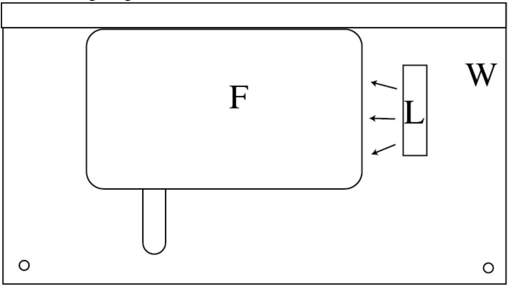
F - box with fluid
L - light
W - wooden base
Diffuse lighting is used for other parts. In this case the light is direction up and away from the box with ferrofluid.
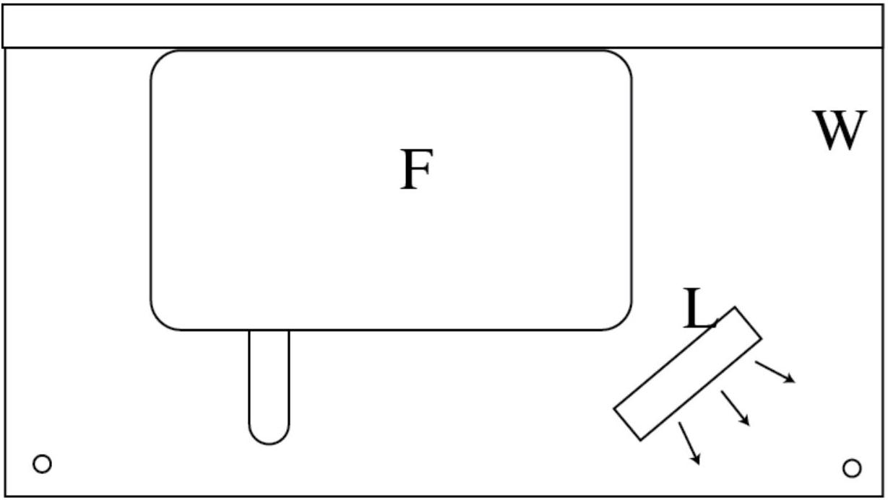

## Part A Plane pulses

A. 1 Direct lighting was used, so see above for diagram.
A. 2 Some example frames from videos are shown below.

Note that the scale on the graticule does not directly measure position.
A measurement with a ruler of the internal length of the container is $17.3 \pm 0.3 \mathrm {~cm}$.
The distance is equivalent to 13.4 graticule squares, so there is a factor of 17.0/13.4 to convert from graticule squares to cm.
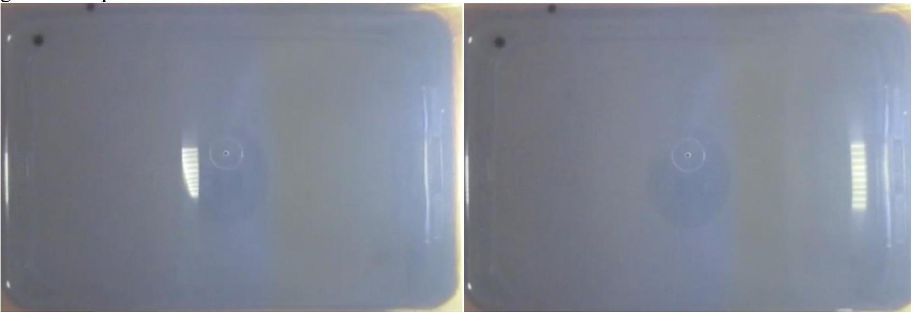
The images above show two frames from a video of a plane pulse. The videos are recorded at 25 fps by default

| Frames | Distance (graticule squares) | Distance (m) | Speed (m/s) |
| :--- | :--- | :--- | :--- |
| 8 | 6.5 | 0.83 | 0.26 |
| 7 | 6.0 | 0.76 | 0.27 |
| 9 | 6.8 | 0.85 | 0.24 |

This gives $v = 0.26 \pm 0.02 \mathrm {~m} / \mathrm { s }$
A. 3 The uncertainty is estimated from the spread of values.

Part B Wave pulses in fluid of varying depth
B. 1
i.
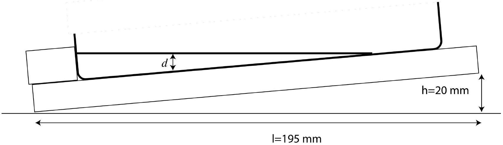
$h = 20 \pm 1 \mathrm {~mm} , l = 195 \pm 2 \mathrm {~mm}$. The latter uncertainty is larger due to difficulty lining up ruler with projection of end of the board.
ii.
Since the depth varies linearly, $d = y \tan \theta$.
Here $\tan \theta = \frac { h } { l } = 0.103 \pm 0.006$, so $d = 0.103 y$.

B. 2

A - fastest at largest y.
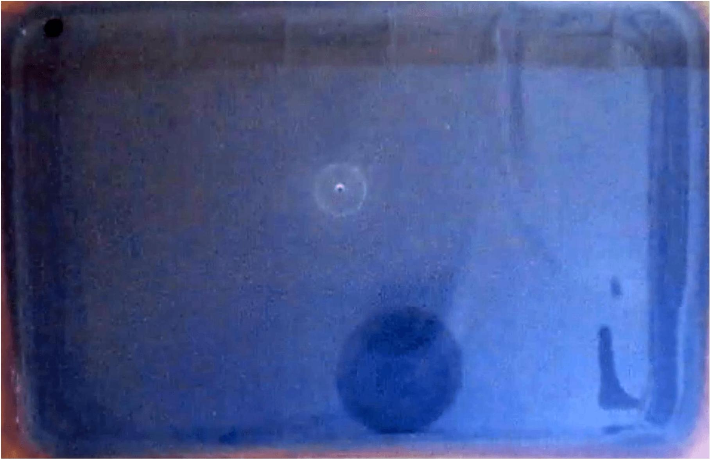

B - slowest at $\mathrm { y } = 0$.
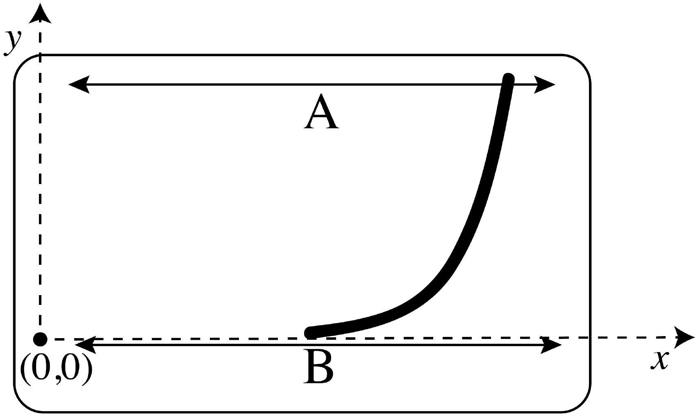

B. 3 If $\mathrm { x } = 0$ when $\mathrm { t } = 0$, then $x = v t$, however, $v = \alpha \sqrt { d }$, so $x = \alpha \sqrt { d } t$.
Hence, $x = \alpha \sqrt { y \tan \theta } t$, or equivalently, $x ^ { 2 } = \alpha ^ { 2 } \tan \theta t ^ { 2 } y$.
Here $\tan \theta = \frac { h } { l } = 0.103 \pm 0.006$, so $x = \alpha \sqrt { 0.103 y } \cdot t$.
This approximation will be least valid when the direction of propagation varies the most from the x-direction, and when the depth is least as there are nonlinear effects. Both of these happen for small $y$, in other words, $y < k$ for some constant $k$. This is shown as the grey shaded region marked V on the diagram below.
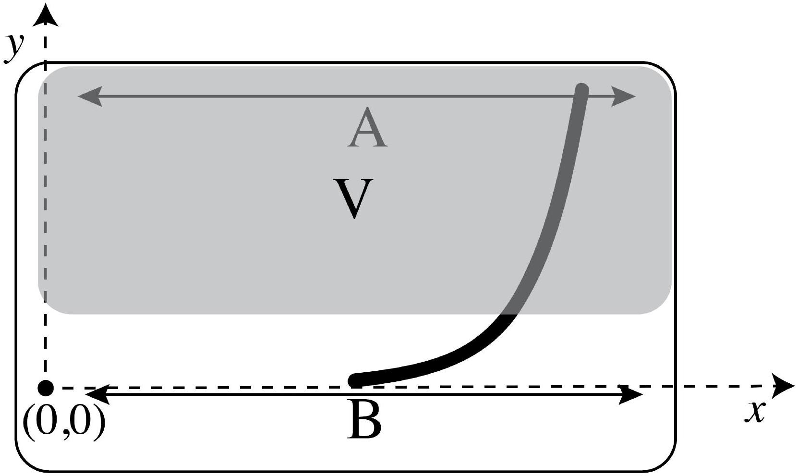

B. 4 Diffuse light is more appropriate as the pulses are curved, so it is not possible to get direct reflections from the available source from enough of the pulse. See the second diagram on p. 1 for light position.

Videos of the curved pulses are recorded, with adjustments to the lighting, until a clearly visible pulse is observed near where the fastest travelling sections have reached the end. For that single frame the coordinates of points along the pulse are recorded.
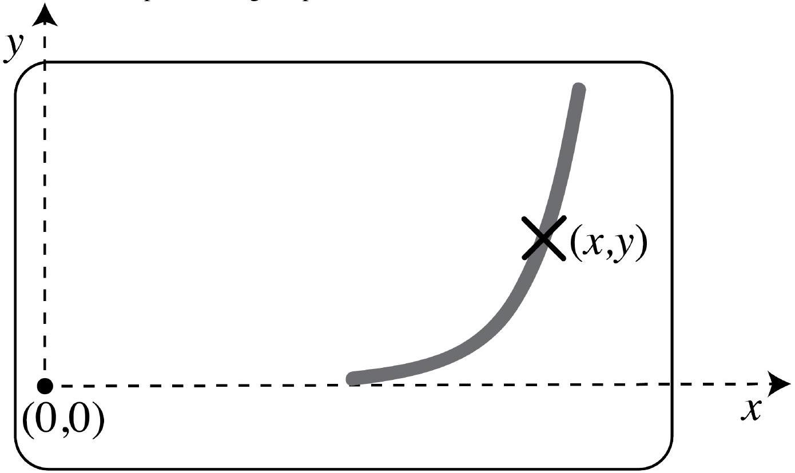
The 8th frame after the generation of the pulse was used so $t = 8 / 25 \mathrm {~s} = 0.28 s$. Here $x _ { 0 }$ is the x coordinate of the position where the pulse front is at y=0. This is treated as the new origin, and the offset in the $x = 0$ position is $x _ { 0 } = 4.5 \mathrm { gr }$ sq.

| $x ( \mathrm { gr } \mathrm { sq } )$ | $y ( \mathrm { gr } \mathrm { sq } )$ | $\left( x - x _ { 0 } \right) ^ { 2 } ( \operatorname { gr } \mathrm { sq } ) ^ { 2 }$ | $\Delta \left[ \left( x - x _ { 0 } \right) ^ { 2 } \right]$ |
| :--- | :--- | :--- | :--- |
| 5.0 | 0.2 | 0.25 | 0.02 |
| 6.0 | 0.3 | 2.25 | 0.15 |
| 7.0 | 0.6 | 6.3 | 0.4 |
| 7.8 | 1.4 | 10.9 | 0.6 |
| 8.5 | 2.2 | 16.0 | 0.8 |
| 8.7 | 2.8 | 17.6 | 0.8 |
| 9.0 | 4.0 | 20.3 | 0.9 |
| 9.3 | 5.0 | 23.0 | 1.0 |
| 9.8 | 6.0 | 28.1 | 1.1 |
| 10.0 | 8.0 | 30.3 | 1.2 |
| 9.9 | 7.0 | 29.2 | 1.2 |

B. 5

$$
y \text { vs } x ^ { 2 } , y > 2 \text {, in the } 8 ^ { \text {th } } \text { frame }
$$

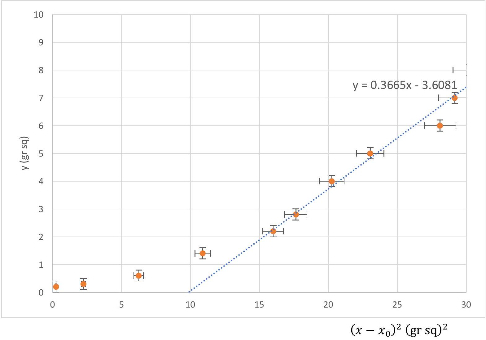
Converting to SI units, the slope $\mathrm { m } = 0.280 / \mathrm { m }$.

$$
m = \alpha ^ { 2 } \tan \theta t ^ { 2 }
$$

Hence $\alpha = 5.9 \pm 0.5 m ^ { 1 / 2 } s ^ { - 1 }$, and $v ( d ) = 5.9 \times \sqrt { d }$.
Uncertainty was calculated from the slope of the line of worst fit $\mathrm { m } = 0.331 / \mathrm { m }$.

## Part C Wave and magnetic effects

Mechanically driven by pushing glass
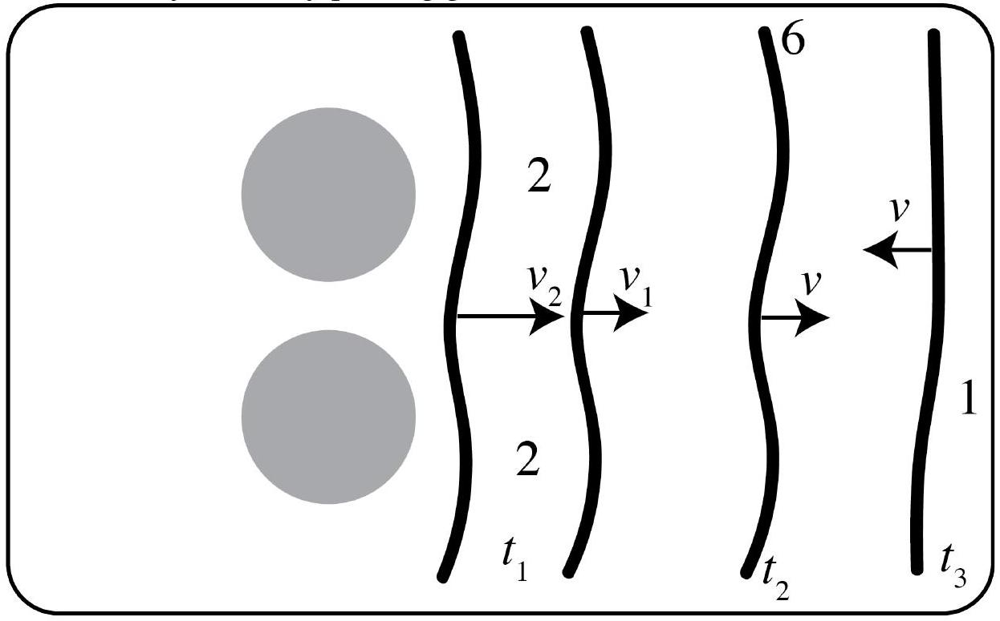

Refraction observed by perturbation of front over magnets, Interference when the fronts meet, Reflections from end.

$$
t _ { 1 } < t _ { 2 } < t _ { 3 }
$$

Mechanically driven by pushing base
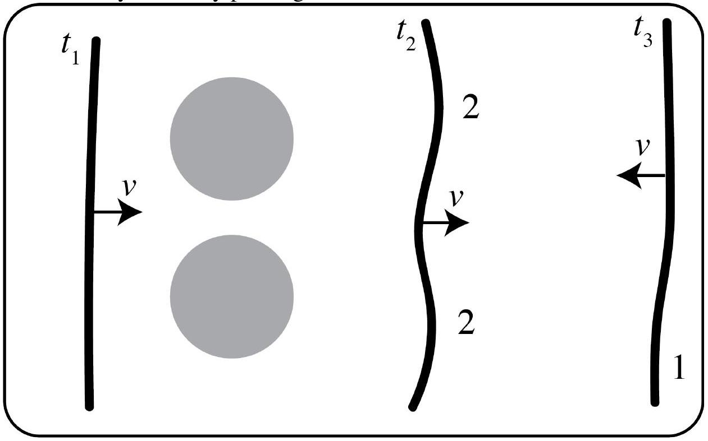

Refraction as wave is perturbed over the fronts, Reflections from ends, Maybe some diffraction after passing between the lumps over the magnets.

$$
t _ { 1 } < t _ { 2 } < t _ { 3 }
$$

Magnetically driven
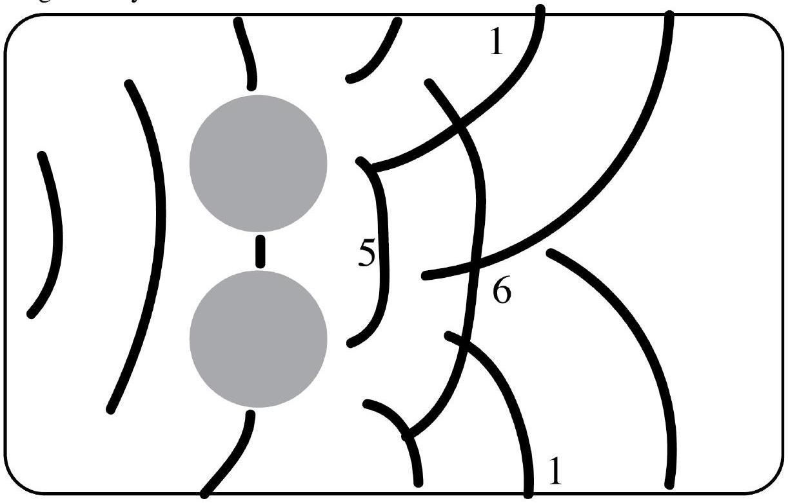

Reflections from side walls and ends
Diffraction after passing between the lumps.
Interference from many waves crossing.
Each line represents the position of a pulse front in a particular frame.

Part D Internal properties of ferrofluid within a strong magnetic field
D. 1
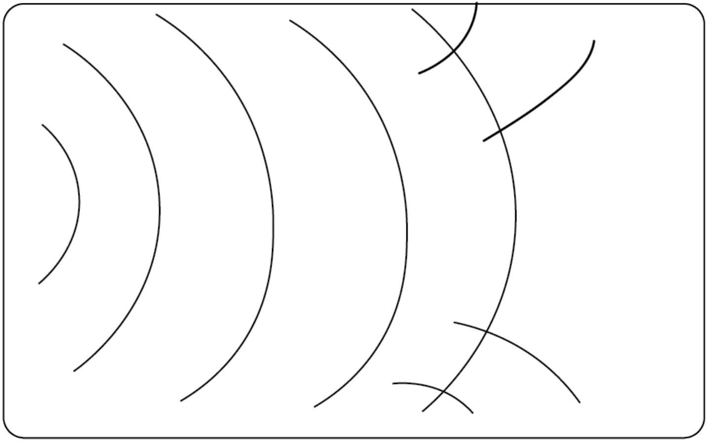
Magnetically driven pulses are not planar, so there is resulting reflection from the sides of the container. Note the multiple lines demonstrate the same pulse at different times.
D. 2 Direct lighting, as in the first diagram on p. 1.

Speed measurements of the magnetically driven waves are around the same, to somewhat faster than small amplitude mechanically driven waves. Students should find that pulses are around 0.1-0.4 (gr sq)/m faster than in A2/3.

Data and sketches should look similar to A2/3 otherwise.
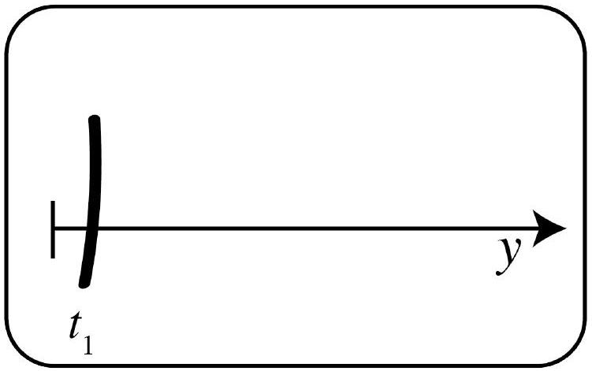
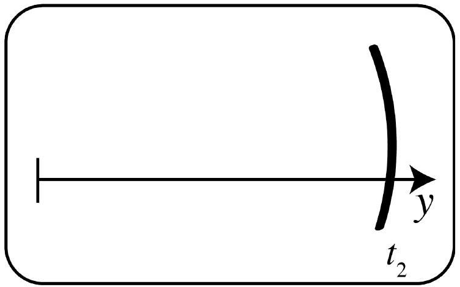
Measurements of the y position at two times, and the difference in the times allow calculation of the speed.
The height of the lump can be estimated by observing from the side, or more accurately by using the limiting value from E1 Part C.

D. 3 The light was placed in the diffuse light set up. See the second figure on p.1.
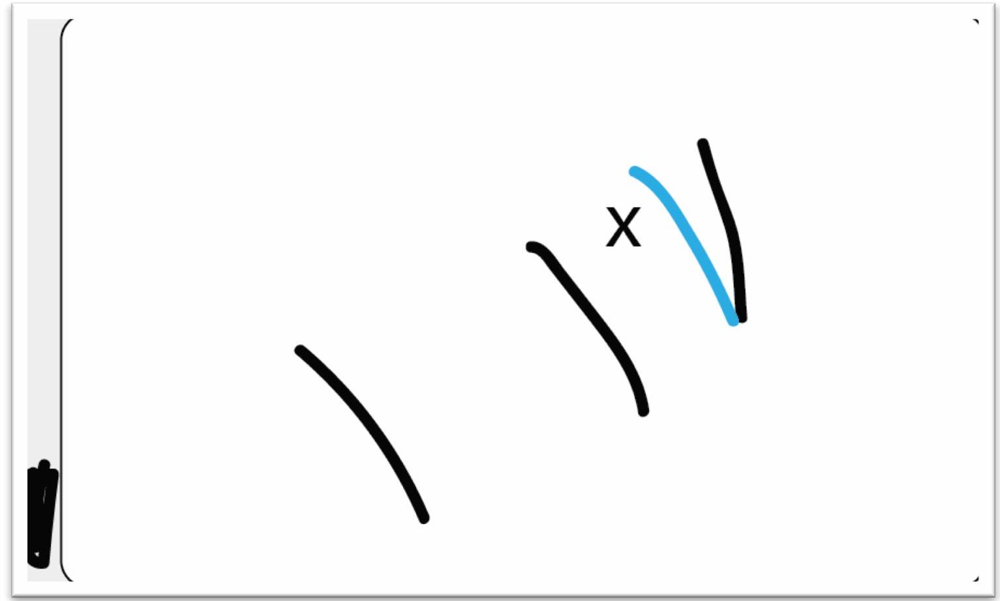
The black represents observed pulses over the magnet x . The blue represents the expected positionsing of the pulseafter travelled that distance.
D. 4 The diffuse lighting set up was used again.
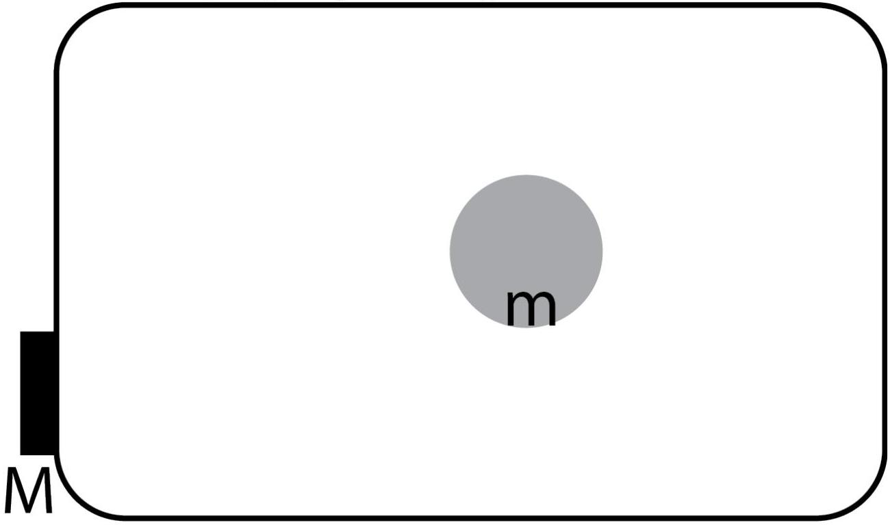

D. 5
A wave front was observed to travel as additional 0.8 gr sq over 8 frames. The extent of the lump is assumed to be 3cm in diameter and the additional distance in the time all occurs over the lump. The wave crossed the lump in around 2 frames This means that the wave travels at a speed of around 0.35 m/s over the lump.

The two wavefronts shown above are only 2 frames apart.
Measurements of position were taken when the wavefronts where further apart.
D. 6 The height of the lump can be estimated by observing from the side, or more accurately by using the limiting value from E1 Part C.
The best estimate of the height of the lump is found to be 5mm. The expected speed of fluid of depth 9mm, compared to fluid of depth 4 mm is $\sqrt { \frac { 9 } { 4 } } = \frac { 3 } { 2 }$ times larger, which is $\frac { 3 } { 2 } \times 0.26 \frac { m } { s } = 0.39 m / s$.
As these are estimates they are close enough that we cannot conlcude that the change in wave speed is due to anything other than the additional depth of the fluid.
