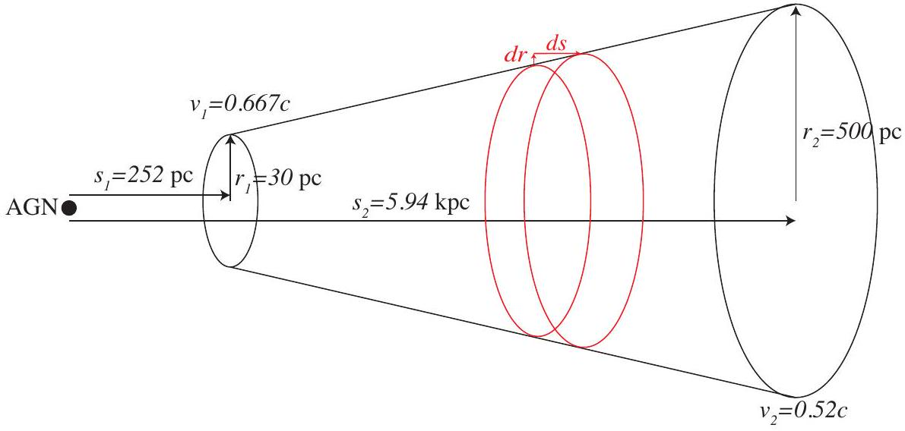

## Part A: 1d fluid model of a jet

A1
If you consider a prism of plasma in the jet frame, it contains a number of particles $N$, has length $l$ in the direction of motion, and cross sectional area $A$. The total number of particles in the volume is invariant on transformation into the AGN frame, however the volume occupied by the plasma changes as lengths are contracted in the direction of motion, while perpendicular lengths are unchanged. Hence, $A ^ { \prime } = A$, and $l ^ { \prime } = l / \gamma$.

This gives us two relationships:

$$
\begin{equation*}
N = n ( s ) A l \tag{1}
\end{equation*}
$$

and

$$
\begin{equation*}
N = n ^ { \prime } ( s ) A l / \gamma \tag{2}
\end{equation*}
$$

Equating these gives

$$
n ( s ) A l = n ^ { \prime } ( s ) A l / \gamma ,
$$

which leads to

$$
\begin{equation*}
n ^ { \prime } ( s ) = \gamma n ( s ) . \tag{3}
\end{equation*}
$$

A2
The particles in the jet have a bulk flow speed of $v ( s )$, so in a time $\Delta t$ a volume $V = A ( s ) v ( s ) \Delta t$ crosses the cross section of the jet. Using the number density in the AGN frame,

$$
\begin{align*}
F _ { \mathrm { p } } ( s ) & = n ^ { \prime } ( s ) A ( s ) v ( s )  \tag{4}\\
& = \gamma ( s ) n ( s ) A ( s ) v ( s ) \tag{5}
\end{align*}
$$

A3
As the plasma travels along the jet there are no particles passing through the side boundary of the jet. Hence, the total flux through the curved edges of the jet is zero, and the total flux into the jet is the flux in through the cross section at $s _ { 1 }$ is $F _ { \mathrm { p } } \left( s _ { 1 } \right)$ and the total flux out of the jet is $F _ { \mathrm { p } } \left( s _ { 2 } \right)$. There is an additional term in the continuity equation due to the mass injection. There are $\alpha V / \mu _ { \mathrm { pp } }$ particles injected.

This gives

$$
\begin{equation*}
\gamma \left( s _ { 2 } \right) v \left( s _ { 2 } \right) n \left( s _ { 2 } \right) A \left( s _ { 2 } \right) - \gamma \left( s _ { 1 } \right) v \left( s _ { 1 } \right) n \left( s _ { 1 } \right) A \left( s _ { 1 } \right) = \alpha V / \mu _ { \mathrm { pp } } \tag{6}
\end{equation*}
$$

A4
Similarly, in the AGN frame the energy flux

$$
\begin{equation*}
F _ { \mathrm { E } } ( s ) = n ^ { \prime } ( s ) A ^ { \prime } ( s ) v ( s ) \epsilon _ { \mathrm { av } } ^ { \prime } ( s ) \tag{7}
\end{equation*}
$$

We use previous results for all quantities except average energy per particle.
Consider the total energy in a volume $\Delta V$ of the plasma, $E _ { \text {tot } } = \epsilon _ { \text {av } } N$ in the jet frame. As this is the proper frame $\mathrm { v } ( \mathrm { s } ) = 0$.

Transforming to the AGN frame, $E _ { \text {tot } } ^ { \prime } = \gamma ( s ) \epsilon _ { \mathrm { av } } N$, and $\epsilon _ { \mathrm { av } } ^ { \prime } = \gamma \epsilon _ { \mathrm { av } }$.
Hence,

$$
\begin{equation*}
\left. F _ { \mathrm { E } } ( s ) = ( \gamma ( s ) ) ^ { 2 } n ( s ) A ^ { \prime } s \right) v ( s ) \epsilon _ { \mathrm { av } } ( s ) . \tag{8}
\end{equation*}
$$

Energy conservation requires that the total energy flux out of the jet is equal to the energy added through injection of mass, so

$$
\begin{equation*}
\left( \gamma \left( s _ { 2 } \right) \right) ^ { 2 } v \left( s _ { 2 } \right) n \left( s _ { 2 } \right) A \left( s _ { 2 } \right) \epsilon _ { \mathrm { av } } \left( s _ { 2 } \right) - \left( \gamma \left( s _ { 1 } \right) \right) ^ { 2 } v \left( s _ { 1 } \right) n \left( s _ { 1 } \right) A \left( s _ { 1 } \right) \epsilon _ { \mathrm { av } } \left( s _ { 1 } \right) = \alpha V c ^ { 2 } \tag{9}
\end{equation*}
$$

A5
From the defintion of jet power and also (8),

$$
\begin{equation*}
\left. P _ { j } ( s ) = ( \gamma ( s ) ) ^ { 2 } n ( s ) A ^ { \prime } s \right) v ( s ) \epsilon _ { \mathrm { av } } ( s ) - \dot { M } c ^ { 2 } \tag{10}
\end{equation*}
$$

Here $\dot { M }$ is the flux of mass flux across the surface, so $\dot { M } = F _ { \mathrm { p } } ( s ) \mu _ { \mathrm { pp } }$ and

$$
\begin{equation*}
\left. P _ { j } ( s ) = ( \gamma ( s ) ) ^ { 2 } n ( s ) A ^ { \prime } s \right) v ( s ) \epsilon _ { \mathrm { av } } ( s ) - F _ { \mathrm { p } } ( s ) \mu _ { \mathrm { pp } } c ^ { 2 } . \tag{11}
\end{equation*}
$$

In order to find how jet power varies along the jet, we consider jet power at two points along the jet.

$$
\begin{align*}
P _ { \mathrm { j } } \left( s _ { 2 } \right) - P _ { \mathrm { j } } \left( s _ { 1 } \right) = & \left( \gamma \left( s _ { 2 } \right) \right) ^ { 2 } n \left( s _ { 2 } \right) A ^ { \prime } \left( s _ { 2 } \right) v \left( s _ { 2 } \right) \epsilon _ { \mathrm { av } } \left( s _ { 2 } \right) - F _ { \mathrm { p } } \left( s _ { 2 } \right) \mu _ { \mathrm { pp } } c ^ { 2 }  \tag{12}\\
& - \left( \left( \gamma \left( s _ { 2 } \right) \right) ^ { 2 } n \left( s _ { 1 } \right) A ^ { \prime } \left( s _ { 1 } \right) v \left( s _ { 1 } \right) \epsilon _ { \mathrm { av } } \left( s _ { 1 } \right) - F _ { \mathrm { p } } \left( s _ { 1 } \right) \mu _ { \mathrm { pp } } c ^ { 2 } \right) \tag{13}
\end{align*}
$$

We can identify the two terms with $\epsilon _ { \mathrm { av } }$ to be those from the left hand side of (8), and the two terms with $\mu _ { \mathrm { pp } }$ are $\mu _ { \mathrm { pp } } c ^ { 2 }$ times the left hand side of (6). Making these substitutions,

$$
\begin{equation*}
P _ { \mathrm { j } } \left( s _ { 2 } \right) - P _ { \mathrm { j } } \left( s _ { 1 } \right) = \alpha V c ^ { 2 } - \alpha V c ^ { 2 } = 0 . \tag{14}
\end{equation*}
$$

This argument applies to arbitary $s _ { 1 }$ and $s _ { 2 }$, so the jet power is constant along the jet and $\frac { d P _ { \mathrm { j } } } { d s } = 0$.
A6
We start from (10) and substitute $\epsilon _ { \mathrm { av } } = \mu _ { \mathrm { pp } } c ^ { 2 } + \frac { 13 } { 4 } \frac { P } { n }$, to arrive at

$$
\begin{align*}
P _ { \mathrm { j } } ( s ) & = ( \gamma ( s ) ) ^ { 2 } n ( s ) A ( s ) v ( s ) \left( \mu _ { \mathrm { pp } } c ^ { 2 } + \frac { 13 } { 4 } \frac { P } { n ( s ) } \right) - \gamma ( s ) n ( s ) A ( s ) v ( s ) \mu _ { \mathrm { pp } } c ^ { 2 }  \tag{15}\\
& = ( \gamma ( s ) - 1 ) \gamma ( s ) n ( s ) A ( s ) v ( s ) \mu _ { \mathrm { pp } } c ^ { 2 } + ( \gamma ( s ) ) ^ { 2 } A ( s ) v ( s ) \frac { 13 } { 4 } P  \tag{16}\\
& = ( \gamma ( s ) - 1 ) \dot { M } c ^ { 2 } + ( \gamma ( s ) ) ^ { 2 } A ( s ) v ( s ) \frac { 13 } { 4 } P \tag{17}
\end{align*}
$$

Rearranging to find $\dot { M }$ gives

$$
\begin{equation*}
\dot { M } = \frac { P _ { \mathrm { j } } - \gamma ( s ) ^ { 2 } A ( s ) v ( s ) \frac { 13 } { 4 } P } { ( \gamma ( s ) - 1 ) c ^ { 2 } } \tag{18}
\end{equation*}
$$

Using the relationship $P ( s ) = 5.7 \times 10 ^ { - 12 } \left( \frac { s } { s _ { 0 } } \right) ^ { - 1.5 }$ and substituting values for $s _ { 1 }$ and $s _ { 2 }$ respectively into (18), give $\dot { M } _ { 1 } = 2.8 \times 10 ^ { 19 } \mathrm {~kg} \mathrm {~s} ^ { - 1 }$ and $\dot { M } _ { 2 } = 5.2 \times 10 ^ { 19 } \mathrm {~kg} \mathrm {~s} ^ { - 1 }$.

Note: some of the input values are given to one significant figure only. Hence, answers which are correct to this degree of precision and are given to one or two significant figures are accepted as correct.

A7
From lorentz transforming $\epsilon _ { \mathrm { av } }$ from the jet frame where $v = 0$ to the AGN frame, the average momentum per particle is $p _ { \mathrm { av } } = \gamma ( s ) \frac { v ( s ) } { c ^ { 2 } } \epsilon _ { \mathrm { av } }$. As the momentum is directly proportional to the total energy, the flux argument is the same, and

$$
\begin{equation*}
\Pi ( s ) = \frac { F _ { \mathrm { E } } } { c } \frac { v ( s ) } { c } . \tag{19}
\end{equation*}
$$

This can be related to the jet power and $\dot { M }$,

$$
\begin{equation*}
\Pi ( s ) = \left( \frac { P _ { \mathrm { j } } } { c } + \dot { M } c \right) \frac { v ( s ) } { c } . \tag{20}
\end{equation*}
$$

Again, there is no particle flux, and hence no momentum flux through the sides of the jet, so the total momentum flux out of the jet is

$$
\begin{equation*}
\Pi = \Pi \left( s _ { 2 } \right) - \Pi \left( s _ { 1 } \right) . \tag{21}
\end{equation*}
$$

Substituting values for the jet at $s _ { 2 }$ and $s _ { 1 }$ gives $\Pi = 1.9 \times 10 ^ { 27 } \mathrm {~kg} \mathrm {~m} \mathrm {~s} ^ { - 2 }$.

A8
The total force on the jet due to external pressure has contributions from the cross section at $s _ { 1 } , F _ { 1 } = P \left( s _ { 1 } \right) A \left( s _ { 1 } \right)$, at $s _ { s }$, $F _ { 2 } = P \left( s _ { 2 } \right) A \left( s _ { 2 } \right)$, and from the pressure on the curved surface. We have a linear relationship $s ( r ) = s _ { 1 } + \frac { s _ { 2 } - s _ { 1 } } { r _ { 2 } - r _ { 1 } } \left( r - r _ { 1 } \right)$.

The nett pressure force on the surface is only the component in the $s$ direction. As the force is perpendicular to the surface, this results in a factor of $\frac { d r } { d s }$. Consequently

$$
\begin{equation*}
d F = 2 \pi r P ( s ) d r , \tag{22}
\end{equation*}
$$

where $P ( s ) = 5.7 \times 10 ^ { - 12 } \left( \frac { s } { s _ { 0 } } \right) ^ { - 1.5 }$.
The total force due to the external pressure,

$$
\begin{equation*}
F _ { \mathrm { Pr } } = F _ { 1 } - F _ { 2 } + \int _ { r _ { 1 } } ^ { r _ { 2 } } d F \tag{23}
\end{equation*}
$$

Evaluating the integral gives $\int _ { r _ { 1 } } ^ { r _ { 2 } } d F = 9.8 \times 10 ^ { 26 } \mathrm {~N}$, so $F _ { \mathrm { Pr } } = 8.2 \times 10 ^ { 26 } \mathrm {~N}$.
A9
As there are no other forces on the jet, it is expected that $\Pi = F _ { \mathrm { Pr } }$.
The \% deviation is $\left| \left( \Pi - F _ { \mathrm { Pr } } \right) / F _ { \mathrm { Pr } } \right| \approx 40 \%$

## Gas of ultrarelativistic electrons

B1
The total energy per volume is

$$
\int _ { 0 } ^ { \infty } \epsilon f ( \epsilon ) d \epsilon
$$

B2
Consider the particles colliding with a surface $\Delta A$, with the normal to the surface in the $z$-direction, in time $\Delta t$. As the electrons are ultrarelativistic, theirs speeds are all approximately $c$. We assume that the collisions with wall are elastic, and electrons depart with their parallel mometnum unchanged and $p _ { z }$, final $= - p _ { z }$. Hence, $\Delta p _ { z } = 2 p _ { z }$, where $p _ { z } = \frac { \epsilon } { c } \cos \theta$, since the electrons are ultrarelativistic and $E \approx p c$.

The distribution is isotropic so electrons are equally likely to be travelling in any direction.
All electrons within a parallelepiped of length $c \Delta t$ which approach the surface at an angle $\theta$ will hit it in the time $\Delta t$. The volume of the paralleleiped is $c \Delta t \Delta A \cos \theta$. From here, the total change in momentum is

$$
\begin{align*}
\Delta p _ { z } & = \int _ { 0 } ^ { \infty } \int _ { 0 } ^ { \pi / 2 } \int _ { 0 } ^ { 2 \pi } 2 f ( \epsilon ) p _ { z } c \Delta t \Delta A \cos \theta \frac { \sin \theta } { 4 \pi } d \phi d \theta d \epsilon  \tag{24}\\
& = \frac { 2 \Delta t \Delta A } { 4 \pi } \int _ { 0 } ^ { \pi / 2 } \sin \theta \cos ^ { 2 } \theta d \theta \int _ { 0 } ^ { 2 \pi } d \phi \int _ { 0 } ^ { \infty } \epsilon f ( \epsilon ) d \epsilon  \tag{25}\\
& = \frac { 2 \Delta t \Delta A } { 4 \pi } \times \frac { 1 } { 3 } \times 2 \pi \int _ { 0 } ^ { \infty } \epsilon f ( \epsilon ) d \epsilon \tag{26}
\end{align*}
$$

B3
As the remaining integral in the expression above was identified as the energy per volume in B1, $\Delta p _ { z } = \Delta t \Delta A \frac { 1 } { 3 } \frac { E } { V }$. The pressure is the force per area normal to the wall, so $P = \frac { \Delta p _ { z } } { \Delta t } \frac { 1 } { \Delta A }$. Combining these gives $P = \frac { E } { 3 V }$, or $E = 3 P V$, which is the equation of state.

B4
For an adiabatic process $d Q = 0$ so $d E = d W = - P d V \cdot d E = d ( 3 P V ) = 3 P d V + 3 V d P$, so equating these expressions gives

$$
\begin{align*}
3 P d V + 3 V d P & = - p d V  \tag{27}\\
4 P d V & = - 3 V d P  \tag{28}\\
4 \frac { d V } { V } & = - 3 \frac { d P } { P }  \tag{29}\\
4 \int _ { V _ { 0 } } ^ { V } \frac { d V ^ { \prime } } { V ^ { \prime } } & = - 3 \int _ { P _ { 0 } } ^ { P } \frac { d P ^ { \prime } } { P }  \tag{30}\\
4 \ln \left( \frac { V } { V _ { 0 } } \right) & = - 3 \ln \left( \frac { P } { P _ { 0 } } \right)  \tag{31}\\
\frac { P V ^ { 4 / 3 } } { P _ { 0 } V _ { 0 } ^ { 4 / 3 } } & = 1 \tag{32}
\end{align*}
$$

## Synchrotron emission

C1
An electron in a magnetic field has a component of its velocity, $v \cos \phi$ along the magnetic field, and $v \sin \phi$ perpendicular to the field. The parallel component of the velocity remains constant, but in the perpendicular direction the electron experiences a force in a direction perpendicular to its motion, so it undergoes simple harmonic motion. The perpendicular component of its velocity is $\Omega r$ where $\Omega$ is its angular frequency and $r$ the radius of the circular motion. The force on the electron is $\mathbf { F } _ { \mathrm { B } } = q \mathbf { v } \times \mathbf { B } = e \Omega r B \sin \phi$. The acceleration of the electron is perpendicular to the direction of motion, so $F _ { B } = \gamma m a$, where $a$ is the acceleration and $m$ the mass of the electron. For uniform circular motion, $a = - \Omega ^ { 2 } r$, so

$$
\begin{align*}
F _ { \mathrm { B } } & = \gamma m \Omega ^ { 2 } r  \tag{33}\\
e \Omega r B \sin \phi & = \gamma m \Omega ^ { 2 } r  \tag{34}\\
\Omega & = \frac { e B \sin \phi } { \gamma m } \tag{35}
\end{align*}
$$

C2
The observer only sees the synchrotron emission when they are within the forward light cone. As the electron is gyrating around the magnetic field, this direction is changing. The observer is in this light cone for time $\Delta t = \frac { 2 \theta } { \Omega } = \frac { 2 m } { e B }$. However, the emitting electron is moving directly toward the observer over this time, so although the light emitted at the start of the pulse is ahead of the light at the end of the pulse, it is only ahead by $c \Delta t \left( 1 - \frac { v } { c } \right)$. The pulse then has an apparent duration of

$$
\Delta t _ { a } = \Delta t \left( 1 - \frac { v } { c } \right) .
$$

Since $\left( 1 - \frac { v } { c } \right) \left( 1 + \frac { v } { c } \right) = 1 - \frac { v ^ { 2 } } { c ^ { 2 } } = \frac { 1 } { \gamma ^ { 2 } }$, we can write $\left( 1 - \frac { v } { c } \right) = \frac { 1 } { \gamma ^ { 2 } \left( 1 + \frac { v } { c } \right) }$. As the electrons are ultrarelativistic, $\left( 1 + \frac { v } { c } \right) = 2$, and

$$
\Delta t _ { \mathrm { a } } = \frac { m _ { e } } { \gamma ^ { 2 } e B }
$$

C3

$$
\nu _ { \mathrm { chr } } \approx \frac { 1 } { \Delta t _ { \mathrm { a } } } = \frac { \gamma ^ { 2 } e B } { m _ { e } }
$$

C4
Making a linear approximation,

$$
\begin{align*}
\tau & \approx - \frac { E } { \left( \frac { d E } { d t } \right) }  \tag{36}\\
& = \frac { 6 \pi \varepsilon _ { 0 } m ^ { 4 } c ^ { 5 } } { e ^ { 4 } B ^ { 2 } \sin ^ { 2 } \phi } \frac { 1 } { E } \tag{37}
\end{align*}
$$

## Synchrotron emission from an AGN jet

D1
As the magnetic field is frozen in, and magnetic flux is constant, the magnetic field must decrease as the area increases in the expansion.

For a small area $A , B _ { 0 } A _ { 0 } = B A$. Since $A \propto V ^ { 2 / 3 } , B = B _ { 0 } \left( A _ { 0 } / A \right) = B _ { 0 } \left( \frac { V } { V _ { 0 } } \right) ^ { - 2 / 3 }$
D2
A volume of plasma $V _ { 0 }$ with number density $n _ { 0 }$ contains a total number of particles $N = n _ { 0 } V _ { 0 }$. As the volume expands, the total number remains constant, so $n = N / V = \left( V / V _ { 0 } \right) n _ { 0 }$.

The internal energy of the plasma $E = 3 P V$, and since $P V ^ { 4 / 3 } = P _ { 0 } V _ { 0 } ^ { 4 / 3 } , E V ^ { 1 / 3 } = E _ { 0 } V _ { 0 } ^ { 1 / 3 }$. The scaling for particle energy with volume is then $E = \left( V / V _ { 0 } \right) ^ { - 1 / 3 } E _ { 0 }$. This means that the particles initially with energies between $\epsilon _ { 0 }$ and $\epsilon + d \epsilon$, will have energies between $\left( V / V _ { 0 } \right) ^ { - 1 / 3 } \epsilon _ { 0 }$ and $\left( V / V _ { 0 } \right) ^ { - 1 / 3 } ( \epsilon + d \epsilon )$. As $\left( \left( V / V _ { 0 } \right) ^ { - 1 / 3 } \epsilon \right) ^ { - p } = \left( V / V _ { 0 } \right) ^ { - p / 3 } \epsilon ^ { - p }$.

Hence, we can write

$$
f ( \epsilon ) = \kappa \epsilon ^ { - p } .
$$

The value of $\kappa$ is determined by the relationship

$$
\int _ { 0 } ^ { \infty } \kappa \epsilon ^ { - p } d \epsilon = N / V
$$

Given

$$
\int _ { 0 } ^ { \infty } \kappa _ { 0 } \epsilon ^ { - p } d \epsilon = N / V _ { 0 }
$$

$\kappa _ { 0 } V _ { 0 } = \kappa V$, and

$$
f ( \epsilon ) = \left( \frac { V } { V _ { 0 } } \right) ^ { - 1 } \kappa _ { 0 } \epsilon ^ { - p }
$$

D3
As the energy loss rate due to synchrotron emission increases as $E ^ { 2 }$, and the cooling time decreases as $1 / E$, the more energetic electrons lose energy more rapidly. If we consider electrons with energies $\epsilon _ { 1 } < \epsilon _ { 2 }$, both will move to lower energies in the distribution, but $d f / d t \propto E ^ { 2 }$, so $\left. \frac { d f } { d t } \right| _ { \epsilon _ { 2 } } > \left. \frac { d f } { d t } \right| _ { \epsilon _ { 1 } }$. This will reduce the relative number of electrons with higher energies, and steepen the power law of the electron energy distribution.

D4
For the knots in Centaurus A there is no change in the x-ray spectrum, so this rules out synchrotron cooling as in that case the spectrum would steepen (Part D3). Hence adiabatic cooling is more likely for these two knots.

For the knots in M87, there is no change in brightness in other bands. Adiabatic expansion would reduce the number density at all energies (Part D2) and hence brightness at all wavelengths, so this is not likely. Hence, synchrotron cooling is more likely for these two knots.
