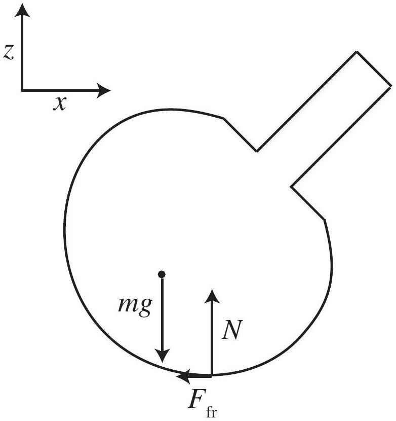
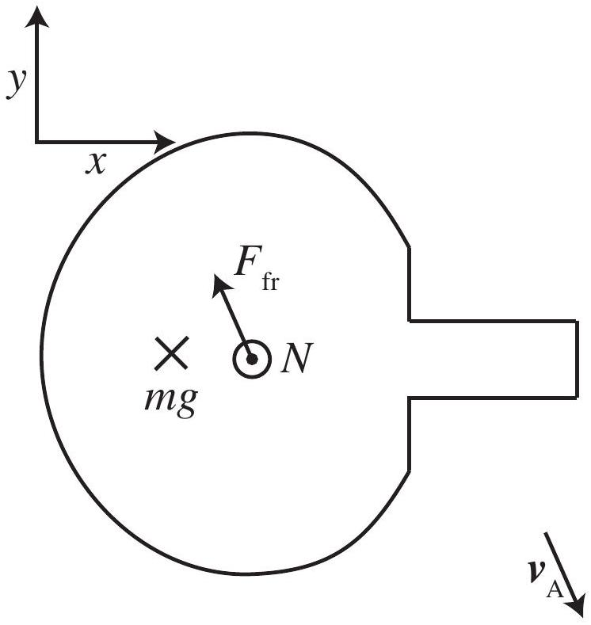
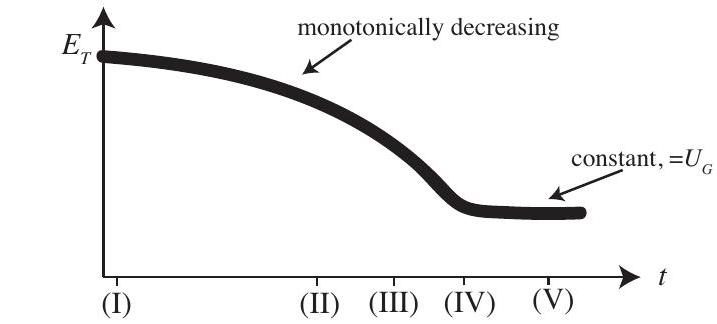
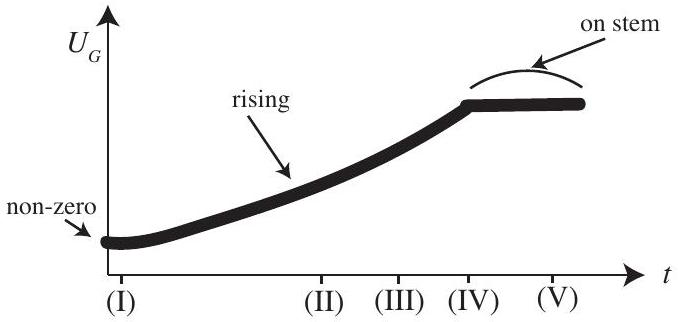
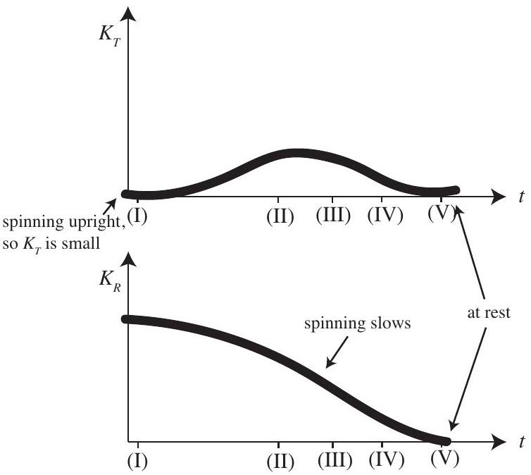

## Reference sheet for markers

Note: some results below were used for the previous version of part A.10, and are no longer needed.
Coordinate systems for convenience (note: use of matrices not needed) $x y z$ from $X Y Z$

$$
\left[ \begin{array} { c }
\hat { \mathbf { x } } \\
\hat { \mathbf { y } } \\
\hat { \mathbf { z } }
\end{array} \right] = \left[ \begin{array} { c c c }
\cos \phi & \sin \phi & 0 \\
- \sin \phi & \cos \phi & 0 \\
0 & 0 & 1
\end{array} \right] \left[ \begin{array} { c }
\hat { \mathbf { X } } \\
\hat { \mathbf { Y } } \\
\hat { \mathbf { Z } }
\end{array} \right]
$$

123 from $x y z$

$$
\left[ \begin{array} { l }
\hat { \mathbf { 1 } } \\
\hat { \mathbf { 2 } } \\
\hat { \mathbf { 3 } }
\end{array} \right] = \left[ \begin{array} { c c c }
\cos \theta & 0 & - \sin \theta \\
0 & 1 & 0 \\
\sin \theta & 0 & \cos \theta
\end{array} \right] \left[ \begin{array} { c }
\hat { \mathbf { x } } \\
\hat { \mathbf { y } } \\
\hat { \mathbf { z } }
\end{array} \right]
$$

Position of point $A$ from centre of mass, in $x y z$ and 123 frames:

$$
\begin{align*}
\mathbf { a } & = \alpha R \hat { \mathbf { 3 } } - R \hat { \mathbf { z } }  \tag{1}\\
& = \alpha R \sin \theta \hat { \mathbf { x } } + R ( \alpha \cos \theta - 1 ) \hat { \mathbf { z } } \\
& = R \sin \theta \hat { \mathbf { 1 } } + R ( \alpha - \cos \theta ) \hat { \mathbf { 3 } }
\end{align*}
$$

Useful products:

$$
\begin{equation*}
\hat { \mathbf { z } } \times \hat { \mathbf { 3 } } = \sin \theta \hat { \mathbf { y } } \tag{2}
\end{equation*}
$$

Note (given in question):

$$
\begin{equation*}
\left( \frac { \partial \mathbf { A } } { \partial t } \right) _ { \mathbf { K } } = \left( \frac { \partial \mathbf { A } } { \partial t } \right) _ { \widetilde { \mathbf { K } } } + \boldsymbol { \omega } \times \mathbf { A } \tag{4}
\end{equation*}
$$

Time derivatives:

$$
\begin{align*}
& \dot { \hat { \mathbf { 3 } } } = \omega \times \hat { \mathbf { 3 } }  \tag{5}\\
& \dot { \hat { \mathbf { x } } } = \dot { \phi } \hat { \mathbf { y } }  \tag{6}\\
& \dot { \hat { \mathbf { y } } } = - \dot { \phi } \hat { \mathbf { x } } \tag{7}
\end{align*}
$$

## Solutions: Tippe Top

1. (1.0 marks)
Free body diagrams:

Note: the direction of $\mathbf { F } _ { f }$ must be opposite to the direction of $\mathbf { v } _ { A }$, but is otherwise unimportant. Sum of forces:
$$
\begin{align*}
\mathbf { F } _ { \mathrm { ext } } & = ( N - m g ) \hat { z } + \mathbf { F } _ { f } \quad \text { (sufficient for full marks) }  \tag{8}\\
& = ( N - m g ) \hat { z } - \frac { \mu _ { k } N } { \left| v _ { A } \right| } \mathbf { v } _ { \mathbf { A } }
\end{align*}
$$
Sketched $\mathbf { v } _ { \mathbf { A } }$ must be in opposite direction to $\mathbf { F } _ { f }$ on $x y$ diagram.
2. (0.8 marks)
Sum of torques:
$$
\begin{align*}
\boldsymbol { \tau } _ { \text {ext } } & = \mathbf { a } \times \left( N \hat { \mathbf { z } } + \mathbf { F } _ { f } \right)  \tag{9}\\
& = ( \alpha R \hat { \mathbf { 3 } } - R \hat { \mathbf { z } } ) \times \left( N \hat { \mathbf { z } } + F _ { f , x } \hat { \mathbf { x } } + F _ { f , y } \hat { \mathbf { y } } \right) \\
& = \alpha R N \hat { \mathbf { 3 } } \times \hat { \mathbf { z } } + \alpha R ( \sin \theta \hat { \mathbf { x } } + \cos \theta \hat { \mathbf { z } } ) \times \left( F _ { f , x } \hat { \mathbf { x } } + F _ { f , y } \hat { \mathbf { y } } \right) - R \hat { \mathbf { z } } \times \left( F _ { f , x } \hat { \mathbf { x } } + F _ { f , y } \hat { \mathbf { y } } \right) \\
& = - \alpha R N \sin \theta \hat { \mathbf { y } } + \alpha R \sin \theta F _ { f , y } \hat { \mathbf { z } } + \alpha R \cos \theta F _ { f , x } \hat { \mathbf { y } } - \alpha R \cos \theta F _ { f , y } \hat { \mathbf { x } } - R F _ { f , x } \hat { \mathbf { y } } + R F _ { f , x } \hat { \mathbf { x } } \\
& = R F _ { f , y } ( 1 - \alpha \cos \theta ) \hat { \mathbf { x } } + \left[ R F _ { f , x } ( \alpha \cos \theta - 1 ) - \alpha R N \sin \theta \right] \hat { \mathbf { y } } + \alpha R \sin \theta F _ { f , y } \hat { \mathbf { z } } \tag{10}
\end{align*}
$$
3. (0.4 marks)
Motion at $A$ satisfies
$$
\begin{equation*}
\mathbf { v } _ { \mathbf { A } } = \dot { \mathbf { s } } + \omega \times \mathbf { a } \tag{11}
\end{equation*}
$$
where $\boldsymbol { \omega }$ is the total angular velocity of the top in the centre of mass frame (this is deteremined in the next part). Want to show that $\mathbf { v } _ { \mathbf { A } } \cdot \hat { \mathbf { z } } = 0$.
To show this, take time derivative of contact condition in $X Y Z$ or $x y z$ frame (note: either is suitable, as

we only need the $\hat { \mathbf { z } }$ component, and $\hat { \mathbf { z } } = \hat { \mathbf { Z } }$ ).
Contact condition:

$$
\begin{align*}
( \mathbf { s } + \mathbf { a } ) \cdot \hat { \mathbf { z } } = 0 & \text { at all times }  \tag{12}\\
\Rightarrow \frac { d } { d t } ( \mathbf { s } + \mathbf { a } ) \cdot \hat { \mathbf { z } } = 0 & \text { at all times }
\end{align*}
$$

Note we only care about the $z$-component, and $( \boldsymbol { \omega } \times \hat { \mathbf { z } } ) \cdot \hat { \mathbf { z } } = 0$. Then, using 11, 1, and 5,

$$
\begin{align*}
\mathbf { v } _ { \mathbf { A } } \cdot \hat { \mathbf { z } } & = ( \dot { \mathbf { s } } + \boldsymbol { \omega } \times \mathbf { a } ) \cdot \hat { \mathbf { z } } \\
& = ( \dot { \mathbf { s } } + \alpha R \boldsymbol { \omega } \times \hat { \mathbf { 3 } } ) \cdot \hat { \mathbf { z } } \\
& = \left( \dot { \mathbf { s } } + \alpha R \frac { d \hat { \mathbf { 3 } } } { d t } \right) \cdot \hat { \mathbf { z } } \\
& = ( \dot { \mathbf { s } } + \dot { \mathbf { a } } ) \cdot \hat { \mathbf { z } } = 0 \tag{13}
\end{align*}
$$

4. (0.8 marks)

Total angular velocity $\boldsymbol { \omega }$ of top is the sum of three distinct rotations:

$$
\boldsymbol { \omega } = \dot { \theta } \hat { \mathbf { 2 } } + \dot { \phi } \hat { \mathbf { z } } + \dot { \psi } \hat { \mathbf { 3 } }
$$

Use transformations shown in figure 3 or otherwise to transform into $x y z$ or 123 frame:

$$
\begin{align*}
& \boldsymbol { \omega } = \dot { \psi } \sin \theta \hat { \mathbf { x } } + \dot { \theta } \hat { \mathbf { y } } + ( \dot { \psi } \cos \theta + \dot { \phi } ) \hat { \mathbf { z } }  \tag{14}\\
& \boldsymbol { \omega } = - \dot { \phi } \sin \theta \hat { \mathbf { 1 } } + \dot { \theta } \hat { \mathbf { 2 } } + ( \dot { \psi } + \dot { \phi } \cos \theta ) \hat { \mathbf { 3 } } \tag{15}
\end{align*}
$$

5. (1.0 marks)

Where $\mathbf { I }$ is the inertia tensor

$$
\left[ \begin{array} { c c c }
I _ { 1 } & 0 & 0 \\
0 & I _ { 1 } & 0 \\
0 & 0 & I _ { 3 }
\end{array} \right]
$$

we have

$$
\begin{aligned}
E _ { T } & = K _ { T } + K _ { R } + U _ { G } \\
& = \frac { 1 } { 2 } \boldsymbol { \omega } \cdot \mathbf { I } \boldsymbol { \omega } + \frac { 1 } { 2 } m \dot { \mathbf { s } } ^ { 2 } + m g R ( 1 - \alpha \cos \theta )
\end{aligned}
$$

From 11,

$$
\begin{aligned}
\dot { \mathbf { s } } & = \mathbf { v } _ { \mathbf { A } } - \boldsymbol { \omega } \times \mathbf { a } \\
& = \mathbf { v } _ { \mathbf { A } } - ( \dot { \theta } \hat { \mathbf { 2 } } + \dot { \phi } \hat { \mathbf { z } } + \dot { \psi } \hat { \mathbf { 3 } } ) \times ( \alpha R \hat { \mathbf { 3 } } - R \hat { \mathbf { z } } ) \\
& = v _ { x } \hat { \mathbf { x } } + v _ { y } \hat { \mathbf { y } } - ( \dot { \theta } \alpha R \hat { \mathbf { 1 } } - \dot { \theta } R \hat { \mathbf { z } } + \dot { \phi } \alpha R \hat { \mathbf { z } } \times \hat { \mathbf { 3 } } - \dot { \psi } R \hat { \mathbf { 3 } } \times \hat { \mathbf { z } } ) \\
& = \left( v _ { x } + \dot { \theta } R ( 1 - \alpha \cos \theta ) \right) \hat { \mathbf { x } } + \left( v _ { y } - R \sin \theta ( \alpha \dot { \phi } + \dot { \psi } ) \right) \hat { \mathbf { y } } + \dot { \theta } \alpha R \sin \theta \hat { \mathbf { z } }
\end{aligned}
$$

using 2. Thus

$$
\begin{aligned}
E _ { T } & = \frac { 1 } { 2 } \left[ I _ { 1 } \left( \dot { \phi } ^ { 2 } \sin ^ { 2 } \theta + \dot { \theta } ^ { 2 } \right) + I _ { 3 } ( \dot { \psi } + \dot { \phi } \cos \theta ) ^ { 2 } \right] \\
& + \frac { m } { 2 } \left[ \left( v _ { x } + \dot { \theta } R ( 1 - \alpha \cos \theta ) \right) ^ { 2 } + \left( v _ { y } - R \sin \theta ( \alpha \dot { \phi } + \dot { \psi } ) \right) ^ { 2 } + \dot { \theta } ^ { 2 } \alpha ^ { 2 } R ^ { 2 } \sin ^ { 2 } \theta \right] + m g R ( 1 - \alpha \cos \theta )
\end{aligned}
$$

6. (0.4 marks)

From 10,

$$
\begin{equation*}
\frac { d \mathbf { L } } { d t } \cdot \hat { \mathbf { z } } = \sum \boldsymbol { \tau } \cdot \hat { \mathbf { z } } = \alpha R \sin \theta F _ { f , y } \tag{16}
\end{equation*}
$$

7. (1.4 marks)

Changes in energy: $h = \mathbf { s } \cdot \hat { \mathbf { z } }$ increases, so $\dot { U } _ { G } > 0$.
At start and end (phases I and V) there is little translation so $K _ { T } \sim 0$ at I and V. Thus, energy transfer is from $K _ { R }$ to $U _ { G }$.

Normal force does no work. Frictional force does work at point $A$. Direction is $\mathbf { - v } _ { \mathbf { A } }$ :

$$
\begin{aligned}
W & = \int \mathbf { F } _ { f } \cdot \mathbf { v } _ { \mathbf { A } } d t < 0 \\
\Rightarrow \frac { d } { d t } E _ { T } & = - \mu _ { k } N \left| \mathbf { v } _ { \mathbf { A } } \right|
\end{aligned}
$$

Thus $\mathbf { F } _ { f }$ decreases the total energy monotonically.
16 implies only the $\mathbf { F } _ { f } \cdot \hat { \mathbf { y } }$ acts to decrease $\mathbf { L } \cdot \hat { \mathbf { z } }$. Energy transfer from $K _ { R }$ to $U _ { G }$, caused by component of frictional force in $\hat { \mathbf { y } }$ direction, so component of resultant torque is in the $\mathbf { a } \times \hat { \mathbf { y } }$ direction.
8. (2.0 marks)

Expectation (see figure):

- $E _ { T }$ : monotonically decreasing
- $K _ { R }$ : monotonically decreasing; zero at V

- $K _ { T }$ : zero at I and V; higher between; close to zero at IV
- $U _ { G }$ : flat at start and finish; higher at end; increases from I to IV then flat; increase roughly at same time that $K _ { \text {rot } }$ decreases

9. (0.5 marks)

From 15,

$$
\begin{equation*}
\mathbf { L } = \mathbf { I } \boldsymbol { \omega } = I _ { 1 } ( - \dot { \phi } \sin \theta \hat { \mathbf { 1 } } + \dot { \theta } \hat { \mathbf { 2 } } ) + I _ { 3 } ( \dot { \psi } + \dot { \phi } \cos \theta ) \hat { \mathbf { 3 } } \tag{17}
\end{equation*}
$$

Taking cross product with $\hat { \mathbf { 3 } }$ :

$$
\begin{align*}
\mathbf { L } \times \hat { \mathbf { 3 } } & = I _ { 1 } ( \dot { \phi } \sin \theta \hat { \mathbf { 2 } } + \dot { \theta } \hat { \mathbf { 1 } } ) \\
& = I _ { 1 } ( \boldsymbol { \omega } \times \hat { \mathbf { 3 } } ) \tag{18}
\end{align*}
$$

10. (1.7 marks)

About any axis through the centre of mass,

$$
\frac { d \mathbf { L } } { d t } \neq 0 \Leftrightarrow \tau _ { \mathrm { ext } } \neq 0
$$

External torque given by 9,

$$
\begin{gathered}
\boldsymbol { \tau } _ { \mathrm { ext } } = \mathbf { a } \times \left( N \hat { \mathbf { z } } + \mathbf { F } _ { f } \right) \\
\Rightarrow \tau _ { \mathrm { ext } } \cdot \mathbf { a } = 0 \\
\frac { d \mathbf { L } } { d t } \cdot \mathbf { a } = 0
\end{gathered}
$$

Thus, angular momentum in the direction of a must be constant, so $\mathbf { v } = \mathbf { a }$.
To demonstrate this mathematically, 5, 10, 18 allow

$$
\begin{aligned}
- \dot { \lambda } & = \frac { d \mathbf { L } } { d t } \cdot \mathbf { a } + \alpha R \mathbf { L } \cdot \frac { d \hat { 3 } } { d t } \\
& = \left( \mathbf { a } \times \left( N \hat { \mathbf { z } } + \mathbf { F } _ { \mathbf { f } } \right) \right) \cdot \mathbf { a } + \frac { \alpha R } { I _ { 1 } } \mathbf { L } \cdot ( \boldsymbol { \omega } \times \mathbf { L } ) \\
& = 0
\end{aligned}
$$
