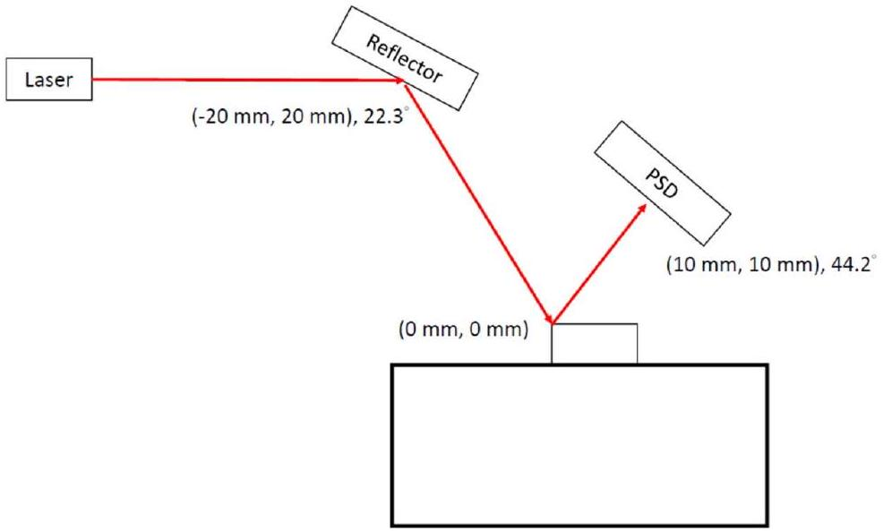
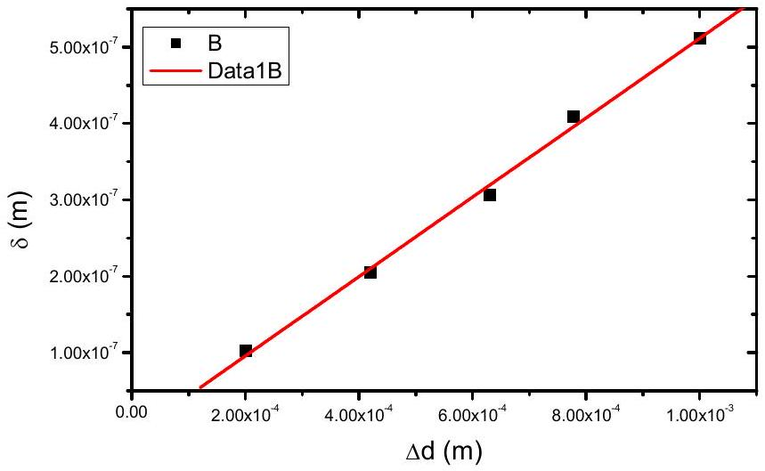
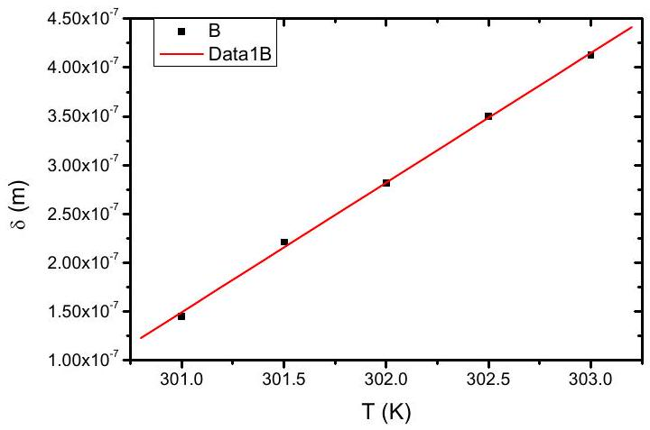

## Experiment

## Elasticity of cantilever   Part A. Alignment of light path

A1.
0.6 pt

A2.
0.8 pt

| time (s) | position $d$ (m) | time (s) | position $d$ (m) | time (s) | position $d$ (m) |
| :--- | :--- | :--- | :--- | :--- | :--- |
| 3 | $- 6.415 \times 10 ^ { - 4 }$ | 48 | $1.198 \times 10 ^ { - 4 }$ | 93 | $6.85 \times 10 ^ { - 5 }$ |
| 6 | $5.261 \times 10 ^ { - 4 }$ | 51 | $- 4.46 \times 10 ^ { - 5 }$ | 96 | $7.36 \times 10 ^ { - 5 }$ |
| 9 | $4.843 \times 10 ^ { - 4 }$ | 54 | $1.488 \times 10 ^ { - 4 }$ | 99 | $8.73 \times 10 ^ { - 5 }$ |
| 12 | $3.349 \times 10 ^ { - 4 }$ | 57 | $- 7.70 \times 10 ^ { - 5 }$ | 102 | $7.93 \times 10 ^ { - 5 }$ |
| 15 | $- 5.386 \times 10 ^ { - 4 }$ | 60 | $8.75 \times 10 ^ { - 5 }$ | 105 | $6.39 \times 10 ^ { - 5 }$ |
| 18 | $7.91 \times 10 ^ { - 5 }$ | 63 | $1.604 \times 10 ^ { - 4 }$ | 108 | $3.22 \times 10 ^ { - 5 }$ |
| 21 | $- 2.762 \times 10 ^ { - 4 }$ | 66 | $- 1.93 \times 10 ^ { - 5 }$ | 111 | $6.05 \times 10 ^ { - 5 }$ |
| 24 | $1.398 \times 10 ^ { - 4 }$ | 69 | $1.159 \times 10 ^ { - 4 }$ | 114 | $3.20 \times 10 ^ { - 5 }$ |
| 27 | $- 2.039 \times 10 ^ { - 4 }$ | 72 | $7.10 \times 10 ^ { - 5 }$ | 117 | $4.71 \times 10 ^ { - 5 }$ |

## Experiment

中文 (Official)

| 30 | $- 4.42 \times 10 ^ { - 5 }$ | 75 | $3.6 \times 10 ^ { - 6 }$ | 120 | $8.26 \times 10 ^ { - 5 }$ |
| :--- | :--- | :--- | :--- | :--- | :--- |
| 33 | $- 1.988 \times 10 ^ { - 4 }$ | 78 | $- 1.79 \times 10 ^ { - 5 }$ |  |  |
| 36 | $- 2.77 \times 10 ^ { - 5 }$ | 81 | $9.21 \times 10 ^ { - 5 }$ |  |  |
| 39 | $1.195 \times 10 ^ { - 4 }$ | 84 | $6.00 \times 10 ^ { - 5 }$ |  |  |
| 42 | $1.960 \times 10 ^ { - 4 }$ | 87 | $1.361 \times 10 ^ { - 4 }$ |  |  |
| 45 | $2.192 \times 10 ^ { - 4 }$ | 90 | $5.72 \times 10 ^ { - 5 }$ |  |  |

A3.
1.0 pt

| $d ( \mathrm {~m} )$ | $\bar { d } ( \mathrm {~m} )$ | $d - \bar { d } ( \mathrm {~m} )$ | standard deviation |
| :--- | :--- | :--- | :--- |
| $6.85 \times 10 ^ { - 5 }$ | $6.267 \times 10 ^ { - 5 }$ | $5.5 \times 10 ^ { - 6 }$ | $1.88 \times 10 ^ { - 5 }$ |
| $7.36 \times 10 ^ { - 5 }$ |  | $1.09 \times 10 ^ { - 5 }$ |  |
| $8.73 \times 10 ^ { - 5 }$ |  | $2.46 \times 10 ^ { - 5 }$ |  |
| $7.93 \times 10 ^ { - 5 }$ |  | $1.66 \times 10 ^ { - 5 }$ |  |
| $6.39 \times 10 ^ { - 5 }$ |  | $1.2 \times 10 ^ { - 6 }$ |  |
| $3.22 \times 10 ^ { - 5 }$ |  | $- 3.05 \times 10 ^ { - 5 }$ |  |
| $6.05 \times 10 ^ { - 5 }$ |  | $- 2.2 \times 10 ^ { - 6 }$ |  |
| $3.20 \times 10 ^ { - 5 }$ |  | $- 3.07 \times 10 ^ { - 5 }$ |  |
| $4.71 \times 10 ^ { - 5 }$ |  | $- 1.56 \times 10 ^ { - 5 }$ |  |
| $8.26 \times 10 ^ { - 5 }$ |  | $1.99 \times 10 ^ { - 5 }$ |  |

reference value of measurement (with standard deviation) :

$$
6.267 \times 10 ^ { - 5 } \pm 1.88 \times 10 ^ { - 5 } \mathrm {~m}
$$

## Experiment

## Part B. Deformation of cantilever beam and deduction of Young's modulus

| B1. answer sheet. |  |  |
| :--- | :--- | :--- |
| $F ( \mathrm {~N} )$ | $d ( \mathrm {~m} )$ | $\bar { d } = d _ { 0 }$ (m) |
| 0 | $- 1.82 \times 10 ^ { - 5 }$ | $- 1.386 \times 10 ^ { - 5 }$ |
|  | $- 1.09 \times 10 ^ { - 5 }$ |  |
|  | $- 6.69 \times 10 ^ { - 5 }$ |  |
|  | $1.72 \times 10 ^ { - 5 }$ |  |
|  | $9.5 \times 10 ^ { - 6 }$ |  |

| $F ( \mathrm {~N} )$ | $d - d _ { 0 } = \Delta d ( \mathrm {~m} )$ | $\overline { \Delta d }$ (m) |
| :--- | :--- | :--- |
| $2.00 \times 10 ^ { - 9 }$ | $1.9136 \times 10 ^ { - 4 }$ | $2.0046 \times 10 ^ { - 4 }$ |
|  | $2.0016 \times 10 ^ { - 4 }$ |  |
|  | $1.9766 \times 10 ^ { - 4 }$ |  |
|  | $2.0096 \times 10 ^ { - 4 }$ |  |
|  | $2.1216 \times 10 ^ { - 4 }$ |  |
| $4.00 \times 10 ^ { - 9 }$ | $4.2336 \times 10 ^ { - 4 }$ | $4.2018 \times 10 ^ { - 4 }$ |
|  | $4.1536 \times 10 ^ { - 4 }$ |  |
|  | $4.3526 \times 10 ^ { - 4 }$ |  |
|  | $4.0346 \times 10 ^ { - 4 }$ |  |
|  | $4.2346 \times 10 ^ { - 4 }$ |  |
| $6.00 \times 10 ^ { - 9 }$ | $6.4136 \times 10 ^ { - 4 }$ | $6.3112 \times 10 ^ { - 4 }$ |
|  | $6.4646 \times 10 ^ { - 4 }$ |  |
|  | $6.4256 \times 10 ^ { - 4 }$ |  |
|  | $6.2186 \times 10 ^ { - 4 }$ |  |
|  | $6.0336 \times 10 ^ { - 4 }$ |  |
| $8.00 \times 10 ^ { - 9 }$ | $7.1906 \times 10 ^ { - 4 }$ | $7.7770 \times 10 ^ { - 4 }$ |
|  | $7.8006 \times 10 ^ { - 4 }$ |  |
|  | $8.0506 \times 10 ^ { - 4 }$ |  |
|  | $7.7736 \times 10 ^ { - 4 }$ |  |
|  | $8.0696 \times 10 ^ { - 4 }$ |  |

## Experiment

| $1.000 \times 10 ^ { - 8 }$ | $1.01216 \times 10 ^ { - 3 }$ | $1.00106 \times 10 ^ { - 3 }$ |
| :--- | :--- | :--- |
|  | $1.00076 \times 10 ^ { - 3 }$ |  |
|  | $1.00336 \times 10 ^ { - 3 }$ |  |
|  | $9.7846 \times 10 ^ { - 4 }$ |  |
|  | $1.01076 \times 10 ^ { - 3 }$ |  |

| B2. |  |  |  |
| :--- | :--- | :--- | :--- |
|  | $F ( \mathrm {~N} )$ | $\delta ( \mathrm { m } )$ | $\overline { \Delta d } ( \mathrm {~m} )$ |
|  | $2.00 \times 10 ^ { - 9 }$ | $1.022 \times 10 ^ { - 7 }$ | $2.0046 \times 10 ^ { - 4 }$ |
|  | $4.00 \times 10 ^ { - 9 }$ | $2.044 \times 10 ^ { - 7 }$ | $4.2018 \times 10 ^ { - 4 }$ |
|  | $6.00 \times 10 ^ { - 9 }$ | $3.066 \times 10 ^ { - 7 }$ | $6.3112 \times 10 ^ { - 4 }$ |
|  | $8.00 \times 10 ^ { - 9 }$ | $4.088 \times 10 ^ { - 7 }$ | $7.7770 \times 10 ^ { - 4 }$ |
|  | $1.000 \times 10 ^ { - 8 }$ | $5.109 \times 10 ^ { - 7 }$ | $1.00106 \times 10 ^ { - 3 }$ |

B3. 0.4 pt

$$
\mathrm { C } _ { 1 } = 5.196 \times 10 ^ { - 4 }
$$

## Experiment

中文 (Official)

Part C. Double layer cantilever beam
| C1. |  |  |
| :--- | :--- | :--- |
| $T ( \mathrm {~K} )$ | $d ( \mathrm {~m} )$ | $\bar { d } = d _ { 0 } ( \mathrm {~m} )$ |
| 300 | $- 2.28 \times 10 ^ { - 5 }$ | $- 2.836 \times 10 ^ { - 5 }$ |
|  | $- 7.24 \times 10 ^ { - 5 }$ |  |
|  | $- 1.61 \times 10 ^ { - 5 }$ |  |
|  | $- 2.84 \times 10 ^ { - 5 }$ |  |
|  | $- 2.1 \times 10 ^ { - 6 }$ |  |
| $T ( \mathrm {~K} )$ | $d - d _ { 0 } = \Delta d ( \mathrm {~m} )$ | $\overline { \Delta d } ( \mathrm {~m} )$ |
| 301 | $2.8506 \times 10 ^ { - 4 }$ | $2.7928 \times 10 ^ { - 4 }$ |
|  | $2.7186 \times 10 ^ { - 4 }$ |  |
|  | $2.7466 \times 10 ^ { - 4 }$ |  |
|  | $2.7436 \times 10 ^ { - 4 }$ |  |
|  | $2.9046 \times 10 ^ { - 4 }$ |  |
| 301.5 | $4.1276 \times 10 ^ { - 4 }$ | $4.2568 \times 10 ^ { - 4 }$ |
|  | $4.1336 \times 10 ^ { - 4 }$ |  |
|  | $4.6276 \times 10 ^ { - 4 }$ |  |
|  | $4.3956 \times 10 ^ { - 4 }$ |  |
|  | $3.9996 \times 10 ^ { - 4 }$ |  |
| 302 | $5.4146 \times 10 ^ { - 4 }$ | $5.4186 \times 10 ^ { - 4 }$ |
|  | $5.4676 \times 10 ^ { - 4 }$ |  |
|  | $5.3386 \times 10 ^ { - 4 }$ |  |
|  | $5.6706 \times 10 ^ { - 4 }$ |  |
|  | $5.2016 \times 10 ^ { - 4 }$ |  |
| 302.5 | $6.9866 \times 10 ^ { - 4 }$ | $6.7330 \times 10 ^ { - 4 }$ |
|  | $6.6726 \times 10 ^ { - 4 }$ |  |
|  | $6.6416 \times 10 ^ { - 4 }$ |  |
|  | $6.8296 \times 10 ^ { - 4 }$ |  |
|  | $6.5346 \times 10 ^ { - 4 }$ |  |
| 303 | $7.6026 \times 10 ^ { - 4 }$ | $7.9410 \times 10 ^ { - 4 }$ |

## Experiment

|  | $7.7046 \times 10 ^ { - 4 }$ |  |
| :--- | :--- | :--- |
|  | $7.9706 \times 10 ^ { - 4 }$ |  |
|  | $8.1346 \times 10 ^ { - 4 }$ |  |
|  | $8.2926 \times 10 ^ { - 4 }$ |  |

C2. 1.0 pt

| $T ( \mathrm {~K} )$ | $\overline { \Delta d } ( \mathrm {~m} )$ | $\delta ( \mathrm { m } )$ |
| :--- | :--- | :--- |
| 301 | $2.7928 \times 10 ^ { - 4 }$ | $1.451 \times 10 ^ { - 7 }$ |
| 301.5 | $4.2568 \times 10 ^ { - 4 }$ | $2.212 \times 10 ^ { - 7 }$ |
| 302 | $5.4186 \times 10 ^ { - 4 }$ | $2.816 \times 10 ^ { - 7 }$ |
| 302.5 | $6.7330 \times 10 ^ { - 4 }$ | $3.499 \times 10 ^ { - 7 }$ |
| 303 | $7.9410 \times 10 ^ { - 4 }$ | $4.127 \times 10 ^ { - 7 }$ |

Slope: $\_\_\_\_$ $1.337 \times 10 ^ { - 7 }$

C3. 0.6 pt

$$
4.98 \times 10 ^ { 10 } \mathrm {~N} / \mathrm { m } ^ { 2 } ( \mathrm {~Pa} )
$$

## Experiment

## Part D. Test of molecular-absorption-induced bending of a cantilever beam

| D1. |  |  | 0.6 pt |
| :--- | :--- | :--- | :--- |
| Sample 0 | $d ( \mathrm {~m} )$   $3.4 \times 10 ^ { - 6 }$   $- 1.15 \times 10 ^ { - 5 }$   $- 1.61 \times 10 ^ { - 5 }$   $2.09 \times 10 ^ { - 5 }$   $- 3.25 \times 10 ^ { - 5 }$ | $\bar { d } = d _ { 0 } ( \mathrm {~m} )$ |  |
| Sample 1 | $d - d _ { 0 } = \Delta d ( \mathrm {~m} )$ $\overline { \Delta d } ( \mathrm {~m} )$   $- 8.2414 \times 10 ^ { - 4 }$ $- 8.2552 \times 10 ^ { - 4 }$   $- 8.2884 \times 10 ^ { - 4 }$    $- 8.2794 \times 10 ^ { - 4 }$    $- 8.1934 \times 10 ^ { - 4 }$    $- 8.2584 \times 10 ^ { - 4 }$  |  |  |
| D2. Assume the function form of the displacement and coverage ratio (CR)   0.6 pt can be expressed as : $\delta = C _ { 2 } \frac { \text { CoverageRatio } } { E I ^ { * } } L ^ { 4 }$. Estimate $C _ { 2 }$ based on your data obtained in A9. You can use the correlation between $\delta$ and $\overline { \Delta d }$ in A6. $- 7.89 \times 10 ^ { - 2 }$ |  |  |  |

## Experiment

D3. 0.8 pt

| Sample 2 | $d - d _ { 0 } = \Delta d ( \mathrm {~m} )$ | $\overline { \Delta d } ( \mathrm {~m} )$ |
| :--- | :--- | :--- |
|  | $- 6.1734 \times 10 ^ { - 4 }$ | $- 6.0866 \times 10 ^ { - 4 }$ |
|  | $- 6.0434 \times 10 ^ { - 4 }$ |  |
|  | $- 6.0054 \times 10 ^ { - 4 }$ |  |
|  | $- 5.9884 \times 10 ^ { - 4 }$ |  |
|  | $- 6.2224 \times 10 ^ { - 4 }$ |  |
| Sample 3 | $d - d _ { 0 } = \Delta d ( \mathrm {~m} )$ | $\overline { \Delta d }$ (m) |
|  | $- 2.4924 \times 10 ^ { - 4 }$ | $- 2.4588 \times 10 ^ { - 4 }$ |
|  | $- 2.6224 \times 10 ^ { - 4 }$ |  |
|  | $- 2.4764 \times 10 ^ { - 4 }$ |  |
|  | $- 2.4854 \times 10 ^ { - 4 }$ |  |
|  | $- 2.2174 \times 10 ^ { - 4 }$ |  |

D4. 0.6 pt

Sample 2: $\_\_\_\_$ 0.738\%

Sample 3: $\_\_\_\_$ 0.298\%
