## Experiment

## Solution

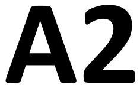

English

Q2 Exploring the spatial structure of the sample with optical methods
Solution

Part A. Collimation of light and sample

A. 1 0.5 pt
$$
\left( \mathrm { X } _ { \text {sample } } , \mathrm { Y } _ { \text {sample } } \right) = ( \mathbf { 3 7 0 0 } , - \mathbf { 2 9 0 0 } )
$$
A. 2 0.5 pt
Interference pattern:

Part B. Exploration of sample structure size
B. 1
$$
d = \frac { m \times \lambda } { \sin \left( \tan ^ { - 1 } \left( \frac { S } { L } \right) \right) }
$$
0.5 pt

## Experiment   Solution

B. 2
$\_\_\_\_$
$L =$ $\_\_\_\_$
60 cm
$\lambda =$ $\_\_\_\_$ 488 nm

| Data | 1 | 2 | 3 | 4 | 5 |
| :--- | :--- | :--- | :--- | :--- | :--- |
| (x, y) | (-4.04, 4.68) | (3.00, 5.50) | (4.08, -4.60) | (5.76, 0.48) | (-5.68, 0.56) |
| $S ( \mathrm {~cm} )$ | 6.18 | 6.26 | 6.15 | 5.78 | 5.71 |
| $\bar { S } ( \mathrm {~cm} )$ | $6.02 \pm 0.11$ |  |  |  |  |
| $\tan ^ { - 1 } \left( \frac { \bar { S } } { L } \right)$ | 0.0999 ± 0.0019 |  |  |  |  |

$\lambda =$ $\_\_\_\_$ 514 nm

| Data | 1 | 2 | 3 | 4 | 5 |
| :--- | :--- | :--- | :--- | :--- | :--- |
| $( x , y )$ | (3.32,5.64) | (6.16,0.48) | (4.46,-4.90) | (-3.12,-5.64) | (-6,-0.64) |
| $S ( \mathrm {~cm} )$ | 6.54 | 6.18 | 6.63 | 6.45 | 6.03 |
| $\bar { S } ( \mathrm {~cm} )$ | 6.37 ± 0.11 |  |  |  |  |
| $\tan ^ { - 1 } \left( \frac { \bar { S } } { L } \right)$ | $\mathbf { 0 . 1 0 5 7 } \boldsymbol { \pm } \mathbf { 0 . 0 0 1 9 }$ |  |  |  |  |

$\lambda =$ $\_\_\_\_$ 632.8 nm

| Data | 1 | 2 | 3 | 4 | 5 |
| :--- | :--- | :--- | :--- | :--- | :--- |
| $( x , y )$ | (4.04,7.00) | (7.44,0.68) | (5.24,-5.96) | (-3.96,-7.04) | (-7.44,-0.68) |
| $S ( \mathrm {~cm} )$ | 8.08 | 7.47 | 7.94 | 8.08 | 7.47 |
| $\bar { S } ( \mathrm {~cm} )$ | $7.81 \pm 0.14$ |  |  |  |  |
| $\tan ^ { - 1 } \left( \frac { \bar { S } } { L } \right)$ | $\mathbf { 0 . 1 2 9 4 } \boldsymbol { \pm } \mathbf { 0 . 0 0 2 3 }$ |  |  |  |  |

$\lambda =$ $\_\_\_\_$ 694.3 nm

| Data | 1 | 2 | 3 | 4 | 5 |
| :--- | :--- | :--- | :--- | :--- | :--- |
| $( x , y )$ | (-5.84,6.50) | (8.20,0.76) | (-4.28,-7.72) | (5.96,-6.60) | (4.48,7.72) |
| $S ( \mathrm {~cm} )$ | 8.74 | 8.24 | 8.83 | 8.89 | 8.93 |

## Experiment

## Solution

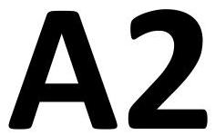

English

| $\bar { S } ( \mathrm {~cm} )$ | 8.73 ± 0.13 |  |
| :--- | :--- | :--- |
| $\tan ^ { - 1 } \left( \frac { \bar { S } } { L } \right)$ | $\mathbf { 0 . 1 4 4 4 }$ ± 0.0021 |  |

| B. 3 |  |  |  | 1.0 pt |
| :--- | :--- | :--- | :--- | :--- |
|  |  |  |
|  | $\lambda ( \mathrm { nm } )$ |  |  | $d ( \mu \mathrm {~m} )$ | $\boldsymbol { a } \boldsymbol { ( } \boldsymbol { \mu } \mathbf { m } \boldsymbol { ) }$ |  |
|  | 488 | 4.89 | 5.65 |  |
|  | 514 | 4.87 | 5.63 |  |
|  | 632.8 | 4.90 | 5.66 |  |
|  | $\bar { a } ( \boldsymbol { \mu } \mathbf { m } )$ | $5.627 \pm 0.020$ |  |  |

## Experiment

## Solution

Part C. Exploration of sample structure size
| C. 1 $\lambda = 488 \mathrm {~nm}$ |  |  |  |  |
| :--- | :--- | :--- | :--- | :--- |
| L=90 cm, Axis1 |  |  |  |  |
| Order, fringe | 4, Bright | 5, Bright | 6, Bright | 7, Bright |
| $( x , y )$ | (3.01, 1.46) | (3.67, 1.91) | (4.30, 2.24) | (5.00, 2.50) |
| $S ( \mathrm {~cm} )$ | 3.35 | 4.14 | 4.85 | 5.59 |
| $\tan ^ { - 1 } \left( \frac { S } { L } \right)$ | 0.0372 | 0.0459 | 0.0538 | 0.0620 |

| $\mathrm { L } = 90 \mathrm {~cm}$, Axis 2 |  |  |  |  |
| :--- | :--- | :--- | :--- | :--- |
| Order, fringe | 4, Bright | 5, Bright | 6, Bright | 7, Bright |
| $( x , y )$ | (-1.64, 3.46) | (-2.07, 4.19) | (-2.41, 4.95) | (-2.87, 5.73) |
| $S ( \mathrm {~cm} )$ | 3.83 | 4.67 | 5.51 | 6.41 |
| $\tan ^ { - 1 } \left( \frac { S } { L } \right)$ | 0.0425 | 0.0519 | 0.0611 | 0.0711 |

$$
\lambda = 514 \mathrm {~nm}
$$

| $\mathrm { L } = 90 \mathrm {~cm}$, Axis1 |  |  |  |  |
| :--- | :--- | :--- | :--- | :--- |
| Order, fringe | 4, Bright | 5, Bright | 6, Bright | 7, Bright |
| $( x , y )$ | (3.08, 1.56) | (3.76, 1.92) | (4.44, 2.28) | (5.20, 2.60) |
| $S ( \mathrm {~cm} )$ | 3.45 | 4.22 | 4.99 | 5.81 |
| $\tan ^ { - 1 } \left( \frac { S } { L } \right)$ | 0.0383 | 0.0469 | 0.0554 | 0.0645 |

## Experiment   Solution

| $\mathrm { L } = 90 \mathrm {~cm}$, Axis 2 |  |  |  |  |
| :--- | :--- | :--- | :--- | :--- |
| Order, fringe | 4, Bright | 5, Bright | 6, Bright | 7, Bright |
| $( x , y )$ | (-1.76, 3.68) | (-2.26, 4.38) | (-2.58, 5.34) | (-3.22, 6.04) |
| $S ( \mathrm {~cm} )$ | 4.09 | 4.92 | 5.93 | 6.84 |
| $\tan ^ { - 1 } \left( \frac { S } { L } \right)$ | 0.0454 | 0.0547 | 0.0658 | 0.0759 |

$$
\lambda = 632.8 \mathrm {~nm}
$$

$$
\mathrm { L } = 90 \mathrm {~cm} \text {, Axis } 1
$$

| Order, fringe | 4, Bright | 5, Bright | 6, Bright | 7, Bright |
| :--- | :--- | :--- | :--- | :--- |
| $( x , y )$ | (3.84, 1.96) | (4.68, 2.44) | (5.48, 2.88) | (6.44, 3.32) |
| $S ( \mathrm {~cm} )$ | 4.31 | 5.28 | 6.19 | 7.25 |
| $\tan ^ { - 1 } \left( \frac { S } { L } \right)$ | 0.0479 | 0.0586 | 0.0687 | 0.0803 |

| $\mathrm { L } = 90 \mathrm {~cm}$, Axis 2 |  |  |  |  |
| :--- | :--- | :--- | :--- | :--- |
| Order, fringe | 4, Bright | 5, Bright | 6, Bright | 7, Bright |
| $( x , y )$ | (-2.28, 4.56) | (-2.84, 5.48) | (-3.36, 6.52) | (-3.84, 7.52) |
| $S ( \mathrm {~cm} )$ | 5.10 | 6.17 | 7.33 | 8.44 |
| $\tan ^ { - 1 } \left( \frac { S } { L } \right)$ | 0.0566 | 0.0685 | 0.0813 | 0.0935 |

## Experiment

## Solution

$\lambda =$ $\_\_\_\_$
L=90 cm, Axis 1

| Order, fringe | 4, Bright | 5, Bright | 6, Bright | 7, Bright |
| :--- | :--- | :--- | :--- | :--- |
| $( x , y )$ | (4.24, 2.12) | (5.08, 2.80) | (6.04, 3.20) | (7.04, 3.68) |
| $S ( \mathrm {~cm} )$ | 4.74 | 5.80 | 6.84 | 7.96 |
| $\tan ^ { - 1 } \left( \frac { S } { L } \right)$ | 0.0526 | 0.0644 | 0.0758 | 0.0882 |

| $\mathrm { L } = 90 \mathrm {~cm}$, Axis 2 |  |  |  |  |
| :--- | :--- | :--- | :--- | :--- |
| Order, fringe | 4, Bright | 5, Bright | 6, Bright | 7, Bright |
| $( x , y )$ | (-2.48, 5.00) | (-3.08, 6.04) | (-3.60, 7.16) | (-4.16, 8.28) |
| $S ( \mathrm {~cm} )$ | 5.58 | 6.78 | 8.01 | 9.27 |
| $\tan ^ { - 1 } \left( \frac { S } { L } \right)$ | 0.0619 | 0.0752 | 0.0888 | 0.103 |

## Experiment

## Solution

| C. 2 |  |  |  |  |  |
| :--- | :--- | :--- | :--- | :--- | :--- |
|  | $\lambda ( \mathrm { nm } )$ | $\boldsymbol { \Delta } \mathbf { S } _ { \boldsymbol { \ell } }$ (cm) | $\boldsymbol { \ell } ( \mu \mathbf { m } )$ | $\boldsymbol { \Delta } \mathbf { S } _ { \boldsymbol { w } }$ (cm) | $\boldsymbol { w } \boldsymbol { ( } \boldsymbol { \mu } \mathbf { m } \boldsymbol { ) }$ |
|  | 488 | 0.748 | 58.7 | 0.860 | 51.1 |
|  |  | 0.750 | 58.5 | 0.842 | 52.1 |
|  | 514 | 0.787 | 58.8 | 0.920 | 50.3 |
|  |  | 0.794 | 58.3 | 0.891 | 51.9 |
|  | 632.8 | 0.978 | 58.2 | 1.12 | 51.1 |
|  |  | 0.960 | 59.3 | 1.11 | 51.4 |
|  | 694.3 | 1.07 | 58.2 | 1.23 | 50.9 |
|  |  | 1.07 | 58.2 | 1.22 | 51.4 |
|  | $\begin{aligned} & \boldsymbol { \ell } = 58.59 \mu \mathrm {~m} \\ & w = 50.78 \mu \mathrm {~m} \end{aligned}$ |  |  |  |  |

## Experiment

## Solution

English

| C. $3 \phi = 27 ^ { \circ }$ | 1.0 pt |
| :--- | :--- |
| $\lambda =$ 488 nm $\_\_\_\_$ Axis 1 (long) $\phi =$ $\_\_\_\_$ |  |
| 2.8 |  |
| $\lambda =$ 514 nm $\_\_\_\_$ Axis 1 (long) $\_\_\_\_$ $\phi =$ 26.2° $\_\_\_\_$ |  |
| 2.7 |  |

## Experiment   Solution

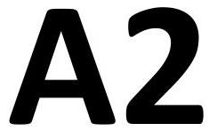

English
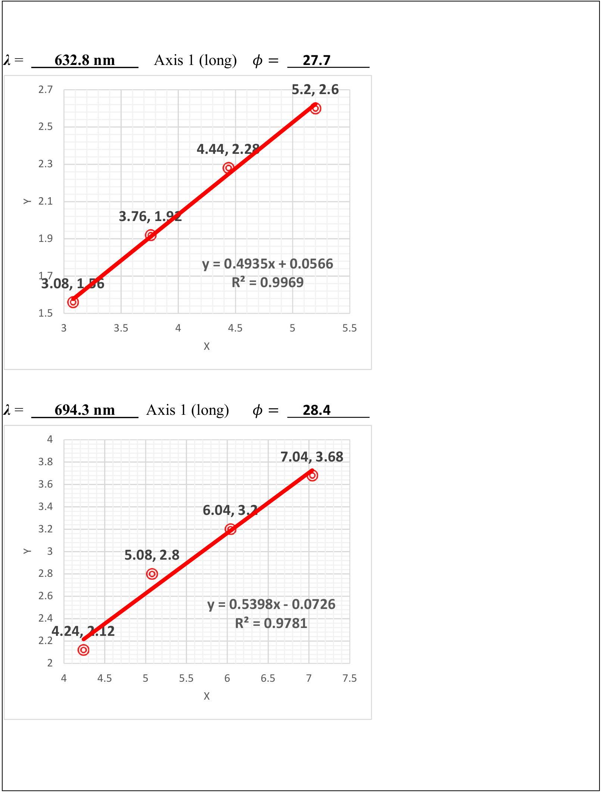

## Experiment

## Solution

Part D. Exploration of sample structure size
| D. 1 | 1.9 pt |
| :--- | :--- |
| Laser wavelength $\lambda =$ 914 nm |  |
| The center coordinates of the fine diffraction bright spot $( x , y )$ long |  |
| (1.98, 0.40) |  |
| (1.96, 0.82) |  |
| (1.98, 1.24) |  |
| (1.98, 1.66) |  |
| The center coordinates of the fine diffraction bright spot $( x , y )$ short |  |
| (-2.06, 3.48) |  |
| (-2.08, 3.08) |  |
| (-2.08, 2.64) |  |
| (-2.06, 2.16) |  |
| Calculate the distances between adjacent spots $\Delta S _ { x } , \Delta S _ { y }$ |  |
|  $\boldsymbol { \Delta } \boldsymbol { S } _ { \boldsymbol { x } } \boldsymbol { ( } \mathbf { c m } \boldsymbol { ) }$ $\boldsymbol { \Delta } \boldsymbol { S } _ { \boldsymbol { y } } \boldsymbol { ( } \mathbf { c m } \boldsymbol { ) }$   long 0.346 0.410   short 0.348 0.428 |  |
|  |  |

## Experiment

## Solution

## A2

D.1.
long
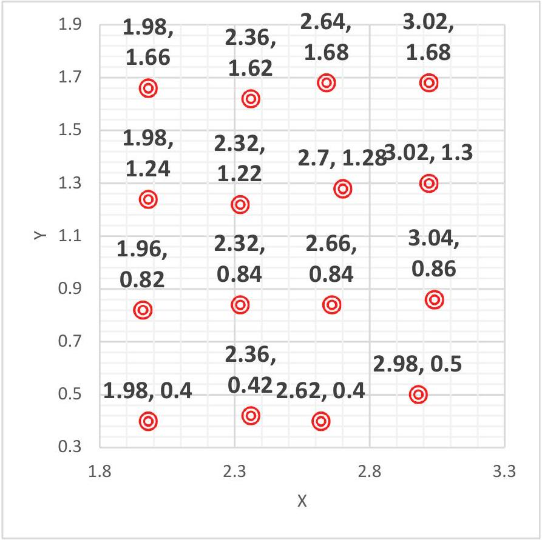
short

| $>$ | -2.06, | -1.72, | -1.38, | -1.06, 3.6 |
| :--- | :--- | :--- | :--- | :--- |
|  | 3,6 | 3,48 | 3.46 | 3.46 |
|  | -2.08, | -1.74, | -1.4, | 3.4 |
|  | 3.08 | 3.08 | 3.14 | -1, 3.13.2 |
|  | ○ | ○ | ○ | ○ |
|  |  |  |  | 3 |
|  | -2.08, | -1.74, | -1.38, | $- \mathbf { 1 . 0 2 } _ { 2.8 }$ |
|  | 2.64 | 2.65 | 2.62 | 2.62 |
|  | ○ | ○ | ○ | (D) 2.6 |
|  |  | -1.68, | -1.36, |  |
|  | -2.06, | 2.22 | 2.22 | -1.02, ${ } ^ { 2.4 }$ |
|  | 2.16 | ○ | ○ | $\mathbf { 2 . 1 4 } _ { \mathbf { 2 . 2 } }$ |
|  | ○ |  |  | ○ |
|  |  |  |  | 2 |
|  |  | -1.8 | -1.3 | -0.8 |
|  |  | x |  |  |

## Experiment   Solution

| Laser wavelength $\lambda =$ $\_\_\_\_$ |  |  |  |
| :--- | :--- | :--- | :--- |
| The center coordinates of the fine diffraction bright spot $( x , y )$ long |  |  |  |
| (2.16, 0.56) | (2.60, 0.56) | (3.04, 0.56) | (3.48, 0.56) |
| (2.12, 1.16) | (2.58, 1.16) | (3.06, 1.14) | (3.48, 1.12) |
| (2.12, 1.64) | (2.60, 1.66) | (3.04, 1.68) | (3.48, 1.66) |
| (2.14, 2.26) | (2.62, 2.22) | (3.08, 2.18) | (3.48, 2.24) |
| The center coordinates of the fine diffraction bright spot $( x , y )$ short |  |  |  |
| (-3.44, 4.44) | (-2.68, 4.42) | (-2.20, 4.42) | (-1.78, 4.42) |
| (-3.10, 3.86) | (-2.70, 3.88) | (-2.24, 3.84) | (-1.82, 3.88) |
| (-3.20, 3.38) | (-2.74, 3.38) | (-2.22, 3.34) | (-1.76, 3.34) |
| (-3.14, 2.78) | (-2.68, 2.78) | (-2.22, 2.78) | (-1.76, 2.76) |
|  |  |  |  |
|  |  |  |  |
|  | $\boldsymbol { \Delta } \boldsymbol { S } _ { \boldsymbol { x } } \boldsymbol { ( } \mathbf { c m } \boldsymbol { ) }$ |  | $\boldsymbol { \Delta } \boldsymbol { S } _ { \boldsymbol { y } } \boldsymbol { ( } \mathbf { c m } \boldsymbol { ) }$ |
| long | 0.448 |  | 0.555 |
| short | 0.452 |  | 0.550 |

## Experiment   Solution

long

|  | 2.5 | 2.14, | 2.62, | 3.08, | 3.48, |
| :--- | :--- | :--- | :--- | :--- | :--- |
|  |  | 2.26 | 2.22 | 2.18 | 2.24 |
|  |  | ○ | ○ | ○ | ○ |
|  | 2.1 |  |  |  |  |
|  | 1.9 | 2.12, | 2.6, 1.66 | 3.04, | 3.48, |
|  | 1.7 | ○ | ○ | 0 | ○ |
| $>$ | 1.5 | 2.12, | 2.58, | 3.06, | 3.48, |
|  | 1.3 | 1.16 | 1.16 | 1.14 | 1.14 |
|  | 1.1 | ○ | ○ | ○ | ○ |
|  | 0.9 | 2.16, |  | 3.04, | 3.48, |
|  | 0.7 | 0.56 | 2.6, 0.56 | 0.56 | 0.56 |
|  | 0.5 | ○ | ○ | ○ | ○ |
|  |  | 2 | 2.5 | 3 | 3.5 |
|  |  |  | x |  |  |

short

| -3.1,   4.44   ○   -3.1,   3.86      -3.2,   3.38      -3.14,   2.78      -3.3 | 5 |  |  |  |
| :--- | :--- | :--- | :--- | :--- |
|  | -2.68, | -2.2, | -1.78, |  |
|  | 4.42 | 4.42 | 4.42 |  |
|  | ○ | ○ | ○ |  |
|  | -2.7, | -2.24, | -1.82, |  |
|  | 3.88 | 3.84 | 3.88 | 4 |
|  | ○ | ○ | ○ |  |
|  | -2.74, | -2.22, | -1.76, |  |
|  | 3.38 | 3.34 | 3.343.5 |  |
|  |  | ○ | ○ |  |
|  | -2.68, | -2.22, | -1.76, |  |
|  | 2.78 | 2.78 | 2.76 | 3 |
|  | ○ | ○ | ○ |  |
|  |  |  | 2.5 |  |
|  | -2.8 | -2.3 | -1.8 |  |
|  |  | x |  |  |

## Experiment   Solution

Laser wavelength $\boldsymbol { \lambda } =$ $\_\_\_\_$ 1444 nm

| The center coordinates of the fine diffraction bright spot $( x , y )$ long |  |  |  |
| :--- | :--- | :--- | :--- |
| （3．34，0．02） | （3．86，0．02） | （4．42，0．02） | （4．94，0．04） |
| （3．34，0．70） | （3．84，0．72） | （4．42，0．70） | （4．94，0．74） |
| （3．36，1．42） | （3．86，1．42） | （4．44，1．40） | （5．00，1．46） |
| （3．34，2．08） | （3．86，2．08） | （4．48，2．08） | （5．00，2．10） |

The center coordinates of the fine diffraction bright spot $( x , y )$ short

| （－3．86，4．16） | （－3．32，4．18） | （－2．74，4．18） | （－2．14，4．16） |
| :--- | :--- | :--- | :--- |
| （－3．84，3．48） | （－3．28，3．48） | （－2．72，3．48） | （－2．12，3．48） |
| （－3．80，2．78） | （－3．26，2．78） | （－2．72，2．78） | （－2．12，2．80） |
| （－3．78，2．02） | （－3．26，2．06） | （－2．70，2．06） | （－2．00，1．98） |

計算圖形斑點間距 $\Delta S _ { x } 、 \Delta S _ { y }$ 0．5 pt

|  | $\boldsymbol { \Delta } \boldsymbol { S } _ { \boldsymbol { x } } \boldsymbol { ( } \mathbf { c m } \boldsymbol { ) }$ | $\boldsymbol { \Delta } \boldsymbol { S } _ { \boldsymbol { y } } \boldsymbol { ( } \mathbf { c m } \boldsymbol { ) }$ |
| :--- | :--- | :--- |
| long | 0.542 | 0.687 |
| short | 0.575 | 0.713 |

## Experiment

## Solution

English
long
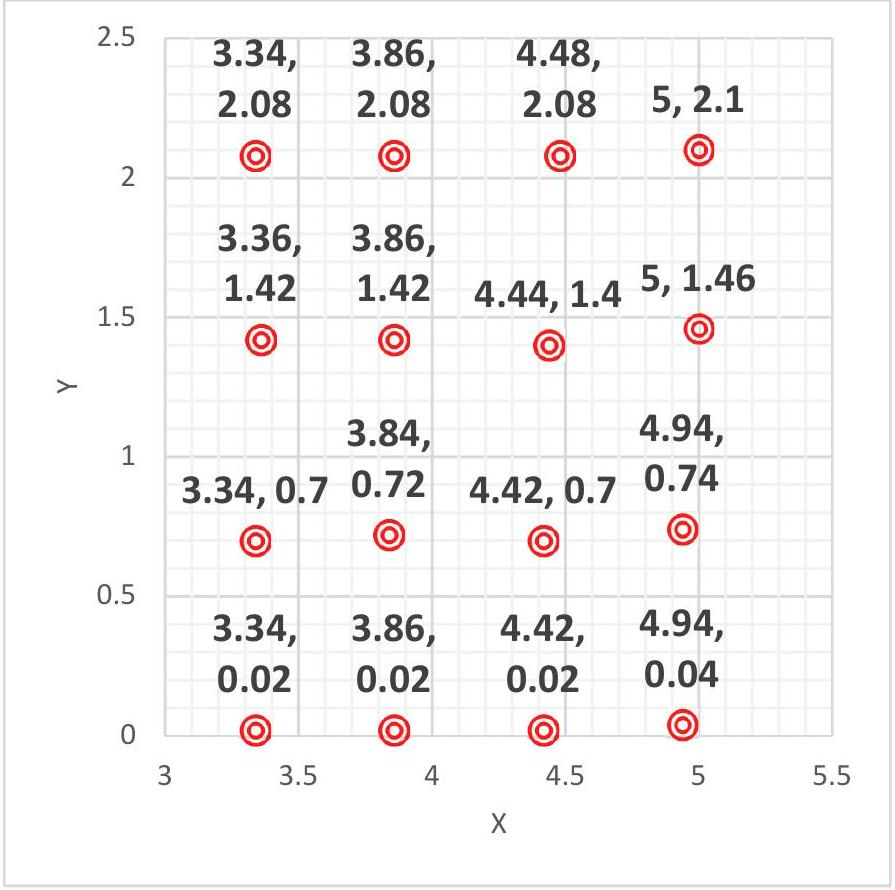
short
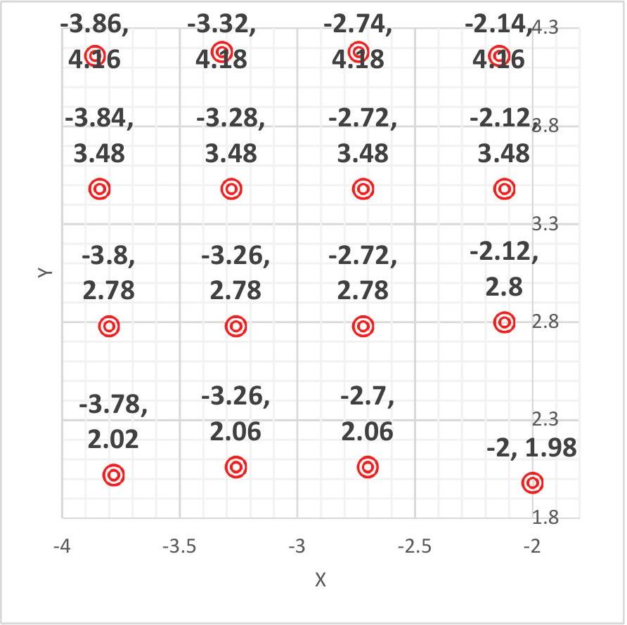

## Experiment

## Solution

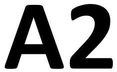

English

| D. 2 |  |  |  | 0.6 pt |
| :--- | :--- | :--- | :--- | :--- |
| $d _ { x } = 249.3 \mu \mathrm {~m} \quad d _ { y } = 198.2 \mu \mathrm {~m}$ |  |  |  |  |
| $\boldsymbol { \lambda } ( \mathbf { n m } )$ |  | $\boldsymbol { d } _ { \boldsymbol { x } } \boldsymbol { ( } \boldsymbol { \mu } \mathbf { m } \boldsymbol { ) }$ | $\boldsymbol { d } _ { \boldsymbol { y } } \boldsymbol { ( } \boldsymbol { \mu } \mathbf { m } \boldsymbol { ) }$ |  |
| 914 | long Axis | 251 | 211 |  |
|  | short Axis | 250 | 203 |  |
| 1152 | long Axis | 244 | 197 |  |
|  | short Axis | 242 | 199 |  |
| 1444 | long Axis | 253 | 199 |  |
|  | short Axis | 239 | 192 |  |

## Experiment

## Solution

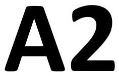

English

Part E. Exploration of sample structure size
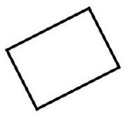
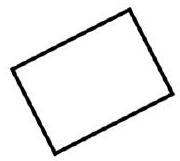
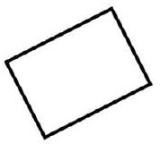
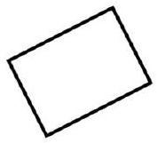
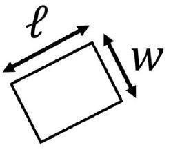
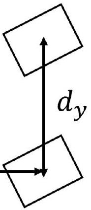
$\left( a , \ell , w , d _ { x } , d _ { y } , \phi \right) =$
(5.627 um, 58.59 um, 50.78 um, 249.3 um, 198.2 um, 27 degree)
