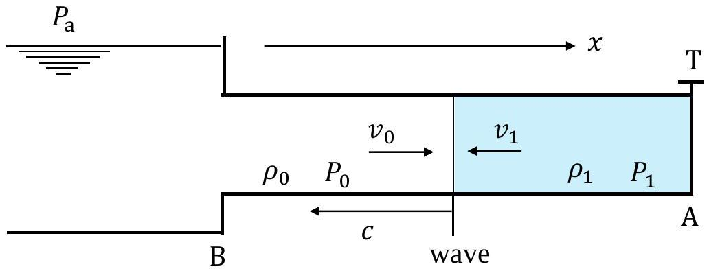
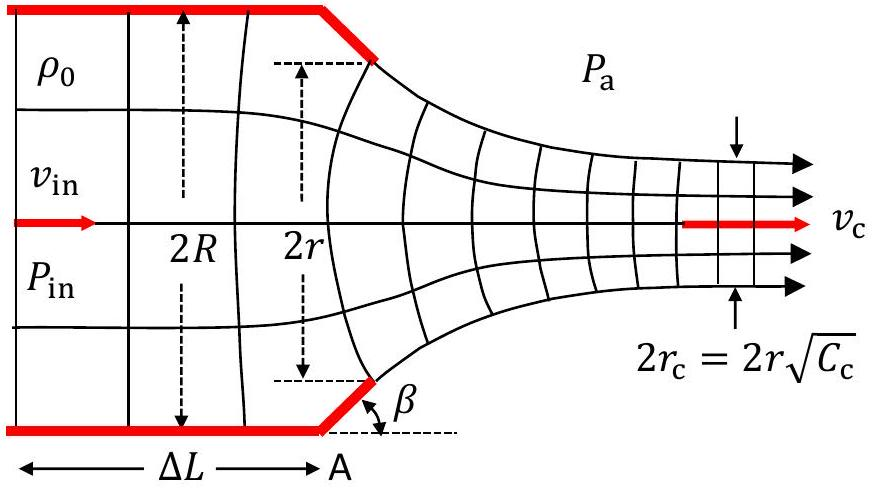
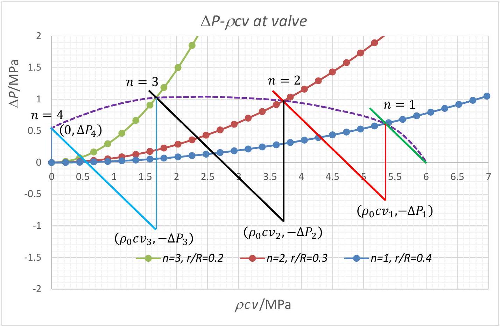
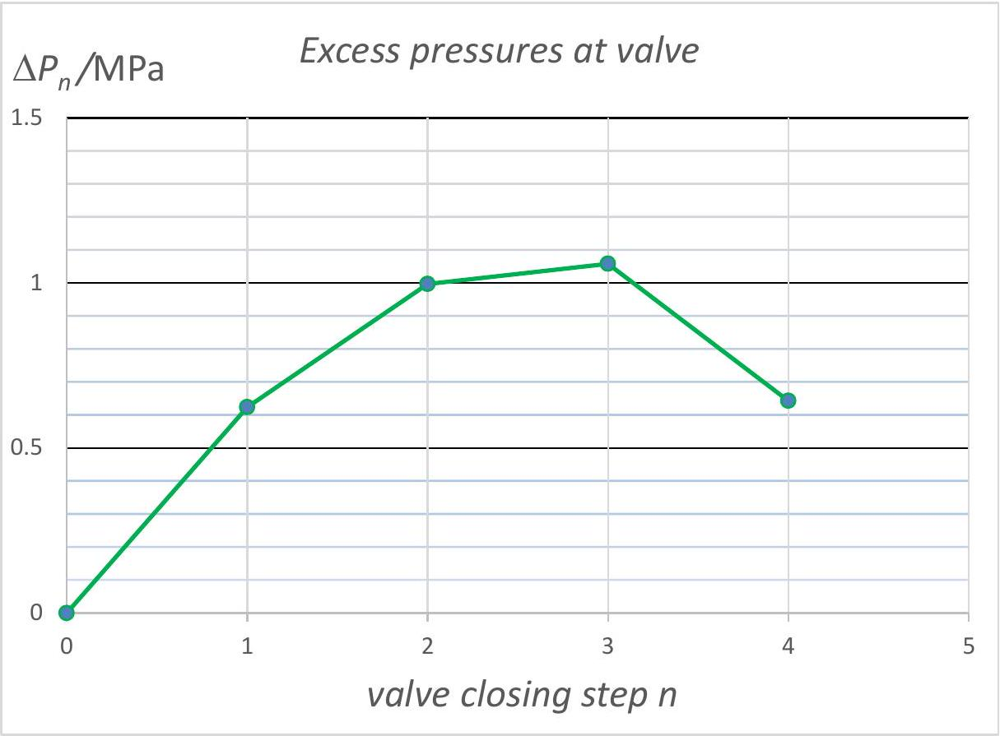

Solution
Water Hammer
Part A. Excess Pressure and Propagation of Pressure wave

Fig. S1. Pressure wave (shaded) with speed $c$

A. 1 (1.6 pt) Excess pressure and speed of propagation of the pressure wave

When the valve opening is suddenly blocked, fluid pressure at the valve jumps from $P _ { 0 }$ to $P _ { 1 } = P _ { 0 } + \Delta P _ { \mathrm { s } }$, thus sending a pressure wave traveling upstream (to the left) with speed $c$ and amplitude $\Delta P _ { \mathrm { s } }$. Taking positive $x$ direction as pointing to the right, the velocity of fluid particles next to the valve changes from $v _ { 0 }$ to $v _ { 1 }$ $\left( v _ { 1 } \leq 0 \right)$. Thus the velocity change is $\Delta v = v _ { 1 } - v _ { 0 }$.

In a frame moving to left (along $- x$ direction) with speed $c$, i.e., riding on the wave (see Fig. S1), velocity of fluid in the pressure wave is $c + v _ { 1 }$, while that of the incoming fluid in the steady flow ahead of the wave is $c + v _ { 0 }$. Let $\rho _ { 1 }$ be the density of fluid in the pressure wave. From conservation of mass, i.e., equation of continuity, we have

$$
\begin{equation*}
\rho _ { 0 } \left( c + v _ { 0 } \right) = \rho _ { 1 } \left( c + v _ { 1 } \right) \tag{a1}
\end{equation*}
$$

or, by letting $\Delta \rho \equiv \rho _ { 1 } - \rho _ { 0 }$,

$$
\begin{equation*}
\frac { \Delta \rho } { \rho _ { 1 } } = 1 - \frac { \rho _ { 0 } } { \rho _ { 1 } } = \frac { v _ { 0 } - v _ { 1 } } { c + v _ { 0 } } = \frac { - \Delta v } { c + v _ { 0 } } \tag{a2}
\end{equation*}
$$

Moreover, impulse imparted to the fluid must equal its momentum change. Thus, in a short time interval $\tau$ after the valve is closed, we must have

$$
\begin{equation*}
\rho _ { 0 } \left( c + v _ { 0 } \right) \tau \left[ \left( c + v _ { 1 } \right) - \left( c + v _ { 0 } \right) \right] = - \tau \Delta P = \left( P _ { 0 } - P _ { 1 } \right) \tau \tag{a3}
\end{equation*}
$$

or

$$
\begin{equation*}
\Delta P _ { \mathrm { s } } = - \rho _ { 0 } c \left( 1 + \frac { v _ { 0 } } { c } \right) \left( v _ { 1 } - v _ { 0 } \right) = - \rho _ { 0 } c \left( 1 + \frac { v _ { 0 } } { c } \right) \Delta v \quad \Rightarrow \quad \alpha = - \left( 1 + \frac { v _ { 0 } } { c } \right) \tag{a4}
\end{equation*}
$$

If $v _ { 0 } / c \ll 1$, we have

$$
\begin{equation*}
\Delta P _ { \mathrm { s } } = - \rho _ { 0 } c \Delta v \tag{a5}
\end{equation*}
$$

Note that the negative sign in Eqs. (a4) and (a5) follows from the fact that the direction of propagation is opposite to the positive direction for $x$ axis (and velocity). Otherwise the sign should be positive. Note also that for a compressional wave

$\left( \Delta P _ { \mathrm { s } } > 0 \right)$, the velocity imparted to the fluid particle is in the direction of propagation, while for an extensional wave $\left( \Delta P _ { \mathrm { s } } < 0 \right)$, the velocity imparted is in the opposite direction of propagation.

Eqs. (a2) and (a4) can be combined to give

$$
\begin{equation*}
\Delta P _ { \mathrm { s } } = \rho _ { 0 } c ^ { 2 } \left( 1 + \frac { v _ { 0 } } { c } \right) ^ { 2 } \frac { \Delta \rho } { \rho _ { 1 } } \tag{a6}
\end{equation*}
$$

From the definition of the bulk modulus $B$, which is assumed to be constant, it follows

$$
\begin{equation*}
\Delta P _ { \mathrm { s } } = B \frac { V _ { 0 } - V _ { 1 } } { V _ { 0 } } = B \frac { 1 / \rho _ { 0 } - 1 / \rho _ { 1 } } { 1 / \rho _ { 0 } } = B \frac { \Delta \rho } { \rho _ { 1 } } \tag{a7}
\end{equation*}
$$

From Eqs. (a6) and (a7), we obtain

$$
\begin{equation*}
\rho _ { 0 } c ^ { 2 } \left( 1 + \frac { v _ { 0 } } { c } \right) ^ { 2 } = B \tag{a8}
\end{equation*}
$$

Thus

$$
\begin{equation*}
c = \sqrt { \frac { B } { \rho _ { 0 } } } - v _ { 0 } \quad \Rightarrow \gamma = 1 \quad \beta = - v _ { 0 } \tag{a9}
\end{equation*}
$$

However, if in the definition of bulk modulus one uses the fractional change of density $\Delta \rho / \rho _ { 0 }$ instead of $- \Delta V / V _ { 0 }$, the result is then $\gamma = 1 + \Delta P _ { \mathrm { s } } / B$.* Either result is considered valid.
If $v _ { 0 } / c \ll 1$, we have

$$
\begin{equation*}
c = \sqrt { \frac { B } { \rho _ { 0 } } } \tag{a10}
\end{equation*}
$$

*The result (a7) is pointed out by Dr. Jaan Kalda.
A. 2 (0.6 pt) Values of $c$ and $\Delta P _ { \mathrm { s } }$ for water flow

Ans:
From Eqs. (a5) and (a10), we have

$$
\begin{aligned}
& c = \sqrt { B / \rho _ { 0 } } \\
& \Delta P _ { \mathrm { s } } = \rho _ { 0 } c v _ { 0 } = v _ { 0 } \sqrt { \rho _ { 0 } B }
\end{aligned}
$$

Putting in the given values $v _ { 0 } = 4.0 \mathrm {~m} / \mathrm { s } , v _ { 1 } = 0 , \rho _ { 0 } = 1.0 \times 10 ^ { 3 } \mathrm {~kg} / \mathrm { m } ^ { 3 }$, and $B = 2.2 \times 10 ^ { 9 } \mathrm {~Pa}$, we have

$$
\begin{align*}
& c = \sqrt { B / \rho _ { 0 } } = 1.5 \times 10 ^ { 3 } \mathrm {~m} / \mathrm { s }  \tag{b1}\\
& \Delta P _ { \mathrm { s } } = v _ { 0 } \sqrt { \rho _ { 0 } B } = 5.9 \mathrm { MPa } \tag{b2}
\end{align*}
$$

so that $\Delta P _ { \mathrm { s } }$ is nearly 59 times the standard pressure.
Note that $v _ { 0 } / c \sim 10 ^ { - 3 }$ so that the use of approximate formulas (a5) and (a10) is justified when solving tasks in this problem.

## Part B. A Model for the Flow-Control Valve

(B.1) (1.0 pt) Excess pressure at valve inlet

Fig. 2. Valve dimensions and contraction of jet.

Ans:
The model assumes the fluid to be incompressible. Neglecting effects of gravity, Bernoulli's principle gives us

$$
\begin{equation*}
\frac { 1 } { 2 } \rho _ { 0 } v _ { \mathrm { in } } ^ { 2 } + P _ { \mathrm { in } } = \frac { 1 } { 2 } \rho _ { 0 } v _ { \mathrm { c } } ^ { 2 } + P _ { \mathrm { a } } \tag{c1}
\end{equation*}
$$

Equation of continuity and definition of contraction coefficient imply that

$$
\pi R ^ { 2 } v _ { \mathrm { in } } = \pi r _ { \mathrm { c } } ^ { 2 } v _ { \mathrm { c } } = \pi r ^ { 2 } C _ { \mathrm { c } } v _ { \mathrm { c } }
$$

Therefore

$$
\begin{equation*}
v _ { \mathrm { c } } = \frac { 1 } { C _ { \mathrm { c } } } \left( \frac { R } { r } \right) ^ { 2 } v _ { \mathrm { in } } \tag{c2}
\end{equation*}
$$

From Eqs. (c1) and (c2), we obtain

$$
\begin{equation*}
\Delta P _ { \mathrm { in } } = P _ { \mathrm { in } } - P _ { \mathrm { a } } = \frac { 1 } { 2 } \rho _ { 0 } v _ { \mathrm { in } } ^ { 2 } \left[ \frac { 1 } { C _ { \mathrm { c } } ^ { 2 } } \left( \frac { R } { r } \right) ^ { 4 } - 1 \right] = \frac { k } { 2 } \rho _ { 0 } v _ { \mathrm { in } } ^ { 2 } \tag{c3}
\end{equation*}
$$

This may be cast into a form involving only dimensionless variables:

$$
\begin{equation*}
\frac { \Delta P _ { \mathrm { in } } } { \rho _ { 0 } c ^ { 2 } } = \frac { 1 } { 2 } \left( \frac { v _ { \mathrm { in } } } { c } \right) ^ { 2 } \left[ \frac { 1 } { C _ { \mathrm { c } } ^ { 2 } } \left( \frac { R } { r } \right) ^ { 4 } - 1 \right] = \frac { k } { 2 } \left( \frac { v _ { \mathrm { in } } } { c } \right) ^ { 2 } \tag{c4}
\end{equation*}
$$

where

$$
\begin{equation*}
k = \left[ \frac { 1 } { C _ { \mathrm { c } } ^ { 2 } } \left( \frac { R } { r } \right) ^ { 4 } - 1 \right] \tag{c5}
\end{equation*}
$$

Thus we see from eq. (c4) that $\Delta P _ { \text {in } }$ is a quadratic function of $v _ { \text {in } }$.

## Part C. Water-Hammer Effect due to Fast Closure of Flow-Control Valve

(C.1) (0.6 pt) Pressure $P _ { 0 }$ and velocity $v _ { 0 }$ when the valve is fully open Ans:

According to Bernoulli's theorem and the definition of $P _ { h }$, we have

$$
\begin{equation*}
\frac { 1 } { 2 } \rho _ { 0 } v _ { 0 } ^ { 2 } + P _ { 0 } = \frac { 1 } { 2 } \rho _ { 0 } v _ { \mathrm { c } } ^ { 2 } + P _ { \mathrm { a } } = 0 + P _ { \mathrm { a } } + \rho _ { 0 } g h = P _ { h } \tag{d1}
\end{equation*}
$$

From the second equality in the preceding equation, it follows

$$
v _ { \mathrm { c } } = \sqrt { 2 g h }
$$

Furthermore, from continuity equation and $C _ { \mathrm { c } } ( r = R ) = 1.0$, we have

$$
\begin{equation*}
\pi R ^ { 2 } v _ { 0 } = \pi \left( C _ { \mathrm { c } } R \right) ^ { 2 } v _ { \mathrm { c } } = \pi R ^ { 2 } v _ { \mathrm { c } } \Rightarrow v _ { 0 } = v _ { \mathrm { c } } = \sqrt { 2 g h } \tag{d2}
\end{equation*}
$$

Therefore

$$
\begin{equation*}
P _ { 0 } = P _ { \mathrm { a } } = P _ { h } - \rho _ { 0 } g h \tag{d3}
\end{equation*}
$$

(C.2) (1.2 pt) Pressure $P ( t )$ and flow velocity $v ( t )$ just before $t = \frac { \tau } { 2 } = \frac { L } { c }$ and $t = \tau$ Ans:

When the valve is open, the flow in the pipe is steady with velocity $v _ { 0 }$ and pressure $P _ { 0 }$. The sudden closure of the valve causes an excess pressure $\Delta P _ { s }$ on the fluid element next to the valve, causing it to stop with velocity $v _ { 1 } = 0$. The velocity change is thus $\Delta v = v _ { 1 } - v _ { 0 } = - v _ { 0 }$. Thus, according to Eq. (a5), the excess pressure on the fluid is given by

$$
\begin{equation*}
\Delta P _ { \mathrm { s } } = - \rho _ { 0 } c \Delta v = \rho _ { 0 } c v _ { 0 } \tag{e1}
\end{equation*}
$$

At time $t = \tau / 2 = L / c$, the pressure wave reaches the reservoir. The velocity of fluid in the length of the pipe has all changed to $v ( \tau / 2 ) = v _ { 1 } = v _ { 0 } + \Delta v = 0$ and the fluid pressure is $P ( \tau / 2 ) = P _ { 1 } = P _ { 0 } + \Delta P _ { \mathrm { s } } = P _ { 0 } + \rho _ { 0 } c v _ { 0 }$.

At the reservoir end of the pipe, fluid pressure reduces to the constant hydrostatic pressure $P _ { h } = P _ { 0 } + \rho _ { 0 } g h$. Equivalently, we may say that the reservoir acts as a free end for the pressure wave and, in reducing its excess pressure to $P _ { h }$, causes a compression wave to be reflected as an expansion wave. Relative to the hydrostatic pressure $P _ { h }$, the amplitude of the incoming pressure wave is $\Delta P _ { 1 \mathrm { r } } =$ $P _ { 1 } - P _ { h }$, hence the reflected expansion wave will have an amplitude $\Delta P _ { 1 } ^ { \prime } = - \Delta P _ { 1 \mathrm { r } }$ and we have

$$
\begin{equation*}
\Delta P _ { 1 } ^ { \prime } = - \Delta P _ { 1 \mathrm { r } } = P _ { h } - P _ { 1 } = \left( P _ { 0 } + \rho _ { 0 } g h \right) - \left( P _ { 0 } + \rho _ { 0 } c v _ { 0 } \right) = - \rho _ { 0 } c \left( v _ { 0 } - g h / c \right) \tag{e2}
\end{equation*}
$$

(Here we allow the pressure amplitude to have both signs with negative amplitude signifying an expansion wave.) This will cause the fluid at the reservoir end of the pipe to suffer a velocity change (keeping in mind that the direction of propagation is now the same as the $+ x$ axis)

$$
\Delta v _ { 1 \mathrm { r } } = + \Delta P _ { 1 } ^ { \prime } / \left( \rho _ { 0 } c \right) = - \left( v _ { 0 } - g h / c \right)
$$

Consequently, its velocity changes to

$$
\begin{equation*}
v _ { 1 \mathrm { r } } = v _ { 1 } + \Delta v _ { 1 \mathrm { r } } = 0 - \left( v _ { 0 } - \frac { g h } { c } \right) \tag{e3}
\end{equation*}
$$

Ahead of the front of the reflected wave, conditions are unchanged and the particle velocity is still $v _ { 1 } = 0$ and the fluid pressure is still $P _ { 1 } = P _ { 0 } + \Delta P _ { \mathrm { s } }$, but behind the wave front the particle velocity now becomes $v _ { 1 \mathrm { r } } = - \left( v _ { 0 } - g h / c \right)$ and the pressure becomes

$$
\begin{equation*}
P _ { 1 } + \Delta P _ { 1 } ^ { \prime } = \left( P _ { 0 } + \rho _ { 0 } c v _ { 0 } \right) - \rho _ { 0 } c \left( v _ { 0 } - \frac { g h } { c } \right) = P _ { 0 } + \rho _ { 0 } g h \tag{e4}
\end{equation*}
$$

Therefore, just moment before $t = \tau = 2 L / c$ when the front of the reflected wave reaches the valve, the fluid in the whole length of the pipe will be under the pressure $P ( \tau ) = P _ { 0 } + \rho _ { 0 } g h = P _ { h }$ as given in Eq. (e4), and all fluid particles in the pipe will move, as given in Eq. (e3), with velocity $v ( \tau ) = v _ { 1 \mathrm { r } } = - v _ { 0 } + g h / c$, i.e., the fluid in the pipe is expanding and flowing toward the reservoir.

## Part D. Water-Hammer Effect due to Slow Closure of Flow-Control Valve

(D.1) (3.0 pt) Recursion relations for $\Delta P _ { n }$ and $v _ { n }$
Ans:
Enforcing the approximation $P _ { h } = P _ { 0 } + \rho _ { 0 } g h \approx P _ { 0 }$ is equivalent to putting $h = 0$ in all of the results obtained in task (e).
(1) Partial closing $n = 1$

At the valve, immediately after partial closing $n = 1$, fluid pressure jumps from $P _ { 0 }$ to $P _ { 1 }$, causing flow velocity to change from $v _ { 0 }$ to $v _ { 1 }$. The pressure and velocity changes are related by Eq. (a5):

$$
\begin{equation*}
\frac { 1 } { \rho _ { 0 } c } \left( P _ { 1 } - P _ { 0 } \right) = - \left( v _ { 1 } - v _ { 0 } \right) \tag{f1}
\end{equation*}
$$

Just before reflection by the reservoir, the fluid in the entire pipe has pressure $P _ { 1 }$ and velocity $v _ { 1 }$. After reflection by the reservoir, i.e., a free end, and before the start of valve closure $n = 2$, the fluid in the entire pipe has pressure (Eq. (e4) with $h = 0$ )

$$
P _ { 1 } - \left( P _ { 1 } - P _ { 0 } \right) = P _ { 0 }
$$

and velocity

$$
v _ { 1 } ^ { \prime } = v _ { 1 } + \frac { - \left( P _ { 1 } - P _ { 0 } \right) } { \rho _ { 0 } c } = v _ { 1 } + \left( v _ { 1 } - v _ { 0 } \right)
$$

(2) Partial closing $n = 2$

Immediately after partial closing $n = 2$, valve pressure changes from $P _ { 0 }$ to $P _ { 2 }$, causing flow velocity to change from $v _ { 1 } ^ { \prime }$ to $v _ { 2 }$. The pressure and velocity changes are given by Eq. (a5):

$$
\begin{equation*}
\frac { 1 } { \rho _ { 0 } c } \left( P _ { 2 } - P _ { 0 } \right) = - \left( v _ { 2 } - v _ { 1 } ^ { \prime } \right) = - v _ { 2 } + v _ { 1 } + \left( v _ { 1 } - v _ { 0 } \right) \tag{f2}
\end{equation*}
$$

Using Eq. (f1), we may rewrite the preceding equation as

$$
\begin{equation*}
\frac { 1 } { \rho _ { 0 } c } \left( P _ { 2 } - P _ { 0 } \right) = - \left( v _ { 2 } - v _ { 1 } \right) - \frac { 1 } { \rho _ { 0 } c } \left( P _ { 1 } - P _ { 0 } \right) \tag{f3}
\end{equation*}
$$

Just before reflection by the reservoir, the fluid in the entire pipe has pressure $P _ { 2 }$ and velocity $v _ { 2 }$. After reflection by the reservoir and before valve closure $n = 3$, the fluid in the entire pipe has pressure

$$
P _ { 2 } - \left( P _ { 2 } - P _ { 0 } \right) = P _ { 0 }
$$

and velocity

$$
v _ { 2 } ^ { \prime } = v _ { 2 } + \left( v _ { 2 } - v _ { 1 } ^ { \prime } \right)
$$

(3) Partial closing $n = 3$

Immediately after partial closing $n = 3$, valve pressure changes from $P _ { 0 }$ to $P _ { 3 }$, causing flow velocity to change from $v _ { 2 } ^ { \prime }$ to $v _ { 3 }$. The pressure and velocity changes are given by Eq. (a5):

$$
\begin{equation*}
\frac { 1 } { \rho _ { 0 } c } \left( P _ { 3 } - P _ { 0 } \right) = - \left( v _ { 3 } - v _ { 2 } ^ { \prime } \right) = - v _ { 3 } + v _ { 2 } + \left( v _ { 2 } - v _ { 1 } ^ { \prime } \right) \tag{f4}
\end{equation*}
$$

Using Eq. (f2), we may rewrite the preceding equation as

$$
\begin{equation*}
\frac { 1 } { \rho _ { 0 } c } \left( P _ { 3 } - P _ { 0 } \right) = - \left( v _ { 3 } - v _ { 2 } \right) - \frac { 1 } { \rho _ { 0 } c } \left( P _ { 2 } - P _ { 0 } \right) \tag{f5}
\end{equation*}
$$

Just before reflection by the reservoir, the fluid in the entire pipe has pressure $P _ { 3 }$ and velocity $v _ { 3 }$. After reflection by the reservoir and before valve closure $n = 4$, the fluid in the entire pipe has pressure

$$
P _ { 3 } - \left( P _ { 3 } - P _ { 0 } \right) = P _ { 0 }
$$

and velocity

$$
v _ { 3 } ^ { \prime } = v _ { 3 } + \left( v _ { 3 } - v _ { 2 } ^ { \prime } \right)
$$

(4) Partial closing $n = 4$

When the valve is fully shut at valve closing $n = 4$, the valve becomes a fixed end, so the fluid velocity at the valve changes from $v _ { 3 } ^ { \prime }$ to $v _ { 4 } = 0$. The pressure $P _ { 4 }$ at the valve is then given by Eq. (a5):

$$
\begin{equation*}
\frac { 1 } { \rho _ { 0 } c } \left( P _ { 4 } - P _ { 0 } \right) = - \left( v _ { 4 } - v _ { 3 } ^ { \prime } \right) = - v _ { 4 } + v _ { 3 } - \frac { 1 } { \rho _ { 0 } c } \left( P _ { 3 } - P _ { 0 } \right) \tag{f6}
\end{equation*}
$$

Finally, if we take note of the fact that $\Delta P _ { 0 } = 0$ and $v _ { 4 } = 0$, then all equations obtained above relating excess pressures and velocity changes after valve closings all have the same form:

$$
\begin{equation*}
\frac { \Delta P _ { n } } { \rho _ { 0 } c } = - \left( v _ { n } - v _ { n - 1 } \right) - \frac { \Delta P _ { n - 1 } } { \rho _ { 0 } c } \tag{n=1,2,3,4}
\end{equation*}
$$

To solve for $\Delta P _ { n } = P _ { n } - P _ { 0 }$, we note that, from Eqs. (c3) and (c5), we have another relation between $\Delta P _ { n }$ and $v _ { n }$ :

$$
\begin{equation*}
\Delta P _ { n } = \frac { 1 } { 2 } k _ { n } \rho _ { 0 } v _ { n } ^ { 2 } \quad ( n = 1,2,3 ) \tag{f8}
\end{equation*}
$$

where $C _ { n }$ represents $C _ { \mathrm { c } }$ for $r = r _ { n }$ and

$$
\begin{equation*}
k _ { n } = \left[ \frac { 1 } { C _ { n } ^ { 2 } } \left( \frac { R } { r _ { n } } \right) ^ { 4 } - 1 \right] \tag{n=1,2,3}
\end{equation*}
$$

Combining Eqs. (f7) and (f8), we have a quadratic equation for $v _ { n }$ :

$$
\begin{equation*}
\frac { 1 } { 2 } k _ { n } \left( \frac { v _ { n } } { c } \right) ^ { 2 } + \frac { v _ { n } } { c } + \left( \frac { \Delta P _ { n - 1 } } { \rho _ { 0 } c ^ { 2 } } - \frac { v _ { n - 1 } } { c } \right) = 0 \quad ( n = 1,2,3 ) \tag{f10}
\end{equation*}
$$

which can be solved readily using the formula

$$
\begin{equation*}
\frac { v _ { n } } { c } = \frac { - 1 + \sqrt { 1 + 2 k _ { n } \left( \frac { v _ { n - 1 } } { c } - \frac { \Delta P _ { n - 1 } } { \rho c ^ { 2 } } \right) } } { k _ { n } } \tag{n=1,2,3}
\end{equation*}
$$

If both $\Delta P _ { n - 1 } / \left( \rho c ^ { 2 } \right)$ and $\left( v _ { n - 1 } / c \right)$ are known, Eq. (f11) may be used to compute $v _ { n } / c$ and then find $\Delta P _ { n } / \left( \rho c ^ { 2 } \right)$ by using Eq. (f8). Therefore, Eq. (f7) may

be solved iteratively starting with $n = 1$ until $n = 3$. For $n = 4$, we know $v _ { n } = 0$, so Eq. (f7) may be used directly to find $\Delta P _ { n }$.

Note that, from Eq. (f8), $\Delta P _ { n - 1 }$ is a quadratic function of $v _ { n - 1 }$, so that if $v _ { n - 1 }$ is known, then $v _ { n }$ may be computed using Eq. (f11) and then $\Delta P _ { n }$ may again be computed using Eq. (f8).
(D.2) (2.0 pt) Estimating $\Delta P _ { n }$ and $\rho _ { 0 } c v _ { n }$ by graphical method Ans:

To solve Eqs. (f7) and (f8) using graphical method, we rewrite them as follows:

$$
\begin{array} { l l }
\Delta P _ { n } = - \left( \rho _ { 0 } c v _ { n } - \rho _ { 0 } c v _ { n - 1 } \right) - \Delta P _ { n - 1 } & ( n = 1,2,3,4 ) \\
\Delta P _ { n } = \frac { k _ { j } } { 2 \rho _ { 0 } c ^ { 2 } } \left( \rho _ { 0 } c v _ { n } \right) ^ { 2 } & ( n = 1,2,3,4 ) \tag{g2}
\end{array}
$$

In a plot of $\Delta P$ vs. $\rho _ { 0 } c v$, Eq. (g1) and Eq. (g2) correspond to a line passing through the point $\left( \rho _ { 0 } c v _ { n - 1 } , - \Delta P _ { n - 1 } \right)$ with slope -1 and a parabola passing through the origin, respectively. Thus one may readily obtain the solutions for each step of valve closing by locating their points of intersection, starting with $n = 1$. The result is shown in the following graph.

| Excess Pressures and particle velocities at the valve for slow closing |  |  |  |  |  |  |  |
| :--- | :--- | :--- | :--- | :--- | :--- | :--- | :--- |
| $n$ | $r _ { n } / R$ | $C _ { n }$ | $k _ { n }$ | $v _ { n } / ( \mathrm { m } / \mathrm { s } )$ | $\rho _ { 0 } c v _ { n } / \mathrm { MPa }$ | $\Delta P _ { n } / ( \mathrm { MPa } )$ | $\Delta P _ { n } / \left( \rho _ { 0 } \mathrm { c } v _ { 0 } \right)$ |
| 0 | 1.00 | 1.00 | 0.0 | 4.0 | 6.0 | 0.0 | 0.0 |
| 1 | 0.40 | 0.631 | 97.1 | 3.6 | 5.8 | 0.62 | 10 \% |
| 2 | 0.30 | 0.622 | 318. | 2.5 | 3.8 | 1.0 | 17 \% |
| 3 | 0.20 | 0.616 | 1646. | 1.1 | 1.7 | 1.1 | 18 \% |

| 4 | 0.00 |  | 0.0 | 0.0 | 0.64 | 11 \% |
| :--- | :--- | :--- | :--- | :--- | :--- | :--- |

$\rho _ { 0 } c = 1.50 \times 10 ^ { 6 } \mathrm {~kg} \mathrm {~m} ^ { - 2 } \mathrm {~s} ^ { - 1 } \quad v _ { 0 } = 4.0 \mathrm {~m} / \mathrm { s }$

## Appendix

(The following table and graph are for reference only, not part of the task.)
For $v _ { 0 } = 4.0 \mathrm {~m} / \mathrm { s } , c = 1.5 \times 10 ^ { 3 } \mathrm {~m} / \mathrm { s }$, and $\rho = 1.0 \times 10 ^ { 3 } \mathrm {~kg} / \mathrm { m } ^ { 3 }$, the results for $v _ { n }$ and $\Delta P _ { n }$ are shown in the following table and graph. They are computed according to equations given in task (f). Note that for a sudden full closure of the valve, we have $\Delta P _ { \text {sudden } } = \rho \mathrm { c } v _ { 0 } = 6.0 \mathrm { MPa }$.

| Excess Pressures and particle velocities at the valve for slow closing |  |  |  |  |  |  |  |
| :--- | :--- | :--- | :--- | :--- | :--- | :--- | :--- |
| $n$ | $r _ { n } / R$ | $C _ { n }$ | $k _ { n }$ | $v _ { n } / ( \mathrm { m } / \mathrm { s } )$ | $\rho c v _ { n } / \mathrm { MPa }$ | $\Delta P _ { n } / ( \mathrm { MPa } )$ | $\Delta P _ { n } / \left( \rho \mathrm { c } v _ { 0 } \right)$ |
| 0 | 1.00 | 1.00 | 0.0 | 4.0 | 6.0 | 0.0 | 0.0 |
| 1 | 0.40 | 0.631 | 97.1 | 3.58 | 5.37 | 0.624 | 10 \% |
| 2 | 0.30 | 0.622 | 318. | 2.50 | 3.75 | 0.997 | 17 \% |
| 3 | 0.20 | 0.616 | 1646. | 1.13 | 1.695 | 1.06 | 18 \% |
| 4 | 0.00 |  |  | 0.0 | 0.0 | 0.643 | 11 \% |

