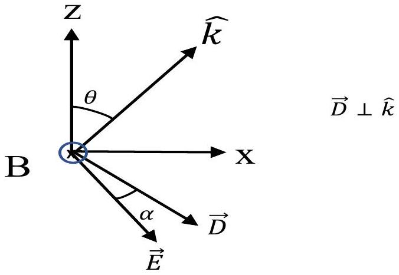
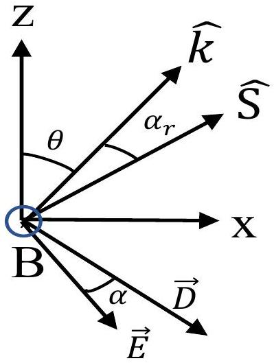

## Theoretical Question 2: Ray tracing and generation of entangled light

Part A. Light propagation in isotropic dielectric media
A. 10.4 pt

Ans: $\frac { 1 } { \sqrt { \mu _ { 0 } \epsilon } }$
Solution:
From $\vec { k } \times \vec { E } = \omega \vec { B } = \omega \mu _ { 0 } \vec { H }$ and $\vec { k } \times \vec { H } = - \omega \vec { D }$, one obtains $\vec { k } \times ( \vec { k } \times \vec { E } ) = - \omega ^ { 2 } \mu _ { 0 } \vec { D }$. By using the given identity $\vec { A } \times ( \vec { B } \times \vec { C } ) = \vec { B } ( \vec { A } \cdot \vec { C } ) - \vec { C } ( \vec { A } \cdot \vec { B } )$, one finds $\vec { k } \times ( \vec { k } \times \vec { E } ) = \vec { k } ( \vec { k } \cdot \vec { E } ) - k ^ { 2 } \vec { E }$. Since $\vec { D } \cdot \vec { k } = 0$ and $\vec { D } = \epsilon \vec { E }$, we find $\vec { k } \times ( \vec { k } \times \vec { E } ) = - k ^ { 2 } \vec { E }$ and the relation $\vec { k } \times ( \vec { k } \times \vec { E } ) = - \omega ^ { 2 } \mu _ { 0 } \vec { D }$ reduces to $- k ^ { 2 } \vec { E } = - \omega ^ { 2 } \mu _ { 0 } \epsilon \vec { E }$.
Now the phase delocity is determined by $\frac { d ( \vec { k } \cdot \vec { r } - \omega t ) } { d t } = 0$, we find that the phase velocity $\vec { v } _ { p } = \frac { d \vec { r } } { d t } = \frac { \omega } { k } \hat { k }$. Clearly, we have $\frac { \omega } { k } = \frac { 1 } { \sqrt { \mu _ { 0 } \epsilon } }$. Hence $v _ { p } = \frac { 1 } { \sqrt { \mu _ { 0 } \epsilon } }$.
A. 20.2 pt

Ans: $c \sqrt { \mu _ { 0 } \epsilon }$
Solution:
From $v _ { p } = \frac { 1 } { \sqrt { \mu _ { 0 } \epsilon } } = \frac { c } { n }$, we find $n = c \sqrt { \mu _ { 0 } \epsilon }$
A. 30.4 pt

Ans: $\hat { k } , v _ { r } = v _ { p } = \frac { 1 } { \sqrt { \mu _ { 0 } \epsilon } }$
Solution:
To find the speed of the ray, we first note that the direction of the energy flow, given by the Poynting vector $\vec { S } = \vec { E } \times \vec { H }$, is in the same direction of $\vec { k }$. The electromagnetic energy density $u = u _ { e } + u _ { m }$ with $u _ { e } = \frac { 1 } { 2 } \vec { E } \cdot \vec { D }$ and $u _ { m } = \frac { 1 } { 2 } \vec { B } \cdot \vec { H }$.
Now, from $\vec { k } \times \vec { H } = - \omega \vec { D }$, one has $\vec { D } = - \frac { 1 } { v _ { p } } \hat { k } \times \vec { H }$. Hence $u _ { e } = - \frac { 1 } { 2 v _ { p } } \vec { E } \cdot \hat { k } \times \vec { H } = \frac { 1 } { 2 v _ { p } } \hat { k } \cdot \vec { E } \times \vec { H }$. Similarly, from $\vec { k } \times \vec { E } = \omega \vec { B }$, we find $u _ { m } = \frac { 1 } { 2 v _ { p } } \vec { B } \cdot \hat { k } \times \vec { E } = \frac { 1 } { 2 v _ { p } } \hat { k } \cdot \vec { E } \times \vec { H }$. Hence $u = \frac { 1 } { v _ { p } } \hat { k } \cdot \vec { E } \times \vec { B }$. We find $v _ { r } = S / u = v _ { p } = \frac { 1 } { \sqrt { \mu _ { 0 } \epsilon } }$.
Part B. Light propagation in in uniaxial dielectric media
B. 1 1.5pt

Ans: $n = n _ { o } , \hat { B } = \pm \hat { k } \times \hat { y } = \pm ( - \cos \theta , 0 , \sin \theta ) , \hat { D } = \pm \hat { y }$ or $n = \frac { n _ { o } n _ { e } } { \sqrt { n _ { o } ^ { 2 } \sin ^ { 2 } \theta + n _ { e } ^ { 2 } \cos ^ { 2 } \theta } } , \hat { B } = \pm \hat { y }$, $\hat { D } = \pm \hat { y } \times \hat { k } = \pm ( \cos \theta , 0 , - \sin \theta )$. For $\theta = 0$, there is only one permitted value for the refractive index

Solution:
From $\vec { k } \times \vec { E } = \omega \mu _ { 0 } \vec { H }$ and $\vec { k } \times \vec { H } = - \omega \vec { D }$, one obtains $\vec { k } \times ( \vec { k } \times \vec { E } ) = - \omega ^ { 2 } \mu _ { 0 } \vec { D }$. Writing out

components and using $\omega = \frac { c } { n } k$, we find

$$
\begin{aligned}
- \cos ^ { 2 } \theta E _ { x } + \cos \theta \sin \theta E _ { z } & = - \frac { n _ { o } ^ { 2 } } { n ^ { 2 } } E _ { x } \\
- \cos ^ { 2 } \theta E _ { y } - \sin ^ { 2 } \theta E _ { y } & = - \frac { n _ { o } ^ { 2 } } { n ^ { 2 } } E _ { y } \\
- \sin ^ { 2 } \theta E _ { z } + \cos \theta \sin \theta E _ { x } & = - \frac { n _ { e } ^ { 2 } } { n ^ { 2 } } E _ { z }
\end{aligned}
$$

After a bit rearrangement, we obtain

$$
\begin{aligned}
\left( 1 - \frac { n _ { o } ^ { 2 } } { n ^ { 2 } } \right) E _ { y } & = 0 \\
\left( \frac { n _ { o } ^ { 2 } } { n ^ { 2 } } - \cos ^ { 2 } \theta \right) E _ { x } + \cos \theta \sin \theta E _ { z } & = 0 \\
\cos \theta \sin \theta E _ { x } + \left( \frac { n _ { o } ^ { 2 } } { n ^ { 2 } } - \sin ^ { 2 } \theta \right) E _ { z } & = 0
\end{aligned}
$$

The vanishing of the determinant yields

$$
\begin{equation*}
\left( 1 - \frac { n _ { o } ^ { 2 } } { n ^ { 2 } } \right) \left[ \left( \frac { n _ { o } ^ { 2 } } { n ^ { 2 } } - \cos ^ { 2 } \theta \right) \left( \frac { n _ { e } ^ { 2 } } { n ^ { 2 } } - \sin ^ { 2 } \theta \right) - \sin ^ { 2 } \theta \cos ^ { 2 } \theta \right] = 0 . \tag{1}
\end{equation*}
$$

Clearly, for a general $\theta$, we have two solutions for $n$ :
(1) $n = n _ { o }$
In this case, $E _ { x } = E _ { z } = 0 . \vec { E }$ is parallel to the $y$ axis. From $\vec { k } \times \vec { E } = \omega \vec { B }$ and $\vec { k } \times \left( \mu _ { 0 } \vec { B } \right) =$ $- \omega \vec { D }$, we obtain the directions of $\vec { B }$ and $\vec { D }$ as $\hat { B } = \pm \hat { k } \times \hat { y } = \pm ( - \cos \theta , 0 , \sin \theta )$ and $\hat { D } = - \hat { k } \times \hat { B } = \pm ( 0,1,0 ) = \pm \hat { y }$.
(2) $\left( \frac { n _ { o } ^ { 2 } } { n ^ { 2 } } - \cos ^ { 2 } \theta \right) \left( \frac { n _ { e } ^ { 2 } } { n ^ { 2 } } - \sin ^ { 2 } \theta \right) - \sin ^ { 2 } \theta \cos ^ { 2 } \theta = 0$.
After rearrangement, we find $n = \frac { n _ { o } n _ { e } } { \sqrt { n _ { o } ^ { 2 } \sin ^ { 2 } \theta + n _ { e } ^ { 2 } \cos ^ { 2 } \theta } }$. Clearly, at $\theta = 0 , n = n _ { o }$, there is only one refractive index. This is the direction of the optic axis.
In this case, $E _ { y } = 0$. Hence $\vec { E }$ lies in the $x z$ plane. Hence the relation $\vec { k } \times \vec { E } = \omega \vec { B }$ implies $\hat { B } = \pm \hat { y }$. The relation $\vec { k } \times \left( \mu _ { 0 } \vec { B } \right) = - \omega \vec { D }$ implies $\hat { D } = \pm \hat { y } \times \hat { k }$.

## B. 20.8 pt

Ans: (1) when $n = n _ { o } , \hat { E } = \pm \hat { y }$ and this is an ordinary ray. $\tan \alpha = 0$.
(2) when $n = \frac { n _ { o } n _ { e } } { \sqrt { n _ { o } ^ { 2 } \sin ^ { 2 } \theta + n _ { e } ^ { 2 } \cos ^ { 2 } \theta } } , \hat { E } = \pm \frac { 1 } { \sqrt { n _ { e } ^ { 4 } \cos ^ { 2 } \theta + n _ { o } ^ { 4 } \sin ^ { 2 } \theta } } \left( - n _ { e } ^ { 2 } \cos \theta , 0 , n _ { o } ^ { 2 } \sin \theta \right)$ and this is an extraordinary ray. $\tan \alpha = \frac { \left( n _ { o } ^ { 2 } - n _ { e } ^ { 2 } \right) \tan \theta } { n _ { e } ^ { 2 } + n _ { o } ^ { 2 } \tan ^ { 2 } \theta }$.

## Solution:

(1) For $n = n _ { o }$, both $\vec { E }$ and $\vec { D }$ are parallel to the $y$ axis. This is an ordinary ray with $\tan \alpha = 0$.

(2) For $n = \frac { n _ { o } n _ { e } } { \sqrt { n _ { o } ^ { 2 } \sin ^ { 2 } \theta + n _ { e } ^ { 2 } \cos ^ { 2 } \theta } } , n \neq n _ { o } , E _ { y } = 0$. By substituting $n$ back into the equations of $E _ { x }$ and $E _ { z }$, we find that $\frac { n _ { o } ^ { 2 } } { n _ { e } ^ { 2 } } \sin \theta E _ { x } + \cos \theta E _ { z } = 0$. Hence the electric field lies in $x z$ plane with $\hat { E } = \pm \frac { 1 } { \sqrt { n _ { e } ^ { 4 } \cos ^ { 2 } \theta + n _ { o } ^ { 4 } \sin ^ { 2 } \theta } } \left( - n _ { e } ^ { 2 } \cos \theta , 0 , n _ { o } ^ { 2 } \sin \theta \right)$ ( $\vec { B }$ points in $\mp y$ direction.). Therefore, $\vec { E }$ is not perpendicular to $\vec { k }$ and lies in the $x z$ plan in together with $\vec { D }$ and $\vec { k }$. This is the extraordinary ray.
Since $\vec { k } \times \vec { H } = - \omega \vec { D } , \vec { D }$ is perpendicular to $\hat { k }$. Hence $\hat { D } = \pm ( - \cos \theta , 0 , \sin \theta )$. Let $\vec { B } = \hat { y }$, the relative orientation of $\vec { E }$ and $\vec { D }$ for a given $\theta$ are shown in the following figure for the case when $n _ { e } < n _ { o }$.

Let the angle relative to $x$ axis be $\theta _ { 1 }$ and $\theta _ { 2 }$ for $\vec { E }$ and $\vec { D }$. We have $\tan \theta _ { 2 } = - \tan \theta$ and $\tan \theta _ { 1 } = - \frac { n _ { o } ^ { 2 } } { n _ { e } ^ { 2 } } \tan \theta$. Hence $\tan \alpha = \tan \left( \theta _ { 2 } - \theta _ { 1 } \right) = \frac { \tan \theta _ { 2 } - \tan \theta _ { 1 } } { 1 + \tan \theta _ { 1 } \tan \theta _ { 2 } } = \frac { \left( n _ { o } ^ { 2 } - n _ { e } ^ { 2 } \right) \tan \theta } { n _ { e } ^ { 2 } + n _ { o } ^ { 2 } \tan ^ { 2 } \theta }$. The same result remains when $n _ { e } > n _ { o }$ except that $\tan \alpha < 0$, indicating that the relative orientation of $\vec { E }$ and $\vec { D }$ is reversed.

## B. 30.6 pt

Ans: $n = n _ { o } , \vec { E } = \pm \hat { k } \times \hat { z } / \sin \theta$ and this is an ordinary ray.
when $n = \frac { n _ { o } n _ { e } } { \sqrt { n _ { o } ^ { 2 } \sin ^ { 2 } \theta + n _ { e } ^ { 2 } \cos ^ { 2 } \theta } } , \hat { E } = \pm \frac { 1 } { \sqrt { n _ { e } ^ { 4 } \cos ^ { 2 } \theta + n _ { o } ^ { 4 } \sin ^ { 2 } \theta } } \frac { - n _ { e } ^ { 2 } \cos \theta \hat { k } + \left( n _ { o } ^ { 2 } \sin ^ { 2 } \theta - n _ { e } ^ { 2 } \cos ^ { 2 } \theta \right) \hat { z } } { \sin \theta }$ and this is an extraordinary ray.

Solution: The problem has an axial symmetry so that in the plane formed by the $z$ axis and $\hat { k }$, one can write $\vec { k } = k _ { z } \hat { z } + k _ { \perp } \hat { k } _ { \perp }$ and $\vec { E } = E _ { z } \hat { z } + E _ { \perp } \hat { k } _ { \perp }$, where $\hat { k } _ { \perp }$ is perpendicular to $\hat { z }$. Clearly, we $k _ { z } = k \cos \theta , k _ { \perp } = k \sin \theta , E _ { z } = E \cos \theta$, and $E _ { \perp } = E \sin \theta$. Writing out the components for the equation: $\vec { k } \times ( \vec { k } \times \vec { E } ) = - \omega ^ { 2 } \mu _ { 0 } \vec { D }$, we get exactly the same equations except that $E _ { x }$ is replaced by $E _ { \perp }$. Hence all of the solutions are the same except $\hat { x }$ is replaced by $\hat { k } _ { \perp }$. Since $\hat { k } _ { \perp } \sin \theta = \hat { k } - \cos \theta \hat { z }$, we obtain that when $n = \frac { n _ { o } n _ { e } } { \sqrt { n _ { o } ^ { 2 } \sin ^ { 2 } \theta + n _ { e } ^ { 2 } \cos ^ { 2 } \theta } } , \hat { E } = \pm \frac { 1 } { \sqrt { n _ { e } ^ { 4 } \cos ^ { 2 } \theta + n _ { o } ^ { 4 } \sin ^ { 2 } \theta } } \left[ - n _ { e } ^ { 2 } \cos \theta \frac { ( \hat { k } - \cos \theta \hat { z } ) } { \sin \theta } + n _ { o } ^ { 2 } \sin \theta \hat { z } \right] =$

$\pm \frac { 1 } { \sqrt { n _ { e } ^ { 4 } \cos ^ { 2 } \theta + n _ { o } ^ { 4 } \sin ^ { 2 } \theta } } \frac { - n _ { e } ^ { 2 } \cos \theta \hat { k } + \left( n _ { o } ^ { 2 } \sin ^ { 2 } \theta - n _ { e } ^ { 2 } \cos ^ { 2 } \theta \right) \hat { z } } { \sin \theta }$.
B. 40.8 pt

Ans: (1) $n = n _ { o } , \tan \alpha _ { r } = 0 , v _ { r } = \frac { c } { n _ { o } } , \hat { S } = ( \sin \theta , 0 , \cos \theta )$
(2) $n = \frac { n _ { o } n _ { e } } { \sqrt { n _ { o } ^ { 2 } \sin ^ { 2 } \theta + n _ { e } ^ { 2 } \cos ^ { 2 } \theta } } , \tan \alpha _ { r } = \frac { \left( n _ { o } ^ { 2 } - n _ { e } ^ { 2 } \right) \tan \theta } { n _ { e } ^ { 2 } + n _ { o } ^ { 2 } \tan ^ { 2 } \theta } , v _ { r } = \frac { c } { n _ { o } n _ { e } } \sqrt { \frac { n _ { e } ^ { 4 } \cos ^ { 2 } \theta + n _ { o } ^ { 4 } \sin ^ { 2 } \theta } { n _ { e } ^ { 2 } \cos ^ { 2 } \theta + n _ { o } ^ { 2 } \sin ^ { 2 } \theta } }$.
$\hat { S } = \frac { 1 } { \sqrt { n _ { e } ^ { 4 } \cos ^ { 2 } \theta + n _ { o } ^ { 4 } \sin ^ { 2 } \theta } } \left( n _ { o } ^ { 2 } \sin \theta , 0 , n _ { e } ^ { 2 } \cos \theta \right)$
(3) $n _ { s } = \sqrt { ( \hat { S } \cdot \hat { x } ) ^ { 2 } n _ { e } ^ { 2 } + ( \hat { S } \cdot \hat { z } ) ^ { 2 } n _ { o } ^ { 2 } }$

Solution:
The direction of the energy flow is given by the Poynting vector, $\vec { S } = \vec { E } \times \vec { H }$. Let the energy density of EM wave be $u$ and the ray velocity be $v _ { r }$. Then $v _ { r } = \frac { S } { u }$. Here $u = u _ { e } + u _ { m }$ with $u _ { e } = \frac { 1 } { 2 } \vec { E } \cdot \vec { D }$ and $u _ { m } = \frac { 1 } { 2 } \vec { B } \cdot \vec { H }$. There are two cases:
(i) $n = n _ { o } , \vec { E } = ( 0 , E , 0 ) , \vec { D } = \epsilon \vec { E } , \vec { k } \times \vec { E } = \omega \mu _ { 0 } \vec { H } , \vec { k } \times \vec { H } = - \omega \vec { D }$.
$\hat { k } , \vec { E }$ and $\vec { H }$ are mutually perpendicular to each other. Hence $\vec { S }$ is parallel to $\hat { k }$, i.e., $\hat { S } = ( \sin \theta , 0 , \cos \theta )$ and $\tan \alpha _ { r } = 0$.
Now from $\vec { k } \times \vec { H } = - \omega \vec { D }$, one has $\vec { D } = - \frac { 1 } { v _ { p } } \hat { k } \times \vec { H }$. Hence $u _ { e } = - \frac { 1 } { 2 v _ { p } } \vec { E } \cdot \hat { k } \times \vec { H } = \frac { 1 } { 2 v _ { p } } \hat { k } \cdot \vec { E } \times \vec { H }$. Similarly, we find $u _ { m } = \frac { 1 } { 2 v _ { p } } \vec { H } \cdot \hat { k } \times \vec { E } = \frac { 1 } { 2 v _ { p } } \hat { k } \cdot \vec { E } \times \vec { H }$. Hence $u = \frac { 1 } { v _ { p } } \hat { k } \cdot \vec { E } \times \vec { H }$. Since $\hat { S } = \hat { k }$, we find $u = \frac { S } { v _ { p } }$. Hence $v _ { r } = \frac { S } { u } = v _ { p } = \frac { \omega } { k } = \frac { c } { n _ { o } }$.
(ii) $n = \frac { n _ { o } n _ { e } } { \sqrt { n _ { o } ^ { 2 } \sin ^ { 2 } \theta + n _ { e } ^ { 2 } \cos ^ { 2 } \theta } }$. In this case, we can $\operatorname { tak } \vec { B } = ( 0 , B , 0 )$ (negative $y$ direction works as well). $\vec { D } , \vec { E }$ and $\hat { k }$ are in the $x z$ plane and $\vec { D }$ is perpendicular to $\hat { k }$. Therefore, the angle between $\vec { S } = \frac { 1 } { \mu _ { 0 } } \vec { E } \times \vec { B }$ and $\hat { k }$ is equal to the angle between $\vec { D }$ and $\vec { E }$, i.e., $\alpha _ { r } = \alpha$. This is shown in the following figure when $n _ { e } < n _ { o }$ (for $n _ { e } > n _ { o }$, both $\alpha$ and $\alpha _ { r }$ are negative, the relative orientation of $\vec { E }$ and $\vec { D }$ is reversed and ordering of $\hat { S }$ and $\hat { k }$ are switched).

$$
\begin{aligned}
& \vec { E } \perp \hat { S } \\
& \vec { D } \perp \hat { k }
\end{aligned}
$$

Therefore, from problem (d) (ii), we get $\tan \alpha _ { r } = \tan \alpha = \frac { \left( n _ { o } ^ { 2 } - n _ { e } ^ { 2 } \right) \tan \theta } { n _ { e } ^ { 2 } + n _ { o } ^ { 2 } \tan ^ { 2 } \theta }$. Now, because $u = \frac { 1 } { v _ { p } } \hat { k } \cdot \vec { E } \times \vec { H } = \frac { 1 } { v _ { p } } | \vec { E } \times \vec { H } | \cos \alpha$, we obtain $v _ { r } = \frac { S } { u } = \frac { v _ { p } } { \cos \alpha }$. Hence the phase speed $v _ { p }$ and the ray speed are related by $v _ { p } = v _ { r } \cos \alpha$. From $\tan \alpha$, one finds $\cos \alpha = \frac { n _ { e } ^ { 2 } \cos ^ { 2 } \theta + n _ { o } ^ { 2 } \sin ^ { 2 } \theta } { \sqrt { n _ { e } ^ { 4 } \cos ^ { 2 } \theta + n _ { o } ^ { 4 } \sin ^ { 2 } \theta } }$. Hence $v _ { r } = \frac { c } { n \cos \alpha } = \frac { c } { n _ { o } n _ { e } } \sqrt { \frac { n _ { e } ^ { 4 } \cos ^ { 2 } \theta + n _ { o } ^ { 4 } \sin ^ { 2 } \theta } { n _ { e } ^ { 2 } \cos ^ { 2 } \theta + n _ { o } ^ { 2 } \sin ^ { 2 } \theta } }$.
Clearly, $\hat { S } = ( \sin ( \theta + \alpha ) , \cos ( \theta + \alpha ) )$. Since $\sin \alpha = \frac { \left( n _ { o } ^ { 2 } - n _ { e } ^ { 2 } \right) \sin \theta \cos \theta } { \sqrt { n _ { e } ^ { 4 } \cos ^ { 2 } \theta + n _ { o } ^ { 4 } \sin ^ { 2 } \theta } }$ and $\cos \alpha =$ $\frac { n _ { e } ^ { 2 } c \cos ^ { 2 } \theta + n _ { o } ^ { 2 } \sin ^ { 2 } \theta } { \sqrt { n _ { e } ^ { 4 } c \cos ^ { 2 } \theta + n _ { o } ^ { 4 } \sin ^ { 2 } \theta } }$, we find $\hat { S } = \frac { 1 } { \sqrt { n _ { e } ^ { 4 } c \cos ^ { 2 } \theta + n _ { o } ^ { 4 } \sin ^ { 2 } \theta } } \left( n _ { o } ^ { 2 } \sin \theta , 0 , n _ { e } ^ { 2 } \cos \theta \right)$.
From $n _ { s } ^ { 2 } = \left( \frac { c } { v _ { r } } \right) ^ { 2 } = n _ { o } ^ { 2 } n _ { e } ^ { 2 } \frac { n _ { e } ^ { 2 } \cos ^ { 2 } \theta + n _ { o } ^ { 2 } \sin ^ { 2 } \theta } { n _ { e } ^ { 4 } \cos ^ { 2 } \theta + n _ { o } ^ { 4 } \sin ^ { 2 } \theta } = \frac { \left( n _ { o } ^ { 2 } \sin \theta \right) ^ { 2 } n _ { e } ^ { 2 } + \left( n _ { e } ^ { 2 } \cos \theta \right) n _ { o } ^ { 2 } } { n _ { e } ^ { 4 } \cos ^ { 2 } \theta + n _ { o } ^ { 4 } \sin ^ { 2 } \theta }$, we find $n _ { s } = ( \hat { S } \cdot \hat { x } ) ^ { 2 } n _ { e } ^ { 2 } + ( \hat { S }$. $\hat { z } ) ^ { 2 } n _ { o } ^ { 2 }$.

## B. 51.1 pt

Ans: $\bar { A } = P _ { 1 } \left( n ^ { 2 } \sin ^ { 2 } \theta _ { 1 } - P _ { 1 } \right) , \bar { B } = - 2 P _ { 3 } \left( n ^ { 2 } \sin ^ { 2 } \theta _ { 1 } - P _ { 1 } \right) , \bar { C } = P _ { 2 } n ^ { 2 } \sin ^ { 2 } \theta _ { 1 } - P _ { 3 } ^ { 2 }$.
$\phi = 0 , \tan \theta _ { 2 } = \frac { n n _ { e } \sin \theta _ { 1 } } { n _ { o } \sqrt { n _ { o } ^ { 2 } - n ^ { 2 } \sin ^ { 2 } \theta _ { 1 } } }$.
$\phi = \pi / 2 , \tan \theta _ { 2 } = \frac { n n _ { o } \sin \theta _ { 1 } } { n _ { e } \sqrt { n _ { e } ^ { 2 } - n ^ { 2 } \sin ^ { 2 } \theta _ { 1 } } }$.

## Solution:

Let the distance along $z$ axis between $A$ and $B$ be $d$ and the point of the interface that the ray passes be the origin $O$. The coordinates of B and A points can be expressed as $\left( h _ { 2 } , 0 , z \right)$ and $\left( h _ { 1 } , 0 , d - z \right)$. The distances are then given by $\overline { A O } \equiv d _ { 1 } = \sqrt { h _ { 1 } ^ { 2 } + ( d - z ) ^ { 2 } }$ and $\overline { O B } \equiv d _ { 2 } = \sqrt { h _ { 2 } ^ { 2 } + z ^ { 2 } }$. The propagation time from A to B is determined by the ray speed $v _ { r }$ as $\left( d _ { 1 } n _ { s 1 } + d _ { 2 } n _ { s 2 } \right) / c$, where $n _ { s i }$ are ray indices for medium $i$. According to the Fermat's principle, we need to minimize the optical path length defined by $\Delta \equiv d _ { 1 } n _ { s 1 } + d _ { 2 } n _ { s 2 }$. According to problem (e), we have $n _ { s 2 } ^ { 2 } = \left( \frac { \overrightarrow { O B } } { \overline { O B } } \cdot \hat { x } _ { 2 } \right) ^ { 2 } n _ { e } ^ { 2 } + \left( \frac { \overrightarrow { O B } } { \overline { O B } } \cdot \hat { z } _ { 2 } \right) ^ { 2 } n _ { o } ^ { 2 }$. For an isotropic medium, the ray index is simply the refractive index, i.e., $n _ { s 1 } = n$. Using the following relations

$$
\begin{aligned}
& \frac { \overrightarrow { O B } } { \overrightarrow { O B } } \cdot \hat { x } _ { 2 } = \cos \left( \phi - \theta _ { 2 } \right) = \frac { h _ { 2 } } { d _ { 2 } } \cos \phi + \frac { z } { d _ { 2 } } \sin \phi \\
& \frac { \overrightarrow { O B } } { \overrightarrow { O B } } \cdot \hat { z } _ { 2 } = \cos \left( \frac { \pi } { 2 } + \phi - \theta _ { 2 } \right) = \sin \left( \theta _ { 2 } - \phi \right) = \frac { z } { d _ { 2 } } \cos \phi - \frac { h _ { 2 } } { d _ { 2 } } \sin \phi
\end{aligned}
$$

we find

$$
\Delta = n \sqrt { h _ { 1 } ^ { 2 } + ( d - z ) ^ { 2 } } + \sqrt { \left( h _ { 2 } \cos \phi + z \sin \phi \right) ^ { 2 } n _ { e } ^ { 2 } + \left( - h _ { 2 } \sin \phi + z \cos \phi \right) ^ { 2 } n _ { o } ^ { 2 } } .
$$

The minimum occurs when $\frac { d \Delta } { d z } = 0$. We obtain

$$
n \frac { z - d } { \sqrt { h _ { 1 } ^ { 2 } + ( d - z ) ^ { 2 } } } + \frac { \left( h _ { 2 } \sin \phi \cos \phi \left( n _ { e } ^ { 2 } - n _ { o } ^ { 2 } \right) + z \left( n _ { e } ^ { 2 } \sin ^ { 2 } \phi + n _ { o } ^ { 2 } \cos ^ { 2 } \phi \right) \right. } { \sqrt { \left( h _ { 2 } \cos \phi + z \sin \phi \right) ^ { 2 } n _ { e } ^ { 2 } + \left( - h _ { 2 } \sin \phi + z \cos \phi \right) ^ { 2 } n _ { o } ^ { 2 } } } = 0 .
$$

Recognizing $\frac { d - z } { \sqrt { h _ { 1 } ^ { 2 } + ( d - z ) ^ { 2 } } } = \sin \theta _ { 1 }$, moving the second term to the left and taking square of the equation, we obtain

$$
n ^ { 2 } \sin ^ { 2 } \theta _ { 1 } = \frac { \left( P _ { 3 } - P _ { 1 } \tan \theta _ { 2 } \right) ^ { 2 } } { P _ { 1 } \tan ^ { 2 } \theta _ { 2 } - 2 P _ { 3 } \tan \theta _ { 2 } + P _ { 2 } } ,
$$

where $P _ { 1 } = n _ { o } ^ { 2 } \cos ^ { 2 } \phi + n _ { e } ^ { 2 } \sin ^ { 2 } \phi , P _ { 2 } = n _ { o } ^ { 2 } \sin ^ { 2 } \phi + n _ { e } ^ { 2 } \cos ^ { 2 } \phi$, and $P _ { 3 } = \left( n _ { o } ^ { 2 } - n _ { e } ^ { 2 } \right) \sin \phi \cos \phi$. By expanding the above equation out, we find

$$
P _ { 1 } \left( n ^ { 2 } \sin ^ { 2 } \theta _ { 1 } - P _ { 1 } \right) \tan ^ { 2 } \theta _ { 2 } - 2 P _ { 3 } \left( n ^ { 2 } \sin ^ { 2 } \theta _ { 1 } - P _ { 1 } \right) \tan \theta _ { 1 } + P _ { 2 } n ^ { 2 } \sin ^ { 2 } \theta _ { 1 } - P _ { 3 } ^ { 2 } = 0 .
$$

Hence $\bar { A } = P _ { 1 } \left( n ^ { 2 } \sin ^ { 2 } \theta _ { 1 } - P _ { 1 } \right) , \bar { B } = - 2 P _ { 3 } \left( n ^ { 2 } \sin ^ { 2 } \theta _ { 1 } - P _ { 1 } \right)$, and $\bar { C } = P _ { 2 } n ^ { 2 } \sin ^ { 2 } \theta _ { 1 } - P _ { 3 } ^ { 2 }$. For $\phi = 0$, we have $P _ { 3 } = 0 , P _ { 1 } = n _ { o } ^ { 2 }$, and $P _ { 2 } = n _ { e } ^ { 2 }$. We find $n _ { o } ^ { 2 } \left( n ^ { 2 } \sin ^ { 2 } \theta _ { 1 } - n _ { o } ^ { 2 } \right) \tan ^ { 2 } \theta _ { 2 } +$ $n _ { e } ^ { 2 } n ^ { 2 } \sin ^ { 2 } \theta _ { 1 } = 0$. Hence $\tan \theta _ { 2 } = \frac { n n _ { e } \sin \theta _ { 1 } } { n _ { o } \sqrt { n _ { o } ^ { 2 } - n ^ { 2 } \sin ^ { 2 } \theta _ { 1 } } }$. For $\phi = \pi / 2$, we have $P _ { 3 } = 0 , P _ { 1 } = n _ { e } ^ { 2 }$, and $P _ { 2 } = n _ { o } ^ { 2 }$. We find $n _ { e } ^ { 2 } \left( n ^ { 2 } \sin ^ { 2 } \theta _ { 1 } - n _ { e } ^ { 2 } \right) \tan ^ { 2 } \theta _ { 2 } + n _ { o } ^ { 2 } n ^ { 2 } \sin ^ { 2 } \theta _ { 1 } = 0$. Hence $\tan \theta _ { 2 } = \frac { n n _ { o } \sin \theta _ { 1 } } { n _ { e } \sqrt { n _ { e } ^ { 2 } - n ^ { 2 } \sin ^ { 2 } \theta _ { 1 } } }$.

## Part C. Entanglement of light

## C. 10.8 pt

Ans:(1) $\omega = \omega _ { 1 } \pm \omega _ { 2 } , \vec { k } = \vec { k } _ { 1 } \pm \vec { k } _ { 2 }$
(2) $\hbar \omega = \hbar \omega _ { 1 } \pm \hbar \omega _ { 2 } , \hbar \vec { k } = \hbar \vec { k } _ { 1 } \pm \hbar \vec { k } _ { 2 }$ represents the energy conservation and momentum conservation of photons.
(3) Splitting of photon: Energy conservation $\omega = \omega _ { 1 } + \omega _ { 2 }$, momentum conservation: $\vec { k } =$ $\vec { k } _ { 1 } + \vec { k } _ { 2 }$.

## Solution:

For a light wave with frequency $\omega$ and $\vec { k }$, the corresponding polarization density and the electric field are in the form of $\vec { A } \cos ( \omega t - \vec { k } \cdot \vec { r } )$, which can be rewritten as $\frac { \vec { A } } { 2 } \left( e ^ { i ( \omega t - \vec { k } \cdot \vec { r } ) } + \right.$ $e ^ { - i ( \omega t - \vec { k } \cdot \vec { r } ) }$ ). By substituting the above form into the equation $P _ { i } ^ { N L } = \sum _ { j } \sum _ { k } \chi _ { i j k } ^ { ( 2 ) } E _ { j } E _ { k }$ and equating the relevant exponents, we find all possible relations are

$$
\begin{aligned}
\omega & = \omega _ { 1 } + \omega _ { 2 } , \vec { k } = \vec { k } _ { 1 } + \vec { k } _ { 2 } \\
\text { or } \omega & = \omega _ { 1 } - \omega _ { 2 } , \vec { k } = \vec { k } _ { 1 } - \vec { k } _ { 2 } ,
\end{aligned}
$$

where we have made use of the fact that the frequency is positive. The meaning for the these relations is clear if one recall that the energy and momentum of a photon is given by $\hbar \omega$ and $\hbar \vec { k }$. The relation of $\hbar \omega = \hbar \omega _ { 1 } + \hbar \omega _ { 2 } , \hbar \vec { k } = \hbar \vec { k } _ { 1 } + \hbar \vec { k } _ { 2 }$ represents the energy and momentum

conservations when a photon with $( \omega , \vec { k } )$ is annihilated and split into two photons with $\left( \omega _ { 1 } \right.$, $\vec { k } _ { 1 }$ ) and $\left( \omega _ { 2 } , \vec { k } _ { 2 } \right)$, while the relation of $\hbar \omega = \hbar \omega _ { 1 } - \hbar \omega _ { 2 } , \hbar \vec { k } = \hbar \vec { k } _ { 1 } - \hbar \vec { k } _ { 2 }$ represents the energy and momentum conservations when a photon with $\left( \omega _ { 1 } , \vec { k } _ { 1 } \right)$ is annihilated and split into two photons with $( \omega , \vec { k } )$ and $\left( \omega _ { 2 } , \vec { k } _ { 2 } \right)$.

## C. 20.8 pt

Ans: $\mathbf { o } \rightarrow \mathbf { o } + \mathbf { o } , \mathbf { e } \rightarrow \mathbf { e } + \mathbf { e }$

## Solution:

For the collinear case, the phase matching conditions become $\omega = \omega _ { 1 } + \omega _ { 2 } , \frac { n _ { i } ( \omega ) \omega } { c } = \frac { n _ { j } \left( \omega _ { 1 } \right) \omega _ { 1 } } { c } +$ $\frac { n _ { k } \left( \omega _ { 2 } \right) \omega _ { 2 } } { c }$, where $i , j$, and $k$ are indices of either o or e. Assuming that $\omega _ { 1 } \geq \omega _ { 2 }$, one can solve $\omega _ { 1 }$ as $\omega _ { 1 } = \omega - \omega _ { 2 }$. We obtain

$$
\begin{equation*}
n _ { i } ( \omega ) - n _ { j } \left( \omega _ { 1 } \right) = \frac { \omega _ { 2 } } { \omega } \left[ n _ { k } \left( \omega _ { 2 } \right) - n _ { j } \left( \omega _ { 1 } \right) \right] . \tag{2}
\end{equation*}
$$

Clearly, because $\omega > \omega _ { 1 } \geq \omega _ { 2 }$, if $i = j = k , n _ { i } ( \omega ) - n _ { j } \left( \omega _ { 1 } \right) > 0$ and $n _ { k } \left( \omega _ { 2 } \right) - n _ { j } \left( \omega _ { 1 } \right) \leq 0$, the above equation cannot be satisfied. For other cases, because there is no relation between $n _ { o }$ and $n _ { e }$, the phase matching conditions can be satisfied. Hence only $\mathbf { o } \rightarrow \mathbf { o } + \mathbf { o }$ and $\mathbf { e } \rightarrow \mathbf { e } + \mathbf { e }$ are not possible.

## C. 31.5 pt

Ans: (1) $M = \frac { K _ { o } \left[ 1 - N _ { e } \left( \Omega _ { e } , \theta \right) \cot \theta \right] + K _ { e } } { 2 K _ { e } K _ { o } } , E = - N _ { e } / 2 M$ and $F = - \left( \Omega - \Omega _ { e } \right) \left( \frac { 1 } { u _ { o } } - \frac { 1 } { u _ { e } } \right) + \frac { N _ { e } ^ { 2 } } { 4 M }$
(2) the angle between the axis of the cone and $z ^ { \prime }$ is $N / K _ { o } = - \frac { 2 K _ { e } N _ { e } } { K _ { o } \left[ 1 - N _ { e } \left( \Omega _ { e } , \theta \right) \cot \theta \right] + K _ { e } }$
(3) the angle of cone is about $\frac { \sqrt { L / M } } { K _ { o } } = - \frac { \left( \Omega - \Omega _ { e } \right) } { M K _ { o } } \left( \frac { 1 } { u _ { o } } - \frac { 1 } { u _ { e } } \right) + \frac { N _ { e } ^ { 2 } } { 4 M ^ { 2 } K _ { o } }$.

## Solution:

To satisfy the phase matching condition, we expand the angular frequencies $\omega _ { 1 }$ and $\omega _ { 2 }$ into $\omega _ { 1 } = \Omega _ { e } + \nu$ and $\omega _ { 2 } = \Omega _ { o } + \nu ^ { \prime }$. Clearly, because $\Omega _ { e } + \Omega _ { o } = \Omega _ { p }$, to satisfy $\omega _ { 1 } + \omega _ { 2 } = \omega$, $\nu ^ { \prime } = - \nu$. Similarly, the conditions for the wavevectors, $\vec { k } = \vec { k } _ { 1 } + \vec { k } _ { 2 }$, can be written as $k _ { z } = k = K _ { p } = k _ { 1 z } + k _ { 2 z }$ and $\vec { k } _ { 2 \perp } = - \vec { k } _ { 1 \perp } \equiv \vec { q } _ { \perp }$. For the o light ray, we have $k _ { 2 \perp } ^ { 2 } + k _ { 2 z } ^ { 2 } = k _ { 2 } ^ { 2 }$ with $k _ { 2 } = \frac { n _ { o } \left( \omega _ { 2 } \right) \omega _ { 2 } } { c }$. One finds that $k _ { 2 z } = \sqrt { k _ { 2 } ^ { 2 } - k _ { 2 \perp } ^ { 2 } } = k _ { 2 } - \frac { k _ { 2 \perp } ^ { 2 } } { 2 k _ { 2 } }$. Expanding the dependence of $\omega _ { 2 }$ in $k _ { 2 }$ to $\nu$, we obtain

$$
k _ { 2 } = \frac { n _ { o } \left( \omega _ { 2 } \right) \omega _ { 2 } } { c } = \frac { n _ { o } \left( \Omega _ { o } \right) \Omega _ { o } } { c } + \frac { d k _ { 2 } } { d \omega _ { 2 } } \left( \omega _ { 2 } - \Omega _ { o } \right) = K _ { o } - \frac { \nu } { u _ { o } } ,
$$

where $u _ { o }$ is the group velocity for the ordinary ray. Hence to the second order of corrections,

we get

$$
k _ { 2 z } = K _ { o } - \frac { \nu } { u _ { o } } - \frac { q _ { \perp } ^ { 2 } } { 2 K _ { o } } .
$$

Similarly, for the e light ray, we have $k _ { 1 \perp } ^ { 2 } + k _ { 1 z } ^ { 2 } = k _ { 1 } ^ { 2 }$ with $k _ { 1 } = \frac { n _ { e } \left( \omega _ { 1 } , \theta _ { p } \right) \omega _ { 1 } } { c }$. One finds that $k _ { 1 z } = \sqrt { k _ { 1 } ^ { 2 } - k _ { 1 \perp } ^ { 2 } } = k _ { 1 } - \frac { k _ { 1 \perp } ^ { 2 } } { 2 k _ { 1 } }$. The expansion of $k _ { 1 }$ is different from that for $k _ { 2 }$ due to its angle dependence. Let the spherical angles for $\vec { k } _ { 1 }$ be $\theta _ { 1 }$ and $\phi _ { 1 }$. We have

$$
k _ { 1 } = \frac { n _ { e } \left( \omega _ { 1 } , \theta _ { 1 } \right) \omega _ { 1 } } { c } = \frac { n _ { e } \left( \Omega _ { e } , \theta \right) \Omega _ { e } } { c } + \frac { d k _ { 1 } \left( \Omega _ { e } , \theta \right) } { d \Omega _ { e } } \left( \omega _ { 1 } - \Omega _ { e } \right) + \frac { \Omega _ { e } } { c } \frac { d n _ { e } \left( \Omega _ { e } , \theta \right) } { d \theta } \left( \theta _ { 1 } - \theta \right) + \cdots
$$

Here $\frac { n _ { e } \left( \Omega _ { e } , \theta \right) \Omega _ { e } } { c } = K _ { e } , \frac { d k _ { 1 } \left( \Omega _ { e } , \theta \right) } { d \Omega _ { e } }$ is $1 / u _ { e }$ with $u _ { e }$ being the group velocity for the extraordinary ray and is given by

$$
\frac { d k _ { 1 } \left( \Omega _ { e } , \theta \right) } { d \Omega _ { e } } = \frac { n _ { e } \left( \Omega _ { e } , \theta \right) } { c } + \frac { \Omega _ { e } } { c } \frac { d n _ { e } \left( \Omega _ { e } , \theta \right) } { d \Omega _ { e } } .
$$

Because $\frac { d n _ { e } \left( \Omega _ { e } , \theta \right) } { d \theta } = \frac { n _ { o } n _ { e } \left( n _ { e } ^ { 2 } - n _ { o } ^ { 2 } \right) \sin \theta \cos \theta } { \left( n _ { o } ^ { 2 } \sin ^ { 2 } \theta + n _ { e } ^ { 2 } \cos ^ { 2 } \theta \right) ^ { 3 / 2 } } = n _ { e } \left( \Omega _ { e } , \theta \right) N _ { e } \left( \Omega _ { e } , \theta \right)$, we find $N _ { e } \left( \Omega _ { e } , \theta \right) =$ $\frac { \left( n _ { e } ^ { 2 } - n _ { o } ^ { 2 } \right) \sin \theta \cos \theta } { n _ { o } ^ { 2 } \sin ^ { 2 } \theta + n _ { e } ^ { 2 } \cos ^ { 2 } \theta }$. Note that for $n _ { e } < n _ { o } , N _ { e } \left( \Omega _ { e } , \theta \right) < 0$. To find $\delta \theta = \theta _ { 1 } - \theta$, we note that for any $\vec { k } _ { \alpha }$, one has (cf. Fig. 2(a))

$$
\hat { k } _ { \alpha } \cdot \widehat { O A } = \cos \theta _ { \alpha } = \cos \theta \cos \psi _ { \alpha } + \sin \theta \sin \psi _ { \alpha } \cos \phi _ { \alpha } .
$$

Since $\sin \psi _ { 1 } = \left| \vec { k } _ { \perp , 1 } \right| / \left| \vec { k } _ { 1 } \right| = q _ { \perp } / k _ { 1 } \ll 1$ and $\cos \psi _ { 1 } = \sqrt { 1 - \sin ^ { 2 } \psi _ { 1 } } = 1 - 1 / 2 \sin ^ { 2 } \psi _ { 1 } + \cdots$, to the second order, we can replace $k _ { 1 }$ by $K _ { e }$ and obtain

$$
\hat { k } _ { 1 } \cdot \widehat { O A } = \cos \theta _ { 1 } = \cos \theta \left[ 1 - \frac { 1 } { 2 } \frac { q _ { \perp } ^ { 2 } } { K _ { e } ^ { 2 } } + \cdots \right] + \sin \theta \left[ \frac { q _ { \perp } } { K _ { e } } + \cdots \right] \cos \phi _ { 1 } .
$$

On the other hand, $\cos \theta _ { 1 } = \cos \theta + \frac { d \cos \theta } { d \theta } \left( \theta _ { 1 } - \theta \right) + \cdots = \cos \theta - \sin \theta \left( \theta _ { 1 } - \theta \right) + \cdots$. Comparing this equation to the equaton for $\hat { k } _ { 1 } \cdot \widehat { O A }$, we obtain

$$
\theta _ { 1 } - \theta = \frac { 1 } { 2 } \frac { q _ { \perp } ^ { 2 } } { K _ { e } ^ { 2 } } \cot \theta - \frac { q _ { \perp } } { K _ { e } } \cos \phi _ { 1 } \cdots = \frac { 1 } { 2 } \frac { q _ { \perp } ^ { 2 } } { K _ { e } ^ { 2 } } \cot \theta + \frac { q _ { x ^ { \prime } } } { K _ { e } } + \cdots
$$

Putting all together, we find

$$
k _ { 1 z } = K _ { e } + \frac { 1 } { u _ { e } } \left( \Omega - \Omega _ { e } \right) + N _ { e } \left( \Omega _ { e } , \theta \right) q _ { x ^ { \prime } } + \frac { q _ { \perp } ^ { 2 } } { 2 K _ { e } } \left[ N _ { e } \left( \Omega _ { e } , \theta \right) \cot \theta - 1 \right] + \cdots .
$$

The above equation when combined with the equation of $k _ { 1 z }$ and the relation $K _ { p } = k _ { 1 z } + k _ { 2 z }$, we find

$$
\left( \Omega - \Omega _ { e } \right) \left( \frac { 1 } { u _ { e } } - \frac { 1 } { u _ { o } } \right) + N _ { e } \left( \Omega _ { e } , \theta \right) q _ { x ^ { \prime } } + q _ { \perp } ^ { 2 } \left\{ \frac { K _ { o } \left[ N _ { e } \left( \Omega _ { e } , \theta \right) \cot \theta - 1 \right] - K _ { e } } { 2 K _ { e } K _ { o } } \right\} = 0 .
$$

Because $n _ { e } < n _ { o } , N _ { e } \left( \Omega _ { e } , \theta \right) < 0$. The above equation can be rewritten in the form

$$
M \left[ q _ { x ^ { \prime } } - \frac { N _ { e } } { 2 D } \right] ^ { 2 } + M q _ { y ^ { \prime } } ^ { 2 } = - \left( \Omega - \Omega _ { e } \right) \left( \frac { 1 } { u _ { o } } - \frac { 1 } { u _ { e } } \right) + \frac { N _ { e } ^ { 2 } } { 4 M } .
$$

Here $D = \frac { K _ { o } \left[ 1 - N _ { e } \left( \Omega _ { e } , \theta \right) \cot \theta \right] + K _ { e } } { 2 K _ { e } K _ { o } } > 0$. Hence $E = - N _ { e } / 2 M > 0 \left( N _ { e } < 0 \right)$ and $L = - \left( \Omega - \Omega _ { e } \right) \left( \frac { 1 } { u _ { o } } - \frac { 1 } { u _ { e } } \right) + \frac { N _ { e } ^ { 2 } } { 4 M }$. Clearly, the cone axis formed by $\vec { k } _ { 2 }$ is characterized by $\vec { q } _ { \perp }$. We find that the angle between the axis of the cone and $z ^ { \prime }$ is $\tan ^ { - 1 } \left( N / k _ { 1 z } \right)$, which is about $N / k _ { 1 z } \approx N / K _ { o } = - \frac { 2 K _ { e } N _ { e } } { K _ { o } \left[ 1 - N _ { e } \left( \Omega _ { e } , \theta \right) \cot \theta \right] + K _ { e } }$. The angle of the cone is given by $\sin ^ { - 1 } \frac { \sqrt { L / M } } { k _ { 2 } } \approx \frac { \sqrt { L / M } } { K _ { o } } = - \frac { \left( \Omega - \Omega _ { e } \right) } { M K _ { o } } \left( \frac { 1 } { u _ { o } } - \frac { 1 } { u _ { e } } \right) + \frac { N _ { e } ^ { 2 } } { 4 M ^ { 2 } K _ { o } }$.

## C. 4 0.8pt

Ans: $P ( \alpha , \beta ) = \frac { 1 } { 2 } \sin ^ { 2 } ( \alpha + \beta ) , P \left( \alpha , \beta _ { \perp } \right) = \frac { 1 } { 2 } \cos ^ { 2 } ( \alpha + \beta ) , P \left( \alpha _ { \perp } , \beta \right) = \frac { 1 } { 2 } \cos ^ { 2 } ( \alpha + \beta )$, $P \left( \alpha _ { \perp } , \beta _ { \perp } \right) = \frac { 1 } { 2 } \sin ^ { 2 } ( \alpha + \beta )$

## Solution:

For $a$-photon, let the electric field along the polarizer and perpendicular to the polarization represented by $\left| \alpha _ { x } \right\rangle$ and $\left| \alpha _ { y } \right\rangle$. Here $\alpha _ { x }$ and $\alpha _ { x }$ are essentially the electric field amplitudes in appropriate units. The electric fields (the states) along $\hat { x } ^ { \prime }$ and $\hat { y } ^ { \prime }$ can be written as

$$
\begin{aligned}
& \left| \hat { x } _ { a } ^ { \prime } \right\rangle = \cos \alpha \left| \alpha _ { x } \right\rangle - \sin \alpha \left| \alpha _ { y } \right\rangle , \\
& \left| \hat { y } _ { a } ^ { \prime } \right\rangle = \sin \alpha \left| \alpha _ { x } \right\rangle + \cos \alpha \left| \alpha _ { y } \right\rangle .
\end{aligned}
$$

Similarly, for $b$-photon, we have

$$
\begin{aligned}
& \left| \hat { x } _ { b } ^ { \prime } \right\rangle = \cos \beta \left| \beta _ { x } \right\rangle - \sin \beta \left| \beta _ { y } \right\rangle , \\
& \left| \hat { y } _ { b } ^ { \prime } \right\rangle = \sin \beta \left| \beta _ { x } \right\rangle + \cos \beta \left| \beta _ { y } \right\rangle .
\end{aligned}
$$

Hence we obtain

$$
\begin{aligned}
& \left| \hat { x } _ { a } ^ { \prime } \right\rangle \left| \hat { y } _ { b } ^ { \prime } \right\rangle = \left( \cos \alpha \left| \alpha _ { x } \right\rangle - \sin \alpha \left| \alpha _ { y } \right\rangle \right) \left( \sin \beta \left| \beta _ { x } \right\rangle + \cos \beta \left| \beta _ { y } \right\rangle \right) , \\
& \left| \hat { y } _ { a } ^ { \prime } \right\rangle \left| \hat { x } _ { b } ^ { \prime } \right\rangle = \left( \sin \alpha \left| \alpha _ { x } \right\rangle + \cos \alpha \left| \alpha _ { y } \right\rangle \right) \left( \cos \beta \left| \beta _ { x } \right\rangle - \sin \beta \left| \beta _ { y } \right\rangle \right) .
\end{aligned}
$$

The state of the entangled photon pair can be written as

$$
\begin{aligned}
& \frac { 1 } { \sqrt { 2 } } \left( \left| \hat { x } _ { a } ^ { \prime } \right\rangle \left| \hat { y } _ { b } ^ { \prime } \right\rangle + \left| \hat { y } _ { a } ^ { \prime } \right\rangle \left| \hat { x } _ { b } ^ { \prime } \right\rangle \right) \\
= & \frac { 1 } { \sqrt { 2 } } \left[ ( \cos \alpha \sin \beta + \sin \alpha \cos \beta ) \left( \left| \alpha _ { x } \right\rangle \left| \beta _ { x } \right\rangle - \left| \alpha _ { y } \right\rangle \left| \beta _ { y } \right\rangle \right) \right. \\
+ & \left. ( \cos \alpha \cos \beta - \sin \alpha \sin \beta ) \left( \left| \alpha _ { x } \right\rangle \left| \beta _ { y } \right\rangle - \left| \alpha _ { y } \right\rangle \left| \beta _ { x } \right\rangle \right) \right] \\
= & \frac { 1 } { \sqrt { 2 } } \left[ \sin ( \alpha + \beta ) \left( \left| \alpha _ { x } \right\rangle \left| \beta _ { x } \right\rangle - \left| \alpha _ { y } \right\rangle \left| \beta _ { y } \right\rangle \right) + \cos ( \alpha + \beta ) \left( \left| \alpha _ { x } \right\rangle \left| \beta _ { y } \right\rangle - \left| \alpha _ { y } \right\rangle \left| \beta _ { x } \right\rangle \right) \right]
\end{aligned}
$$

From the above equation, we obtain

$$
\begin{aligned}
& P ( \alpha , \beta ) = \frac { 1 } { 2 } \sin ^ { 2 } ( \alpha + \beta ) , \\
& P \left( \alpha _ { \perp } , \beta _ { \perp } \right) = \frac { 1 } { 2 } \sin ^ { 2 } ( \alpha + \beta ) , \\
& P \left( \alpha , \beta _ { \perp } \right) = \frac { 1 } { 2 } \cos ^ { 2 } ( \alpha + \beta ) , \\
& P \left( \alpha _ { \perp } , \beta \right) = \frac { 1 } { 2 } \cos ^ { 2 } ( \alpha + \beta ) .
\end{aligned}
$$

## C. 5 0.5pt

Ans: $S = \left| \cos 2 ( \alpha - \beta ) - \cos 2 \left( \alpha - \beta ^ { \prime } \right) \right| + \left| \cos 2 \left( \alpha ^ { \prime } - \beta \right) + \cos 2 \left( \alpha ^ { \prime } - \beta ^ { \prime } \right) \right|$ $S = 2 \sqrt { 2 } . S > 2$ indicates that it is not consistent with classical theories.

## Solution:

One first realizes that $E ( \alpha , \beta ) = \frac { P ( \alpha , \beta ) + P \left( \alpha _ { \perp } , \beta _ { \perp } \right) - P \left( \alpha , \beta _ { \perp } \right) - P \left( \alpha _ { \perp } , \beta \right) } { P ( \alpha , \beta ) + P \left( \alpha _ { \perp } , \beta _ { \perp } \right) + P \left( \alpha , \beta _ { \perp } \right) + P \left( \alpha _ { \perp } , \beta \right) }$. Using expressions for $P$, we find

$$
\begin{aligned}
& E ( \alpha , \beta ) = \sin ^ { 2 } ( \alpha + \beta ) - \cos ^ { 2 } ( \alpha + \beta ) \\
= & ( \sin \alpha \cos \beta + \cos \alpha \sin \beta ) ^ { 2 } - ( \cos \alpha \cos \beta - \sin \alpha \sin \beta ) ^ { 2 } \\
= & - \left( \cos ^ { 2 } \alpha - \sin ^ { 2 } \alpha \right) \left( \cos ^ { 2 } \beta - \sin ^ { 2 } \beta \right) + 4 \sin \alpha \sin \beta \cos \alpha \cos \beta \\
= & \sin ( 2 \alpha ) \sin ( 2 \beta ) - \cos ( 2 \alpha ) \cos ( 2 \beta ) = - \cos 2 ( \alpha - \beta ) .
\end{aligned}
$$

Hence $S = \left| \cos 2 ( \alpha - \beta ) - \cos 2 \left( \alpha - \beta ^ { \prime } \right) \right| + \left| \cos 2 \left( \alpha ^ { \prime } - \beta \right) + \cos 2 \left( \alpha ^ { \prime } - \beta ^ { \prime } \right) \right|$. For $\alpha = \frac { \pi } { 4 } , \alpha ^ { \prime } = 0$, $\beta = - \frac { \pi } { 8 } , \beta ^ { \prime } = \frac { \pi } { 8 }$, we find $S = \left| - \frac { 1 } { \sqrt { 2 } } - \frac { 1 } { \sqrt { 2 } } \right| + \left| \frac { 1 } { \sqrt { 2 } } + \frac { 1 } { \sqrt { 2 } } \right| = 2 \sqrt { 2 } > 2$. Hence classical theories do not apply.
