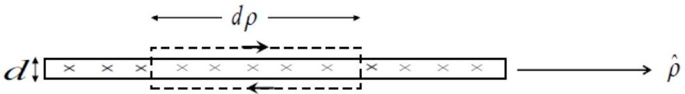
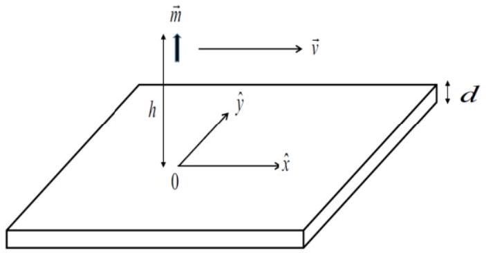

## Theory 3 Magnetic Levitation: Solution

Part A. Sudden appearance of a magnetic monopole: initial response and subsequent time evolution of the response in the thin film

Initial response

A. 1 In the $z \geq 0$ region, excluding the point occupied by the monopole, the magnetic field $\vec { B } = \vec { B } ^ { \prime } + \vec { B } _ { \mathrm { mp } }$ at $t = t _ { 0 } = 0$ is given by
$$
\begin{align*}
\vec { B } _ { \mathrm { mp } } & = \frac { \mu _ { 0 } q _ { \mathrm { m } } } { 4 \pi } \frac { ( z - h ) \hat { z } + \vec { \rho } } { \left[ ( z - h ) ^ { 2 } + \rho ^ { 2 } \right] ^ { 3 / 2 } } ,  \tag{A-1}\\
\vec { B } ^ { \prime } & = \frac { \mu _ { 0 } q _ { \mathrm { m } } } { 4 \pi } \frac { ( z + h ) \hat { z } + \vec { \rho } } { \left[ ( z + h ) ^ { 2 } + \rho ^ { 2 } \right] ^ { 3 / 2 } } ,  \tag{A-2}\\
\vec { B } & = \frac { \mu _ { 0 } q _ { \mathrm { m } } } { 4 \pi } \left[ \frac { ( z - h ) \hat { z } + \vec { \rho } } { \left[ ( z - h ) ^ { 2 } + \rho ^ { 2 } \right] ^ { 3 / 2 } } + \frac { ( z + h ) \hat { z } + \vec { \rho } } { \left[ ( z + h ) ^ { 2 } + \rho ^ { 2 } \right] ^ { 3 / 2 } } \right] . \tag{A-3}
\end{align*}
$$
A. 2 In the $z \leq - d$ region, the magnetic field $\vec { B } = \vec { B } ^ { \prime } + \vec { B } _ { \mathrm { mp } }$ at $t = t _ { 0 } = 0$ is given by $\vec { B } = 0$.
A. 3 From Eq. (A-3), $B _ { z } ^ { \prime } = 0$ at $z = 0$ for all $\rho$.
Therefore, the total magnetic flux $\Phi _ { \mathrm { B } } = 0$ at $z = 0$.
From Eq. (A-4), $B _ { Z } ^ { \prime } = 0$ at $z = - d$.
Therefore, the total magnetic flux $\Phi _ { \mathrm { B } } = 0$ at $z = - d$.
A. 4 Applying Ampere's law along the path shown in the figure below, and using the approximation $d \ll h$, we have
$$
\begin{equation*}
B _ { \rho } ( \rho , z = 0 ) d \rho = \mu _ { 0 } j ( \rho ) d \rho \cdot d , \tag{A-7}
\end{equation*}
$$
where the contributions from the $B _ { z } d$ terms are smaller by a factor $d / h$ and neglected.

The induced current density is given by
$$
\begin{equation*}
\vec { \jmath } ( \vec { \rho } ) = \frac { 1 } { \mu _ { 0 } d } \hat { z } \times \vec { B } ( \vec { \rho } , z = 0 ) = \frac { q _ { \mathrm { m } } } { 2 \pi d } \frac { \hat { z } \times \vec { \rho } } { \left( h ^ { 2 } + \rho ^ { 2 } \right) ^ { 3 / 2 } } . \tag{A-8}
\end{equation*}
$$

Subsequent response
A. 5 Consider the form of an integral of Eq.(2), in the Question sheet, over the film thickness, we get, for $z \approx 0$ inside the film (that is $z < 0$ and $| z | \ll d$ ), that

$$
\begin{equation*}
\left. \frac { \partial B _ { z } ^ { \prime } } { \partial z } \right| _ { z } - \left. \frac { \partial B _ { z } ^ { \prime } } { \partial z } \right| _ { - d - z } = \mu _ { 0 } \sigma ( d + 2 z ) \frac { \partial B _ { z } ^ { \prime } } { \partial t } \approx \mu _ { 0 } \sigma d \frac { \partial B _ { z } ^ { \prime } } { \partial t } . \tag{A-9}
\end{equation*}
$$

Since $B _ { z } ^ { \prime }$ is an even function of $z ^ { \prime } = z + d / 2$, therefore we have $\left. \frac { \partial B _ { z } ^ { \prime } } { \partial z } \right| _ { z } = - \left. \frac { \partial B _ { z } ^ { \prime } } { \partial z } \right| _ { - d - z }$ so that the left-hand side of Eq.(A-9) becomes $2 \frac { \partial } { \partial z } B _ { z } ^ { \prime } ( \rho , z ; t )$. The right-hand side is approximated by the $z$-independent term of $B _ { z } ^ { \prime }$ inside the film thickness. On the other hand, the $z$-dependent term of $B _ { Z } ^ { \prime }$ is even in $z ^ { \prime }$ and is of order $\sim z ^ { \prime 2 } d / h$ so that it can be neglected based on the $h \gg d$ condition. As such the right-hand side is represented by $B _ { z } ^ { \prime } ( \rho , z ; t )$. Putting these results together, we get

$$
\begin{align*}
& 2 \frac { \partial } { \partial z } B _ { z } ^ { \prime } ( \rho , z ; t ) = \mu _ { 0 } \sigma d \frac { \partial } { \partial t } B _ { z } ^ { \prime } ( \rho , z ; t ) \\
& \Rightarrow \frac { \partial } { \partial t } B _ { z } ^ { \prime } ( \rho , z ; t ) = v _ { 0 } \frac { \partial } { \partial z } B _ { z } ^ { \prime } ( \rho , z ; t ) . \tag{A-10}
\end{align*}
$$

Here $z \approx 0$, and $v _ { 0 } = 2 / \left( \mu _ { 0 } \sigma d \right)$.
A. 6 The equation in A.5, namely, Eq.(A-10) supports a solution of the form

$$
\begin{equation*}
B _ { z } ^ { \prime } ( \rho , z ; t ) = f \left( \rho , z + v _ { 0 } t \right) , \tag{A-11}
\end{equation*}
$$

and at $z \approx 0$.
A. 7 At $t = 0 , B _ { z } ^ { \prime } ( \rho , z \geq 0 ) = \frac { \mu _ { 0 } q _ { \mathrm { m } } } { 4 \pi } \frac { ( z + h ) } { \left[ ( z + h ) ^ { 2 } + \rho ^ { 2 } \right] ^ { 3 / 2 } }$, which is of the form

$$
\begin{equation*}
B _ { z } ^ { \prime } ( \rho , z \geq 0 ) = F ( \rho , z + h ) . \tag{A-12}
\end{equation*}
$$

For $t > 0$, we have according to Eq.(A-11), the replacement

$$
\begin{equation*}
z \rightarrow z + v _ { 0 } t , \text { to the } B _ { z } ^ { \prime } ( \rho , z ; t = 0 ) . \tag{A-13}
\end{equation*}
$$

In other words, $B _ { z } ^ { \prime } ( \rho , z \approx 0 ; t ) = F \left( \rho , z + v _ { 0 } t + h \right)$.
This corresponds to a physical picture of a moving image monopole, with its position

$$
\begin{equation*}
z _ { \mathrm { mp } } = - h - v _ { 0 } t . \tag{A-14}
\end{equation*}
$$

Finally, $\quad v _ { 0 } = 2 / \left( \mu _ { 0 } \sigma d \right)$.

## Part B. Magnetic force acting on a point-like magnetic dipole moving at a constant $h$ with a constant velocity

## A moving monopole

B. 1 The present locations of all the image magnetic monopoles of type $q _ { \mathrm { m } }$ are at

$$
\begin{equation*}
( x , z ) = \left[ - n v \tau , - h - n v _ { 0 } \tau \right] , \text { for } n \geq 0 . \tag{B-1}
\end{equation*}
$$

The locations of all the image magnetic monopoles $- q _ { \mathrm { m } }$ are at

$$
\begin{equation*}
( x , z ) = \left[ - ( n + 1 ) v \tau , - h - n v _ { 0 } \tau \right] \text {, for } n \geq 0 . \tag{B-2}
\end{equation*}
$$

B. 2 The magnetic potential $\Phi _ { + } ( x , z )$ due to all the image magnetic monopoles at $t = 0$ is given by, in summation form

$$
\begin{gather*}
\quad \Phi _ { + } ( x , z ) = \frac { \mu _ { 0 } q _ { m } } { 4 \pi } \sum _ { n = 0 } ^ { \infty } \frac { 1 } { \sqrt { ( x + n v \tau ) ^ { 2 } + \left( z + h + n v _ { 0 } \tau \right) ^ { 2 } } } - \frac { \mu _ { 0 } q _ { m } } { 4 \pi } \sum _ { n = 0 } ^ { \infty } \frac { 1 } { \sqrt { ( x + ( n + 1 ) v \tau ) ^ { 2 } + \left( z + h + n v _ { 0 } \tau \right) ^ { 2 } } } , \\
\Rightarrow \quad \Phi _ { + } ( x , z ) = \frac { \mu _ { 0 } q _ { m } } { 4 \pi } \sum _ { n = 0 } ^ { \infty } \left[ \frac { 1 } { \sqrt { ( x + n v \tau ) ^ { 2 } + \left( z + h + n v _ { 0 } \tau \right) ^ { 2 } } } - \frac { 1 } { \sqrt { ( x + ( n + 1 ) v \tau ) ^ { 2 } + \left( z + h + n v _ { 0 } \tau \right) ^ { 2 } } } \right] . \tag{B-3}
\end{gather*}
$$

In integral form

$$
\begin{align*}
\Phi _ { + } ( x , z ) & = \frac { \mu _ { 0 } q _ { m } } { 4 \pi \tau } \int _ { 0 } ^ { \infty } d t ^ { \prime } \left[ \frac { 1 } { \sqrt { \left( x + v t ^ { \prime } \right) ^ { 2 } + \left( z + h + v _ { 0 } t ^ { \prime } \right) ^ { 2 } } } - \frac { 1 } { \sqrt { \left( x + v t ^ { \prime } + v \tau \right) ^ { 2 } + \left( z + h + v _ { 0 } t ^ { \prime } \right) ^ { 2 } } } \right]  \tag{B-4}\\
& = \frac { \mu _ { 0 } q _ { m } } { 4 \pi \tau } \int _ { 0 } ^ { \infty } d t ^ { \prime } \frac { \left( x + v t ^ { \prime } \right) v \tau } { \left[ \left( x + v t ^ { \prime } \right) ^ { 2 } + \left( z + h + v _ { 0 } \tau \right) ^ { 2 } \right] ^ { 3 / 2 } }  \tag{B-5}\\
\Rightarrow \Phi _ { + } ( x , z ) & = \frac { \mu _ { 0 } q _ { m } v } { 4 \pi } \frac { 1 } { ( z + h ) v - v _ { 0 } x } \left[ \frac { z + h } { \sqrt { x ^ { 2 } + ( z + h ) ^ { 2 } } } - \frac { v _ { 0 } } { \sqrt { v ^ { 2 } + v _ { 0 } ^ { 2 } } } \right] \tag{B-6}
\end{align*}
$$

## A moving dipole

B. 3

The total magnetic potential

$$
\begin{equation*}
\Phi _ { \mathrm { T } } ( x , z ) = \Phi _ { + } ( x , z ) + \Phi _ { - } ( x , z ) , \tag{B-7}
\end{equation*}
$$

where $\Phi _ { - } ( x , z ) = - \Phi _ { + } \left( x , z - \delta _ { \mathrm { m } } \right)$.

$$
\begin{array} { r }
\Phi _ { \mathrm { T } } ( x , z ) = \Phi _ { + } ( x , z ) - \Phi _ { + } \left( x , z - \delta _ { \mathrm { m } } \right) \\
= \delta _ { \mathrm { m } } \times \partial \Phi _ { + } ( x , z ) / \partial z \tag{B-8}
\end{array}
$$

$$
\begin{equation*}
\Phi _ { \mathrm { T } } ( x , z ) = - \frac { \mu _ { 0 } m v } { 4 \pi } \left[ \frac { v } { \left[ ( z + h ) v - v _ { 0 } x \right] ^ { 2 } } \left( \frac { z + h } { \sqrt { x ^ { 2 } + ( z + h ) ^ { 2 } } } - \frac { v _ { 0 } } { \sqrt { v ^ { 2 } + v _ { 0 } ^ { 2 } } } \right) - \frac { x ^ { 2 } } { \left[ ( z + h ) v - v _ { 0 } x \right] \left[ x ^ { 2 } + ( z + h ) ^ { 2 } \right] ^ { 3 / 2 } } \right] . \tag{B-9}
\end{equation*}
$$

Force acting on the point-like magnetic dipole:

$$
\begin{gather*}
F _ { z } = - \left. q _ { m } \frac { d } { d z } \Phi _ { \mathrm { T } } ( 0 , z ) \right| _ { z = h } + \left. q _ { m } \frac { d } { d z } \Phi _ { \mathrm { T } } ( 0 , z ) \right| _ { z = h - \delta _ { \mathrm { m } } } .  \tag{B-10}\\
F _ { z } = - \frac { \mu _ { 0 } m q _ { \mathrm { m } } } { 2 \pi } \left( 1 - \frac { v _ { 0 } } { \sqrt { v ^ { 2 } + v _ { 0 } ^ { 2 } } } \right) \left[ \frac { 1 } { ( 2 h ) ^ { 3 } } - \frac { 1 } { \left( 2 h - \delta _ { \mathrm { m } } \right) ^ { 3 } } \right] .  \tag{B-11}\\
\Rightarrow \quad F _ { z } = \frac { 3 \mu _ { 0 } m ^ { 2 } } { 32 \pi h ^ { 4 } } \left[ 1 - \frac { v _ { 0 } } { \sqrt { v ^ { 2 } + v _ { 0 } ^ { 2 } } } \right] .  \tag{B-12}\\
F _ { x } = - \left. q _ { m } \frac { d } { d x } \Phi _ { \mathrm { T } } ( x , h ) \right| _ { x = 0 } + \left. q _ { m } \frac { d } { d x } \Phi _ { \mathrm { T } } \left( x , h - \delta _ { \mathrm { m } } \right) \right| _ { x = 0 } ,  \tag{B-13}\\
\Rightarrow \quad F _ { x } = - \frac { 3 \mu _ { 0 } m ^ { 2 } } { 32 \pi h ^ { 4 } } \frac { v _ { 0 } } { v } \left[ 1 - \frac { v _ { 0 } } { \sqrt { v ^ { 2 } + v _ { 0 } ^ { 2 } } } \right] . \tag{B-14}
\end{gather*}
$$

## Relation between $\boldsymbol { v } _ { \mathbf { 0 } }$ and $\boldsymbol { v }$ and their relation

B. 4

$$
\begin{equation*}
v _ { 0 } = \frac { 2 } { \mu _ { 0 } \sigma d } = \frac { 2 } { 4 \pi \times 10 ^ { - 7 } \times 5.9 \times 10 ^ { 7 } \times 0.5 \times 10 ^ { - 2 } } = 5.4 \mathrm {~m} / \mathrm { s } . \tag{B-15}
\end{equation*}
$$

B. 5 In the small $v$ regime, meaning that $v$ is smaller than a certain typical velocity of the system (or a critical velocity $v _ { \mathrm { c } }$ to be considered in the next task B.6) we have the characteristics basically akin to that of $v \approx 0$. For $v = 0$, the frequency $\omega$ is associated with $v _ { 0 } / h$. Making use of the parameters given in B.4, the skin depth (Eq.(3) in the question sheet) $\delta$ is given by

$$
\delta = \sqrt { \frac { 2 } { \omega \mu _ { 0 } \sigma } } = \sqrt { \frac { 2 h } { v _ { 0 } \mu _ { 0 } \sigma } } = 1.58 \text { c.m., which is more than three times greater than } d \text {. }
$$

Thus we have, in the small $v$ regime,

$$
\begin{equation*}
v _ { 0 } ( v ) = v _ { 0 } . \tag{B-16}
\end{equation*}
$$

In the large $v$ regime, we have the skin depth $\delta < d$ so that the effect thin film thickness

$$
\begin{equation*}
d _ { \mathrm { eff } } = \delta , \tag{B-17}
\end{equation*}
$$

within which the field is more or less uniform (i.e. $z$ independent).
In this case, $\omega = v / h$,
so the

$$
\begin{align*}
& v _ { 0 } ( v ) = \frac { 2 } { \mu _ { 0 } \sigma \delta } = \frac { 2 } { \mu _ { 0 } \sigma } \sqrt { \frac { \omega \mu _ { 0 } \sigma } { 2 } } = \sqrt { \frac { 2 } { \mu _ { 0 } \sigma } \frac { v } { h } } = \sqrt { \frac { d } { h } v v _ { 0 } } , \text { or } \\
& v _ { 0 } ( v ) = v _ { 0 } \sqrt { \frac { d } { h } } \sqrt { \frac { v } { v _ { 0 } } } \tag{B-19}
\end{align*}
$$

B. 6 The critical velocity $v _ { \mathrm { c } }$ is determined from the condition $\delta = d$ :

$$
\begin{equation*}
d = \sqrt { \frac { 2 } { \mu _ { 0 } \sigma v _ { \mathrm { c } } / h } } \Rightarrow v _ { \mathrm { c } } = \frac { 2 h } { d ^ { 2 } \mu _ { 0 } \sigma } = v _ { 0 } \frac { h } { d } . \tag{B-20}
\end{equation*}
$$

## Part C Motion of the magnetic dipole when the conducting thin film is superconducting

When the electrical conductivity $\sigma \rightarrow \infty$, the receding velocity $v _ { 0 } \rightarrow 0$ so that there will not be a whole series of image magnetic monopoles. Instead, the image is simply one image magnetic dipole mirroring the instantaneous position of the magnetic dipole. In this case, the image magnetic dipole is $\vec { m } = m \hat { x }$ located at the location $( x , y , z ) = ( 0,0 , - h )$. It is then clear, from the symmetry of the image configuration, that the force on the magnetic dipole from the image aligns only along $\hat { z }$. For our convenience, we take the magnetic monopole $- q _ { \mathrm { m } }$ to locate at $x =$ 0 , and for the magnetic monopole $q _ { \mathrm { m } }$ the location $x = \delta _ { \mathrm { m } }$.

## C. 1

The total magnetic potential $\Phi _ { \mathrm { T } } ( x , z )$ from the image magnetic dipole is

$$
\begin{equation*}
\Phi _ { \mathrm { T } } ( x , z ) = - \frac { \mu _ { 0 } q _ { \mathrm { m } } } { 4 \pi } \frac { 1 } { \sqrt { x ^ { 2 } + ( z + h ) ^ { 2 } } } + \frac { \mu _ { 0 } q _ { \mathrm { m } } } { 4 \pi } \frac { 1 } { \sqrt { \left( x - \delta _ { \mathrm { m } } \right) ^ { 2 } + ( z + h ) ^ { 2 } } } . \tag{C-1}
\end{equation*}
$$

## Approach 1:

The total vertical force $F _ { z } ^ { \prime }$ acting on the magnetic dipole from the image magnetic dipole is given by

$$
\begin{equation*}
F _ { z } ^ { \prime } = \left. \left( - q _ { \mathrm { m } } \right) \left[ - \frac { \partial } { \partial z } \Phi _ { \mathrm { T } } \right] \right| _ { \substack { x = 0 , z = h } } + \left. q _ { \mathrm { m } } \left[ - \frac { \partial } { \partial z } \Phi _ { \mathrm { T } } \right] \right| _ { \substack { x = \delta , z = h } } \tag{C-2}
\end{equation*}
$$

$$
\begin{aligned}
F _ { z } ^ { \prime } = & \left. \frac { \mu _ { 0 } q _ { \mathrm { m } } ^ { 2 } } { 4 \pi } \frac { z + h } { \left[ x ^ { 2 } + ( z + h ) ^ { 2 } \right] ^ { 3 / 2 } } \right| _ { \substack { x = 0 , z = h } } - \left. \frac { \mu _ { 0 } q _ { \mathrm { m } } ^ { 2 } } { 4 \pi } \frac { z + h } { \left[ \left( x - \delta _ { \mathrm { m } } \right) ^ { 2 } + ( z + h ) ^ { 2 } \right] ^ { 3 / 2 } } \right| _ { \substack { x = 0 , z = h } } \\
& - \left. \frac { \mu _ { 0 } q _ { \mathrm { m } } ^ { 2 } } { 4 \pi } \frac { z + h } { \left[ x ^ { 2 } + ( z + h ) ^ { 2 } \right] ^ { 3 / 2 } } \right| _ { \substack { x = \delta _ { \mathrm { m } } , z = h } } + \left. \frac { \mu _ { 0 } q _ { \mathrm { m } } ^ { 2 } } { 4 \pi } \frac { z + h } { \left[ \left( x - \delta _ { \mathrm { m } } \right) ^ { 2 } + ( z + h ) ^ { 2 } \right] ^ { 3 / 2 } } \right| _ { \substack { x = \delta _ { \mathrm { m } } , z = h } } ,
\end{aligned}
$$

$$
\begin{equation*}
F _ { z } ^ { \prime } = 2 \frac { \mu _ { 0 } q _ { m } ^ { 2 } } { 4 \pi } \left( \frac { 1 } { 2 h } \right) ^ { 2 } \left[ 1 - \frac { 1 } { \left( 1 + \left( \frac { \delta } { 2 h } \right) ^ { 2 } \right) ^ { 3 / 2 } } \right] . \tag{C-3}
\end{equation*}
$$

$$
\begin{equation*}
F _ { z } ^ { \prime } = \frac { 3 \mu _ { 0 } m ^ { 2 } } { 64 \pi h ^ { 4 } } . \tag{C-4}
\end{equation*}
$$

Equilibrium condition:

$$
\begin{align*}
& F _ { z } ^ { \prime } - M _ { 0 } g = 0 ,  \tag{C-5}\\
& \Rightarrow \quad \frac { 3 \mu _ { 0 } m ^ { 2 } } { 64 \pi h _ { 0 } ^ { 4 } } = M _ { 0 } g , \\
& \Rightarrow \quad h _ { 0 } = \left[ \frac { 3 \mu _ { 0 } m ^ { 2 } } { 64 \pi M _ { 0 } g } \right] ^ { \frac { 1 } { 4 } } . \tag{C-6}
\end{align*}
$$

## Approach 2:

We can use the direct force calculation.

$$
\begin{align*}
F _ { Z } ^ { \prime } & = 2 \frac { \mu _ { 0 } q _ { \mathrm { m } } ^ { 2 } } { 4 \pi } \left[ \left( \frac { 1 } { 2 h } \right) ^ { 2 } - \frac { 2 h } { \left( \delta _ { m } ^ { 2 } + ( 2 h ) ^ { 2 } \right) ^ { 3 / 2 } } \right]  \tag{C-7}\\
& = \frac { \mu _ { 0 } q _ { \mathrm { m } } ^ { 2 } } { 2 \pi } \left( \frac { 1 } { 2 h } \right) ^ { 2 } \left[ 1 - \frac { 1 } { \left( 1 + \left( \frac { \delta } { 2 h } \right) ^ { 2 } \right) ^ { 3 / 2 } } \right]  \tag{C-8}\\
& = \frac { 3 \mu _ { 0 } m ^ { 2 } } { 64 \pi h ^ { 4 } }
\end{align*}
$$

The equilibrium condition $F _ { z } ^ { \prime } - M _ { 0 } g = 0$ gives the same equilibrium position $h _ { 0 }$ as in Eq. (C-6),

$$
\Rightarrow \quad h _ { 0 } = \left[ \frac { 3 \mu _ { 0 } m ^ { 2 } } { 64 \pi M _ { 0 } g } \right] ^ { \frac { 1 } { 4 } } .
$$

## C. 2

The oscillation frequency about the equilibrium is obtained from

$$
\begin{equation*}
F _ { z } ^ { \prime } \approx M _ { 0 } + \frac { d F _ { z } ^ { \prime } } { d z } \Delta z , \tag{C-9}
\end{equation*}
$$

where $\Delta z = z - h _ { 0 }$.

$$
\begin{equation*}
\text { And from } \frac { d F _ { z } ^ { \prime } } { d z } = - k = - M _ { 0 } \Omega ^ { 2 } \tag{C-10}
\end{equation*}
$$

we have

$$
\begin{equation*}
k = - \frac { d } { d z } \frac { 3 \mu _ { 0 } m ^ { 2 } } { 64 \pi h ^ { 4 } } = \frac { 3 \mu _ { 0 } m ^ { 2 } } { 16 \pi h _ { 0 } ^ { 5 } } = \frac { 4 } { h _ { 0 } } \frac { 3 \mu _ { 0 } m ^ { 2 } } { 64 \pi h _ { 0 } ^ { 4 } } = \frac { 4 M _ { 0 } g } { h _ { 0 } } = M _ { 0 } \Omega ^ { 2 } \tag{C-11}
\end{equation*}
$$

The angular oscillation frequency

$$
\begin{equation*}
\Omega = \sqrt { \frac { 4 g } { h _ { 0 } } } . \tag{C-12}
\end{equation*}
$$

C. 3

$$
\begin{equation*}
h _ { 0 } = \left[ \frac { 3 \mu _ { 0 } \left( \frac { 4 } { 3 } \pi R ^ { 3 } M \right) ^ { 2 } } { 64 \pi \left( \frac { 4 } { 3 } \pi R ^ { 3 } \rho _ { 0 } g \right) } \right] ^ { 1 / 4 } = \left[ \frac { R ^ { 3 } M ^ { 2 } \mu _ { 0 } } { 16 \rho _ { 0 } g } \right] ^ { 1 / 4 } \tag{C-13}
\end{equation*}
$$

$$
\begin{equation*}
h _ { 0 } = \left[ \frac { 10 ^ { - 18 } \times 75 ^ { 2 } \times 10 ^ { - 4 } } { 16 \times 7400 \times 9.8 \times \mu _ { 0 } } \right] ^ { 1 / 4 } \mathrm {~m} = 25 . \mu \mathrm { m } . \tag{C-14}
\end{equation*}
$$

C. $4 \Omega = \sqrt { \frac { 4 g } { h _ { 0 } } } = \sqrt { \frac { 4 \times 9.8 } { 30 \times 10 ^ { - 6 } } } \mathrm {~s} ^ { - 1 } = 1.3 \mathrm { kHz }$.
