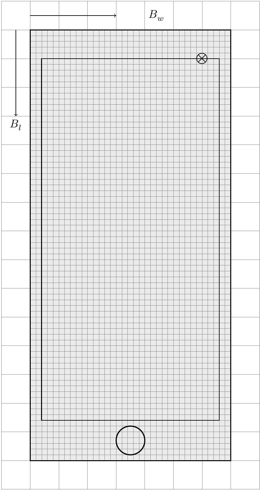
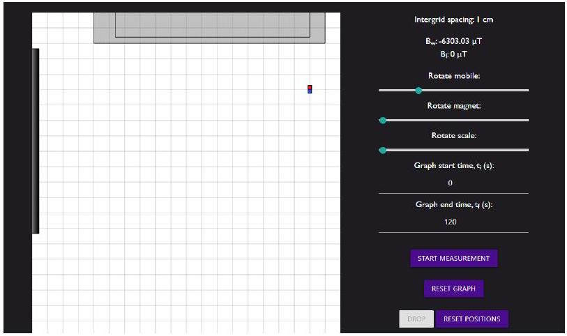
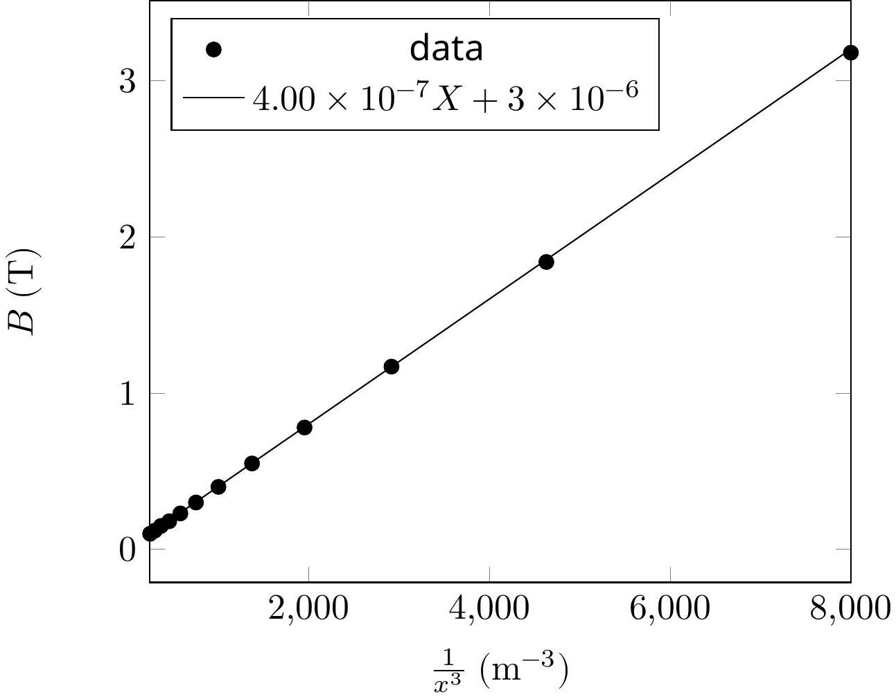
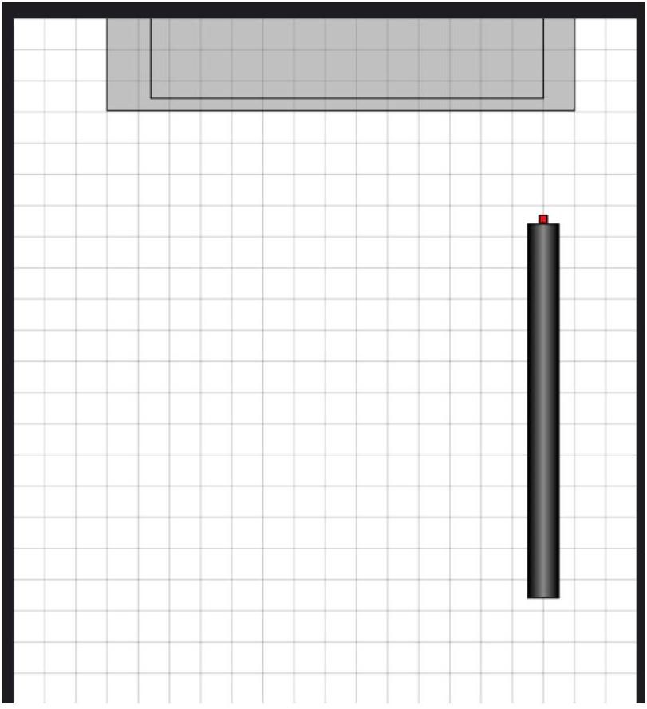
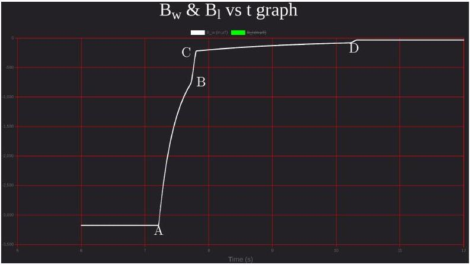
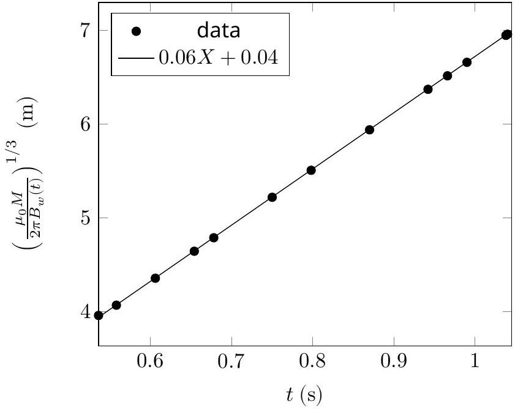
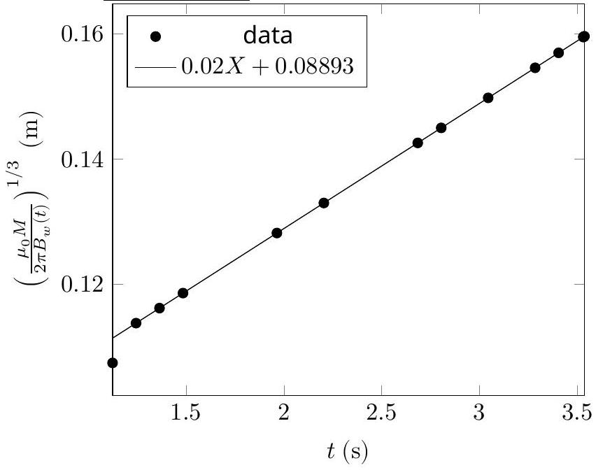
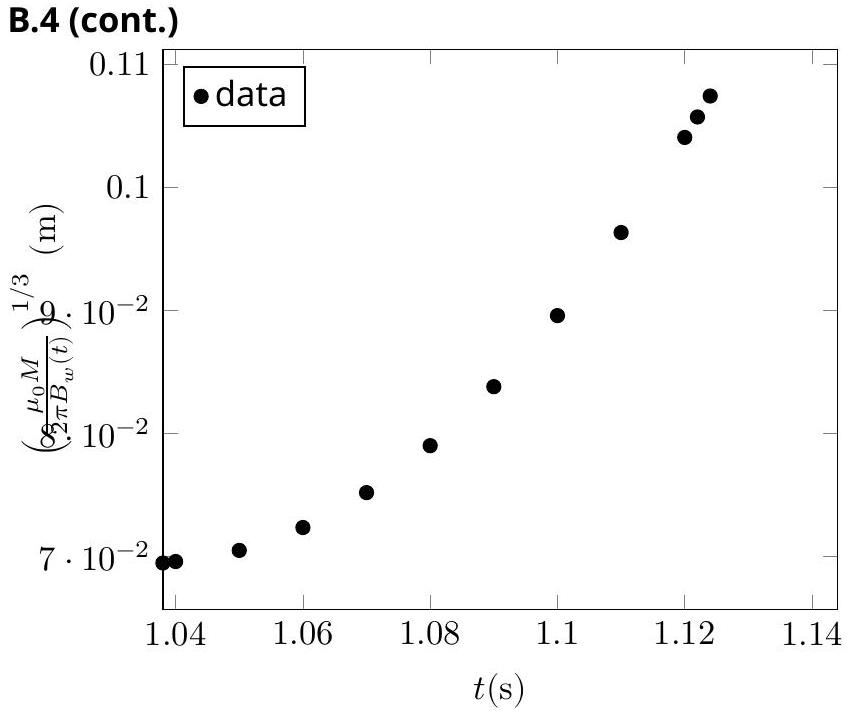

## EQ1: Official Solution ${ } ^ { 1 }$

A. 1 (1.0 pt)
Move the magnet along each of the axes and notice the change in the magnet field. For example, if the magnet is aligned along the length of the phone, and you are moving the magnet along the same direction (length of the phone), magnetic field will show the change in sign when the magnet crosses the Magnetometer.

Figure. 1

[^0]
A. 2 (2.3 pt)
The set up to find Dipole moment

The magnetic field $B _ { w }$ of a point dipole at the distance $x ( x \gg d )$ from the dipole's center can be approximated by

$$
\begin{equation*}
B _ { w } = \frac { \mu _ { 0 } } { 2 \pi } \frac { M } { x ^ { 3 } } \tag{1}
\end{equation*}
$$

Rearranging above equation, we get

$$
\begin{equation*}
B _ { w } = \frac { \mu _ { 0 } M } { 2 \pi } \times \frac { 1 } { x ^ { 3 } } \tag{2}
\end{equation*}
$$

From equation (2), a plot of $B _ { w }$ vs $\frac { 1 } { x ^ { 3 } }$ is a straight line passing through origin. Solving the slope will give dipole moment of the magnet.

A. 2 (cont.)
Dipole moment of the Magnet:
Fill the appropriate quantities.

| Sr.No | $x ( \mathrm {~cm} )$ | $B _ { w } ( \mu \mathrm {~T} )$ | $\frac { 1 } { x ^ { 3 } } \left( \mathrm {~m} ^ { - 3 } \right)$ | $B _ { w }$ (T) |
| :--- | :--- | :--- | :--- | :--- |
| 1 | 5 | 3177.63 | 8000 | 0.00317763 |
| 2 | 6 | 1841.06 | 4629.63 | 0.00184106 |
| 3 | 7 | 1170.34 | 2915.45 | 0.00117034 |
| 4 | 8 | 783.69 | 1953.13 | 0.00078369 |
| 5 | 9 | 550.22 | 1371.74 | 0.00055022 |
| 6 | 10 | 403.42 | 1000 | 0.00040342 |
| 7 | 11 | 301.21 | 751.31 | 0.00030121 |
| 8 | 12 | 231.96 | 578.7 | 0.00023197 |
| 9 | 13 | 181.58 | 455.17 | 0.00018158 |
| 10 | 14 | 146.03 | 364.43 | 0.00014603 |
| 11 | 15 | 118.72 | 296.3 | 0.00011872 |
| 12 | 16 | 98.18 | 244.14 | 0.000099 |

From equation (2), a plot of $B _ { w }$ vs $\frac { 1 } { x ^ { 3 } }$ is a straight line passing through the origin. The magnitude of the dipole moment can be calculated from the slope.

A. 2 (cont.)
Graph of $B _ { w }$ vs $\frac { 1 } { x ^ { 3 } }$

$$
\cdot 10 ^ { - 3 }
$$

Slope of the graph: $4.00 \times 10 ^ { - 7 } \mathrm { Nm } ^ { 2 } / \mathrm { A }$
Dipole moment of the magnet: $2.00 \mathrm { Am } ^ { 2 }$

## A1-5   Official (English)

B. 1 (0.3 pt)
Rotate the smartphone and align the magnet and the pipe along the width of the phone as shown below.

Consider the case when the magnet is at rest at a distance $x _ { 0 }$ from the magnetometer origin. The magnet is released along the axis of the pipe. It will start descending through the pipe. In the conducting sections of the pipe, after a brief period of accelerated motion, the magnet will attain a terminal velocity $v$, due to the presence of eddy current damping. In this case, the magnetic field $B _ { w }$ measured by the magnetometer changes with time $t$ as

$$
\begin{equation*}
B _ { w } ( t ) = \frac { \mu _ { 0 } } { 2 \pi } \frac { M } { \left( x _ { 0 } + v t \right) ^ { 3 } } \tag{3}
\end{equation*}
$$

Equation (3) is rearranged as

$$
\begin{equation*}
\left( \frac { \mu _ { 0 } M } { 2 \pi B _ { w } ( t ) } \right) ^ { 1 / 3 } = v t + x _ { 0 } \tag{4}
\end{equation*}
$$

## A1-6   Official (English)

B. 1 (cont.)
Obtained profile of magnetic field vs time clearly suggests three distinct phases (AB, BC, and CD) of the magnet's motion (see Fig. 4 below).

Figure (4)

We collect the data of ( $B _ { w }$ vs $t$ ) for all three phases and plot them according to Eq. (4). For the acceleration phase of the pipe (wooden section), the graph will be non-linear and for the conducting pipe sections (AI and Cu) where the magnet moves with the terminal velocities, the graph will be linear. Duration of accelerated motion before attaining terminal velocity in the conducting sections of the pipe may be neglected.
It can be clearly seen from the graphs in the next sub parts that:

| Section | Section number |
| :--- | :--- |
| Aluminium | 1 |
| Copper | 3 |
| wood | 2 |

Since the copper has higher conductivity than aluminium, the terminal velocity in Cu section will be lower than AI section.

B. 2 (2.6 pt)
Terminal velocity of Magnet in aluminium section:
Fill the appropriate quantities.

| Sr.No | $B _ { w } ( \mu \mathrm {~T} )$ | $t ( \mathrm {~s} )$ | $\left( \frac { \mu _ { 0 } M } { 2 \pi B _ { w } ( t ) } \right) ^ { 1 / 3 } ( \mathrm {~m} )$ | $v ( \mathrm {~m} / \mathrm { s } )$ |
| :--- | :--- | :--- | :--- | :--- |
| 1 | 6462.28 | 0.534 | 0.0396 | 0 |
| 2 | 6462.28 | 0.536 | 0.0396 | 0.01 |
| 3 | 5954.24 | 0.558 | 0.0407 | 0.06 |
| 4 | 4850.05 | 0.606 | 0.0435 | 0.06 |
| 5 | 4002.02 | 0.654 | 0.0464 | 0.06 |
| 6 | 3651.48 | 0.678 | 0.0478 | 0.06 |
| 7 | 2817.43 | 0.75 | 0.0522 | 0.06 |
| 8 | 2397.97 | 0.798 | 0.055 | 0.06 |
| 9 | 1911.68 | 0.87 | 0.0594 | 0.06 |
| 10 | 1548.47 | 0.942 | 0.0637 | 0.06 |
| 11 | 1448.01 | 0.966 | 0.0651 | 0.06 |
| 12 | 1356.06 | 0.99 | 0.0666 | 0.06 |
| 13 | 1194.26 | 1.038 | 0.0694 | 0.06 |
| 14 | 1188.09 | 1.04 | 0.0696 | 0.14 |
| 15 | 1142.95 | 1.05 | 0.071 |  |

The velocity $( v )$ column is obtained using the forward difference $\frac { x _ { n + 1 } - x _ { n } } { t _ { n + 1 } - t _ { n } }$.
From equation (4), a plot of $\left( \frac { \mu _ { 0 } M } { 2 \pi B _ { w } ( t ) } \right) ^ { 1 / 3 }$ vs $t$ will be a straight line. The slope of the line will give terminal velocity .

B. 2 (cont.)
Graph of $\left( \frac { \mu _ { 0 } M } { 2 \pi B _ { w } ( t ) } \right) ^ { 1 / 3 }$ vs $t$ $\cdot 10 ^ { - 2 }$

Slope of the graph: $6 \mathrm {~cm} / \mathrm { s }$.

Terminal velocity of the magnet in aluminium section: 6 cm/s

Length of the aluminium section:

Slope of the graph: Not used Intercept of the graph: Not used

Values in the fourth column in the above table actually represents the distance of the magnet from the magnetometer. We calculate the velocity (column 5) of the magnet using the forward difference method. Notice that the magnetic field starts to change at 0.536 s. Hence this is the point at which the magnet starts descending. It quickly achieves the terminal velocity of 6 cm/s. A change in velocity (or departure from the flat line in $v$ vs $t$ curve, if you plot) occurs at 1.040 s. This suggests that the magnet moved out of the aluminium section of the pipe at this time.

Length of the Al section $= ( 1.040 - 0.536 ) \times 6 \mathrm {~cm} = 3.024 \mathrm {~cm}$.

B. 3 (2.2 pt)
Terminal velocity of magnet in copper section:
Fill the appropriate quantities.

| Sr.No | $B _ { w } ( \mu \mathrm {~T} )$ | $t ( \mathrm {~s} )$ | $\left( \frac { \mu _ { 0 } M } { 2 \pi B _ { w } ( t ) } \right) ^ { 1 / 3 } ( \mathrm {~m} )$ | $v ( \mathrm {~m} / \mathrm { s } )$ |
| :--- | :--- | :--- | :--- | :--- |
| 1 | 338.23 | 1.122 | 0.106 | 0.85 |
| 2 | 322.39 | 1.124 | 0.1075 | 0.87 |
| 3 | 271.32 | 1.244 | 0.1138 | 0.02 |
| 4 | 254.86 | 1.364 | 0.1162 | 0.02 |
| 5 | 239.70 | 1.484 | 0.1186 | 0.02 |
| 6 | 189.79 | 1.964 | 0.1282 | 0.02 |
| 7 | 169.97 | 2.204 | 0.1330 | 0.02 |
| 8 | 137.91 | 2.684 | 0.1426 | 0.02 |
| 9 | 131.17 | 2.804 | 0.1450 | 0.02 |
| 10 | 118.96 | 3.044 | 0.1498 | 0.02 |
| 11 | 108.22 | 3.284 | 0.1546 | 0.02 |
| 12 | 103.34 | 3.404 | 0.1570 | 0.02 |
| 13 | 98.52 | 3.53 | 0.1595 | 0.02 |
| 14 | 98.44 | 3.532 | 0.1596 | 0.02 |
| 15 | 98.37 | 3.534 | 0.1596 | 0.02 |
| 16 | 98.30 | 3.536 | 0.1597 | 0.05 |
| 17 | 98.22139 | 3.538 | 0.1597 |  |

The velocity $( v )$ column is obtained using the forward difference $\frac { x _ { n + 1 } - x _ { n } } { t _ { n + 1 } - t _ { n } }$.
From equation (4), a plot of $\left( \frac { \mu _ { 0 } M } { 2 \pi B _ { w } ( t ) } \right) ^ { 1 / 3 }$ vs $t$ will be a straight line. The slope of the line will give the terminal velocity.

B. 3 (cont.)

Graph of $\left( \frac { \mu _ { 0 } M } { 2 \pi B _ { w } ( t ) } \right) ^ { 1 / 3 }$ vs $t$

Slope of the graph: 2 cm/s.
Terminal velocity of magnet in copper section: 2 cm/s

Length of copper section:

Slope of the graph: Not used Intercept of the graph:Not used

Length of the copper section of the pipe can be calculated by $v _ { c } t _ { c }$, where $v _ { c }$ is the terminal velocity of the magnet in the copper section of the pipe and $t _ { c }$ is the time spent by the magnet in the copper section of the pipe.
Data in the above table suggests that the magnet enters the copper section at 1.124 s , and it leaves the copper section of the pipe at 3.536 s where we see sudden velocity change.
Length of the copper section $= ( 3.536 - 1.124 ) \times 2 \mathrm {~cm} = 4.824 \mathrm {~cm}$.

B. 4 (1.6 pt)
Length of wooden section:
Fill the appropriate quantities.

| Sr.No | $B _ { w } ( \mu \mathrm {~T} )$ | $t ( \mathrm {~s} )$ | $\left( \frac { \mu _ { 0 } M } { 2 \pi B _ { w } ( t ) } \right) ^ { 1 / 3 } ( \mathrm {~m} )$ | $v ( \mathrm {~m} / \mathrm { s } )$ | $a \left( \mathrm {~m} / \mathrm { s } ^ { 2 } \right)$ |
| :--- | :--- | :--- | :--- | :--- | :--- |
| 1 | 1194.26 | 1.038 | 0.0694 | 0.06 | 4 |
| 2 | 1188.09 | 1.04 | 0.070 | 0.14 | 5.66 |
| 3 | 1142.95 | 1.05 | 0.071 | 0.15 | 9.8 |
| 4 | 1056.94 | 1.06 | 0.072 | 0.25 | 9.8 |
| 5 | 941.55 | 1.07 | 0.075 | 0.34 | 9.8 |
| 6 | 811.40 | 1.08 | 0.079 | 0.44 | 9.8 |
| 7 | 679.75 | 1.09 | 0.084 | 0.54 | 9.8 |
| 8 | 556.44 | 1.1 | 0.090 | 0.64 | 9.8 |
| 9 | 447.31 | 1.11 | 0.096 | 0.74 | 9.8 |
| 10 | 354.74 | 1.12 | 0.104 | 0.83 | 9.8 |
| 11 | 338.23 | 1.122 | 0.106 | 0.85 | -334.92 |
| 12 | 322.39 | 1.124 | 0.108 | 0.18 | 0.31 |
| 13 | 271.32 | 1.244 | 0.114 |  |  |

The velocity $( v )$ and acceleration $( a )$ columns are obtained using the forward difference $\frac { x _ { n + 1 } - x _ { n } } { t _ { n + 1 } - t _ { n } }$ and $\frac { v _ { n + 1 } - v _ { n } } { t _ { n + 1 } - t _ { n } }$ respectively.

Wooden section is the middle section of the pipe. We have already established in AI section that the magnet exits the AI section at 1.040 s. We tabulate the data of velocity vs time for this section. Notice that the velocity of the magnet suddenly drops at 1.124 s. At this moment, the magnet enters in the copper section of the pipe and comes under the influence of damping due to the eddy current.
Length of the pipe can be calculated by $\left( v _ { \mathrm { Al } } t _ { w } + \frac { g t _ { w } ^ { 2 } } { 2 } \right)$, where $v _ { \mathrm { Al } }$ is terminal velocity of magnet in the aluminium section of the pipe and $t _ { w }$ is the time spent by the magnet in the wooden section of the pipe.
Total time spent by the magnet in the wooden pipe $\left( t _ { w } \right) = ( 1.124 - 1.040 ) \mathrm { s } = 0.084 \mathrm {~s}$ Length of the wooden section of pipe $= 3.96 \mathrm {~cm}$

[^0]:    ${ } ^ { 1 }$ Chandan Relekar (IISc, Bangalore), Siddhant Mukherjee (The University of Cambridge, UK), Siddharth Tiwary (IIT Powai, Mumbai), Charudutt Kadolkar (IIT Guwahati), Praveen Pathak (HBCSE-TIFR, Mumbai), were the principal authors of this problem. The contributions of the Academic Committee and the International Board are gratefully acknowledged.
