## EQ2: Acoustic black box solution ${ } ^ { 1 }$

A. 1 (0.2 pt)

$$
\begin{align*}
& x ( t ) = v _ { s } t \cos ( \beta ) + R \cos ( \omega t + \phi ) + \mathrm { X } _ { \mathrm { C } }  \tag{1}\\
& y ( t ) = v _ { s } t \sin ( \beta ) + R \sin ( \omega t + \phi ) + \mathrm { Y } _ { \mathrm { C } } \tag{2}
\end{align*}
$$

A. 2 (1.2 pt)
Figure below shows the graph obtained for the data point interval 0.02.
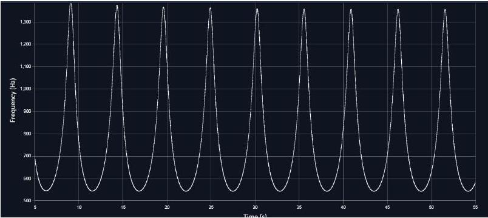

| Sr no | $t$ (s) | $f _ { \text {min } }$ |
| :--- | :--- | :--- |
| 1 | 6.26 | 545.36 |
| 2 | 11.52 | 544.4 |
| 3 | 16.82 | 544.03 |
| 4 | 22.14 | 543.85 |
| 5 | 27.46 | 543.75 |
| 6 | 32.8 | 543.69 |
| 7 | 38.14 | 543.65 |
| 8 | 43.5 | 543.62 |
| 9 | 48.84 | 543.59 |
| 10 | 54.18 | 543.58 |

[^0]
A. 2 (cont.)
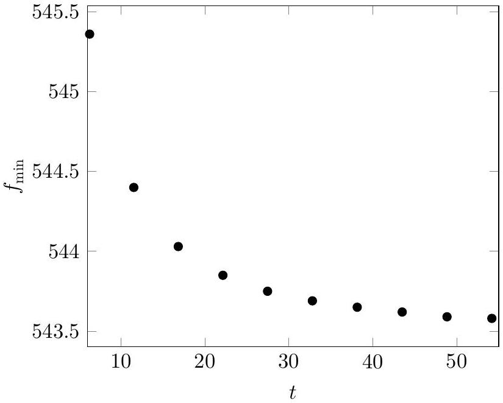
A. 3 (1.0 pt)

We take a general case in which both detector and the source are moving with velocities $v _ { d }$ and $v _ { s }$ respectively. Also, the line joining source and detector makes angle $\alpha$ with the $x$-axis as defined in fig. 1 of the question.
Note that $\alpha$ is a function of time. Let $\hat { n }$ be the vector joining the source and the detector. For the case when the source is approaching the detector, frequency detected by the detector is

$$
\begin{align*}
f \left( t ^ { \prime } \right) & = f _ { 0 } \frac { c - v _ { d } \cdot \hat { n } ( t ) } { c - \vec { v } _ { \mathrm { T } } \cdot \hat { n ( t ) } }  \tag{3}\\
& = f _ { 0 } \frac { c - v _ { d } \cos ( \gamma - \alpha ( t ) ) } { c - \left[ \left( \vec { v } _ { s } + R \omega \hat { \theta } \right) \cdot \hat { n } ( t ) \right] }  \tag{4}\\
& = f _ { 0 } \frac { c - v _ { d } \cos ( \gamma - \alpha ( t ) ) } { c - \left[ \left( v _ { s } \cos ( \beta - \alpha ( t ) ) + R \omega \cos ( \omega t + \phi + \pi / 2 - \alpha ) \right) \right] }  \tag{5}\\
& = f _ { 0 } \frac { c - v _ { d } \cos ( \gamma - \alpha ) } { c - \left[ \left( v _ { s } \cos ( \beta - \alpha ( t ) ) - R \omega \sin ( \omega t + \phi - \alpha ( t ) ) \right] \right. } \tag{6}
\end{align*}
$$

Similarly, for the source moving away from the detector

$$
\begin{equation*}
f \left( t ^ { \prime } \right) = f _ { 0 } \frac { c - v _ { d } \cos ( \gamma - \alpha ) } { c + \left[ \left( v _ { s } \cos ( \beta - \alpha ( t ) ) - R \omega \sin ( \omega t + \phi - \alpha ( t ) ) \right] \right. } \tag{7}
\end{equation*}
$$

The expression of minimum frequency in the asymptotic limit ( $t \rightarrow \infty$ ) is

$$
\begin{equation*}
f _ { \text {min } } = f _ { 0 } \frac { c } { c + \left[ \left( v _ { s } + R \omega \right) \right] } \tag{8}
\end{equation*}
$$

A. 4 (1.4 pt)

Initial location of the source: Keep the detector first on the $x$-axis (say $x _ { 1 } , 0 ^ { \circ }$ ) and then on the $y$-axis (say $y _ { 1 } , 90 ^ { \circ }$ ) and from the graph, note down the time taken to reach the first signal to the detector. Lets denote these timings as $\Delta t _ { x 1 }$ and $\Delta t _ { y 1 }$ respectively. Then,

$$
\begin{align*}
& \left( x - x _ { 1 } \right) ^ { 2 } + y ^ { 2 } = \left( c \Delta t _ { x 1 } \right) ^ { 2 }  \tag{9}\\
& x ^ { 2 } + \left( y - y _ { 1 } \right) ^ { 2 } = \left( c \Delta t _ { y 1 } \right) ^ { 2 } \tag{10}
\end{align*}
$$

Solving above two equations will give the coordinates of the source. From the simulation, for $x _ { 1 } =$ $y _ { 1 } = 500 \mathrm {~m} , \Delta t _ { x 1 } = 1.5344 \mathrm {~s}$ and $\Delta t _ { y 1 } = 1.2727 \mathrm {~s}$. Above equations have two solutions. We can keep the detector at third location to choose the correct pair. The answer is

$$
x _ { \mathrm { A } } = 419.99 , y _ { \mathrm { A } } = 499.99
$$

A. 5 (2.1 pt)
Let the detector be at such a position where the source approaches the detector from a large distance (say from left side), crosses it and then moves away at a large distance (to the right side). In the asymptotic limits (far left and far right, $\beta \approx \alpha$ ), two pairs of the frequencies will be detected by the detector. We take $v _ { d } = 0$. On the far left side

$$
\begin{align*}
& f _ { \max } = f _ { 0 } \frac { c } { c - \left( v _ { s } + \omega R \right) }  \tag{11}\\
& f _ { \min } = f _ { 0 } \frac { c } { c - \left( v _ { s } - \omega R \right) } \tag{12}
\end{align*}
$$

On the far right side

$$
\begin{align*}
& f _ { \max } = f _ { 0 } \frac { c } { c + \left( v _ { s } - \omega R \right) }  \tag{13}\\
& f _ { \min } = f _ { 0 } \frac { c } { c + \left( v _ { s } + \omega R \right) } \tag{14}
\end{align*}
$$

Eqs. (11) and (12) yields

$$
\begin{equation*}
\frac { f _ { \max } + f _ { \min } } { f _ { \max } - f _ { \min } } = \frac { c - v _ { s } } { \omega R } \tag{15}
\end{equation*}
$$

Eqs. (13) and (14) yields

$$
\begin{equation*}
\frac { f _ { \max } + f _ { \min } } { f _ { \max } - f _ { \min } } = \frac { c + v _ { s } } { \omega R } \tag{16}
\end{equation*}
$$

It is also given that at $t = 0$, there is a finite distance between the source and the detector. This will cause a signal delay. Let $\Delta t$ be the time interval between two peaks $\left( f _ { \text {max } } \right)$. In this case

$$
\begin{equation*}
\Delta t = \frac { 2 \pi } { \omega } \left( 1 + \frac { v _ { s } } { c } \right) \tag{17}
\end{equation*}
$$

Eqs. (15-17) can be solved together to obtain the values of $v _ { s } , \omega$, and $R$. It is necessary to keep the stationary detector at such coordinates (say $x _ { D } , y _ { D }$ ), so that the source approaches the detector from a large distance, crosses it and then moves away to a large distance. Note that the asymptotic behaviour can be identified in the region where the extrema in the graph remains almost constant. Also, we expect a sharp change in the graph if the detector's distance from the origin is such that the angle $\alpha \approx \beta$. Keeping the distance fixed at 8000 m, we try with various values of $\theta$.

A. 5 (cont.)

| 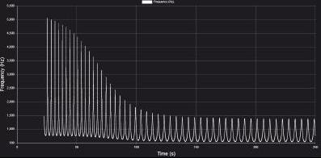 | 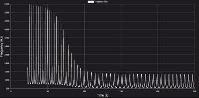 | 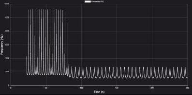 |
| :--- | :--- | :--- |
| 10° | 20° | 30° |
| 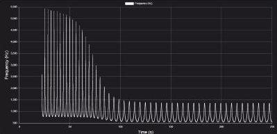 | 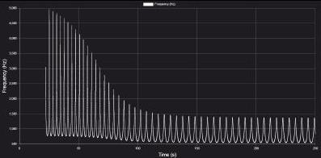 | 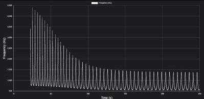 |
| 40° | $50 ^ { \circ }$ | 60° |
|  | 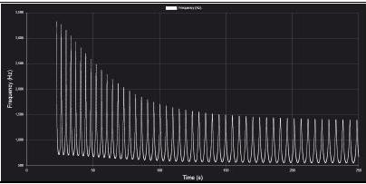 | 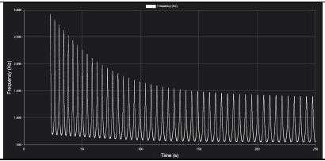 |
| 70° | 80° | $90 ^ { \circ }$ |

We can see that at $\theta = 30 ^ { \circ }$, far left and right parts of the graph show asymptotic behaviour. In these regions, peak frequencies do not show appreciable change. Notice that the values of the peak frequencies in the left side of the graph is higher than the values of the peak frequencies in the right side of the graph in this region. This indicates that the source is moving away from the detector in the right side of the graph. Detector is placed somewhere in the transient region. Expand the graph for a far left region this gives with a decreased data point interval (say 0.001) for a more accurate $f _ { \text {max } }$ and $f _ { \text {min } }$ numbers.
$f _ { \text {min } } = 788.24 \mathrm {~Hz}$ and $f _ { \text {max } } = 5569.59 \mathrm {~Hz}$. Inserting this in Eq. (11)

$$
\begin{equation*}
\frac { f _ { \max } + f _ { \min } } { f _ { \max } - f _ { \min } } = 1.33 = \frac { c - v _ { s } } { \omega R } \tag{18}
\end{equation*}
$$

Far right region gives
$f _ { \text {min } } = 543.96 \mathrm {~Hz}$ and $f _ { \text {max } } = 1353.45 \mathrm {~Hz}$. Inserting this in Eq. (12)

$$
\begin{equation*}
\frac { f _ { \max } + f _ { \min } } { f _ { \max } - f _ { \min } } = 2.34 = \frac { c + v _ { s } } { \omega R } \tag{19}
\end{equation*}
$$

equations (18-19) yields $v _ { s } = 91.1 \mathrm {~m} / \mathrm { s }$ and $\omega R = 179.66 \mathrm {~m} / \mathrm { s }$. Also,for any two peaks in asymptotic case

$$
\begin{equation*}
\Delta t = 148.84 - 143.48 = 5.36 = \frac { 2 \pi } { \omega } \left( 1 + \frac { v _ { s } } { c } \right) \tag{20}
\end{equation*}
$$

We use the value of $v _ { s } = 91.1 \mathrm {~m} / \mathrm { s }$ to get $\omega = 1.49 \mathrm { rad } \mathrm { s } ^ { - 1 }$. From $\omega R = 179.66 \mathrm {~m} / \mathrm { s } , R = 120.57 \mathrm {~m}$. To obtain $f _ { 0 }$, insert $f _ { \text {min } } = 5327.82 \mathrm {~Hz}$ on the far right side in Eq. (8) and solve for $f _ { 0 }$. This gives $f _ { 0 }$ to be 990.26 Hz.

A. 5 (cont.)

| $f _ { 0 }$ (Hz) | $\omega \left( \mathrm { s } ^ { - 1 } \right)$ | $R ( \mathrm {~m} )$ | $v _ { \mathrm { S } } ( \mathrm { m } / \mathrm { s } )$ |
| :--- | :--- | :--- | :--- |
| 990.26Hz | $1.49 s ^ { - 1 }$ | 120.57 m | $91.1 \mathrm {~m} / \mathrm { s }$ |

A. 6 (2.0 pt)
Calculating $\beta$
Figure below represents a schematic picture, where S is a source at a very large distance. P and Q represent two different positions of detectors placed at different instants.
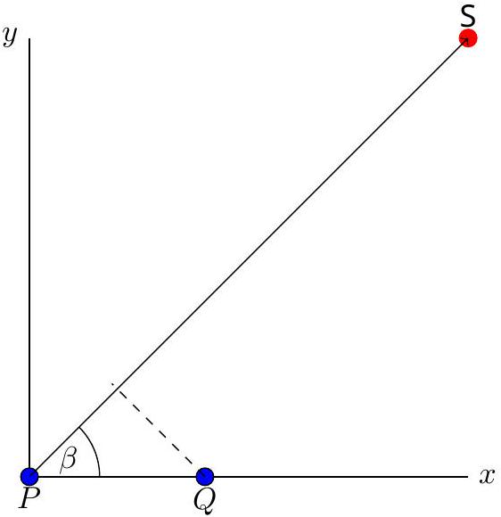
At large distances. let the time taken for the sound signal to reach at $P$ detector: $t _ { 0 } = 1009.61$ let the time taken for the sound signal to reach at $Q$ detector: $t _ { 1 } = 1007.85$
The distance between $P$ detector and $Q$ detector is 660 m and corresponding time taken by sound to reach their respective detectors are 1009.61s and 1007.85s respectively. The expression for time difference is given by

$$
\begin{align*}
t _ { 0 } - t _ { 1 } & = \frac { P Q \cos ( \beta ) } { c }  \tag{21}\\
\cos ( \beta ) & = \frac { \left( t _ { 0 } - t _ { 1 } \right) c } { P Q } \tag{22}
\end{align*}
$$

which gives $\beta = 28.36 ^ { \circ }$

A. 6 (cont.)
Alternate solution for $\beta$ :
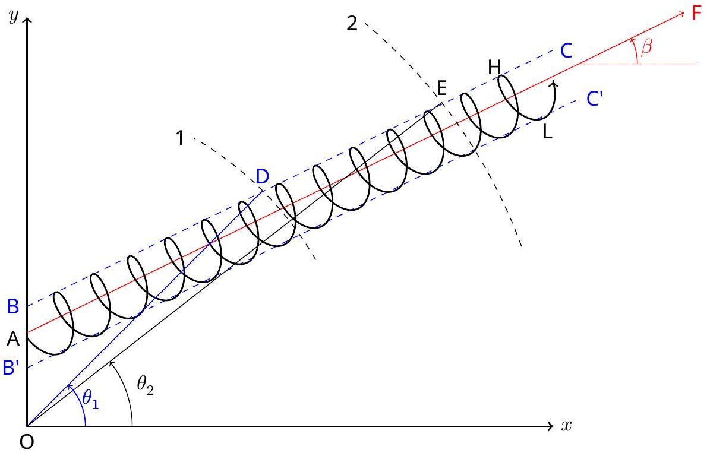
Red line AF depicts the direction of the velocity $v _ { s }$ of the circle. We aim to determine $\beta$ which $\vec { v } _ { s }$ makes with the $x$-axis.

Value of the frequency detected by the detector depends on two aspects, first from which location on the cycloid, the source emitted the signal and second, on the location of the detector.

Points H and L during one cycle of the source's trajectory depict the location where the source's speed is maximum and minimum respectively. This is due to $\overrightarrow { v _ { s } }$ being parallel or anti-parallel to the tangential velocity component of the rotation on these points.

As the source takes $n ^ { \text {th } }$ turn on the cycloid, detector on different angular positions on circular arc 1 will detect different values of $f _ { \text {max } }$ corresponding to those positions. Starting from the angular position near the $x$-axis $\left( 0 ^ { \circ } \right) , f _ { \text {max } }$ will keep increasing till the detector is kept on point D at $\left( \theta _ { 1 } \right)$. In fact, for any position on line BC which is parallel to AF, the detector will detect maximum of all $f _ { \text {max } }$. Similarly, if the detector is placed anywhere on line $B ^ { \prime } C ^ { \prime }$ which is also parallel to AF, it will detect minimum of $f _ { \text {min } }$. In the simulation, you can change the angle by changing $x , y$ coordinates and keeping the velocities zero.

We repeat this exercise by changing the detector distance to arc 2. Scanning across the arc, angle $\theta _ { 2 }$ can be obtained for which the detector detects maximum of $f _ { \text {max } }$.

Once we have the angular positions $\theta _ { 1 }$ and $\theta _ { 2 }$ determined, we can use the coordinates of point D and E to calculate the angle of segment DE which it makes with the $x$-axis. This is the angle $\beta$. If the coordinates of point D and E are $\left( x _ { 1 } , y _ { 1 } \right)$ and $\left( x _ { 2 } , y _ { 2 } \right)$ respectively. Then

$$
\begin{equation*}
\beta = \arctan \frac { y _ { 2 } - y _ { 1 } } { x _ { 2 } - x _ { 1 } } \tag{23}
\end{equation*}
$$

A. 6 (cont.)

This process is illustrated in table below and the corresponding graph. First we place the detector at 8000 m away from the origin and change the coordinates for the corresponding angular position 0° - 90°. We record $f _ { \text {max } }$ for any fixed cycle, (10th in this case). It can be seen from the plot of $f _ { \text {max } } \mathrm { vs } \theta$ that the $\theta _ { 1 }$ is between $25 ^ { \circ } - 35 ^ { \circ }$.

| $\theta$ | $f _ { \text {min } }$ | $f _ { \text {max } }$ |
| :--- | :--- | :--- |
| 5 | 676.08 | 2670.30 |
| 10 | 722.99 | 3620.51 |
| 20 | 763.49 | 4957.28 |
| 30 | 781.46 | 5478.86 |
| 40 | 753.98 | 4032.21 |
| 50 | 711.98 | 3007.44 |
| 60 | 677.39 | 2486.46 |
| 70 | 651.25 | 2185.81 |
| 80 | 630.99 | 1987.99 |
| 90 | 614.68 | 1845.65 |

A. 6 (cont.)

We go in smaller steps to determine $\theta _ { 1 }$ more accurately. Figure below shows the table and graph for the variation between 25°-35°.

| $\theta$ | $f _ { \text {min } }$ | $f _ { \text {max } }$ |
| :--- | :--- | :--- |
| 25 | 777.95 | 5538.23 |
| 26 | 779.67 | 5589.40 |
| 26.9 | 780.80 | 5609.15 |
| 27 | 780.90 | 5609.74 |
| 27.3 | 781.18 | 5609.546 |
| 27.5 | 781.33 | 5607.78 |
| 28 | 781.62 | 5597.66 |
| 29 | 781.81 | 5553.37 |
| 30 | 781.46 | 5478.86 |
| 31 | 780.58 | 5377.65 |
| 32 | 779.17 | 5254.35 |

It is clear from the table and graph that $\theta _ { 1 } = 27 ^ { \circ }$. We repeat this for another distance 16000 m . Table and graph for this distance is given below.

Solutions

## A2-10   Official (English)

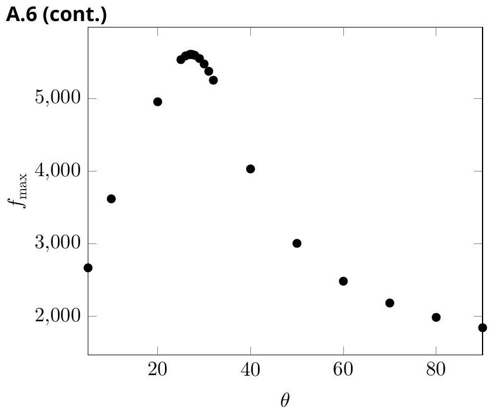

| $\theta$ | $f _ { \text {min } }$ | $f _ { \text {max } }$ |
| :--- | :--- | :--- |
| 25 | 781.12 | 5589.093 |
| 26 | 781.47 | 5602.27 |
| 27 | 781.70 | 5609.05 |
| 27.4 | 781.76 | 5609.95 |
| 27.5 | 781.77 | 5610.01 |
| 28 | 781.81 | 5609.34 |
| 29 | 781.80 | 5603.16 |
| 30 | 781.66 | 5590.544 |
| 31 | 781.41 | 5571.60 |
| 32 | 781.04 | 5546.48 |

Solutions

## A2-11   Official (English)

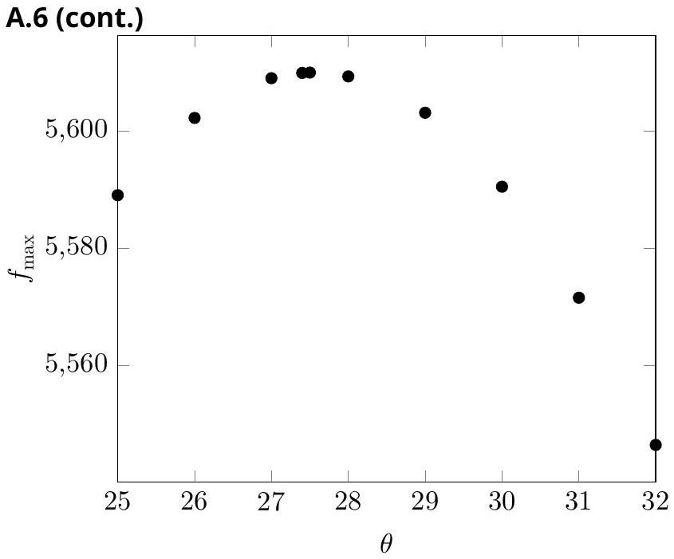
This gives $\theta _ { 2 } = 27.5 ^ { \circ }$. Taking the corresponding values of $x _ { 1 } , y _ { 1 } , x _ { 2 } , y _ { 2 }$ and using Eq. (23),

$$
\begin{equation*}
\beta = \arctan \frac { 7468.77 - 3631.92 } { 14192.17 - 7128.052194 } = 28.5 ^ { \circ } \tag{24}
\end{equation*}
$$

A. 7 (2.1 pt)
Coordinates of the center of the circle
For this part, keep the detector at some fixed position say on the $y$-axis. A schematic diagram of the initial location of the source and the the detector is depicted in the figure below (figure is not to scale).
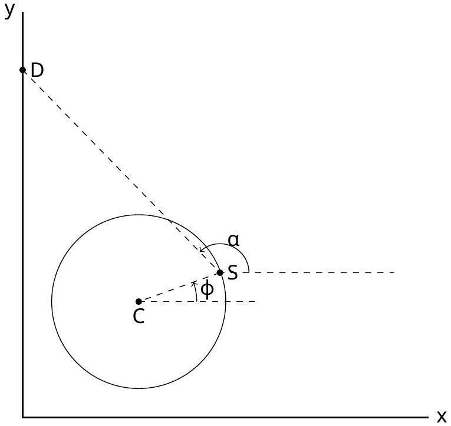
We record the detected frequency of the first signal sent by the source. We already have the value of $R$ and the source's initial coordinates. The detected frequency at $t = 0$, i.e. the first signal is 795.69 Hz if the detector is kept at 500 m on the $y$-axis. With the source's coordinates (419.99,499.99) m,

$$
\begin{array} { r }
\tan ( 180 - \alpha ) = \frac { 0 } { 419.99 } \\
\alpha = 180 ^ { \circ } \tag{26}
\end{array}
$$

Using the values of detected frequency and $\alpha$ in Eq. (7)

$$
\begin{align*}
795.69 & = \frac { 990.26 \times 330 } { 330 - 91.1 \cos ( 28.5 - 180 ) + 179.66 \sin ( \phi - \alpha ) }  \tag{27}\\
\Rightarrow \phi & \approx 0 ^ { \circ } \tag{28}
\end{align*}
$$

This yields source's center coordinates to be (299.42,499.99) m.

[^0]:    ${ } ^ { 1 }$ Siddharth Tiwary (IIT Powai, Mumbai), Siddhant Mukherjee (The University of Cambridge, UK), Chandan Relekar (IISc, Bangalore), Charudutt Kadolkar (IIT Guwahati), Praveen Pathak (HBCSE-TIFR, Mumbai), were the principal authors of this problem. The contributions of the Academic Committee and the International Board are gratefully acknowledged.
