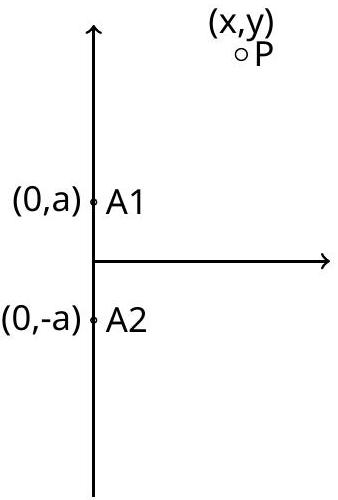
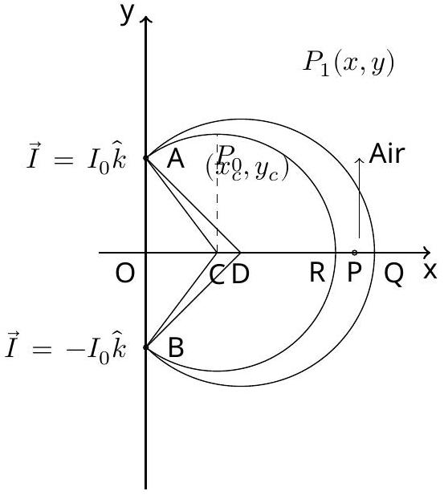

General Grading Guidelines
When student's solutions are correct and s/he also show how solutions were obtained, the stduent gets full credit. The scheme oulined below is helpful if the student's answers are partially correct. Attention will be paid to the detailed solution so, if the final answer is correct but it is obtained by incorrect method(s) then no credit will be given. Alternative solutions may exist and will be given due credit.

Partial or full outcomes obtained for later sections in the problem which are incorrect solely because of errors being carried forward from previous sections, but are otherwise reasonable, will not be further penalized. For example a dimensioanlly wrong answer when carried forward will not get any credit in the subsequent sections. A numerically wrong evaluation when carried forward will get credit in subsequent sections unless the numerical answer is patently wrong (e.g. the value of g is $981 \mathrm {~m} / \mathrm { sec } ^ { 2 }$ ! )

Incorrect or no labeling of an axis is penalized by -0.1 points
The numerical answer (i) must be correct to +/- 10\% AND (ii) must respect significant figures.
It maybe noted that NO micro-marking scheme takes care of all contingencies. A certain amount of discretion rests with and a certain level of judgement is invested in the academic committee.

The Stern-Gerlach Experiment: THE SOLUTION ${ } ^ { 1 }$
A. 1 Speed of the Silver Atoms: 0.5pt

We employ the equipartition theorem. Let $\overline { v ^ { 2 } }$ be the mean square speed of the silver atoms in the oven kept at 1200 K. Then

$$
\frac { m \overline { v ^ { 2 } } } { 2 } = \frac { 3 k _ { B } T } { 2 }
$$

where $k _ { B }$ is the Boltzmann constant. This yields the root mean square speed to be $5.255 \times 10 ^ { 2 } \mathrm {~m} \cdot \mathrm {~s} ^ { - 1 }$.

[^0]
B. 1 The Basic Expression 2pt The length $l _ { 1 }$ is irrelevant and will not be part of the expression. The magnitude of the acceleration $a$ of the silver atoms in the region defined by $l _ { 2 }$ is

$$
\begin{equation*}
a = \frac { \mu _ { s } } { m } \frac { d B } { d x } \tag{0.4}
\end{equation*}
$$

and it will be either in the $+ x$ or $- x$ direction. At the same time it has a constant horizontal velocity $v _ { z }$. It traverses the region $l _ { 2 }$ in time $l _ { 2 } / v _ { z }$. Thus after traversing the inhomogeneous region the deflection in say the $+ x$ direction is

$$
\begin{equation*}
\delta _ { 1 } = \frac { 1 } { 2 } \frac { \mu _ { s } } { m } \frac { d B } { d x } \frac { l _ { 2 } ^ { 2 } } { v _ { z } ^ { 2 } } \tag{0.6}
\end{equation*}
$$

For the remaining part of the flight the atom will have a constant hoirzontal speed $v _ { z }$ and a constant vertical speed $v _ { x 0 } = \left( \mu _ { s } d B / d x \right) \left( l _ { 2 } / m v _ { z } \right)$. On account of the $v _ { x }$ component the atom will acquire an additional deflection

$$
\delta _ { 2 } = l _ { 3 } v _ { x 0 } / v _ { z }
$$

This yields

$$
\begin{equation*}
\delta _ { 2 } = l _ { 3 } l _ { 2 } \frac { \mu _ { s } } { m v _ { z } ^ { 2 } } \frac { d B } { d x } \tag{0.4}
\end{equation*}
$$

The total deflection in the $+ x$ direction is $\delta _ { 1 } + \delta _ { 2 }$. The splitting seen on the screen in this idealized case is twice this amount, e.g. $2 \left( \delta _ { 1 } + \delta _ { 2 } \right)$. Thus we obtain

$$
\Delta x = 2 \frac { \mu _ { s } } { m } \frac { d B } { d x } \frac { l _ { 2 } } { v _ { z } ^ { 2 } } \left( l _ { 2 } / 2 + l _ { 3 } \right)
$$

-0.3 if factor of 2 is missing.

C. 1 The Inhomogeneous Magnetic Field: 1.5pt

Let $\overrightarrow { A _ { 1 } P } = \vec { r } _ { 1 } = x \hat { i } + ( y - a ) \hat { j }$ and $\overrightarrow { A _ { 2 } P } P = \vec { r } _ { 2 } = x \hat { i } + ( y + a ) \hat { j }$. This gives for $\vec { B } ( x , y )$

$$
\begin{equation*}
\frac { \mu I _ { 0 } } { 2 \pi } \left[ \frac { \hat { k } \times ( x \hat { i } + ( y - a ) \hat { j } } { r _ { 1 } ^ { 2 } } - \frac { \hat { k } \times ( x \hat { i } + ( y + a ) \hat { j } } { r _ { 2 } ^ { 2 } } \right] \tag{1}
\end{equation*}
$$

[0.4+0.4]

$$
\begin{gather*}
= \frac { \mu I _ { 0 } } { 2 \pi r _ { 1 } ^ { 2 } r _ { 2 } ^ { 2 } } \left[ ( x \hat { j } - ( y - a ) \hat { i } ) \left( x ^ { 2 } + ( y + a ) ^ { 2 } \right) - ( x \hat { j } - ( y + a ) \hat { i } ) \left( x ^ { 2 } + ( y - a ) ^ { 2 } \right) \right] \\
= \frac { \mu I _ { 0 } a } { \pi r _ { 1 } ^ { 2 } r _ { 2 } ^ { 2 } } \left[ 2 x y \hat { j } + \left( x ^ { 2 } - y ^ { 2 } + a ^ { 2 } \right) \hat { i } \right] \tag{2}
\end{gather*}
$$

Writing the final expression as any correct function of x and y will get full marks. If collecting all the terms component-wise not done, then penalize by -0.1. If an error has been made in simplification then penalize by -0.1.

C. 2 Direction at point $R$ : Field at the point $R \left( \left( x _ { c } + \sqrt { x _ { c } ^ { 2 } + a ^ { 2 } } , 0 \right) \right.$ is given by substituting $y = 0$. On simple inspection the $\hat { j }$ component vanishes. Thus $\vec { B } ( x , 0 ) \propto \hat { i }$ [0.2]
Direction at point $P _ { 0 }$ : Field at $P _ { 0 } \left( \left( x _ { c } , y _ { c } = \left( x _ { c } ^ { 2 } + a ^ { 2 } \right) ^ { 1 / 2 } \right) \right)$ is given, using Eq.(2)
$$
\frac { \mu I _ { 0 } } { \pi r _ { 1 } ^ { 2 } r _ { 2 } ^ { 2 } } \left( 2 x _ { c } \left( x _ { c } ^ { 2 } + a ^ { 2 } \right) ^ { 1 / 2 } \hat { j } + \left( x _ { c } ^ { 2 } - x _ { c } ^ { 2 } - a ^ { 2 } + a ^ { 2 } \right) \hat { i } \right)
$$
The $\hat { i }$ component is zero. Thus $\vec { B } \left( x _ { c } , \left( x _ { c } ^ { 2 } + a ^ { 2 } \right) ^ { 1 / 2 } \right) \propto \hat { j }$ [0.3]
First Alternative Solution
We can show in general that the field at any point on the circle will be radial (i.e. normal to the circle). We will confine our discussion to the $\mathrm { z } = 0$ plane. Consider a point $\left( x _ { c } , y \right)$ with radius $\sqrt { x _ { c } ^ { 2 } + a ^ { 2 } }$. The equation of a circle with $\left( x _ { c } , 0 \right)$ as centre and $\sqrt { x _ { c } ^ { 2 } + a ^ { 2 } }$ as radius is
$$
\left( x - x _ { c } \right) ^ { 2 } + y ^ { 2 } = x _ { c } ^ { 2 } + a ^ { 2 }
$$
or
$$
\begin{equation*}
x ^ { 2 } - 2 x x _ { c } + y ^ { 2 } = a ^ { 2 } \tag{3}
\end{equation*}
$$
If at the point $\left( x _ { c } , y _ { c } \right)$ the magnetic field is along $\hat { j }$ then the component along $\hat { i }$ is zero. ( $x _ { c } , 0$ ) is identified with the point C on the figure. The point $y _ { c }$ is then,
$$
x _ { c } ^ { 2 } - y _ { c } ^ { 2 } + a ^ { 2 } = 0
$$
or
$$
\begin{equation*}
y _ { c } ^ { 2 } = x _ { c } ^ { 2 } + a ^ { 2 } \tag{4}
\end{equation*}
$$
Now consider a line joining $\mathrm { C } \left( x _ { c } , 0 \right)$ to any point $P _ { C } ( x , y )$ lying on the circle given by eq.(3). The radial vector is $\overrightarrow { C P _ { C } } = \left( x - x _ { c } \right) \hat { i } + y \hat { j }$. The magnetic field at $P _ { C }$ is
$$
\propto \vec { B } ( x , y , 0 ) = \left( \frac { \mu I _ { 0 } } { \pi } \right) \left( 2 x y \hat { j } + \left( x ^ { 2 } - y ^ { 2 } + a ^ { 2 } \right) \hat { i } \right)
$$
To show that they are in the same direction, we evaluate the cross product, $C P _ { C } \times \vec { B }$. The cross product is proportional to $\hat { n }$ which is a unit vector along the direction which is normal to both $C P _ { C }$ and $\vec { B }$ and is along $\hat { k }$
$$
\overrightarrow { C P } _ { C } \times \vec { B } \propto \left( 2 x y \left( x - x _ { c } \right) - y \left( x ^ { 2 } - y ^ { 2 } + a ^ { 2 } \right) \right) \hat { k }
$$
which simplifies to
$$
y \left( x ^ { 2 } - 2 x x _ { c } + y ^ { 2 } - a ^ { 2 } \right) \hat { k }
$$
Using eq.(3), this is zero, proving the result.

C. 2 (cont.)

Second Alternative Solution
To show that the field lines are radial over the circe one may merely show the proportionality of the components of the field and the radius vector. The radius vector is $\left( x - x _ { c } \right) \hat { i } + y \hat { j }$ while the magnetic field is proportional to $\left( x ^ { 2 } - y ^ { 2 } + a ^ { 2 } \right) \hat { i } + 2 x y \hat { j }$. Thus

$$
\frac { y } { 2 x y } = \frac { 1 } { 2 x }
$$

and

$$
\frac { x - x _ { c } } { x ^ { 2 } - y ^ { 2 } + a ^ { 2 } } = \frac { 1 } { 2 x }
$$

The last step is obtained by observing that the equation of the circle is $\left( x - x _ { c } \right) ^ { 2 } + y ^ { 2 } = x _ { c } ^ { 2 } + a ^ { 2 }$.

C. 3 Field in the airgap because of the argument presented in the problem continues 0.5pt to be given by Eq.(2). So the field ( $y = 0$ ), is again
$$
\begin{equation*}
\vec { B } = \frac { \mu I _ { 0 } a } { \pi \left( x ^ { 2 } + a ^ { 2 } \right) } \hat { i } \tag{0.5}
\end{equation*}
$$
D. 1 The force $F _ { x }$ on a magnetic dipole along the $x$ - direction is 0.5pt
$$
\begin{equation*}
F _ { x } = - \mu _ { s } \frac { \partial B _ { x } } { \partial x } = \frac { \mu _ { s } \mu I _ { 0 } } { \pi } \times \frac { 2 a x } { \left( x ^ { 2 } + a ^ { 2 } \right) ^ { 2 } } \tag{5}
\end{equation*}
$$

## A1-6   Official (English)

E. 1

$$
\frac { \mu } { \mu _ { 0 } } = 10 ^ { 4 } ; \quad a = 6.00 \times 10 ^ { - 3 } \mathrm {~m} ; \quad O C = 6.00 \times 10 ^ { - 3 } \mathrm {~m} ; \quad O D = 8.00 \times 10 ^ { - 3 } \mathrm {~m} ;
$$

and

$$
I _ { 0 } = 2.00 \mathrm {~A}
$$

and so at the midpoint P ,

$$
\begin{gathered}
y = 0 ; \\
x _ { P } = O P = ( ( 1 + \sqrt { 2 } ) \times .6 + 1.8 ) / 2 = 1.624 \times 10 ^ { - 2 } m
\end{gathered}
$$

[0.5]
where we have used $O D = .8 \times 10 ^ { - 2 } m$ and $D A = 10 ^ { - 2 } m$. This gives for $B _ { x } \left( x _ { P } , 0 \right)$

$$
\begin{aligned}
\frac { \mu } { \mu _ { 0 } } \frac { \mu _ { 0 } } { \pi } \frac { I _ { 0 } a } { \left( x _ { P } ^ { 2 } + a ^ { 2 } \right) } = & \frac { 10 ^ { 4 } \times 4 \times 10 ^ { - 7 } \times 2 \times .6 \times 10 ^ { - 2 } } { \left( 1.624 ^ { 2 } + .6 ^ { 2 } \right) \times 10 ^ { - 4 } } \\
& = 0.16 \mathrm {~T}
\end{aligned}
$$

[1]
We also have

$$
\left( \frac { \partial B _ { x } } { \partial x } \right) _ { x _ { P } } = \frac { 2 \times x _ { p } } { x _ { p } ^ { 2 } + a ^ { 2 } } \times B _ { x } \left( x _ { P } , 0 \right) = \frac { 2 \times 1.624 \times 10 ^ { - 2 } } { \left( 1.624 ^ { 2 } + .6 ^ { 2 } \right) \times 10 ^ { - 4 } } \times .16 = 17.34 T \cdot \mathrm {~m} ^ { - 1 }
$$

[0.5]
F. 1 The magnetic moment of the silver atom: 1.5pt
We use

$$
\Delta x = \frac { 2 \mu _ { s } } { m } \left( \frac { \partial B } { \partial x } \right) _ { x _ { P } } \frac { l _ { 2 } } { v _ { z } ^ { 2 } } \left( \frac { l _ { 2 } } { 2 } + l _ { 3 } \right)
$$

to rewrite

$$
\begin{gather*}
\mu _ { s } = \frac { m \Delta x } { 2 \left( \frac { \partial B _ { x } } { \partial x } \right) _ { x _ { P } } } \times \frac { 1 } { \left[ \frac { l _ { 2 } } { v _ { z } ^ { 2 } } \left( \frac { l _ { 2 } } { 2 } + l _ { 3 } \right) \right] }  \tag{0.5}\\
= \frac { 1.8 \times 10 ^ { - 25 } \times 2 \times 10 ^ { - 3 } } { 2 \times 17.34 } \times 10 ^ { 6 } = 1.04 \times 10 ^ { - 23 } J \cdot T ^ { - 1 } \tag{1}
\end{gather*}
$$

## A1-7   Official (English)

G. 1 The spread in the line: The two lines on the screen are separated symmetrically about the centre by $\Delta x$. So the upper (lower) line is at $\Delta x / 2$ from the centre. From Part (2)
$$
\Delta x / 2 = \frac { \mu _ { s } } { m } \frac { d B } { d x } \frac { l _ { 2 } } { v _ { z } ^ { 2 } } \left( l _ { 2 } / 2 + l _ { 3 } \right)
$$
This depends on the beam speed $v _ { z }$. The spread in this speed leads to a consequent spread in the splitting.
$$
\begin{align*}
\delta ( \Delta x / 2 ) & = \left| \frac { \partial \Delta x / 2 } { \partial v _ { z } } \right| \delta v _ { z } \\
& = 2 ( \Delta x / 2 ) \frac { \delta v _ { z } } { v _ { z } } \\
& = 2 ( \Delta x / 2 ) \times 0.2 \\
& = 0.04 \mathrm {~cm} \tag{0.3}
\end{align*}
$$
Hence the spread in the line from the centre is $0.1 - 0.04 = 0.06 \mathrm {~cm}$ to $0.1 + 0.04$ $= 0.14 \mathrm {~cm}$.
    1. Credit will also be given if 20\% is interpreted as 10\% on each side
    2. Answer reported in terms of percentages receive full credit
[0.2]
H. 1 Error in the evaluation of the magnetic moment: 0.5pt
From the previous part we have that the splitting ranges from 0.12 cm to 0.28 cm whereas earlier it was 0.2 cm. The relationship between the splitting and the magnetic moment is linear. So the magnetic moment ranges from (0.12/0.2) to (0.28/0.2) the original value. This yields $0.62 \times 10 ^ { - 23 } \mathrm {~J} \cdot \mathrm {~T} ^ { - 1 }$ to $1.46 \times 10 ^ { - 23 } \mathrm {~J} \cdot \mathrm {~T} ^ { - 1 }$. The total spread is $0.84 \times 10 ^ { - 23 } \mathrm {~J} \cdot \mathrm {~T} ^ { - 1 }$ about the mean value of $1.04 \times 10 ^ { - 23 } \mathrm {~J} \cdot \mathrm {~T} ^ { - 1 }$
or in other words
$$
\begin{equation*}
\mu _ { s } = 1.04 \pm 0.42 \mathrm {~J} \cdot \mathrm {~T} ^ { - 1 } \tag{0.3}
\end{equation*}
$$

[^0]:    ${ } ^ { 1 }$ H. S. Mani (former Director, HRI, Prayagraj) and Gautam Datta (DAIICT, Gandhinagar) were the principal authors of this problem. The contributions of the Academic Committee, Academic Development Group, and the International Board are gratefully acknowledged.
