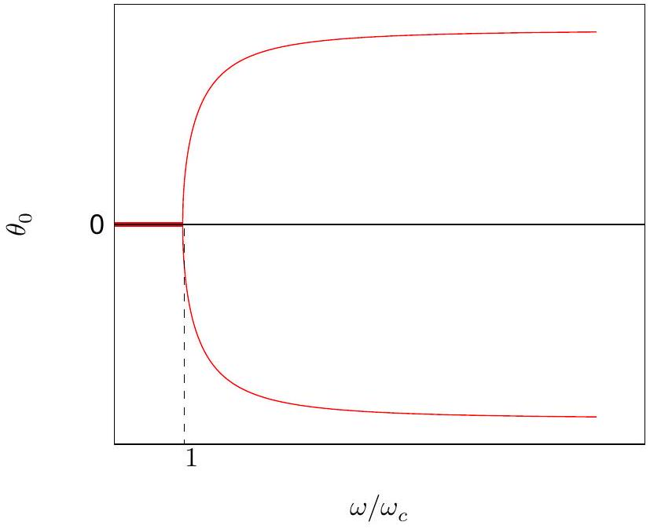
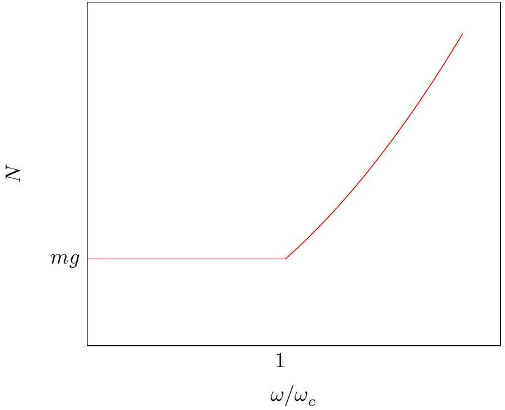
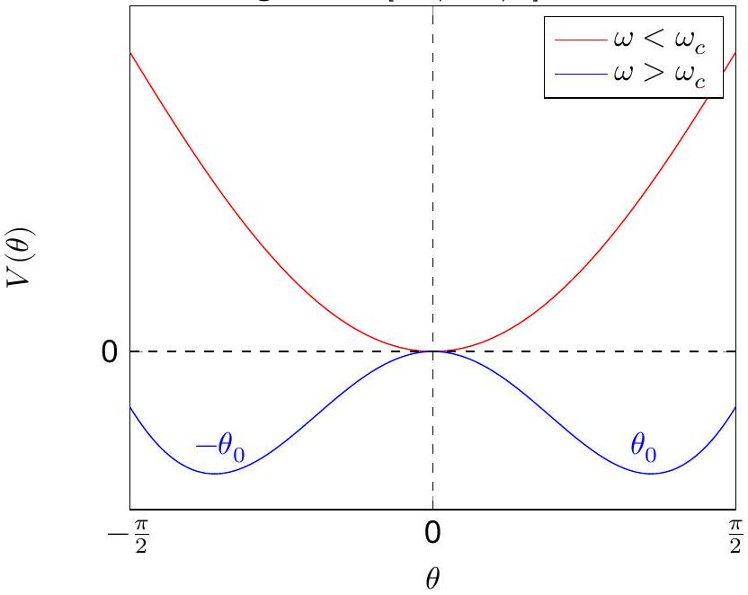
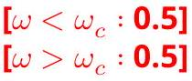
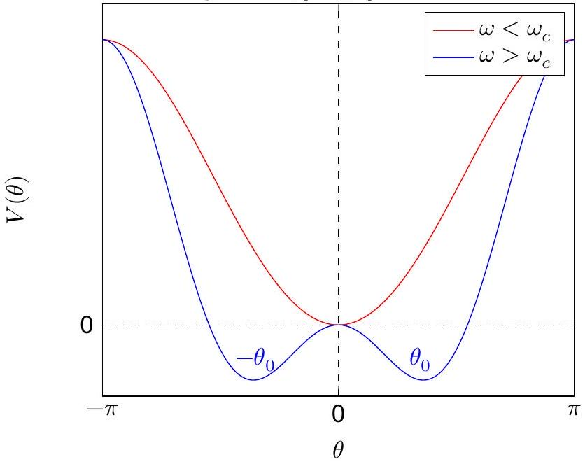
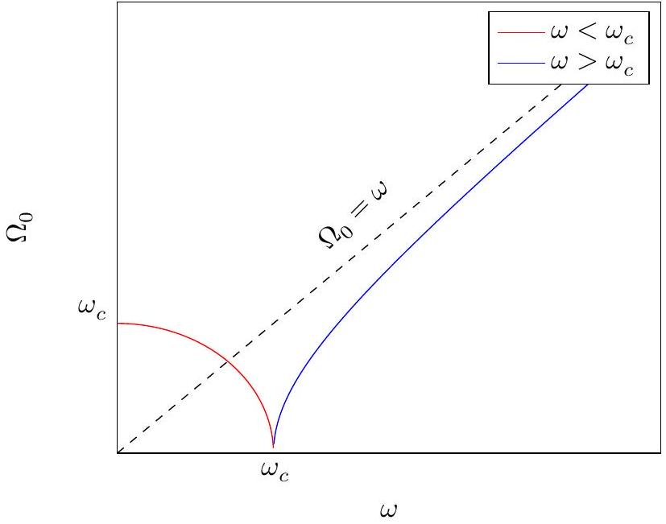

## A Mechanical Model for Phase Transitions ${ } ^ { 1 }$

## General Grading Guidelines

When student's solutions are correct and s/he also show how solutions were obtained, the stduent gets full credit. The scheme oulined below is helpful if the student's answers are partially correct. Attention will be paid to the detailed solution so, if the final answer is correct but it is obtained by incorrect method(s) then no credit will be given. Alternative solutions may exist and will be given due credit.

Partial or full outcomes obtained for later sections in the problem which are incorrect solely because of errors being carried forward from previous sections, but are otherwise reasonable, will not be further penalized. For example a dimensioanlly wrong answer when carried forward will not get any credit in the subsequent sections. A numerically wrong evaluation when carried forward will get credit in subsequent sections unless the numerical answer is patently wrong (e.g. the value of g is $981 \mathrm {~m} / \mathrm { sec } ^ { 2 }$ ! )

Incorrect or no labeling of an axis is penalized by -0.1 points
The numerical answer (i) must be correct to +/- 10\% AND (ii) must respect significant figures.
It maybe noted that NO micro-marking scheme takes care of all contingencies. A certain amount of discretion rests with and a certain level of judgement is invested in the academic committee.
A. 1 (0.5 pt)
Equations of motion

The radial component $F _ { r }$ yields:

$$
\begin{equation*}
m R \dot { \theta } ^ { 2 } = N - m g \cos ( \theta ) - m R \sin ^ { 2 } ( \theta ) \omega ^ { 2 } \tag{1}
\end{equation*}
$$

[0.2]
The tangential component $F _ { \theta }$

$$
\begin{equation*}
m R \ddot { \theta } = m R \sin ( \theta ) \cos ( \theta ) \omega ^ { 2 } - m g \sin ( \theta ) - \operatorname { sgn } ( \dot { \theta } ) k N \tag{2}
\end{equation*}
$$

OR

$$
\begin{equation*}
m R \ddot { \theta } = m R \sin ( \theta ) \cos ( \theta ) \omega ^ { 2 } - m g \sin ( \theta ) - f k N \quad ( f = 1 ) \tag{3}
\end{equation*}
$$

[0.3]
No points if equations not written using radial and tangential components.

[^0]
B. 1 (1.0 pt)
Equilibrium angle(s)
We set $k = 0$ in the equation for the tangential component of the force. Thus

$$
\begin{equation*}
m R \ddot { \theta } = m R \sin ( \theta ) \cos ( \theta ) \omega ^ { 2 } - m g \sin ( \theta ) \tag{4}
\end{equation*}
$$

For equilibrium we set $\ddot { \theta _ { 0 } } = 0$ in the above equation. Then $\theta _ { 0 } = 0$ is an equilibrium angle for all values of $\omega$
[0.4]
The other values are given by

$$
\begin{gather*}
\cos \theta _ { 0 } = \frac { g } { \omega ^ { 2 } R } = \frac { \omega _ { c } ^ { 2 } } { \omega ^ { 2 } }  \tag{5}\\
\theta _ { 0 } = \pm \left| \cos ^ { - 1 } \frac { \omega _ { c } ^ { 2 } } { \omega ^ { 2 } } \right| \tag{0.3}
\end{gather*}
$$

with values of $\theta _ { 0 }$ between $- \pi / 2$ to $\pi / 2$. The ± indicates that there are two equivalent positions. () The bead could rise on either side of the axis shown in the figure depicted in the problem. Note that for $\omega < \omega _ { c }$, Eq. (5) implies $\cos \theta _ { 0 } > 1$. This is clearly unphysical. A little reflection will convince us that $\theta _ { 0 } = 0$ for $\omega < \omega _ { c }$.
[0.2]
B. 2 (0.5 pt)
Sketch of $\theta _ { 0 }$.

B. 3 (0.5 pt)
Sketch of the magnitude of the normal reaction

$$
\left[ \omega < \omega _ { c } : 0.2 \right]
$$

$\left[ \omega > \omega _ { c } : 0.3 \right]$
If the shape of the plot is wrong, in that case, the following would be used. If in the detailed work, it is shown that $N = m g$ for $\omega < \omega _ { c ^ { \prime } } \mathbf { 0 . 1 }$ points would be provided. If it is shown that $N = m \omega ^ { 2 } R$ for $\omega \geq \omega _ { c }$, $\mathbf { 0 . 1 }$ points would be provided.

B. 4 (1.0 pt)
The potential $V ( \theta )$
Solution 1: Using direct integration
Given that

$$
\begin{equation*}
F _ { \theta } = - \frac { 1 } { R } \frac { d V ( \theta ) } { d \theta } \tag{7}
\end{equation*}
$$

and taking $V ( \theta = 0 ) = 0$, we obtain on integrating Eq. (4) that

$$
\begin{equation*}
- R \int _ { 0 } ^ { \theta } F _ { \theta } d \theta = \int _ { 0 } ^ { V } d V = V - 0 \tag{0.3}
\end{equation*}
$$

the left hand side is

$$
\begin{align*}
- R \int _ { 0 } ^ { \theta } F _ { \theta } d \theta & = \frac { - m \omega ^ { 2 } R ^ { 2 } } { 2 } \int _ { 0 } ^ { \theta } \sin ( 2 \theta ) + m g R \int _ { 0 } ^ { \theta } \sin ( \theta ) d \theta \\
& = \frac { m \omega ^ { 2 } R ^ { 2 } ( \cos ( 2 \theta ) - 1 ) } { 4 } - m g R ( \cos ( \theta ) - 1 ) \tag{8}
\end{align*}
$$

Noting that $\cos ( 2 ( \theta ) - 1 ) = - 2 \sin ^ { 2 } ( \theta )$ and $\omega _ { c } ^ { 2 } = g / R$ we obtain

$$
\begin{equation*}
V ( \theta ) = m g R \left[ ( 1 - \cos \theta ) - \frac { \omega ^ { 2 } } { 2 \omega _ { c } ^ { 2 } } \sin ^ { 2 } \theta \right] \tag{9}
\end{equation*}
$$

[0.3]
We can also verify the above equation by substitution into Eq. (7)
$P = m g R$
$Q = - m g R$
$S = - \frac { \omega ^ { 2 } m g R } { 2 \omega _ { c } ^ { 2 } }$
Solution 2: Differentiating $V = P + Q \cos ( \theta ) + S \sin ^ { 2 } ( \theta )$
$F _ { \theta } = m R \sin \theta \cos \theta \omega ^ { 2 } - m g \sin \theta = - \frac { 1 } { R } \frac { d V ( \theta ) } { d \theta } = \frac { Q } { R } \sin ( \theta ) - 2 \frac { S } { R } \sin \theta \cos \theta$
Comparing, we get,
$Q = - m g R$
$S = - \frac { \omega ^ { 2 } m g R } { 2 \omega _ { c } ^ { 2 } }$
Also, as $V ( 0 ) = 0$, we have $P + Q = 0$. Hence, $P = m g R$
[0.3]

B. 5 (1.0 pt)
The coefficients

We use the expansions for the trigonmetric functions $\sin ( \theta )$ and $\cos ( \theta )$ in Eq. (10). We shall keep terms upto and inculding order $\theta ^ { 4 }$. Thus

$$
\begin{aligned}
V ( \theta ) & \approx m g R \left[ 1 - 1 + \theta ^ { 2 } / 2 - \theta ^ { 4 } / 24 - \frac { \omega ^ { 2 } } { 2 \omega _ { c } ^ { 2 } } \left( \theta - \theta ^ { 3 } / 6 \right) ^ { 2 } \right] \\
& \approx \frac { m g R } { 2 } \left[ 1 - \frac { \omega ^ { 2 } } { \omega _ { c } ^ { 2 } } \right] \theta ^ { 2 } + \frac { m g R } { 6 } \left[ \frac { \omega ^ { 2 } } { \omega _ { c } ^ { 2 } } - \frac { 1 } { 4 } \right] \theta ^ { 4 }
\end{aligned}
$$

Thus

$$
\begin{align*}
& a ( \omega ) = \frac { m g R } { 2 } \left( 1 - \frac { \omega ^ { 2 } } { \omega _ { c } ^ { 2 } } \right)  \tag{0.5}\\
& b ( \omega ) = \frac { m g R } { 6 } \left( \frac { \omega ^ { 2 } } { \omega _ { c } ^ { 2 } } - \frac { 1 } { 4 } \right) \tag{0.5}
\end{align*}
$$

Note: no penalty if the 1/4 term is missed.
One observes that if one incorrectly expands $\sin \theta \approx \theta$, in that case, only $a ( \omega )$ will turn out to be correct.

## A2-6   Official (English)

B. 6 (1.0 pt)
Representative plots of the potential
Solution 1: Plotting for $\theta \in [ - \pi / 2 , \pi / 2 ]$

Solution 2: Plotting for $\theta \in [ - \pi , \pi ]$

$\left[ \omega < \omega _ { c } : 0.5 \right]$
$\left[ \omega > \omega _ { c } : 0.5 \right]$

B. 7 (1.0 pt)
Bead analogues
Solution 1:
For $\omega \rightarrow \omega _ { c } ^ { + } , \theta _ { 0 }$ is close to zero. Hence on expanding the cosine term in Eq. (5),

$$
\begin{align*}
1 - \frac { \theta _ { 0 } ^ { 2 } } { 2 } & = \frac { \omega _ { c } ^ { 2 } } { \omega ^ { 2 } } \\
\theta _ { 0 } & = \pm \sqrt { 2 } \left[ 1 - \frac { \omega _ { c } ^ { 2 } } { \omega ^ { 2 } } \right] ^ { 1 / 2 } \tag{10}
\end{align*}
$$

Also note from Eq. (5) that as $\omega \rightarrow \infty , \theta _ { 0 } \rightarrow \pm \pi / 2$. This plot also has an analogue in phase transition. The magnetization $\mathcal { M }$ goes to zero as $T$ goes to $T _ { c }$ in a similar fashion. Thus the role of $\mathcal { M }$ is played by $\theta _ { 0 }$ and temperature is inversely related to $\omega$. Increasing temperature is equivalent to decreasing $\omega$. Summarizing,

$$
\begin{gather*}
\mathcal { M } \longrightarrow \theta  \tag{0.4}\\
T _ { c } \longrightarrow 1 / \omega _ { c } ^ { 2 } \\
T / T _ { c } \longrightarrow \omega _ { c } ^ { 2 } / \omega ^ { 2 } \tag{0.4}
\end{gather*}
$$

Equivalent value of $\beta$ for bead is = 1/2. $\square$

Solution 2:
For $\omega > \omega _ { c } , \cos \theta _ { 0 } = \omega _ { c } ^ { 2 } / \omega ^ { 2 }$. Hence on writing $\sin ^ { 2 } \theta _ { 0 } = 1 - \cos ^ { 2 } \theta _ { 0 }$ and substituting the value of $\cos \theta _ { 0 }$, one gets $\sin \theta _ { 0 } = \left( 1 - \frac { \omega _ { c } ^ { 4 } } { \omega ^ { 4 } } \right) ^ { 1 / 2 }$. This plot also has an analogue in phase transition. The magnetization $\mathcal { M }$ goes to zero as $T$ goes to $T _ { c }$ in a similar fashion. Thus the role of $\mathcal { M }$ is played by $\sin \theta _ { 0 }$ (or equivalently $\theta _ { 0 }$ in the small angle limit) and temperature is inversely related to $\omega ^ { 4 }$. Increasing temperature is equivalent to decreasing $\omega$. Summarizing,

$$
\mathcal { M } \longrightarrow \sin \theta
$$

$$
\begin{align*}
T _ { c } & \longrightarrow 1 / \omega _ { c } ^ { 4 }  \tag{0.4}\\
T / T _ { c } & \longrightarrow \omega _ { c } ^ { 4 } / \omega ^ { 4 } \tag{0.4}
\end{align*}
$$

Equivalent value of $\beta$ for bead is = 1/2. $\square$
[Note: The critical exponent is 1/2 in our case and also in Landau theory. However experimentally and in more elaborate theories the exponent of vanishing magnetization is 1/3].

B. 8 ( 1.0 pt)
Oscillation frequency
The frequency of oscillation $\Omega _ { 0 }$ of the bead about the "equilibrium" position $\theta _ { 0 }$ is

$$
\Omega _ { 0 } = \frac { 1 } { R } \sqrt { \frac { V ^ { \prime \prime } ( \theta ) } { m } }
$$

We take the second order derivative of the potential as given in Eq. (10)

$$
\begin{equation*}
V ^ { \prime \prime } ( \theta ) = m g R \cos \theta \left[ 1 - \frac { \omega ^ { 2 } } { \omega _ { c } ^ { 2 } } \cos \theta \right] + m g R \frac { \omega ^ { 2 } } { \omega _ { c } ^ { 2 } } \sin ^ { 2 } \theta \tag{11}
\end{equation*}
$$

For $\theta = \theta _ { 0 } = \pm \cos ^ { - 1 } \left( \omega _ { c } ^ { 2 } / \omega ^ { 2 } \right)$

$$
\begin{equation*}
V ^ { \prime \prime } \left( \theta _ { 0 } \right) = m g R \frac { \omega ^ { 2 } } { \omega _ { c } ^ { 2 } } \left( 1 - \frac { \omega _ { c } ^ { 4 } } { \omega ^ { 4 } } \right) > 0 \quad \text { if } \omega > \omega _ { c } \tag{12}
\end{equation*}
$$

For $\omega < \omega _ { c } , \theta _ { 0 } = 0$, and we obtain from Eq. (12) that

$$
\begin{equation*}
\Omega _ { 0 } = \left( \omega _ { c } ^ { 2 } - \omega ^ { 2 } \right) ^ { 1 / 2 } \tag{13}
\end{equation*}
$$

Similarly for $\omega > \omega _ { c }$, using Eq. (13) we obtain

$$
\begin{equation*}
\Omega _ { 0 } = \omega \left( 1 - \frac { \omega _ { c } ^ { 4 } } { \omega ^ { 4 } } \right) ^ { 1 / 2 } \tag{14}
\end{equation*}
$$

No credit will be provided is small angle approximation of $V ( \theta )$ is used.

B. 9 (1.0 pt)
Sketch of $\Omega _ { 0 }$

$$
\begin{aligned}
& { \left[ \omega < \omega _ { c } : 0.5 \right] } \\
& { \left[ \omega > \omega _ { c } : 0.5 \right] }
\end{aligned}
$$

In the case of wrong expression of $\Omega _ { 0 }$ derived in the previous part, marks would be awarded based on the plot of expression obtained, and physicality of the plots.

C. 1 (1.0 pt)
Condition for equilibrium angles
We substitute the expression for the normal reaction (Eq.(1)) in the angular part (Eq.(3)) to obtain

$$
m R \ddot { \theta } = m R \sin ( \theta ) \cos ( \theta ) \omega ^ { 2 } - m g \sin ( \theta ) - f k \left( m g \cos ( \theta ) + m R \sin ^ { 2 } ( \theta ) \omega ^ { 2 } + m R \dot { \theta } ^ { 2 } \right)
$$

Noting that $\omega _ { c } ^ { 2 } = g / R$ and rearranging terms we have

$$
\begin{equation*}
\ddot { \theta } = \omega _ { c } ^ { 2 } \left[ ( \sin ( \theta ) ) ( \cos ( \theta ) - f k \sin ( \theta ) ) \left( \frac { \omega } { \omega _ { c } } \right) ^ { 2 } - \sin ( \theta ) - f k \cos ( \theta ) - f k \left( \frac { \dot { \theta } } { \omega _ { c } } \right) ^ { 2 } \right] \tag{0.2}
\end{equation*}
$$

At equilibrium, $\dot { \theta } = 0 , \ddot { \theta } = 0$ and $f = \operatorname { sgn } ( \dot { \theta } ) = \pm 1$ depending on how this equilibrium was attained, ie., depending on the value of $\dot { \theta }$ just before equilibrium was attained. Thus we obtain the expression for the equilibrium angle $\theta _ { 0 }$,

$$
\begin{equation*}
\sin \left( \theta _ { 0 } \right) \left( \cos \left( \theta _ { 0 } \right) - f k \sin \left( \theta _ { 0 } \right) \right) \left( \frac { \omega } { \omega _ { c } } \right) ^ { 2 } = \sin \left( \theta _ { 0 } \right) + f k \cos \left( \theta _ { 0 } \right) \text { with } \theta _ { 0 } \in ( - \pi / 2 , \pi / 2 ) \tag{0.4}
\end{equation*}
$$

For $f = 1$ and $k = \tan ( \alpha )$ we may express the above as

$$
\begin{align*}
\left( \frac { \omega } { \omega _ { c } } \right) ^ { 2 } & = \frac { \sin \left( \theta _ { 0 } \right) + \tan ( \alpha ) \cos \left( \theta _ { 0 } \right) } { \sin \left( \theta _ { 0 } \right) \left( \cos \left( \theta _ { 0 } \right) - \tan ( \alpha ) \sin \left( \theta _ { 0 } \right) \right) } \\
& = \frac { \tan \left( \theta _ { 0 } + \alpha \right) } { \sin \left( \theta _ { 0 } \right) } \tag{15}
\end{align*}
$$

In case of algebraic error leading to $x = \theta _ { 0 } - \alpha$, only 0.1 points would be deducted.

C. 2 (0.5 pt)

Representative values for $\theta _ { 0 }$
We are given the expansions for the trignometric functions in the problem. We notice that the coefficient of the opposing force $k$ is small (=0.05). Thus $k = \alpha$. We then have

$$
\begin{align*}
\sin \left( \theta _ { 0 } \right) & \approx \theta _ { 0 } \\
\tan \left( \theta _ { 0 } + \alpha \right) & \approx \theta _ { 0 } + \alpha \tag{0.2}
\end{align*}
$$

Thus

$$
\left( \frac { \omega } { \omega _ { c } } \right) ^ { 2 } \approx 1 + \frac { k } { \theta _ { 0 } }
$$

Simple calculations yield

(a) $\theta _ { 0 } = - 0.07$ radians
(b) $\theta _ { 0 } = - 0.1$ radians

[0.3]
The plot will no longer be symmetric.

[^0]:    ${ } ^ { 1 }$ Sitikantha Das (IIT Kharagpur) and Pramendra Ranjan Singh (Principal, Narayan College, J.P. University) were the principal authors of this problem. The contributions of the Academic Committee, Academic Development Group, and the International Board are gratefully acknowledged.
