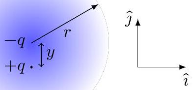
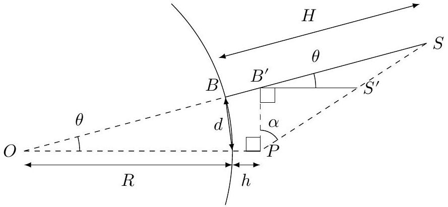

General Grading Guidelines
When student's solutions are correct and s/he also show how solutions were obtained, the stduent gets full credit. The scheme oulined below is helpful if the student's answers are partially correct. Attention will be paid to the detailed solution so, if the final answer is correct but it is obtained by incorrect method(s) then no credit will be given. Alternative solutions may exist and will be given due credit.

Partial or full outcomes obtained for later sections in the problem which are incorrect solely because of errors being carried forward from previous sections, but are otherwise reasonable, will not be further penalized. For example a dimensioanlly wrong answer when carried forward will not get any credit in the subsequent sections. A numerically wrong evaluation when carried forward will get credit in subsequent sections unless the numerical answer is patently wrong (e.g. the value of g is 981 m/sec ${ } ^ { 2 }$ ! )

Incorrect or no labeling of an axis is penalized by -0.1 points
The numerical answer (i) must be correct to +/- 10\% AND (ii) must respect significant figures.
It maybe noted that NO micro-marking scheme takes care of all contingencies. A certain amount of discretion rests with and a certain level of judgement is invested in the academic committee.

Maxwell, Rayleigh and Mount Everest: THE SOLUTION ${ } ^ { 1 }$
Oscillation of the electron cloud:
A. 1 (0.5 pt)
$\vec { E } ( t )$ is the electric field at the location of the molecule. The equation of motion of the charge in the absence of $\vec { E } ( t )$ would be

$$
\begin{equation*}
\ddot { y } = - \omega _ { 0 } ^ { 2 } y , \tag{()}
\end{equation*}
$$

and under forced oscillations

$$
\begin{equation*}
\ddot { y } = - \omega _ { 0 } ^ { 2 } y - \frac { q E _ { 0 } } { m } \cos \omega t . \tag{2}
\end{equation*}
$$

[0.5]
[a sign mistake or a term missing -0.3]

[^0]
A. 2 (0.5 pt)
In equation (2) we substitute $y = y _ { 0 } \cos \omega t$ to obtain

$$
\begin{equation*}
- \omega ^ { 2 } y _ { 0 } = - \omega _ { 0 } ^ { 2 } y _ { 0 } - \frac { q E _ { 0 } } { m } . \tag{3}
\end{equation*}
$$

This implies that the amplitude of oscillation is

$$
\begin{equation*}
y _ { 0 } = \frac { q E _ { 0 } / m } { \omega ^ { 2 } - \omega _ { 0 } ^ { 2 } } . \tag{4}
\end{equation*}
$$

[a sign mistake or a term missing -0.1]
A. 3 (0.5 pt)
Since $y$ is the separation between the positive and negative charge clouds, the magnitude $p ( t )$ of the dipole moment is

$$
\begin{equation*}
p ( t ) = q y ( t ) \approx \frac { q ^ { 2 } E _ { 0 } } { m \omega _ { 0 } ^ { 2 } } \cos \omega t . \tag{5}
\end{equation*}
$$

[sign mistake -0.1]
[answer without approximation -0.2]
A. 4 (0.5 pt)
We model the atom as a stationary positive point charge $q$ surrounded by a spherical negative charge cloud of total charge $- q$, radius $r$ and mass $m$. Now let the charge cloud be displaced by a small distance $y$. The electrostatic force on the electron cloud by the central positive charge is (see Figure)

$$
\begin{equation*}
\vec { F } _ { \mathrm { el } } = m \ddot { y } \hat { y } = - \frac { q ^ { 2 } } { 4 \pi \epsilon _ { 0 } r ^ { 3 } } y \hat { y } = - m \omega _ { 0 } ^ { 2 } y \hat { y } \tag{6}
\end{equation*}
$$

Figure 1. Model of the atom with a central positive charge and a displaced spherical electron cloud of radius $r$

Thus, the natural frequency of oscillation is

$$
\begin{equation*}
\omega _ { 0 } = \frac { q } { \sqrt { 4 \pi \epsilon _ { 0 } m r ^ { 3 } } } \tag{7}
\end{equation*}
$$

## A3-3   Official (English)

Power radiated:
B. 1 (1 pt)
Dimension of power is

$$
\begin{equation*}
[ s ] = \mathrm { kg } \cdot \mathrm {~m} ^ { 2 } \cdot \mathrm {~s} ^ { - 3 } \tag{8}
\end{equation*}
$$

[0.1]
Dimension of dipole moment is

$$
\begin{equation*}
\left[ p _ { 0 } \right] = \mathrm { C } \cdot \mathrm {~m} . \tag{9}
\end{equation*}
$$

[0.1]
We are using SI units. C stands for Coloumb. Dimension of $\omega$ is

$$
\begin{equation*}
[ \omega ] = \mathrm { s } ^ { - 1 } . \tag{10}
\end{equation*}
$$

Dimension of $\epsilon _ { 0 }$ is

$$
\begin{equation*}
\left[ \epsilon _ { 0 } \right] = \mathrm { C } ^ { 2 } \cdot \mathrm {~N} ^ { - 1 } \cdot \mathrm {~m} ^ { - 2 } = \mathrm { C } ^ { 2 } \cdot \mathrm {~kg} ^ { - 1 } \cdot \mathrm {~m} ^ { - 3 } \cdot \mathrm {~s} ^ { 2 } . \tag{11}
\end{equation*}
$$

Dimension of speed of light $c$ is

$$
\begin{equation*}
[ c ] = \mathrm { m } \cdot \mathrm {~s} ^ { - 1 } . \tag{12}
\end{equation*}
$$

[0.1]
Let us take the ansatz $s = p _ { 0 } ^ { \alpha } \omega ^ { \beta } \epsilon _ { 0 } ^ { \gamma } c ^ { \delta }$, i.e.,

$$
\begin{equation*}
[ s ] = \left[ p _ { 0 } \right] ^ { \alpha } [ \omega ] ^ { \beta } \left[ \epsilon _ { 0 } \right] ^ { \gamma } [ c ] ^ { \delta } . \tag{13}
\end{equation*}
$$

[0.1]
We get four equations for the four variables,

$$
\begin{array} { l l }
\alpha + 2 \gamma = 0 , & \gamma = - 1 , \\
- \beta + 2 \gamma - \delta = - 3 & \alpha - 3 \gamma + \delta = 2 .
\end{array}
$$

This gives

$$
\alpha = 2 , \quad \beta = 4 , \quad \gamma = - 1 , \quad \delta = - 3 .
$$

Implying,

$$
\begin{equation*}
s = k \frac { p _ { 0 } ^ { 2 } \omega ^ { 4 } } { \epsilon _ { 0 } c ^ { 3 } } \tag{17}
\end{equation*}
$$

[0.4]

B. 2 (0.2 pt)
We have

$$
\begin{equation*}
s = \frac { 1 } { 12 \pi } \frac { p _ { 0 } ^ { 2 } \omega ^ { 4 } } { \epsilon _ { 0 } c ^ { 3 } } = \frac { 1 } { 12 \pi } \frac { q ^ { 2 } y _ { 0 } ^ { 2 } \omega ^ { 4 } } { \epsilon _ { 0 } c ^ { 3 } } = \frac { 1 } { 12 \pi } \frac { q ^ { 4 } E _ { 0 } ^ { 2 } } { m ^ { 2 } \epsilon _ { 0 } c ^ { 3 } } \frac { \omega ^ { 4 } } { \omega _ { 0 } ^ { 4 } } . \tag{18}
\end{equation*}
$$

Attenuation of the Intensity $I ( x )$ :
C. 1 (1 pt)
Recall that the intensity is the power incident per unit area. Consider a horizontal column of the atmosphere of cross-sectional area $A$ and length $\Delta x$. Let the incident intensity be $I ( x )$. Let the transmitted intensity be $I ( x + \Delta x )$. The drop in the intensity is due to the scattering of light by the air molecules. If the number density of air molecules is $n _ { 0 }$ then the total power radiated per unit volume is $n _ { 0 } s$. Therefore,

$$
\begin{equation*}
I ( x ) A - I ( x + \Delta x ) A = n _ { 0 } s ( A \Delta x ) . \tag{19}
\end{equation*}
$$

This gives

$$
\begin{equation*}
- \frac { d I } { d x } = n _ { 0 } s . \tag{0.8}
\end{equation*}
$$

C. 2 (0.5 pt)
Since $s \propto E _ { 0 } ^ { 2 }$ and $I \propto E _ { 0 } ^ { 2 }$ we have

$$
\begin{equation*}
- \frac { d I } { d x } = \frac { I } { L } , \tag{21}
\end{equation*}
$$

where

$$
\begin{equation*}
L = \frac { 6 \pi \epsilon _ { 0 } ^ { 2 } m ^ { 2 } c ^ { 4 } } { n _ { 0 } q ^ { 4 } } \left( \frac { \omega _ { 0 } } { \omega } \right) ^ { 4 } . \tag{0.2}
\end{equation*}
$$

The solution to the differential equation as a function of $x$ is

$$
\begin{equation*}
I ( x ) = I _ { 0 } e ^ { - x / L } \tag{23}
\end{equation*}
$$

with $L$ given above.
[0.1]
C. 3 (0.3 pt)
Substituting the numbers we find

$$
\begin{gather*}
L = \frac { 6 \pi \epsilon _ { 0 } ^ { 2 } m ^ { 2 } c ^ { 4 } } { n _ { 0 } q ^ { 4 } } \left( \frac { \omega _ { 0 } } { \omega } \right) ^ { 4 }  \tag{24}\\
L \approx 130 \mathrm {~km} \tag{25}
\end{gather*}
$$

[points are for numerical calculation 0.3]

Height $H ^ { \prime }$ of the Mountains as seen by an observer:

D. 1 (2 pt)

Figure 2. Great circle on which lie the mountain $B S$ at height $H$ and the observer $P$ at height $h$. The figure is not to scale.

[0.7]

In $\triangle O P B ^ { \prime }$,

$$
\begin{equation*}
O B ^ { \prime } = O P \sec ( \theta ) = ( R + h ) \sec ( \theta ) \tag{26}
\end{equation*}
$$

Now, $\angle O S P = \angle B ^ { \prime } S S ^ { \prime }$ and $\angle S O P = \angle S B ^ { \prime } S ^ { \prime }$, hence $\triangle O S P$ and $\triangle B ^ { \prime } S S ^ { \prime }$ are similar. Thus

$$
\begin{equation*}
\frac { B ^ { \prime } S ^ { \prime } } { O P } = \frac { B ^ { \prime } S } { O S } = \frac { O S - O B ^ { \prime } } { O S } = 1 - \frac { O B ^ { \prime } } { O S } . \tag{27}
\end{equation*}
$$

Noting that $B ^ { \prime } S ^ { \prime } = H ^ { \prime } , O P = R + h , O S = R + H$ and using Eq. (26), we obtain

$$
\begin{equation*}
\frac { H ^ { \prime } } { R + h } = 1 - \frac { ( R + h ) \sec ( \theta ) } { R + H } \tag{28}
\end{equation*}
$$

Or

$$
\begin{equation*}
H ^ { \prime } = R + h - \frac { ( R + h ) ^ { 2 } } { R + H } \sec ( \theta ) . \tag{29}
\end{equation*}
$$

[0.8]
Noting that $\cos ( \theta ) \approx 1 - \theta ^ { 2 } / 2$ and $\theta = d / R$ we get,

$$
\begin{equation*}
H ^ { \prime } \simeq R + h - \frac { ( R + h ) ^ { 2 } } { R + H } \left( 1 + \frac { d ^ { 2 } } { 2 R ^ { 2 } } \right) . \tag{30}
\end{equation*}
$$

Alternative answers such as

$$
\begin{equation*}
H ^ { \prime } = H - h - \frac { d ^ { 2 } } { 2 R } \tag{31}
\end{equation*}
$$

are given credit.
The numerical values are $H ^ { \prime } = 6096 \mathrm {~m}$ for Mt Kanchenjunga and $H ^ { \prime } = 4534 \mathrm {~m}$ for Mt Everest.

E. 1 (1 pt)
In Eq.(23) $I _ { 0 }$ represents the intensity of the source which would have been perceived by an observer at that location if attenuation effects were absent. If the power of the source is taken to be $P _ { 0 }$, then $I _ { 0 } = P _ { 0 } / 4 \pi d ^ { 2 }$ for the location at distance $d$.

$$
\begin{equation*}
I = \frac { P _ { 0 } } { 4 \pi d ^ { 2 } } \exp \left[ - \frac { d } { L } \right] \tag{32}
\end{equation*}
$$

[points only if $1 / d ^ { 2 }$ is recognised 0.5]
The relative intensity of Mt Everest as seen from Darjeeling would be

$$
\begin{align*}
\frac { I _ { \text {Everest } } } { I _ { \text {Kanchenjunga } } } & = \frac { d _ { \text {Kanchenjunga } } ^ { 2 } } { d _ { \text {Everest } } ^ { 2 } } \exp \left[ - \frac { d _ { \text {Everest } } } { L } + \frac { d _ { \text {Kanchenjunga } } } { L } \right]  \tag{33}\\
& = 0.093 \tag{34}
\end{align*}
$$

Yes, Mt Everest is visible.
[0.2]

Attenuation length $L _ { p }$ due to aerosol pollution :
F. 1 (1 pt)
From the information given in the problem we have

$$
\begin{equation*}
L _ { p } = \frac { 1 } { 8 n \pi r ^ { 2 } } \tag{35}
\end{equation*}
$$

$$
\begin{align*}
n & = \frac { \rho _ { p } } { m }  \tag{36}\\
m & = \frac { 4 \pi } { 3 } r ^ { 3 } \rho
\end{align*}
$$

This yields

$$
\begin{equation*}
L _ { p } = \frac { r \rho } { 6 \rho _ { p } } = 50 \mathrm {~km} , \tag{38}
\end{equation*}
$$

[ 0.2 (expression)]
[ 0.5 (evaluation)]
where,

$$
\begin{equation*}
r = 500 \times 10 ^ { - 9 } \mathrm {~m} , \quad \rho = 3 \times 10 ^ { 3 } \mathrm {~kg} / \mathrm { m } ^ { 3 } , \quad \quad \rho _ { p } = 5 \times 10 ^ { - 9 } \mathrm {~kg} / \mathrm { m } ^ { 3 } . \tag{39}
\end{equation*}
$$

Relative intensity and Visibility of Mt. Kanchenjunga and Mt. Everest:

G. 1 (1 pt)
The new relation for the intensity attenuation is

$$
\begin{equation*}
I = \frac { P _ { 0 } } { 4 \pi d ^ { 2 } } \exp \left[ - \frac { d } { L } - \frac { d } { L _ { p } } \right] . \tag{40}
\end{equation*}
$$

For Mt Kanchenjunga

$$
\begin{equation*}
\frac { I _ { K } } { I _ { \mathrm { ref } } } = \exp \left[ - \frac { d _ { K } } { L _ { p } } \right] = 0.22 . \tag{41}
\end{equation*}
$$

[0.3 (expression) + 0.1 (numerical answer)] The drop in intensity is to 22 \% of the reference value. Mt Kanchenjunga will be visible from Darjeeling. For Mt Everest

$$
\begin{equation*}
\frac { I _ { E } } { I _ { \mathrm { ref } } } = 0.093 \exp \left[ - \frac { d _ { E } } { L _ { p } } \right] = 0.093 \times 0.033 = 0.003 . \tag{0.1}
\end{equation*}
$$

[0.3 (expression) + 0.1 (numerical answer)] The drop in intensity is to 0.3 \% of the reference value. Mt Everest will not be visible from Darjeeling.

[^0]:    ${ } ^ { 1 }$ Amitabh Virmani (CMI, Chennai) and A. C. Biyani (retired Govt. Nagarjuna P.G. College of Science. Raipur) were the principal authors of this problem. The contributions of the Academic Committee, Academic Development Group, and the International Board are gratefully acknowledged.
